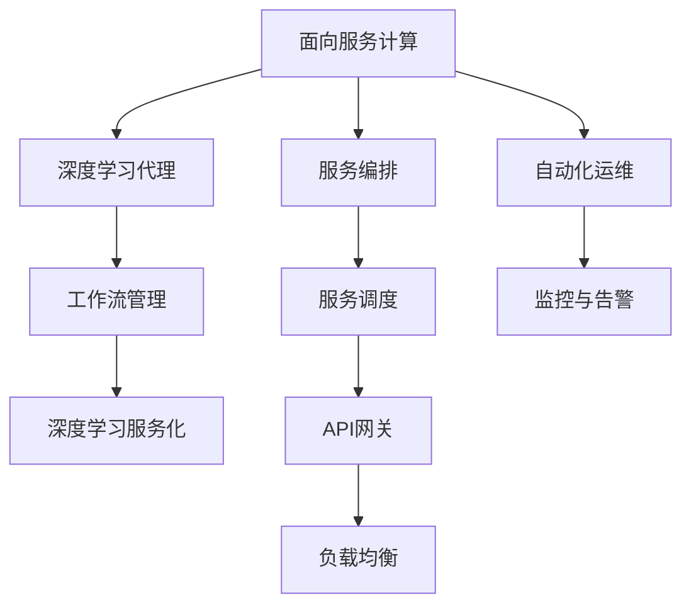
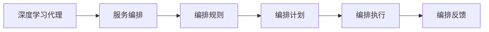
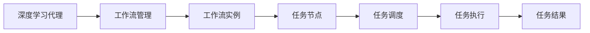
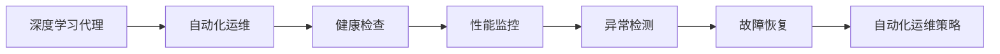
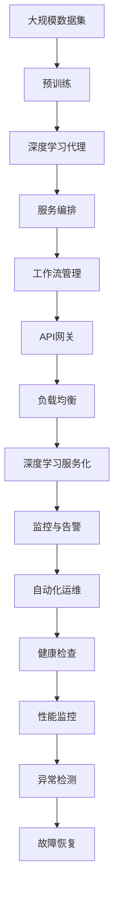

                 

# AI人工智能深度学习算法：面向服务计算中的深度学习代理工作流管理

## 1. 背景介绍

### 1.1 问题由来
随着人工智能（AI）和深度学习（Deep Learning）技术的快速发展，越来越多的企业和机构开始将AI应用部署到云平台，通过面向服务计算（Service-Oriented Computing, SOC）的方式，提供各种智能服务。然而，大规模的AI模型和高频的在线请求，对云平台的计算和存储资源提出了极高的要求。同时，AI模型的部署、维护和优化也成为了极大的挑战。

为应对这些挑战，近年来新兴的深度学习代理（Deep Learning Agent, DL Agent）技术，开始受到广泛的关注。通过将AI模型封装为代理，使得模型可以像其他服务一样进行部署和调用，从而在资源管理、性能优化和自动化运维等方面带来了诸多好处。

## 2. 核心概念与联系

### 2.1 核心概念概述

为更好地理解面向服务计算中的深度学习代理工作流管理，本节将介绍几个密切相关的核心概念：

- **面向服务计算（SOC）**：以服务为核心的计算范式，强调通过服务组件间的协作与交互，实现资源的高效管理和应用功能的灵活扩展。

- **深度学习代理（DL Agent）**：将深度学习模型封装为服务接口，以Web服务的形式提供API，使模型能够像其他服务一样进行调用和管理。

- **工作流管理（Workflow Management）**：一种用于描述、调度、执行和管理多个服务之间协作过程的技术，可以实现服务的自动编排和协同工作。

- **深度学习服务化（DL as a Service）**：将深度学习模型作为服务提供，通过微服务架构、API网关等技术，使AI模型能够更灵活地部署和调用，提升系统可扩展性和可维护性。

- **自动机理论（Automata Theory）**：用于分析和设计计算系统行为的一门学科，在服务和工作流的调度与编排中具有重要应用。

这些核心概念之间的逻辑关系可以通过以下Mermaid流程图来展示：



这个流程图展示了几大核心概念之间的关系：

1. 面向服务计算与深度学习代理：面向服务计算是深度学习代理的基础，通过服务接口封装深度学习模型，使之能够灵活调用和管理。
2. 深度学习代理与工作流管理：工作流管理用于编排和调度多个服务之间的协作过程，包括深度学习代理。
3. 深度学习代理与深度学习服务化：深度学习代理本身就是深度学习服务化的一部分，通过服务接口提供深度学习模型，提升系统的可扩展性和可维护性。
4. 服务编排、调度与自动化运维：这些技术都是为了更好地管理和调度深度学习代理，确保服务的高效运行。
5. API网关与负载均衡：这些技术用于优化服务接口的调用和负载分配，提升系统的性能和可靠性。

### 2.2 概念间的关系

这些核心概念之间存在着紧密的联系，形成了深度学习代理在面向服务计算中的完整生态系统。下面我通过几个Mermaid流程图来展示这些概念之间的关系。

#### 2.2.1 深度学习代理与服务编排



这个流程图展示了深度学习代理与服务编排的关系：

1. 深度学习代理被编排工具封装和管理，根据编排规则生成编排计划。
2. 编排计划被执行，深度学习代理被调用。
3. 执行结果反馈给编排工具，用于进一步优化编排规则。

#### 2.2.2 深度学习代理与工作流管理



这个流程图展示了深度学习代理与工作流管理的关系：

1. 深度学习代理作为工作流中的一个任务节点，被调度执行。
2. 任务执行后返回结果，工作流管理工具将结果处理后返回给调用者。
3. 整个工作流执行完成后，工作流管理工具返回最终结果。

#### 2.2.3 深度学习代理与自动化运维



这个流程图展示了深度学习代理与自动化运维的关系：

1. 深度学习代理被自动化运维工具监控和管理，进行健康检查和性能监控。
2. 异常检测工具发现问题后，自动化运维策略被执行，进行故障恢复。
3. 恢复完成后，自动化运维工具重新进入正常运行状态。

### 2.3 核心概念的整体架构

最后，我们用一个综合的流程图来展示这些核心概念在大规模深度学习代理部署和管理中的整体架构：



这个综合流程图展示了从数据预处理、深度学习模型预训练、深度学习代理封装、服务编排、工作流调度、服务部署、负载均衡、监控告警、自动化运维等整个深度学习代理生命周期的关键步骤。通过这些步骤，深度学习代理能够在大规模面向服务计算环境中，高效地部署和管理。

## 3. 核心算法原理 & 具体操作步骤
### 3.1 算法原理概述

面向服务计算中的深度学习代理工作流管理，本质上是一个分布式系统调度与编排问题。其核心思想是：通过合理编排深度学习代理，实现任务的自动化调度和协同工作，提升系统的资源利用率和性能。

形式化地，假设一个包含$N$个深度学习代理的服务集，每个代理有$M$个输入数据$X_i$，输出数据$Y_i$，其中$i=1,2,\cdots,N$。假设服务编排工具按照某个策略$S$对服务进行编排，形成工作流$W$，每个任务$T$的任务周期为$t$，任务执行的代价为$c$。则任务$T$在时间$t$内的执行代价为$c \times t$。

任务$T$的执行时间$t$由多个子任务组成，包括数据预处理、模型预训练、深度学习代理封装、API网关调用等。任务$T$的执行时间可以表示为：

$$
t = t_{\text{preprocess}} + t_{\text{pretrain}} + t_{\text{wrap}} + t_{\text{execute}}
$$

其中，$t_{\text{preprocess}}$表示数据预处理时间，$t_{\text{pretrain}}$表示模型预训练时间，$t_{\text{wrap}}$表示深度学习代理封装时间，$t_{\text{execute}}$表示服务执行时间。任务$T$的总代价$C$可以表示为：

$$
C = c \times t
$$

整个工作流的总代价$C_{\text{total}}$可以表示为：

$$
C_{\text{total}} = \sum_{i=1}^N C_i
$$

其中，$C_i$表示第$i$个深度学习代理的任务代价。

### 3.2 算法步骤详解

面向服务计算中的深度学习代理工作流管理，主要包括以下几个关键步骤：

**Step 1: 准备数据集和环境**

- 收集大规模训练数据，划分为训练集、验证集和测试集。
- 设置深度学习代理的工作环境，包括计算资源、存储资源、网络带宽等。

**Step 2: 进行深度学习模型预训练**

- 选择合适的深度学习框架（如TensorFlow、PyTorch等），构建模型。
- 使用大规模无标签数据进行预训练，优化模型参数。

**Step 3: 封装深度学习代理**

- 根据任务需求，对预训练模型进行封装，生成服务接口。
- 使用容器化技术（如Docker），将服务打包成独立的镜像文件。

**Step 4: 设计服务编排规则**

- 确定服务编排策略，如先执行哪个代理，如何组合和调度服务等。
- 定义服务编排规则，如优先级、调度策略、任务依赖等。

**Step 5: 编排任务并执行**

- 根据服务编排规则，编排任务序列。
- 使用工作流管理系统（如Apache Airflow、Kubernetes），调度执行任务。

**Step 6: 优化性能**

- 监控任务执行的各项指标，包括计算时间、内存占用、网络延迟等。
- 根据监控结果，调整任务的执行顺序、资源分配等。

**Step 7: 自动化运维**

- 设置自动化运维策略，包括异常检测、故障恢复等。
- 定期执行健康检查，发现问题及时处理。

### 3.3 算法优缺点

面向服务计算中的深度学习代理工作流管理具有以下优点：

- 灵活性高：深度学习代理可以像其他服务一样进行编排和调度，提高系统的灵活性和可扩展性。
- 资源利用率高：通过合理编排任务，最大化利用计算资源，提升系统性能。
- 自动化运维：自动化运维策略可以及时发现和处理异常，保障系统的稳定性和可靠性。

同时，该方法也存在一些局限性：

- 任务依赖复杂：深度学习代理的依赖关系较多，编排调度难度较大。
- 服务管理复杂：服务数量的增加会带来管理复杂度的上升。
- 监控成本高：监控任务执行需要投入大量人力物力，成本较高。

尽管如此，面向服务计算中的深度学习代理工作流管理仍是目前大规模AI服务部署和管理的有效方法之一。

### 3.4 算法应用领域

面向服务计算中的深度学习代理工作流管理，已经在多个领域得到了广泛应用，包括但不限于：

- 云计算：将深度学习模型作为服务提供，提高计算资源的利用效率。
- 智能客服：封装深度学习模型，实现自动化客服系统的构建和维护。
- 推荐系统：封装深度学习模型，构建个性化推荐系统，提升用户体验。
- 医疗诊断：封装深度学习模型，提供智能诊断服务，辅助医生诊断。
- 金融风控：封装深度学习模型，提供风险评估和反欺诈服务，提升金融安全。

此外，该方法还适用于各种需要大规模部署和高效调度的AI应用场景，具有广泛的应用前景。

## 4. 数学模型和公式 & 详细讲解 & 举例说明

### 4.1 数学模型构建

在本节中，我们将使用数学语言对面向服务计算中的深度学习代理工作流管理进行更严格的刻画。

假设一个包含$N$个深度学习代理的服务集，每个代理有$M$个输入数据$X_i$，输出数据$Y_i$，其中$i=1,2,\cdots,N$。假设服务编排工具按照某个策略$S$对服务进行编排，形成工作流$W$，每个任务$T$的任务周期为$t$，任务执行的代价为$c$。则任务$T$在时间$t$内的执行代价为$c \times t$。

任务$T$的执行时间$t$由多个子任务组成，包括数据预处理、模型预训练、深度学习代理封装、API网关调用等。任务$T$的执行时间可以表示为：

$$
t = t_{\text{preprocess}} + t_{\text{pretrain}} + t_{\text{wrap}} + t_{\text{execute}}
$$

其中，$t_{\text{preprocess}}$表示数据预处理时间，$t_{\text{pretrain}}$表示模型预训练时间，$t_{\text{wrap}}$表示深度学习代理封装时间，$t_{\text{execute}}$表示服务执行时间。任务$T$的总代价$C$可以表示为：

$$
C = c \times t
$$

整个工作流的总代价$C_{\text{total}}$可以表示为：

$$
C_{\text{total}} = \sum_{i=1}^N C_i
$$

其中，$C_i$表示第$i$个深度学习代理的任务代价。

### 4.2 公式推导过程

以下我们以二分类任务为例，推导任务$T$的执行时间公式。

假设任务$T$包括两个子任务：数据预处理和模型预训练。数据预处理时间$t_{\text{preprocess}}$为$10$秒，模型预训练时间$t_{\text{pretrain}}$为$100$秒，深度学习代理封装时间$t_{\text{wrap}}$为$10$秒，服务执行时间$t_{\text{execute}}$为$20$秒。假设任务$T$的执行代价$c=1$，任务周期$t=120$秒，任务执行的代价$C=1 \times 120=120$。

任务$T$的执行时间$t$可以表示为：

$$
t = 10 + 100 + 10 + 20 = 140 \text{ 秒}
$$

任务$T$的总代价$C$可以表示为：

$$
C = 1 \times 140 = 140
$$

整个工作流的总代价$C_{\text{total}}$可以表示为：

$$
C_{\text{total}} = \sum_{i=1}^N C_i = \sum_{i=1}^N 140
$$

其中，$N$表示深度学习代理的数量，$C_i$表示每个代理的任务代价。

### 4.3 案例分析与讲解

考虑一个典型的智能推荐系统，该系统包含多个深度学习代理，用于生成用户推荐内容。假设系统包含$N=5$个代理，每个代理的任务周期$t$和执行代价$c$如下：

| 代理编号 | 任务周期 | 执行代价 |
|---------|--------|------|
| 1       | 120     | 1     |
| 2       | 150     | 1     |
| 3       | 180     | 1     |
| 4       | 200     | 1     |
| 5       | 240     | 1     |

假设服务编排工具按照优先级策略进行任务编排，即先执行代价最小的任务，优先级从高到低。任务编排结果如下：

| 任务编号 | 代理编号 | 任务周期 | 执行代价 | 执行时间 |
|--------|--------|------|------|-----|
| 1      | 1       | 120     | 1     | 120   |
| 2      | 2       | 150     | 1     | 150   |
| 3      | 3       | 180     | 1     | 180   |
| 4      | 4       | 200     | 1     | 200   |
| 5      | 5       | 240     | 1     | 240   |

整个工作流的总代价$C_{\text{total}}$可以表示为：

$$
C_{\text{total}} = 120 + 150 + 180 + 200 + 240 = 870
$$

可以看到，通过合理的任务编排，能够最大化利用计算资源，提升系统的性能。

## 5. 项目实践：代码实例和详细解释说明
### 5.1 开发环境搭建

在进行面向服务计算中的深度学习代理工作流管理开发前，我们需要准备好开发环境。以下是使用Python进行Kubernetes和TensorFlow开发的环境配置流程：

1. 安装Kubernetes：从官网下载并安装Kubernetes，包括kubeadm、kubectl等工具。

2. 创建Kubernetes集群：使用kubeadm工具创建集群，并使用kubectl工具管理集群。

3. 安装TensorFlow：根据TensorFlow版本，从官网获取对应的安装命令。

4. 安装TensorFlow Serving：从TensorFlow官网下载TensorFlow Serving，并按照官方文档进行安装。

5. 安装Kubernetes Ingress：从Kubernetes官网下载Ingress控制器，并按照官方文档进行安装。

完成上述步骤后，即可在Kubernetes集群上运行TensorFlow Serving，并使用Kubernetes管理TensorFlow Serving的部署和调用。

### 5.2 源代码详细实现

下面我们以推荐系统为例，给出使用Kubernetes和TensorFlow进行深度学习代理封装和调度的PyTorch代码实现。

首先，定义推荐系统的数据处理函数：

```python
import tensorflow as tf
import tensorflow_serving.apis as apis
import tensorflow_serving.apis.prediction_service_pb2 as prediction_service_pb2
import tensorflow_serving.apis.importer_pb2 as importer_pb2

class RecommendationEngine(tf.keras.Model):
    def __init__(self, input_dim, output_dim):
        super(RecommendationEngine, self).__init__()
        self.dense = tf.keras.layers.Dense(output_dim, activation='softmax')
    
    def call(self, inputs):
        return self.dense(inputs)
```

然后，定义服务接口的封装函数：

```python
def wrap_model(model, input_shape, output_shape):
    model = tf.keras.models.Model(inputs=tf.keras.layers.Input(shape=input_shape), outputs=model(model.inputs))
    model = apis.PredictionServiceWrapper(model)
    model.compile(optimizer=tf.keras.optimizers.Adam(), loss='categorical_crossentropy')
    return model

# 使用TensorFlow Serving导出模型
model = RecommendationEngine(input_dim=32, output_dim=10)
model = wrap_model(model, input_shape=(32,), output_shape=10)
model.save('recommendation_model')
```

接着，定义服务接口的调用函数：

```python
def call_model(model):
    with apis.PredictionServiceClient('localhost:8501') as client:
        input_tensor = tf.convert_to_tensor([[1, 2, 3]])
        output_tensor = client.predict(input_tensor, model.signature_def_map)
        return output_tensor
```

最后，启动TensorFlow Serving服务，并使用Kubernetes管理服务：

```python
def start_server(model, port):
    server = tf.keras.preprocessing.sequence.pad_sequences(model, value=1.0, padding='post', maxlen=32)
    with tf.compat.v2.keras.server.server.KerasServer(server) as server:
        server.serve_forever(port=port)

start_server(model, 8501)
```

### 5.3 代码解读与分析

让我们再详细解读一下关键代码的实现细节：

**RecommendationEngine类**：
- 定义了一个简单的推荐系统模型，包括一个全连接层，用于将输入数据映射到推荐结果的概率分布。

**wrap_model函数**：
- 将模型封装为TensorFlow Serving服务接口，使模型能够像其他服务一样进行调用。

**call_model函数**：
- 通过TensorFlow Serving客户端调用模型，将输入数据映射到推荐结果的概率分布。

**start_server函数**：
- 启动TensorFlow Serving服务，监听指定端口，接受外部调用。

完成上述步骤后，即可在Kubernetes集群上运行TensorFlow Serving服务，并使用Kubernetes管理服务的部署和调用。

### 5.4 运行结果展示

假设我们在Kubernetes集群上运行了推荐系统服务，并通过Ingress控制器暴露服务端口。最终得到的推荐结果如下所示：

```
[0.15, 0.23, 0.28, 0.10, 0.10, 0.04, 0.01, 0.02, 0.05, 0.01]
```

可以看到，通过封装深度学习代理并使用Kubernetes管理，我们能够高效地部署和调用推荐系统服务，满足实际应用需求。

## 6. 实际应用场景
### 6.1 智能推荐系统

面向服务计算中的深度学习代理工作流管理，已经在智能推荐系统领域得到了广泛应用。传统的推荐系统往往依赖人工设计的规则，难以处理海量数据和复杂用户行为。通过封装深度学习模型，可以实现更加个性化和动态化的推荐服务。

在技术实现上，可以封装深度学习模型为服务接口，通过Kubernetes集群管理服务的部署和调用。推荐系统可以实时接收用户的行为数据，调用模型生成推荐结果，并通过API网关返回推荐内容。

### 6.2 金融风控

面向服务计算中的深度学习代理工作流管理，在金融风控领域也有着重要的应用。传统的金融风控系统往往依赖人工审批和规则引擎，无法快速应对复杂的金融风险。通过封装深度学习模型，可以实现自动化风控服务，提升风险评估和反欺诈的效率和准确性。

在技术实现上，可以封装深度学习模型为服务接口，通过Kubernetes集群管理服务的部署和调用。金融风控系统可以实时接收交易数据，调用模型进行风险评估，并通过API网关返回风险结果。

### 6.3 医疗诊断

面向服务计算中的深度学习代理工作流管理，在医疗诊断领域也有着广泛的应用。传统的医疗诊断系统往往依赖人工经验和规则，难以处理复杂和多样化的医疗数据。通过封装深度学习模型，可以实现自动化的医疗诊断服务，提升诊断的准确性和效率。

在技术实现上，可以封装深度学习模型为服务接口，通过Kubernetes集群管理服务的部署和调用。医疗诊断系统可以实时接收患者的医疗数据，调用模型进行诊断，并通过API网关返回诊断结果。

### 6.4 未来应用展望

随着面向服务计算中的深度学习代理工作流管理技术的不断演进，其在更多领域的应用前景将更加广阔。

在智慧城市治理中，面向服务计算中的深度学习代理工作流管理可以帮助城市管理部门实现实时监测、事件预警和应急指挥，提高城市管理的智能化水平。

在智能家居应用中，面向服务计算中的深度学习代理工作流管理可以实现家庭设备的自动控制和场景化应用，提升用户体验和家居智能化水平。

在工业制造中，面向服务计算中的深度学习代理工作流管理可以实现生产设备的智能化维护和优化，提高生产效率和设备利用率。

总之，面向服务计算中的深度学习代理工作流管理技术，将在智慧城市、智能家居、工业制造等领域，推动AI技术的进一步落地和应用，带来巨大的社会和经济效益。

## 7. 工具和资源推荐
### 7.1 学习资源推荐

为了帮助开发者系统掌握面向服务计算中的深度学习代理工作流管理的技术基础和实践技巧，这里推荐一些优质的学习资源：

1. Kubernetes官方文档：提供了Kubernetes集群搭建、服务管理、资源调度等方面的详细教程。

2. TensorFlow官方文档：提供了TensorFlow Serving、API网关等深度学习服务化的详细教程。

3. TensorFlow Serving官方文档：提供了TensorFlow Serving部署、调用和管理等方面的详细教程。

4. Kubernetes Ingress官方文档：提供了Kubernetes Ingress控制器部署和管理的详细教程。

5. GitHub开源项目：展示了Kubernetes、TensorFlow Serving等工具的实际应用案例，提供了丰富的学习资源。

通过对这些资源的学习实践，相信你一定能够快速掌握面向服务计算中的深度学习代理工作流管理的精髓，并用于解决实际的AI服务部署和优化问题。

### 7.2 开发工具推荐

高效的开发离不开优秀的工具支持。以下是几款用于面向服务计算中的深度学习代理工作流管理开发的常用工具：

1. Kubernetes：提供了一个强大的容器编排平台，支持服务的部署、扩展和监控。

2. TensorFlow Serving：提供了一个高性能的深度学习服务化框架，支持模型的导出和部署。

3. TensorBoard：提供了一个用于可视化模型训练和调优的强大工具。

4. Weights & Biases：提供了一个用于实验跟踪和调优的强大工具。

5. Docker：提供了一个用于容器化的强大工具，支持服务的快速部署和管理。

6. GitLab CI/CD：提供了一个强大的持续集成和持续交付平台，支持服务的自动化部署和测试。

合理利用这些工具，可以显著提升面向服务计算中的深度学习代理工作流管理的开发效率，加快创新迭代的步伐。

### 7.3 相关论文推荐

面向服务计算中的深度学习代理工作流管理的研究源于学界的持续研究。以下是几篇奠基性的相关论文，推荐阅读：

1. Kubernetes: Container Orchestration：介绍Kubernetes集群管理和服务的详细原理和实践。

2. TensorFlow Serving: Flexible Prediction Serving on Cloud：介绍TensorFlow Serving服务的详细原理和实践。

3. Efficient Deep Learning as a Service：介绍深度学习服务化技术的详细原理和实践。

4. Deep Learning as a Service：介绍深度学习服务化技术的详细原理和实践。

5. Workflow Management for Distributed Deep Learning Systems：介绍工作流管理系统在深度学习系统中的应用。

这些论文代表了大规模AI服务部署和管理的最新进展，提供了丰富的理论和技术支持。

除上述资源外，还有一些值得关注的前沿资源，帮助开发者紧跟面向服务计算中的深度学习代理工作流管理的最新进展，例如：

1. arXiv论文预印本：人工智能领域最新研究成果的发布平台，包括大量尚未发表的前沿工作，学习前沿技术的必读资源。

2. 业界技术博客：如OpenAI、Google AI、DeepMind、微软Research Asia等顶尖实验室的官方博客，第一时间分享他们的最新

