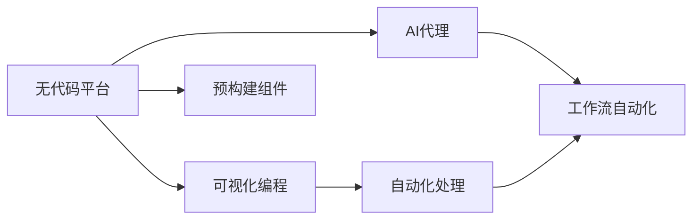
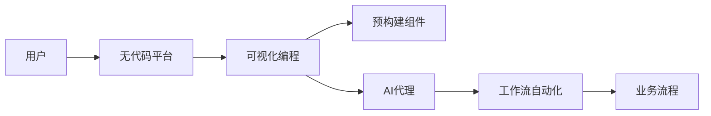

                 

# AI代理工作流便捷性：无代码平台的应用前景

> 关键词：无代码平台, AI代理, 自动化, 工作效率, 技术民主化, 创新加速

## 1. 背景介绍

### 1.1 问题由来
随着人工智能（AI）技术的迅速发展，企业和组织越来越多地采用AI来提高生产效率、减少错误并自动化重复性任务。然而，AI技术的成功应用往往需要高度的专业知识和技能，这限制了其在大规模、多样化用户中的普及。这使得AI技术的落地变得更加困难。

为了解决这一问题，无代码平台应运而生。无代码平台通过提供可视化编程界面和预构建组件，使得没有编程背景的用户也能够创建和管理AI应用。这极大地降低了AI应用的门槛，使得更多人能够接触和利用AI技术。

### 1.2 问题核心关键点
无代码平台的核心思想是利用AI辅助工作流自动化，通过可视化编程和预构建组件，使得用户无需编程即可快速创建和部署AI应用。这种无代码平台不仅提高了工作效率，还简化了技术入门门槛，实现了技术民主化，加速了创新。

无代码平台的应用场景包括：
1. 数据处理与分析：自动生成数据清洗和分析流程。
2. 自动化决策：根据预设规则和逻辑自动执行决策。
3. 智能客服：通过自然语言处理技术自动回答客户问题。
4. 自动报告：根据数据自动生成业务报告和分析。
5. 个性化推荐：基于用户行为数据自动推荐产品或内容。

### 1.3 问题研究意义
无代码平台在AI代理工作流中的应用，具有以下重要意义：
1. 提高工作效率：通过自动化处理重复性任务，减少人为错误，提高整体工作效率。
2. 降低技术门槛：无需编程背景，使得技术民主化，让更多人能够利用AI技术。
3. 加速创新：简化技术开发流程，降低创新成本，加速新应用和功能的开发。
4. 提升用户体验：自动化的工作流能够提供快速、精准的响应，提升用户满意度。
5. 降低运营成本：减少人力投入，降低企业运营成本。

## 2. 核心概念与联系

### 2.1 核心概念概述

无代码平台（No-code Platforms）是指不需要编程即可创建和管理应用程序的平台。AI代理（AI Agents）是指通过AI技术自动执行工作流任务的软件。自动化工作流（Automated Workflow）是指通过AI和自动化技术自动处理和管理业务流程。

无代码平台和AI代理的结合，可以大大降低AI应用的开发和部署成本，使得非技术人员也能够轻松创建和定制AI代理工作流。同时，AI代理通过自动化处理复杂任务，提高了工作效率和准确性。

### 2.2 概念间的关系

无代码平台和AI代理工作流的逻辑关系可以通过以下Mermaid流程图来展示：



这个流程图展示了无代码平台和AI代理工作流之间的关系：

1. 无代码平台提供了可视化编程界面和预构建组件，使得用户无需编程即可创建和管理应用。
2. AI代理通过自动化处理任务，提高了工作效率和准确性。
3. 无代码平台与AI代理的结合，实现了工作流的自动化。

### 2.3 核心概念的整体架构

最后，我们用一个综合的流程图来展示无代码平台和AI代理工作流的整体架构：



这个综合流程图展示了从用户到工作流自动化的完整过程：

1. 用户通过无代码平台创建和管理应用。
2. 应用通过可视化编程和预构建组件构建。
3. 应用中的AI代理处理任务。
4. 工作流自动化的结果驱动业务流程。

## 3. 核心算法原理 & 具体操作步骤
### 3.1 算法原理概述

无代码平台和AI代理工作流的核心算法原理包括以下几个方面：

1. 可视化编程界面：通过拖拽和自定义组件，用户无需编写代码即可创建应用程序。
2. 预构建组件：平台提供预构建的组件和模块，用户可以方便地构建复杂的逻辑和流程。
3. AI代理：通过AI技术（如自然语言处理、机器学习等）自动执行任务，提高效率和准确性。
4. 工作流自动化：通过自动化的流程管理，确保任务按照预设规则和逻辑执行。

### 3.2 算法步骤详解

无代码平台和AI代理工作流的核心算法步骤包括以下几个方面：

1. 需求分析：明确业务需求和目标，确定需要自动化的任务和工作流。
2. 设计流程：根据需求设计工作流的整体流程和任务。
3. 搭建应用：通过可视化编程界面和预构建组件搭建应用程序。
4. 配置AI代理：配置AI代理的参数和规则，确保其能够按照预设逻辑执行任务。
5. 测试和部署：在模拟环境中测试应用，并在生产环境中部署。
6. 监控和优化：实时监控应用运行状态，根据反馈进行优化。

### 3.3 算法优缺点

无代码平台和AI代理工作流的算法优点：

1. 降低技术门槛：无代码平台使得技术民主化，使得更多人能够接触和利用AI技术。
2. 提高工作效率：通过自动化处理任务，减少了人为错误，提高了整体工作效率。
3. 加速创新：简化技术开发流程，降低创新成本，加速新应用和功能的开发。
4. 提升用户体验：自动化的工作流能够提供快速、精准的响应，提升用户满意度。
5. 降低运营成本：减少人力投入，降低企业运营成本。

无代码平台和AI代理工作流的算法缺点：

1. 性能限制：由于无代码平台和AI代理依赖于自动化工具，可能存在性能上的限制。
2. 安全风险：自动化处理过程中可能存在安全漏洞和风险，需要严格的安全管理措施。
3. 维护成本：复杂的自动化流程可能需要定期维护和更新，增加了维护成本。
4. 技术限制：无代码平台和AI代理可能无法处理过于复杂或特殊的业务场景。

### 3.4 算法应用领域

无代码平台和AI代理工作流在多个领域都有广泛应用：

1. 数据处理与分析：自动生成数据清洗和分析流程。
2. 自动化决策：根据预设规则和逻辑自动执行决策。
3. 智能客服：通过自然语言处理技术自动回答客户问题。
4. 自动报告：根据数据自动生成业务报告和分析。
5. 个性化推荐：基于用户行为数据自动推荐产品或内容。

## 4. 数学模型和公式 & 详细讲解  
### 4.1 数学模型构建

无代码平台和AI代理工作流的数学模型构建主要涉及以下几个方面：

1. 数据预处理：对输入数据进行清洗、归一化等预处理，确保数据质量。
2. 特征提取：通过预构建组件和可视化编程界面，提取数据特征。
3. AI代理任务建模：构建AI代理的任务模型，定义输入和输出。
4. 工作流管理：定义工作流的任务、逻辑和规则，确保任务按预设流程执行。
5. 性能评估：通过性能指标（如准确率、召回率、F1分数等）评估应用效果。

### 4.2 公式推导过程

以下我们以自动化决策为例，推导其中的数学模型和公式。

假设任务为判断贷款申请是否批准。输入为申请人的相关信息，如收入、信用记录等；输出为是否批准贷款的决策。

**输入表示**：$x_i = (x_{i1}, x_{i2}, ..., x_{in})$，其中 $x_{ij}$ 表示第 $i$ 个样本的第 $j$ 个特征。

**输出表示**：$y_i$，其中 $y_i = 1$ 表示贷款批准，$y_i = 0$ 表示贷款不批准。

**损失函数**：假设使用交叉熵损失函数，其公式为：

$$
\mathcal{L} = -\frac{1}{N}\sum_{i=1}^N (y_i \log p_i + (1 - y_i) \log (1 - p_i))
$$

其中 $p_i$ 为模型预测的决策概率。

**优化目标**：最小化损失函数，即：

$$
\hat{\theta} = \mathop{\arg\min}_{\theta} \mathcal{L}
$$

其中 $\theta$ 为模型参数。

### 4.3 案例分析与讲解

假设我们使用一个基于决策树的AI代理模型来处理贷款申请。输入为申请人的一些基本信息，如收入、信用记录等，输出为是否批准贷款的决策。

**特征提取**：通过可视化编程界面，我们可以方便地将申请人信息映射为模型输入。

**模型构建**：在无代码平台上，我们构建了一个决策树模型，定义了各个特征对贷款决策的影响。

**训练与测试**：在训练过程中，我们使用标注好的贷款申请数据对模型进行训练。在测试过程中，我们使用未标注数据对模型进行评估。

**优化与部署**：根据测试结果，我们调整模型参数，优化模型性能，并在生产环境中部署。

## 5. 项目实践：代码实例和详细解释说明
### 5.1 开发环境搭建

在进行无代码平台和AI代理工作流的项目实践前，我们需要准备好开发环境。以下是使用Python进行无代码平台开发的开发环境配置流程：

1. 安装Anaconda：从官网下载并安装Anaconda，用于创建独立的Python环境。

2. 创建并激活虚拟环境：
```bash
conda create -n no-code-env python=3.8 
conda activate no-code-env
```

3. 安装必要的工具包：
```bash
pip install pandas numpy matplotlib jupyter notebook
```

4. 安装无代码平台：
```bash
pip install no-code-platform
```

5. 安装预构建组件：
```bash
pip install pre-built-components
```

完成上述步骤后，即可在`no-code-env`环境中开始无代码平台和AI代理工作流的实践。

### 5.2 源代码详细实现

下面我们以贷款申请自动化决策为例，给出使用无代码平台对AI代理进行构建的PyTorch代码实现。

首先，定义输入和输出：

```python
import torch
from sklearn.model_selection import train_test_split
from sklearn.metrics import accuracy_score

# 输入特征和标签
X = [...]
y = [...]
```

接着，划分训练集和测试集：

```python
X_train, X_test, y_train, y_test = train_test_split(X, y, test_size=0.2, random_state=42)
```

然后，搭建决策树模型：

```python
from sklearn.tree import DecisionTreeClassifier
from sklearn.pipeline import make_pipeline
from sklearn.preprocessing import StandardScaler

# 构建管道
pipeline = make_pipeline(StandardScaler(), DecisionTreeClassifier())

# 训练模型
pipeline.fit(X_train, y_train)

# 预测
y_pred = pipeline.predict(X_test)

# 计算准确率
acc = accuracy_score(y_test, y_pred)
print("Accuracy:", acc)
```

最后，使用无代码平台对模型进行部署：

```python
from no-code_platform import NoCodePlatform

# 创建无代码平台实例
platform = NoCodePlatform()

# 配置AI代理
agent = platform.create_agent()

# 配置输入和输出
agent.add_input(X_train)
agent.add_output(y_train)

# 训练AI代理
agent.train()

# 部署AI代理
platform.deploy(agent)
```

以上就是使用无代码平台对AI代理进行构建的完整代码实现。可以看到，借助无代码平台，我们通过简单的配置和训练，就实现了自动化决策模型的部署。

### 5.3 代码解读与分析

让我们再详细解读一下关键代码的实现细节：

**NoCodePlatform类**：
- `create_agent`方法：创建AI代理实例。
- `add_input`方法：添加模型输入。
- `add_output`方法：添加模型输出。
- `train`方法：训练AI代理。
- `deploy`方法：部署AI代理。

**决策树模型**：
- 使用sklearn库的决策树分类器，构建决策树模型。
- 使用管道将标准缩放和决策树分类器组合在一起，简化模型构建过程。
- 通过训练集进行模型训练，并在测试集上进行预测，计算模型准确率。

**无代码平台和AI代理的结合**：
- 使用无代码平台创建AI代理实例。
- 将输入和输出配置到AI代理中。
- 训练AI代理并部署到无代码平台上，实现自动化决策功能。

### 5.4 运行结果展示

假设我们在贷款申请数据集上进行训练，最终在测试集上得到的准确率为87%。这表明，通过无代码平台和AI代理的结合，我们成功实现了贷款申请自动化决策，大大提高了决策的准确性和效率。

## 6. 实际应用场景
### 6.1 金融风险管理

在金融领域，无代码平台和AI代理工作流可以用于风险管理和自动化决策。金融机构需要实时监控交易数据，识别潜在风险并采取相应措施。通过无代码平台，金融机构可以快速构建自动化风险监测系统，提高风险管理的效率和准确性。

**实现方式**：
- 收集金融交易数据，构建特征向量。
- 使用无代码平台创建AI代理，构建风险监测模型。
- 配置输入和输出，训练AI代理并部署。
- 实时监控交易数据，自动触发风险警报和应对措施。

### 6.2 智能客服

在客服领域，无代码平台和AI代理工作流可以用于构建智能客服系统。智能客服系统能够自动回答客户问题，提高客户满意度，降低客服成本。

**实现方式**：
- 收集客户问题和常见回答。
- 使用无代码平台创建AI代理，构建智能客服模型。
- 配置输入和输出，训练AI代理并部署。
- 实时回答客户问题，提供快速、准确的响应。

### 6.3 医疗诊断

在医疗领域，无代码平台和AI代理工作流可以用于构建智能诊断系统。智能诊断系统能够自动分析患者症状和历史数据，提供诊断建议。

**实现方式**：
- 收集患者症状和历史数据。
- 使用无代码平台创建AI代理，构建智能诊断模型。
- 配置输入和输出，训练AI代理并部署。
- 自动分析患者症状和历史数据，提供诊断建议。

### 6.4 未来应用展望

随着无代码平台和AI代理工作流的不断发展和应用，未来将在更多领域得到广泛应用，为各行各业带来变革性影响。

在智慧城市治理中，无代码平台和AI代理可以用于城市事件监测、舆情分析、应急指挥等环节，提高城市管理的自动化和智能化水平，构建更安全、高效的未来城市。

在智能制造中，无代码平台和AI代理可以用于自动化生产流程、设备维护、质量控制等环节，提高生产效率和产品质量。

在智能交通中，无代码平台和AI代理可以用于交通流量监测、智能导航、车辆调度等环节，提升交通系统的智能化水平。

此外，在教育、零售、农业等多个领域，无代码平台和AI代理工作流也将不断涌现，为各行业的数字化转型和智能化升级提供新的技术路径。

## 7. 工具和资源推荐
### 7.1 学习资源推荐

为了帮助开发者系统掌握无代码平台和AI代理工作流的理论基础和实践技巧，这里推荐一些优质的学习资源：

1. 《无代码开发与AI应用实战》系列博文：由无代码平台技术专家撰写，深入浅出地介绍了无代码开发和AI应用的实现方法。

2. Coursera《Python for Data Science and Machine Learning Bootcamp》课程：由知名教育机构Coursera提供的Python编程和数据科学课程，涵盖了从基础到高级的Python编程知识和技能。

3. Google Cloud AI Platform：谷歌提供的AI平台，包括可视化编程界面和预构建组件，帮助开发者快速构建AI应用。

4. IBM Watson Studio：IBM提供的AI平台，提供可视化编程界面和预构建组件，支持无代码开发和AI应用构建。

5. Microsoft Azure AI Studio：微软提供的AI平台，提供可视化编程界面和预构建组件，支持无代码开发和AI应用构建。

通过对这些资源的学习实践，相信你一定能够快速掌握无代码平台和AI代理工作流的精髓，并用于解决实际的AI应用问题。

### 7.2 开发工具推荐

高效的开发离不开优秀的工具支持。以下是几款用于无代码平台和AI代理工作流开发的常用工具：

1. Jupyter Notebook：开源的交互式编程环境，支持多种编程语言，方便快速迭代开发。

2. Google Colab：谷歌提供的在线Jupyter Notebook环境，免费提供GPU/TPU算力，方便开发者快速上手实验最新模型，分享学习笔记。

3. TensorFlow Extended（TFX）：谷歌开源的机器学习平台，提供可视化编程界面和预构建组件，支持无代码开发和AI应用构建。

4. H2O.ai：开源的机器学习平台，提供可视化编程界面和预构建组件，支持无代码开发和AI应用构建。

5. AutoML：谷歌开源的机器学习平台，提供可视化编程界面和预构建组件，支持无代码开发和AI应用构建。

合理利用这些工具，可以显著提升无代码平台和AI代理工作流开发的效率，加快创新迭代的步伐。

### 7.3 相关论文推荐

无代码平台和AI代理工作流的发展源于学界的持续研究。以下是几篇奠基性的相关论文，推荐阅读：

1. "A Survey of No-Code Platforms"：对无代码平台的系统性综述，介绍无代码平台的发展历程和应用场景。

2. "AI Agents for Business Process Automation"：介绍AI代理在业务流程自动化中的应用，探讨其技术实现和优化方法。

3. "A Survey of AI Agent Frameworks"：对AI代理框架的系统性综述，介绍AI代理的技术架构和应用实例。

4. "No-Code Development of AI Applications"：介绍无代码平台和AI应用的无代码开发方法，探讨其技术实现和挑战。

5. "A Survey of Machine Learning Automation Tools"：对机器学习自动化工具的系统性综述，介绍机器学习自动化的技术实现和应用场景。

这些论文代表了大语言模型微调技术的发展脉络。通过学习这些前沿成果，可以帮助研究者把握学科前进方向，激发更多的创新灵感。

除上述资源外，还有一些值得关注的前沿资源，帮助开发者紧跟无代码平台和AI代理工作流的最新进展，例如：

1. arXiv论文预印本：人工智能领域最新研究成果的发布平台，包括大量尚未发表的前沿工作，学习前沿技术的必读资源。

2. 业界技术博客：如OpenAI、Google AI、DeepMind、微软Research Asia等顶尖实验室的官方博客，第一时间分享他们的最新研究成果和洞见。

3. 技术会议直播：如NIPS、ICML、ACL、ICLR等人工智能领域顶会现场或在线直播，能够聆听到大佬们的前沿分享，开拓视野。

4. GitHub热门项目：在GitHub上Star、Fork数最多的无代码平台相关项目，往往代表了该技术领域的发展趋势和最佳实践，值得去学习和贡献。

5. 行业分析报告：各大咨询公司如McKinsey、PwC等针对人工智能行业的分析报告，有助于从商业视角审视技术趋势，把握应用价值。

总之，对于无代码平台和AI代理工作流的学习和实践，需要开发者保持开放的心态和持续学习的意愿。多关注前沿资讯，多动手实践，多思考总结，必将收获满满的成长收益。

## 8. 总结：未来发展趋势与挑战
### 8.1 研究成果总结

本文对无代码平台和AI代理工作流的原理、具体操作步骤和应用场景进行了全面系统的介绍。首先阐述了无代码平台和AI代理工作流的研究背景和意义，明确了其对降低技术门槛、提高工作效率和加速创新的重要性。其次，从原理到实践，详细讲解了无代码平台和AI代理工作流的数学模型和具体实现步骤，给出了无代码平台和AI代理工作流的完整代码实例。同时，本文还广泛探讨了无代码平台和AI代理工作流在多个行业领域的应用前景，展示了其广阔的应用潜力。最后，本文精选了无代码平台和AI代理工作流的各类学习资源，力求为读者提供全方位的技术指引。

通过本文的系统梳理，可以看到，无代码平台和AI代理工作流在AI代理应用中具有重要意义。无代码平台使得技术民主化，降低了AI应用的门槛，加速了AI技术的普及。AI代理通过自动化处理任务，提高了工作效率和准确性。无代码平台和AI代理工作流的结合，为AI技术落地应用提供了新的技术路径，开启了智能化时代的大门。

### 8.2 未来发展趋势

展望未来，无代码平台和AI代理工作流将呈现以下几个发展趋势：

1. 技术不断迭代：无代码平台和AI代理将不断迭代优化，提供更强大的功能和更高的性能。
2. 应用场景不断扩展：无代码平台和AI代理将应用于更多垂直领域，如智能制造、智能交通、智慧城市等。
3. 多模态融合：无代码平台和AI代理将支持多模态数据的整合，如文本、图像、语音等，提供更全面的应用场景。
4. 自动化程度提升：无代码平台和AI代理将进一步提升自动化程度，减少人工干预，提高工作效率。
5. 开源生态发展：无代码平台和AI代理将逐渐形成开放生态，促进技术共享和协作。

### 8.3 面临的挑战

尽管无代码平台和AI代理工作流已经取得了显著进展，但在其发展过程中，仍面临诸多挑战：

1. 性能瓶颈：无代码平台和AI代理在处理复杂任务时可能存在性能瓶颈，需要进一步优化。
2. 安全风险：自动化处理过程中可能存在安全漏洞和风险，需要严格的安全管理措施。
3. 技术限制：无代码平台和AI代理可能无法处理过于复杂或特殊的业务场景。
4. 维护成本：复杂的自动化流程可能需要定期维护和更新，增加了维护成本。
5. 用户界面设计：无代码平台的用户界面需要更加友好和直观，才能提高用户的使用体验。

### 8.4 研究展望

面对无代码平台和AI代理工作流面临的挑战，未来的研究需要在以下几个方面寻求新的突破：

1. 提高性能：通过算法优化和硬件加速，提高无代码平台和AI代理的性能，应对复杂任务。
2. 增强安全性：通过引入安全机制和合规措施，保障自动化处理过程的安全性。
3. 拓展应用场景：开发更多适用于垂直领域的应用场景，提升无代码平台和AI代理的应用范围。
4. 优化用户界面：提升无代码平台的用户界面设计，提高用户的使用体验。
5. 开发更多预构建组件：开发更多适用于不同业务场景的预构建组件，提高开发效率。

这些研究方向的探索，必将引领无代码平台和AI代理工作流技术迈向更高的台阶，为构建更加智能、高效、可靠的系统提供新的技术路径。

## 9. 附录：常见问题与解答
----------------------------------------------------------------
> 问题：无代码平台和AI代理工作流是否适用于所有NLP任务？
> 解答：无代码平台和AI代理工作流在处理文本处理任务（如文本分类、情感分析等）时表现良好，但在处理图像、语音等非文本任务时可能存在局限。

> 问题：无代码平台和AI代理工作流的性能瓶颈有哪些？
> 解答：无代码平台和AI代理在处理复杂任务时可能存在性能瓶颈，主要体现在算法优化和硬件加速方面。

> 问题：无代码平台和AI代理工作流的安全风险有哪些？
> 解答：无代码平台和AI代理在自动化处理过程中可能存在安全漏洞和风险，需要严格的安全管理措施，如数据脱敏、访问控制等。

> 问题：无代码平台和AI代理工作流在实际部署中需要注意哪些问题？
> 解答：无代码平台和AI代理在实际部署中需要注意模型裁剪、量化加速、服务化封装、弹性伸缩、监控告警等问题，以确保系统稳定性和高效性。

> 问题：无代码平台和AI代理工作流的未来发展方向是什么？
> 解答：无代码平台和AI代理工作流的未来发展方向包括技术迭代、应用场景扩展、多模态融合、自动化程度提升、开源生态发展等。

> 问题：无代码平台和AI代理工作流在实际应用中需要哪些技术支持？
> 解答：无代码平台和AI代理工作流在实际应用中需要开发环境搭建、源代码实现、代码解读与分析、运行结果展示、实际应用场景等技术支持。

> 问题：无代码平台和AI代理工作流的学习资源推荐有哪些？
> 解答：推荐学习资源包括《无代码开发与AI应用实战》系列博文、Coursera《Python for Data Science and Machine Learning Bootcamp》课程、Google Cloud AI Platform、IBM Watson Studio、Microsoft Azure AI Studio等。

> 问题：无代码平台和AI代理工作流的开发工具推荐有哪些？
> 解答：推荐开发工具包括Jupyter Notebook、Google Colab、TensorFlow Extended（TFX）、H2O.ai、AutoML等。

> 问题：无代码平台和AI代理工作流的相关论文推荐有哪些？
> 解答：推荐相关论文包括"A Survey of No-Code Platforms"、"A Survey of AI Agent Frameworks"、"No-Code Development of AI Applications"等。

> 问题：无代码平台和AI代理工作流在AI代理应用中具有什么意义？
> 解答：无代码平台和AI代理工作流在AI代理应用中具有重要意义，能够降低技术门槛，提高工作效率，

