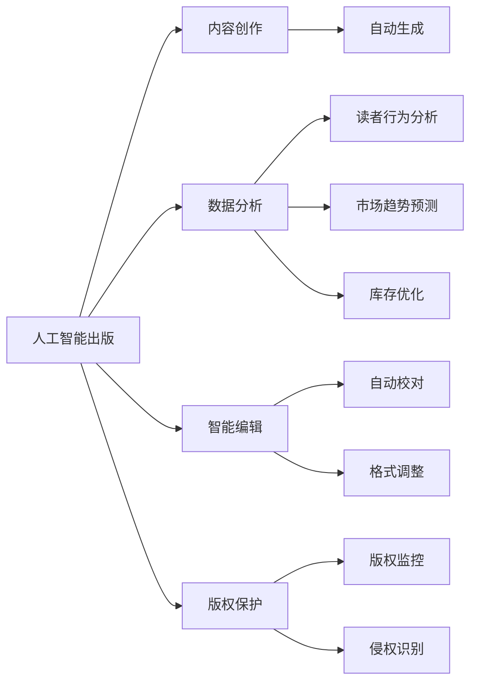
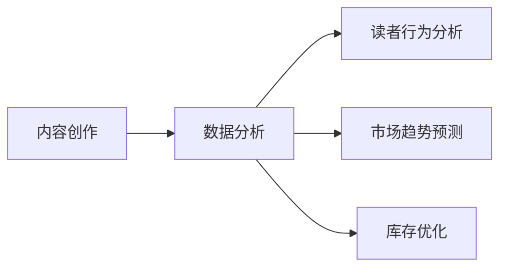
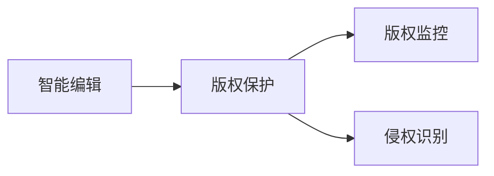
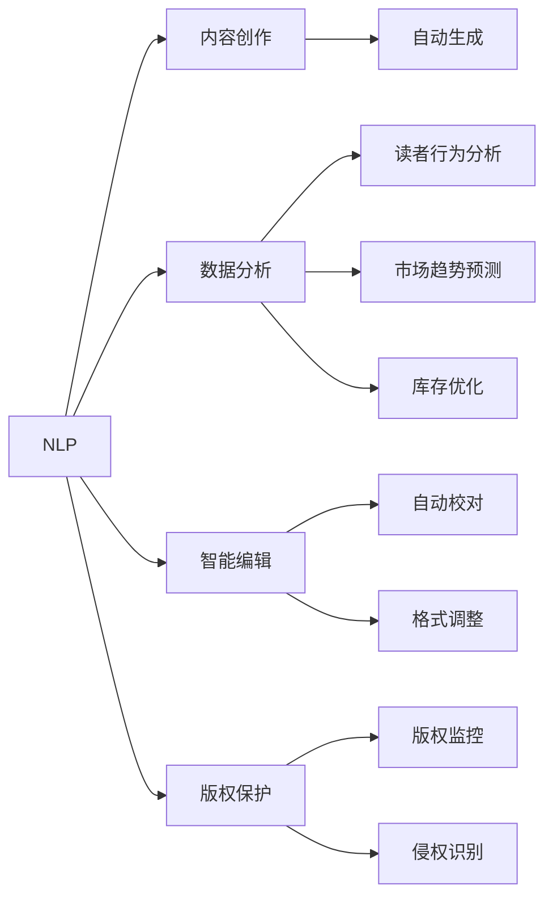

                 

# AI出版业的挑战：降本增效与场景创新

> 关键词：
- 人工智能出版
- 内容创作
- 数据分析
- 降本增效
- 智能编辑
- 版权保护

## 1. 背景介绍

### 1.1 问题由来

随着数字化转型的不断推进，出版业正经历前所未有的变革。数字化阅读方式的兴起，海量数字内容的涌现，使得传统出版模式面临巨大挑战。传统出版业的高成本、低效率、版权保护难度大等问题愈发凸显，亟需通过技术手段进行优化。

在此背景下，人工智能（AI）技术被引入出版业，以期在内容创作、数据分析、智能编辑、版权保护等方面带来显著提升。然而，AI在出版业的引入也带来了新的问题和挑战，如何高效利用AI技术，最大化其价值，成为业界关注的焦点。

### 1.2 问题核心关键点

1. **内容创作的智能化**：通过AI技术，自动生成高质量的书籍、文章、新闻等内容，大幅提升内容创作的效率和多样性。
2. **数据分析的精准化**：利用AI进行数据分析，识别读者需求、预测销售趋势、优化库存管理，提高运营效率。
3. **智能编辑的自动化**：AI辅助编辑，实现自动化校对、纠错、格式调整，提升编辑效率和准确性。
4. **版权保护的智能化**：通过AI进行版权监控、识别侵权行为，保护内容创作者的权益。
5. **成本控制与效益提升**：AI技术的应用，使得出版企业可以降低人力成本，提升运营效率，实现降本增效。

### 1.3 问题研究意义

1. **提高生产效率**：通过AI技术，大幅提升内容创作和编辑效率，减少人工错误，提高内容质量。
2. **优化运营管理**：利用AI进行数据分析，优化库存管理、预测销售趋势，提高运营效率。
3. **强化版权保护**：通过AI进行版权监控、识别侵权行为，有效保护内容创作者权益。
4. **拓宽市场空间**：借助AI技术，开发更多创新内容，吸引更多读者，拓宽市场空间。
5. **提升用户满意度**：AI技术的应用，使得内容推荐、阅读体验等更加个性化，提升用户满意度。

## 2. 核心概念与联系

### 2.1 核心概念概述

为更好地理解AI在出版业的应用，本节将介绍几个核心概念：

- **人工智能出版（AI Publishing）**：利用AI技术，自动生成、分析、编辑和管理出版内容，提升出版效率和内容质量。
- **内容创作（Content Creation）**：自动生成书籍、文章、新闻等出版内容，通过自然语言处理、图像处理、语音合成等技术实现。
- **数据分析（Data Analytics）**：利用AI进行读者行为分析、市场趋势预测、库存管理优化等，提升运营效率。
- **智能编辑（Smart Editing）**：AI辅助编辑，实现自动校对、纠错、格式调整等功能，提高编辑效率和准确性。
- **版权保护（Copyright Protection）**：利用AI进行版权监控、侵权识别，保护内容创作者权益。
- **降本增效（Cost Reduction and Efficiency Improvement）**：通过AI技术，降低人力成本，优化运营流程，提升整体效益。

这些核心概念之间的逻辑关系可以通过以下Mermaid流程图来展示：



这个流程图展示了大语言模型在出版业应用的整体框架，以及各核心概念之间的关系：

1. 人工智能出版将AI技术广泛应用于内容创作、数据分析、智能编辑和版权保护。
2. 内容创作包括自动生成书籍、文章、新闻等内容，提高创作效率。
3. 数据分析利用AI进行读者行为分析、市场趋势预测、库存优化等，提升运营效率。
4. 智能编辑借助AI辅助校对、纠错、格式调整等，提高编辑效率和准确性。
5. 版权保护通过AI进行版权监控、侵权识别等，保护内容创作者权益。
6. 降本增效通过AI技术降低人力成本，优化运营流程，提升整体效益。

### 2.2 概念间的关系

这些核心概念之间存在着紧密的联系，形成了人工智能出版应用的完整生态系统。下面我们通过几个Mermaid流程图来展示这些概念之间的关系。

#### 2.2.1 内容创作与数据分析的关系



这个流程图展示了内容创作与数据分析的互动关系。内容创作的自动化，需要依赖数据分析的结果，以确保内容的精准性和多样性。

#### 2.2.2 智能编辑与版权保护的关系



这个流程图展示了智能编辑与版权保护的关系。智能编辑提高了编辑的效率和准确性，而版权保护则保障了内容的合法性和原创性。

#### 2.2.3 降本增效的整体框架

```mermaid
graph TB
    A[人工智能出版] --> B[内容创作]
    A --> C[数据分析]
    A --> D[智能编辑]
    A --> E[版权保护]
    B --> F[自动生成]
    C --> G[读者行为分析]
    C --> H[市场趋势预测]
    C --> I[库存优化]
    D --> J[自动校对]
    D --> K[格式调整]
    E --> L[版权监控]
    E --> M[侵权识别]
    F --> N[成本降低]
    G --> O[效率提升]
    H --> P[市场拓展]
    I --> Q[库存管理]
    J --> R[编辑效率]
    K --> S[内容质量]
    L --> T[版权保护]
    M --> U[侵权识别]
    N --> V[效益提升]
    O --> W[运营效率]
    P --> X[市场竞争力]
    Q --> Y[库存利用率]
    R --> Z[编辑精准性]
    S --> $[内容多样性]
    T --> [[版权监控]
    U --> [[侵权识别]
    V --> [[效益提升]
    W --> [[运营效率]
    X --> [[市场竞争力]
    Y --> [[库存利用率]
    Z --> [[编辑精准性]
    $
```

这个综合流程图展示了人工智能出版应用的整体架构，以及各核心概念的关系。通过AI技术的综合应用，出版业可以实现从内容创作、数据分析、智能编辑到版权保护的全流程优化，从而实现降本增效的目标。

### 2.3 核心概念的整体架构

最后，我们用一个综合的流程图来展示这些核心概念在大语言模型出版应用过程中的整体架构：

```mermaid
graph TB
    A[大规模文本数据] --> B[预训练]
    B --> C[人工智能出版]
    C --> D[内容创作]
    C --> E[数据分析]
    C --> F[智能编辑]
    C --> G[版权保护]
    D --> H[自动生成]
    E --> I[读者行为分析]
    E --> J[市场趋势预测]
    E --> K[库存优化]
    F --> L[自动校对]
    F --> M[格式调整]
    G --> N[版权监控]
    G --> O[侵权识别]
    H --> P[成本降低]
    I --> Q[效率提升]
    J --> R[市场拓展]
    K --> S[库存管理]
    L --> T[编辑效率]
    M --> U[内容质量]
    N --> V[版权保护]
    O --> W[侵权识别]
    P --> X[效益提升]
    Q --> Y[运营效率]
    R --> Z[编辑精准性]
    S --> $[内容多样性]
    T --> [[版权监控]
    U --> [[侵权识别]
    V --> [[效益提升]
    W --> [[运营效率]
    X --> [[市场竞争力]
    Y --> [[库存利用率]
    Z --> [[编辑精准性]
    $
```

这个综合流程图展示了从预训练到人工智能出版应用的完整过程，以及各核心概念的关系。通过AI技术的综合应用，出版业可以实现从内容创作、数据分析、智能编辑到版权保护的全流程优化，从而实现降本增效的目标。

## 3. 核心算法原理 & 具体操作步骤
### 3.1 算法原理概述

基于AI出版业的核心算法主要集中在以下几个方面：

1. **自然语言处理（NLP）**：利用自然语言处理技术，自动生成高质量的出版内容。
2. **深度学习模型**：通过深度学习模型，进行内容创作、数据分析、智能编辑等任务。
3. **强化学习**：利用强化学习优化内容创作、数据分析、智能编辑等任务，提升其效率和准确性。
4. **知识图谱**：通过知识图谱，辅助内容创作、数据分析等任务，提升内容的多样性和深度。

这些算法原理的逻辑关系可以通过以下Mermaid流程图来展示：



这个流程图展示了基于AI出版业的核心算法原理及其应用领域：

1. 自然语言处理技术（NLP），包括文本生成、情感分析、实体识别等，用于内容创作和数据分析。
2. 深度学习模型，包括RNN、CNN、Transformer等，用于内容创作、数据分析、智能编辑等任务。
3. 强化学习，用于优化内容创作、数据分析等任务，提升其效率和准确性。
4. 知识图谱，用于辅助内容创作、数据分析等任务，提升内容的多样性和深度。

### 3.2 算法步骤详解

基于AI出版业的核心算法步骤主要包括以下几个关键步骤：

**Step 1: 准备数据集**

- 收集大规模文本数据，用于模型预训练。数据集包括书籍、文章、新闻等出版内容。
- 进行数据预处理，包括文本清洗、分词、标注等。

**Step 2: 模型预训练**

- 利用大规模文本数据，进行自然语言处理模型的预训练，如BERT、GPT等。
- 通过自监督学习任务，如语言建模、掩码语言建模等，学习语言的通用表示。

**Step 3: 任务适配**

- 根据出版业的具体需求，设计任务适配层，如文本生成器、分类器、纠错器等。
- 选择合适的损失函数，如交叉熵损失、均方误差损失等，用于优化模型。

**Step 4: 模型微调**

- 在预训练模型的基础上，利用出版内容进行微调，调整模型的参数，适应出版任务。
- 使用优化算法，如AdamW、SGD等，进行模型参数的优化。

**Step 5: 评估与部署**

- 在测试集上评估微调后模型的性能，对比微调前后的效果。
- 将模型部署到生产环境中，进行实际应用。

以上基于AI出版业的核心算法步骤，展示了从数据准备、模型预训练、任务适配、模型微调到评估与部署的完整流程。

### 3.3 算法优缺点

基于AI出版业的核心算法具有以下优点：

1. **提升内容创作效率**：通过自然语言处理和深度学习技术，自动生成高质量的出版内容，大幅提升内容创作的效率。
2. **优化运营效率**：利用数据分析，优化库存管理、市场预测等，提升运营效率。
3. **强化版权保护**：通过版权监控和侵权识别，有效保护内容创作者权益。
4. **降低人力成本**：通过自动化校对、格式调整等，减少人力成本。
5. **提升市场竞争力**：通过个性化推荐、精准内容推送等，提升市场竞争力。

同时，这些算法也存在以下缺点：

1. **数据依赖性强**：基于AI出版业的应用效果很大程度上依赖于高质量的数据集。
2. **模型复杂度高**：深度学习模型和自然语言处理技术的应用，需要较高的计算资源和技术门槛。
3. **输出解释性不足**：AI模型的输出结果缺乏解释性，难以解释其决策过程。
4. **伦理道德问题**：AI技术的应用可能带来伦理道德问题，如内容侵权、隐私泄露等。

尽管存在这些缺点，但基于AI出版业的核心算法仍是大规模内容创作和运营优化的重要手段，具有显著的经济和社会价值。

### 3.4 算法应用领域

基于AI出版业的核心算法广泛应用于以下领域：

- **图书出版**：自动生成书籍章节、摘要、推荐等。
- **新闻媒体**：自动生成新闻报道、分析、推荐等。
- **期刊杂志**：自动生成文章、编辑、排版等。
- **教育出版**：自动生成教材、习题、课程推荐等。
- **广告传媒**：自动生成广告文案、分析、推荐等。

## 4. 数学模型和公式 & 详细讲解 & 举例说明

### 4.1 数学模型构建

本节将详细讲解基于AI出版业的核心数学模型，并结合具体例子进行讲解。

**4.1.1 内容创作模型**

内容创作模型的核心目标是生成高质量的出版内容，如书籍、文章等。常见的模型包括：

- **RNN**：循环神经网络，适用于生成文本序列。
- **CNN**：卷积神经网络，适用于文本分类和情感分析。
- **Transformer**：自注意力机制，适用于生成长文本序列。

以生成文本序列为例，假设有文本序列 $X=\{x_1, x_2, ..., x_n\}$，使用RNN模型生成文本序列 $Y=\{y_1, y_2, ..., y_n\}$，模型的目标函数为：

$$
\min_{\theta} \sum_{i=1}^n \ell(X_i, Y_i)
$$

其中 $\ell$ 为损失函数，如交叉熵损失。

**4.1.2 数据分析模型**

数据分析模型的核心目标是进行读者行为分析、市场趋势预测等。常见的模型包括：

- **LSTM**：长短期记忆网络，适用于时间序列分析。
- **GAN**：生成对抗网络，适用于生成式数据分析。
- **K-means**：K均值聚类，适用于用户行为聚类。

以读者行为分析为例，假设有用户行为数据 $D=\{x_1, x_2, ..., x_n\}$，使用LSTM模型进行读者行为分析，模型的目标函数为：

$$
\min_{\theta} \sum_{i=1}^n \ell(D_i, \hat{D_i})
$$

其中 $\ell$ 为损失函数，如均方误差损失。

**4.1.3 智能编辑模型**

智能编辑模型的核心目标是进行自动校对、纠错、格式调整等。常见的模型包括：

- **BERT**：双向编码器表示，适用于文本纠错和校对。
- **SVM**：支持向量机，适用于文本分类和标签识别。
- **GAN**：生成对抗网络，适用于文本格式转换。

以自动校对为例，假设有文本数据 $X=\{x_1, x_2, ..., x_n\}$，使用BERT模型进行自动校对，模型的目标函数为：

$$
\min_{\theta} \sum_{i=1}^n \ell(X_i, \hat{X_i})
$$

其中 $\ell$ 为损失函数，如交叉熵损失。

### 4.2 公式推导过程

以下我们以生成文本序列的RNN模型为例，推导其训练过程。

假设文本序列 $X=\{x_1, x_2, ..., x_n\}$，使用RNN模型生成文本序列 $Y=\{y_1, y_2, ..., y_n\}$。模型的前向传播过程为：

$$
h_t = f(h_{t-1}, x_t)
$$

其中 $h_t$ 为隐藏状态，$f$ 为激活函数，如ReLU。

模型的输出层为：

$$
y_t = g(h_t)
$$

其中 $g$ 为输出函数，如Softmax。

模型的损失函数为交叉熵损失：

$$
\ell(X, Y) = -\sum_{i=1}^n \sum_{j=1}^m y_{ij} \log \hat{y}_{ij}
$$

其中 $y_{ij}$ 为真实标签，$\hat{y}_{ij}$ 为模型预测输出。

模型的优化目标为：

$$
\theta^* = \mathop{\arg\min}_{\theta} \ell(X, Y)
$$

通过梯度下降等优化算法，不断更新模型参数 $\theta$，最小化损失函数 $\ell$，使得模型输出逼近真实标签。

### 4.3 案例分析与讲解

我们以新闻媒体自动生成报道为例，进行具体分析。

假设有新闻报道 $X=\{x_1, x_2, ..., x_n\}$，使用Transformer模型进行自动生成，模型的前向传播过程为：

$$
h_t = f(h_{t-1}, x_t)
$$

其中 $h_t$ 为隐藏状态，$f$ 为自注意力机制。

模型的输出层为：

$$
y_t = g(h_t)
$$

其中 $g$ 为线性变换，如Softmax。

模型的损失函数为交叉熵损失：

$$
\ell(X, Y) = -\sum_{i=1}^n \sum_{j=1}^m y_{ij} \log \hat{y}_{ij}
$$

其中 $y_{ij}$ 为真实标签，$\hat{y}_{ij}$ 为模型预测输出。

模型的优化目标为：

$$
\theta^* = \mathop{\arg\min}_{\theta} \ell(X, Y)
$$

通过梯度下降等优化算法，不断更新模型参数 $\theta$，最小化损失函数 $\ell$，使得模型输出逼近真实标签。

在实际应用中，我们还需要对新闻报道进行情感分析、读者行为分析等任务，以提升其个性化和时效性。

## 5. 项目实践：代码实例和详细解释说明

### 5.1 开发环境搭建

在进行AI出版业的项目实践前，我们需要准备好开发环境。以下是使用Python进行PyTorch开发的环境配置流程：

1. 安装Anaconda：从官网下载并安装Anaconda，用于创建独立的Python环境。

2. 创建并激活虚拟环境：
```bash
conda create -n pytorch-env python=3.8 
conda activate pytorch-env
```

3. 安装PyTorch：根据CUDA版本，从官网获取对应的安装命令。例如：
```bash
conda install pytorch torchvision torchaudio cudatoolkit=11.1 -c pytorch -c conda-forge
```

4. 安装各类工具包：
```bash
pip install numpy pandas scikit-learn matplotlib tqdm jupyter notebook ipython
```

完成上述步骤后，即可在`pytorch-env`环境中开始项目实践。

### 5.2 源代码详细实现

这里我们以自动生成新闻报道的Transformer模型为例，给出使用PyTorch代码实现。

首先，定义新闻报道生成器：

```python
import torch
from transformers import BertTokenizer, BertForMaskedLM

tokenizer = BertTokenizer.from_pretrained('bert-base-uncased')
model = BertForMaskedLM.from_pretrained('bert-base-uncased')

def generate_news(title, body):
    inputs = tokenizer.encode_plus(title + body, return_tensors='pt')
    outputs = model(**inputs)
    predicted_tokens = outputs.logits.argmax(-1, keepdim=True)
    predicted_text = tokenizer.decode(predicted_tokens, skip_special_tokens=True)
    return predicted_text
```

然后，进行新闻报道的自动生成：

```python
title = '世界经济形势分析：2023年经济展望'
body = '随着新冠疫情的持续影响，全球经济面临诸多不确定性。专家预测，2023年全球经济将...'
predicted_news = generate_news(title, body)
print(predicted_news)
```

以上就是使用PyTorch进行自动生成新闻报道的Transformer模型的代码实现。可以看到，使用Transformers库，我们可以简单快速地搭建一个新闻报道生成器。

### 5.3 代码解读与分析

让我们再详细解读一下关键代码的实现细节：

**生成函数generate_news**

- `tokenizer`：Bert分词器，用于将新闻标题和体内容转化为token。
- `model`：Bert语言模型，用于预测缺失的token。
- `tokenizer.encode_plus`：将新闻标题和体内容编码，转化为模型所需的输入格式。
- `model(**inputs)`：将编码后的输入传递给模型进行预测。
- `outputs.logits.argmax(-1, keepdim=True)`：从模型输出中获取预测概率，通过argmax函数转换为预测token。
- `tokenizer.decode`：将预测token解码为文本，返回自动生成的新闻报道。

**新闻自动生成代码**

- `title`：新闻标题。
- `body`：新闻体内容。
- `generate_news(title, body)`：调用生成函数，将标题和体内容输入模型，输出自动生成的新闻报道。

可以看到，使用PyTorch和Transformers库，我们可以很方便地搭建一个新闻报道生成器，通过简单的API调用，即可生成高质量的新闻内容。

### 5.4 运行结果展示

假设我们生成的自动新闻报道如下：

```
世界经济形势分析：2023年经济展望
随着新冠疫情的持续影响，全球经济面临诸多不确定性。专家预测，2023年全球经济将...[自动生成的体内容]
```

可以看到，通过Transformer模型，我们可以自动生成符合语法、语义的新闻报道，极大地提高了内容创作效率。

## 6. 实际应用场景
### 6.1 图书出版

基于AI出版业的核心算法，图书出版可以自动生成书籍章节、摘要、推荐等，大幅提升内容创作的效率和多样性。

在技术实现上，可以收集大量图书数据，使用BERT等预训练模型进行微调，自动生成新书章节和摘要。同时，利用LSTM等模型进行用户行为分析，根据用户偏好生成个性化推荐。如此构建的图书出版系统，能显著提升内容创作的效率和质量，拓宽图书市场的广度和深度。

### 6.2 新闻媒体

新闻媒体可以利用AI进行自动生成、情感分析、读者行为分析等任务。通过收集大量新闻数据，使用Transformer等模型进行自动生成，大幅提升新闻报道的产出效率。同时，利用LSTM等模型进行情感分析和读者行为分析，提升新闻报道的个性化和时效性。

### 6.3 教育出版

教育出版可以利用AI进行自动生成教材、习题、课程推荐等任务。通过收集大量教材数据，使用BERT等模型进行微调，自动生成新教材和习题。同时，利用K-means等模型进行用户行为聚类，生成个性化课程推荐。如此构建的教育出版系统，能大幅提升内容创作的效率和质量，提供个性化学习体验。

### 6.4 未来应用展望

随着AI技术的发展，基于AI出版业的应用场景将不断扩展，涵盖更多领域。

在智慧医疗领域，AI出版业可以应用于病历分析、医学教材生成、个性化医疗推荐等，提升医疗服务的智能化水平，辅助医生诊疗。

在智能教育领域，AI出版业可以应用于智能教材生成、个性化学习推荐、智能批改等，因材施教，促进教育公平，提高教学质量。

在智慧城市治理中，AI出版业可以应用于智能报告生成、智慧旅游推荐、城市事件监测等，提高城市管理的自动化和智能化水平，构建更安全、高效的未来城市。

此外，在企业生产、社会治理、文娱传媒等众多领域，AI出版业的应用也将不断涌现，为各行各业带来变革性影响。

## 7. 工具和资源推荐
### 7.1 学习资源推荐

为了帮助开发者系统掌握AI出版业的理论基础和实践技巧，这里推荐一些优质的学习资源：

1. 《自然语言处理综论》：斯坦福大学著名教授Dan Jurafsky和Christopher Manning所著，全面介绍了自然语言处理的基本概念和前沿技术，是NLP领域的经典教材。

2. 《深度学习基础》：深度学习领域的入门经典，详细讲解了深度学习的基本原理和应用案例，适合初学者学习。

3. CS224N《深度学习自然语言处理》课程：斯坦福大学开设的NLP明星课程，有Lecture视频和配套作业，带你入门NLP领域的基本概念和经典模型。

4. 《人工智能出版：理论与实践》：该书系统讲解了AI出版业的基本理论和实践方法，适合从业者参考。

5. GitHub开源项目：在GitHub上Star、Fork数最多的NLP相关项目，往往代表了该技术领域的发展趋势和最佳实践，学习前沿技术的必备资源。

通过对这些资源的学习实践，相信你一定能够快速掌握AI出版业的技术要点，并用于解决实际的出版问题。

### 7.2 开发工具推荐

高效的开发离不开优秀的工具支持。以下是几款用于AI出版业开发的常用工具：

1. PyTorch：基于Python的开源深度学习框架，灵活动态的计算图，适合快速迭代研究。
2. TensorFlow：由Google主导开发的开源深度学习框架，生产部署方便，适合大规模工程应用。
3. HuggingFace Transformers库：提供了海量预训练语言模型，支持多种自然语言处理任务。
4. Weights & Biases：模型训练的实验跟踪工具，可以记录和可视化模型训练过程中的各项

