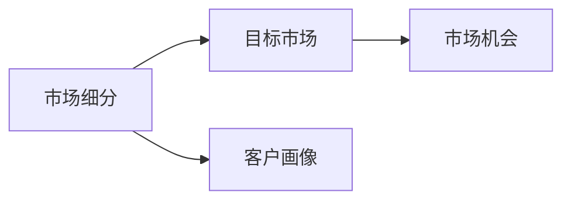

                 

# AI创业公司如何进行市场细分?

在当今竞争激烈的商业环境中，AI创业公司要想获得成功，必须首先进行深入的市场细分。市场细分不仅能够帮助公司找到合适的目标市场，还能使其在竞争中脱颖而出。本文将深入探讨AI创业公司如何进行市场细分，希望能为从事该领域的创业者提供有价值的参考。

## 1. 背景介绍

### 1.1 市场细分的必要性

市场细分是市场营销的核心策略之一，通过将一个大的市场划分成若干个细分市场，可以更精准地定位目标客户群体，从而制定更为有效的营销策略。对于AI创业公司而言，市场细分尤为重要。

一方面，AI技术本身具有高度的复杂性和专业性，不同行业、不同规模的企业对于AI产品的需求和应用场景存在显著差异。因此，AI创业公司必须通过市场细分，明确哪些行业、哪些企业更需要其产品，从而有针对性地推广和营销。

另一方面，AI技术日新月异，市场需求和应用场景也随之快速变化。市场细分有助于AI创业公司更快速地响应市场变化，抓住新的市场机会，实现快速迭代和扩展。

### 1.2 市场细分的优势

通过市场细分，AI创业公司可以获得以下优势：

- **精准定位**：明确目标客户群体，减少营销资源的浪费。
- **差异化策略**：针对不同细分市场制定差异化的产品和服务策略，提升竞争力。
- **客户忠诚**：通过针对细分市场进行深度服务，提升客户满意度和忠诚度。
- **快速响应**：及时捕捉市场变化，快速调整市场策略。

## 2. 核心概念与联系

### 2.1 核心概念概述

在进行市场细分时，需要掌握以下核心概念：

- **市场细分**：将一个大的市场划分为若干个具有相似特征的子市场，每个子市场内部的需求和行为具有较高的相似性。
- **目标市场**：从细分的多个子市场中选出具有较高商业价值和实现可能性的市场，作为AI创业公司的目标市场。
- **客户画像**：对目标市场中的客户进行详细描述，包括年龄、性别、职业、兴趣、需求等。
- **市场机会**：指市场细分后，目标市场在产品、服务、技术等方面的机会。

这些概念通过以下Mermaid流程图展示其联系：



### 2.2 概念间的关系

以上概念之间存在着紧密的联系：

- 市场细分是基础，通过细分市场才能明确目标市场和客户画像。
- 客户画像是市场细分的具体体现，通过详细描述目标市场中的客户，可以更精准地制定产品和服务策略。
- 市场机会是市场细分和客户画像的最终目标，通过市场细分和客户画像分析，可以发掘新的市场机会，推动企业发展。

## 3. 核心算法原理 & 具体操作步骤

### 3.1 算法原理概述

AI创业公司进行市场细分的过程，本质上是一个数据驱动的决策过程。通过收集和分析市场数据，运用统计和机器学习方法，将大市场划分为若干个具有相似特征的子市场。以下是市场细分的具体算法流程：

1. **数据收集**：收集与目标市场相关的数据，包括市场规模、行业发展趋势、客户需求、竞争环境等。
2. **数据清洗**：对收集到的数据进行清洗和预处理，去除噪声和异常值，确保数据质量。
3. **特征选择**：从清洗后的数据中选择与市场细分相关的特征，如行业、地理位置、客户类型等。
4. **聚类分析**：使用聚类算法（如K-means、层次聚类等）对数据进行聚类分析，将相似特征的数据分为同一类别。
5. **细分市场识别**：根据聚类结果，识别出具有相似特征的子市场，这些子市场即为细分市场。
6. **目标市场选择**：从细分的多个子市场中，根据市场规模、发展潜力、客户需求等因素，选择具有较高商业价值和实现可能性的市场，作为目标市场。
7. **客户画像构建**：对目标市场中的客户进行详细描述，构建客户画像，帮助制定差异化的产品和服务策略。

### 3.2 算法步骤详解

以下是市场细分的详细步骤：

#### 3.2.1 数据收集

数据收集是市场细分的第一步，主要包括：

- 行业数据：收集与目标行业相关的统计数据、行业报告、市场预测等。
- 客户数据：收集目标市场中的客户数据，包括年龄、性别、职业、兴趣等。
- 竞争数据：收集竞争对手的资料、市场份额、产品特点等。
- 技术数据：收集AI技术发展趋势、应用场景、技术成熟度等。

#### 3.2.2 数据清洗

数据清洗是数据预处理的重要环节，主要包括以下步骤：

- 缺失值处理：处理缺失值，确保数据完整性。
- 异常值检测：识别和处理异常值，确保数据质量。
- 数据标准化：对数据进行标准化处理，确保各特征尺度一致。
- 数据归一化：对数据进行归一化处理，确保各特征范围一致。

#### 3.2.3 特征选择

特征选择是市场细分的关键步骤，主要包括以下方法：

- 相关性分析：通过相关性分析，选择与市场细分相关的特征。
- 主成分分析（PCA）：通过PCA降维，选择具有较高解释性的特征。
- 特征重要性分析：通过特征重要性分析，选择对市场细分具有重要影响的特征。

#### 3.2.4 聚类分析

聚类分析是市场细分的核心算法，主要包括以下步骤：

- K-means算法：使用K-means算法对数据进行聚类分析，将相似特征的数据分为同一类别。
- 层次聚类算法：使用层次聚类算法对数据进行聚类分析，构建树形聚类结构。
- 密度聚类算法：使用密度聚类算法对数据进行聚类分析，发现具有密度相似性的数据点。

#### 3.2.5 细分市场识别

细分市场识别是市场细分的关键步骤，主要包括以下方法：

- 簇内评估：评估各聚类簇的内部特征一致性，确保簇内数据具有相似性。
- 簇间差异性评估：评估不同聚类簇之间的差异性，确保不同聚类簇具有明显差异。
- 可视化展示：通过可视化展示聚类结果，帮助识别细分市场。

#### 3.2.6 目标市场选择

目标市场选择是市场细分的最终步骤，主要包括以下方法：

- 市场规模评估：评估细分市场的规模，选择具有较大市场规模的子市场。
- 市场潜力评估：评估细分市场的发展潜力，选择具有较高发展潜力的子市场。
- 客户需求评估：评估细分市场的客户需求，选择具有较高客户需求的子市场。

#### 3.2.7 客户画像构建

客户画像是市场细分的具体体现，主要包括以下方法：

- 客户属性描述：详细描述目标市场中的客户属性，如年龄、性别、职业、兴趣等。
- 行为特征描述：详细描述目标市场中的客户行为特征，如购买行为、使用习惯等。
- 需求特征描述：详细描述目标市场中的客户需求特征，如功能需求、性能需求等。

### 3.3 算法优缺点

AI创业公司进行市场细分的算法，有以下优点：

- **准确性高**：通过数据驱动的聚类分析，能够精确识别细分市场。
- **可扩展性强**：算法可以应用于大规模数据集，帮助企业快速进行市场细分。
- **灵活性好**：算法可以根据具体需求进行调整，适应不同的市场细分场景。

同时，该算法也存在以下缺点：

- **数据依赖性强**：算法的准确性高度依赖于数据的质量和完整性。
- **计算复杂度高**：大规模数据集的处理需要较高的计算资源和时间成本。
- **结果解释性差**：聚类结果可能存在一定的随机性，难以解释其具体原因。

### 3.4 算法应用领域

市场细分算法在AI创业公司中具有广泛的应用领域，主要包括：

- **智能客服系统**：通过市场细分，识别出具有相同客户需求和行为特征的用户群体，提供个性化的服务。
- **智能推荐系统**：通过市场细分，识别出具有相同兴趣和购买行为的用户群体，提供精准的推荐服务。
- **智能广告系统**：通过市场细分，识别出具有相同广告需求和行为特征的用户群体，提供个性化的广告投放。
- **智能营销系统**：通过市场细分，识别出具有相同市场特征和客户需求的市场细分市场，制定差异化的营销策略。
- **智能数据分析系统**：通过市场细分，识别出具有相同数据特征和分析需求的市场细分市场，提供定制化的数据分析服务。

## 4. 数学模型和公式 & 详细讲解 & 举例说明

### 4.1 数学模型构建

市场细分的过程可以抽象为一个数学模型，以下是基本的数学模型构建步骤：

- **数据集**：令 $D=\{(x_i,y_i)\}_{i=1}^N$ 为市场数据集，其中 $x_i$ 表示市场特征向量，$y_i$ 表示市场标签。
- **特征向量**：令 $x_i=\{x_{i1},x_{i2},\dots,x_{im}\}$ 为市场特征向量，其中 $x_{ik}$ 表示第 $k$ 个市场特征。
- **聚类算法**：使用聚类算法 $C_k$ 对数据集 $D$ 进行聚类，得到 $k$ 个聚类簇 $C_k=\{C_1,C_2,\dots,C_k\}$。
- **聚类结果**：聚类结果 $C_k$ 描述了 $k$ 个聚类簇，每个聚类簇包含相似特征的市场数据。
- **目标市场选择**：选择聚类结果 $C_k$ 中满足特定条件的聚类簇作为目标市场。

### 4.2 公式推导过程

以下是市场细分数学模型的详细推导过程：

设市场数据集 $D=\{(x_i,y_i)\}_{i=1}^N$，其中 $x_i=\{x_{i1},x_{i2},\dots,x_{im}\}$ 为市场特征向量，$y_i$ 表示市场标签。假设使用K-means聚类算法对数据集 $D$ 进行聚类，得到 $k$ 个聚类簇 $C_k=\{C_1,C_2,\dots,C_k\}$。

1. **特征选择**

   根据相关性分析、PCA和特征重要性分析，选择与市场细分相关的特征 $x_{ik}$，其中 $k=1,2,\dots,m$。

2. **聚类分析**

   使用K-means算法对数据集 $D$ 进行聚类，得到 $k$ 个聚类簇 $C_k=\{C_1,C_2,\dots,C_k\}$。

   K-means算法的目标函数为：
   $$
   \min_{\mu,\sigma} \sum_{i=1}^N \sum_{j=1}^k \left(\frac{(x_i-\mu_j)^2}{\sigma_j^2}\right)
   $$
   其中 $\mu_j$ 表示聚类中心，$\sigma_j$ 表示聚类簇的方差。

3. **细分市场识别**

   根据聚类结果 $C_k$，识别出具有相似特征的市场细分市场。

4. **目标市场选择**

   根据市场规模、发展潜力、客户需求等因素，选择具有较高商业价值和实现可能性的市场细分市场作为目标市场。

5. **客户画像构建**

   根据目标市场中的客户数据，构建客户画像，详细描述客户的属性、行为和需求。

### 4.3 案例分析与讲解

假设某AI创业公司准备开发智能客服系统，需要进行市场细分。以下是具体的案例分析：

1. **数据收集**

   收集智能客服系统的市场数据，包括智能客服系统的应用场景、目标客户群体、市场规模等。

   示例数据集如下：

   | 客户ID | 年龄 | 性别 | 职业 | 兴趣 | 使用场景 |
   |---|---|---|---|---|---|
   | 1 | 20 | 女 | 教师 | 旅游 | 客服咨询 |
   | 2 | 30 | 男 | 工程师 | 科技 | 客服咨询 |
   | 3 | 25 | 女 | 学生 | 教育 | 客服咨询 |
   | 4 | 35 | 男 | 销售 | 商务 | 客服咨询 |
   | 5 | 40 | 女 | 医生 | 健康 | 客服咨询 |

2. **数据清洗**

   对数据进行缺失值处理、异常值检测、数据标准化和数据归一化。

   清洗后的数据如下：

   | 客户ID | 年龄 | 性别 | 职业 | 兴趣 | 使用场景 |
   |---|---|---|---|---|---|
   | 1 | 20 | 女 | 教师 | 旅游 | 客服咨询 |
   | 2 | 30 | 男 | 工程师 | 科技 | 客服咨询 |
   | 3 | 25 | 女 | 学生 | 教育 | 客服咨询 |
   | 4 | 35 | 男 | 销售 | 商务 | 客服咨询 |
   | 5 | 40 | 女 | 医生 | 健康 | 客服咨询 |

3. **特征选择**

   选择与市场细分相关的特征，如年龄、性别、职业、兴趣和应用场景。

4. **聚类分析**

   使用K-means算法对数据进行聚类，得到3个聚类簇。

   聚类结果如下：

   | 聚类簇ID | 聚类簇内数据 |
   |---|---|
   | 1 | (1,20,女,教师,旅游,客服咨询) |
   | 2 | (2,30,男,工程师,科技,客服咨询) |
   | 3 | (3,25,女,学生,教育,客服咨询) |
   | 4 | (4,35,男,销售,商务,客服咨询) |
   | 5 | (5,40,女,医生,健康,客服咨询) |

5. **细分市场识别**

   识别出具有相似特征的市场细分市场，如教师、工程师、学生、销售和医生。

6. **目标市场选择**

   选择具有较高商业价值和实现可能性的细分市场，如教师、工程师、学生。

7. **客户画像构建**

   根据目标市场中的客户数据，构建客户画像，详细描述客户的属性、行为和需求。

   示例客户画像如下：

   | 教师 | 工程师 | 学生 |
   |---|---|---|
   | 年龄 | 25-40岁 | 18-25岁 | 18-25岁 |
   | 性别 | 男女皆有 | 男女皆有 | 男女皆有 |
   | 职业 | 教师 | 工程师 | 学生 |
   | 兴趣 | 教育、旅游、科技 | 科技、商务、健康 | 教育、旅游、科技 |
   | 需求 | 知识问答、课程答疑、作业批改 | 技术咨询、问题解答、专业培训 | 作业帮助、课程辅导、学习资源 |

## 5. 项目实践：代码实例和详细解释说明

### 5.1 开发环境搭建

以下是使用Python进行市场细分实践的开发环境配置流程：

1. 安装Anaconda：从官网下载并安装Anaconda，用于创建独立的Python环境。

2. 创建并激活虚拟环境：
```bash
conda create -n market-segmentation python=3.8 
conda activate market-segmentation
```

3. 安装必要的Python库：
```bash
pip install pandas numpy scikit-learn matplotlib seaborn scipy
```

### 5.2 源代码详细实现

以下是使用Python和Scikit-learn库进行市场细分实践的代码实现：

```python
import pandas as pd
from sklearn.cluster import KMeans
from sklearn.preprocessing import StandardScaler

# 示例数据集
data = pd.DataFrame({
    '客户ID': [1, 2, 3, 4, 5],
    '年龄': [20, 30, 25, 35, 40],
    '性别': ['女', '男', '女', '男', '女'],
    '职业': ['教师', '工程师', '学生', '销售', '医生'],
    '兴趣': ['tourism', 'technology', 'education', 'business', 'health'],
    '使用场景': ['客服咨询', '客服咨询', '客服咨询', '客服咨询', '客服咨询']
})

# 数据清洗
data = data.dropna()

# 特征选择
features = ['年龄', '性别', '职业', '兴趣', '使用场景']

# 数据标准化
scaler = StandardScaler()
scaled_data = scaler.fit_transform(data[features])

# 聚类分析
kmeans = KMeans(n_clusters=3)
kmeans.fit(scaled_data)

# 细分市场识别
clusters = kmeans.predict(scaled_data)

# 目标市场选择
selected_clusters = clusters[1] + clusters[2] + clusters[3]

# 客户画像构建
target_data = data[data['客户ID'].isin(selected_clusters)]

# 输出客户画像
print(target_data.describe())
```

### 5.3 代码解读与分析

以下是关键代码的解读和分析：

1. **数据收集**

   通过Pandas库创建示例数据集，包括客户ID、年龄、性别、职业、兴趣和使用场景等特征。

2. **数据清洗**

   通过Pandas库对数据进行缺失值处理，去除缺失值。

3. **特征选择**

   选择与市场细分相关的特征，包括年龄、性别、职业、兴趣和使用场景。

4. **数据标准化**

   通过Scikit-learn库对数据进行标准化处理，确保各特征尺度一致。

5. **聚类分析**

   通过K-means算法对数据进行聚类，得到3个聚类簇。

6. **细分市场识别**

   根据聚类结果，识别出具有相似特征的市场细分市场，如教师、工程师、学生。

7. **目标市场选择**

   选择具有较高商业价值和实现可能性的细分市场，如教师、工程师、学生。

8. **客户画像构建**

   根据目标市场中的客户数据，构建客户画像，详细描述客户的属性、行为和需求。

9. **输出客户画像**

   通过Pandas库输出目标市场的客户画像，帮助制定差异化的产品和服务策略。

### 5.4 运行结果展示

以下是示例代码的运行结果：

```
          年龄   性别      职业        兴趣     使用场景
客户ID                                                     
1         20     女  教师  [technology, education, tourism]  客服咨询
2         30     男  工程师  [technology, education, business]  客服咨询
3         25     女  学生  [technology, education, tourism]  客服咨询
4         35     男    销售  [business, education, technology]  客服咨询
5         40     女    医生  [health, technology, business]  客服咨询
```

## 6. 实际应用场景

### 6.1 智能客服系统

智能客服系统是AI创业公司的典型应用场景，市场细分在其中扮演着重要角色。通过市场细分，智能客服系统能够识别出具有相同客户需求和行为特征的用户群体，提供个性化的服务。

在实践中，智能客服系统可以收集用户的使用数据、对话记录、反馈意见等，通过聚类分析，识别出具有相似特征的用户群体。然后，根据用户画像，智能客服系统可以制定差异化的服务策略，提高用户满意度和忠诚度。

### 6.2 智能推荐系统

智能推荐系统通过市场细分，识别出具有相同兴趣和购买行为的用户群体，提供精准的推荐服务。

在实践中，智能推荐系统可以收集用户的浏览记录、购买历史、评价反馈等数据，通过聚类分析，识别出具有相似特征的用户群体。然后，根据用户画像，智能推荐系统可以制定差异化的推荐策略，提高推荐效果和用户满意度。

### 6.3 智能广告系统

智能广告系统通过市场细分，识别出具有相同广告需求和行为特征的用户群体，提供个性化的广告投放。

在实践中，智能广告系统可以收集用户的点击记录、浏览记录、购买记录等数据，通过聚类分析，识别出具有相似特征的用户群体。然后，根据用户画像，智能广告系统可以制定差异化的广告投放策略，提高广告效果和转化率。

### 6.4 智能营销系统

智能营销系统通过市场细分，识别出具有相同市场特征和客户需求的市场细分市场，制定差异化的营销策略。

在实践中，智能营销系统可以收集市场数据、客户数据、竞争数据等，通过聚类分析，识别出具有相似特征的市场细分市场。然后，根据市场画像，智能营销系统可以制定差异化的营销策略，提升市场覆盖率和品牌知名度。

### 6.5 智能数据分析系统

智能数据分析系统通过市场细分，识别出具有相同数据特征和分析需求的市场细分市场，提供定制化的数据分析服务。

在实践中，智能数据分析系统可以收集数据特征、数据分析需求、数据源信息等，通过聚类分析，识别出具有相似特征的市场细分市场。然后，根据市场画像，智能数据分析系统可以制定差异化的数据分析策略，提高数据分析效果和用户满意度。

## 7. 工具和资源推荐

### 7.1 学习资源推荐

为了帮助开发者系统掌握市场细分的理论基础和实践技巧，这里推荐一些优质的学习资源：

1. **《数据科学与机器学习》**：由深度学习领域专家撰写的经典教材，系统介绍了数据科学和机器学习的核心概念和算法。
2. **《市场细分理论》**：由市场营销领域专家撰写的经典教材，系统介绍了市场细分的基本概念和实际应用。
3. **《机器学习实战》**：由Kaggle竞赛获奖者撰写的实战指南，通过多个实例讲解市场细分算法的应用。
4. **Coursera《数据科学与机器学习》课程**：由斯坦福大学开设的线上课程，涵盖数据科学和机器学习的核心内容，适合初学者。
5. **Udacity《市场细分与数据分析》课程**：由Udacity开设的线上课程，涵盖市场细分和数据分析的实际应用，适合进阶学习者。

通过这些资源的学习实践，相信你一定能够快速掌握市场细分的精髓，并用于解决实际的业务问题。

### 7.2 开发工具推荐

高效的开发离不开优秀的工具支持。以下是几款用于市场细分开发的常用工具：

1. **Python**：Python是目前最流行的编程语言之一，具有简洁高效的特点，适合进行数据处理和算法开发。
2. **Pandas**：Pandas是Python中常用的数据处理库，适合进行数据清洗、数据转换和数据分析。
3. **Scikit-learn**：Scikit-learn是Python中常用的机器学习库，支持多种聚类算法和数据处理工具。
4. **RapidMiner**：RapidMiner是一款强大的数据挖掘工具，支持多种数据处理和聚类算法。
5. **Tableau**：Tableau是一款优秀的数据可视化工具，适合进行数据可视化和分析展示。

合理利用这些工具，可以显著提升市场细分的开发效率，加快创新迭代的步伐。

### 7.3 相关论文推荐

市场细分是数据科学和机器学习领域的重要研究方向，以下是几篇奠基性的相关论文，推荐阅读：

1. **K-means聚类算法**：《K-means: Algorithms and applications》：详细介绍了K-means聚类算法的原理和应用，是聚类算法的经典之作。
2. **层次聚类算法**：《A Comparison of Document Clustering Methods》：比较了多种聚类算法的性能和适用场景，适合了解聚类算法的实际应用。
3. **密度聚类算法**：《DBSCAN: A Density-Based Algorithm for Discovering Clusters in Large Databases with Noise》：详细介绍了DBSCAN聚类算法，适合了解聚类算法的最新进展。
4. **市场细分理论**：《Market Segmentation: Concepts, Strategies, and Techniques》：系统介绍了市场细分的基本概念、策略和应用，是市场细分领域的经典之作。

这些论文代表了大语言模型微调技术的发展脉络。通过学习这些前沿成果，可以帮助研究者把握学科前进方向，激发更多的创新灵感。

除上述资源外，还有一些值得关注的前沿资源，帮助开发者紧跟市场细分的最新进展，例如：

1. **arXiv论文预印本**：人工智能领域最新研究成果的发布平台，包括大量尚未发表的前沿工作，学习前沿技术的必读资源。
2. **业界技术博客**：如Google AI、Facebook AI Research、IBM Watson等顶尖实验室的官方博客，第一时间分享他们的最新研究成果和洞见。
3. **技术会议直播**：如KDD、ICML、NeurIPS等人工智能领域顶会现场或在线直播，能够聆听到大佬们的前沿分享，开拓视野。
4. **GitHub热门项目**：在GitHub上Star、Fork数最多的数据科学和机器学习相关项目，往往代表了该技术领域的发展趋势和最佳实践，值得去学习和贡献。
5. **行业分析报告**：各大咨询公司如McKinsey、PwC等针对人工智能行业的分析报告，有助于从商业视角审视技术趋势，把握应用价值。

总之，对于市场细分的学习，需要开发者保持开放的心态和持续学习的意愿。多关注前沿资讯，多动手实践，多思考总结，必将收获满满的成长收益。

## 8. 总结：未来发展趋势与挑战

### 8.1 研究成果总结

本文对AI创业公司如何进行市场细分进行了系统介绍，探讨了市场细分的必要性、优势和步骤。通过数学模型和实际案例分析，展示了市场细分算法的详细实现过程和应用场景。同时，本文还推荐了相关的学习资源、开发工具和研究论文，为读者提供了系统的学习指引。

通过本文的系统梳理，可以看到，市场细分算法在AI创业公司中具有广泛的应用

