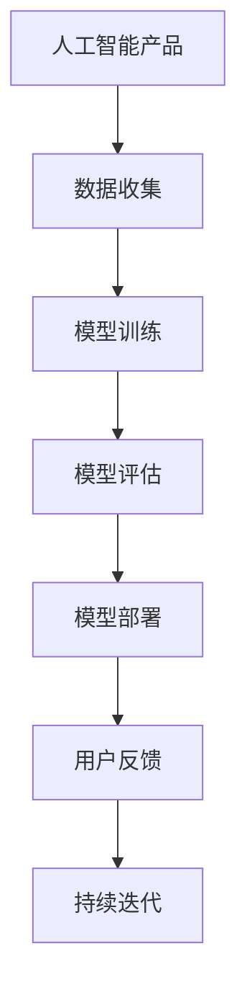

                 

# AI创业公司的产品迭代策略

在当前快速发展的科技和市场中，AI创业公司需要一种高效、灵活的产品迭代策略，以应对不断变化的用户需求和技术趋势。本文将详细探讨AI创业公司的产品迭代策略，包括产品规划、数据收集、模型训练、模型评估和部署等关键环节，并提供具体的技术实现和实际应用案例。

## 1. 背景介绍

随着人工智能技术的不断发展和普及，越来越多的创业公司开始利用AI技术开发产品，但如何保持产品的竞争力和用户满意度是一个持续的挑战。人工智能产品的核心在于模型训练和迭代优化，而产品迭代的策略和方法是确保模型效果和用户体验的重要保障。

## 2. 核心概念与联系

### 2.1 核心概念概述

为更好地理解AI创业公司的产品迭代策略，本节将介绍几个关键概念及其相互关系：

- **人工智能产品**：利用人工智能技术开发的产品，如聊天机器人、推荐系统、智能安防等。
- **数据收集**：获取用于训练模型的数据，包括用户行为数据、历史日志、用户反馈等。
- **模型训练**：使用收集到的数据对模型进行训练，调整模型参数以提高性能。
- **模型评估**：通过测试集对训练好的模型进行评估，确保模型性能达到预期。
- **模型部署**：将训练好的模型部署到生产环境中，供用户使用。
- **用户反馈**：用户在使用产品时提供的行为和评价，用于指导后续的迭代优化。
- **持续迭代**：通过不断收集用户反馈、调整模型参数和优化产品功能，持续改进产品性能和用户体验。

这些核心概念相互关联，形成了一个闭环的产品迭代流程，如图：



### 2.2 概念间的关系

- **数据收集**：是产品迭代流程的起点，高质量的数据是模型训练和优化的基础。
- **模型训练**：通过数据训练模型，模型效果直接影响用户体验。
- **模型评估**：评估模型性能，确定是否需要调整训练参数和优化模型。
- **模型部署**：将优化后的模型部署到实际应用中，提升产品功能。
- **用户反馈**：收集用户的使用体验和建议，为下一步迭代提供指导。
- **持续迭代**：根据用户反馈持续优化模型和产品功能，确保产品保持竞争力和用户满意度。

这些概念共同构成了AI创业公司产品迭代的整体策略，帮助公司在快速变化的市场中保持领先。

## 3. 核心算法原理 & 具体操作步骤

### 3.1 算法原理概述

AI创业公司产品迭代的本质是通过收集用户反馈和数据，持续优化模型和产品功能。其核心算法原理包括：

- **监督学习**：利用带有标签的数据集训练模型，模型通过学习数据特征来预测标签。
- **无监督学习**：利用无标签数据进行训练，模型通过自身学习数据特征进行聚类或降维等任务。
- **强化学习**：通过与环境的交互，模型通过不断尝试和学习来优化策略，以获得最佳奖励。
- **迁移学习**：利用预训练模型在已有任务上的知识，加速新任务上的学习。
- **增量学习**：在新数据基础上继续训练模型，避免重新训练整个模型。

### 3.2 算法步骤详解

#### 3.2.1 数据收集

数据收集是产品迭代的基础，需要涵盖用户行为数据、历史日志、用户反馈等。具体步骤包括：

- **数据源识别**：识别数据来源，如日志文件、用户行为记录、社交媒体等。
- **数据清洗**：对收集到的数据进行清洗，去除噪声和异常数据。
- **数据标注**：对部分数据进行标注，生成监督数据集。
- **数据归档**：将数据按时间顺序归档，方便后续的调用和分析。

#### 3.2.2 模型训练

模型训练是产品迭代的中心环节，需要选择合适的模型和算法。具体步骤包括：

- **模型选择**：根据任务需求选择合适的模型，如线性回归、神经网络、深度学习模型等。
- **特征工程**：对原始数据进行特征提取和选择，优化模型输入。
- **超参数调优**：通过网格搜索、随机搜索等方法调整模型超参数，优化模型效果。
- **模型训练**：使用训练集训练模型，调整模型参数以提高性能。

#### 3.2.3 模型评估

模型评估是产品迭代的必要环节，确保模型性能符合预期。具体步骤包括：

- **评估指标选择**：根据任务需求选择合适的评估指标，如准确率、召回率、F1分数等。
- **测试集划分**：将数据集划分为训练集、验证集和测试集，确保评估结果具有代表性。
- **模型评估**：在测试集上评估模型性能，确定是否需要调整训练参数和优化模型。
- **模型调整**：根据评估结果调整模型参数和训练策略，优化模型效果。

#### 3.2.4 模型部署

模型部署是将训练好的模型应用到实际产品中的关键步骤。具体步骤包括：

- **模型优化**：对模型进行优化，减小模型大小，提升推理速度。
- **部署环境配置**：配置部署环境，确保模型能够在实际应用中高效运行。
- **接口开发**：开发API接口，提供模型服务。
- **监控和维护**：对模型进行监控和维护，及时发现和解决异常问题。

#### 3.2.5 用户反馈收集

用户反馈是产品迭代的指导方向，需要通过多种渠道收集用户的使用体验和建议。具体步骤包括：

- **反馈渠道设计**：设计多种反馈渠道，如用户调查、在线评论、用户访谈等。
- **反馈数据处理**：对收集到的反馈数据进行清洗和分析，提取有价值的信息。
- **用户画像生成**：通过分析用户反馈数据，生成用户画像，了解用户需求和行为。
- **反馈循环**：根据用户反馈持续优化模型和产品功能，提升用户体验。

### 3.3 算法优缺点

AI创业公司产品迭代的算法具有以下优点：

- **快速迭代**：通过快速收集和分析用户反馈，不断调整模型和产品功能，保持市场竞争力。
- **效果显著**：模型训练和优化能够显著提升产品性能，满足用户需求。
- **灵活性高**：通过无监督学习和迁移学习等方法，能够快速适应新任务和数据变化。

同时，也存在以下缺点：

- **数据依赖性强**：模型的效果依赖于数据质量，数据收集和标注成本较高。
- **计算资源消耗大**：模型训练和优化需要大量计算资源，特别是深度学习模型。
- **模型解释性差**：复杂模型难以解释，用户难以理解模型的决策过程。

### 3.4 算法应用领域

AI创业公司产品迭代的算法广泛应用于各种产品和服务中，例如：

- **推荐系统**：利用用户历史行为数据，推荐个性化的商品和内容。
- **智能客服**：通过自然语言处理技术，实现自动回答用户问题。
- **智能安防**：利用人脸识别和行为分析，提升安全监控效果。
- **医疗诊断**：通过分析患者数据，辅助医生进行疾病诊断和治疗。
- **金融风控**：利用历史交易数据，预测和防范金融风险。

这些应用场景展示了AI创业公司产品迭代算法的广泛应用，为各行各业带来了变革性的影响。

## 4. 数学模型和公式 & 详细讲解 & 举例说明

### 4.1 数学模型构建

为了更好地理解和分析AI创业公司产品迭代的算法，我们可以使用数学模型来描述和解释其中的关键步骤。以下是一个简单的数学模型示例：

假设一个推荐系统的目标是根据用户历史行为数据，预测用户对不同商品的兴趣程度。我们可以使用以下数学模型来描述这一过程：

$$
y = \theta^T x + b
$$

其中，$y$表示用户对商品的兴趣程度，$x$表示用户历史行为数据，$\theta$表示模型参数，$b$表示偏置项。

### 4.2 公式推导过程

我们可以使用梯度下降算法来优化上述数学模型。具体推导过程如下：

1. 首先计算损失函数对模型参数的梯度：

$$
\nabla L = \frac{\partial L}{\partial \theta}
$$

其中，$L$表示损失函数，可以通过交叉熵损失函数来定义：

$$
L = -\frac{1}{N}\sum_{i=1}^N (y_i \log \hat{y}_i + (1-y_i) \log (1-\hat{y}_i))
$$

2. 然后根据梯度下降算法更新模型参数：

$$
\theta \leftarrow \theta - \eta \nabla L
$$

其中，$\eta$表示学习率，通常需要根据数据规模和模型复杂度进行调整。

3. 重复上述过程，直到模型收敛或达到预设的迭代次数。

### 4.3 案例分析与讲解

假设我们要训练一个简单的电影推荐系统，其中包含以下步骤：

1. 数据收集：从用户历史行为数据中提取特征，如观看历史、评分记录等。
2. 模型选择：选择线性回归模型。
3. 特征工程：将特征进行标准化处理。
4. 模型训练：使用梯度下降算法优化模型参数。
5. 模型评估：在测试集上评估模型性能。
6. 模型部署：将训练好的模型部署到推荐系统中。
7. 用户反馈收集：收集用户对推荐结果的评价。
8. 持续迭代：根据用户反馈优化模型和推荐算法。

## 5. 项目实践：代码实例和详细解释说明

### 5.1 开发环境搭建

在进行产品迭代实践前，我们需要准备好开发环境。以下是使用Python进行TensorFlow开发的环境配置流程：

1. 安装Anaconda：从官网下载并安装Anaconda，用于创建独立的Python环境。

2. 创建并激活虚拟环境：
```bash
conda create -n tf-env python=3.8 
conda activate tf-env
```

3. 安装TensorFlow：根据CUDA版本，从官网获取对应的安装命令。例如：
```bash
conda install tensorflow-gpu==2.7 -c conda-forge -c pytorch -c defaults
```

4. 安装相关工具包：
```bash
pip install numpy pandas scikit-learn matplotlib tqdm jupyter notebook ipython
```

完成上述步骤后，即可在`tf-env`环境中开始产品迭代实践。

### 5.2 源代码详细实现

下面以一个简单的推荐系统为例，给出使用TensorFlow进行模型训练和优化的PyTorch代码实现。

首先，定义数据处理函数：

```python
import tensorflow as tf
import pandas as pd

def load_data(file_path):
    data = pd.read_csv(file_path)
    return data
```

然后，定义模型和优化器：

```python
from tensorflow.keras.models import Sequential
from tensorflow.keras.layers import Dense
from tensorflow.keras.optimizers import Adam

def build_model(input_shape, num_outputs):
    model = Sequential([
        Dense(64, activation='relu', input_shape=input_shape),
        Dense(num_outputs, activation='sigmoid')
    ])
    model.compile(optimizer=Adam(), loss='binary_crossentropy', metrics=['accuracy'])
    return model
```

接着，定义训练和评估函数：

```python
def train_model(model, train_data, validation_data, batch_size, epochs):
    history = model.fit(train_data, validation_data=validation_data,
                        batch_size=batch_size, epochs=epochs)
    return history

def evaluate_model(model, test_data):
    test_loss, test_accuracy = model.evaluate(test_data)
    print('Test Loss:', test_loss)
    print('Test Accuracy:', test_accuracy)
```

最后，启动训练流程并在测试集上评估：

```python
input_shape = (100,)
num_outputs = 1
epochs = 10
batch_size = 32

train_data = load_data('train.csv')
validation_data = load_data('validation.csv')
test_data = load_data('test.csv')

model = build_model(input_shape, num_outputs)
history = train_model(model, train_data, validation_data, batch_size, epochs)
evaluate_model(model, test_data)
```

以上就是使用TensorFlow进行推荐系统模型训练和优化的完整代码实现。可以看到，TensorFlow提供了强大的API和工具，使得模型训练和优化变得更加简单和高效。

### 5.3 代码解读与分析

让我们再详细解读一下关键代码的实现细节：

**load_data函数**：
- 定义数据加载函数，读取CSV文件并返回DataFrame对象。

**build_model函数**：
- 定义模型构建函数，使用Sequential模型创建线性回归模型。
- 使用Adam优化器进行模型训练，选择交叉熵损失函数进行优化。

**train_model函数**：
- 定义模型训练函数，使用fit方法训练模型，并在验证集上评估性能。
- 返回训练过程中的损失和准确率历史。

**evaluate_model函数**：
- 定义模型评估函数，在测试集上评估模型性能。
- 输出测试损失和准确率。

**训练流程**：
- 定义模型输入特征和输出标签的维度。
- 加载训练集、验证集和测试集数据。
- 构建模型，并使用训练集进行训练。
- 在测试集上评估模型性能。

可以看到，TensorFlow的模型训练和优化过程相对简洁，易于上手。但工业级的系统实现还需考虑更多因素，如模型的保存和部署、超参数的自动搜索、更灵活的任务适配层等。

## 6. 实际应用场景

### 6.1 智能客服系统

基于TensorFlow和TensorBoard进行模型训练和优化，智能客服系统可以应用于多个场景，如在线客服、自助服务、智能语音等。

在技术实现上，可以收集客户的历史对话记录，将问题和最佳答复构建成监督数据，在此基础上对预训练模型进行微调。微调后的模型能够自动理解用户意图，匹配最合适的答案模板进行回复。对于客户提出的新问题，还可以接入检索系统实时搜索相关内容，动态组织生成回答。如此构建的智能客服系统，能大幅提升客户咨询体验和问题解决效率。

### 6.2 推荐系统

推荐系统是AI创业公司的核心产品之一，通过用户历史行为数据，推荐个性化的商品和内容。使用TensorFlow和TensorBoard，可以训练复杂的深度学习模型，优化推荐算法，提高推荐精度。

在具体实现中，需要考虑以下几个关键步骤：

1. 数据收集：收集用户历史行为数据，包括浏览记录、购买历史、评分记录等。
2. 特征工程：对原始数据进行特征提取和选择，优化模型输入。
3. 模型训练：使用TensorFlow训练复杂深度学习模型，优化推荐算法。
4. 模型评估：在测试集上评估模型性能，确定是否需要调整训练参数和优化模型。
5. 模型部署：将训练好的模型部署到推荐系统中。
6. 用户反馈收集：收集用户对推荐结果的评价。
7. 持续迭代：根据用户反馈优化模型和推荐算法。

### 6.3 金融风控系统

金融风控系统是另一个重要的应用场景，通过历史交易数据，预测和防范金融风险。使用TensorFlow和TensorBoard，可以训练复杂的深度学习模型，优化风控算法，提高风控效果。

在具体实现中，需要考虑以下几个关键步骤：

1. 数据收集：收集历史交易数据，包括交易金额、交易时间、交易类型等。
2. 特征工程：对原始数据进行特征提取和选择，优化模型输入。
3. 模型训练：使用TensorFlow训练复杂深度学习模型，优化风控算法。
4. 模型评估：在测试集上评估模型性能，确定是否需要调整训练参数和优化模型。
5. 模型部署：将训练好的模型部署到风控系统中。
6. 用户反馈收集：收集用户对风控结果的评价。
7. 持续迭代：根据用户反馈优化模型和风控算法。

### 6.4 未来应用展望

随着TensorFlow和TensorBoard的不断演进，基于这些工具的AI创业公司产品迭代策略将呈现以下几个发展趋势：

1. 模型规模持续增大。随着算力成本的下降和数据规模的扩张，AI创业公司的模型参数量还将持续增长。超大规模语言模型蕴含的丰富语言知识，有望支撑更加复杂多变的下游任务微调。

2. 模型效果显著。通过深度学习和优化算法，AI创业公司的产品迭代策略能够显著提升模型性能，满足用户需求。

3. 资源优化能力增强。TensorFlow和TensorBoard提供了丰富的资源优化工具，帮助AI创业公司优化模型和训练过程，提高效率和性能。

4. 应用场景更加广泛。TensorFlow和TensorBoard的强大功能和易用性，使得AI创业公司能够将产品迭代策略应用于更多场景，如医疗、教育、娱乐等。

## 7. 工具和资源推荐

### 7.1 学习资源推荐

为了帮助开发者系统掌握AI创业公司产品迭代策略的理论基础和实践技巧，这里推荐一些优质的学习资源：

1. TensorFlow官方文档：TensorFlow的官方文档，提供了全面的API介绍和使用方法，是入门学习的必备资料。

2. TensorFlow教程：TensorFlow官方提供的官方教程，涵盖从基础到高级的各个方面，适合不同层次的学习者。

3. TensorBoard实战：TensorFlow官方提供的TensorBoard实战教程，帮助用户掌握TensorBoard的使用方法和技巧。

4. TensorFlow在中国：TensorFlow官方提供的中文文档和教程，适合中文用户使用。

5. Kaggle竞赛：Kaggle是一个著名的数据科学竞赛平台，通过参加比赛，可以积累实践经验，提升技术水平。

通过对这些资源的学习实践，相信你一定能够快速掌握TensorFlow和TensorBoard的使用方法，并将其应用于实际的产品迭代中。

### 7.2 开发工具推荐

高效的开发离不开优秀的工具支持。以下是几款用于AI创业公司产品迭代开发的常用工具：

1. TensorFlow：由Google主导开发的深度学习框架，生产部署方便，适合大规模工程应用。

2. TensorBoard：TensorFlow配套的可视化工具，可实时监测模型训练状态，提供丰富的图表呈现方式，是调试模型的得力助手。

3. Jupyter Notebook：一个交互式编程环境，支持多种语言和库，便于快速实验和分享学习笔记。

4. Git：一个版本控制系统，适合团队协作和代码管理。

5. Docker：一个容器化平台，便于在不同环境中快速部署和运行应用。

合理利用这些工具，可以显著提升AI创业公司产品迭代开发的效率和质量。

### 7.3 相关论文推荐

AI创业公司产品迭代策略的发展源于学界的持续研究。以下是几篇奠基性的相关论文，推荐阅读：

1. TensorFlow论文：Google主导的TensorFlow论文，介绍了TensorFlow的基本原理和使用方法。

2. TensorBoard论文：Google主导的TensorBoard论文，介绍了TensorBoard的架构和使用方法。

3. AI创业公司产品迭代策略：多篇关于AI创业公司产品迭代策略的研究论文，涵盖了数据收集、模型训练、模型评估等多个环节。

这些论文代表了大语言模型微调技术的发展脉络。通过学习这些前沿成果，可以帮助研究者把握学科前进方向，激发更多的创新灵感。

除上述资源外，还有一些值得关注的前沿资源，帮助开发者紧跟AI创业公司产品迭代策略的最新进展，例如：

1. arXiv论文预印本：人工智能领域最新研究成果的发布平台，包括大量尚未发表的前沿工作，学习前沿技术的必读资源。

2. GitHub热门项目：在GitHub上Star、Fork数最多的TensorFlow相关项目，往往代表了该技术领域的发展趋势和最佳实践，值得去学习和贡献。

3. 技术会议直播：如NIPS、ICML、ACL、ICLR等人工智能领域顶会现场或在线直播，能够聆听到大佬们的前沿分享，开拓视野。

4. 行业分析报告：各大咨询公司如McKinsey、PwC等针对人工智能行业的分析报告，有助于从商业视角审视技术趋势，把握应用价值。

总之，对于AI创业公司产品迭代策略的学习和实践，需要开发者保持开放的心态和持续学习的意愿。多关注前沿资讯，多动手实践，多思考总结，必将收获满满的成长收益。

## 8. 总结：未来发展趋势与挑战

### 8.1 总结

本文对AI创业公司产品迭代策略进行了全面系统的介绍。首先阐述了AI创业公司产品迭代策略的背景和重要性，明确了产品迭代在保持市场竞争力和用户满意度方面的关键作用。其次，从理论到实践，详细讲解了产品迭代过程中的关键环节，包括数据收集、模型训练、模型评估和部署等，提供了具体的技术实现和实际应用案例。

通过本文的系统梳理，可以看到，AI创业公司产品迭代策略在大数据和深度学习技术的支撑下，能够不断优化模型和产品功能，满足用户需求。未来，随着技术的不断进步和应用场景的不断拓展，AI创业公司将拥有更加丰富多样的产品和服务，为各行各业带来深刻的变革。

### 8.2 未来发展趋势

展望未来，AI创业公司产品迭代策略将呈现以下几个发展趋势：

1. 数据质量提升。随着数据采集和标注技术的进步，AI创业公司将能够收集更高质量的数据，提升模型的性能。

2. 算法多样化。随着算法的不断演进，AI创业公司将能够采用更多样化的算法和模型，提升产品的竞争力。

3. 模型训练自动化。随着自动机器学习技术的发展，AI创业公司将能够实现模型的自动调参和优化，提升模型的效率和性能。

4. 应用场景拓展。随着AI技术的不断普及，AI创业公司将能够将产品迭代策略应用于更多场景，如医疗、教育、娱乐等。

5. 用户体验优化。随着用户体验设计的不断进步，AI创业公司将能够提升产品的用户界面和交互体验，提升用户满意度。

6. 多模态融合。随着多模态技术的不断发展，AI创业公司将能够实现文本、图像、语音等多模态数据的融合，提升产品的智能化水平。

以上趋势凸显了AI创业公司产品迭代策略的广阔前景。这些方向的探索发展，必将进一步提升AI产品的性能和用户体验，为人类认知智能的进化带来深远影响。

### 8.3 面临的挑战

尽管AI创业公司产品迭代策略已经取得了瞩目成就，但在迈向更加智能化、普适化应用的过程中，它仍面临着诸多挑战：

1. 数据获取难度大。高质量的数据获取成本较高，且数据分布可能不均衡，给数据采集和标注带来挑战。

2. 模型训练复杂。复杂的深度学习模型训练需要大量的计算资源和时间，且容易过拟合。

3. 模型解释性差。复杂的深度学习模型难以解释，用户难以理解模型的决策过程。

4. 用户需求多变。用户需求随时间变化，需要不断调整和优化产品功能，增加维护成本。

5. 技术壁垒高。深度学习和优化算法的门槛较高，需要专业的技术团队支撑。

6. 市场竞争激烈。AI创业公司需要不断创新和优化产品，保持市场竞争力。

正视产品迭代面临的这些挑战，积极应对并寻求突破，将是大语言模型微调走向成熟的必由之路。相信随着学界和产业界的共同努力，这些挑战终将一一被克服，AI创业公司产品迭代策略必将在构建人机协同的智能时代中扮演越来越重要的角色。

### 8.4 研究展望

面对AI创业公司产品迭代策略所面临的种种挑战，未来的研究需要在以下几个方面寻求新的突破：

1. 数据生成技术：开发更多数据生成技术，降低数据获取难度，提升数据质量。

2. 自动化机器学习：研究自动化机器学习技术，实现模型自动调参和优化。

3. 可解释AI：开发可解释AI技术，提升模型的透明度和可理解性。

4. 多模态融合：研究多模态融合技术，实现文本、图像、语音等多模态数据的协同建模。

5. 用户需求分析：研究用户需求分析技术，提高用户满意度。

6. 安全性和隐私保护：研究安全性和隐私保护技术，确保用户数据和模型安全。

这些研究方向的探索，必将引领AI创业公司产品迭代策略迈向更高的台阶，为构建安全、可靠、可解释、可控的智能系统铺平道路。面向未来，AI创业公司产品迭代策略还需要与其他人工智能技术进行更深入的融合，如知识表示、因果推理、强化学习等，多路径协同发力，共同推动自然语言理解和智能交互系统的进步。只有勇于创新、敢于突破，才能不断拓展语言模型的边界，让智能技术更好地造福人类社会。

## 9. 附录：常见问题与解答

**Q1：AI创业公司产品迭代策略的优点是什么？**

A: AI创业公司产品迭代策略的优点包括：

1. 快速迭代：通过快速收集和分析用户反馈，不断调整模型和产品功能，保持市场竞争力。

2. 效果显著：模型训练和优化能够显著提升产品性能，满足用户需求。

3. 灵活性高：通过无监督学习和迁移学习等方法，能够快速适应新任务和数据变化。

**Q2：AI创业公司产品迭代策略的缺点是什么？**

A: AI创业公司产品迭代策略的缺点包括：

1. 数据依赖性强：模型的效果依赖于数据质量，数据收集和标注成本较高。

2. 计算资源消耗大：模型训练和优化需要大量计算资源，特别是深度学习模型。

3. 模型解释性差：复杂模型难以解释，用户难以理解模型的决策过程。

**Q3：如何选择合适的数据收集方法？**

A: 选择合适的数据收集方法需要考虑以下几个因素：

1. 数据来源：识别数据来源，如日志文件、用户行为记录、社交媒体等。

2. 数据质量：保证数据的质量，去除噪声和异常数据。

3. 数据量：收集足够的数据量，确保数据集的代表性和多样性。

4. 数据标注：对部分数据进行标注，生成监督数据集。

**Q4：如何使用

