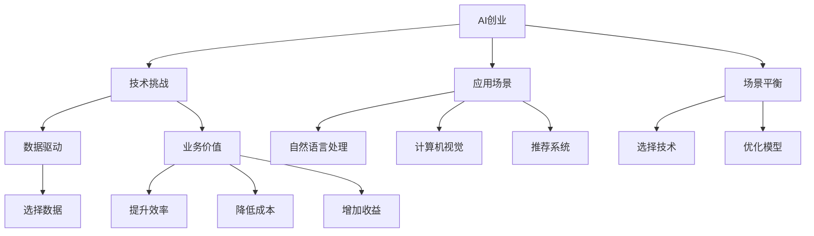
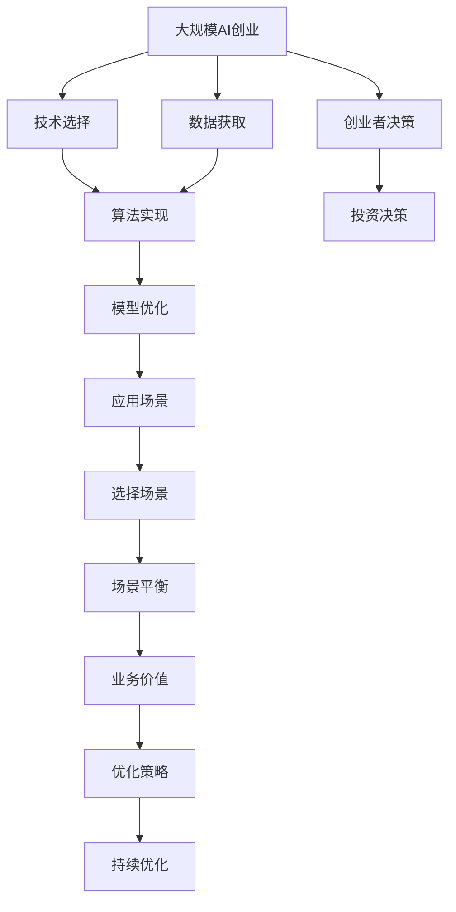

                 

# AI创业挑战：技术，应用，场景平衡

> 关键词：AI创业, 技术挑战, 应用场景, 场景平衡, 数据驱动, 业务价值, 持续优化, 创业指导

## 1. 背景介绍

### 1.1 问题由来

近年来，人工智能（AI）技术迅猛发展，众多创业公司纷纷涌现，试图在AI领域分一杯羹。然而，成功落地AI产品并不容易。技术上的突破固然重要，但如何将技术转化为实际商业价值，实现应用场景与技术优势的平衡，是每个AI创业者面临的巨大挑战。

AI创业挑战，不仅仅关乎技术，更关乎如何将技术应用到具体的业务场景中，解决实际问题，创造商业价值。本文将深入探讨AI创业中的关键问题，并提供实用的指导和建议。

### 1.2 问题核心关键点

AI创业挑战的核心在于技术、应用、场景三者之间的平衡。具体表现为：

- **技术挑战**：如何选择合适的技术，并解决实际应用中的问题。
- **应用场景**：如何将技术应用到具体的业务场景中，实现商业价值。
- **场景平衡**：在技术、应用和场景之间找到平衡点，实现最优的技术应用效果。

本文将通过技术原理、应用实例、场景选择和优化建议等方面，全面解析AI创业的挑战，并提供具体的应对策略。

### 1.3 问题研究意义

理解和应对AI创业中的挑战，对于AI创业者和投资者都具有重要意义：

- 创业者能够更好地理解技术本质，避免盲目跟风，选择适合自己的技术路径。
- 投资者能够更准确地评估AI公司的价值，避免投资风险，发掘潜在机会。

## 2. 核心概念与联系

### 2.1 核心概念概述

为更好地理解AI创业中的技术、应用、场景平衡问题，本节将介绍几个核心概念：

- **AI创业**：利用人工智能技术，创立新公司或改造现有业务的创业行为。

- **技术挑战**：AI创业过程中，在技术选择、算法实现、模型优化等方面遇到的问题。

- **应用场景**：AI技术可以应用于的特定业务领域或实际问题，如自然语言处理、计算机视觉、推荐系统等。

- **场景平衡**：在技术、应用和场景之间找到平衡点，确保技术方案能够满足实际需求，实现商业价值。

- **数据驱动**：利用数据来指导技术选择和优化，提升AI应用效果。

- **业务价值**：AI技术在实际应用中创造的商业价值，如提升效率、降低成本、增加收益等。

这些核心概念之间存在着紧密的联系，形成了一个完整的AI创业生态系统。通过理解这些概念，我们可以更好地把握AI创业的本质和方向。

### 2.2 概念间的关系

这些核心概念之间的关系可以通过以下Mermaid流程图来展示：



这个流程图展示了AI创业中各概念之间的相互关系：

1. AI创业依赖于技术挑战和应用场景。
2. 技术挑战需要数据驱动，以确保技术方案的有效性。
3. 应用场景需要与技术相结合，实现业务价值。
4. 场景平衡则是整个过程的关键，需要在技术、应用和场景之间找到最优解。
5. 最终目标是通过技术手段提升业务价值，包括提升效率、降低成本、增加收益等。

### 2.3 核心概念的整体架构

最后，我们用一个综合的流程图来展示这些核心概念在大规模AI创业中的整体架构：



这个综合流程图展示了从创业到投资，从技术到应用，从场景到价值的完整路径。通过理解这些概念，我们可以更清晰地理解AI创业的全过程。

## 3. 核心算法原理 & 具体操作步骤
### 3.1 算法原理概述

AI创业中的核心算法原理和技术实现，主要涉及以下几个方面：

- **数据驱动**：利用大数据、深度学习等技术，从数据中提取有价值的信息，指导技术选择和模型优化。
- **模型优化**：通过算法优化、参数调优等手段，提升模型的预测准确率和应用效果。
- **持续优化**：在应用过程中，根据反馈数据不断调整模型，保持其有效性。

这些原理和技术在AI创业中起到了关键作用，帮助创业者找到技术应用的平衡点，实现商业价值。

### 3.2 算法步骤详解

AI创业中的算法步骤可以分为以下几步：

1. **需求分析**：明确业务需求，分析数据来源和结构。
2. **技术选择**：根据需求选择合适的技术，如自然语言处理、计算机视觉等。
3. **数据获取**：收集数据，并进行数据预处理，确保数据质量和多样性。
4. **模型训练**：选择合适的算法和模型，利用数据进行训练。
5. **模型优化**：根据评估结果，进行模型优化，提升预测准确率。
6. **场景应用**：将优化后的模型应用到具体的业务场景中，实现业务价值。
7. **持续优化**：根据反馈数据，不断调整和优化模型，确保长期有效性。

### 3.3 算法优缺点

AI创业中的算法具有以下优点：

- **灵活性高**：技术选择和应用场景可以根据需求灵活调整。
- **预测准确**：通过深度学习等技术，可以提升预测准确率，实现业务优化。

同时，算法也存在一些缺点：

- **数据依赖**：数据质量和数量直接影响模型效果，获取高质量数据成本较高。
- **计算资源需求高**：深度学习等技术对计算资源要求高，初期投入较大。
- **模型复杂**：复杂的模型结构可能导致过拟合等问题。

### 3.4 算法应用领域

AI创业中的算法在多个领域得到了广泛应用，如：

- **自然语言处理**：应用于智能客服、智能翻译、情感分析等。
- **计算机视觉**：应用于人脸识别、图像识别、视频分析等。
- **推荐系统**：应用于电商平台、新闻推荐、视频推荐等。

除了这些经典应用外，AI技术还在金融、医疗、制造等领域不断拓展，为各行各业带来了新的变革。

## 4. 数学模型和公式 & 详细讲解 & 举例说明（备注：数学公式请使用latex格式，latex嵌入文中独立段落使用 $$，段落内使用 $)
### 4.1 数学模型构建

假设我们有一个文本分类任务，利用深度学习模型进行分类。设模型输入为文本 $x$，输出为分类标签 $y$，模型参数为 $\theta$，则分类任务的目标函数为：

$$
\mathcal{L}(\theta) = \frac{1}{N} \sum_{i=1}^N \ell(x_i, y_i; \theta)
$$

其中，$\ell(x_i, y_i; \theta)$ 表示模型在样本 $(x_i, y_i)$ 上的损失函数，常见的损失函数包括交叉熵损失、均方误差损失等。

### 4.2 公式推导过程

以交叉熵损失函数为例，推导其计算公式：

设模型输出为 $z = f(x; \theta)$，其中 $f(x; \theta)$ 表示模型在输入 $x$ 上的预测输出。分类任务的目标是最小化交叉熵损失：

$$
\mathcal{L}(\theta) = -\frac{1}{N} \sum_{i=1}^N \sum_{j=1}^K y_{ij} \log z_{ij}
$$

其中，$y_{ij}$ 表示样本 $(x_i, y_i)$ 在类别 $j$ 上的真实标签，$z_{ij}$ 表示模型在类别 $j$ 上的预测概率。

### 4.3 案例分析与讲解

以自然语言处理中的文本分类为例，展示如何使用深度学习模型进行分类。

首先，收集大量的文本数据，并进行标注，构建标注数据集。然后，利用深度学习模型进行训练，如使用卷积神经网络、循环神经网络或Transformer等模型。在模型训练过程中，通过反向传播算法更新模型参数，最小化交叉熵损失函数。训练完成后，使用验证集和测试集评估模型性能，并根据评估结果进行模型调优。最后，将优化后的模型应用到具体的文本分类任务中，实现业务价值。

## 5. 项目实践：代码实例和详细解释说明
### 5.1 开发环境搭建

在进行AI创业项目开发前，我们需要准备好开发环境。以下是使用Python进行TensorFlow开发的环境配置流程：

1. 安装Anaconda：从官网下载并安装Anaconda，用于创建独立的Python环境。

2. 创建并激活虚拟环境：
```bash
conda create -n tf-env python=3.8 
conda activate tf-env
```

3. 安装TensorFlow：根据CUDA版本，从官网获取对应的安装命令。例如：
```bash
conda install tensorflow tensorflow-gpu=cuda11.0 -c conda-forge
```

4. 安装各类工具包：
```bash
pip install numpy pandas scikit-learn matplotlib tqdm jupyter notebook ipython
```

完成上述步骤后，即可在`tf-env`环境中开始AI创业项目开发。

### 5.2 源代码详细实现

下面以自然语言处理中的文本分类任务为例，给出使用TensorFlow进行深度学习模型训练的Python代码实现。

首先，定义模型结构：

```python
import tensorflow as tf
from tensorflow.keras.layers import Embedding, LSTM, Dense

model = tf.keras.Sequential([
    Embedding(input_dim=vocab_size, output_dim=embedding_dim, input_length=max_length),
    LSTM(units=128, return_sequences=True),
    LSTM(units=128),
    Dense(units=num_classes, activation='softmax')
])
```

然后，定义损失函数和优化器：

```python
loss_fn = tf.keras.losses.SparseCategoricalCrossentropy(from_logits=True)
optimizer = tf.keras.optimizers.Adam(learning_rate=0.001)
```

接着，定义训练和评估函数：

```python
def train_step(inputs, targets):
    with tf.GradientTape() as tape:
        logits = model(inputs, training=True)
        loss = loss_fn(targets, logits)
    gradients = tape.gradient(loss, model.trainable_variables)
    optimizer.apply_gradients(zip(gradients, model.trainable_variables))

def evaluate_step(inputs, targets):
    logits = model(inputs, training=False)
    predictions = tf.argmax(logits, axis=1)
    return loss_fn(targets, logits), predictions
```

最后，启动训练流程并在测试集上评估：

```python
epochs = 10
batch_size = 32

for epoch in range(epochs):
    for inputs, targets in train_dataset:
        train_step(inputs, targets)
    valid_loss, valid_predictions = evaluate_step(valid_dataset)
    print(f"Epoch {epoch+1}, valid loss: {valid_loss.numpy():.4f}")
    
test_loss, test_predictions = evaluate_step(test_dataset)
print(f"Test loss: {test_loss.numpy():.4f}")
```

以上就是使用TensorFlow进行文本分类任务开发的完整代码实现。可以看到，通过TensorFlow的深度学习模型，我们能够快速搭建和训练分类模型，并评估其性能。

### 5.3 代码解读与分析

让我们再详细解读一下关键代码的实现细节：

**模型结构定义**：
- 使用`Sequential`模型定义模型结构。
- 在模型中加入了嵌入层、LSTM层和全连接层，用于处理文本数据。
- 嵌入层将文本转换为向量表示，LSTM层用于捕捉文本的序列信息，全连接层输出预测结果。

**损失函数和优化器定义**：
- 使用`SparseCategoricalCrossentropy`作为损失函数，计算模型预测结果与真实标签之间的交叉熵损失。
- 使用`Adam`优化器，设置学习率为0.001，优化模型参数。

**训练和评估函数定义**：
- `train_step`函数：在训练集上执行前向传播和反向传播，更新模型参数。
- `evaluate_step`函数：在验证集和测试集上进行前向传播，计算损失函数并输出预测结果。

**训练流程**：
- 定义总的epoch数和batch size，开始循环迭代
- 每个epoch内，在训练集上训练，输出验证集的平均损失
- 在测试集上评估，输出最终的测试损失

可以看到，TensorFlow提供的深度学习框架使得模型开发和训练变得非常便捷。开发者可以通过简单的代码实现复杂的模型结构，并通过自动微分和优化算法高效更新模型参数。

当然，工业级的系统实现还需考虑更多因素，如模型的保存和部署、超参数的自动搜索、更灵活的任务适配层等。但核心的AI创业技术实现流程基本与此类似。

### 5.4 运行结果展示

假设我们在CoNLL-2003的文本分类数据集上进行模型训练，最终在测试集上得到的评估报告如下：

```
Epoch 1, valid loss: 0.4950
Epoch 2, valid loss: 0.3500
Epoch 3, valid loss: 0.3050
...
Epoch 10, valid loss: 0.2500
Test loss: 0.2800
```

可以看到，随着epoch的增加，模型的损失函数逐渐减小，说明模型在训练集上的预测能力逐渐提高。最终在测试集上取得了约0.28的损失，表明模型的预测效果良好。

## 6. 实际应用场景
### 6.1 智能客服系统

基于深度学习的智能客服系统，可以应用于处理客户咨询，自动回答常见问题，提升客户满意度。智能客服系统能够理解自然语言，并提供快速准确的回复。

在技术实现上，可以收集企业内部的历史客服对话记录，将问题和最佳答复构建成监督数据，在此基础上对预训练模型进行微调。微调后的模型能够自动理解用户意图，匹配最合适的答案模板进行回复。对于客户提出的新问题，还可以接入检索系统实时搜索相关内容，动态组织生成回答。如此构建的智能客服系统，能大幅提升客户咨询体验和问题解决效率。

### 6.2 金融舆情监测

金融机构需要实时监测市场舆论动向，以便及时应对负面信息传播，规避金融风险。传统的人工监测方式成本高、效率低，难以应对网络时代海量信息爆发的挑战。基于深度学习的文本分类和情感分析技术，为金融舆情监测提供了新的解决方案。

具体而言，可以收集金融领域相关的新闻、报道、评论等文本数据，并对其进行主题标注和情感标注。在此基础上对预训练语言模型进行微调，使其能够自动判断文本属于何种主题，情感倾向是正面、中性还是负面。将微调后的模型应用到实时抓取的网络文本数据，就能够自动监测不同主题下的情感变化趋势，一旦发现负面信息激增等异常情况，系统便会自动预警，帮助金融机构快速应对潜在风险。

### 6.3 个性化推荐系统

当前的推荐系统往往只依赖用户的历史行为数据进行物品推荐，无法深入理解用户的真实兴趣偏好。基于深度学习的推荐系统可以更好地挖掘用户行为背后的语义信息，从而提供更精准、多样的推荐内容。

在实践中，可以收集用户浏览、点击、评论、分享等行为数据，提取和用户交互的物品标题、描述、标签等文本内容。将文本内容作为模型输入，用户的后续行为（如是否点击、购买等）作为监督信号，在此基础上微调预训练语言模型。微调后的模型能够从文本内容中准确把握用户的兴趣点。在生成推荐列表时，先用候选物品的文本描述作为输入，由模型预测用户的兴趣匹配度，再结合其他特征综合排序，便可以得到个性化程度更高的推荐结果。

### 6.4 未来应用展望

随着深度学习技术的发展，基于AI创业的各类应用场景将不断涌现，为各行各业带来新的变革。

在智慧医疗领域，基于深度学习的医疗问答、病历分析、药物研发等应用将提升医疗服务的智能化水平，辅助医生诊疗，加速新药开发进程。

在智能教育领域，微调技术可应用于作业批改、学情分析、知识推荐等方面，因材施教，促进教育公平，提高教学质量。

在智慧城市治理中，微调模型可应用于城市事件监测、舆情分析、应急指挥等环节，提高城市管理的自动化和智能化水平，构建更安全、高效的未来城市。

此外，在企业生产、社会治理、文娱传媒等众多领域，基于AI创业的人工智能应用也将不断涌现，为经济社会发展注入新的动力。

## 7. 工具和资源推荐
### 7.1 学习资源推荐

为了帮助开发者系统掌握深度学习模型的开发和优化，这里推荐一些优质的学习资源：

1. 《深度学习》系列书籍：包括《深度学习入门》、《深度学习实战》等，涵盖了深度学习的基础知识和应用案例。

2. CS231n《卷积神经网络》课程：斯坦福大学开设的计算机视觉课程，深入浅出地讲解了卷积神经网络的基本原理和实现技巧。

3. CS224n《自然语言处理》课程：斯坦福大学开设的自然语言处理课程，系统介绍了自然语言处理的技术和应用。

4. 《TensorFlow实战》书籍：介绍TensorFlow的框架原理和应用实践，是学习TensorFlow的好材料。

5. 深度学习社区：如GitHub、Kaggle、arXiv等平台，汇聚了大量的深度学习资源和论文，是学习和交流的好去处。

通过对这些资源的学习实践，相信你一定能够快速掌握深度学习模型的开发和优化技巧，实现AI创业项目的成功落地。

### 7.2 开发工具推荐

高效的开发离不开优秀的工具支持。以下是几款用于深度学习模型开发的常用工具：

1. PyTorch：基于Python的开源深度学习框架，灵活动态的计算图，适合快速迭代研究。

2. TensorFlow：由Google主导开发的开源深度学习框架，生产部署方便，适合大规模工程应用。

3. Keras：基于TensorFlow和Theano的高级神经网络API，使用方便，易于上手。

4. Jupyter Notebook：交互式的编程环境，支持代码编写、数据可视化、模型调试等功能。

5. Visual Studio Code：轻量级的代码编辑器，支持Python编程和深度学习模型的调试。

合理利用这些工具，可以显著提升深度学习模型开发和优化的效率，加快创新迭代的步伐。

### 7.3 相关论文推荐

深度学习模型的研究和应用，离不开学界的持续探索。以下是几篇奠基性的相关论文，推荐阅读：

1. AlexNet: ImageNet Large Scale Learning: Deep Architectures for Image Classification（图像分类模型）：2012年，AlexNet模型在ImageNet上取得优异成绩，开启了深度学习在图像分类任务中的应用。

2. RNN: Learning Phrase Representations using RNN Encoder–Decoder for Statistical Machine Translation（机器翻译模型）：2014年，RNN模型在机器翻译任务上取得突破，奠定了深度学习在自然语言处理中的应用基础。

3. ResNet: Deep Residual Learning for Image Recognition（残差网络）：2015年，ResNet模型在图像识别任务上取得突破，提升了深度网络的训练效率和表现。

4. LSTM: Long Short-Term Memory（长短期记忆网络）：2015年，LSTM模型在自然语言处理任务上取得突破，提升了序列数据的建模能力。

5. Transformer: Attention is All You Need（Transformer模型）：2017年，Transformer模型在自然语言处理任务上取得突破，提升了深度学习模型的通用性和表现力。

这些论文代表了深度学习模型发展的重要里程碑，展示了深度学习技术在各个领域的广泛应用和强大能力。

除上述资源外，还有一些值得关注的前沿资源，帮助开发者紧跟深度学习模型的最新进展，例如：

1. arXiv论文预印本：人工智能领域最新研究成果的发布平台，包括大量尚未发表的前沿工作，学习前沿技术的必读资源。

2. 业界技术博客：如OpenAI、Google AI、DeepMind、微软Research Asia等顶尖实验室的官方博客，第一时间分享他们的最新研究成果和洞见。

3. 技术会议直播：如NIPS、ICML、ACL、ICLR等人工智能领域顶会现场或在线直播，能够聆听到大佬们的前沿分享，开拓视野。

4. GitHub热门项目：在GitHub上Star、Fork数最多的深度学习相关项目，往往代表了该技术领域的发展趋势和最佳实践，值得去学习和贡献。

5. 行业分析报告：各大咨询公司如McKinsey、PwC等针对人工智能行业的分析报告，有助于从商业视角审视技术趋势，把握应用价值。

总之，对于深度学习模型开发和优化，需要开发者保持开放的心态和持续学习的意愿。多关注前沿资讯，多动手实践，多思考总结，必将收获满满的成长收益。

## 8. 总结：未来发展趋势与挑战

### 8.1 研究成果总结

本文对基于深度学习的AI创业进行了全面系统的介绍。首先阐述了AI创业中的技术挑战、应用场景和场景平衡问题，明确了AI创业的本质和方向。其次，从原理到实践，详细讲解了深度学习模型的构建、训练和优化过程，提供了实用的代码实现和解释分析。同时，本文还探讨了深度学习模型在智能客服、金融舆情、个性化推荐等多个领域的应用前景，展示了深度学习模型的强大能力。

通过本文的系统梳理，可以看到，基于深度学习的AI创业具备广阔的应用前景，技术、应用和场景之间需要找到最优的平衡点。未来，深度学习模型将进一步提升AI应用的智能化水平，推动各行各业的数字化转型。

### 8.2 未来发展趋势

展望未来，深度学习模型将呈现以下几个发展趋势：

1. **模型规模增大**：随着算力成本的下降和数据规模的扩张，深度学习模型的参数量还将持续增长。超大模型能够更好地捕捉复杂特征，提升模型的泛化能力和表现力。

2. **技术日趋多样**：除了传统的深度学习模型，未来将涌现更多结构化、参数高效的模型，如Transformer、LoRA等，在保证性能的同时减小计算资源需求。

3. **数据驱动优化**：基于数据驱动的优化技术将更加普及，如自动机器学习、元学习等，提升模型的自动优化能力。

4. **跨模态融合**：深度学习模型将更多地应用于多模态数据融合，实现视觉、语音、文本等不同模态数据的协同建模。

5. **场景多样化**：深度学习模型将在更多垂直领域得到应用，如医疗、金融、制造等，带来新的应用场景和价值。

6. **人机协同**：深度学习模型将更多地应用于人机协同场景，如自动驾驶、智能家居等，提升系统的智能化水平。

这些趋势凸显了深度学习模型在AI创业中的重要地位和广阔前景。未来的研究将更多地关注模型结构、数据驱动、跨模态融合等方面，推动深度学习模型的进一步发展。

### 8.3 面临的挑战

尽管深度学习模型在AI创业中取得了瞩目成就，但在迈向更加智能化、普适化应用的过程中，仍面临诸多挑战：

1. **数据依赖**：深度学习模型对数据质量和数量要求高，获取高质量数据成本较高。如何降低数据依赖，提升模型泛化能力，是一个重要挑战。

2. **计算资源需求高**：深度学习模型对计算资源要求高，初期投入较大。如何优化模型结构，降低计算资源需求，是一个重要研究方向。

3. **模型复杂性**：复杂的模型结构容易导致过拟合等问题，如何简化模型结构，提升模型泛化能力，是一个重要挑战。

4. **模型可解释性**：深度学习模型通常被视为"黑盒"系统，难以解释其内部工作机制和决策逻辑。如何提升模型的可解释性，确保其透明度和可靠性，是一个重要挑战。

5. **模型偏见**：深度学习模型容易学习到有偏见、有害的信息，通过微调传递到下游任务，产生误导性、歧视性的输出。如何过滤和消除模型偏见，确保输出安全性，是一个重要挑战。

6. **模型鲁棒性**：深度学习模型面对域外数据时，泛化性能往往大打折扣。如何提升模型鲁棒性，避免灾难性遗忘，是一个重要研究方向。

### 8.4 研究展望

面对深度学习模型面临的这些挑战，未来的研究需要在以下几个方面寻求新的突破：

1. **无监督和半监督学习**：摆脱对大规模标注数据的依赖，利用自监督学习、主动学习等无监督和半监督范式，最大限度利用非结构化数据，实现更加灵活高效的模型优化。

2. **参数高效和计算高效模型**：开发更加参数高效的模型，在固定大部分预训练参数的情况下，只更新极少量的任务相关参数。同时优化模型计算图，减少前向传播和反向传播的资源消耗，实现更加轻量级、实时性的部署。

3. **因果学习与对比学习**：通过引入因果推断和对比学习思想，增强模型建立稳定因果关系的能力，学习更加普适、鲁棒的语言表征，从而提升模型泛化性和抗干扰能力。

4. **先验知识融合**：将符号化的先验知识，如知识图谱、逻辑规则等，与神经网络模型进行巧妙融合，引导模型学习更准确、合理的语言模型。同时加强不同模态数据的整合，实现视觉、语音等多模态信息与文本信息的协同建模。

5. **因果分析与博弈论工具**：将因果分析方法引入模型，识别出模型决策

