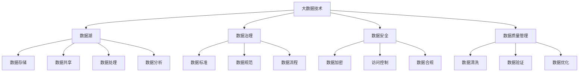

                 

## 1. 背景介绍

在大数据时代的今天，数据已经成为创业公司的核心资产。高效、安全、合理的数据管理不仅能为企业带来直接的经济效益，还能支撑创新项目的研发与落地。但如何高效地管理数据、最大化数据价值，是很多创业公司在数字化转型过程中面临的挑战。

### 1.1 问题由来
随着移动互联网、物联网、人工智能等技术的迅猛发展，数据产生量呈指数级增长。尤其在大数据、云计算、人工智能等新兴领域，数据驱动决策的重要性愈发显著。对于AI创业公司而言，数据管理不仅仅是存储和查询，更是利用数据支撑产品、提升服务的重要手段。然而，数据管理是一项复杂而艰巨的任务，数据质量差、数据孤岛、数据安全等问题频发。

### 1.2 问题核心关键点
数据管理主要围绕数据质量、数据安全、数据治理等关键问题展开。高效的数据管理能够确保数据的一致性、完整性、准确性，同时保障数据在隐私和合规方面的安全，并帮助企业构建统一、可扩展的数据治理体系。

- **数据质量**：保证数据的真实性、准确性和一致性。
- **数据安全**：防止数据泄露、篡改和未授权访问，保护数据隐私。
- **数据治理**：建立标准化、系统化的数据管理制度，确保数据有序、可靠地流转。

### 1.3 问题研究意义
高效的数据管理对创业公司的成功至关重要。数据驱动决策和创新不仅需要海量的数据，更需要高质量、规范化的数据支持。通过高效的数据管理，创业公司可以：

1. **提升决策效率**：利用大数据分析优化决策流程，快速响应市场变化。
2. **降低成本**：通过数据共享和整合，减少重复建设，提升资源利用率。
3. **增强竞争力**：通过数据洞察，发现新商机、挖掘新市场，领先竞争对手。
4. **保障合规性**：确保数据在隐私、合规等方面的安全，避免法律风险。

## 2. 核心概念与联系

### 2.1 核心概念概述

在探讨数据管理的最佳实践之前，先明确几个核心概念：

- **大数据技术**：涉及数据的生成、存储、处理、分析等多个环节，包括Hadoop、Spark、Hive等技术栈。
- **数据湖**：构建集中存储、统一治理的数据平台，支持多源数据的存储、共享和分析。
- **数据治理**：通过制定标准、规范和流程，确保数据的一致性、完整性和可用性。
- **数据安全**：保护数据在生成、存储、处理和传输过程中的安全和隐私。
- **数据质量管理**：通过监控、清洗和优化，保证数据的准确性和一致性。

这些概念之间的关系可以用以下Mermaid流程图来表示：



这个流程图展示了大数据技术、数据湖、数据治理、数据安全和数据质量管理之间的关系。数据湖是大数据技术的核心，提供数据存储和共享的平台。数据治理、数据安全和数据质量管理则是在数据湖的基础上，确保数据的一致性、完整性、安全和准确性。

### 2.2 概念间的关系

- **数据湖与大数据技术**：数据湖是利用大数据技术存储和处理海量数据的结果。
- **数据湖与数据治理**：数据湖提供了统一的数据治理框架，确保数据的规范化和标准化。
- **数据湖与数据安全**：数据湖通过加密、访问控制等措施保障数据的安全性。
- **数据湖与数据质量管理**：数据湖支撑数据质量管理过程中的数据清洗、验证和优化。

## 3. 核心算法原理 & 具体操作步骤

### 3.1 算法原理概述

数据管理的最佳实践基于以下几个核心原理：

1. **数据质量管理**：通过数据清洗、验证和优化，确保数据的准确性和一致性。
2. **数据安全**：通过数据加密、访问控制和合规审查，保护数据的安全性。
3. **数据治理**：建立统一的数据标准、规范和流程，确保数据的高效治理和利用。
4. **数据湖构建**：利用大数据技术，构建集中存储、统一治理的数据湖平台。
5. **数据共享与协作**：通过API、数据API等技术，实现数据在团队、部门之间的共享和协作。

### 3.2 算法步骤详解

数据管理的最佳实践可以分为以下几个步骤：

**Step 1: 数据质量评估**

1. **数据源分析**：分析数据源的完整性、一致性和准确性。
2. **数据清洗**：删除重复、错误和无关数据。
3. **数据验证**：通过统计和测试，验证数据的质量。

**Step 2: 数据治理**

1. **建立数据标准**：制定数据命名规范、数据格式规范等标准。
2. **制定数据流程**：设计数据输入、处理和输出的流程。
3. **数据审计**：定期审计数据流程，确保数据质量。

**Step 3: 数据安全**

1. **数据加密**：对数据进行加密处理，防止数据泄露。
2. **访问控制**：根据权限分配，限制数据访问权限。
3. **合规审查**：确保数据处理符合相关法律法规。

**Step 4: 数据湖构建**

1. **数据存储**：利用Hadoop、Spark等技术，构建集中存储的数据湖。
2. **数据清洗和整合**：清洗数据，整合不同数据源。
3. **数据治理**：通过元数据管理、数据质量管理，确保数据的一致性和可用性。

**Step 5: 数据共享与协作**

1. **数据API设计**：设计简单易用的数据API，方便数据共享。
2. **API访问控制**：根据权限控制API访问，保障数据安全。
3. **协作平台**：搭建数据协作平台，促进团队之间的数据共享和合作。

### 3.3 算法优缺点

数据管理最佳实践的优势和劣势如下：

**优势**：

1. **提升数据质量**：通过数据清洗、验证和优化，确保数据的准确性和一致性。
2. **保障数据安全**：通过加密、访问控制和合规审查，保护数据的安全性。
3. **优化数据治理**：建立统一的数据标准、规范和流程，确保数据的高效治理和利用。
4. **构建高效数据湖**：利用大数据技术，构建集中存储、统一治理的数据湖平台。
5. **促进数据共享与协作**：通过API和协作平台，实现数据在团队、部门之间的共享和协作。

**劣势**：

1. **实施成本高**：数据质量管理、数据安全、数据治理等需要投入大量的人力和物力资源。
2. **技术门槛高**：涉及大数据、数据安全和数据治理等多个技术领域，需要较高的技术积累和专业能力。
3. **执行难度大**：数据管理和数据治理需要高层管理者的支持和决策，执行过程中可能遇到组织文化、部门利益等方面的阻力。

### 3.4 算法应用领域

数据管理最佳实践在多个领域得到广泛应用：

1. **大数据分析**：通过数据清洗和整合，提升数据分析的准确性和效率。
2. **人工智能**：利用数据湖和数据共享，支撑AI模型的训练和部署。
3. **云计算**：构建数据治理体系，确保云平台的数据安全和合规性。
4. **电子商务**：通过数据治理和数据安全，提升用户交易和隐私保护。
5. **金融服务**：保障数据安全，提升金融风险管理和合规性。
6. **医疗健康**：保护患者隐私，提升医疗数据的利用和分析。

## 4. 数学模型和公式 & 详细讲解  
### 4.1 数学模型构建

数据管理最佳实践的核心数学模型包括数据质量评估、数据安全保护和数据治理流程。以数据质量管理为例，构建数学模型的主要步骤如下：

1. **数据完整性评估**：定义数据完整性指标，计算缺失值比例。
2. **数据一致性评估**：定义数据一致性指标，检测重复数据。
3. **数据准确性评估**：定义数据准确性指标，检测错误数据。

假设数据集 $D=\{(x_i,y_i)\}_{i=1}^N$，其中 $x$ 为数据样本，$y$ 为标签。定义数据完整性、一致性和准确性指标分别为 $I(x)$、$C(x)$ 和 $A(x)$。数据质量综合指标 $Q(x)$ 为：

$$
Q(x) = \frac{1}{N}\sum_{i=1}^N (I(x_i) + C(x_i) + A(x_i))
$$

### 4.2 公式推导过程

以数据一致性评估为例，定义数据一致性指标 $C(x)$：

1. **数据去重**：使用哈希表或排序算法，计算重复数据的比例。
2. **数据去重公式**：

$$
C(x) = \frac{1}{N}\sum_{i=1}^N \text{count}(\text{unique\_data\_count(x_i))}
$$

其中 $\text{unique\_data\_count(x_i)$ 表示数据样本 $x_i$ 的去重后数据数量。

### 4.3 案例分析与讲解

以医疗数据为例，医疗数据包含患者的病历、体检、诊疗信息等，对数据的完整性、一致性和准确性要求极高。

**Step 1: 数据完整性评估**

1. **数据源分析**：分析病历、体检和诊疗信息的数据完整性。
2. **数据清洗**：删除重复病历、缺失数据和错误数据。
3. **数据验证**：通过统计和测试，验证数据的完整性。

**Step 2: 数据一致性评估**

1. **数据去重**：使用哈希表或排序算法，计算重复病历的比例。
2. **数据去重公式**：

$$
C(x) = \frac{1}{N}\sum_{i=1}^N \text{count}(\text{unique\_biography(x_i))}
$$

其中 $\text{unique\_biography(x_i)$ 表示病历数据去重后的数据数量。

**Step 3: 数据准确性评估**

1. **数据校验**：通过比对不同来源的数据，检测数据的准确性。
2. **数据校验公式**：

$$
A(x) = \frac{1}{N}\sum_{i=1}^N \text{count}(\text{accuracy\_check(x_i))}
$$

其中 $\text{accuracy\_check(x_i)$ 表示数据样本 $x_i$ 的准确性检查结果。

## 5. 项目实践：代码实例和详细解释说明
### 5.1 开发环境搭建

在项目实践前，我们需要准备好开发环境。以下是使用Python进行Pandas开发的环境配置流程：

1. 安装Anaconda：从官网下载并安装Anaconda，用于创建独立的Python环境。

2. 创建并激活虚拟环境：
```bash
conda create -n pandas-env python=3.8 
conda activate pandas-env
```

3. 安装Pandas：
```bash
pip install pandas
```

4. 安装其他工具包：
```bash
pip install numpy scikit-learn matplotlib tqdm jupyter notebook ipython
```

完成上述步骤后，即可在`pandas-env`环境中开始数据管理项目实践。

### 5.2 源代码详细实现

下面我们以医疗数据质量管理为例，给出使用Pandas库进行数据质量评估的Python代码实现。

首先，定义数据质量评估函数：

```python
import pandas as pd
from sklearn.metrics import precision_score, recall_score, f1_score

def data_quality_analysis(data):
    # 计算缺失值比例
    missing_count = data.isnull().sum().sum()
    missing_ratio = missing_count / len(data)
    
    # 计算重复数据比例
    unique_count = data.nunique().sum()
    duplicate_ratio = (data.shape[0] - unique_count) / len(data)
    
    # 计算准确性
    accuracy = precision_score(data['actual'], data['predicted'], average='macro')
    
    return missing_ratio, duplicate_ratio, accuracy
```

然后，加载医疗数据并分析数据质量：

```python
data = pd.read_csv('medical_data.csv')
missing_ratio, duplicate_ratio, accuracy = data_quality_analysis(data)
print(f"缺失值比例: {missing_ratio}")
print(f"重复数据比例: {duplicate_ratio}")
print(f"准确性: {accuracy}")
```

以上就是使用Pandas库进行数据质量管理的完整代码实现。可以看到，Pandas提供了强大的数据处理和分析功能，可以快速计算数据的缺失值、重复数据和准确性等指标。

### 5.3 代码解读与分析

让我们再详细解读一下关键代码的实现细节：

**data_quality_analysis函数**：
- 首先，计算数据的缺失值比例，通过`isnull()`和`sum()`方法计算缺失值数量和数据总数。
- 其次，计算数据的重复数据比例，通过`nunique()`方法计算唯一数据数量，数据总数减去唯一数量即为重复数据数量。
- 最后，计算数据准确性，使用`precision_score`方法计算预测值和实际值的准确性。

**数据加载**：
- 使用`pd.read_csv`方法从CSV文件中加载数据，方便后续的分析和处理。

**打印输出**：
- 通过`print`方法，将计算结果输出到控制台。

## 6. 实际应用场景
### 6.1 智能推荐系统

智能推荐系统需要高效的数据管理来支撑用户行为数据的存储和分析。通过数据治理和数据质量管理，推荐系统可以确保数据的准确性和一致性，从而提升推荐效果。

**数据治理**：
- 制定数据标准和流程，确保数据的命名规范和格式统一。
- 定期审计数据流程，确保数据的一致性和可用性。

**数据质量管理**：
- 清洗和整合用户行为数据，去除重复和错误数据。
- 通过数据验证，确保用户行为数据的准确性和完整性。

**数据安全**：
- 对用户行为数据进行加密处理，保护用户隐私。
- 根据权限控制数据访问，防止未授权访问。

### 6.2 金融风险管理

金融风险管理需要高效的数据管理来支撑金融数据的存储和分析。通过数据治理和数据质量管理，金融管理系统可以确保数据的准确性和一致性，从而提升风险评估的准确性。

**数据治理**：
- 制定数据标准和流程，确保金融数据的命名规范和格式统一。
- 定期审计数据流程，确保金融数据的一致性和可用性。

**数据质量管理**：
- 清洗和整合金融数据，去除重复和错误数据。
- 通过数据验证，确保金融数据的准确性和完整性。

**数据安全**：
- 对金融数据进行加密处理，保护客户隐私。
- 根据权限控制数据访问，防止未授权访问。

### 6.3 医疗健康

医疗健康领域对数据管理有极高的要求，数据治理和数据质量管理能够保障患者隐私，提升医疗数据的利用和分析。

**数据治理**：
- 制定数据标准和流程，确保医疗数据的命名规范和格式统一。
- 定期审计数据流程，确保医疗数据的一致性和可用性。

**数据质量管理**：
- 清洗和整合医疗数据，去除重复和错误数据。
- 通过数据验证，确保医疗数据的准确性和完整性。

**数据安全**：
- 对医疗数据进行加密处理，保护患者隐私。
- 根据权限控制数据访问，防止未授权访问。

### 6.4 未来应用展望

伴随数据管理技术的不断演进，未来数据管理将呈现以下几个趋势：

1. **自动化数据管理**：通过AI技术，自动化数据清洗、去重和验证等过程，减少人工干预，提升效率。
2. **多源数据融合**：利用大数据技术，整合来自不同渠道的数据，提升数据的多样性和丰富性。
3. **数据隐私保护**：通过加密和访问控制，保障数据在传输和存储过程中的隐私和安全。
4. **数据合规管理**：引入合规管理机制，确保数据处理符合法律法规，避免法律风险。
5. **数据资产化**：将数据视为企业的核心资产，通过数据治理和数据质量管理，提升数据价值。

## 7. 工具和资源推荐
### 7.1 学习资源推荐

为了帮助开发者系统掌握数据管理的理论基础和实践技巧，这里推荐一些优质的学习资源：

1. **《大数据技术基础》**：由知名专家撰写，系统介绍了大数据技术的基本概念和应用场景。
2. **《数据科学与数据工程》**：来自斯坦福大学的经典教材，涵盖数据管理、数据治理和数据质量管理等多个方面。
3. **《Python数据科学手册》**：详细介绍了Python在数据科学和数据工程中的应用，涵盖Pandas、NumPy、Scikit-Learn等工具的使用。
4. **《数据治理最佳实践》**：由行业专家撰写，系统介绍了数据治理的流程和工具，适用于企业数据管理实践。
5. **《数据安全与隐私保护》**：涵盖数据加密、访问控制、合规管理等主题，适合数据安全领域的学习。

通过对这些资源的学习实践，相信你一定能够快速掌握数据管理的精髓，并用于解决实际的数据问题。

### 7.2 开发工具推荐

高效的数据管理离不开优秀的工具支持。以下是几款用于数据管理开发的常用工具：

1. **Pandas**：Python数据处理库，提供强大的数据清洗、去重、聚合和分析功能。
2. **Hadoop**：分布式存储和计算平台，支持大规模数据处理和分析。
3. **Spark**：分布式计算框架，支持数据清洗、去重和数据分析。
4. **Hive**：基于Hadoop的数据仓库，支持数据查询和聚合。
5. **Databricks**：基于Spark的数据处理平台，提供一站式的数据分析和机器学习解决方案。
6. **Amazon S3**：云存储服务，提供高效、安全的数据存储和管理。
7. **Google Cloud BigQuery**：云数据仓库，支持高效的数据查询和分析。

合理利用这些工具，可以显著提升数据管理的效率和准确性，加快数据资产化的进程。

### 7.3 相关论文推荐

数据管理技术的发展离不开学界的持续研究。以下是几篇奠基性的相关论文，推荐阅读：

1. **《数据治理实践指南》**：由国际数据治理协会(IDGC)发布，提供了数据治理的最佳实践和指南。
2. **《大数据技术应用》**：来自MIT的学术论文，介绍了大数据技术在多个行业中的应用案例。
3. **《数据安全和隐私保护》**：由IEEE发布的论文，探讨了数据加密、访问控制和合规管理等技术。
4. **《数据质量管理方法》**：来自ACM的论文，介绍了数据清洗、验证和优化的多种方法。
5. **《自动化数据管理技术》**：来自Apache的论文，介绍了自动数据清洗、去重和验证的最新技术。

这些论文代表了大数据管理技术的发展脉络。通过学习这些前沿成果，可以帮助研究者把握学科前进方向，激发更多的创新灵感。

除上述资源外，还有一些值得关注的前沿资源，帮助开发者紧跟数据管理技术的最新进展，例如：

1. **arXiv论文预印本**：人工智能领域最新研究成果的发布平台，包括大量尚未发表的前沿工作，学习前沿技术的必读资源。
2. **业界技术博客**：如Big Data、Data Science、KDnuggets等顶尖实验室的官方博客，第一时间分享他们的最新研究成果和洞见。
3. **技术会议直播**：如Data Science Conference、Big Data Conference、KDD等人工智能领域顶会现场或在线直播，能够聆听到大佬们的前沿分享，开拓视野。
4. **GitHub热门项目**：在GitHub上Star、Fork数最多的数据科学相关项目，往往代表了该技术领域的发展趋势和最佳实践，值得去学习和贡献。
5. **行业分析报告**：各大咨询公司如McKinsey、PwC等针对大数据领域的分析报告，有助于从商业视角审视技术趋势，把握应用价值。

总之，对于数据管理技术的学习和实践，需要开发者保持开放的心态和持续学习的意愿。多关注前沿资讯，多动手实践，多思考总结，必将收获满满的成长收益。

## 8. 总结：未来发展趋势与挑战

### 8.1 总结

本文对数据管理的最佳实践进行了全面系统的介绍。首先阐述了数据管理在创业公司中的重要性，明确了数据质量、数据安全、数据治理等核心问题。其次，从原理到实践，详细讲解了数据管理的数学模型和关键步骤，给出了数据管理项目开发的完整代码实例。同时，本文还广泛探讨了数据管理方法在智能推荐、金融风险、医疗健康等多个行业领域的应用前景，展示了数据管理的巨大潜力。此外，本文精选了数据管理技术的各类学习资源，力求为读者提供全方位的技术指引。

通过本文的系统梳理，可以看到，高效的数据管理对创业公司的成功至关重要。数据驱动决策和创新不仅需要海量的数据，更需要高质量、规范化的数据支持。通过高效的数据管理，创业公司可以提升决策效率，降低成本，增强竞争力，并保障数据安全和合规性。未来，伴随数据管理技术的不断演进，相信数据管理必将在更多领域得到应用，为传统行业带来变革性影响。

### 8.2 未来发展趋势

展望未来，数据管理技术将呈现以下几个发展趋势：

1. **自动化数据管理**：通过AI技术，自动化数据清洗、去重和验证等过程，减少人工干预，提升效率。
2. **多源数据融合**：利用大数据技术，整合来自不同渠道的数据，提升数据的多样性和丰富性。
3. **数据隐私保护**：通过加密和访问控制，保障数据在传输和存储过程中的隐私和安全。
4. **数据合规管理**：引入合规管理机制，确保数据处理符合法律法规，避免法律风险。
5. **数据资产化**：将数据视为企业的核心资产，通过数据治理和数据质量管理，提升数据价值。

以上趋势凸显了数据管理技术的广阔前景。这些方向的探索发展，必将进一步提升数据管理的效率和质量，为构建智能系统和企业数字化转型提供坚实的技术基础。

### 8.3 面临的挑战

尽管数据管理技术已经取得了瞩目成就，但在迈向更加智能化、普适化应用的过程中，它仍面临着诸多挑战：

1. **数据质量保障**：数据清洗、去重和验证等过程复杂耗时，需要投入大量人力和时间资源。
2. **数据隐私保护**：在数据共享和数据分析过程中，如何平衡数据利用和隐私保护，仍需不断探索。
3. **数据安全和合规**：数据安全和合规管理涉及多方协作和多方利益，执行过程中可能遇到组织文化、部门利益等方面的阻力。
4. **数据治理体系**：数据治理需要高层管理者的支持和决策，如何在企业内部建立统一、规范的数据治理体系，仍需不断努力。

### 8.4 研究展望

面对数据管理所面临的挑战，未来的研究需要在以下几个方面寻求新的突破：

1. **引入AI技术**：利用AI技术自动化数据清洗、去重和验证等过程，减少人工干预，提升效率。
2. **优化数据处理流程**：设计高效的数据处理流程，提升数据管理系统的性能和稳定性。
3. **引入隐私计算**：通过隐私计算技术，在不暴露数据隐私的情况下，实现数据共享和分析。
4. **建立合规框架**：引入合规管理机制，确保数据处理符合法律法规，避免法律风险。
5. **引入知识图谱**：通过知识图谱技术，提升数据的多样性和丰富性，促进数据利用和分析。

这些研究方向的探索，必将引领数据管理技术迈向更高的台阶，为构建安全、可靠、可解释、可控的智能系统铺平道路。面向未来，数据管理技术还需要与其他人工智能技术进行更深入的融合，如知识表示、因果推理、强化学习等，多路径协同发力，共同推动智能系统和数据治理的进步。只有勇于创新、敢于突破，才能不断拓展数据管理的边界，让数据技术更好地服务于企业的数字化转型和智能化升级。

## 9. 附录：常见问题与解答

**Q1：如何高效地进行数据治理？**

A: 高效的数据治理需要制定明确的数据标准和规范，建立统一的数据治理流程，定期审计数据流程。同时，可以利用数据管理工具，如数据湖、数据治理平台，自动化数据治理过程。

**Q2：数据安全和隐私保护需要注意哪些问题？**

A: 数据安全和隐私保护需要注意以下几个方面：

1. 数据加密：对敏感数据进行加密处理，防止未授权访问。
2. 访问控制：根据权限分配数据访问权限，限制未授权访问。
3. 合规管理：确保数据处理符合法律法规，避免法律风险。

**Q3：如何提高数据质量？**

A: 提高数据质量需要以下几个步骤：

1. 数据清洗：去除重复、错误和无关数据。
2. 数据验证：通过统计和测试，验证数据的质量。
3. 数据优化：通过数据清洗、去重和验证，提升数据质量。

**Q4：数据管理在智能推荐系统中扮演什么角色？**

A: 在智能推荐系统中，数据管理发挥着至关重要的作用：

1. 数据治理：制定数据标准和流程，确保数据的一致性和可用性。
2. 数据质量管理：清洗和整合用户行为数据，去除重复和错误数据。
3. 数据安全：对用户行为数据进行加密处理，保护用户隐私。

**Q5：数据管理对金融风险管理的重要性是什么？**

A: 数据管理对

