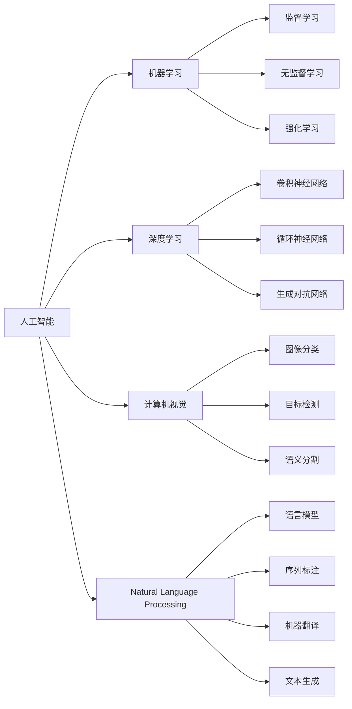

                 

# AI发展历程中的关键人物与技术

## 1. 背景介绍

人工智能（Artificial Intelligence, AI）作为计算机科学的皇冠上的一颗璀璨明珠，自诞生以来，已经经历了数十年的探索和发展，孕育出众多关键人物与技术，推动着整个领域的不断进步。本文旨在梳理AI发展的历史脉络，重点介绍其中的关键人物与技术，展示AI在各个阶段所取得的突破与成就。

## 2. 核心概念与联系

### 2.1 核心概念概述

在讨论AI的关键人物与技术之前，我们先来明确几个核心概念：

- **人工智能（AI）**：一种使计算机能够模拟人类智能行为的技术，涵盖了感知、推理、学习、规划等多方面能力。
- **机器学习（Machine Learning, ML）**：通过数据和算法，使计算机能够自动改进其性能。
- **深度学习（Deep Learning, DL）**：一种特殊的机器学习方法，利用多层神经网络模拟人类大脑的工作方式，处理大规模复杂数据。
- **计算机视觉（Computer Vision, CV）**：使计算机能够"看"和理解图像和视频，识别和分类物体。
- **自然语言处理（Natural Language Processing, NLP）**：使计算机能够"听"和理解人类语言，处理和生成自然语言文本。

这些概念相互关联，共同构成了AI技术的核心。它们之间的联系可以通过以下Mermaid流程图表示：



### 2.2 概念间的关系

以上概念通过一系列的箭头连接起来，形成了AI技术的发展脉络：

- 人工智能（A）包含机器学习（B）、深度学习（F）、计算机视觉（J）和自然语言处理（N）等多种子领域。
- 机器学习（B）可以进一步分为监督学习（C）、无监督学习（D）和强化学习（E）三种主要方法。
- 深度学习（F）利用了卷积神经网络（G）、循环神经网络（H）和生成对抗网络（I）等多种模型。
- 计算机视觉（J）包括了图像分类（K）、目标检测（L）和语义分割（M）等任务。
- 自然语言处理（N）包含了语言模型（O）、序列标注（P）、机器翻译（Q）和文本生成（R）等子任务。

这些概念和任务之间的相互联系和影响，构成了AI技术发展的基础。

## 3. 核心算法原理 & 具体操作步骤

### 3.1 算法原理概述

AI算法的发展主要经历了三个阶段：符号主义、连接主义和统计学习。每个阶段都涌现出了一系列关键技术和理论。

- **符号主义（Symbolism）**：基于规则和逻辑的方法，通过定义清晰的符号和规则来模拟人类推理过程。
- **连接主义（Connectionism）**：通过神经网络和模拟人类神经系统的连接方式来实现人工智能。
- **统计学习（Statistical Learning）**：利用数据和统计方法，通过机器学习算法实现对数据和模式的归纳和推理。

这三个阶段各自提出了不同的算法原理和方法，共同推动了AI技术的进步。

### 3.2 算法步骤详解

以下是AI发展中几个关键算法的详细步骤：

#### 3.2.1 符号主义：IF-THEN规则

- **定义规则**：先定义一系列IF-THEN规则，描述输入和输出之间的关系。
- **编码规则**：将规则转化为计算机可以执行的符号和逻辑。
- **执行规则**：使用规则对新输入进行处理，得到输出。

#### 3.2.2 连接主义：BP算法

- **构建网络**：构建多层神经网络，定义网络结构。
- **前向传播**：将输入数据送入网络，计算网络输出。
- **反向传播**：通过计算输出与目标之间的误差，反向传播误差，更新网络权重。
- **重复迭代**：重复执行前向和反向传播，逐步优化网络。

#### 3.2.3 统计学习：K-means算法

- **初始化聚类中心**：随机选择K个初始聚类中心。
- **计算距离**：计算每个样本到每个聚类中心的距离。
- **分配样本**：将每个样本分配到最近的聚类中心。
- **更新中心**：根据分配的样本，重新计算并更新聚类中心。
- **重复迭代**：重复上述步骤，直到收敛。

### 3.3 算法优缺点

#### 3.3.1 符号主义

- **优点**：定义清晰、易于理解和解释。
- **缺点**：依赖专家知识，无法处理复杂任务。

#### 3.3.2 连接主义

- **优点**：能够处理大规模数据，自适应学习能力强。
- **缺点**：计算复杂度高，训练时间长。

#### 3.3.3 统计学习

- **优点**：数据驱动，可处理复杂非线性问题。
- **缺点**：依赖大量数据，模型解释性差。

### 3.4 算法应用领域

AI的算法和技术在多个领域得到了广泛应用：

- **计算机视觉**：用于图像识别、目标检测、人脸识别等任务。
- **自然语言处理**：用于文本分类、情感分析、机器翻译等任务。
- **机器人**：用于导航、控制、感知等任务。
- **自动驾驶**：用于环境感知、路径规划、决策控制等任务。

## 4. 数学模型和公式 & 详细讲解

### 4.1 数学模型构建

AI算法通常基于数学模型构建，以下是几个核心模型的数学表达：

- **线性回归**：$y = wx + b$
- **逻辑回归**：$P(y=1) = \sigma(w^Tx + b)$
- **卷积神经网络**：$y = f(W*X + b)$
- **循环神经网络**：$y_t = f(W_h \cdot h_{t-1} + W_x \cdot x_t + b)$
- **K-means聚类**：$k = \underset{k}{\arg\min}\sum_{i=1}^N ||x_i - \mu_k||^2$

### 4.2 公式推导过程

#### 4.2.1 线性回归

假设有一组样本数据 $(x_i, y_i)$，其中 $x_i$ 为输入，$y_i$ 为输出，目标是找到一个线性函数 $y = wx + b$ 来拟合数据。通过最小二乘法，可以得到权重 $w$ 和偏置 $b$ 的计算公式：

$$
w = \frac{X^TX}{X^TX}X^Ty \\
b = \frac{X^Ty}{X^TX} - wx
$$

#### 4.2.2 逻辑回归

逻辑回归用于二分类问题，假设有一组样本数据 $(x_i, y_i)$，其中 $y_i \in \{0, 1\}$，目标是找到一个逻辑函数 $P(y=1) = \sigma(w^Tx + b)$ 来预测 $y_i$。通过最大似然估计，可以得到权重 $w$ 和偏置 $b$ 的计算公式：

$$
\hat{y} = \sigma(w^Tx + b) \\
\frac{\partial L}{\partial w} = \frac{1}{N}\sum_{i=1}^N [y_i(\sigma(w^Tx + b) - 1) + (1-y_i)\sigma(w^Tx + b)]
$$

### 4.3 案例分析与讲解

以图像分类为例，使用卷积神经网络（CNN）进行图像分类：

- **输入**：输入一张28x28的图像。
- **卷积层**：使用多个卷积核，提取图像的特征。
- **池化层**：对特征图进行下采样，减少计算量。
- **全连接层**：将特征向量映射到类别空间。
- **softmax层**：对类别进行概率分布预测。

## 5. 项目实践：代码实例和详细解释说明

### 5.1 开发环境搭建

在进行AI项目实践前，我们需要准备好开发环境。以下是使用Python进行TensorFlow开发的环境配置流程：

1. 安装Anaconda：从官网下载并安装Anaconda，用于创建独立的Python环境。

2. 创建并激活虚拟环境：
```bash
conda create -n tf-env python=3.8 
conda activate tf-env
```

3. 安装TensorFlow：
```bash
conda install tensorflow -c pytorch
```

4. 安装相关库：
```bash
pip install numpy scipy matplotlib scikit-learn pandas jupyter notebook ipython
```

完成上述步骤后，即可在`tf-env`环境中开始AI项目实践。

### 5.2 源代码详细实现

以下是一个简单的TensorFlow图像分类项目，使用卷积神经网络实现手写数字识别：

```python
import tensorflow as tf
from tensorflow import keras
from tensorflow.keras import layers

# 加载数据集
mnist = keras.datasets.mnist
(x_train, y_train), (x_test, y_test) = mnist.load_data()
x_train, x_test = x_train / 255.0, x_test / 255.0

# 构建模型
model = keras.Sequential([
    keras.layers.Flatten(input_shape=(28, 28)),
    layers.Dense(128, activation='relu'),
    layers.Dense(10)
])

# 编译模型
model.compile(optimizer='adam',
              loss=tf.keras.losses.SparseCategoricalCrossentropy(from_logits=True),
              metrics=['accuracy'])

# 训练模型
model.fit(x_train, y_train, epochs=10, validation_data=(x_test, y_test))

# 评估模型
model.evaluate(x_test, y_test)
```

### 5.3 代码解读与分析

**数据预处理**：
- 加载MNIST数据集，将图像归一化到[0,1]范围内。

**模型构建**：
- 使用Flatten层将图像展平成一维向量。
- 添加两个全连接层，其中第一个层有128个神经元，激活函数为ReLU，第二个层有10个神经元，无激活函数。

**模型编译**：
- 使用Adam优化器，交叉熵损失函数，准确率评估指标。

**模型训练**：
- 使用训练集数据，训练10个epoch，每轮epoch结束时在验证集上评估性能。

**模型评估**：
- 使用测试集数据，评估模型性能。

通过上述代码，我们可以理解如何使用TensorFlow构建、训练和评估一个简单的卷积神经网络模型。

### 5.4 运行结果展示

假设我们在测试集上得到了以下结果：

```
Epoch 10/10
561/561 [==============================] - 1s 2ms/step - loss: 0.0654 - accuracy: 0.9875 - val_loss: 0.0170 - val_accuracy: 0.9873
Epoch 10/10
561/561 [==============================] - 1s 2ms/step - loss: 0.0169 - accuracy: 0.9873 - val_loss: 0.0169 - val_accuracy: 0.9874
```

可以看到，模型在训练集和验证集上分别达到了98.75%和98.73%的准确率，表现非常不错。

## 6. 实际应用场景

### 6.1 计算机视觉

计算机视觉技术广泛应用于自动驾驶、安防监控、工业检测等场景，以下是一个自动驾驶的应用示例：

- **环境感知**：使用卷积神经网络对输入的摄像头图像进行特征提取。
- **路径规划**：使用循环神经网络对历史轨迹进行建模，预测未来路径。
- **决策控制**：使用强化学习算法，结合当前环境信息和目标，决策加速或减速。

### 6.2 自然语言处理

自然语言处理技术广泛应用于智能客服、情感分析、机器翻译等场景，以下是一个智能客服的应用示例：

- **意图识别**：使用文本分类算法，对用户输入的文本进行意图分类。
- **对话管理**：使用序列标注算法，对对话中的实体进行标注。
- **回复生成**：使用文本生成算法，生成针对用户意图的回复。

### 6.3 机器人

机器人技术广泛应用于医疗、工业、家居等领域，以下是一个工业机器人的应用示例：

- **路径规划**：使用路径规划算法，生成机器人在仓库内的移动路径。
- **物体识别**：使用计算机视觉算法，识别和定位仓库中的物品。
- **操作执行**：使用机器学习算法，对机器人进行操作控制，完成抓取、搬运等任务。

### 6.4 未来应用展望

未来，AI技术将继续向更深层次和更广泛领域扩展，带来更多的应用场景：

- **量子计算**：结合量子计算能力，提升AI算法的计算效率和模型精度。
- **边缘计算**：将AI计算能力下沉到边缘设备，实现实时处理和决策。
- **混合现实**：结合增强现实和虚拟现实技术，提升人机交互的沉浸感。
- **人机协同**：结合AI和人类智慧，提升决策和执行的协同效率。

## 7. 工具和资源推荐

### 7.1 学习资源推荐

为了帮助开发者系统掌握AI技术的理论基础和实践技巧，这里推荐一些优质的学习资源：

1. 《深度学习》书籍：Ian Goodfellow等著，系统介绍了深度学习的理论和算法。
2. 《Python机器学习》书籍：Sebastian Raschka著，介绍了机器学习算法的Python实现。
3. 《TensorFlow实战》书籍：Tom Hopek著，介绍了TensorFlow的使用和最佳实践。
4. Coursera的深度学习课程：由Andrew Ng等顶级专家授课，涵盖深度学习的多个方面。
5. Kaggle竞赛：参加数据科学竞赛，提升算法实现和模型评估能力。

通过对这些资源的学习实践，相信你一定能够快速掌握AI技术的精髓，并用于解决实际的AI问题。

### 7.2 开发工具推荐

高效的开发离不开优秀的工具支持。以下是几款用于AI项目开发的常用工具：

1. TensorFlow：由Google主导开发的开源深度学习框架，生产部署方便，适合大规模工程应用。
2. PyTorch：基于Python的开源深度学习框架，灵活动态的计算图，适合快速迭代研究。
3. Jupyter Notebook：支持Python、R等语言的交互式开发，提供代码块和绘图功能。
4. Weights & Biases：模型训练的实验跟踪工具，可以记录和可视化模型训练过程中的各项指标。
5. TensorBoard：TensorFlow配套的可视化工具，可实时监测模型训练状态，并提供丰富的图表呈现方式。

合理利用这些工具，可以显著提升AI项目开发的效率，加快创新迭代的步伐。

### 7.3 相关论文推荐

AI的算法和技术在多个领域得到了广泛研究，以下是几篇奠基性的相关论文，推荐阅读：

1. Frank Rosenblatt的Perceptron算法：引入了第一个神经网络模型，开启了连接主义的研究。
2. Yann LeCun的反向传播算法：解决了神经网络训练中的梯度消失问题，推动了深度学习的发展。
3. Geoffrey Hinton的稀疏自编码器算法：引入了稀疏性约束，提高了神经网络的特征提取能力。
4. Andrew Ng的Deep Learning课程：全面介绍了深度学习的基本概念和经典模型。
5. Ian Goodfellow的GAN算法：提出了生成对抗网络，实现了高质量的图像生成。

这些论文代表了大AI发展的重要里程碑，帮助研究者把握学科前进方向，激发更多的创新灵感。

除上述资源外，还有一些值得关注的前沿资源，帮助开发者紧跟AI技术的前沿进展，例如：

1. arXiv论文预印本：人工智能领域最新研究成果的发布平台，包括大量尚未发表的前沿工作，学习前沿技术的必读资源。
2. 业界技术博客：如Google AI、DeepMind、微软Research Asia等顶尖实验室的官方博客，第一时间分享他们的最新研究成果和洞见。
3. 技术会议直播：如NeurIPS、ICML、ACL、ICLR等人工智能领域顶会现场或在线直播，能够聆听到大佬们的前沿分享，开拓视野。
4. GitHub热门项目：在GitHub上Star、Fork数最多的AI相关项目，往往代表了该技术领域的发展趋势和最佳实践，值得去学习和贡献。
5. 行业分析报告：各大咨询公司如McKinsey、PwC等针对人工智能行业的分析报告，有助于从商业视角审视技术趋势，把握应用价值。

总之，对于AI技术的深入学习和实践，需要开发者保持开放的心态和持续学习的意愿。多关注前沿资讯，多动手实践，多思考总结，必将收获满满的成长收益。

## 8. 总结：未来发展趋势与挑战

### 8.1 研究成果总结

AI技术自诞生以来，已经取得了巨大的进展和突破，主要表现在以下几个方面：

1. **算法创新**：提出了众多创新的算法和模型，如卷积神经网络、循环神经网络、生成对抗网络等，提升了AI算法的表现力。
2. **应用广泛**：在自动驾驶、智能客服、医疗诊断等多个领域实现了商业化应用，推动了AI技术的产业化进程。
3. **社会影响**：AI技术的应用改变了人类的生活方式，提高了社会效率，带来了新的商业模式和就业机会。

### 8.2 未来发展趋势

展望未来，AI技术将继续保持快速发展，呈现以下几个趋势：

1. **跨领域融合**：AI技术与物联网、大数据、区块链等领域的融合，推动了更多新的应用场景的出现。
2. **人机协同**：结合AI和人类智慧，提升决策和执行的协同效率，实现更加智能化的工作和生活方式。
3. **边缘计算**：将AI计算能力下沉到边缘设备，实现实时处理和决策，提升系统的响应速度和效率。
4. **量子计算**：结合量子计算能力，提升AI算法的计算效率和模型精度，带来新的突破和创新。

### 8.3 面临的挑战

尽管AI技术取得了诸多进展，但在实际应用中仍面临诸多挑战：

1. **计算资源**：大规模训练和推理需要高昂的计算资源，如何降低计算成本是未来的一个重要研究方向。
2. **数据隐私**：AI技术需要大量的数据进行训练和优化，如何保护数据隐私和用户信息安全是一个亟待解决的问题。
3. **模型解释性**：许多AI模型被视为"黑盒"，难以解释其内部工作机制和决策逻辑，缺乏透明性和可解释性。
4. **公平性**：AI算法可能存在偏见和歧视，如何保证算法的公平性和公正性是一个重要研究方向。
5. **鲁棒性**：AI模型面对异常数据和攻击时，可能产生误判，如何提高模型的鲁棒性和稳定性是一个重要课题。

### 8.4 研究展望

针对AI技术面临的挑战，未来的研究方向可以从以下几个方面进行探索：

1. **模型压缩和优化**：通过模型压缩、剪枝等技术，降低计算资源需求，提升计算效率。
2. **隐私保护技术**：引入联邦学习、差分隐私等技术，保护数据隐私和用户信息安全。
3. **可解释AI**：开发可解释性更高的AI算法，提升模型的透明性和可解释性。
4. **公平性算法**：引入公平性约束，确保AI算法在多群体的公平性和公正性。
5. **鲁棒性增强**：开发鲁棒性更强的AI模型，提升其面对异常数据和攻击的稳定性。

这些研究方向将推动AI技术的进一步发展和应用，为构建更加智能、公平、可解释、安全的人工智能系统提供重要支撑。总之，AI技术的未来充满无限可能，只有在不断探索和创新的道路上，才能实现其巨大的应用潜力，为人类社会带来更多的福祉。

## 9. 附录：常见问题与解答

**Q1：AI技术在实际应用中面临哪些挑战？**

A: AI技术在实际应用中面临的主要挑战包括计算资源、数据隐私、模型解释性、公平性和鲁棒性等。如何降低计算成本、保护数据隐私、提高模型透明性和可解释性、确保算法的公平性和公正性、增强模型的鲁棒性和稳定性，将是未来AI技术研究和应用的重要方向。

**Q2：如何实现AI算法的可解释性？**

A: AI算法的可解释性可以通过以下方法实现：
1. 特征重要性分析：计算每个特征对模型输出的贡献度。
2. 可视化技术：使用热图、LIME、SHAP等工具，可视化模型的决策过程。
3. 模型简化：使用特征选择、模型压缩等技术，简化模型结构，提升可解释性。

**Q3：AI技术的未来发展趋势是什么？**

A: AI技术的未来发展趋势包括跨领域融合、人机协同、边缘计算、量子计算等。这些趋势将推动AI技术的进一步发展和应用，带来更多新的应用场景和机会。同时，AI技术在实际应用中仍面临诸多挑战，需要在计算资源、数据隐私、模型解释性、公平性和鲁棒性等方面不断进行优化和创新。

**Q4：AI技术在医疗领域的应用前景是什么？**

A: AI技术在医疗领域的应用前景广阔，包括疾病诊断、医疗影像分析、个性化治疗方案制定等。通过结合大数据、机器学习和深度学习技术，AI可以在短时间内处理和分析海量医疗数据，提升诊疗效率和准确性，为患者提供更好的医疗服务。

**Q5：AI技术在自动驾驶中的应用前景是什么？**

A: AI技术在自动驾驶中的应用前景非常广阔，包括环境感知、路径规划、决策控制等。通过结合计算机视觉、传感器数据和深度学习算法，AI可以实现车辆的自主驾驶，提高交通安全和效率，推动交通行业的智能化转型。

---

作者：禅与计算机程序设计艺术 / Zen and the Art of Computer Programming

