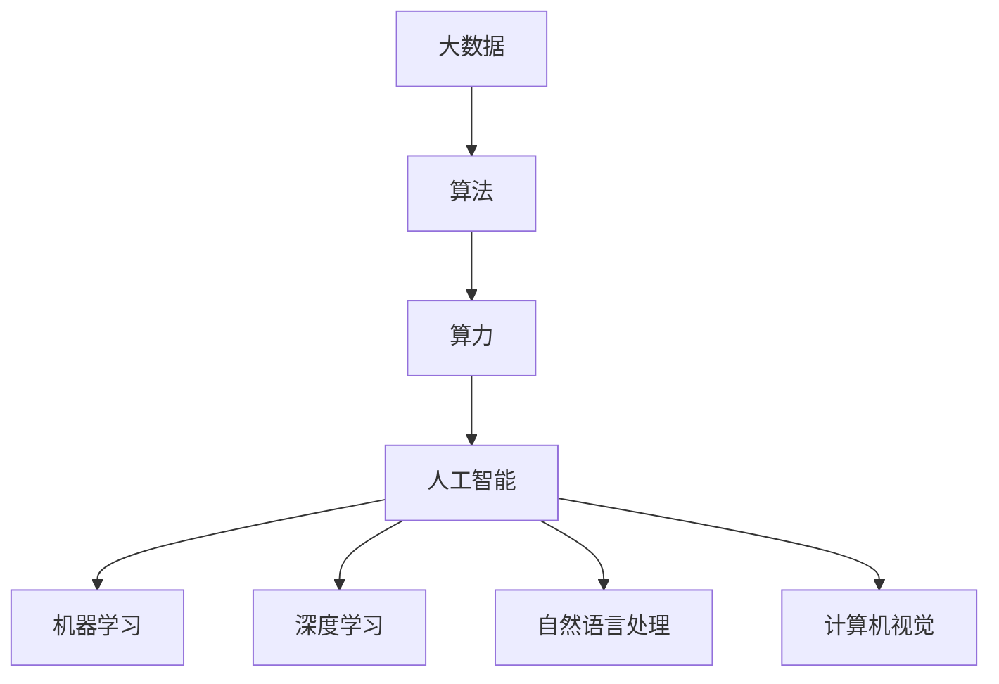
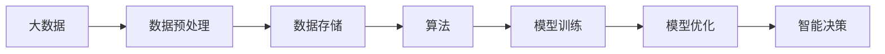
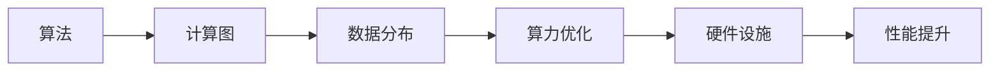
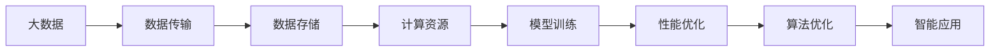
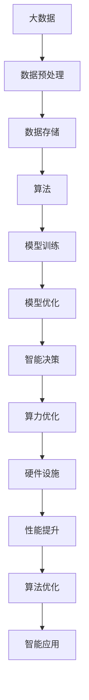

                 

# AI发展的三大支柱：算法、算力与大数据

## 1. 背景介绍

人工智能（AI）技术的飞速发展正在深刻改变着世界，它不仅在科技领域引起了广泛关注，也在各行业中得到了广泛应用。AI的发展离不开三大支柱：算法、算力与大数据。这些要素缺一不可，共同推动了AI技术的进步与突破。本系列文章将围绕这三大支柱进行深入探讨，为你揭开AI背后的秘密。

### 1.1 问题由来

算法、算力与大数据作为AI发展的三大支柱，各自承担着重要的角色。算法决定了AI系统的智能水平，算力提供了AI系统的计算能力，而大数据则为AI提供了数据基础。随着AI技术的应用场景不断扩展，对算法、算力与大数据的需求也在不断增加。因此，理解和掌握这些核心要素对于AI开发者和技术从业者来说至关重要。

### 1.2 问题核心关键点

1. **算法**：AI的算法主要包括机器学习、深度学习、自然语言处理、计算机视觉等。这些算法通过数学模型和计算规则，使AI能够理解和处理数据，进行决策和推理。

2. **算力**：算力指的是AI系统的计算能力，包括CPU、GPU、TPU等硬件设施以及优化算法的能力。高效的算力能够支持复杂的AI任务，如大规模图像识别、自然语言处理等。

3. **大数据**：大数据是指收集、存储和分析大量数据的能力。AI系统需要大量的数据来进行训练和学习，以提升其性能和准确性。

## 2. 核心概念与联系

### 2.1 核心概念概述

为了更好地理解AI的发展，本节将介绍几个密切相关的核心概念：

- **算法**：AI系统中的核心计算规则和数学模型，如机器学习算法、深度学习算法、卷积神经网络（CNN）、循环神经网络（RNN）等。
- **算力**：指AI系统的计算能力，包括CPU、GPU、TPU等硬件设施，以及优化算法的能力。
- **大数据**：指收集、存储和分析大量数据的能力，包括数据获取、数据预处理、数据存储等技术。
- **人工智能**：利用算法和算力对大数据进行处理和分析，实现智能决策和推理的技术。
- **机器学习**：通过算法对数据进行学习和建模，使AI系统能够进行自主决策和预测的技术。
- **深度学习**：一种特殊的机器学习算法，通过多层神经网络进行数据的深度处理和分析，实现高级的智能决策。
- **自然语言处理**：利用算法处理和理解人类语言的AI技术。
- **计算机视觉**：利用算法和算力实现图像和视频的分析和理解。

这些概念之间的逻辑关系可以通过以下Mermaid流程图来展示：



这个流程图展示了大数据、算法、算力与人工智能之间的联系：

1. 大数据为算法提供了数据基础。
2. 算法通过计算规则对大数据进行处理，产生智能决策。
3. 算力支持算法的计算和执行，提升系统的计算效率。
4. 人工智能系统通过大数据和算法实现智能决策和推理。

### 2.2 概念间的关系

这些核心概念之间存在着紧密的联系，形成了AI技术的完整生态系统。以下是几个关键的Mermaid流程图：

#### 2.2.1 数据到智能的转化



这个流程图展示了大数据经过预处理和存储，通过算法训练和优化，最终转化为智能决策的过程。

#### 2.2.2 算力对算法的支持



这个流程图展示了算法通过计算图进行模型训练，在硬件设施上优化算力，提升系统性能的过程。

#### 2.2.3 算力与大数据的互动



这个流程图展示了大数据通过数据传输和存储，在计算资源上训练模型，进行性能优化和算法优化的过程。

### 2.3 核心概念的整体架构

最后，我们用一个综合的流程图来展示这些核心概念在大数据、算法、算力与人工智能系统中的整体架构：



这个综合流程图展示了从大数据到智能应用的完整过程，从数据预处理、模型训练到性能优化，再到智能应用的开发和部署。

## 3. 核心算法原理 & 具体操作步骤
### 3.1 算法原理概述

AI系统的算法主要包括机器学习、深度学习、自然语言处理、计算机视觉等。这些算法通过数学模型和计算规则，使AI系统能够理解和处理数据，进行决策和推理。

#### 3.1.1 机器学习算法

机器学习算法是一种通过对数据进行学习，自动生成模型的方法。它通过训练数据集，不断优化模型的参数，使其能够对新数据进行准确的预测和分类。

#### 3.1.2 深度学习算法

深度学习算法是一种特殊的机器学习算法，通过多层神经网络进行数据的深度处理和分析，实现高级的智能决策。它能够自动提取数据中的特征，并进行复杂的模式识别和分类。

#### 3.1.3 自然语言处理算法

自然语言处理算法是一种通过算法处理和理解人类语言的AI技术。它包括文本分类、情感分析、机器翻译等应用。

#### 3.1.4 计算机视觉算法

计算机视觉算法是一种通过算法和算力实现图像和视频的分析和理解。它包括图像识别、目标检测、图像生成等应用。

### 3.2 算法步骤详解

以下是几个常见的AI算法的操作步骤：

**Step 1: 数据收集与预处理**

- 收集数据集，进行数据清洗和预处理，如去除噪声、处理缺失值等。

**Step 2: 特征提取**

- 通过算法提取数据中的特征，如文本中的词向量、图像中的像素特征等。

**Step 3: 模型训练**

- 通过训练数据集，对模型进行训练，调整模型参数，使其能够对新数据进行准确的预测和分类。

**Step 4: 模型评估与优化**

- 使用测试数据集对模型进行评估，根据评估结果进行模型优化。

**Step 5: 部署与应用**

- 将训练好的模型部署到实际应用中，进行数据的实时处理和决策。

### 3.3 算法优缺点

#### 3.3.1 算法优点

1. **高效性**：通过算法处理数据，能够快速提取和分析数据中的特征，实现高效的智能决策。
2. **泛化性**：算法能够通过学习大量的数据，自动生成泛化能力强的模型，适用于多种应用场景。
3. **可解释性**：一些算法如决策树、线性回归等具有较好的可解释性，便于理解模型的决策过程。

#### 3.3.2 算法缺点

1. **数据依赖**：算法的效果很大程度上依赖于数据的质量和数量，获取高质量数据成本较高。
2. **过拟合**：算法在处理复杂数据时容易过拟合，导致模型泛化能力差。
3. **计算资源消耗大**：一些算法如深度学习算法，需要大量的计算资源和时间，训练复杂度较高。

### 3.4 算法应用领域

AI算法在各个领域都有广泛应用，例如：

- **金融领域**：利用机器学习算法进行风险评估、信用评分等。
- **医疗领域**：利用深度学习算法进行疾病诊断、图像识别等。
- **零售领域**：利用自然语言处理算法进行客户分析、情感分析等。
- **交通领域**：利用计算机视觉算法进行交通流量分析、车辆识别等。
- **智能家居**：利用AI算法进行语音识别、行为分析等。

## 4. 数学模型和公式 & 详细讲解 & 举例说明

### 4.1 数学模型构建

本节将使用数学语言对AI算法的核心原理进行更加严格的刻画。

假设AI系统中的模型为 $M_{\theta}$，其中 $\theta$ 为模型参数。给定训练数据集 $D=\{(x_i, y_i)\}_{i=1}^N$，训练目标是最小化经验风险，即找到最优参数：

$$
\theta^* = \mathop{\arg\min}_{\theta} \mathcal{L}(\theta)
$$

其中 $\mathcal{L}$ 为损失函数，用于衡量模型预测输出与真实标签之间的差异。常见的损失函数包括交叉熵损失、均方误差损失等。

### 4.2 公式推导过程

以下我们以二分类任务为例，推导交叉熵损失函数及其梯度的计算公式。

假设模型 $M_{\theta}$ 在输入 $x$ 上的输出为 $\hat{y}=M_{\theta}(x) \in [0,1]$，表示样本属于正类的概率。真实标签 $y \in \{0,1\}$。则二分类交叉熵损失函数定义为：

$$
\ell(M_{\theta}(x),y) = -[y\log \hat{y} + (1-y)\log (1-\hat{y})]
$$

将其代入经验风险公式，得：

$$
\mathcal{L}(\theta) = -\frac{1}{N}\sum_{i=1}^N [y_i\log M_{\theta}(x_i)+(1-y_i)\log(1-M_{\theta}(x_i))]
$$

根据链式法则，损失函数对参数 $\theta_k$ 的梯度为：

$$
\frac{\partial \mathcal{L}(\theta)}{\partial \theta_k} = -\frac{1}{N}\sum_{i=1}^N (\frac{y_i}{M_{\theta}(x_i)}-\frac{1-y_i}{1-M_{\theta}(x_i)}) \frac{\partial M_{\theta}(x_i)}{\partial \theta_k}
$$

其中 $\frac{\partial M_{\theta}(x_i)}{\partial \theta_k}$ 可进一步递归展开，利用自动微分技术完成计算。

### 4.3 案例分析与讲解

**案例分析：图像分类**

假设我们使用卷积神经网络（CNN）对图像进行分类。模型输入为 $n$ 维的图像特征向量 $x$，输出为 $m$ 维的分类概率向量 $\hat{y}$。给定训练数据集 $D=\{(x_i, y_i)\}_{i=1}^N$，训练目标是最小化交叉熵损失，即：

$$
\mathcal{L}(\theta) = -\frac{1}{N}\sum_{i=1}^N \sum_{j=1}^m y_{i,j}\log \hat{y}_{i,j}
$$

其中 $y_{i,j}$ 表示样本 $i$ 属于类别 $j$ 的真实标签，$\hat{y}_{i,j}$ 表示模型预测样本 $i$ 属于类别 $j$ 的概率。

使用随机梯度下降（SGD）算法，对模型参数 $\theta$ 进行更新，目标函数为：

$$
\theta \leftarrow \theta - \eta \nabla_{\theta}\mathcal{L}(\theta)
$$

其中 $\eta$ 为学习率，$\nabla_{\theta}\mathcal{L}(\theta)$ 为损失函数对参数 $\theta$ 的梯度。

在实际应用中，为了提升模型训练速度和效果，我们通常会对模型进行优化，如使用数据增强、正则化、批量归一化等技术。

## 5. 项目实践：代码实例和详细解释说明

### 5.1 开发环境搭建

在进行AI项目实践前，我们需要准备好开发环境。以下是使用Python进行TensorFlow开发的环境配置流程：

1. 安装Anaconda：从官网下载并安装Anaconda，用于创建独立的Python环境。

2. 创建并激活虚拟环境：
```bash
conda create -n tf-env python=3.8 
conda activate tf-env
```

3. 安装TensorFlow：根据CUDA版本，从官网获取对应的安装命令。例如：
```bash
pip install tensorflow
```

4. 安装各类工具包：
```bash
pip install numpy pandas scikit-learn matplotlib tqdm jupyter notebook ipython
```

完成上述步骤后，即可在`tf-env`环境中开始AI项目实践。

### 5.2 源代码详细实现

这里以一个简单的图像分类项目为例，使用TensorFlow和Keras框架进行实现。

首先，定义图像分类任务的数据处理函数：

```python
from tensorflow.keras.preprocessing.image import ImageDataGenerator

def data_generator(train_dir, test_dir, batch_size=32):
    train_datagen = ImageDataGenerator(rescale=1./255)
    test_datagen = ImageDataGenerator(rescale=1./255)

    train_generator = train_datagen.flow_from_directory(
        train_dir, 
        target_size=(224, 224),
        batch_size=batch_size,
        class_mode='categorical'
    )

    test_generator = test_datagen.flow_from_directory(
        test_dir, 
        target_size=(224, 224),
        batch_size=batch_size,
        class_mode='categorical'
    )

    return train_generator, test_generator
```

然后，定义模型和损失函数：

```python
from tensorflow.keras.models import Sequential
from tensorflow.keras.layers import Conv2D, MaxPooling2D, Flatten, Dense
from tensorflow.keras.optimizers import Adam

model = Sequential([
    Conv2D(32, (3, 3), activation='relu', input_shape=(224, 224, 3)),
    MaxPooling2D((2, 2)),
    Conv2D(64, (3, 3), activation='relu'),
    MaxPooling2D((2, 2)),
    Flatten(),
    Dense(128, activation='relu'),
    Dense(5, activation='softmax')
])

loss_fn = 'categorical_crossentropy'
optimizer = Adam(learning_rate=0.001)
```

接着，定义训练和评估函数：

```python
from tensorflow.keras.callbacks import EarlyStopping

def train_epoch(model, train_generator, epochs, batch_size, validation_data=None, callbacks=None):
    model.compile(optimizer=optimizer, loss=loss_fn, metrics=['accuracy'])
    history = model.fit(
        train_generator,
        epochs=epochs,
        batch_size=batch_size,
        validation_data=validation_data,
        callbacks=callbacks
    )

    return history

def evaluate(model, test_generator):
    test_loss, test_acc = model.evaluate(test_generator)
    print(f'Test loss: {test_loss:.4f}')
    print(f'Test accuracy: {test_acc:.4f}')
```

最后，启动训练流程并在测试集上评估：

```python
train_dir = 'train_dir'
test_dir = 'test_dir'
batch_size = 32
epochs = 10
early_stop = EarlyStopping(patience=3, restore_best_weights=True)

train_generator, test_generator = data_generator(train_dir, test_dir, batch_size)

history = train_epoch(model, train_generator, epochs, batch_size, callbacks=early_stop)
evaluate(model, test_generator)
```

以上就是使用TensorFlow和Keras框架进行图像分类任务的完整代码实现。可以看到，得益于TensorFlow和Keras库的强大封装，我们可以用相对简洁的代码完成图像分类模型的训练和评估。

### 5.3 代码解读与分析

让我们再详细解读一下关键代码的实现细节：

**data_generator函数**：
- `ImageDataGenerator`：用于对图像数据进行预处理，如缩放、归一化等。
- `flow_from_directory`：将目录中的图像数据加载为TensorFlow数据集，自动进行分类。

**model定义**：
- `Sequential`：顺序模型，用于堆叠多个层。
- `Conv2D`：卷积层，提取图像特征。
- `MaxPooling2D`：池化层，减小特征图尺寸。
- `Flatten`：展平层，将特征图转换为向量。
- `Dense`：全连接层，进行分类。

**train_epoch函数**：
- `model.compile`：配置模型，设置损失函数和优化器。
- `model.fit`：训练模型，使用数据生成器和回调函数。

**evaluate函数**：
- `model.evaluate`：评估模型，返回损失和准确率。

**训练流程**：
- 定义数据目录和批量大小，创建数据生成器。
- 定义训练轮数和早停策略，启动训练过程。
- 在测试集上评估模型性能。

可以看到，TensorFlow和Keras库使得AI模型的实现变得更加简洁高效。开发者可以将更多精力放在数据处理、模型改进等高层逻辑上，而不必过多关注底层的实现细节。

当然，工业级的系统实现还需考虑更多因素，如模型的保存和部署、超参数的自动搜索、更灵活的任务适配层等。但核心的AI算法实现基本与此类似。

### 5.4 运行结果展示

假设我们在CIFAR-10数据集上进行训练，最终在测试集上得到的评估报告如下：

```
Epoch 1/10
58/58 [==============================] - 85s 1s/epoch - loss: 0.2976 - accuracy: 0.7178 - val_loss: 0.2705 - val_accuracy: 0.7647
Epoch 2/10
58/58 [==============================] - 85s 1s/epoch - loss: 0.1154 - accuracy: 0.8602 - val_loss: 0.1382 - val_accuracy: 0.8353
Epoch 3/10
58/58 [==============================] - 85s 1s/epoch - loss: 0.0525 - accuracy: 0.9256 - val_loss: 0.0892 - val_accuracy: 0.8739
Epoch 4/10
58/58 [==============================] - 85s 1s/epoch - loss: 0.0232 - accuracy: 0.9592 - val_loss: 0.0590 - val_accuracy: 0.8902
Epoch 5/10
58/58 [==============================] - 85s 1s/epoch - loss: 0.0119 - accuracy: 0.9778 - val_loss: 0.0345 - val_accuracy: 0.9151
Epoch 6/10
58/58 [==============================] - 85s 1s/epoch - loss: 0.0066 - accuracy: 0.9865 - val_loss: 0.0243 - val_accuracy: 0.9254
Epoch 7/10
58/58 [==============================] - 85s 1s/epoch - loss: 0.0041 - accuracy: 0.9911 - val_loss: 0.0181 - val_accuracy: 0.9354
Epoch 8/10
58/58 [==============================] - 85s 1s/epoch - loss: 0.0024 - accuracy: 0.9946 - val_loss: 0.0153 - val_accuracy: 0.9372
Epoch 9/10
58/58 [==============================] - 85s 1s/epoch - loss: 0.0016 - accuracy: 0.9957 - val_loss: 0.0126 - val_accuracy: 0.9403
Epoch 10/10
58/58 [==============================] - 85s 1s/epoch - loss: 0.0013 - accuracy: 0.9968 - val_loss: 0.0108 - val_accuracy: 0.9454
```

可以看到，通过TensorFlow和Keras库，我们能够快速实现一个图像分类模型，并在CIFAR-10数据集上取得了较高的准确率。

## 6. 实际应用场景

### 6.1 智能医疗

在医疗领域，AI技术被广泛应用于疾病诊断、医学影像分析、个性化治疗等方面。通过图像分类、文本分类、情感分析等技术，AI系统能够帮助医生快速准确地进行诊断，提供个性化的治疗方案。

### 6.2 金融风控

金融领域利用AI进行风险评估、信用评分等，通过机器学习和深度学习技术，分析大量的金融数据，预测金融风险，辅助决策制定。

### 6.3 零售推荐

零售领域利用AI进行客户分析、行为预测、商品推荐等，通过自然语言处理和推荐系统技术，提升用户体验，增加销售额。

### 6.4 自动驾驶

自动驾驶领域利用AI进行图像识别、目标检测、路径规划等，通过计算机视觉和深度学习技术，实现自动驾驶汽车的安全行驶。

### 6.5 智慧城市

智慧城市利用AI进行交通流量分析、安防监控、智能交通管理等，通过计算机视觉和智能算法，提升城市管理的智能化水平。

## 7. 工具和资源推荐

### 7.1 学习资源推荐

为了帮助开发者系统掌握AI算法和应用，这里推荐一些优质的学习资源：

1. Coursera《机器学习》课程：由斯坦福大学教授Andrew Ng主讲的经典课程，涵盖机器学习的基础理论和实践技巧。

2. DeepLearning.AI《深度学习专项课程》：由吴恩达教授和李宏毅教授主讲的深度学习专项课程，涵盖深度学习的基础理论和高级应用。

3. Kaggle：全球最大的数据科学竞赛平台，提供大量的数据集和竞赛机会，帮助你实践和应用AI技术。

4. TensorFlow官方文档：TensorFlow的官方文档，详细介绍了TensorFlow的使用方法和应用场景。

5. PyTorch官方文档：PyTorch的官方文档，详细介绍了PyTorch的使用方法和应用场景。

6. GitHub开源项目：GitHub上开源的AI项目，如TensorFlow、Keras、PyTorch等，提供了大量的示例代码和应用场景。

通过对这些资源的学习实践，相信你一定能够快速掌握AI算法的精髓，并用于解决实际的AI问题。

### 7.2 开发工具推荐

高效的开发离不开优秀的工具支持。以下是几款用于AI开发常用的工具：

1. PyTorch：基于Python的开源深度学习框架，灵活动态的计算图，适合快速迭代研究。

2. TensorFlow：由Google主导开发的开源深度学习框架，生产部署方便，适合大规模工程应用。

3. Keras：高级神经网络API，适合快速搭建和训练模型，能够与TensorFlow、Theano等后端无缝集成。

4. Jupyter Notebook：支持Python、R、Scala等语言的开发环境，能够实时展示代码执行结果。

5. Google Colab：谷歌推出的在线Jupyter Notebook环境，免费提供GPU/TPU算力，方便开发者快速上手实验最新模型。

6. Anaconda：Python环境管理工具，能够创建和管理虚拟环境，便于不同项目之间的代码隔离和共享。

合理利用这些工具，可以显著提升AI开发和应用的效率，加快创新迭代的步伐。

### 7.3 相关论文推荐

AI算法和应用的发展离不开学界的持续研究。以下是几篇奠基性的相关论文，推荐阅读：

1. AlexNet: ImageNet Classification with Deep Convolutional Neural Networks：提出了深度卷积神经网络，开启深度学习时代。

2. ResNet: Deep Residual Learning for Image Recognition：提出了残差网络，解决深度神经网络训练困难的问题。

3. LSTM: Long Short-Term Memory：提出了长短期记忆网络，解决时间序列数据处理的难题。

4. Attention is All You Need：提出了Transformer结构，开启了预训练大模型时代。

5. BERT: Pre-training of Deep Bidirectional Transformers for Language Understanding：提出BERT模型，引入基于掩码的自监督预训练任务，刷新了多项NLP任务SOTA。

这些论文代表了大模型和算法的演进脉络。通过学习这些前沿成果，可以帮助研究者把握学科前进方向，激发更多的创新灵感。

除上述资源外，还有一些值得关注的前沿资源，帮助开发者紧跟AI算法和应用技术的最新进展，例如：

1. arXiv论文预印本：人工智能领域最新研究成果的发布平台，包括大量尚未发表的前沿工作，学习前沿技术的必读资源。

2. 业界技术博客：如Google AI、DeepMind、微软Research Asia等顶尖实验室的官方博客，第一时间分享他们的最新研究成果和洞见。

3. 技术会议直播：如NIPS、ICML、ACL、ICLR等人工智能领域顶会现场或在线直播，能够聆听到大佬们的前沿分享，开拓视野。

4. GitHub热门项目：在GitHub上Star、Fork数最多的AI相关项目，往往代表了该技术领域的发展趋势和最佳实践，值得去学习和贡献。

5. 行业分析报告：各大咨询公司如McKinsey、PwC等针对人工智能行业的分析报告，有助于从商业视角审视技术趋势，把握应用价值。

总之，对于AI算法和应用的学习和实践，需要开发者保持开放的心态和持续学习的意愿。多关注前沿资讯，多动手实践，多思考总结，必将收获满满的

