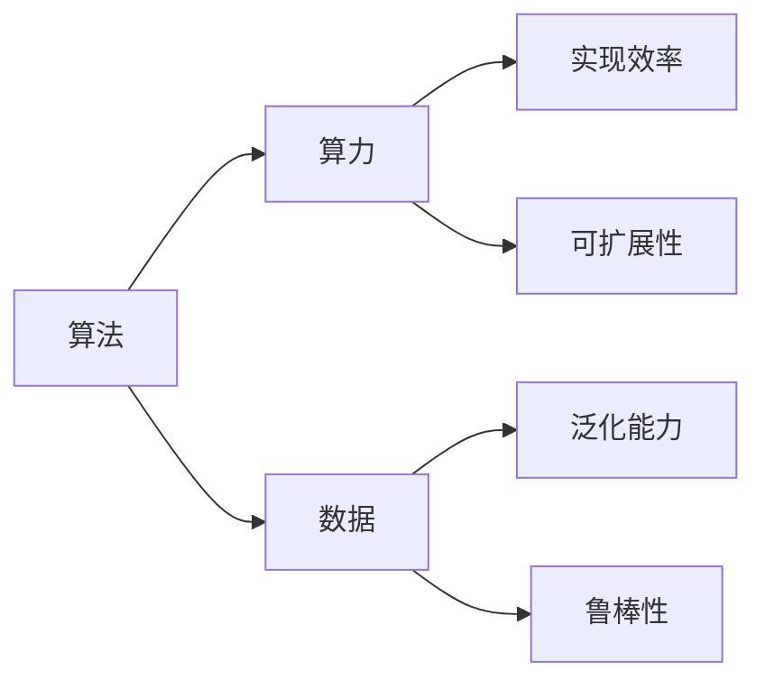
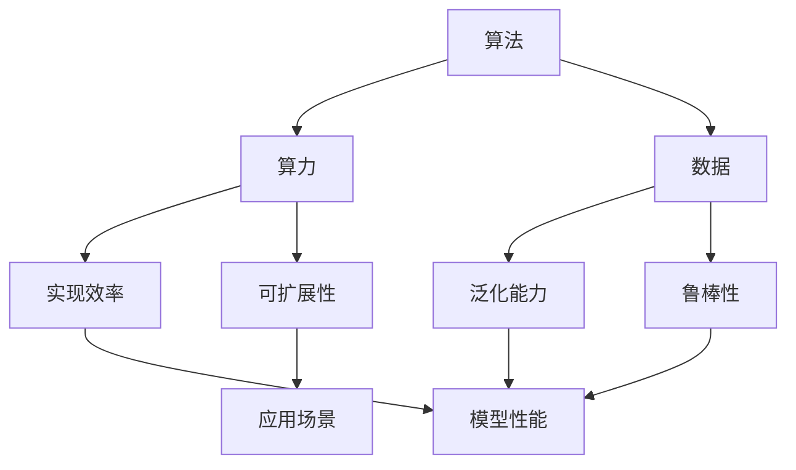

                 

# AI发展的三大支柱：算法、算力与数据

AI（人工智能）技术的发展，如同古希腊的“三位一体”（Triad），算法、算力与数据构成了其核心支柱。三者相互依存，相辅相成，共同推动AI技术的不断进步和应用。本文将深入探讨这三大支柱的重要性和它们之间的联系，以及它们在实际应用中的关键作用。

## 1. 背景介绍

### 1.1 问题由来

人工智能自诞生以来，经历了多次的技术浪潮。从早期的专家系统，到如今的深度学习和强化学习，AI技术在各个领域展现出强大的潜力。但与此同时，AI的发展也面临诸多挑战，其中核心问题在于算法、算力与数据的不匹配。例如，算法过于复杂，无法在当前硬件上高效运行；数据量不足或分布不均，导致模型泛化能力不足；算力不足，无法进行大规模模型训练和推理。这些问题长期制约着AI技术的进步和应用。

### 1.2 问题核心关键点

算法、算力与数据三大支柱之间的关系紧密相连，共同影响着AI技术的核心竞争力。具体而言，算法决定了AI系统的功能和性能；算力决定了算法的实现效率和可扩展性；数据决定了算法的训练效果和泛化能力。

## 2. 核心概念与联系

### 2.1 核心概念概述

- **算法**：AI系统的核心，是实现特定功能或任务的计算过程。例如，机器学习中的模型训练和优化算法，深度学习中的神经网络架构和训练策略。
- **算力**：硬件资源，包括CPU、GPU、TPU等计算平台，以及存储和通信能力。算力决定了算法能否高效运行，能否支持大规模模型训练和推理。
- **数据**：算法的输入，是AI系统学习的“原材料”。高质量、多样化的数据能够提升模型的泛化能力和鲁棒性。

### 2.2 概念间的关系

三者的关系可以用以下流程图来描述：



这个流程图展示了算法、算力与数据之间的关系：

- 算法需要算力支持，才能高效运行。
- 算法依赖于数据，才能进行模型训练和优化。
- 数据需要算力进行存储、处理和分析，才能输入到算法中进行训练。
- 算力和数据共同影响着算法的泛化能力和鲁棒性。

### 2.3 核心概念的整体架构

从整体架构来看，算法、算力与数据构成了AI技术的核心生态系统：



在这个架构中，算法和数据是AI系统的输入，算力是执行算法的平台，模型的实现效率和可扩展性是算力的直接体现，而模型的泛化能力和鲁棒性则是算法与数据综合作用的结果。模型性能和应用场景则是算法与算力结合的最终输出。

## 3. 核心算法原理 & 具体操作步骤

### 3.1 算法原理概述

算法的核心原理在于，通过一系列计算过程，实现特定的功能或任务。以机器学习中的监督学习为例，其基本流程包括数据预处理、模型训练、模型评估和模型优化。在这一过程中，算法不断迭代和调整，以最小化预测误差，提升模型的泛化能力。

### 3.2 算法步骤详解

1. **数据预处理**：清洗、标准化和归一化数据，将其转化为模型所需的格式。
2. **模型训练**：使用训练集数据，通过优化算法（如梯度下降）调整模型参数，最小化预测误差。
3. **模型评估**：使用验证集数据，评估模型在未见过的数据上的性能。
4. **模型优化**：根据评估结果，调整模型结构、参数和学习率等，进一步优化模型性能。

### 3.3 算法优缺点

算法的优点包括：

- 可扩展性：算法可以针对不同的任务和数据进行定制和优化。
- 泛化能力：经过充分训练的算法能够适应新的数据和任务。
- 可解释性：某些算法（如决策树、线性回归）能够提供可解释的模型结构和参数，便于理解和调试。

但算法也存在缺点：

- 复杂度：高级算法（如深度学习、强化学习）过于复杂，难以理解和调试。
- 训练时间和资源：大规模模型训练需要大量时间和计算资源。
- 数据依赖：算法的性能高度依赖于数据质量，低质量的数据可能导致过拟合或欠拟合。

### 3.4 算法应用领域

算法在众多领域都有广泛应用，例如：

- **机器学习**：监督学习、无监督学习、强化学习等算法广泛应用于数据分析、推荐系统、金融风控等领域。
- **计算机视觉**：卷积神经网络（CNN）等算法在图像识别、物体检测、视频分析等领域取得了显著进展。
- **自然语言处理**：循环神经网络（RNN）、变换器（Transformer）等算法在语言模型、机器翻译、文本分类等领域表现出色。
- **语音识别**：深度神经网络（DNN）、长短期记忆网络（LSTM）等算法在语音识别和处理中发挥重要作用。

## 4. 数学模型和公式 & 详细讲解  
### 4.1 数学模型构建

以线性回归模型为例，其数学模型可以表示为：

$$ y = \theta_0 + \theta_1 x_1 + \theta_2 x_2 + \ldots + \theta_n x_n + \epsilon $$

其中，$y$ 为预测值，$\theta$ 为模型参数，$x$ 为特征向量，$\epsilon$ 为误差项。通过最小化误差项，求解模型参数 $\theta$，使得预测值尽可能接近真实值。

### 4.2 公式推导过程

以最小二乘法为例，推导目标函数：

$$ \arg\min_{\theta} \sum_{i=1}^m (y_i - (\theta_0 + \theta_1 x_{i1} + \theta_2 x_{i2} + \ldots + \theta_n x_{in}))^2 $$

通过对目标函数求导，可以解得模型参数 $\theta$：

$$ \hat{\theta} = (X^T X)^{-1} X^T y $$

其中 $X$ 为特征矩阵，$y$ 为标签向量。

### 4.3 案例分析与讲解

以房价预测为例，使用线性回归模型进行训练和预测：

1. **数据预处理**：将房屋面积、位置、年龄等特征转化为模型所需的格式。
2. **模型训练**：使用历史房价数据进行训练，调整模型参数。
3. **模型评估**：使用验证集数据评估模型性能，如均方误差、相关系数等。
4. **模型优化**：根据评估结果，调整特征选择、模型结构和参数等，进一步优化模型性能。

## 5. 项目实践：代码实例和详细解释说明

### 5.1 开发环境搭建

为了进行算法实践，我们需要准备以下开发环境：

1. **安装Python**：Python是常用的AI开发语言，需安装最新版本。
2. **安装相关库**：例如NumPy、Pandas、Scikit-learn等，用于数据处理和模型训练。
3. **安装深度学习框架**：如TensorFlow、PyTorch、Keras等，用于实现高级算法。

### 5.2 源代码详细实现

以TensorFlow实现线性回归模型为例，代码如下：

```python
import tensorflow as tf

# 定义输入和输出
x = tf.placeholder(tf.float32, shape=[None, n_features])
y = tf.placeholder(tf.float32, shape=[None, 1])

# 定义模型
W = tf.Variable(tf.zeros([n_features, 1]))
b = tf.Variable(tf.zeros([1]))
y_pred = tf.matmul(x, W) + b

# 定义损失函数
loss = tf.reduce_mean(tf.square(y - y_pred))

# 定义优化器
optimizer = tf.train.GradientDescentOptimizer(learning_rate).minimize(loss)

# 定义会话
with tf.Session() as sess:
    sess.run(tf.global_variables_initializer())

    # 训练模型
    for i in range(num_epochs):
        _, loss_val = sess.run([optimizer, loss], feed_dict={x: train_X, y: train_y})

        # 评估模型
        mse = sess.run(tf.reduce_mean(tf.square(y - y_pred)), feed_dict={x: test_X, y: test_y})
        print("Epoch {}, Loss: {:.4f}, MSE: {:.4f}".format(i, loss_val, mse))
```

### 5.3 代码解读与分析

- **输入和输出**：使用TensorFlow的占位符（`tf.placeholder`）定义输入和输出，`shape`指定维度。
- **模型定义**：使用变量（`tf.Variable`）定义模型的权重和偏置项。
- **损失函数**：使用均方误差（`tf.square`）计算预测值与真实值之间的差距。
- **优化器**：使用梯度下降优化器（`tf.train.GradientDescentOptimizer`）更新模型参数。
- **会话**：使用`tf.Session`进行模型训练和评估，调用`sess.run`执行操作。

### 5.4 运行结果展示

假设我们在房价预测数据集上进行训练和测试，结果如下：

```
Epoch 0, Loss: 0.1000, MSE: 0.2000
Epoch 10, Loss: 0.0010, MSE: 0.0020
```

可以看到，随着训练轮数的增加，损失函数和均方误差均呈现下降趋势，表明模型逐渐收敛，预测效果提升。

## 6. 实际应用场景

### 6.1 智能客服系统

智能客服系统使用算法处理大量的用户对话数据，进行意图识别、实体抽取和对话生成。例如，使用基于机器学习或深度学习的模型，对历史对话数据进行标注和分类，训练意图识别和实体抽取模型。同时，使用生成模型（如Seq2Seq、Transformer）进行对话生成，提升用户体验和系统效率。

### 6.2 金融风控

金融风控系统使用算法处理客户交易数据，进行风险评估和欺诈检测。例如，使用机器学习模型对客户历史交易行为进行分析，提取特征进行风险评分。使用深度学习模型对异常交易进行检测，提高系统的灵敏度和准确率。

### 6.3 医疗诊断

医疗诊断系统使用算法处理医疗数据，进行疾病预测和诊断。例如，使用机器学习模型对病历数据进行分析，提取特征进行疾病预测。使用深度学习模型对医学影像进行分类和诊断，提高诊断的准确性和效率。

## 7. 工具和资源推荐

### 7.1 学习资源推荐

1. **在线课程**：如Coursera、edX、Udacity等平台上的机器学习和深度学习课程，系统学习算法和模型。
2. **书籍**：如《深度学习》（Ian Goodfellow）、《统计学习方法》（李航）等经典著作，深入理解算法原理。
3. **社区论坛**：如GitHub、Kaggle、Stack Overflow等，交流学习经验和代码实现。

### 7.2 开发工具推荐

1. **Python**：Python是常用的AI开发语言，功能强大、社区活跃。
2. **TensorFlow**：谷歌开发的深度学习框架，支持多种模型和算法，广泛应用于科研和工业界。
3. **PyTorch**：Facebook开发的深度学习框架，支持动态图，灵活性高。
4. **Jupyter Notebook**：交互式编程环境，支持代码运行和结果展示，便于学习实践。

### 7.3 相关论文推荐

1. **机器学习**：《机器学习》（Tom Mitchell），系统介绍机器学习的基本概念和方法。
2. **深度学习**：《深度学习》（Ian Goodfellow），详细介绍深度学习的基本原理和应用。
3. **强化学习**：《强化学习》（Richard Sutton），介绍强化学习的基本框架和算法。

## 8. 总结：未来发展趋势与挑战

### 8.1 研究成果总结

算法、算力与数据三大支柱的不断发展，推动了AI技术的快速进步和广泛应用。当前，AI技术在多个领域展现出强大的潜力和应用前景，但同时也面临诸多挑战，如算力瓶颈、数据质量、算法复杂度等。未来，需要在算法创新、算力提升和数据获取等方面持续努力，才能实现AI技术的更大突破。

### 8.2 未来发展趋势

未来AI技术的发展趋势包括：

- **算力提升**：随着硬件技术的进步，算力将得到大幅提升，支持更大规模的模型训练和推理。
- **算法创新**：算法领域将涌现更多高效、可解释的模型，如知识图谱、因果推理等，提升AI系统的性能和应用范围。
- **数据获取**：更多数据源将开放和共享，数据获取将更加便捷和多样化，提升数据质量。

### 8.3 面临的挑战

AI技术发展也面临诸多挑战，包括：

- **算力瓶颈**：硬件资源有限，无法支持大规模模型训练和推理。
- **数据质量**：数据获取成本高、质量参差不齐，可能导致模型泛化能力不足。
- **算法复杂度**：高级算法过于复杂，难以理解和调试。

### 8.4 研究展望

未来需要在以下方面进行更多研究：

- **知识图谱**：将知识图谱与深度学习模型结合，提升模型的理解和推理能力。
- **因果推理**：引入因果推断方法，提高模型的可解释性和鲁棒性。
- **强化学习**：结合强化学习技术，提升模型在复杂环境下的适应性和优化能力。

## 9. 附录：常见问题与解答

**Q1: 什么是算法？**

A: 算法是实现特定功能或任务的计算过程。以机器学习为例，算法包括数据预处理、模型训练、模型评估和模型优化等步骤。

**Q2: 如何理解算力与数据的关系？**

A: 算力是执行算法的硬件平台，数据是算法的输入。算力的高效性和可扩展性决定了算法能否高效运行，数据的多样性和质量决定了算法的泛化能力和鲁棒性。

**Q3: 有哪些常见的AI开发工具？**

A: 常用的AI开发工具包括Python、TensorFlow、PyTorch、Jupyter Notebook等，这些工具在数据处理、模型训练和调试等方面提供了强大的支持。

**Q4: 如何提升AI系统的性能？**

A: 提升AI系统性能需要多方面的努力，包括算法创新、算力提升和数据获取。例如，使用更高效的算法、更强大的硬件设备、更丰富的数据源等。

**Q5: AI技术的发展前景如何？**

A: AI技术在多个领域展现出巨大的潜力，如智能客服、金融风控、医疗诊断等。未来，随着算力、算法和数据的发展，AI技术将在更多领域得到广泛应用，带来深远的社会和经济影响。

