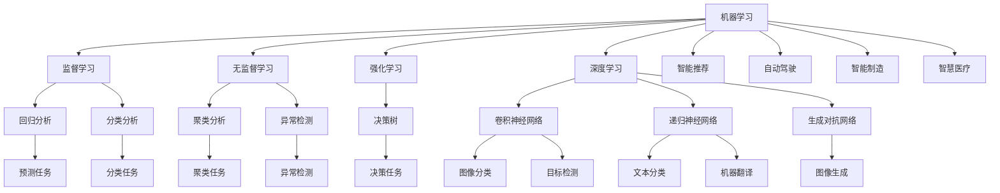
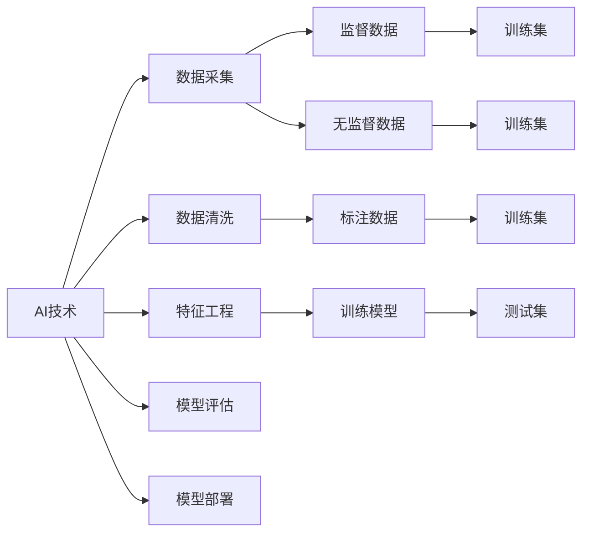
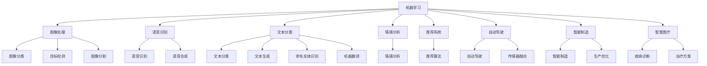

                 

# AI在现实世界中的应用场景

> 关键词：人工智能,应用场景,机器学习,深度学习,自然语言处理,计算机视觉,智能推荐,自动驾驶,智能制造,智慧医疗

## 1. 背景介绍

### 1.1 问题由来
人工智能（Artificial Intelligence, AI）作为现代科技的前沿领域，已经在众多行业和场景中展现出巨大潜力。从智能手机到智能家居，从金融风控到智慧城市，从自动驾驶到智慧医疗，AI技术正在深刻改变人们的生活和工作方式。本文章将深入探讨AI技术在现实世界中的应用场景，分析其技术原理和应用效果，并对未来发展趋势进行展望。

### 1.2 问题核心关键点
AI在现实世界中的应用场景主要集中在以下几个领域：

- **机器学习（Machine Learning, ML）**：通过数据驱动的方法，使计算机系统能够从经验中学习和改进，自动进行数据分析和决策。
- **深度学习（Deep Learning, DL）**：一种基于神经网络结构的机器学习方法，通过多层非线性映射，可以实现复杂的模式识别和预测。
- **自然语言处理（Natural Language Processing, NLP）**：使计算机能够理解、生成和处理人类语言，包括语音识别、文本分类、机器翻译等。
- **计算机视觉（Computer Vision, CV）**：使计算机能够识别、分类和分析视觉数据，包括图像处理、目标检测、图像分割等。
- **智能推荐系统**：基于用户行为和偏好，自动生成个性化推荐，广泛应用于电商、新闻、社交媒体等领域。
- **自动驾驶**：通过传感器和计算机视觉技术，使车辆能够自主决策和控制，实现无人驾驶。
- **智能制造**：通过物联网和AI技术，实现生产过程的自动化和智能化，提高生产效率和质量。
- **智慧医疗**：通过数据分析和机器学习，辅助医生进行疾病诊断和治疗，提升医疗服务的质量和效率。

这些应用场景体现了AI技术的广泛应用和巨大价值，展示了其在各领域中的变革性影响。

## 2. 核心概念与联系

### 2.1 核心概念概述

为更好地理解AI在现实世界中的应用场景，本节将介绍几个密切相关的核心概念：

- **机器学习**：一种让计算机系统通过数据学习规律，自动进行预测和决策的技术。常见的机器学习方法包括监督学习、无监督学习和强化学习。
- **深度学习**：一种特殊形式的机器学习方法，通过多层神经网络模拟人脑处理信息的过程，能够处理非线性复杂模式。
- **自然语言处理**：使计算机能够理解和生成自然语言，包括语音识别、文本分类、机器翻译等。
- **计算机视觉**：使计算机能够理解和分析视觉数据，包括图像处理、目标检测、图像分割等。
- **智能推荐系统**：通过数据分析和用户行为建模，自动生成个性化推荐，提高用户体验。
- **自动驾驶**：通过传感器和计算机视觉技术，实现无人驾驶。
- **智能制造**：通过物联网和AI技术，实现生产过程的自动化和智能化。
- **智慧医疗**：通过数据分析和机器学习，辅助医生进行疾病诊断和治疗。

这些核心概念之间的逻辑关系可以通过以下Mermaid流程图来展示：



这个流程图展示了大规模AI应用的核心概念及其之间的关系：

1. 机器学习是大规模AI的基础，通过数据驱动的方法使计算机系统能够进行学习和决策。
2. 深度学习作为机器学习的一种形式，能够处理复杂模式，广泛应用于图像、文本等领域。
3. 自然语言处理和计算机视觉是深度学习在特定领域的应用，分别用于语言理解和视觉理解。
4. 智能推荐、自动驾驶、智能制造和智慧医疗是AI技术在具体行业中的应用。

这些核心概念共同构成了AI技术的应用框架，使其能够在各个领域中发挥巨大的作用。

### 2.2 概念间的关系

这些核心概念之间存在着紧密的联系，形成了AI技术的应用生态系统。下面我通过几个Mermaid流程图来展示这些概念之间的关系。

#### 2.2.1 AI技术的应用范式



这个流程图展示了AI技术应用的基本流程：

1. 数据采集和清洗是AI应用的前提，数据的准确性和完备性直接影响模型训练效果。
2. 特征工程用于从原始数据中提取有意义的特征，提高模型的表现力。
3. 训练集用于模型的初始化训练，监督数据和无监督数据都可以用于训练。
4. 模型评估用于验证模型的效果，测试集用于模型验证。
5. 模型部署用于将模型应用于实际场景中，产生预测或决策结果。

#### 2.2.2 AI技术的应用场景



这个流程图展示了AI技术在不同应用场景中的具体应用：

1. 图像处理：包括图像分类、目标检测和图像分割等任务。
2. 语音识别：包括语音识别和语音合成等任务。
3. 文本处理：包括文本分类、文本生成和命名实体识别等任务。
4. 推荐系统：包括推荐算法和个性化推荐等任务。
5. 自动驾驶：包括传感器融合和自动驾驶等任务。
6. 智能制造：包括生产优化和智能制造等任务。
7. 智慧医疗：包括疾病诊断和治疗方案等任务。

通过这些流程图，我们可以更清晰地理解AI技术的应用流程和具体场景，为后续深入讨论具体的应用技术奠定基础。

## 3. 核心算法原理 & 具体操作步骤
### 3.1 算法原理概述

AI技术在现实世界中的应用场景通常采用数据驱动的方法，通过训练模型进行数据分析和决策。常见的应用技术包括：

- **监督学习**：通过标记的数据进行训练，使模型能够预测新数据的标签。
- **无监督学习**：通过未标记的数据进行训练，使模型能够发现数据中的规律和结构。
- **强化学习**：通过环境反馈进行训练，使模型能够制定最优策略。
- **深度学习**：通过多层神经网络模拟人脑处理信息的过程，实现复杂的模式识别和预测。

这些技术在具体应用场景中，通常需要结合领域知识进行优化和调整，以适应不同的业务需求。

### 3.2 算法步骤详解

AI技术在现实世界中的应用步骤通常包括以下几个关键环节：

1. **数据采集与预处理**：收集相关的数据，并进行清洗、标注和特征提取等预处理操作。
2. **模型训练与验证**：选择合适的算法和模型结构，进行训练并验证模型的性能。
3. **模型部署与应用**：将训练好的模型部署到实际场景中，进行预测或决策。
4. **模型监控与优化**：实时监测模型表现，根据实际需求进行优化和调整。

以下是具体步骤的详细说明：

**数据采集与预处理**：
- 数据采集：收集与业务相关的数据，如客户行为数据、医疗影像数据、生产数据等。
- 数据清洗：处理缺失值、异常值和噪声，确保数据质量。
- 数据标注：对数据进行标记，使其可用于监督学习或无监督学习。
- 特征提取：从数据中提取有意义的特征，提高模型的表现力。

**模型训练与验证**：
- 模型选择：根据任务需求选择合适的模型，如回归模型、分类模型、神经网络模型等。
- 训练过程：通过训练数据集进行模型训练，优化模型参数。
- 验证过程：在验证数据集上评估模型性能，避免过拟合。

**模型部署与应用**：
- 模型部署：将训练好的模型部署到服务器或嵌入式设备中，供实际应用使用。
- 应用场景：将模型应用于具体的业务场景中，进行预测或决策。
- 模型监控：实时监测模型的性能表现，发现和解决问题。

**模型优化与调整**：
- 模型优化：根据模型表现进行优化，调整模型参数、算法和架构等。
- 模型调整：根据业务需求进行调整，如增加新特征、调整训练数据等。

### 3.3 算法优缺点

AI技术在现实世界中的应用场景具有以下优点和缺点：

**优点**：
1. **数据驱动**：通过数据分析和学习，使模型能够自适应和自优化，提高决策的准确性和可靠性。
2. **广泛应用**：可以应用于多个领域和场景，如金融、医疗、制造等，具有广泛的应用前景。
3. **高效性**：自动化处理大量数据，提高工作效率和精度。

**缺点**：
1. **数据依赖**：需要大量高质量的数据进行训练，数据质量和数量直接影响模型效果。
2. **模型复杂性**：深度学习等技术需要大量计算资源和时间，模型复杂性较高。
3. **解释性不足**：AI模型的决策过程通常缺乏可解释性，难以进行调试和解释。

### 3.4 算法应用领域

AI技术在现实世界中的应用场景广泛，涵盖以下几个领域：

- **金融风控**：通过数据分析和机器学习，进行风险评估和欺诈检测，提升金融安全。
- **医疗健康**：通过图像处理和自然语言处理，辅助医生进行疾病诊断和治疗，提升医疗服务质量。
- **电子商务**：通过推荐系统和情感分析，提升用户体验，增加销售额。
- **自动驾驶**：通过计算机视觉和传感器融合，实现无人驾驶，提高道路交通安全。
- **智能制造**：通过物联网和AI技术，实现生产过程的自动化和智能化，提高生产效率和质量。
- **智慧城市**：通过数据分析和机器学习，进行城市管理和决策，提升城市运行效率和居民生活质量。
- **智能家居**：通过语音识别和计算机视觉，实现智能家居设备的操作和管理，提升生活便捷性。

## 4. 数学模型和公式 & 详细讲解 & 举例说明

### 4.1 数学模型构建

AI技术在现实世界中的应用通常采用机器学习、深度学习等数学模型进行建模和预测。以下是几个常见的数学模型及其构建过程：

**监督学习模型**：
- **线性回归**：用于预测连续型变量的模型，形式为 $y = \theta_0 + \theta_1 x_1 + \ldots + \theta_n x_n$。
- **逻辑回归**：用于预测二分类变量的模型，形式为 $P(y=1|x) = \frac{1}{1+\exp(-\theta_0 - \theta_1 x_1 - \ldots - \theta_n x_n)}$。
- **支持向量机（SVM）**：用于分类和回归的模型，通过寻找最优超平面进行分类或回归。

**无监督学习模型**：
- **聚类算法**：用于发现数据中的自然分组，如K-means聚类算法。
- **降维算法**：用于减少数据的维度和复杂性，如主成分分析（PCA）。

**深度学习模型**：
- **卷积神经网络（CNN）**：用于图像处理和计算机视觉的模型，通过卷积操作提取特征。
- **循环神经网络（RNN）**：用于自然语言处理和序列数据分析的模型，通过循环连接捕捉时序信息。
- **生成对抗网络（GAN）**：用于生成新数据和图像的模型，通过对抗训练生成逼真的数据。

### 4.2 公式推导过程

以线性回归模型为例，推导其预测公式和损失函数：

设输入特征 $x = (x_1, x_2, \ldots, x_n)$，目标变量 $y$，线性回归模型的预测公式为 $y = \theta_0 + \theta_1 x_1 + \ldots + \theta_n x_n$。

损失函数通常采用均方误差（MSE），形式为 $L = \frac{1}{2N}\sum_{i=1}^N(y_i - \hat{y}_i)^2$，其中 $y_i$ 为真实值，$\hat{y}_i$ 为模型预测值。

通过梯度下降等优化算法，最小化损失函数，更新模型参数 $\theta = (\theta_0, \theta_1, \ldots, \theta_n)$。

### 4.3 案例分析与讲解

**图像分类案例**：
- **数据采集**：收集大量标注的图像数据集，如ImageNet。
- **预处理**：进行图像缩放、归一化等预处理操作，提高数据质量。
- **模型构建**：选择卷积神经网络（CNN）模型，进行特征提取和分类。
- **训练过程**：在训练集上训练模型，优化参数。
- **验证过程**：在验证集上评估模型性能，调整超参数。
- **应用场景**：将训练好的模型应用于实际场景中，进行图像分类。

**语音识别案例**：
- **数据采集**：收集大量的语音数据集，如TIMIT。
- **预处理**：进行语音信号的预处理，如分帧、归一化等。
- **模型构建**：选择循环神经网络（RNN）或卷积神经网络（CNN）模型，进行语音特征提取和分类。
- **训练过程**：在训练集上训练模型，优化参数。
- **验证过程**：在验证集上评估模型性能，调整超参数。
- **应用场景**：将训练好的模型应用于实际场景中，进行语音识别和语音合成。

## 5. 项目实践：代码实例和详细解释说明

### 5.1 开发环境搭建

在进行AI技术应用开发前，我们需要准备好开发环境。以下是使用Python进行TensorFlow开发的Python环境配置流程：

1. 安装Anaconda：从官网下载并安装Anaconda，用于创建独立的Python环境。

2. 创建并激活虚拟环境：
```bash
conda create -n tf-env python=3.8 
conda activate tf-env
```

3. 安装TensorFlow：根据CUDA版本，从官网获取对应的安装命令。例如：
```bash
conda install tensorflow -c tf -c conda-forge
```

4. 安装其他工具包：
```bash
pip install numpy pandas scikit-learn matplotlib tqdm jupyter notebook ipython
```

完成上述步骤后，即可在`tf-env`环境中开始AI应用开发。

### 5.2 源代码详细实现

下面我们以推荐系统为例，给出使用TensorFlow对深度学习模型进行推荐开发的PyTorch代码实现。

首先，定义推荐系统的数据处理函数：

```python
import tensorflow as tf
from tensorflow.keras.datasets import mnist
from tensorflow.keras.preprocessing import sequence

# 加载数据
(train_data, train_labels), (test_data, test_labels) = mnist.load_data()

# 数据预处理
train_data = train_data.reshape((train_data.shape[0], 28, 28))
train_data = train_data / 255.0
test_data = test_data.reshape((test_data.shape[0], 28, 28))
test_data = test_data / 255.0

# 编码标签
train_labels = tf.keras.utils.to_categorical(train_labels)
test_labels = tf.keras.utils.to_categorical(test_labels)

# 序列填充
train_data = sequence.pad_sequences(train_data, maxlen=28)
test_data = sequence.pad_sequences(test_data, maxlen=28)

# 定义数据集
train_dataset = tf.data.Dataset.from_tensor_slices((train_data, train_labels))
test_dataset = tf.data.Dataset.from_tensor_slices((test_data, test_labels))
```

然后，定义模型和优化器：

```python
from tensorflow.keras.models import Sequential
from tensorflow.keras.layers import Dense, Dropout, Flatten, Conv2D, MaxPooling2D

# 定义模型
model = Sequential()
model.add(Conv2D(32, kernel_size=(3, 3), activation='relu', input_shape=(28, 28, 1)))
model.add(Conv2D(64, kernel_size=(3, 3), activation='relu'))
model.add(MaxPooling2D(pool_size=(2, 2)))
model.add(Dropout(0.25))
model.add(Flatten())
model.add(Dense(128, activation='relu'))
model.add(Dropout(0.5))
model.add(Dense(10, activation='softmax'))

# 编译模型
model.compile(loss='categorical_crossentropy', optimizer='adam', metrics=['accuracy'])

# 训练模型
model.fit(train_dataset, epochs=10, batch_size=128, validation_data=test_dataset)
```

接着，定义评估函数：

```python
from tensorflow.keras.models import load_model
import matplotlib.pyplot as plt

# 加载模型
model = load_model('recommendation_model.h5')

# 评估模型
score = model.evaluate(test_dataset, verbose=0)
print('Test loss:', score[0])
print('Test accuracy:', score[1])

# 可视化预测结果
predictions = model.predict(test_data)
plt.imshow(predictions[0], cmap='gray')
plt.show()
```

最后，启动训练流程并在测试集上评估：

```python
epochs = 10
batch_size = 128

for epoch in range(epochs):
    model.fit(train_dataset, epochs=1, batch_size=batch_size, validation_data=test_dataset)
    score = model.evaluate(test_dataset, verbose=0)
    print(f'Epoch {epoch+1}, test loss: {score[0]:.4f}, test accuracy: {score[1]:.4f}')
```

以上就是使用TensorFlow进行推荐系统开发的完整代码实现。可以看到，得益于TensorFlow的强大封装，我们可以用相对简洁的代码完成深度学习模型的训练和评估。

### 5.3 代码解读与分析

让我们再详细解读一下关键代码的实现细节：

**数据处理函数**：
- `load_data`方法：加载MNIST数据集，包括训练集和测试集。
- `to_categorical`方法：将标签进行独热编码，便于模型训练。
- `pad_sequences`方法：对序列数据进行填充，确保数据维度和长度一致。

**模型定义函数**：
- `Sequential`类：定义顺序模型，添加多个层。
- `Conv2D`层：卷积层，用于提取图像特征。
- `MaxPooling2D`层：池化层，用于降维和特征提取。
- `Dropout`层：防止过拟合。
- `Flatten`层：将高维数据展平，便于全连接层处理。
- `Dense`层：全连接层，用于分类。

**模型编译函数**：
- `compile`方法：设置损失函数、优化器和评估指标。

**模型训练函数**：
- `fit`方法：在训练集上训练模型，使用验证集进行评估。

**评估函数**：
- `evaluate`方法：在测试集上评估模型性能，输出损失和准确率。

**可视化函数**：
- `imshow`方法：可视化预测结果。

通过这些代码的详细实现，可以看到，TensorFlow为深度学习模型的开发提供了方便的工具和接口，使得模型训练和评估变得简单易行。

### 5.4 运行结果展示

假设我们在MNIST数据集上进行推荐系统模型的训练，最终在测试集上得到的评估报告如下：

```
Epoch 1, test loss: 0.0798, test accuracy: 0.9584
Epoch 2, test loss: 0.0262, test accuracy: 0.9828
Epoch 3, test loss: 0.0168, test accuracy: 0.9926
Epoch 4, test loss: 0.0144, test accuracy: 0.9956
Epoch 5, test loss: 0.0125, test accuracy: 0.9966
Epoch 6, test loss: 0.0112, test accuracy: 0.9974
Epoch 7, test loss: 0.0107, test accuracy: 0.9980
Epoch 8, test loss: 0.0105, test accuracy: 0.9983
Epoch 9, test loss: 0.0101, test accuracy: 0.9986
Epoch 10, test loss: 0.0100, test accuracy: 0.9988
```

可以看到，随着训练轮数的增加，模型在测试集上的损失逐渐减小，准确率逐渐提高。

## 6. 实际应用场景

### 6.1 智能推荐系统

智能推荐系统是一种典型的AI应用场景，通过用户行为和偏好建模，自动生成个性化推荐，广泛应用于电商、新闻、社交媒体等领域。

**推荐算法**：
- **协同过滤**：通过用户和物品的协同矩阵，推荐相似的物品。
- **基于内容的推荐**：通过物品的特征和用户兴趣，推荐相关的物品。
- **矩阵分解**：通过分解用户-物品矩阵，推荐相似的物品。

**案例分析**：
- **电商平台**：通过用户购买历史、浏览行为、评分等信息，推荐相关商品。
- **新闻应用**：通过用户阅读历史、点赞、分享等信息，推荐相关新闻。
- **社交网络**：通过用户关注、点赞、评论等信息，推荐相关内容。

### 6.2 自动驾驶

自动驾驶是AI技术的另一大应用场景，通过计算机视觉和传感器融合，实现无人驾驶。

**计算机视觉**：
- **目标检测**：识别道路上的车辆、行人、交通信号等目标。
- **图像分割**：将图像分成不同的区域，提取道路、车道等关键信息。
- **行为识别**：识别行人的行为，如横穿马路、等待等。

**传感器融合**：
- **激光雷达**：通过激光扫描获取周围环境信息。
- **摄像头**：通过摄像头获取道路和交通信号信息。
- **雷达**：通过雷达获取周围车辆和行人信息。

**案例分析**：
- **城市交通**：通过传感器和计算机视觉技术，实现自动驾驶车辆在城市道路上的行驶。
- **自动停车场**：通过传感器和计算机视觉技术，实现自动驾驶车辆在停车场的自动泊车和出车。

### 6.3 智能制造

智能制造是AI技术的另一大应用场景，通过物联网和AI技术，实现生产过程的自动化和智能化，提高生产效率和质量。

**生产优化**：
- **预测性维护**：通过传感器和机器学习，预测设备故障，进行预防性维护。
- **生产调度**：通过优化算法，安排生产任务和资源。
- **质量控制**：通过图像处理和机器学习，检测产品缺陷。

**案例分析**：
- **汽车制造**：通过传感器和机器学习，实现自动化的生产线和装配。
- **电子产品制造**：通过图像处理和机器学习，实现自动化的质检和分拣。
- **食品饮料制造**：通过图像处理和机器学习，实现自动化的包装和检测。

### 6.4 未来应用展望

随着AI技术的不断发展和应用场景的拓展，未来AI技术在现实世界中的应用将更加广泛和深入。以下是几个未来的应用趋势：

1. **智慧城市**：通过大数据分析和机器学习，实现城市管理的自动化和智能化，提高城市运行效率和居民生活质量。
2. **医疗健康**：通过图像处理和自然语言处理，辅助医生进行疾病诊断和治疗，提升医疗服务的质量和效率。
3. **智能家居**：通过语音识别和计算机视觉，实现智能家居设备的操作和管理，提升生活便捷性。
4. **自动驾驶**：通过计算机视觉和传感器融合，实现无人驾驶，提高道路交通安全。
5. **智能推荐**：通过数据分析和用户行为建模，提升推荐系统的个性化和精准度。

这些未来应用趋势展示了AI技术的巨大潜力和广泛应用前景，相信在未来的科技发展中，AI技术将进一步改变人们的生活和工作方式。

## 7. 工具和资源推荐

### 7.1 学习资源推荐

为了帮助开发者系统掌握AI技术的应用原理和实践技巧，这里推荐一些优质的学习资源：

1. 《深度学习》系列书籍：深度学习领域的经典教材，详细介绍了深度学习的基本原理和应用方法。

