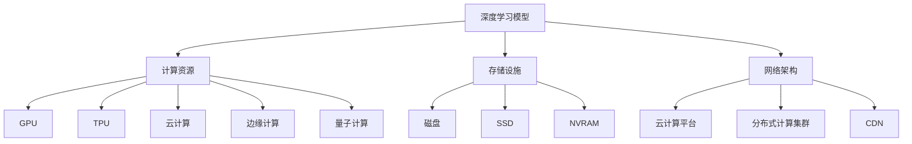
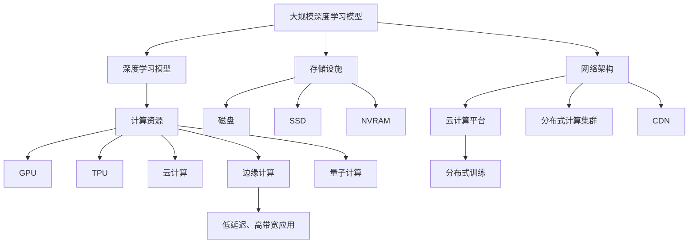

                 

# AI基础设施的演进:适应大规模训练需求

> 关键词：AI基础设施,深度学习,分布式训练,高性能计算,GPU,TPU,云计算,边缘计算,量子计算

## 1. 背景介绍

### 1.1 问题由来
随着深度学习在计算机视觉、自然语言处理、语音识别等领域的飞速发展，大规模的AI模型训练需求也随之增长。大规模深度学习模型的训练过程需要大量的计算资源和时间，传统的单机训练已经难以满足需求。为应对这一挑战，AI基础设施的演进成为了亟需解决的问题。

AI基础设施的演进主要涵盖了三个方面：计算资源、存储设施和网络架构。其中，计算资源的演化尤为关键，涉及到GPU、TPU、云计算、边缘计算和量子计算等技术的持续演进。

## 2. 核心概念与联系

### 2.1 核心概念概述

为更好地理解大规模深度学习模型的训练需求与基础设施的适配，本节将介绍几个密切相关的核心概念：

- **深度学习模型**：一种基于多层神经网络结构的机器学习算法，通过数据驱动的方式提取特征和模式。深度学习模型的训练过程通常涉及大量的参数和数据，需要强大的计算资源。

- **计算资源**：指支撑深度学习模型训练和推理的硬件设施，包括GPU、TPU、FPGA等专用加速芯片，以及云计算和边缘计算等分布式计算环境。

- **存储设施**：用于存放和访问深度学习模型的数据和参数，包括磁盘、SSD、NVRAM等。存储设施的读写速度直接影响模型的训练和推理效率。

- **网络架构**：指用于支撑深度学习模型训练和推理的网络环境，包括云计算平台、分布式计算集群、CDN等。网络架构的带宽和延迟直接影响数据传输效率和模型训练速度。

- **分布式训练**：指通过多个计算节点协同工作，加速深度学习模型的训练过程。分布式训练可以显著提高训练效率，但同时也带来了数据同步、参数一致性等复杂问题。

- **高性能计算**：指用于支撑大规模计算任务（如深度学习模型训练）的硬件和软件设施。高性能计算需要整合GPU、TPU、分布式存储和网络架构等多方面技术。

- **云计算**：通过互联网提供计算、存储、网络等基础设施服务，实现资源的按需分配和弹性伸缩。云计算平台通常提供了丰富的AI基础设施支持，如AWS、Azure、Google Cloud等。

- **边缘计算**：将计算资源部署在靠近数据源的本地设备上，减少数据传输延迟，提高计算效率。边缘计算适用于低延迟、高带宽的实时应用场景，如智能制造、自动驾驶等。

- **量子计算**：一种基于量子比特（qubit）的量子计算机，能够在某些特定问题上超越经典计算机的计算能力。量子计算有望在未来成为处理大规模深度学习模型的有力工具。

这些核心概念之间的逻辑关系可以通过以下Mermaid流程图来展示：



这个流程图展示了深度学习模型与AI基础设施的多个关键组成部分之间的关系：

1. 深度学习模型依赖于高性能计算资源进行训练和推理。
2. 计算资源包括多种硬件设施和分布式计算环境，如GPU、TPU、云计算和边缘计算等。
3. 存储设施用于存放数据和模型参数，直接影响训练和推理效率。
4. 网络架构支持数据传输和分布式计算，也是训练效率的关键因素。

### 2.2 概念间的关系

这些核心概念之间存在着紧密的联系，形成了支撑深度学习模型训练的完整生态系统。

- **深度学习模型与计算资源**：计算资源是支撑深度学习模型训练的核心，不同的计算资源可以适应不同规模的模型训练需求。
- **深度学习模型与存储设施**：存储设施的读写速度直接影响模型的训练和推理效率。
- **深度学习模型与网络架构**：网络架构的带宽和延迟直接影响数据传输效率和模型训练速度。
- **分布式训练与计算资源**：分布式训练需要整合多种计算资源，协同工作以提高训练效率。
- **高性能计算与计算资源**：高性能计算整合了多种计算资源和分布式存储，目标是实现更高效的计算和存储。
- **云计算与计算资源**：云计算提供了弹性的计算资源，支持大规模深度学习模型的训练和推理。
- **边缘计算与计算资源**：边缘计算通过将计算资源部署在本地设备上，减少数据传输延迟，提高计算效率。
- **量子计算与计算资源**：量子计算在特定问题上具备超越经典计算的能力，未来有望成为处理大规模深度学习模型的重要工具。

### 2.3 核心概念的整体架构

最后，我们用一个综合的流程图来展示这些核心概念在大规模深度学习模型训练过程中的整体架构：



这个综合流程图展示了从深度学习模型到AI基础设施的完整过程。深度学习模型通过整合多种计算资源和分布式存储，利用高性能计算和网络架构，进行分布式训练，实现高效的模型训练和推理。同时，云计算和边缘计算提供弹性和低延迟的计算资源，量子计算探索未来计算能力的新领域。

## 3. 核心算法原理 & 具体操作步骤
### 3.1 算法原理概述

大规模深度学习模型的训练过程涉及多个步骤，包括数据预处理、模型搭建、分布式训练、模型评估等。其中，分布式训练是关键步骤，通过多节点协同工作，显著提高了训练效率。

分布式训练的原理是基于数据并行和模型并行两种方式。数据并行是指将数据切分为多个子集，分别在多个计算节点上进行训练。模型并行是指将模型拆分为多个子模块，分别在多个计算节点上进行训练。两种方式可以结合使用，以适应不同规模和类型的模型。

### 3.2 算法步骤详解

以下是分布式训练的详细步骤：

**Step 1: 数据划分与切分**

1. 将大规模数据集划分为多个子集，每个子集分配到不同的计算节点上。
2. 对每个子集进行切分，确保每个计算节点处理的样本数量相等，以避免负载不均衡。

**Step 2: 计算节点初始化**

1. 在每个计算节点上初始化模型参数，并同步所有节点的参数初始值。
2. 在每个计算节点上加载相应数据子集。

**Step 3: 分布式训练**

1. 每个计算节点使用自身的数据子集进行训练，通过梯度聚合器计算全局梯度。
2. 使用异步通信协议（如NCCL）实现节点间的参数同步。
3. 重复上述过程，直到训练收敛或达到预设轮数。

**Step 4: 模型评估**

1. 在测试集上评估模型的性能。
2. 输出模型的精度、召回率、F1分数等指标。

**Step 5: 模型优化**

1. 根据模型评估结果，调整模型参数和超参数。
2 重复分布式训练和评估过程，直到模型收敛或达到预期效果。

### 3.3 算法优缺点

分布式训练的优势在于：

- 加快训练速度：通过并行计算，显著提高了训练效率。
- 降低资源成本：利用空闲计算资源进行训练，降低了硬件成本。
- 提升模型泛化能力：通过大规模数据集训练，模型泛化能力更强。

分布式训练的缺点在于：

- 复杂性高：分布式训练涉及多个计算节点和数据同步，需要复杂的管理和协调。
- 通信开销大：节点间的通信开销可能影响整体训练效率。
- 同步问题：不同节点的参数更新速度不一致，可能导致同步问题。

### 3.4 算法应用领域

分布式训练广泛应用于各种大规模深度学习模型，包括卷积神经网络（CNN）、循环神经网络（RNN）、深度信念网络（DBN）等。这些模型在图像识别、自然语言处理、语音识别等领域有广泛应用。

## 4. 数学模型和公式 & 详细讲解  
### 4.1 数学模型构建

假设大规模深度学习模型为 $M_{\theta}$，其中 $\theta$ 为模型参数。训练集为 $D=\{(x_i,y_i)\}_{i=1}^N$，其中 $x_i$ 为输入样本，$y_i$ 为标签。训练过程的目标是最小化损失函数 $\mathcal{L}(\theta)$：

$$
\mathcal{L}(\theta) = \frac{1}{N}\sum_{i=1}^N \ell(M_{\theta}(x_i),y_i)
$$

其中 $\ell$ 为损失函数，常用的有交叉熵损失、均方误差损失等。

### 4.2 公式推导过程

以交叉熵损失为例，假设模型输出为 $M_{\theta}(x)$，真实标签为 $y$，则交叉熵损失函数为：

$$
\ell(M_{\theta}(x),y) = -y\log(M_{\theta}(x)) - (1-y)\log(1-M_{\theta}(x))
$$

将 $x_i$ 代入上式，得到每个样本的损失函数：

$$
\ell_i(\theta) = -y_i\log(M_{\theta}(x_i)) - (1-y_i)\log(1-M_{\theta}(x_i))
$$

将 $\ell_i(\theta)$ 对 $\theta$ 求导，得到每个样本的梯度：

$$
\frac{\partial \ell_i(\theta)}{\partial \theta} = -y_i\frac{\partial M_{\theta}(x_i)}{\partial \theta} - (1-y_i)\frac{\partial M_{\theta}(x_i)}{\partial \theta}
$$

利用链式法则，可得梯度聚合器的计算公式：

$$
\nabla_{\theta} \mathcal{L}(\theta) = \frac{1}{N}\sum_{i=1}^N \nabla_{\theta} \ell_i(\theta)
$$

### 4.3 案例分析与讲解

以图像分类任务为例，假设模型为卷积神经网络（CNN），训练集为ImageNet。数据集被划分为多个子集，每个子集分配到不同的计算节点上进行训练。假设每个计算节点有 $m$ 个样本，训练 $t$ 个epoch，则每个epoch的梯度聚合公式为：

$$
\nabla_{\theta} \mathcal{L}(\theta) = \frac{1}{N}\sum_{i=1}^{m\times t} \nabla_{\theta} \ell_i(\theta)
$$

其中 $N$ 为总样本数，$m$ 为每个节点的样本数，$t$ 为训练轮数。

## 5. 项目实践：代码实例和详细解释说明
### 5.1 开发环境搭建

在进行分布式训练前，我们需要准备好开发环境。以下是使用PyTorch和TensorFlow进行分布式训练的环境配置流程：

1. 安装Anaconda：从官网下载并安装Anaconda，用于创建独立的Python环境。

2. 创建并激活虚拟环境：
```bash
conda create -n pytorch-env python=3.8 
conda activate pytorch-env
```

3. 安装PyTorch：根据CUDA版本，从官网获取对应的安装命令。例如：
```bash
conda install pytorch torchvision torchaudio cudatoolkit=11.1 -c pytorch -c conda-forge
```

4. 安装TensorFlow：
```bash
pip install tensorflow==2.5
```

5. 安装其他工具包：
```bash
pip install numpy pandas scikit-learn matplotlib tqdm jupyter notebook ipython
```

完成上述步骤后，即可在`pytorch-env`环境中开始分布式训练实践。

### 5.2 源代码详细实现

下面以使用PyTorch进行图像分类任务的分布式训练为例，给出完整的代码实现。

首先，定义数据处理函数：

```python
from torch.utils.data import Dataset
from torchvision import transforms
import torch

class ImageNetDataset(Dataset):
    def __init__(self, root, transforms):
        self.root = root
        self.transforms = transforms
        self.data = []
        
    def __len__(self):
        return len(self.data)
    
    def __getitem__(self, item):
        path = self.data[item][0]
        label = self.data[item][1]
        img = Image.open(path).convert('RGB')
        img = self.transforms(img)
        return img, label

# 定义数据集路径和预处理步骤
train_data = ImageNetDataset('/path/to/train', transforms.Compose([
    transforms.Resize((224, 224)),
    transforms.ToTensor(),
    transforms.Normalize(mean=[0.485, 0.456, 0.406], std=[0.229, 0.224, 0.225])
]))

val_data = ImageNetDataset('/path/to/val', transforms.Compose([
    transforms.Resize((224, 224)),
    transforms.ToTensor(),
    transforms.Normalize(mean=[0.485, 0.456, 0.406], std=[0.229, 0.224, 0.225])
]))
```

然后，定义模型和优化器：

```python
from torchvision.models import resnet18

model = resnet18(pretrained=True)
criterion = torch.nn.CrossEntropyLoss()
optimizer = torch.optim.SGD(model.parameters(), lr=0.01, momentum=0.9)

# 将模型复制到不同计算节点
model = torch.nn.DataParallel(model)
```

接着，定义分布式训练函数：

```python
from torch.distributed import DistributedDataParallel as DDP

def train_epoch(model, data_loader, optimizer):
    model.train()
    epoch_loss = 0
    epoch_acc = 0
    for batch in data_loader:
        inputs, labels = batch
        inputs = inputs.to(device)
        labels = labels.to(device)
        optimizer.zero_grad()
        outputs = model(inputs)
        loss = criterion(outputs, labels)
        loss.backward()
        optimizer.step()
        epoch_loss += loss.item()
        epoch_acc += torch.sum(outputs.argmax(1) == labels).item()
    return epoch_loss / len(data_loader), epoch_acc / len(data_loader)

def evaluate(model, data_loader):
    model.eval()
    eval_loss = 0
    eval_acc = 0
    with torch.no_grad():
        for batch in data_loader:
            inputs, labels = batch
            inputs = inputs.to(device)
            labels = labels.to(device)
            outputs = model(inputs)
            loss = criterion(outputs, labels)
            eval_loss += loss.item()
            eval_acc += torch.sum(outputs.argmax(1) == labels).item()
    return eval_loss / len(data_loader), eval_acc / len(data_loader)
```

最后，启动训练流程并在测试集上评估：

```python
epochs = 5
batch_size = 32
device = torch.device('cuda' if torch.cuda.is_available() else 'cpu')

# 初始化分布式训练环境
torch.distributed.init_process_group(backend='nccl')
torch.distributed.set_world_size(4)
torch.distributed.set_rank(0)

# 定义训练集和测试集数据加载器
train_loader = torch.utils.data.DataLoader(train_data, batch_size=batch_size, shuffle=True, num_workers=4)
val_loader = torch.utils.data.DataLoader(val_data, batch_size=batch_size, shuffle=False, num_workers=4)

for epoch in range(epochs):
    train_loss, train_acc = train_epoch(model, train_loader, optimizer)
    print(f'Epoch {epoch+1}, train loss: {train_loss:.4f}, train acc: {train_acc:.4f}')
    
    test_loss, test_acc = evaluate(model, val_loader)
    print(f'Epoch {epoch+1}, test loss: {test_loss:.4f}, test acc: {test_acc:.4f}')
```

以上就是使用PyTorch进行图像分类任务分布式训练的完整代码实现。可以看到，通过简单的封装，PyTorch已经支持了自动分布式训练，开发者只需在代码中调用相应的API即可。

### 5.3 代码解读与分析

让我们再详细解读一下关键代码的实现细节：

**ImageNetDataset类**：
- `__init__`方法：初始化数据集路径和预处理步骤。
- `__len__`方法：返回数据集的样本数量。
- `__getitem__`方法：对单个样本进行处理，将其转换为张量并应用预处理步骤。

**模型和优化器定义**：
- 使用预训练的ResNet-18模型，并加载交叉熵损失函数和优化器。
- 将模型封装为`DataParallel`对象，以实现数据并行。

**train_epoch和evaluate函数**：
- 在训练和评估过程中，使用`DataParallel`对象的`module`属性来获取模型参数和调用前向传播、反向传播和优化操作。

**训练流程**：
- 初始化分布式训练环境，设置世界大小和节点编号。
- 定义训练集和测试集数据加载器，并设置批大小和工人数。
- 循环迭代epochs，在每个epoch内分别在训练集和测试集上训练和评估模型。

可以看到，分布式训练的实现相对简单，但其中涉及的数据分割、参数同步、通信协议等细节需要精心设计。此外，不同框架和工具库在分布式训练的实现上也有所差异，开发者需要根据实际需求选择合适的工具。

## 6. 实际应用场景
### 6.1 智慧医疗

在智慧医疗领域，大规模深度学习模型被广泛用于医学影像分析、疾病预测、基因分析等任务。传统医疗系统的数据量大、复杂度高，难以适应现代医疗需求。通过分布式训练，深度学习模型可以在大规模医疗数据集上进行训练，提升诊断准确性和治疗效果。

例如，可以使用大规模医疗影像数据集训练卷积神经网络，用于自动识别疾病影像中的病灶，辅助医生进行诊断和治疗。在分布式训练过程中，可以将数据集划分为多个子集，分配到不同的计算节点上进行训练。不同节点间进行数据通信和模型同步，以加快训练速度并提高模型泛化能力。

### 6.2 智能交通

智能交通系统需要实时处理大量的传感器数据，以实现交通流量预测、事故预警等功能。大规模深度学习模型可以在分布式环境中对传感器数据进行建模和分析，提供实时预测和决策支持。

例如，可以使用分布式训练的循环神经网络（RNN）模型，对历史交通数据进行建模，预测未来交通流量和路况。在训练过程中，可以将历史交通数据切分为多个子集，分配到不同的计算节点上进行训练。通过分布式训练，可以显著提高模型训练速度，并在实时环境中提供高效的预测结果。

### 6.3 金融科技

金融科技行业需要处理海量交易数据和实时分析需求，大规模深度学习模型可以在分布式环境中进行快速训练和推理。

例如，可以使用分布式训练的深度信念网络（DBN）模型，对历史交易数据进行建模，预测股票价格和市场趋势。在训练过程中，可以将历史交易数据切分为多个子集，分配到不同的计算节点上进行训练。通过分布式训练，可以显著提高模型训练速度，并在实时环境中提供高效的预测结果。

### 6.4 未来应用展望

随着深度学习模型的规模和复杂度不断增加，分布式训练的应用场景将更加广泛。未来，分布式训练将涉及更多新兴技术，如边缘计算、量子计算等，以适应更多实时性和安全性要求高的应用场景。

- **边缘计算**：将计算资源部署在本地设备上，减少数据传输延迟，提高计算效率。适用于低延迟、高带宽的实时应用场景，如自动驾驶、智能制造等。
- **量子计算**：在特定问题上具备超越经典计算的能力，未来有望成为处理大规模深度学习模型的重要工具。
- **联邦学习**：在分布式环境中，通过多方协作训练模型，保护数据隐私和安全。适用于需要数据隐私保护的应用场景，如医疗、金融等。

这些技术的结合将使得分布式训练在大规模深度学习模型中的应用更加广泛和高效。

## 7. 工具和资源推荐
### 7.1 学习资源推荐

为了帮助开发者系统掌握分布式训练的理论基础和实践技巧，这里推荐一些优质的学习资源：

1. 《深度学习基础》系列博文：由深度学习领域专家撰写，系统介绍了深度学习模型的基础概念和实现细节。

2. 《深度学习框架TensorFlow教程》：官方提供的TensorFlow学习教程，涵盖基本概念和高级技巧，适合初学者和进阶者学习。

3. 《分布式深度学习实战》书籍：详细介绍了分布式深度学习的实现和优化技巧，适合有一定深度学习基础的读者。

4. PyTorch官方文档：PyTorch官方文档，提供了丰富的API和样例代码，是学习PyTorch的重要资源。

5. PyTorch分布式教程：PyTorch官方提供的分布式训练教程，涵盖基本概念和实现细节，适合初学者学习。

6. AWS深度学习教程：AWS官方提供的深度学习教程，涵盖AWS分布式训练服务的基本概念和实现细节，适合AWS用户学习。

通过这些资源的学习实践，相信你一定能够快速掌握分布式训练的精髓，并用于解决实际的深度学习问题。

### 7.2 开发工具推荐

高效的开发离不开优秀的工具支持。以下是几款用于分布式训练开发的常用工具：

1. PyTorch：基于Python的开源深度学习框架，灵活动态的计算图，适合快速迭代研究。大部分深度学习模型都有PyTorch版本的实现。

2. TensorFlow：由Google主导开发的开源深度学习框架，生产部署方便，适合大规模工程应用。同样有丰富的深度学习模型资源。

3. Horovod：用于分布式深度学习训练的Python库，支持多种深度学习框架，并提供了丰富的分布式训练功能。

4. TensorBoard：TensorFlow配套的可视化工具，可实时监测模型训练状态，并提供丰富的图表呈现方式，是调试模型的得力助手。

5. PyTorch分布式模块：PyTorch官方提供的分布式训练模块，支持多种分布式通信协议，方便开发者进行分布式训练。

6. NVIDIA Deep Learning SDK：NVIDIA提供的深度学习开发工具包，包含多种深度学习框架和分布式训练工具。

合理利用这些工具，可以显著提升分布式训练的开发效率，加快创新迭代的步伐。

### 7.3 相关论文推荐

深度学习模型和大规模分布式训练的演进主要源于学界的持续研究。以下是几篇奠基性的相关论文，推荐阅读：

1. A Large-Scale Parallel Distributed Learning Framework for Deep Neural Network（SGD-MLP论文）：提出了一种基于数据并行的分布式深度学习框架，可以有效利用多台计算机加速模型训练。

2. Distributed Deep Learning: A Systematic Survey（Distributed Deep Learning综述）：系统总结了分布式深度学习的研究进展和应用实践，提供了丰富的参考文献和实际案例。

3. Distributed Deep Learning with SGD: An Overview（SGD综述）：对SGD在分布式深度学习中的实现和优化进行了详细介绍，涵盖了数据并行、模型并行等关键技术。

4. TensorFlow: A System for Large-Scale Machine Learning（TensorFlow论文）：TensorFlow框架的设计和实现，包括分布式训练的优化和实践技巧。

5. Distributed Deep Learning with TensorFlow：对TensorFlow在分布式深度学习中的应用进行了详细介绍，涵盖了分布式训练的实现和优化。

这些论文代表了大规模深度学习模型的训练范式的演进方向，对于理解分布式训练的技术细节和实践技巧具有重要意义。

除上述资源外，还有一些值得关注的前沿资源，帮助开发者紧跟深度学习模型的训练范式的最新进展，例如：

1. arXiv论文预印本：人工智能领域最新研究成果的发布平台，包括大量尚未发表的前沿工作，学习前沿技术的必读资源。

2. 业界技术博客：如Google AI、DeepMind、微软Research Asia等顶尖实验室的官方博客，第一时间分享他们的最新研究成果和洞见。

3. 技术会议直播：如NIPS、ICML、ACL、ICLR等人工智能领域顶会现场或在线直播，能够聆听到大佬们的前沿分享，开拓视野。

4. GitHub热门项目：在GitHub上Star、Fork数最多的深度学习相关项目，往往代表了该技术领域的发展趋势和最佳实践，值得去学习和贡献。

5. 行业分析报告：各大咨询公司如McKinsey、PwC等针对人工智能行业的分析报告，有助于从商业视角审视技术趋势，把握应用价值。

总之，对于分布式训练技术的学习和实践，需要开发者保持开放的心态和持续学习的意愿。多关注前沿资讯，多动手实践，多思考总结，必将收获满满的成长收益。

## 8. 总结：未来发展趋势与挑战
### 8.1 总结

本文对基于分布式训练的深度学习模型训练方法进行了全面系统的介绍。首先阐述了大规模深度学习模型的训练需求与基础设施的适配，明确了分布式训练在大规模模型训练中的重要性。其次，从原理到实践，详细讲解了分布式训练的数学原理和关键步骤，给出了分布式训练任务开发的

