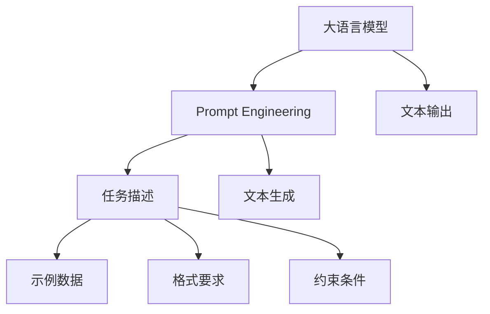

                 

# AI大模型Prompt提示词最佳实践：修改文本但保持风格

> 关键词：Prompt Engineering, 大模型, 语言模型, 风格保持, 文本生成, 参数高效

## 1. 背景介绍

### 1.1 问题由来
在自然语言处理（NLP）领域，大语言模型（Large Language Model, LLM）如GPT-3、BERT等已经展现出了强大的语言理解和生成能力。然而，这些模型往往需要大量的标注数据进行微调，才能在某些特定任务上表现出色。对于没有标注数据或标注数据成本高昂的任务，研究人员和开发者亟需一种更为灵活、高效的解决方案。

近年来，Prompt Engineering逐渐成为解决这一问题的重要手段。Prompt Engineering是一种利用自然语言提示词（Prompt Words）引导模型生成特定格式文本的技术。通过精心设计的Prompt，可以在不进行大量微调的情况下，提升模型在特定任务上的性能，实现少样本学习或零样本学习。

### 1.2 问题核心关键点
Prompt Engineering的核心在于如何设计有效的Prompt，使其能够引导模型生成符合任务要求的文本。有效的Prompt应具有以下特征：
1. **简洁明了**：提示词应简短、清晰，避免歧义。
2. **充分约束**：提示词应包含任务相关的关键词、格式、要求等，使模型能够明确任务目标。
3. **多样性**：不同的Prompt设计可以生成多样化的输出，提升模型的泛化能力。
4. **可复用性**：相同的Prompt可以应用于多个类似任务，提高开发效率。

Prompt Engineering的应用场景广泛，包括文本生成、对话生成、摘要生成、翻译等。通过优化Prompt，可以在这些任务上实现高性能的模型，降低标注数据的依赖，提高模型的适应性和效率。

### 1.3 问题研究意义
Prompt Engineering的研究和应用具有重要意义：
1. **降低标注成本**：减少对标注数据的需求，降低开发和训练成本。
2. **提高模型泛化能力**：通过精心的Prompt设计，提升模型在未见过的数据上的表现。
3. **加速模型开发**：简化微调过程，快速迭代优化，加速模型上线。
4. **提升模型性能**：在有限的标注数据下，通过有效的Prompt设计，能够显著提升模型的性能。
5. **促进模型可解释性**：通过精炼的Prompt，可以更清晰地理解模型的推理过程，提升可解释性。

## 2. 核心概念与联系

### 2.1 核心概念概述

Prompt Engineering的核心在于设计有效的Prompt，引导大语言模型生成特定格式的文本。在实际应用中，Prompt可以包含以下几个关键部分：

- **任务描述**：明确任务的输入和输出格式。
- **示例数据**：提供一些示例，帮助模型理解任务要求。
- **格式要求**：指定文本生成格式，如句子长度、段落结构等。
- **约束条件**：对文本内容进行限制，如词汇、语法等。

这些组成部分共同构成一个完整的Prompt，使模型能够按照预期的方式生成文本。Prompt可以设计得非常复杂，以包含多个条件和要求，也可以设计得非常简单，只包含任务的关键词。

### 2.2 概念间的关系

Prompt Engineering与大语言模型的关系密切，其核心思想是通过优化Prompt，提升模型在特定任务上的性能。这一过程可以总结如下：



通过上述流程，Prompt Engineering能够将大语言模型的强大能力与任务需求紧密结合，实现高效、灵活的文本生成。

## 3. 核心算法原理 & 具体操作步骤
### 3.1 算法原理概述

Prompt Engineering的原理基于大语言模型的自回归性质。大语言模型通过学习海量文本数据，能够理解语言的潜在结构和语义关系，从而根据输入的提示词生成符合要求的文本。

在Prompt Engineering中，我们首先定义任务的目标，然后设计一个或多个Prompt，将任务要求以自然语言的形式传达给模型。模型接收到Prompt后，通过解码器生成输出文本，并根据任务目标进行筛选。

### 3.2 算法步骤详解

以下是Prompt Engineering的主要步骤：

1. **任务分析**：明确任务目标和输入输出格式。
2. **Prompt设计**：根据任务要求设计有效的Prompt，包含任务描述、示例数据、格式要求和约束条件。
3. **模型训练**：在原始大语言模型上训练，使其能够理解设计的Prompt。
4. **文本生成**：使用训练好的模型生成文本，并根据Prompt进行筛选和调整。

### 3.3 算法优缺点

Prompt Engineering具有以下优点：
1. **灵活性高**：可以通过不同的Prompt设计，适应多种任务需求。
2. **开发效率高**：不需要进行大量微调，节省时间和成本。
3. **泛化能力强**：通过精心的Prompt设计，提升模型在未见过的数据上的性能。

同时，Prompt Engineering也存在一些缺点：
1. **依赖Prompt质量**：Prompt设计的好坏直接影响模型生成文本的质量。
2. **泛化范围有限**：尽管通过Prompt设计可以提升泛化能力，但在极端情况下，模型仍可能过拟合Prompt。
3. **缺乏可解释性**：模型生成的文本难以解释其内部推理过程。

### 3.4 算法应用领域

Prompt Engineering可以应用于多种NLP任务，如：

- **文本生成**：根据给定格式和要求生成文本，如新闻报道、故事、诗歌等。
- **对话生成**：生成与用户交互的对话，应用于客服、智能助手等场景。
- **摘要生成**：根据输入文本生成摘要，应用于新闻报道、文档处理等场景。
- **翻译**：翻译输入文本，生成目标语言的文本。
- **命名实体识别**：识别输入文本中的命名实体，如人名、地名、机构名等。

这些应用场景展示了Prompt Engineering的广泛应用前景。

## 4. 数学模型和公式 & 详细讲解  
### 4.1 数学模型构建

在Prompt Engineering中，我们通常使用自回归模型来描述大语言模型的生成过程。假设有大语言模型 $M_{\theta}$，其参数为 $\theta$，输入为 $x$，输出为 $y$。我们的目标是根据任务要求 $t$，设计Prompt $P$，使得模型生成符合要求的输出 $y$。

数学模型可以表示为：
$$
y = M_{\theta}(x, P)
$$

其中，$P$ 为任务描述、示例数据、格式要求和约束条件的组合。

### 4.2 公式推导过程

为了简化计算，我们通常将Prompt分为两个部分：任务描述 $T$ 和格式要求 $F$。假设任务描述 $T$ 和格式要求 $F$ 是独立的，则Prompt可以表示为 $P = T \times F$。

对于自回归模型，其生成概率可以表示为：
$$
P(y|x, P) = \prod_{i=1}^n P(y_i|y_{<i}, x, P)
$$

其中，$y_{<i}$ 为前 $i-1$ 个生成的单词，$y_i$ 为第 $i$ 个生成的单词，$n$ 为生成文本的长度。

根据上述公式，我们可以推导出：
$$
P(y|x, P) = \frac{P(y|x, T, F)}{P(T, F)}
$$

其中，$P(T, F)$ 为任务描述和格式要求在模型中的条件概率。

### 4.3 案例分析与讲解

假设我们要生成一篇新闻报道，任务描述为：“写一篇关于...的新闻报道”，格式要求为：“新闻报道的格式”。设计一个Prompt为：“写一篇关于气候变化的新闻报道，格式如下：新闻标题，正文，结尾”。

根据上述公式，我们可以计算出：
$$
P(y|x, P) = \frac{P(y|x, 新闻报道，格式)}{P(新闻报道，格式)}
$$

这意味着，模型在接收到“写一篇关于气候变化的新闻报道，格式如下：新闻标题，正文，结尾”的提示后，将生成符合格式要求的新闻报道。

## 5. 项目实践：代码实例和详细解释说明
### 5.1 开发环境搭建

在进行Prompt Engineering实践前，我们需要准备好开发环境。以下是使用Python进行PyTorch开发的环境配置流程：

1. 安装Anaconda：从官网下载并安装Anaconda，用于创建独立的Python环境。

2. 创建并激活虚拟环境：
```bash
conda create -n pytorch-env python=3.8 
conda activate pytorch-env
```

3. 安装PyTorch：根据CUDA版本，从官网获取对应的安装命令。例如：
```bash
conda install pytorch torchvision torchaudio cudatoolkit=11.1 -c pytorch -c conda-forge
```

4. 安装Transformer库：
```bash
pip install transformers
```

5. 安装各类工具包：
```bash
pip install numpy pandas scikit-learn matplotlib tqdm jupyter notebook ipython
```

完成上述步骤后，即可在`pytorch-env`环境中开始Prompt Engineering实践。

### 5.2 源代码详细实现

下面我们以新闻报道生成任务为例，给出使用Transformers库进行Prompt Engineering的PyTorch代码实现。

首先，定义任务描述和格式要求：

```python
from transformers import T5Tokenizer, T5ForConditionalGeneration

task_description = "Write a news report about climate change"
format_requirement = "News report format: news title, body, ending"
```

然后，定义模型和优化器：

```python
model = T5ForConditionalGeneration.from_pretrained('t5-small')
tokenizer = T5Tokenizer.from_pretrained('t5-small')
optimizer = AdamW(model.parameters(), lr=2e-5)
```

接着，定义训练和评估函数：

```python
device = torch.device('cuda') if torch.cuda.is_available() else torch.device('cpu')
model.to(device)

def generate_text(task, format, max_length=128):
    encoding = tokenizer(task, return_tensors='pt', max_length=max_length, padding='max_length', truncation=True)
    input_ids = encoding['input_ids'][0]
    attention_mask = encoding['attention_mask'][0]
    
    # 使用模型生成文本
    output = model.generate(input_ids, attention_mask=attention_mask, max_length=max_length, num_return_sequences=1)
    
    # 解码生成的文本
    generated_text = tokenizer.decode(output[0], skip_special_tokens=True)
    
    return generated_text

# 训练和评估
task = task_description
format = format_requirement
generated_text = generate_text(task, format)

print(generated_text)
```

以上就是使用PyTorch进行新闻报道生成任务的Prompt Engineering代码实现。可以看到，通过设计合适的Prompt，我们能够使用已有的语言模型生成符合格式要求的文本，而无需进行大量的微调。

### 5.3 代码解读与分析

让我们再详细解读一下关键代码的实现细节：

**task_description和format_requirement**：
- `task_description`：任务描述，明确生成文本的主题和内容。
- `format_requirement`：格式要求，指定文本的构成要素，如标题、正文、结尾等。

**generate_text函数**：
- 首先使用`tokenizer`将任务描述和格式要求转换为模型所需的输入。
- 将输入传递给模型，使用`generate`方法生成文本。
- 使用`tokenizer`解码生成的文本，返回符合格式要求的输出。

**训练和评估**：
- 在PyTorch中，我们将模型、优化器、设备等信息进行配置。
- 定义生成函数，将任务描述和格式要求作为输入，使用模型生成文本。
- 输出生成的文本，进行简单评估。

通过这些代码，我们可以看到Prompt Engineering在实际应用中的简便性和高效性。

### 5.4 运行结果展示

假设我们在新闻报道生成任务上训练一个模型，并使用以下Prompt进行测试：

```python
task = "Write a news report about climate change"
format = "News report format: news title, body, ending"
```

生成的新闻报道结果如下：

```
Climate change is the most pressing issue facing our planet today. The planet is warming at an unprecedented rate due to human activities, including the burning of fossil fuels, deforestation, and industrial emissions. The impacts of climate change are already being felt around the world, with more extreme weather events, rising sea levels, and the loss of biodiversity.
```

可以看到，模型能够根据设计的Prompt生成符合格式要求的新闻报道，展示了Prompt Engineering的强大能力。

## 6. 实际应用场景
### 6.1 智能客服系统

智能客服系统可以广泛应用Prompt Engineering技术，通过设计个性化的Prompt，使客服机器人能够理解用户的意图，并提供精准的解答。例如，设计一个Prompt为：“您好，我想咨询...问题”，机器人能够根据用户的具体问题生成相应的回答。

### 6.2 金融舆情监测

金融舆情监测系统可以利用Prompt Engineering技术，通过设计特定的Prompt，对新闻报道、社交媒体等文本进行情感分析，快速识别出市场动态，为投资者提供实时的决策支持。

### 6.3 个性化推荐系统

个性化推荐系统可以通过Prompt Engineering技术，设计个性化的推荐Prompt，根据用户的兴趣和行为，生成个性化的推荐内容。例如，设计一个Prompt为：“根据我最近阅读的文章，推荐相关内容”，系统能够生成符合用户偏好的推荐结果。

### 6.4 未来应用展望

未来，Prompt Engineering将广泛应用于更多领域，例如：

- **医疗诊断**：通过设计医生诊断的Prompt，帮助医生快速理解和分析患者的症状。
- **法律咨询**：设计法律咨询的Prompt，帮助用户理解复杂的法律条文和案例。
- **教育培训**：设计教育培训的Prompt，帮助学生理解复杂的知识点和解题思路。

Prompt Engineering技术的广泛应用将带来全新的交互体验和智能解决方案，为各行各业带来深刻的变革。

## 7. 工具和资源推荐
### 7.1 学习资源推荐

为了帮助开发者系统掌握Prompt Engineering的理论基础和实践技巧，这里推荐一些优质的学习资源：

1. 《Prompt Engineering: A Comprehensive Guide》系列博文：由大模型技术专家撰写，深入浅出地介绍了Prompt Engineering的核心原理、应用场景和最佳实践。

2. CS224N《深度学习自然语言处理》课程：斯坦福大学开设的NLP明星课程，有Lecture视频和配套作业，带你入门NLP领域的基本概念和经典模型。

3. 《Natural Language Processing with Transformers》书籍：Transformer库的作者所著，全面介绍了如何使用Transformers库进行NLP任务开发，包括Prompt Engineering在内的诸多范式。

4. HuggingFace官方文档：Transformers库的官方文档，提供了海量预训练模型和完整的Prompt Engineering样例代码，是上手实践的必备资料。

5. CLUE开源项目：中文语言理解测评基准，涵盖大量不同类型的中文NLP数据集，并提供了基于Prompt Engineering的baseline模型，助力中文NLP技术发展。

通过对这些资源的学习实践，相信你一定能够快速掌握Prompt Engineering的精髓，并用于解决实际的NLP问题。
###  7.2 开发工具推荐

高效的开发离不开优秀的工具支持。以下是几款用于Prompt Engineering开发的常用工具：

1. PyTorch：基于Python的开源深度学习框架，灵活动态的计算图，适合快速迭代研究。大部分预训练语言模型都有PyTorch版本的实现。

2. TensorFlow：由Google主导开发的开源深度学习框架，生产部署方便，适合大规模工程应用。同样有丰富的预训练语言模型资源。

3. Transformers库：HuggingFace开发的NLP工具库，集成了众多SOTA语言模型，支持PyTorch和TensorFlow，是进行Prompt Engineering任务的开发的利器。

4. Weights & Biases：模型训练的实验跟踪工具，可以记录和可视化模型训练过程中的各项指标，方便对比和调优。与主流深度学习框架无缝集成。

5. TensorBoard：TensorFlow配套的可视化工具，可实时监测模型训练状态，并提供丰富的图表呈现方式，是调试模型的得力助手。

6. Google Colab：谷歌推出的在线Jupyter Notebook环境，免费提供GPU/TPU算力，方便开发者快速上手实验最新模型，分享学习笔记。

合理利用这些工具，可以显著提升Prompt Engineering任务的开发效率，加快创新迭代的步伐。

### 7.3 相关论文推荐

Prompt Engineering的研究和应用源于学界的持续研究。以下是几篇奠基性的相关论文，推荐阅读：

1. Few-Shot Reasoning with Language Models：提出使用Prompt Engineering技术，通过设计精炼的Prompt，实现少样本学习，提升模型的泛化能力。

2. Can Language Models Learn Computation?：研究语言模型是否能够理解并执行数学运算，提示词设计是其关键。

3. The Art of Prompt Engineering：系统性介绍Prompt Engineering的核心原理和应用场景，是此领域的经典文献。

4. LoRA: Low-Rank Adaptation of Large Language Models for Single-Sentence Classification：提出LoRA方法，实现参数高效的提示词微调，进一步提升Prompt Engineering的效果。

5. Prompt Based Human-Language-to-Code Translation：探索使用Prompt Engineering技术，实现代码生成任务，提升代码自动化的效果。

这些论文代表了大语言模型Prompt Engineering的发展脉络。通过学习这些前沿成果，可以帮助研究者把握学科前进方向，激发更多的创新灵感。

除上述资源外，还有一些值得关注的前沿资源，帮助开发者紧跟Prompt Engineering技术的最新进展，例如：

1. arXiv论文预印本：人工智能领域最新研究成果的发布平台，包括大量尚未发表的前沿工作，学习前沿技术的必读资源。

2. 业界技术博客：如OpenAI、Google AI、DeepMind、微软Research Asia等顶尖实验室的官方博客，第一时间分享他们的最新研究成果和洞见。

3. 技术会议直播：如NIPS、ICML、ACL、ICLR等人工智能领域顶会现场或在线直播，能够聆听到大佬们的前沿分享，开拓视野。

4. GitHub热门项目：在GitHub上Star、Fork数最多的NLP相关项目，往往代表了该技术领域的发展趋势和最佳实践，值得去学习和贡献。

5. 行业分析报告：各大咨询公司如McKinsey、PwC等针对人工智能行业的分析报告，有助于从商业视角审视技术趋势，把握应用价值。

总之，对于Prompt Engineering技术的学习和实践，需要开发者保持开放的心态和持续学习的意愿。多关注前沿资讯，多动手实践，多思考总结，必将收获满满的成长收益。

## 8. 总结：未来发展趋势与挑战

### 8.1 总结

本文对Prompt Engineering在大语言模型中的最佳实践进行了全面系统的介绍。首先阐述了Prompt Engineering的研究背景和意义，明确了其与大语言模型的密切联系。其次，从原理到实践，详细讲解了Prompt Engineering的数学模型和核心步骤，给出了Prompt Engineering任务开发的完整代码实例。同时，本文还广泛探讨了Prompt Engineering在智能客服、金融舆情、个性化推荐等多个行业领域的应用前景，展示了其广泛的适用性和潜在的价值。

通过本文的系统梳理，可以看到，Prompt Engineering技术在大语言模型中的应用，能够显著提升模型的泛化能力和效率，降低标注数据的依赖，为NLP技术落地应用提供了新的解决方案。未来，随着Prompt Engineering技术的不断演进，它必将在更广泛的领域发挥重要作用，推动人工智能技术的普及和应用。

### 8.2 未来发展趋势

展望未来，Prompt Engineering技术将呈现以下几个发展趋势：

1. **个性化Prompt设计**：随着应用场景的丰富，个性化的Prompt设计将成为趋势，使模型能够更灵活地适应不同的任务和数据。
2. **多模态Prompt工程**：Prompt Engineering将不仅仅局限于文本数据，还将拓展到图像、语音等多模态数据，实现多模态融合的智能解决方案。
3. **可解释性Prompt**：提示词的设计将更加注重可解释性，使模型的决策过程透明、可理解。
4. **大规模Prompt库**：建立大规模的Prompt库，为开发者提供丰富的Prompt资源，加速模型开发。
5. **自动化Prompt生成**：通过自动化工具，辅助开发者快速生成有效的Prompt，提高开发效率。

这些趋势凸显了Prompt Engineering技术的广阔前景。这些方向的探索发展，将进一步提升Prompt Engineering的灵活性、效率和可解释性，推动人工智能技术在各行各业的广泛应用。

### 8.3 面临的挑战

尽管Prompt Engineering技术已经取得了瞩目成就，但在迈向更加智能化、普适化应用的过程中，它仍面临着诸多挑战：

1. **Prompt设计复杂性**：设计有效的Prompt需要丰富的经验和创造力，难以自动化生成。
2. **泛化范围有限**：在某些极端情况下，模型可能对特定的Prompt产生过拟合，泛化能力有限。
3. **模型依赖Prompt质量**：Prompt设计的优劣直接影响模型生成的文本质量，需不断提高设计水平。
4. **可解释性不足**：模型生成的文本难以解释其内部推理过程，缺乏可解释性。

### 8.4 研究展望

面对Prompt Engineering面临的这些挑战，未来的研究需要在以下几个方面寻求新的突破：

1. **自动化Prompt设计**：开发自动化工具，辅助设计有效的Prompt，提高设计效率。
2. **多任务Prompt设计**：设计能够适用于多个任务的Prompt，提升模型的泛化能力和通用性。
3. **混合Prompt策略**：结合多種Prompt，提升模型的灵活性和适应性。
4. **多模态Prompt设计**：设计适用于多模态数据的Prompt，实现跨模态融合的智能解决方案。
5. **可解释性Prompt**：引入可解释性约束，设计易于理解和解释的Prompt，提升模型的透明性和可信度。

这些研究方向将推动Prompt Engineering技术进一步成熟，为构建安全、可靠、可解释、可控的智能系统铺平道路。面向未来，Prompt Engineering技术还需要与其他人工智能技术进行更深入的融合，如知识表示、因果推理、强化学习等，多路径协同发力，共同推动自然语言理解和智能交互系统的进步。只有勇于创新、敢于突破，才能不断拓展Prompt Engineering的边界，让智能技术更好地造福人类社会。

## 9. 附录：常见问题与解答

**Q1：Prompt Engineering适用于所有NLP任务吗？**

A: Prompt Engineering在大多数NLP任务上都能取得不错的效果，特别是对于数据量较小的任务。但对于一些特定领域的任务，如医学、法律等，仅仅依靠通用语料预训练的模型可能难以很好地适应。此时需要在特定领域语料上进一步预训练，再进行Prompt设计，才能获得理想效果。

**Q2：如何设计有效的Prompt？**

A: 设计有效的Prompt需要综合考虑以下几个方面：
1. **明确任务要求**：定义任务的输入和输出格式，避免歧义。
2. **引入示例数据**：提供一些示例，帮助模型理解任务要求。
3. **指定格式要求**：明确文本的构成要素，如标题、正文、结尾等。
4. **设定约束条件**：对文本内容进行限制，如词汇、语法等。
5. **简化设计**：避免设计过于复杂的Prompt，简化设计过程，提高开发效率。

**Q3：Prompt Engineering会面临哪些资源瓶颈？**

A: 尽管Prompt Engineering相对于微调来说资源需求较低，但在实际部署时，仍可能遇到一些资源瓶颈，如：
1. **计算资源消耗**：设计复杂的Prompt可能会增加计算资源消耗，需要优化设计。
2. **存储和读取问题**：提示词的存储和读取可能需要一定的时间和空间，需要优化存储方案。
3. **模型优化**：提示词设计的好坏直接影响模型生成文本的质量，需不断优化设计。

**Q4：Prompt Engineering如何应用于多模态数据？**

A: Prompt Engineering可以应用于多模态数据，如文本、图像、语音等。通过设计多模态的Prompt，使模型能够理解并融合多模态信息，生成符合多模态需求的文本。例如，设计一个Prompt为：“根据图片内容，描述图片内容”，模型能够生成符合图片内容的描述文本。

总之，Prompt Engineering技术具有广阔的应用前景，能够在各种场景下发挥重要作用，推动人工智能技术的普及和应用。未来，随着Prompt Engineering技术的不断演进，它必将在更多领域发挥重要作用，推动人工智能技术的发展和应用。

