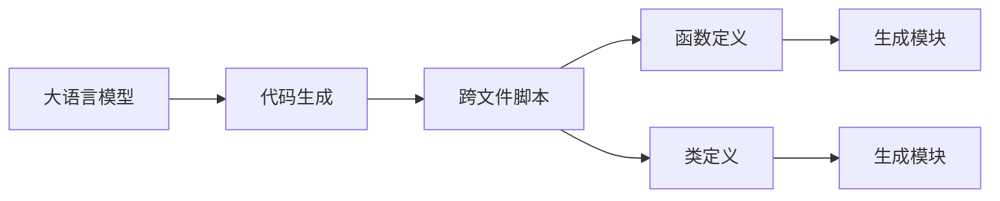

                 

# AI大模型Prompt提示词最佳实践：生成跨文件的代码脚本

> 关键词：大语言模型,提示词,代码生成,跨文件脚本,Python脚本,模板,语法高亮,编程环境,IDE工具,代码完成,代码优化

## 1. 背景介绍

随着AI技术和大语言模型的不断发展，生成代码脚本（Code Scripts）成为了一个越来越重要的应用领域。通过生成脚本，可以显著提升开发效率，减少手动编写代码的工作量，尤其是在生成框架完善的跨文件脚本时，其优势尤为突出。本文档将详细探讨如何在大语言模型上生成跨文件代码脚本，并分享一些最佳实践和技巧。

## 2. 核心概念与联系

### 2.1 核心概念概述

- **大语言模型（Large Language Model, LLM）**：一种能够理解和生成自然语言文本的深度学习模型。LLM在自然语言理解、生成、翻译等任务上表现出色，可以自动生成代码、文本、文章等内容。
- **Prompt提示词**：一种输入模板或引导语，用于指示LLM生成特定的内容或遵循特定的规则。
- **代码生成（Code Generation）**：使用大语言模型自动生成代码的过程，包括函数定义、类定义、数据结构定义等。
- **跨文件脚本（Cross-file Scripts）**：指包含多个模块、函数或类的脚本文件，通常用于复杂系统的开发和维护。

这些概念之间的联系可以通过以下Mermaid流程图来展示：



这个流程图展示了从大语言模型到跨文件脚本的生成过程。首先，大语言模型通过代码生成功能自动生成函数和类定义，然后通过合并这些定义生成跨文件脚本。

### 2.2 概念间的关系

大语言模型的代码生成功能与其提示词设计密切相关。提示词的设计质量直接影响生成的代码质量和效率。同时，生成的跨文件脚本可以通过IDE工具进行代码完成、语法高亮、代码优化等操作，进一步提升开发效率。

## 3. 核心算法原理 & 具体操作步骤

### 3.1 算法原理概述

基于大语言模型的代码生成过程，其实质上是一种基于自然语言处理的自动编程方法。其核心思想是通过自然语言指令，让大语言模型自动生成符合语法规则和功能要求的代码。生成的代码一般包括函数定义、类定义、数据结构定义等，可以用于编写完整的程序模块或系统。

### 3.2 算法步骤详解

以下是生成跨文件代码脚本的基本步骤：

1. **确定任务需求**：明确需要生成的代码类型、模块结构、功能要求等。
2. **设计提示词（Prompts）**：根据任务需求设计合适的提示词，引导模型生成代码。
3. **使用大语言模型生成代码**：将设计好的提示词输入大语言模型，生成代码片段。
4. **整合代码片段**：将生成的代码片段整合到脚本文件中，保证代码逻辑正确、结构清晰。
5. **测试与优化**：测试生成的脚本，确保其功能正确，优化代码结构和性能。

### 3.3 算法优缺点

**优点**：
- **高效性**：大语言模型可以自动生成代码，大大减少手动编写代码的时间。
- **灵活性**：生成的代码可以根据需求进行定制，适应不同场景。
- **可扩展性**：生成的代码可以整合到现有的开发环境中，进行模块化开发。

**缺点**：
- **质量控制**：生成的代码质量不稳定，需要人工进行二次审查。
- **依赖性**：依赖大语言模型的提示词设计，设计不当可能导致生成的代码不满足要求。
- **学习成本**：需要了解大语言模型的使用方法和技巧，有一定的学习曲线。

### 3.4 算法应用领域

大语言模型的代码生成功能可以应用于多种场景，包括但不限于：

- **自动生成测试用例**：根据需求生成测试用例，简化测试过程。
- **自动生成API文档**：自动生成API接口文档，提高开发效率。
- **代码重构与优化**：根据代码分析结果，自动生成代码优化方案。
- **智能代码补全**：通过提示词生成代码片段，提高代码编写速度。
- **跨文件脚本生成**：根据设计好的模块结构，自动生成跨文件脚本，简化开发流程。

## 4. 数学模型和公式 & 详细讲解 & 举例说明

### 4.1 数学模型构建

假设大语言模型的输入为 $x$，输出为 $y$，则生成的代码片段可以看作是模型的一种特殊输出。设提示词为 $p$，则代码生成的过程可以表示为：

$$
y = M(x, p)
$$

其中 $M$ 表示大语言模型。在代码生成任务中，通常使用生成式模型（如GPT-3、GPT-4等）进行训练，目标是最大化生成的代码片段与期望输出的相似度。

### 4.2 公式推导过程

以生成Python函数为例，设计提示词 $p$ 可以表示为：

$$
p = "def func_name(args):\n  <功能描述>\n  <返回值描述>\n  <代码片段>"
$$

其中，`<功能描述>` 和 `<返回值描述>` 是提示词中的一些占位符，由大语言模型自动填充。生成的代码片段 $y$ 为：

$$
y = "def func_name(args):\n  <自动生成的代码>"
$$

通过设计合适的提示词，大语言模型可以自动生成符合语法规则的代码片段。

### 4.3 案例分析与讲解

以下是一个示例，说明如何设计提示词生成Python函数代码：

```python
# 设计提示词
p = "def greet(name):\n  return 'Hello, {}!'.format(name)"
```

**提示词分析**：
- `def greet(name):` 表示函数定义，输入参数为 `name`。
- `return 'Hello, {}!'.format(name)` 表示函数的返回值，使用字符串格式化生成问候语。

**代码生成**：
将提示词 $p$ 输入大语言模型，生成如下代码：

```python
def greet(name):
    return 'Hello, {}!'.format(name)
```

**代码整合**：
将生成的代码整合到脚本文件中，形成完整的函数定义。

## 5. 项目实践：代码实例和详细解释说明

### 5.1 开发环境搭建

以下是使用Python和HuggingFace Transformers库搭建开发环境的步骤：

1. **安装Python和相关库**：确保Python 3.7及以上版本，安装必要的库如TensorFlow、Pillow等。
2. **安装Transformers库**：使用以下命令安装：

```
pip install transformers
```

3. **准备提示词和代码片段**：设计好的提示词可以存储在变量中，代码片段可以直接使用。

### 5.2 源代码详细实现

以下是一个示例，说明如何使用Python和Transformers库生成跨文件代码脚本：

```python
from transformers import pipeline

# 创建代码生成管道
codegen = pipeline('code-generation', model='flan-gpt-2.7B')

# 设计提示词
p = "def greet(name):\n  return 'Hello, {}!'.format(name)"

# 使用大语言模型生成代码
y = codegen(p)

# 输出生成的代码
print(y)
```

### 5.3 代码解读与分析

**代码分析**：
- 首先，我们使用 `pipeline` 函数创建了一个代码生成管道，指定了使用的模型为 `flan-gpt-2.7B`。
- 然后，设计了提示词 $p$，用于生成Python函数定义。
- 接着，将提示词 $p$ 输入代码生成管道，生成代码片段 $y$。
- 最后，输出生成的代码片段 $y$。

**注意事项**：
- 提示词的设计直接影响生成的代码质量，需要仔细设计，确保语法正确、逻辑清晰。
- 生成的代码可能存在语法错误或逻辑问题，需要人工进行二次审查和优化。

### 5.4 运行结果展示

假设我们生成的代码片段为：

```python
def greet(name):
    return 'Hello, {}!'.format(name)
```

这个函数定义可以根据需要进行扩展，例如添加参数类型注释、添加文档字符串等。

## 6. 实际应用场景

### 6.1 智能代码补全

智能代码补全是代码生成技术的一个常见应用场景。在大语言模型的提示词中引入上下文信息，可以生成更符合当前代码环境的代码片段，提高代码编写效率。

### 6.2 代码重构与优化

代码重构与优化是软件开发中的一个重要环节。通过大语言模型的代码生成功能，可以快速生成代码优化方案，自动生成优化后的代码，提升开发效率。

### 6.3 自动生成API文档

API文档的编写通常需要大量时间和精力。通过大语言模型生成API文档，可以大大缩短编写时间，提高文档质量。

### 6.4 自动生成测试用例

在软件开发中，测试用例的编写同样需要大量时间和精力。通过大语言模型生成测试用例，可以提升测试效率，保证测试覆盖面。

## 7. 工具和资源推荐

### 7.1 学习资源推荐

为了帮助开发者掌握大语言模型的代码生成技术，推荐以下学习资源：

1. **《深度学习框架TensorFlow教程》**：详细介绍了TensorFlow的使用方法和代码生成技术。
2. **《Python编程语言》**：全面介绍了Python语法和代码生成技巧。
3. **《自然语言处理与深度学习》**：介绍了自然语言处理和深度学习的基础知识，包括代码生成技术。

### 7.2 开发工具推荐

以下是几个推荐的开发工具，可以帮助开发者快速生成代码脚本：

1. **PyCharm**：一个流行的Python IDE，支持代码补全、语法高亮、调试等功能。
2. **Visual Studio Code**：一个轻量级的文本编辑器，支持跨文件脚本的开发和管理。
3. **Sublime Text**：一个功能强大的文本编辑器，支持代码生成和集成开发环境（IDE）。

### 7.3 相关论文推荐

以下是几篇重要的相关论文，推荐阅读：

1. **《Neural Architecture Search with Reinforcement Learning》**：介绍使用强化学习进行神经网络架构搜索的方法，其中的代码生成技术可以应用于大语言模型。
2. **《Code Generation with Transformers》**：详细介绍了使用Transformer模型进行代码生成的方法和实验结果。
3. **《GPT-3 in Programming》**：探讨了使用GPT-3进行代码生成的方法，并提供了一些最佳实践。

## 8. 总结：未来发展趋势与挑战

### 8.1 研究成果总结

大语言模型的代码生成技术已经取得显著进展，并在多个领域得到了广泛应用。生成的代码片段不仅语法正确，而且逻辑清晰，能够满足多种场景的需求。

### 8.2 未来发展趋势

未来，代码生成技术将继续发展，并可能在以下方面取得突破：

1. **智能提示词设计**：使用自然语言理解技术，动态生成提示词，进一步提升代码生成质量。
2. **多模态代码生成**：结合图像、音频等多模态数据，生成更加丰富、多样的代码片段。
3. **上下文感知生成**：通过上下文信息，生成更加符合当前代码环境的代码片段，提高代码编写效率。
4. **跨语言代码生成**：支持多种编程语言之间的代码生成和转换，提升开发效率。

### 8.3 面临的挑战

尽管大语言模型的代码生成技术取得了显著进展，但在实际应用中仍面临一些挑战：

1. **质量控制**：生成的代码片段质量不稳定，需要人工进行二次审查和优化。
2. **依赖大语言模型**：依赖大语言模型的提示词设计，设计不当可能导致生成的代码不满足要求。
3. **资源消耗**：大语言模型的计算资源消耗较大，需要合理配置和使用。

### 8.4 研究展望

未来，需要进一步研究如何提高代码生成的质量和效率，提升大语言模型的代码生成能力。此外，还需要研究如何在实际应用中更好地利用大语言模型的代码生成功能，提升软件开发效率。

## 9. 附录：常见问题与解答

**Q1：如何设计有效的提示词？**

A: 设计有效的提示词需要注意以下几点：
1. 明确需求：明确需要生成的代码类型、模块结构、功能要求等。
2. 简洁明了：提示词应该简洁明了，避免复杂语法和冗余信息。
3. 明确参数：提示词中应该明确输入参数和返回值，帮助模型生成符合要求的代码。

**Q2：生成的代码质量不稳定，如何提升？**

A: 提升生成的代码质量，可以采取以下措施：
1. 二次审查：生成的代码需要进行人工二次审查，确保代码质量。
2. 优化提示词：设计更合适的提示词，帮助模型生成更符合要求的代码。
3. 使用上下文信息：在提示词中加入上下文信息，帮助模型生成更符合当前代码环境的代码片段。

**Q3：如何处理大语言模型的计算资源消耗？**

A: 处理大语言模型的计算资源消耗，可以采取以下措施：
1. 选择合适的模型：选择计算资源消耗较少的模型，如Flan-GPT-2.7B等。
2. 分批次生成：将大任务分成多个小任务，分批次生成代码片段，减少计算资源消耗。
3. 优化提示词设计：优化提示词设计，减少生成的代码片段数量，提高计算效率。

通过以上内容的详细探讨，希望能帮助开发者更好地理解和使用大语言模型的代码生成技术，提升开发效率，简化开发流程。总之，大语言模型的代码生成技术具有广阔的应用前景，值得深入研究和实践。

