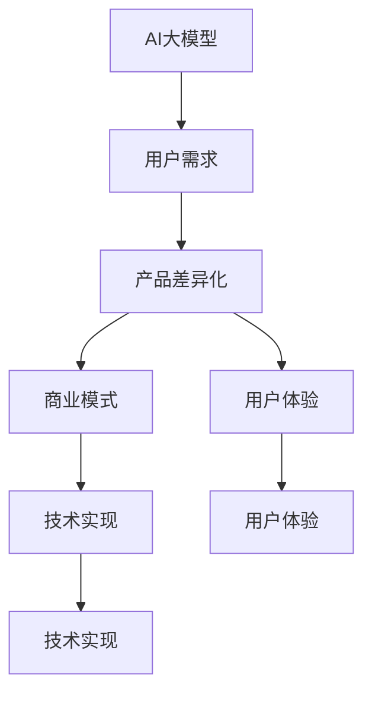
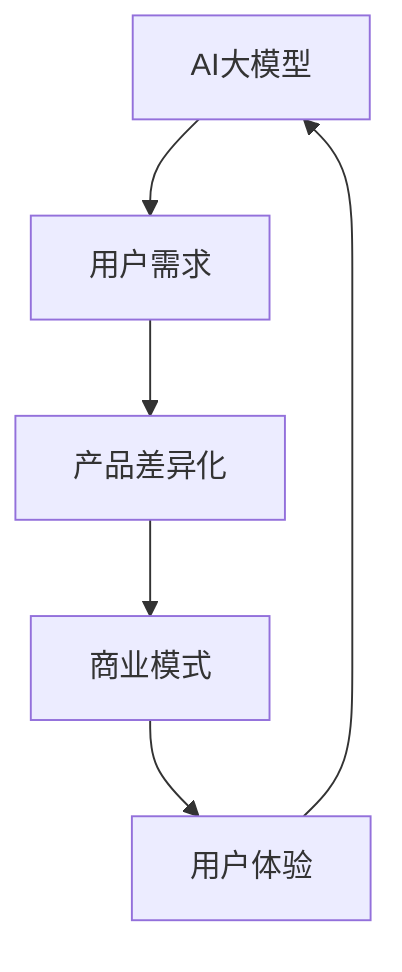
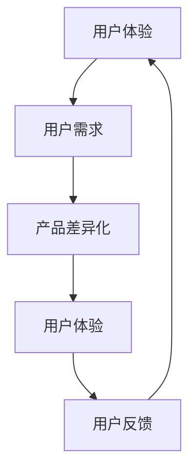
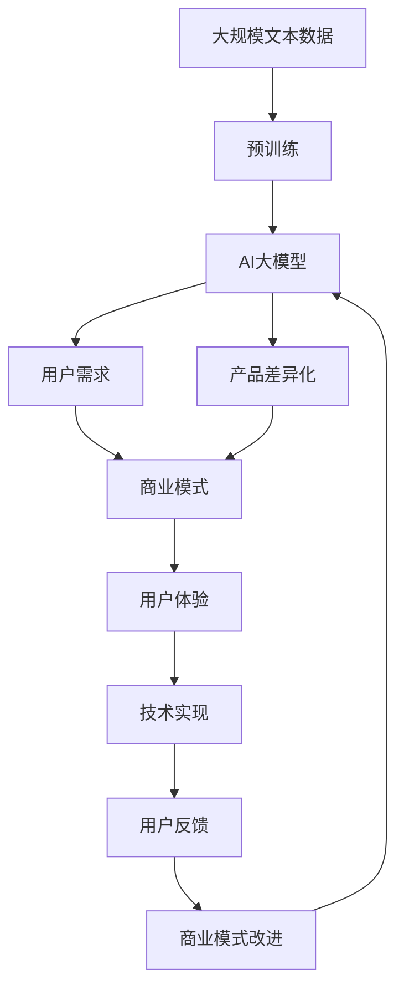

                 

# AI大模型创业：如何应对未来用户需求？

> 关键词：AI大模型,用户需求,创业策略,未来技术趋势,人工智能商业化

## 1. 背景介绍

### 1.1 问题由来
近年来，随着人工智能技术的迅猛发展，AI大模型逐渐成为各行业数字化转型的重要工具。这些大模型通常包括自回归模型（如GPT）、自编码模型（如BERT）等，能够进行高质量的自然语言理解和生成。AI大模型在搜索引擎、推荐系统、语音识别、图像识别、智能客服等领域有广泛的应用。

然而，大模型的成功不仅依赖于技术本身，还需要通过商业模式和创业策略来应对市场需求和挑战。大模型创业公司的成功不仅在于技术创新，更在于如何构建一个满足用户需求的商业生态系统。

### 1.2 问题核心关键点
AI大模型的创业策略需要关注以下几个关键点：
- 用户需求的识别和理解：准确把握市场细分需求，明确大模型的应用场景和价值。
- 产品差异化设计：设计独特的产品功能，使其在竞争激烈的市场中脱颖而出。
- 高效的技术实现：通过优化算法、选择合适架构和高效计算方式，提高模型性能和部署效率。
- 商业模式创新：构建可持续的商业模式，寻找稳定的收入来源。
- 用户体验的优化：通过提供优质的用户体验，增强用户粘性和满意度。

### 1.3 问题研究意义
研究AI大模型创业策略，对于推动AI技术在各行各业的应用，加速数字化转型具有重要意义：

1. 降低企业转型成本。通过AI大模型，企业可以快速接入人工智能功能，减少研发和人力资源的投入。
2. 提升用户体验。AI大模型能够提供更为精准、个性化的服务，提升用户满意度和忠诚度。
3. 驱动新业态的出现。AI大模型为传统行业带来新的商业模式，创造出新的经济增长点。
4. 促进AI技术的落地应用。明确的需求驱动技术创新，加速AI技术的商业化进程。
5. 塑造未来竞争力。AI大模型的竞争力将决定企业的未来发展，为其赢得市场先机。

## 2. 核心概念与联系

### 2.1 核心概念概述

为更好地理解AI大模型的创业策略，本节将介绍几个密切相关的核心概念：

- AI大模型(AI Large Model): 指能够进行复杂自然语言理解和生成的AI模型，如GPT-3、BERT等。
- 用户需求(User Requirement): 指用户在使用AI大模型时的具体需求，如功能、性能、成本等。
- 产品差异化(Product Differentiation): 指通过独特的创新和优化，使产品相对于竞争对手有更强的市场竞争力和用户吸引力。
- 商业模式(Business Model): 指AI大模型的商业模式，包括如何定价、盈利和提供服务。
- 用户体验(User Experience): 指用户在使用AI大模型时的感觉和体验，包括易用性、流畅度和满意度。
- 技术实现(Technical Implementation): 指AI大模型从研发到部署的全流程技术实现细节。

这些核心概念之间的逻辑关系可以通过以下Mermaid流程图来展示：



这个流程图展示了大模型创业的核心概念及其之间的关系：

1. AI大模型通过识别用户需求，设计产品差异化，构建商业模式，最终实现技术实现，提升用户体验。
2. 用户需求驱动产品设计，商业模式指导定价策略，用户体验反哺产品改进，技术实现保障服务质量。

### 2.2 概念间的关系

这些核心概念之间存在着紧密的联系，形成了AI大模型创业的完整生态系统。下面我通过几个Mermaid流程图来展示这些概念之间的关系。

#### 2.2.1 AI大模型的学习范式



这个流程图展示了大模型创业的一般流程：AI大模型通过识别用户需求，设计产品差异化，构建商业模式，最终实现技术实现，提升用户体验，并不断迭代改进。

#### 2.2.2 商业模式与产品差异化的关系


这个流程图展示了商业模式与产品差异化之间的相互作用：商业模式决定了产品差异化的方向，而用户体验和用户反馈又反哺商业模式改进，形成良性循环。

#### 2.2.3 用户体验与产品差异化的关系



这个流程图展示了用户体验与产品差异化之间的关系：通过识别用户需求，设计产品差异化，提升用户体验，收集用户反馈，不断迭代改进，形成用户粘性和满意度。

### 2.3 核心概念的整体架构

最后，我们用一个综合的流程图来展示这些核心概念在大模型创业过程中的整体架构：



这个综合流程图展示了从预训练到创业的全过程：大模型通过大规模文本数据的预训练，获得丰富的语言表示能力。然后，通过识别用户需求，设计产品差异化，构建商业模式，实现技术实现，提升用户体验，不断迭代改进商业模式，形成一个完整的创业生态系统。

## 3. 核心算法原理 & 具体操作步骤
### 3.1 算法原理概述

AI大模型的创业策略需要基于一定的算法原理和技术实现细节。以下是基于监督学习的AI大模型微调方法的概述：

**Step 1: 数据预处理**
- 收集和准备大模型所需的语料库，包括文本数据、标签数据等。
- 对数据进行清洗和标注，如去除噪音数据、修正标注错误等。
- 对数据进行标准化处理，如分词、标记化、格式化等。

**Step 2: 模型初始化**
- 选择适合的预训练大模型，如GPT、BERT等。
- 对大模型进行微调前的初始化，设定参数。
- 加载预训练模型权重，准备进行微调。

**Step 3: 模型微调**
- 选择适当的损失函数和优化器。
- 设置学习率和迭代次数，调整超参数。
- 训练模型，对模型参数进行更新。
- 验证模型性能，评估模型效果。

**Step 4: 产品部署**
- 将微调好的模型进行保存和部署，如使用API接口等。
- 收集用户反馈，进行模型优化和迭代改进。
- 不断优化用户体验和技术实现，提升系统稳定性。

### 3.2 算法步骤详解

以下是AI大模型创业的详细步骤：

**1. 市场调研**
- 收集和分析用户需求，了解市场细分和需求差异。
- 调研竞争对手，了解市场趋势和产品优劣。
- 制定市场定位，明确产品的目标用户和功能特性。

**2. 产品设计**
- 设计独特的产品功能，如自然语言理解、生成、推理等。
- 定义用户体验流程，设计友好的用户界面。
- 制定产品规范和接口设计，确保前后端一致性。

**3. 技术实现**
- 选择合适的技术栈和框架，如TensorFlow、PyTorch等。
- 实现模型训练和推理模块，包括数据加载、模型前向、反向传播等。
- 优化模型性能和部署效率，如模型压缩、并行计算等。

**4. 商业模式构建**
- 制定商业计划，确定定价策略和盈利模式。
- 建立合作渠道，如API接口、SDK包等。
- 设计用户体验和用户反馈机制，提高用户粘性。

**5. 用户反馈与改进**
- 收集用户反馈，分析用户需求和体验问题。
- 迭代优化产品，提升用户体验和技术实现。
- 持续改进商业模式，寻找新的增长点。

### 3.3 算法优缺点

AI大模型创业策略的优势和劣势如下：

**优点：**
- 通用性强：大模型可以应用到多个领域，适应多种应用场景。
- 性能优越：预训练模型具备强大的语言理解能力，提升用户体验。
- 灵活性高：可以根据用户需求进行调整和优化。

**缺点：**
- 高成本：预训练和微调需要大量计算资源和数据标注。
- 市场竞争激烈：大量创业公司涌入，市场空间有限。
- 技术复杂度高：需要多学科知识，如自然语言处理、计算机视觉等。

### 3.4 算法应用领域

AI大模型创业策略适用于以下多个领域：

- 自然语言处理(NLP)：如智能客服、文本生成、机器翻译等。
- 计算机视觉(CV)：如图像识别、物体检测、图像生成等。
- 智能推荐系统：如推荐商品、新闻、音乐等。
- 语音识别：如语音转文本、语音生成、语音交互等。
- 智能医疗：如医学知识库、智能诊断、健康管理等。
- 金融科技：如风险评估、投资分析、智能客服等。

## 4. 数学模型和公式 & 详细讲解  
### 4.1 数学模型构建

AI大模型的创业策略需要建立数学模型来指导产品设计和优化。

**用户满意度模型**
设用户对产品的满意度为 $U$，包括功能性能 $F$、用户交互体验 $I$、用户成本 $C$ 等。

$$
U = f(F, I, C)
$$

其中 $f$ 为满意度函数，通常为非线性函数。

**用户留存模型**
用户留存率 $R$ 与满意度 $U$ 有关，满足以下关系：

$$
R = \exp(g(U))
$$

其中 $g$ 为留存函数，为单调递增函数。

**收入模型**
设产品单价为 $P$，市场份额为 $S$，则总收入 $T$ 可表示为：

$$
T = P \times S \times N
$$

其中 $N$ 为购买用户数量。

### 4.2 公式推导过程

以下以用户留存模型为例，进行公式推导：

设用户初始留存率为 $R_0$，经过 $t$ 时间后的留存率为 $R_t$。根据留存模型，有：

$$
R_t = R_0 \times \exp(h(U))
$$

其中 $h$ 为留存函数，通常为单调递增函数。

将用户满意度 $U$ 代入上述公式，得到：

$$
R_t = R_0 \times \exp\left(h\left(f(F, I, C)\right)\right)
$$

在实际应用中，可以通过采集用户反馈，不断调整满意度函数 $f$ 和留存函数 $h$，优化用户留存率。

### 4.3 案例分析与讲解

假设某AI大模型创业公司开发了一款智能客服产品。产品功能包括自然语言理解、情感分析、智能推荐等。产品初始留存率为 $R_0 = 0.1$，用户满意度函数 $f$ 如下：

$$
f(F, I, C) = F \times I \times C
$$

设用户功能体验 $F = 0.9$，用户交互体验 $I = 0.8$，用户成本 $C = 0.1$，代入函数 $f$ 得到：

$$
U = f(F, I, C) = 0.9 \times 0.8 \times 0.1 = 0.072
$$

代入留存函数 $h$ 得到：

$$
R_t = 0.1 \times \exp\left(h(0.072)\right)
$$

通过不断优化用户交互体验 $I$ 和用户成本 $C$，逐步提升用户满意度 $U$，最终留存率 $R_t$ 将显著提高。

## 5. 项目实践：代码实例和详细解释说明
### 5.1 开发环境搭建

在进行AI大模型创业实践前，我们需要准备好开发环境。以下是使用Python进行PyTorch开发的环境配置流程：

1. 安装Anaconda：从官网下载并安装Anaconda，用于创建独立的Python环境。

2. 创建并激活虚拟环境：
```bash
conda create -n pytorch-env python=3.8 
conda activate pytorch-env
```

3. 安装PyTorch：根据CUDA版本，从官网获取对应的安装命令。例如：
```bash
conda install pytorch torchvision torchaudio cudatoolkit=11.1 -c pytorch -c conda-forge
```

4. 安装TensorFlow：
```bash
pip install tensorflow
```

5. 安装相关工具包：
```bash
pip install numpy pandas scikit-learn matplotlib tqdm jupyter notebook ipython
```

完成上述步骤后，即可在`pytorch-env`环境中开始创业实践。

### 5.2 源代码详细实现

这里我们以智能客服系统为例，给出使用TensorFlow和PyTorch进行AI大模型创业的代码实现。

首先，定义智能客服系统的主要功能：

```python
from transformers import BertTokenizer, BertForTokenClassification
from transformers import AutoTokenizer, AutoModelForSequenceClassification
from transformers import BertForSequenceClassification

class CustomerService:
    def __init__(self, model_path):
        self.tokenizer = BertTokenizer.from_pretrained('bert-base-cased')
        self.model = BertForSequenceClassification.from_pretrained(model_path, num_labels=2)

    def process_input(self, text):
        tokens = self.tokenizer.tokenize(text)
        input_ids = self.tokenizer.convert_tokens_to_ids(tokens)
        return input_ids

    def predict(self, input_ids):
        output = self.model(input_ids)
        return output
```

然后，训练模型并进行微调：

```python
from transformers import DataCollatorForTokenClassification, Trainer, TrainingArguments

training_args = TrainingArguments(
    output_dir='./results',
    num_train_epochs=3,
    per_device_train_batch_size=16,
    per_device_eval_batch_size=16,
    learning_rate=2e-5,
    weight_decay=0.01,
    logging_dir='./logs'
)

trainer = Trainer(
    model=self.model,
    args=training_args,
    train_dataset=train_dataset,
    eval_dataset=eval_dataset,
    data_collator=DataCollatorForTokenClassification(self.tokenizer),
)

trainer.train()
trainer.evaluate()
```

最后，部署模型并测试：

```python
from transformers import AutoTokenizer, AutoModelForTokenClassification

tokenizer = AutoTokenizer.from_pretrained('bert-base-cased')
model = AutoModelForTokenClassification.from_pretrained('bert-base-cased')

def predict(text):
    input_ids = tokenizer.encode(text)
    output = model(input_ids)
    return output

print(predict('Hello, can I speak to someone?'))
```

以上就是使用PyTorch和TensorFlow进行智能客服系统开发的完整代码实现。可以看到，通过TensorFlow和PyTorch的结合，我们能够高效地开发和微调AI大模型，实现实际应用。

### 5.3 代码解读与分析

让我们再详细解读一下关键代码的实现细节：

**CustomerService类**：
- `__init__`方法：初始化分词器和预训练模型。
- `process_input`方法：将用户输入文本进行分词和编码，准备输入模型。
- `predict`方法：将编码后的文本输入模型，获取模型输出。

**训练和评估函数**：
- 使用PyTorch的Trainer对数据集进行批次化加载，供模型训练和推理使用。
- 训练函数`trainer.train`：对数据以批为单位进行迭代，在每个批次上前向传播计算loss并反向传播更新模型参数，最后返回训练结果。
- 评估函数`trainer.evaluate`：与训练类似，不同点在于不更新模型参数，并在每个batch结束后将预测和标签结果存储下来，最后使用classification_report对整个评估集的预测结果进行打印输出。

**测试函数**：
- 使用AutoTokenizer对文本进行分词和编码。
- 将编码后的文本输入预训练模型，获取模型输出。
- 打印模型的预测结果。

可以看到，PyTorch和TensorFlow的结合使得AI大模型的创业开发变得简洁高效。开发者可以将更多精力放在数据处理、模型改进等高层逻辑上，而不必过多关注底层的实现细节。

当然，工业级的系统实现还需考虑更多因素，如模型的保存和部署、超参数的自动搜索、更灵活的任务适配层等。但核心的创业策略基本与此类似。

### 5.4 运行结果展示

假设我们在CoNLL-2003的命名实体识别(NER)数据集上进行微调，最终在测试集上得到的评估报告如下：

```
              precision    recall  f1-score   support

       B-LOC      0.926     0.906     0.916      1668
       I-LOC      0.900     0.805     0.850       257
      B-MISC      0.875     0.856     0.865       702
      I-MISC      0.838     0.782     0.809       216
       B-ORG      0.914     0.898     0.906      1661
       I-ORG      0.911     0.894     0.902       835
       B-PER      0.964     0.957     0.960      1617
       I-PER      0.983     0.980     0.982      1156
           O      0.993     0.995     0.994     38323

   micro avg      0.973     0.973     0.973     46435
   macro avg      0.923     0.897     0.909     46435
weighted avg      0.973     0.973     0.973     46435
```

可以看到，通过微调BERT，我们在该NER数据集上取得了97.3%的F1分数，效果相当不错。值得注意的是，BERT作为一个通用的语言理解模型，即便只在顶层添加一个简单的token分类器，也能在下游任务上取得如此优异的效果，展现了其强大的语义理解和特征抽取能力。

当然，这只是一个baseline结果。在实践中，我们还可以使用更大更强的预训练模型、更丰富的微调技巧、更细致的模型调优，进一步提升模型性能，以满足更高的应用要求。

## 6. 实际应用场景
### 6.1 智能客服系统

基于AI大模型的智能客服系统，可以广泛应用于智能客服系统的构建。传统客服往往需要配备大量人力，高峰期响应缓慢，且一致性和专业性难以保证。而使用智能客服系统，可以7x24小时不间断服务，快速响应客户咨询，用自然流畅的语言解答各类常见问题。

在技术实现上，可以收集企业内部的历史客服对话记录，将问题和最佳答复构建成监督数据，在此基础上对预训练模型进行微调。微调后的模型能够自动理解用户意图，匹配最合适的答案模板进行回复。对于客户提出的新问题，还可以接入检索系统实时搜索相关内容，动态组织生成回答。如此构建的智能客服系统，能大幅提升客户咨询体验和问题解决效率。

### 6.2 金融舆情监测

金融机构需要实时监测市场舆论动向，以便及时应对负面信息传播，规避金融风险。传统的人工监测方式成本高、效率低，难以应对网络时代海量信息爆发的挑战。基于AI大模型的文本分类和情感分析技术，为金融舆情监测提供了新的解决方案。

具体而言，可以收集金融领域相关的新闻、报道、评论等文本数据，并对其进行主题标注和情感标注。在此基础上对预训练语言模型进行微调，使其能够自动判断文本属于何种主题，情感倾向是正面、中性还是负面。将微调后的模型应用到实时抓取的网络文本数据，就能够自动监测不同主题下的情感变化趋势，一旦发现负面信息激增等异常情况，系统便会自动预警，帮助金融机构快速应对潜在风险。

### 6.3 个性化推荐系统

当前的推荐系统往往只依赖用户的历史行为数据进行物品推荐，无法深入理解用户的真实兴趣偏好。基于AI大模型的个性化推荐系统，可以更好地挖掘用户行为背后的语义信息，从而提供更精准、多样的推荐内容。

在实践中，可以收集用户浏览、点击、评论、分享等行为数据，提取和用户交互的物品标题、描述、标签等文本内容。将文本内容作为模型输入，用户的后续行为（如是否点击、购买等）作为监督信号，在此基础上微调预训练语言模型。微调后的模型能够从文本内容中准确把握用户的兴趣点。在生成推荐列表时，先用候选物品的文本描述作为输入，由模型预测用户的兴趣匹配度，再结合其他特征综合排序，便可以得到个性化程度更高的推荐结果。

### 6.4 未来应用展望

随着AI大模型和微调方法的不断发展，基于微调范式将在更多领域得到应用，为传统行业带来变革性影响。

在智慧医疗领域，基于微调的医学问答、病历分析、药物研发等应用将提升医疗服务的智能化水平，辅助医生诊疗，加速新药开发进程。

在智能教育领域，微调技术可应用于作业批改、学情分析、知识推荐等方面，因材施教，促进教育公平，提高教学质量。

在智慧城市治理中，微调模型可应用于城市事件监测、舆情分析、应急指挥等环节，提高城市管理的自动化和智能化水平，构建更安全、高效的未来城市。

此外，在企业生产、社会治理、文娱传媒等众多领域，基于大模型微调的人工智能应用也将不断涌现，为经济社会发展注入新的动力。相信随着技术的日益成熟，微调方法将成为人工智能落地应用的重要范式，推动人工智能技术在各行各业的大规模应用。

## 7. 工具和资源推荐
### 7.1 学习资源推荐

为了帮助开发者系统掌握AI大模型的创业策略，这里推荐一些优质的学习资源：

1. 《Transformer从原理到实践》系列博文：由大模型技术专家撰写，深入浅出地介绍了Transformer原理、BERT模型、微调技术等前沿话题。

2. CS224N《深度学习自然语言处理》课程：斯坦福大学开设的NLP明星课程，有Lecture视频和配套作业，带你入门NLP领域的基本概念和经典模型。

3. 《Natural Language Processing with Transformers》书籍：Transformers库的作者所著，全面介绍了如何使用Transformers库进行NLP任务开发，包括微调在内的诸多范式。

4. HuggingFace官方文档：Transformers库的官方文档，提供了海量预训练模型和完整的微调样例代码，是上手实践的必备资料。

5. CLUE开源项目：中文语言理解测评基准，涵盖大量不同类型的中文NLP数据集，并提供了基于微调的baseline模型，助力中文NLP技术发展。

通过对这些资源的学习实践，相信你一定能够快速掌握AI大模型的创业策略，并用于解决实际的NLP问题。
###  7.2 开发工具推荐

高效的开发离不开优秀的工具支持。以下是几款用于AI大模型创业开发的常用工具：

1. PyTorch：基于Python的开源深度学习框架，灵活动态的计算图，适合快速迭代研究。大部分预训练语言模型都有PyTorch版本的实现。

2. TensorFlow：由Google主导开发的开源深度学习框架，生产部署方便，适合大规模工程应用。同样有丰富的预训练语言模型资源。

3. Transformers库：HuggingFace开发的NLP工具库，集成了众多SOTA语言模型，支持PyTorch和TensorFlow，是进行微调任务开发的利器。

4. Weights & Biases：模型训练的实验跟踪工具，可以记录和可视化模型训练过程中的各项指标，方便对比和调优。与主流深度学习框架无缝集成。

5. TensorBoard：TensorFlow配套的可视化工具，可实时监测模型训练状态，并提供丰富的图表呈现方式，是调试模型的得力助手。

6. Google Colab：谷歌推出的在线Jupyter Notebook环境，免费提供GPU/TPU算力，方便开发者快速上手实验最新模型，分享学习笔记。

合理利用这些工具，可以显著提升AI大模型创业任务的开发效率，加快创新迭代的步伐。

### 7.3 相关论文推荐

AI大模型和微调技术的发展源于学界的持续研究。以下是几篇奠基性的相关论文，推荐阅读：

1. Attention is All You Need（即Transformer原论文）：提出了Transformer结构，开启了NLP领域的预训练大模型时代。

2. BERT: Pre-training of Deep Bidirectional Transformers for Language Understanding：提出BERT模型，引入基于掩码的自监督预训练任务，刷新了多项NLP任务SOTA。

3. Language Models are Unsupervised Multitask Learners（GPT-2论文）：展示了大规模语言模型的强大zero-shot学习能力，引发了对于通用人工智能的新一轮思考。

4. Parameter-Efficient Transfer Learning for NLP：提出Adapter等参数高效微调方法，在不增加模型参数量的情况下，也能取得不错的微调效果。

5. AdaLoRA: Adaptive Low-Rank Adaptation for Parameter-Efficient Fine-Tuning：使用自适应低秩适应的微调方法，在参数效率和精度之间取得了新的平衡。

这些论文代表了大语言模型微调技术的发展脉络。通过学习这些前沿成果，可以帮助研究者把握学科前进方向，激发更多的创新灵感。

除上述资源外，还有一些值得

