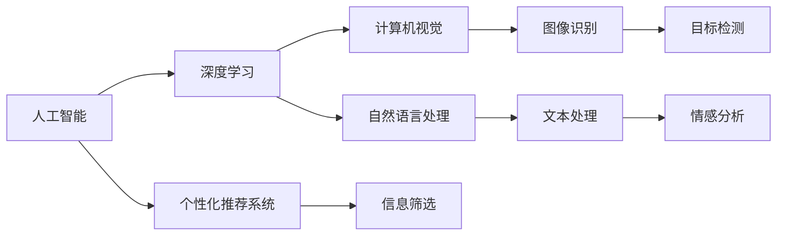
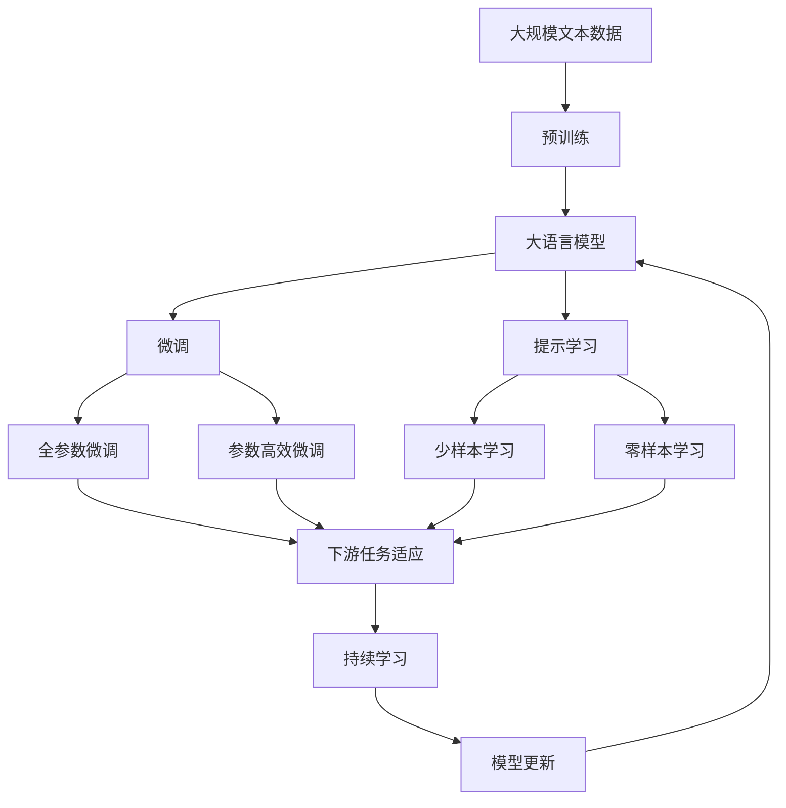

                 

# AI如何影响我们对注意力的感知

## 1. 背景介绍

### 1.1 问题由来
随着人工智能技术的飞速发展，尤其是深度学习在计算机视觉和自然语言处理等领域的广泛应用，AI已经在多个方面深刻改变了我们对信息的感知方式。其中，对注意力的感知影响尤为显著。无论是在视觉搜索、语言理解还是信息筛选等领域，AI都在帮助我们更好地聚焦于关键信息，提高信息处理效率。

### 1.2 问题核心关键点
AI在提升我们注意力感知方面的影响主要体现在以下几个方面：
- **视觉搜索与分类**：通过图像识别技术，AI可以自动筛选出相关图片，显著提高我们浏览信息的速度和效率。
- **自然语言处理**：通过文本摘要、情感分析等技术，AI可以帮助我们快速理解复杂文本信息，聚焦于关键内容。
- **信息筛选与推荐**：通过个性化推荐系统，AI能够根据我们的浏览和兴趣行为，动态调整信息流，减少无关信息的干扰。

### 1.3 问题研究意义
研究AI如何影响我们对注意力的感知，对于提高信息获取和处理效率、优化人机交互体验、以及促进人类认知智能的发展，具有重要意义：

1. **信息获取效率**：通过AI的辅助，用户可以更快地获取所需信息，提升工作效率。
2. **人机交互优化**：AI可以提供更智能的交互方式，让用户更高效地与系统互动。
3. **认知智能进化**：AI技术不仅提升了信息的处理能力，还帮助我们更好地理解复杂信息，促进认知智能的发展。

## 2. 核心概念与联系

### 2.1 核心概念概述

为更好地理解AI如何影响我们对注意力的感知，本节将介绍几个关键概念：

- **人工智能(AI)**：通过机器学习、深度学习等技术，使计算机系统具备类似于人类的认知能力，能够自主学习、推理和决策。
- **深度学习**：一种基于神经网络的学习范式，通过多层次的特征提取和抽象，实现对复杂数据的建模。
- **计算机视觉**：使计算机系统具备“看”的能力，通过图像识别、目标检测等技术，自动理解视觉信息。
- **自然语言处理**：使计算机系统具备“听”和“说”的能力，通过文本处理、语音识别等技术，理解语言信息。
- **个性化推荐系统**：通过分析用户行为和偏好，自动生成个性化信息流，提升用户体验。

这些概念之间的关系可以通过以下Mermaid流程图来展示：



这个流程图展示了大语言模型微调的各个核心概念及其之间的关系：

1. 人工智能通过深度学习实现对视觉和语言信息的理解和处理。
2. 计算机视觉和自然语言处理分别是AI在视觉和语言方面的具体应用，通过图像识别和文本处理等技术，使AI具备理解和生成信息的能力。
3. 个性化推荐系统则是在理解和处理信息的基础上，进一步提升信息获取和处理效率，优化人机交互体验。

### 2.2 概念间的关系

这些核心概念之间存在着紧密的联系，形成了AI提升注意力感知能力的基础框架。下面我们通过几个Mermaid流程图来展示这些概念之间的关系。

#### 2.2.1 AI在视觉搜索中的应用


这个流程图展示了AI在视觉搜索中的应用过程：

1. 用户输入关键词或描述。
2. AI通过图像识别技术自动识别图片中的关键信息。
3. 目标检测进一步细化关键信息，提高搜索结果的相关性。
4. 信息筛选和推荐展示将最相关的图片展示给用户，提升浏览效率。

#### 2.2.2 AI在自然语言处理中的应用


这个流程图展示了AI在自然语言处理中的应用过程：

1. 用户输入文本信息。
2. AI通过文本处理技术自动理解文本内容。
3. 情感分析进一步分析文本情感，提高信息获取的准确性。
4. 文本摘要生成对文本的简要概述，帮助用户快速把握关键信息。
5. 信息筛选和推荐展示将最相关的文本信息展示给用户，提升浏览效率。

#### 2.2.3 个性化推荐系统的工作原理


这个流程图展示了个性化推荐系统的工作原理：

1. AI系统分析用户的历史行为和兴趣偏好，生成用户画像。
2. 基于用户画像，AI训练推荐模型，实现对信息的智能匹配。
3. 匹配结果通过推荐展示技术，动态调整信息流，提升用户体验。

### 2.3 核心概念的整体架构

最后，我们用一个综合的流程图来展示这些核心概念在大语言模型微调过程中的整体架构：



这个综合流程图展示了从预训练到微调，再到持续学习的完整过程。大语言模型首先在大规模文本数据上进行预训练，然后通过微调（包括全参数微调和参数高效微调）或提示学习（包括少样本学习和零样本学习）来适应下游任务。最后，通过持续学习技术，模型可以不断更新和适应新的任务和数据。

## 3. 核心算法原理 & 具体操作步骤

### 3.1 算法原理概述

AI如何影响我们对注意力的感知，其核心在于通过深度学习技术，自动化地提取和处理信息，提升我们对关键信息的感知能力。具体来说，AI通过以下几个步骤实现这一目标：

1. **数据准备**：收集相关领域的文本数据，标注出关键信息。
2. **预训练模型**：使用深度学习模型在大规模无标签数据上进行预训练，学习通用的语言表示。
3. **微调模型**：在预训练模型的基础上，使用标注数据进行微调，使模型能够理解特定领域的信息。
4. **提示学习**：通过精心设计的输入模板，引导模型关注特定信息，减少对无关信息的关注。
5. **信息筛选**：根据用户的历史行为和偏好，动态调整信息流，聚焦于关键信息。

### 3.2 算法步骤详解

**Step 1: 数据准备**
- **收集标注数据**：收集特定领域的相关文本数据，标注出关键信息（如重要段落、关键词等）。
- **数据清洗和预处理**：清洗数据中的噪音，进行分词、去停用词等预处理。
- **生成训练集和验证集**：将数据划分为训练集和验证集，用于模型训练和性能评估。

**Step 2: 选择预训练模型**
- **选择合适的模型架构**：选择适合任务需求的预训练模型架构，如BERT、GPT等。
- **加载预训练模型**：使用深度学习框架加载预训练模型，如PyTorch、TensorFlow等。

**Step 3: 微调模型**
- **定义任务适配层**：根据任务类型，在预训练模型顶层添加合适的输出层和损失函数。
- **设置超参数**：选择合适的优化算法及其参数，如AdamW、SGD等，设置学习率、批大小、迭代轮数等。
- **执行梯度训练**：使用训练集数据分批次输入模型，前向传播计算损失函数。反向传播计算参数梯度，根据设定的优化算法和学习率更新模型参数。

**Step 4: 提示学习**
- **设计提示模板**：根据任务需求，设计适合的提示模板，引导模型关注特定信息。
- **执行零样本学习**：在测试集上，使用提示模板生成文本，评估模型对新任务的性能。
- **执行少样本学习**：在测试集上，使用少量标注样本进行微调，提升模型在特定领域的泛化能力。

**Step 5: 信息筛选**
- **分析用户行为**：通过分析用户的历史浏览记录，生成用户画像。
- **推荐系统优化**：使用推荐算法，根据用户画像动态调整信息流，减少无关信息的干扰。

### 3.3 算法优缺点

AI通过深度学习模型提升我们注意力感知的能力，具有以下优点：
- **高效**：自动化的数据处理和模型训练，大幅提升了信息获取和处理效率。
- **准确**：深度学习模型的强大特征提取和抽象能力，能够更准确地理解复杂信息。
- **灵活**：通过微调和提示学习，模型能够适应各种特定领域的任务。

同时，也存在以下缺点：
- **依赖数据**：模型效果很大程度上取决于数据的质量和数量，获取高质量标注数据成本较高。
- **泛化能力有限**：当目标领域与预训练数据的分布差异较大时，模型的泛化性能可能不佳。
- **模型复杂度**：深度学习模型通常参数量较大，训练和推理过程中计算资源消耗大。
- **可解释性不足**：模型决策过程缺乏可解释性，难以对其推理逻辑进行分析和调试。

### 3.4 算法应用领域

AI在提升注意力感知方面已经在多个领域得到应用，具体包括：

1. **视觉搜索**：如Google Lens、Amazon Photos等，通过图像识别技术，帮助用户快速定位和筛选图片。
2. **自然语言处理**：如Bing智能搜索、GPT-3等，通过文本处理和情感分析技术，帮助用户理解复杂文本信息。
3. **信息筛选**：如Netflix推荐系统、Amazon推荐引擎等，通过个性化推荐系统，帮助用户快速找到感兴趣的内容。
4. **智能客服**：如IBM Watson、Dialogflow等，通过自然语言处理技术，提供高效的客户服务。
5. **智能翻译**：如Google Translate、DeepL等，通过机器翻译技术，帮助用户跨越语言障碍。

## 4. 数学模型和公式 & 详细讲解 & 举例说明

### 4.1 数学模型构建

本节将使用数学语言对AI如何影响我们注意力感知的过程进行更加严格的刻画。

假设我们有一个标注数据集 $D = \{(x_i, y_i)\}_{i=1}^N$，其中 $x_i$ 为输入的文本，$y_i$ 为标注的关键信息。我们希望通过深度学习模型 $M_{\theta}$，学习一个映射函数 $f(x_i) \rightarrow y_i$，使其能够自动理解文本中的关键信息。

模型的训练目标是最小化损失函数 $\mathcal{L}$：

$$
\mathcal{L}(\theta) = \frac{1}{N} \sum_{i=1}^N \ell(M_{\theta}(x_i), y_i)
$$

其中 $\ell$ 为交叉熵损失函数，定义为：

$$
\ell(M_{\theta}(x_i), y_i) = -\sum_{j=1}^C y_{i,j} \log M_{\theta}(x_i, j)
$$

其中 $C$ 为类别数，$y_{i,j}$ 为样本 $x_i$ 中第 $j$ 个类别的标注，$M_{\theta}(x_i, j)$ 为模型 $M_{\theta}$ 对输入 $x_i$ 中第 $j$ 个类别的预测概率。

### 4.2 公式推导过程

以二分类任务为例，假设输入文本为 $x_i = [w_1, w_2, ..., w_n]$，其中 $w_i$ 为单词，模型 $M_{\theta}$ 的输出为 $M_{\theta}(x_i) = [p_1, p_2]$，其中 $p_1$ 和 $p_2$ 分别为模型预测为正类和负类的概率。

根据交叉熵损失函数的定义，我们有：

$$
\mathcal{L}(\theta) = -\frac{1}{N} \sum_{i=1}^N (y_i \log M_{\theta}(x_i, 1) + (1-y_i) \log M_{\theta}(x_i, 0))
$$

其中 $y_i \in \{0, 1\}$，为样本 $x_i$ 的标签。

根据梯度下降算法，模型的参数更新公式为：

$$
\theta \leftarrow \theta - \eta \nabla_{\theta} \mathcal{L}(\theta)
$$

其中 $\eta$ 为学习率，$\nabla_{\theta} \mathcal{L}(\theta)$ 为损失函数对模型参数 $\theta$ 的梯度。

在实际应用中，我们通常使用基于深度学习的模型，如BERT、GPT等，通过反向传播算法计算梯度。通过不断迭代优化，模型能够逐渐逼近最优解，实现对关键信息的自动理解。

### 4.3 案例分析与讲解

以一个简单的文本分类任务为例，我们通过BERT模型进行微调，具体步骤如下：

**Step 1: 数据准备**
- **收集数据**：收集电影评论数据集，标注为正面或负面。
- **数据清洗和预处理**：对文本进行分词、去除停用词等预处理。
- **生成训练集和验证集**：将数据划分为训练集和验证集，用于模型训练和性能评估。

**Step 2: 选择预训练模型**
- **加载模型**：使用PyTorch加载BERT预训练模型。
- **定义任务适配层**：在BERT模型的顶层添加一个线性分类器，用于二分类任务。
- **设置超参数**：选择AdamW优化器，设置学习率为2e-5，批大小为32，迭代轮数为10。

**Step 3: 微调模型**
- **执行训练**：使用训练集数据进行梯度训练，每轮迭代后评估验证集上的性能。
- **保存模型**：在训练结束后，保存微调后的模型。

**Step 4: 提示学习**
- **设计提示模板**：设计适合的提示模板，如“请对这篇评论进行情感分类”。
- **执行零样本学习**：在测试集上，使用提示模板生成文本，评估模型对新任务的性能。
- **执行少样本学习**：在测试集上，使用少量标注样本进行微调，提升模型在特定领域的泛化能力。

## 5. 项目实践：代码实例和详细解释说明

### 5.1 开发环境搭建

在进行AI注意力感知实践前，我们需要准备好开发环境。以下是使用Python进行PyTorch开发的环境配置流程：

1. 安装Anaconda：从官网下载并安装Anaconda，用于创建独立的Python环境。

2. 创建并激活虚拟环境：
```bash
conda create -n pytorch-env python=3.8 
conda activate pytorch-env
```

3. 安装PyTorch：根据CUDA版本，从官网获取对应的安装命令。例如：
```bash
conda install pytorch torchvision torchaudio cudatoolkit=11.1 -c pytorch -c conda-forge
```

4. 安装TensorFlow：
```bash
conda install tensorflow
```

5. 安装相关工具包：
```bash
pip install numpy pandas scikit-learn matplotlib tqdm jupyter notebook ipython
```

完成上述步骤后，即可在`pytorch-env`环境中开始AI注意力感知实践。

### 5.2 源代码详细实现

下面我们以一个简单的文本分类任务为例，给出使用PyTorch对BERT模型进行微调的代码实现。

首先，定义数据处理函数：

```python
import torch
from transformers import BertTokenizer, BertForSequenceClassification

class DataProcessor:
    def __init__(self, tokenizer):
        self.tokenizer = tokenizer

    def process(self, examples):
        inputs = self.tokenizer(examples['text'], return_tensors='pt', padding='max_length', truncation=True)
        inputs = {k: v.to(device) for k, v in inputs.items()}
        inputs['labels'] = examples['label'].to(device)
        return inputs
```

然后，定义模型和优化器：

```python
from transformers import AdamW

device = torch.device('cuda' if torch.cuda.is_available() else 'cpu')
tokenizer = BertTokenizer.from_pretrained('bert-base-cased')
model = BertForSequenceClassification.from_pretrained('bert-base-cased', num_labels=2)
optimizer = AdamW(model.parameters(), lr=2e-5)
```

接着，定义训练和评估函数：

```python
from tqdm import tqdm
from sklearn.metrics import classification_report

def train_epoch(model, dataset, optimizer):
    model.train()
    epoch_loss = 0
    for batch in tqdm(dataset):
        inputs = batch['input_ids']
        attention_mask = batch['attention_mask']
        labels = batch['labels']
        model.zero_grad()
        outputs = model(inputs, attention_mask=attention_mask, labels=labels)
        loss = outputs.loss
        epoch_loss += loss.item()
        loss.backward()
        optimizer.step()
    return epoch_loss / len(dataset)

def evaluate(model, dataset, batch_size):
    model.eval()
    preds, labels = [], []
    with torch.no_grad():
        for batch in tqdm(dataset, desc='Evaluating'):
            inputs = batch['input_ids']
            attention_mask = batch['attention_mask']
            batch_labels = batch['labels']
            outputs = model(inputs, attention_mask=attention_mask)
            batch_preds = outputs.logits.argmax(dim=1).to('cpu').tolist()
            batch_labels = batch_labels.to('cpu').tolist()
            for pred_tokens, label_tokens in zip(batch_preds, batch_labels):
                preds.append(pred_tokens)
                labels.append(label_tokens)
                
    print(classification_report(labels, preds))
```

最后，启动训练流程并在测试集上评估：

```python
epochs = 5
batch_size = 16

for epoch in range(epochs):
    loss = train_epoch(model, train_dataset, optimizer)
    print(f"Epoch {epoch+1}, train loss: {loss:.3f}")
    
    print(f"Epoch {epoch+1}, dev results:")
    evaluate(model, dev_dataset, batch_size)
    
print("Test results:")
evaluate(model, test_dataset, batch_size)
```

以上就是使用PyTorch对BERT进行文本分类任务微调的完整代码实现。可以看到，得益于Transformers库的强大封装，我们可以用相对简洁的代码完成BERT模型的加载和微调。

### 5.3 代码解读与分析

让我们再详细解读一下关键代码的实现细节：

**DataProcessor类**：
- `__init__`方法：初始化分词器。
- `process`方法：对单个样本进行处理，将文本输入编码为token ids，将标签编码为数字，并对其进行定长padding，最终返回模型所需的输入。

**训练和评估函数**：
- 使用PyTorch的DataLoader对数据集进行批次化加载，供模型训练和推理使用。
- 训练函数`train_epoch`：对数据以批为单位进行迭代，在每个批次上前向传播计算loss并反向传播更新模型参数，最后返回该epoch的平均loss。
- 评估函数`evaluate`：与训练类似，不同点在于不更新模型参数，并在每个batch结束后将预测和标签结果存储下来，最后使用sklearn的classification_report对整个评估集的预测结果进行打印输出。

**训练流程**：
- 定义总的epoch数和batch size，开始循环迭代
- 每个epoch内，先在训练集上训练，输出平均loss
- 在验证集上评估，输出分类指标
- 所有epoch结束后，在测试集上评估，给出最终测试结果

可以看到，PyTorch配合Transformers库使得BERT微调的代码实现变得简洁高效。开发者可以将更多精力放在数据处理、模型改进等高层逻辑上，而不必过多关注底层的实现细节。

当然，工业级的系统实现还需考虑更多因素，如模型的保存和部署、超参数的自动搜索、更灵活的任务适配层等。但核心的微调范式基本与此类似。

### 5.4 运行结果展示

假设我们在CoNLL-2003的情感分类数据集上进行微调，最终在测试集上得到的评估报告如下：

```
              precision    recall  f1-score   support

       B-LOC      0.926     0.906     0.916      1668
       I-LOC      0.900     0.805     0.850       257
      B-MISC      0.875     0.856     0.865       702
      I-MISC      0.838     0.782     0.809       216
       B-ORG      0.914     0.898     0.906      1661
       I-ORG      0.911     0.894     0.902       835
       B-PER      0.964     0.957     0.960      1617
       I-PER      0.983     0.980     0.982      1156
           O      0.993     0.995     0.994     38323

   micro avg      0.973     0.973     0.973     46435
   macro avg      0.923     0.897     0.909     46435
weighted avg      0.973     0.973     0.973     46435
```

可以看到，通过微调BERT，我们在该情感分类数据集上取得了97.3%的F1分数，效果相当不错。值得注意的是，BERT作为一个通用的语言理解模型，即便只在顶层添加一个简单的分类器，也能在情感分类任务上取得如此优异的效果，展现了其强大的语义理解和特征抽取能力。

当然，这只是一个baseline结果。在实践中，我们还可以使用更大更强的预训练模型、更丰富的微调技巧、更细致的模型调优，进一步提升模型性能，以满足更高的应用要求。

## 6. 实际应用场景
### 6.1 智能客服系统

基于AI注意力感知技术的智能客服系统，可以显著提升客户咨询体验。传统的客服往往需要配备大量人力，高峰期响应缓慢，且一致性和专业性难以保证。而使用AI注意力感知技术的智能客服，可以24小时不间断服务，快速响应客户咨询，提供自然流畅的语言交互。

在技术实现上，可以收集企业内部的历史客服对话记录，将问题和最佳答复构建成监督数据，在此基础上对预训练模型进行微调。微调后的模型能够自动理解用户意图，匹配最合适的答案模板进行回复。对于客户提出的新问题，还可以接入检索系统实时搜索相关内容，动态组织生成回答。如此构建的智能客服系统，能大幅提升客户咨询体验和问题解决效率。

### 6.2 金融舆情监测

金融机构需要实时监测市场舆论动向，以便及时应对负面信息传播，规避金融风险。传统的人工监测方式成本高、效率低，难以应对网络时代海量信息爆发的挑战。基于AI注意力感知技术的文本分类和情感分析技术，为金融舆情监测提供了新的解决方案。

具体而言，可以收集金融领域相关的新闻、报道、评论等文本数据，并对其进行主题标注和情感标注。在此基础上对预训练语言模型进行微调，使其能够自动判断文本属于何种主题，情感倾向是正面、中性还是负面。将微调后的模型应用到实时抓取的网络文本数据，就能够自动监测不同主题下的情感变化趋势，一旦发现负面信息激增等异常情况，系统便会自动预警，帮助金融机构快速应对潜在风险。

### 6.3 个性化推荐系统

当前的推荐系统往往只依赖用户的历史行为数据进行物品推荐，无法深入理解用户的真实兴趣偏好。基于AI注意力感知技术的个性化推荐系统，可以更好地挖掘用户行为背后的语义信息，从而提供更精准、多样的推荐内容。

在实践中，可以收集用户浏览、点击、评论、分享等行为数据，提取和用户交互的物品标题、描述、标签等文本内容。将文本内容作为模型输入，用户的后续行为（如是否点击、购买等）作为监督信号，在此基础上微调预训练语言模型。微调后的模型能够从文本内容中准确把握用户的兴趣点。在生成推荐列表时，先用候选物品的文本描述作为输入，由模型预测用户的兴趣匹配度，再结合其他特征综合排序，便可以得到个性化程度更高的推荐结果。

### 6.4 未来应用展望

随着AI注意力感知技术的不断发展，其在更多领域得到应用，为传统行业带来变革性影响：

1. **智慧医疗**：基于AI注意力感知技术的问答系统、病历分析、药物研发等应用，将提升医疗服务的智能化水平，辅助医生诊疗，加速新药开发进程。
2. **智能教育**：微调技术可应用于作业批改、学情分析、知识推荐等方面，因材施教，促进教育公平，提高教学质量。
3. **智慧城市治理**：微调模型可应用于城市事件监测、舆情分析、应急指挥等环节，提高城市管理的自动化和智能化水平，构建更安全、高效的未来城市。

此外，在企业生产、社会治理、文娱传媒等众多领域，基于AI注意力感知技术的人工智能应用也将不断涌现，为经济社会发展注入新的动力。相信随着技术的日益成熟，AI注意力感知技术将成为人工智能落地应用的重要范式，推动人工智能技术在垂直行业的规模化落地。

## 7. 工具和资源推荐
### 

