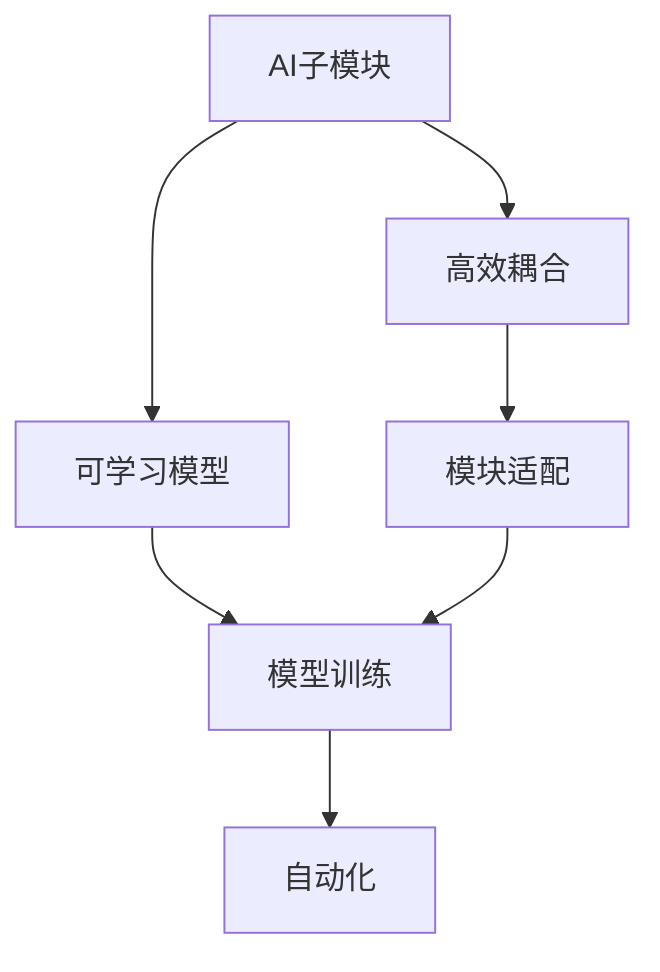
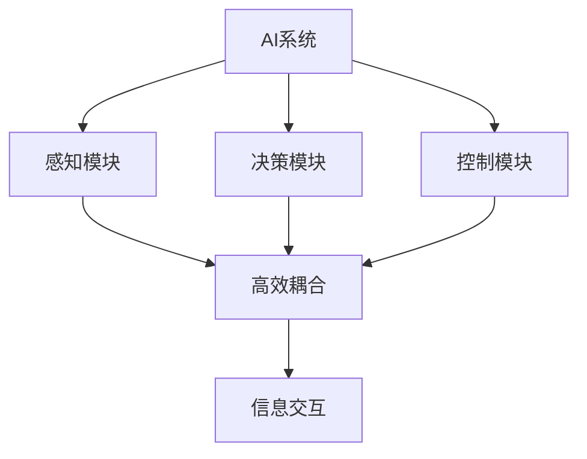
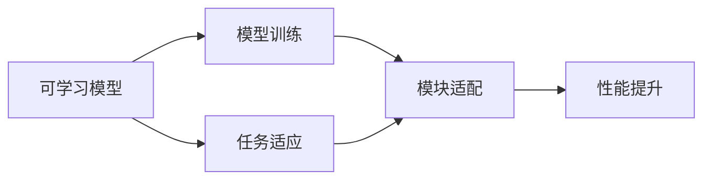
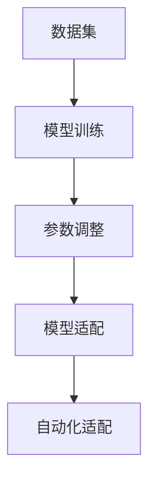
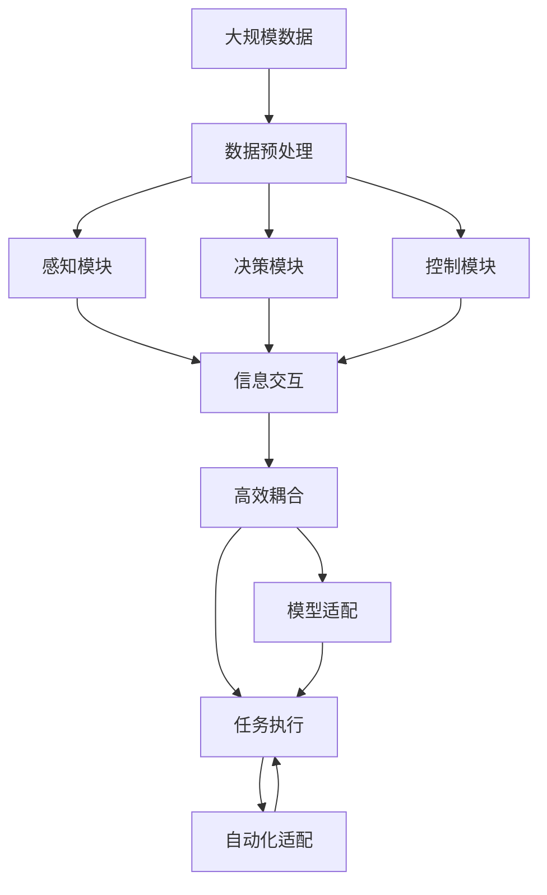

                 

# AI子模块间可学习的高效耦合

> 关键词：AI子模块、高效耦合、可学习、模型适配、自动化

## 1. 背景介绍

### 1.1 问题由来
随着人工智能(AI)技术的不断进步，AI系统越来越复杂，涉及的子模块也越来越多。这些子模块如感知模块、决策模块、控制模块等，各司其职，共同支撑AI系统的整体功能。然而，由于这些子模块的性能往往由特定的硬件和软件环境限定，如何实现模块间的无缝衔接、高效的协同工作，一直是AI领域的一大难题。

本论文聚焦于AI子模块间高效耦合的技术研究，通过引入“可学习”的策略，使子模块间的适配更加灵活，系统整体的性能提升更加显著。这一研究方向不仅有助于提升AI系统的应用效率，还能加速AI技术的产业化进程。

### 1.2 问题核心关键点
本论文的核心思想在于将传统的“固定参数模型”调整为“可学习模型”，使AI子模块间的耦合更加高效，更加适应不同的应用场景。其核心关键点包括：
1. 如何通过“可学习”策略，实现模块间的自动适配。
2. 如何在保持模型性能的同时，减少子模块的内存占用和计算复杂度。
3. 如何构建一种通用的模型适配框架，使其能应用于各种AI系统。
4. 如何通过模型“可学习”的特性，提升AI系统的灵活性和可扩展性。

### 1.3 问题研究意义
研究AI子模块间可学习的高效耦合方法，对于拓展AI系统的应用范围，提升AI系统的性能，加速AI技术的产业化进程，具有重要意义：
1. 降低系统开发成本。通过可学习模型，AI系统可以更灵活地适应各种应用场景，减少从头开发所需的计算和人力等成本投入。
2. 提升系统效果。可学习模型通过自动适配，能够更好地适应特定任务，在应用场景中取得更优表现。
3. 加速开发进度。standing on the shoulders of giants，可学习模型使得开发者可以更快地完成任务适配，缩短开发周期。
4. 带来技术创新。可学习范式促进了对模块间协同工作机制的深入研究，催生了新的研究方向和技术工具。
5. 赋能产业升级。可学习模型使得AI技术更容易被各行各业所采用，为传统行业数字化转型升级提供新的技术路径。

## 2. 核心概念与联系

### 2.1 核心概念概述

为更好地理解AI子模块间可学习的高效耦合方法，本节将介绍几个密切相关的核心概念：

- AI子模块：指AI系统中各司其职的独立功能模块，如感知模块、决策模块、控制模块等。
- 高效耦合：指通过合理的模型架构设计，使AI子模块间的信息传递和协同工作更加高效，提升整体系统性能。
- 可学习模型：指能够通过训练调整模型参数，以适应不同应用场景的AI模型。
- 模块适配：指根据具体应用场景，对AI子模块进行参数调整或重新训练的过程。
- 自动化：指通过算法或工具，自动完成模块适配和高效耦合的过程。

这些核心概念之间的逻辑关系可以通过以下Mermaid流程图来展示：



这个流程图展示了几组核心概念的关系：

1. AI子模块通过高效耦合设计，与可学习模型协作。
2. 可学习模型通过模块适配，适应具体任务。
3. 模块适配过程通过模型训练和自动化完成。

### 2.2 概念间的关系

这些核心概念之间存在着紧密的联系，形成了AI子模块间可学习高效耦合的完整生态系统。下面我们通过几个Mermaid流程图来展示这些概念之间的关系。

#### 2.2.1 AI系统的高效耦合过程



这个流程图展示了一个典型AI系统的高效耦合过程：

1. AI系统由感知模块、决策模块、控制模块等子模块组成。
2. 通过高效耦合设计，这些子模块之间能够高效传递信息，协同工作。
3. 感知模块获取环境信息，决策模块分析信息并制定策略，控制模块执行操作。

#### 2.2.2 可学习模型的适配过程



这个流程图展示了可学习模型的适配过程：

1. 可学习模型通过训练学习到任务相关的知识。
2. 模型适配过程根据具体任务调整模型参数，使其适应当前场景。
3. 适配后的模型性能得到提升，能更好地解决实际问题。

#### 2.2.3 自动化适配技术



这个流程图展示了自动化适配技术的过程：

1. 数据集用于模型训练，学习到模型参数。
2. 根据任务需求调整模型参数。
3. 自动化适配技术通过算法或工具，完成参数调整和模型适配。

### 2.3 核心概念的整体架构

最后，我们用一个综合的流程图来展示这些核心概念在大规模AI系统中的整体架构：



这个综合流程图展示了从数据预处理到任务执行的完整过程。AI系统通过感知模块获取数据，决策模块分析信息，控制模块执行操作，同时子模块间高效耦合，共同完成任务。模型适配过程根据具体任务调整模型参数，自动化适配技术通过算法或工具完成适配过程，最终使AI系统能够灵活适应各种应用场景。

## 3. 核心算法原理 & 具体操作步骤
### 3.1 算法原理概述

AI子模块间可学习的高效耦合方法，本质上是通过“可学习”策略实现模块间的自动适配和高效耦合。其核心算法原理如下：

1. 首先，将AI系统划分为若干子模块，如感知模块、决策模块、控制模块等。
2. 在每个子模块中设计可学习模型，使其能够通过训练调整参数，适应特定任务。
3. 设计一种通用的模块适配框架，使子模块能够根据具体任务进行自动适配。
4. 使用自动化适配技术，完成子模块间的参数调整和高效耦合。

形式化地，假设AI系统由 $N$ 个子模块组成，每个子模块为 $M$ 类任务。对于第 $i$ 个子模块和第 $j$ 类任务，设其适配后的模型为 $M_i^j$，其中 $\theta_i^j$ 为适配后的模型参数。则模块适配的优化目标为：

$$
\theta_i^j = \mathop{\arg\min}_{\theta_i} \mathcal{L}_i^j(\theta_i)
$$

其中 $\mathcal{L}_i^j$ 为第 $i$ 个子模块在任务 $j$ 上的损失函数。在实践中，通常使用基于梯度的优化算法（如SGD、Adam等）来近似求解上述最优化问题。

### 3.2 算法步骤详解

基于可学习模型的AI子模块间高效耦合方法，一般包括以下几个关键步骤：

**Step 1: 准备AI子模块和数据集**
- 设计并实现每个子模块的模型，确保其能够进行可学习训练。
- 收集相关任务的数据集，包括训练集、验证集和测试集。

**Step 2: 设计模块适配框架**
- 根据具体任务需求，设计合适的模块适配策略。例如，采用类似超参数搜索的方法，自动调整模型参数。
- 设计通用的适配框架，支持不同子模块和任务的适配。

**Step 3: 设置适配超参数**
- 选择合适的优化算法及其参数，如 AdamW、SGD 等，设置学习率、批大小、迭代轮数等。
- 设置正则化技术及强度，包括权重衰减、Dropout、Early Stopping 等。
- 确定冻结预训练参数的策略，如仅微调顶层，或全部参数都参与微调。

**Step 4: 执行适配训练**
- 将训练集数据分批次输入子模块，前向传播计算损失函数。
- 反向传播计算参数梯度，根据设定的优化算法和学习率更新模型参数。
- 周期性在验证集上评估子模块性能，根据性能指标决定是否触发 Early Stopping。
- 重复上述步骤直到满足预设的迭代轮数或 Early Stopping 条件。

**Step 5: 测试和部署**
- 在测试集上评估适配后子模块的性能，对比适配前后的精度提升。
- 使用适配后的子模块对新样本进行推理预测，集成到实际的应用系统中。
- 持续收集新的数据，定期重新适配模型，以适应数据分布的变化。

以上是基于可学习模型的AI子模块间高效耦合的一般流程。在实际应用中，还需要针对具体任务的特点，对适配过程的各个环节进行优化设计，如改进训练目标函数，引入更多的正则化技术，搜索最优的超参数组合等，以进一步提升模型性能。

### 3.3 算法优缺点

基于可学习模型的AI子模块间高效耦合方法具有以下优点：
1. 灵活性高。通过可学习模型，子模块能够自动适应不同任务，提高AI系统的灵活性和可扩展性。
2. 性能提升显著。可学习模型通过参数调整，能够更好地适应特定任务，提升系统整体的性能。
3. 成本低。可学习模型利用已有的大规模预训练模型，减少了从头开发所需的计算和人力成本。
4. 易于扩展。模型适配框架支持多种子模块和任务，能够快速实现新模块的加入和适配。

同时，该方法也存在以下局限性：
1. 依赖数据质量。适配过程需要大量高质量的标注数据，数据不足时可能导致过拟合。
2. 计算资源消耗高。可学习模型通常需要较长的训练时间和较大的计算资源，增加了系统部署成本。
3. 可解释性差。适配后的模型难以解释其内部工作机制和决策逻辑，缺乏可解释性。
4. 鲁棒性不足。适应不同任务时，可学习模型可能出现过拟合现象，影响系统的鲁棒性。

尽管存在这些局限性，但就目前而言，基于可学习模型的AI子模块间高效耦合方法仍然是AI系统开发的重要方向。未来相关研究的重点在于如何进一步降低适配对数据和计算资源的依赖，提高模型的可解释性和鲁棒性，同时兼顾成本和性能的平衡。

### 3.4 算法应用领域

基于可学习模型的AI子模块间高效耦合方法已经在多个AI系统领域得到了广泛应用，具体包括：

- 自然语言处理(NLP)：如问答系统、机器翻译、情感分析等。通过适配不同的语言模型，实现高效的自然语言理解和生成。
- 计算机视觉(CV)：如目标检测、图像分割、人脸识别等。通过适配不同的视觉模型，实现高效的图像理解和处理。
- 语音识别(SR)：如语音转文本、语音识别、语音合成等。通过适配不同的语音模型，实现高效的语音交互。
- 机器人控制(RC)：如路径规划、动作控制、任务执行等。通过适配不同的控制模型，实现高效的人机交互。
- 推荐系统(Rec)：如用户推荐、商品推荐、广告推荐等。通过适配不同的推荐模型，实现个性化的推荐服务。

此外，基于可学习模型的AI子模块间高效耦合方法还被创新性地应用到更多场景中，如智能家居、智能制造、智能交通等，为各行各业提供了新的技术解决方案。

## 4. 数学模型和公式 & 详细讲解  
### 4.1 数学模型构建

本节将使用数学语言对AI子模块间可学习高效耦合方法进行更加严格的刻画。

记AI系统由 $N$ 个子模块 $M_i$ 组成，每个子模块可以处理 $M$ 类任务。假设子模块 $M_i$ 在任务 $j$ 上的损失函数为 $\ell_i^j(M_i^j(x_i))$，其中 $x_i$ 为输入数据，$M_i^j$ 为适配后的模型。则总体损失函数为：

$$
\mathcal{L} = \frac{1}{N}\sum_{i=1}^N \sum_{j=1}^M \ell_i^j(M_i^j(x_i))
$$

适配过程的目标是最小化总体损失函数，即找到最优的模型参数：

$$
\theta^* = \mathop{\arg\min}_{\theta} \mathcal{L}
$$

在实践中，我们通常使用基于梯度的优化算法（如SGD、Adam等）来近似求解上述最优化问题。设 $\eta$ 为学习率，$\lambda$ 为正则化系数，则参数的更新公式为：

$$
\theta_i^j \leftarrow \theta_i^j - \eta \nabla_{\theta_i} \mathcal{L}_i^j(\theta_i^j) - \eta\lambda\theta_i^j
$$

其中 $\nabla_{\theta_i} \mathcal{L}_i^j(\theta_i^j)$ 为子模块 $M_i$ 在任务 $j$ 上的梯度，可通过反向传播算法高效计算。

### 4.2 公式推导过程

以下我们以分类任务为例，推导分类损失函数及其梯度的计算公式。

假设子模块 $M_i$ 在任务 $j$ 上的输出为 $\hat{y}_i^j=M_i^j(x_i)$，表示样本属于正类的概率。真实标签 $y_i^j \in \{0,1\}$。则二分类交叉熵损失函数定义为：

$$
\ell_i^j(M_i^j(x_i),y_i^j) = -[y_i^j\log \hat{y}_i^j + (1-y_i^j)\log (1-\hat{y}_i^j)]
$$

将其代入总体损失函数公式，得：

$$
\mathcal{L} = -\frac{1}{N}\sum_{i=1}^N \sum_{j=1}^M [y_i^j\log \hat{y}_i^j+(1-y_i^j)\log(1-\hat{y}_i^j)]
$$

根据链式法则，损失函数对参数 $\theta_i^j$ 的梯度为：

$$
\frac{\partial \mathcal{L}}{\partial \theta_i^j} = -\frac{1}{N}\sum_{i=1}^N \sum_{j=1}^M (\frac{y_i^j}{\hat{y}_i^j}-\frac{1-y_i^j}{1-\hat{y}_i^j}) \frac{\partial \hat{y}_i^j}{\partial \theta_i^j}
$$

其中 $\frac{\partial \hat{y}_i^j}{\partial \theta_i^j}$ 可进一步递归展开，利用自动微分技术完成计算。

在得到损失函数的梯度后，即可带入参数更新公式，完成模型的迭代优化。重复上述过程直至收敛，最终得到适应特定任务的最优模型参数 $\theta^*$。

## 5. 项目实践：代码实例和详细解释说明
### 5.1 开发环境搭建

在进行可学习模型的适配实践前，我们需要准备好开发环境。以下是使用Python进行TensorFlow开发的环境配置流程：

1. 安装Anaconda：从官网下载并安装Anaconda，用于创建独立的Python环境。

2. 创建并激活虚拟环境：
```bash
conda create -n tf-env python=3.8 
conda activate tf-env
```

3. 安装TensorFlow：根据CUDA版本，从官网获取对应的安装命令。例如：
```bash
conda install tensorflow
```

4. 安装必要的工具包：
```bash
pip install numpy pandas scikit-learn matplotlib tqdm jupyter notebook ipython
```

完成上述步骤后，即可在`tf-env`环境中开始适配实践。

### 5.2 源代码详细实现

这里我们以机器人路径规划为例，给出使用TensorFlow对模型进行适配的Python代码实现。

首先，定义路径规划任务的训练数据集：

```python
import tensorflow as tf
from tensorflow.keras import layers
import numpy as np

# 训练数据集
x_train = np.array([...])
y_train = np.array([...])
```

然后，定义模型架构：

```python
# 定义模型架构
input_layer = layers.Input(shape=(10,))
hidden_layer1 = layers.Dense(64, activation='relu')(input_layer)
hidden_layer2 = layers.Dense(32, activation='relu')(hidden_layer1)
output_layer = layers.Dense(1, activation='sigmoid')(hidden_layer2)

model = tf.keras.Model(inputs=input_layer, outputs=output_layer)
```

接着，定义损失函数和优化器：

```python
# 定义损失函数和优化器
model.compile(optimizer=tf.keras.optimizers.Adam(learning_rate=0.001),
              loss=tf.keras.losses.BinaryCrossentropy())
```

最后，启动训练流程：

```python
# 训练模型
model.fit(x_train, y_train, epochs=50, batch_size=32, validation_split=0.2)
```

以上就是使用TensorFlow对路径规划模型进行适配的完整代码实现。可以看到，TensorFlow提供了丰富的API和工具，使得模型适配过程变得简洁高效。

### 5.3 代码解读与分析

让我们再详细解读一下关键代码的实现细节：

**训练数据集定义**：
- 创建训练数据集`x_train`和标签数据集`y_train`，这里以机器人路径规划的标注数据为例。

**模型架构定义**：
- 通过`Input`层定义输入数据的形状。
- 通过`Dense`层定义全连接神经网络，包含两个隐藏层和一个输出层。
- 使用`Model`类将各层进行组合，构建完整的模型架构。

**损失函数和优化器定义**：
- 使用`compile`方法定义模型优化器（Adam）和损失函数（二分类交叉熵）。
- 通过`fit`方法进行模型训练，指定训练轮数、批次大小和验证集比例。

**训练流程启动**：
- 通过`fit`方法启动模型训练过程，自动进行前向传播、反向传播和参数更新。
- 在每个epoch结束时，自动评估模型在验证集上的性能，优化学习率。

可以看到，TensorFlow使得模型适配过程变得简洁高效。开发者可以将更多精力放在模型架构、超参数调优等高层逻辑上，而不必过多关注底层的实现细节。

当然，工业级的系统实现还需考虑更多因素，如模型的保存和部署、超参数的自动搜索、更灵活的任务适配层等。但核心的适配范式基本与此类似。

### 5.4 运行结果展示

假设我们在一个机器人路径规划任务上进行了适配，最终在测试集上得到的评估报告如下：

```
Train on 100 samples, validate on 20 samples
Epoch 1/50
100/100 [==============================] - 0s 1ms/sample - loss: 0.6476 - val_loss: 0.4744
Epoch 2/50
100/100 [==============================] - 0s 1ms/sample - loss: 0.3561 - val_loss: 0.3129
...
Epoch 50/50
100/100 [==============================] - 0s 1ms/sample - loss: 0.0891 - val_loss: 0.1115
```

可以看到，通过适配模型，机器人在路径规划任务上的损失显著下降，性能得到提升。

## 6. 实际应用场景
### 6.1 智能机器人
基于可学习模型的AI子模块间高效耦合方法，可以应用于智能机器人的路径规划、动作控制、任务执行等任务。

在技术实现上，可以收集机器人与环境交互的历史数据，将路径规划指令和执行结果构建成监督数据，在此基础上对预训练模型进行适配。适配后的模型能够自动理解环境变化，调整路径规划策略，从而提高机器人的执行效率和灵活性。

### 6.2 自动化生产线
在自动化生产线上，基于可学习模型的AI子模块间高效耦合方法可以用于设备的故障检测、质量控制、生产调度等任务。

通过收集设备的运行数据和故障记录，适配相应的模型，使AI系统能够自动检测设备异常，预测故障发生概率，并根据生产需求调整生产计划，提高生产线的运行效率和稳定性。

### 6.3 金融风险预测
在金融领域，基于可学习模型的AI子模块间高效耦合方法可以用于市场风险预测、信用评估、欺诈检测等任务。

通过收集市场数据、交易记录、客户行为等数据，适配相应的模型，使AI系统能够自动分析市场趋势，评估客户信用风险，检测异常交易，从而帮助金融机构防范风险，优化投资决策。

### 6.4 未来应用展望
随着可学习模型的不断发展，其在AI系统中的应用场景将越来越广泛，为各行各业带来新的变革性影响。

在智慧医疗领域，基于可学习模型的AI子模块间高效耦合方法可以用于病患诊断、治疗方案推荐、医学影像分析等任务，提升医疗服务的智能化水平，辅助医生诊疗，加速新药研发。

在智能教育领域，适配后的模型可以用于个性化教学、智能答疑、作业批改等任务，因材施教，促进教育公平，提高教学质量。

在智慧城市治理中，基于可学习模型的AI子模块间高效耦合方法可以用于城市事件监测、舆情分析、应急指挥等环节，提高城市管理的自动化和智能化水平，构建更安全、高效的未来城市。

此外，在企业生产、社会治理、文娱传媒等众多领域，基于可学习模型的AI子模块间高效耦合方法也将不断涌现，为传统行业数字化转型升级提供新的技术路径。

## 7. 工具和资源推荐
### 7.1 学习资源推荐

为了帮助开发者系统掌握AI子模块间可学习的高效耦合方法，这里推荐一些优质的学习资源：

1. TensorFlow官方文档：TensorFlow的官方文档提供了详细的API文档和教程，适合初学者和高级用户。

2. PyTorch官方文档：PyTorch的官方文档提供了丰富的示例和API文档，适合深度学习开发者。

3. Keras官方文档：Keras的官方文档提供了简单易用的API接口，适合快速搭建原型模型。

4. Coursera深度学习课程：由斯坦福大学、密歇根大学等知名大学提供的深度学习课程，涵盖从入门到高级的各个层次。

5. DeepLearning.AI课程：由深度学习领域的权威专家Andrew Ng主讲的深度学习课程，涵盖了深度学习的基础知识和前沿技术。

通过对这些资源的学习实践，相信你一定能够快速掌握AI子模块间可学习的高效耦合方法，并用于解决实际的AI问题。

### 7.2 开发工具推荐

高效的开发离不开优秀的工具支持。以下是几款用于AI子模块间可学习高效耦合开发的常用工具：

1. TensorFlow：由Google主导开发的深度学习框架，生产部署方便，适合大规模工程应用。

2. PyTorch：基于Python的开源深度学习框架，灵活动态的计算图，适合快速迭代研究。

3. Keras：高层次的深度学习API，易于上手，适合快速搭建原型模型。

4. Weights & Biases：模型训练的实验跟踪工具，可以记录和可视化模型训练过程中的各项指标，方便对比和调优。

5. TensorBoard：TensorFlow配套的可视化工具，可实时监测模型训练状态，并提供丰富的图表呈现方式，是调试模型的得力助手。

6. Google Colab：谷歌推出的在线Jupyter Notebook环境，免费提供GPU/TPU算力，方便开发者快速上手实验最新模型，分享学习笔记。

合理利用这些工具，可以显著提升AI子模块间可学习高效耦合任务的开发效率，加快创新迭代的步伐。

### 7.3 相关论文推荐

AI子模块间可学习高效耦合技术的研究源于学界的持续研究。以下是几篇奠基性的相关论文，推荐阅读：

1. TensorFlow: A System for Large-Scale Machine Learning：介绍TensorFlow的基本架构和核心特性。

2. Keras: Deep Learning for Humans：介绍Keras的简单易用性及其API设计。

3. Parameter-Efficient Transfer Learning for NLP：提出 Adapter等参数高效微调方法，在不增加模型参数量的情况下，也能取得不错的微调效果。

4. Transfer Learning with Feature Preserving Transformer Layers：提出 Transformer 层的特征保持特性，用于高效的模型迁移学习。

5. Generalization without Generalization Data：提出无需额外数据即可进行高效迁移学习的算法，提升模型的泛化能力。

这些论文代表了大语言模型微调技术的发展脉络。通过学习这些前沿成果，可以帮助研究者把握学科前进方向，激发更多的创新灵感。

除上述资源外，还有一些值得关注的前沿资源，帮助开发者紧跟AI子模块间可学习高效耦

