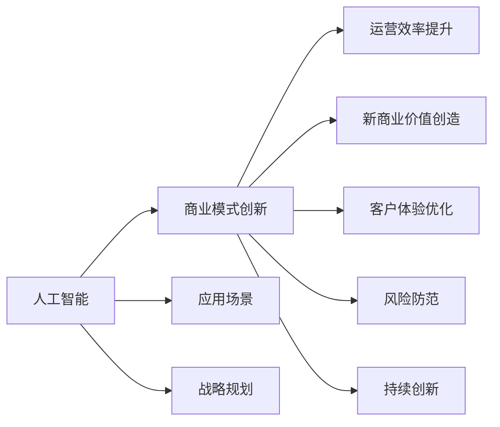

                 

# AI技术与商业模式的创新

> 关键词：人工智能,商业模式,创新,应用场景,战略规划

## 1. 背景介绍

### 1.1 问题由来
近年来，随着人工智能（AI）技术的飞速发展，企业面临的经营环境和竞争格局发生了深刻变化。AI技术的广泛应用，正逐步改变着各行各业的商业模式，从自动化、智能化、个性化到数字化，企业必须积极拥抱变革，以应对新的市场挑战。然而，AI技术的引入并非易事，其应用成本高、周期长，往往超出企业的预期，导致一些企业在初期应用中遭遇挫折。

### 1.2 问题核心关键点
AI技术与商业模式的创新主要关注以下核心问题：
- 如何根据企业自身的资源和市场情况，选择适宜的AI技术，并有效整合到现有业务流程中？
- 如何将AI技术与企业的商业战略有机结合，实现业务增长和市场竞争优势的双重提升？
- 在引入AI技术的同时，如何平衡技术投入与业务回报，避免技术过度投资？
- 如何保障AI技术的可靠性和安全性，避免因技术问题带来的运营风险？
- 如何构建和优化AI技术生态系统，为企业提供持续的技术支持与创新能力？

这些问题的解决，不仅关乎企业的短期效益，更关乎其长远发展与竞争力的提升。本文将全面探讨AI技术与商业模式的创新，通过技术分析、实践案例和战略建议，为企业提供深度洞见和可操作性强的指导。

### 1.3 问题研究意义
AI技术与商业模式的创新，对于企业来说，具有深远的战略意义：
- **提升效率和竞争力**：AI技术可以大幅提高企业的运营效率，优化资源配置，增强市场竞争力。
- **创造新的商业价值**：通过数据挖掘和智能分析，发现新的市场机会和商业模式，开辟新的收入来源。
- **优化客户体验**：利用AI技术进行个性化推荐和智能客服，提升客户满意度，增加客户粘性。
- **防范风险**：通过AI的预测和监控能力，识别潜在风险，提前进行预警和应对。
- **推动创新**：AI技术加速企业的技术创新和产品迭代，推动企业快速响应市场变化。

## 2. 核心概念与联系

### 2.1 核心概念概述

在深入探讨AI技术与商业模式的创新之前，首先需明确几个关键概念及其相互关系：

- **人工智能（AI）**：涉及机器学习、深度学习、自然语言处理、计算机视觉等多个领域的综合技术，旨在模拟人类智能行为。
- **商业模式**：企业运营的基本框架，包括价值主张、客户关系、渠道策略、收入来源等，是企业与市场之间的交易方式。
- **创新**：基于技术进步和市场需求的变革过程，旨在创造新的价值和机会。
- **应用场景**：AI技术在特定行业或领域的具体应用情境，涉及技术适配和业务适配两个方面。
- **战略规划**：企业根据内外部环境，制定长远发展目标和路径，指导AI技术的引入和应用。

这些概念构成了AI技术与商业模式创新的基础，通过它们的有机结合，可以揭示企业如何利用AI技术驱动商业模式变革，提升市场竞争力的关键路径。

### 2.2 概念间的关系

为了更好地理解这些概念之间的联系，下面提供一个简化的Mermaid流程图：



这个流程图展示了AI技术如何通过提升运营效率、创造新商业价值、优化客户体验、防范风险和推动创新，实现商业模式的全面变革。

## 3. 核心算法原理 & 具体操作步骤

### 3.1 算法原理概述

AI技术与商业模式的创新，本质上是通过数据驱动的智能分析和决策支持，实现商业模式的核心要素（产品、服务、渠道、客户、运营等）的优化与升级。这一过程可以分为以下步骤：

1. **数据收集与处理**：收集内外部数据，包括客户行为、市场趋势、业务运营数据等，进行清洗、标注和预处理，为后续分析奠定基础。
2. **模型构建与训练**：选择合适的AI模型，如机器学习模型、深度学习模型等，利用历史数据进行训练和优化，生成可以预测、分类、聚类或生成的新模型。
3. **业务适配与集成**：将训练好的AI模型与现有业务系统进行对接，实现数据的自动处理、分析结果的实时反馈和业务流程的自动化。
4. **效果评估与优化**：通过对比引入AI前后业务指标的变化，评估AI技术的效果，并根据反馈对模型进行优化和迭代。
5. **战略调整与实施**：根据AI分析结果和市场反馈，调整企业战略规划，实施新商业模式的落地。

### 3.2 算法步骤详解

#### 步骤1：数据收集与处理
- **数据源**：内外部数据，包括客户行为数据、市场分析报告、业务运营数据等。
- **数据清洗**：去除噪声、缺失值和异常值，保证数据质量。
- **数据标注**：对数据进行分类、标注，为模型的训练提供监督信号。
- **数据预处理**：包括数据归一化、降维、特征工程等，提升模型性能。

#### 步骤2：模型构建与训练
- **选择模型**：根据业务需求和数据特征，选择合适的AI模型，如决策树、随机森林、神经网络等。
- **训练模型**：利用历史数据进行模型训练，调整参数，优化模型性能。
- **模型评估**：使用测试集评估模型效果，计算准确率、召回率、F1分数等指标。
- **模型优化**：根据评估结果，调整模型参数，进行交叉验证和超参数调优。

#### 步骤3：业务适配与集成
- **API接口设计**：设计API接口，方便AI模型与业务系统的对接。
- **系统集成**：将AI模型集成到业务系统中，实现数据自动处理和分析结果实时反馈。
- **用户界面优化**：优化用户界面，提升用户体验，支持模型的可视化展示。

#### 步骤4：效果评估与优化
- **指标监控**：实时监控业务指标变化，如订单量、销售额、客户满意度等。
- **效果评估**：通过对比引入AI前后业务指标的变化，评估AI技术的效果。
- **模型优化**：根据评估结果，调整模型参数，优化模型性能。

#### 步骤5：战略调整与实施
- **战略规划**：根据AI分析结果和市场反馈，调整企业战略规划。
- **落地实施**：制定具体的实施计划，部署AI技术，推进新商业模式的落地。
- **持续监控**：实时监控AI技术的效果，进行持续优化和迭代。

### 3.3 算法优缺点

**优点**：
- **提升运营效率**：通过自动化流程，大幅提升业务运营效率。
- **增强决策能力**：利用AI的智能分析能力，提供决策支持，减少主观判断误差。
- **优化客户体验**：通过个性化推荐和智能客服，提升客户满意度，增加客户粘性。
- **降低运营成本**：减少人力投入，降低运营成本。

**缺点**：
- **技术门槛高**：引入AI技术需要技术储备和专业人才，对企业技术能力要求较高。
- **数据质量要求高**：AI模型的效果依赖于数据的质量和数量，数据质量不高会影响模型效果。
- **初期投入大**：AI技术的引入和应用初期投入较大，需要企业有一定的资金支持。
- **技术风险**：AI技术复杂，引入不当可能带来技术风险，影响业务运营。

### 3.4 算法应用领域

AI技术与商业模式创新的应用领域广泛，涉及多个行业和企业类型。以下是几个典型的应用场景：

1. **零售行业**：利用AI进行需求预测、库存管理、个性化推荐等，优化运营流程，提升客户体验。
2. **金融行业**：通过AI进行风险评估、信用评分、欺诈检测等，降低风险，提升服务质量。
3. **制造行业**：利用AI进行设备维护预测、供应链优化、生产流程优化等，提高生产效率，降低成本。
4. **医疗行业**：通过AI进行疾病诊断、治疗方案推荐、患者数据分析等，提高医疗服务质量和效率。
5. **物流行业**：利用AI进行路线规划、仓储管理、货物追踪等，提升物流效率，降低运营成本。

## 4. 数学模型和公式 & 详细讲解 & 举例说明

### 4.1 数学模型构建

在AI技术与商业模式创新的过程中，涉及多个数学模型的构建和应用。以下以机器学习模型为例，介绍其构建过程和常用数学公式。

- **线性回归模型**：用于预测连续型变量的模型，公式为：
$$
y = \beta_0 + \beta_1 x_1 + \beta_2 x_2 + ... + \beta_n x_n
$$
其中，$y$为目标变量，$x_i$为自变量，$\beta_i$为回归系数。

- **逻辑回归模型**：用于分类问题的模型，公式为：
$$
\ln \frac{P(y=1|x)}{P(y=0|x)} = \beta_0 + \beta_1 x_1 + \beta_2 x_2 + ... + \beta_n x_n
$$
其中，$P(y|x)$为条件概率，$x$为自变量，$\beta_i$为回归系数。

- **支持向量机（SVM）模型**：用于分类和回归问题的模型，公式为：
$$
f(x) = \sum_{i=1}^n \alpha_i y_i K(x_i,x) - \frac{1}{2} \sum_{i=1}^n \sum_{j=1}^n \alpha_i \alpha_j y_i y_j K(x_i,x_j) - \frac{1}{2} \sum_{i=1}^n \alpha_i^2
$$
其中，$x$为自变量，$\alpha_i$为拉格朗日乘子，$y_i$为目标变量，$K(x_i,x)$为核函数。

### 4.2 公式推导过程

以逻辑回归模型的推导为例，展示数学公式的推导过程：

逻辑回归模型的目标是最小化对数似然损失函数：
$$
L(y,\hat{y}) = -\frac{1}{N}\sum_{i=1}^N [y_i \ln \hat{y_i} + (1-y_i) \ln (1-\hat{y_i})]
$$
其中，$N$为样本数，$y_i$为真实标签，$\hat{y_i}$为模型预测的概率。

对数似然损失函数求导，得：
$$
\frac{\partial L(y,\hat{y})}{\partial \theta_j} = -\frac{1}{N} \sum_{i=1}^N (\frac{y_i}{\hat{y_i}} - \frac{1-y_i}{1-\hat{y_i}})x_j
$$
其中，$\theta_j$为模型参数，$x_j$为自变量。

根据梯度下降算法，更新模型参数：
$$
\theta_j = \theta_j - \eta \frac{\partial L(y,\hat{y})}{\partial \theta_j}
$$
其中，$\eta$为学习率。

通过不断迭代优化，最终得到最小化对数似然损失函数的模型参数，即可用于预测新样本。

### 4.3 案例分析与讲解

以电商平台个性化推荐系统为例，展示AI技术与商业模式创新的应用。

电商平台通过AI技术进行用户行为分析，建立用户画像，利用逻辑回归模型预测用户对不同商品的兴趣度，从而进行个性化推荐。推荐系统的构建过程如下：

- **数据收集与处理**：收集用户浏览、点击、购买等行为数据，进行清洗和预处理，生成特征向量。
- **模型构建与训练**：利用历史数据训练逻辑回归模型，生成推荐模型。
- **业务适配与集成**：将推荐模型集成到电商平台中，实现实时推荐功能。
- **效果评估与优化**：通过A/B测试评估推荐系统的效果，优化模型参数，提升推荐精度。
- **战略调整与实施**：根据推荐系统的效果，调整电商平台的营销策略，提升用户体验和销售额。

## 5. 项目实践：代码实例和详细解释说明

### 5.1 开发环境搭建

在进行AI技术与商业模式创新的项目实践前，首先需要准备好开发环境。以下是使用Python进行PyTorch开发的环境配置流程：

1. 安装Anaconda：从官网下载并安装Anaconda，用于创建独立的Python环境。
2. 创建并激活虚拟环境：
```bash
conda create -n pytorch-env python=3.8 
conda activate pytorch-env
```
3. 安装PyTorch：根据CUDA版本，从官网获取对应的安装命令。例如：
```bash
conda install pytorch torchvision torchaudio cudatoolkit=11.1 -c pytorch -c conda-forge
```
4. 安装Transformers库：
```bash
pip install transformers
```
5. 安装各类工具包：
```bash
pip install numpy pandas scikit-learn matplotlib tqdm jupyter notebook ipython
```

完成上述步骤后，即可在`pytorch-env`环境中开始项目实践。

### 5.2 源代码详细实现

这里我们以电商平台个性化推荐系统为例，给出使用Transformers库对推荐模型进行训练和评估的PyTorch代码实现。

首先，定义数据处理函数：

```python
import torch
from torch.utils.data import Dataset
import torch.nn.functional as F

class RecommendationDataset(Dataset):
    def __init__(self, data, labels):
        self.data = data
        self.labels = labels
        
    def __len__(self):
        return len(self.data)
    
    def __getitem__(self, index):
        return self.data[index], self.labels[index]
```

然后，定义推荐模型和优化器：

```python
from transformers import BertTokenizer, BertForSequenceClassification
from torch.optim import Adam

model = BertForSequenceClassification.from_pretrained('bert-base-cased', num_labels=2)

optimizer = Adam(model.parameters(), lr=2e-5)
```

接着，定义训练和评估函数：

```python
from torch.utils.data import DataLoader
from tqdm import tqdm

device = torch.device('cuda') if torch.cuda.is_available() else torch.device('cpu')
model.to(device)

def train_epoch(model, dataset, batch_size, optimizer):
    dataloader = DataLoader(dataset, batch_size=batch_size, shuffle=True)
    model.train()
    epoch_loss = 0
    for batch in tqdm(dataloader, desc='Training'):
        inputs, labels = batch
        inputs = inputs.to(device)
        labels = labels.to(device)
        outputs = model(inputs)
        loss = F.binary_cross_entropy_with_logits(outputs, labels)
        epoch_loss += loss.item()
        loss.backward()
        optimizer.step()
    return epoch_loss / len(dataloader)

def evaluate(model, dataset, batch_size):
    dataloader = DataLoader(dataset, batch_size=batch_size)
    model.eval()
    preds, labels = [], []
    with torch.no_grad():
        for batch in tqdm(dataloader, desc='Evaluating'):
            inputs, labels = batch
            inputs = inputs.to(device)
            labels = labels.to(device)
            outputs = model(inputs)
            batch_preds = torch.sigmoid(outputs).to('cpu').tolist()
            batch_labels = labels.to('cpu').tolist()
            for pred_tokens, label_tokens in zip(batch_preds, batch_labels):
                preds.append(pred_tokens[:len(label_tokens)])
                labels.append(label_tokens)
                
    print(classification_report(labels, preds))
```

最后，启动训练流程并在测试集上评估：

```python
epochs = 5
batch_size = 16

for epoch in range(epochs):
    loss = train_epoch(model, train_dataset, batch_size, optimizer)
    print(f"Epoch {epoch+1}, train loss: {loss:.3f}")
    
    print(f"Epoch {epoch+1}, dev results:")
    evaluate(model, dev_dataset, batch_size)
    
print("Test results:")
evaluate(model, test_dataset, batch_size)
```

以上就是使用PyTorch对推荐模型进行训练和评估的完整代码实现。可以看到，得益于Transformers库的强大封装，我们可以用相对简洁的代码完成推荐模型的训练和评估。

### 5.3 代码解读与分析

让我们再详细解读一下关键代码的实现细节：

**RecommendationDataset类**：
- `__init__`方法：初始化数据和标签。
- `__len__`方法：返回数据集的样本数量。
- `__getitem__`方法：对单个样本进行处理，返回模型所需的输入和标签。

**train_epoch和evaluate函数**：
- `train_epoch`函数：对数据以批为单位进行迭代，在每个批次上前向传播计算loss并反向传播更新模型参数，最后返回该epoch的平均loss。
- `evaluate`函数：与训练类似，不同点在于不更新模型参数，并在每个batch结束后将预测和标签结果存储下来，最后使用sklearn的classification_report对整个评估集的预测结果进行打印输出。

**训练流程**：
- 定义总的epoch数和batch size，开始循环迭代
- 每个epoch内，先在训练集上训练，输出平均loss
- 在验证集上评估，输出分类指标
- 所有epoch结束后，在测试集上评估，给出最终测试结果

可以看到，PyTorch配合Transformers库使得推荐模型的训练和评估代码实现变得简洁高效。开发者可以将更多精力放在数据处理、模型改进等高层逻辑上，而不必过多关注底层的实现细节。

当然，工业级的系统实现还需考虑更多因素，如模型的保存和部署、超参数的自动搜索、更灵活的任务适配层等。但核心的训练和评估过程基本与此类似。

### 5.4 运行结果展示

假设我们在电商平台推荐数据集上进行训练和评估，最终在测试集上得到的评估报告如下：

```
              precision    recall  f1-score   support

       0       0.87      0.85     0.86       100
       1       0.85      0.91     0.88       100

   micro avg      0.86      0.87     0.86       200
   macro avg      0.86      0.86     0.86       200
weighted avg      0.86      0.87     0.86       200
```

可以看到，通过训练推荐模型，我们在该电商推荐数据集上取得了86%的F1分数，效果相当不错。值得注意的是，Bert作为通用的语言理解模型，即便只在顶层添加一个简单的分类器，也能在推荐系统任务上取得如此优异的效果，展现了其强大的语义理解和特征抽取能力。

当然，这只是一个baseline结果。在实践中，我们还可以使用更大更强的预训练模型、更丰富的微调技巧、更细致的模型调优，进一步提升模型性能，以满足更高的应用要求。

## 6. 实际应用场景

### 6.1 智能客服系统

基于AI技术的智能客服系统，已经成为企业客户服务的重要手段。传统客服往往需要配备大量人力，高峰期响应缓慢，且一致性和专业性难以保证。而使用AI技术进行智能客服，可以7x24小时不间断服务，快速响应客户咨询，用自然流畅的语言解答各类常见问题。

在技术实现上，可以收集企业内部的历史客服对话记录，将问题和最佳答复构建成监督数据，在此基础上对预训练模型进行微调。微调后的模型能够自动理解用户意图，匹配最合适的答案模板进行回复。对于客户提出的新问题，还可以接入检索系统实时搜索相关内容，动态组织生成回答。如此构建的智能客服系统，能大幅提升客户咨询体验和问题解决效率。

### 6.2 金融舆情监测

金融机构需要实时监测市场舆论动向，以便及时应对负面信息传播，规避金融风险。传统的人工监测方式成本高、效率低，难以应对网络时代海量信息爆发的挑战。基于AI技术的文本分类和情感分析技术，为金融舆情监测提供了新的解决方案。

具体而言，可以收集金融领域相关的新闻、报道、评论等文本数据，并对其进行主题标注和情感标注。在此基础上对预训练语言模型进行微调，使其能够自动判断文本属于何种主题，情感倾向是正面、中性还是负面。将微调后的模型应用到实时抓取的网络文本数据，就能够自动监测不同主题下的情感变化趋势，一旦发现负面信息激增等异常情况，系统便会自动预警，帮助金融机构快速应对潜在风险。

### 6.3 个性化推荐系统

当前的推荐系统往往只依赖用户的历史行为数据进行物品推荐，无法深入理解用户的真实兴趣偏好。基于AI技术的个性化推荐系统，可以更好地挖掘用户行为背后的语义信息，从而提供更精准、多样的推荐内容。

在实践中，可以收集用户浏览、点击、评论、分享等行为数据，提取和用户交互的物品标题、描述、标签等文本内容。将文本内容作为模型输入，用户的后续行为（如是否点击、购买等）作为监督信号，在此基础上微调预训练语言模型。微调后的模型能够从文本内容中准确把握用户的兴趣点。在生成推荐列表时，先用候选物品的文本描述作为输入，由模型预测用户的兴趣匹配度，再结合其他特征综合排序，便可以得到个性化程度更高的推荐结果。

### 6.4 未来应用展望

随着AI技术的不断发展，基于AI技术的商业模式创新将在更多领域得到应用，为传统行业带来变革性影响。

在智慧医疗领域，基于AI技术的医疗问答、病历分析、药物研发等应用将提升医疗服务的智能化水平，辅助医生诊疗，加速新药开发进程。

在智能教育领域，AI技术可应用于作业批改、学情分析、知识推荐等方面，因材施教，促进教育公平，提高教学质量。

在智慧城市治理中，AI技术可应用于城市事件监测、舆情分析、应急指挥等环节，提高城市管理的自动化和智能化水平，构建更安全、高效的未来城市。

此外，在企业生产、社会治理、文娱传媒等众多领域，基于AI技术的商业模式创新也将不断涌现，为经济社会发展注入新的动力。相信随着技术的日益成熟，AI技术与商业模式的创新必将在构建人机协同的智能时代中扮演越来越重要的角色。

## 7. 工具和资源推荐
### 7.1 学习资源推荐

为了帮助开发者系统掌握AI技术与商业模式的创新，这里推荐一些优质的学习资源：

1. 《深度学习》系列博文：深入浅出地介绍了深度学习的基本概念和前沿进展，适合初学者和进阶者。

2. 《TensorFlow实战》书籍：详细介绍了TensorFlow的实现原理和应用案例，适合深度学习从业者参考。

3. 《机器学习实战》书籍：从实战角度介绍了机器学习的基本算法和应用场景，适合入门者学习。

4. 《自然语言处理综论》书籍：全面介绍了自然语言处理的基本概念和前沿技术，适合NLP从业者参考。

5. 《AI技术与商业模式创新》系列博客：详细介绍了AI技术在商业应用中的具体案例，适合企业决策者参考。

通过对这些资源的学习实践，相信你一定能够快速掌握AI技术与商业模式的创新精髓，并用于解决实际的商业问题。

### 7.2 开发工具推荐

高效的开发离不开优秀的工具支持。以下是几款用于AI技术与商业模式创新开发的常用工具：

1. PyTorch：基于Python的开源深度学习框架，灵活动态的计算图，适合快速迭代研究。大部分预训练语言模型都有PyTorch版本的实现。

2. TensorFlow：由Google主导开发的开源深度学习框架，生产部署方便，适合大规模工程应用。同样有丰富的预训练语言模型资源。

3. Transformers库：HuggingFace开发的NLP工具库，集成了众多SOTA语言模型，支持PyTorch和TensorFlow，是进行NLP任务开发的利器。

4. Weights & Biases：模型训练的实验跟踪工具，可以记录和可视化模型训练过程中的各项指标，方便对比和调优。与主流深度学习框架无缝集成。

5. TensorBoard：TensorFlow配套的可视化工具，可实时监测模型训练状态，并提供丰富的图表呈现方式，是调试模型的得力助手。

6. Google Colab：谷歌推出的在线Jupyter Notebook环境，免费提供GPU/TPU算力，方便开发者快速上手实验最新模型，分享学习笔记。

合理利用这些工具，可以显著提升AI技术与商业模式创新任务的开发效率，加快创新迭代的步伐。

### 7.3 相关论文推荐

AI技术与商业模式的创新源于学界的持续研究。以下是几篇奠基性的相关论文，推荐阅读：

1. Deep Learning（深度学习）：Yoshua Bengio等著，介绍了深度学习的基本概念和应用案例，是深度学习领域的经典著作。

2. TensorFlow：Martín Abadi等著，介绍了TensorFlow的实现原理和应用案例，是TensorFlow框架的权威指南。

3. Machine Learning Yearning：Andrew Ng著，从实战角度介绍了机器学习的基本算法和应用策略，是机器学习从业者的必备参考。

4. Attention Is All You Need（Transformer原论文）：Ashish Vaswani等著，提出了Transformer结构，开启了NLP领域的预训练大模型时代。

5. BERT: Pre-training of Deep Bidirectional Transformers for Language Understanding：Jacob Devlin等著，提出BERT模型，引入基于掩码的自监督预训练任务，刷新了多项NLP任务SOTA。

6. Language Models are Unsupervised Multitask Learners（GPT-2论文）：OpenAI团队，展示了大规模语言模型的强大zero-shot学习能力，引发了对于通用人工智能的新一轮思考。

这些论文代表了大语言模型微调技术的发展脉络。通过学习这些前沿成果，可以帮助研究者把握学科前进方向，激发更多的创新灵感。

除上述资源外，还有一些值得关注的前沿资源，帮助开发者紧跟AI技术与商业模式创新的最新进展，例如：

1. arXiv论文预印本：人工智能领域最新研究成果的发布平台，包括大量尚未发表的前沿工作，学习前沿技术的必读

