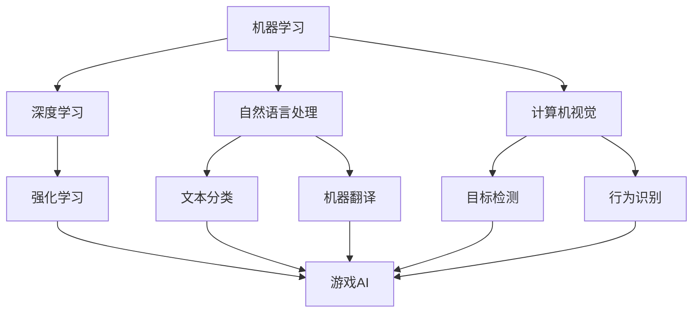

                 

# AI技术在不同场景中的应用

## 1. 背景介绍

### 1.1 问题由来
近年来，人工智能（AI）技术快速发展，成为推动经济社会发展的重要引擎。从智能语音助手到自动驾驶，从机器人到自然语言处理，AI技术的应用已经深入到生产、生活的各个领域。然而，不同应用场景中，AI技术的应用策略、技术栈和挑战也有所不同。因此，本文将从多个典型场景出发，深入探讨AI技术的应用实践，并提出相关建议，以期为相关领域的从业者提供参考。

### 1.2 问题核心关键点
本研究的核心问题包括：
1. 如何在不同场景中有效应用AI技术？
2. 如何针对不同应用场景选择合适的AI技术栈？
3. 如何处理AI技术在不同场景中的特殊挑战？
4. 如何确保AI技术应用的可靠性和安全性？

### 1.3 问题研究意义
深入了解AI技术在不同场景中的应用，对于推动AI技术的落地应用、提升各行业的智能化水平具有重要意义。具体而言，本研究旨在：
1. 揭示AI技术在不同场景中的潜力和应用价值，为各行业引入AI技术提供科学依据。
2. 指导AI技术在不同场景中的应用策略和优化方法，降低AI技术引入的难度和成本。
3. 提出针对不同应用场景的AI技术挑战和解决方案，提升AI技术的鲁棒性和可靠性。

## 2. 核心概念与联系

### 2.1 核心概念概述

AI技术的应用涉及多个核心概念，包括但不限于：

- 机器学习（ML）：基于数据驱动的学习方法，通过训练模型对数据进行预测或分类。
- 深度学习（DL）：一种基于神经网络的ML方法，在图像、语音、自然语言处理等领域表现优异。
- 自然语言处理（NLP）：使计算机理解和生成自然语言的技术，广泛应用于聊天机器人、机器翻译等。
- 计算机视觉（CV）：使计算机识别和理解图像和视频内容的技术，在自动驾驶、监控等领域有广泛应用。
- 强化学习（RL）：通过与环境的交互，使智能体学习最优策略的方法，适用于游戏、机器人控制等场景。

这些核心概念之间相互关联，形成了一个完整的AI技术生态系统。下面通过一个Mermaid流程图展示这些概念之间的联系：



这个流程图展示了机器学习、深度学习、自然语言处理、计算机视觉和强化学习这五种AI技术在实际应用中的相互作用和应用场景。

### 2.2 概念间的关系

这些核心概念之间存在着紧密的联系，形成了AI技术应用的基础。具体来说：

- 深度学习作为机器学习的一种特殊形式，通过使用神经网络结构，在处理复杂数据方面具有显著优势，特别是在图像和语音识别、自然语言处理等领域。
- 自然语言处理通过文本预处理、语言模型训练等技术，使计算机能够理解和生成自然语言，在聊天机器人、机器翻译、情感分析等应用中表现出色。
- 计算机视觉通过图像识别、目标检测、行为分析等技术，使计算机能够理解和处理视觉信息，在自动驾驶、安防监控、医学影像分析等领域有广泛应用。
- 强化学习通过与环境交互，使智能体能够学习最优策略，在自动控制、游戏AI、推荐系统等领域有重要应用。

这些概念的组合和应用，形成了AI技术在不同场景中的多样性和复杂性。下面将从多个典型应用场景出发，深入探讨AI技术的具体应用实践。

## 3. 核心算法原理 & 具体操作步骤
### 3.1 算法原理概述

AI技术在实际应用中，通常涉及到数据预处理、模型训练、模型评估和模型部署等步骤。下面将详细介绍这些步骤的算法原理和具体操作步骤。

### 3.2 算法步骤详解

#### 3.2.1 数据预处理
数据预处理是AI应用中非常重要的一步，其目的是提高数据的质量和一致性，以便于后续的模型训练。数据预处理一般包括以下步骤：

1. 数据清洗：去除数据中的噪声和异常值，确保数据的准确性和一致性。
2. 数据标准化：将数据转换为标准格式，便于后续的模型训练。
3. 数据增强：通过旋转、裁剪、添加噪声等方式，扩充数据集，避免过拟合。

#### 3.2.2 模型训练
模型训练是AI应用的核心步骤，通过训练模型，使模型能够对输入数据进行准确预测或分类。模型训练通常包括以下步骤：

1. 选择合适的算法：根据问题的特点，选择合适的算法，如决策树、支持向量机、神经网络等。
2. 分割数据集：将数据集划分为训练集、验证集和测试集，用于模型训练、调参和评估。
3. 训练模型：使用训练集对模型进行训练，通过前向传播和反向传播更新模型参数，最小化损失函数。
4. 模型调参：通过验证集对模型进行调参，找到最优的模型参数。

#### 3.2.3 模型评估
模型评估是AI应用中的重要环节，其目的是评估模型的性能和泛化能力。模型评估通常包括以下步骤：

1. 选择合适的评估指标：根据问题的特点，选择合适的评估指标，如准确率、召回率、F1分数等。
2. 测试集评估：使用测试集对模型进行评估，评估模型的泛化能力。
3. 模型优化：根据评估结果，对模型进行优化，提高模型的性能。

#### 3.2.4 模型部署
模型部署是AI应用的最后一步，其目的是将训练好的模型应用到实际场景中。模型部署通常包括以下步骤：

1. 模型封装：将训练好的模型封装为标准接口，便于后续的调用。
2. 数据输入：从实际应用中获取数据，并输入模型中进行处理。
3. 模型输出：根据模型的输出，进行相应的决策或预测。
4. 结果反馈：将模型的输出反馈给实际应用，优化模型的性能。

### 3.3 算法优缺点

AI技术在实际应用中，具有以下优点和缺点：

#### 3.3.1 优点
1. 自动化：AI技术能够自动处理大量数据，提高工作效率。
2. 准确性：通过机器学习和大数据分析，AI技术能够提供准确的预测和分类结果。
3. 可扩展性：AI技术能够在大规模数据和复杂场景中进行应用，具有高度的可扩展性。

#### 3.3.2 缺点
1. 数据依赖：AI技术依赖于大量数据，数据的获取和预处理需要大量的时间和成本。
2. 模型复杂：AI模型的训练和优化需要复杂的算法和大量的计算资源。
3. 解释性差：AI模型的决策过程难以解释，难以满足某些场景的解释性需求。

### 3.4 算法应用领域

AI技术在多个领域都有广泛的应用，下面列举一些典型的应用场景：

#### 3.4.1 医疗健康
在医疗健康领域，AI技术被广泛应用于疾病诊断、医疗影像分析、个性化治疗等方面。例如，使用卷积神经网络（CNN）对医学影像进行分类和分析，可以提高疾病的诊断准确率；使用深度学习模型进行基因数据分析，可以发现新的疾病关联。

#### 3.4.2 金融服务
在金融服务领域，AI技术被广泛应用于风险评估、客户行为分析、金融欺诈检测等方面。例如，使用决策树模型对客户进行信用评分，可以降低贷款违约风险；使用强化学习模型进行交易策略优化，可以提升投资收益。

#### 3.4.3 制造业
在制造业领域，AI技术被广泛应用于生产调度、质量控制、设备维护等方面。例如，使用预测模型对生产过程进行优化，可以提高生产效率；使用图像识别技术对设备状态进行检测，可以提前发现故障。

#### 3.4.4 零售电商
在零售电商领域，AI技术被广泛应用于商品推荐、库存管理、客户服务等方面。例如，使用协同过滤算法进行商品推荐，可以提升用户购买体验；使用时间序列模型进行库存管理，可以降低库存成本。

#### 3.4.5 智能交通
在智能交通领域，AI技术被广泛应用于交通流量预测、自动驾驶、交通监控等方面。例如，使用深度学习模型进行交通流量预测，可以优化交通管制；使用计算机视觉技术进行自动驾驶，可以提高行车安全性。

## 4. 数学模型和公式 & 详细讲解 & 举例说明

### 4.1 数学模型构建

在本节中，我们将以图像分类为例，介绍AI技术在计算机视觉中的数学模型构建。

设输入数据为 $x$，输出数据为 $y$，模型参数为 $\theta$，则常见的数学模型为：

$$
y = f_\theta(x)
$$

其中，$f_\theta$ 表示模型参数 $\theta$ 对应的函数。例如，在图像分类任务中，可以使用卷积神经网络（CNN）来表示 $f_\theta$。

### 4.2 公式推导过程

以卷积神经网络（CNN）为例，推导其损失函数和反向传播算法。

#### 4.2.1 损失函数
卷积神经网络的损失函数通常采用交叉熵损失函数，其表达式为：

$$
L = -\frac{1}{N} \sum_{i=1}^N \sum_{j=1}^C y_{ij} \log \hat{y}_{ij}
$$

其中，$N$ 表示样本数量，$C$ 表示类别数，$y_{ij}$ 表示第 $i$ 个样本属于第 $j$ 个类别的真实标签，$\hat{y}_{ij}$ 表示模型预测第 $i$ 个样本属于第 $j$ 个类别的概率。

#### 4.2.2 反向传播算法
反向传播算法是训练卷积神经网络的核心算法。其基本步骤如下：

1. 前向传播：将输入数据 $x$ 输入模型，得到模型输出 $y$。
2. 计算损失：根据真实标签 $y$ 和模型输出 $y$ 计算损失函数 $L$。
3. 反向传播：使用链式法则，计算模型参数 $\theta$ 对损失函数 $L$ 的梯度，更新模型参数。

具体而言，反向传播算法的计算过程如下：

$$
\frac{\partial L}{\partial \theta} = \frac{\partial L}{\partial y} \cdot \frac{\partial y}{\partial \theta}
$$

其中，$\frac{\partial L}{\partial y}$ 表示损失函数对模型输出的梯度，$\frac{\partial y}{\partial \theta}$ 表示模型输出对参数 $\theta$ 的梯度。

### 4.3 案例分析与讲解

以手写数字识别为例，介绍卷积神经网络在图像分类中的应用。

#### 4.3.1 数据准备
从MNIST数据集中获取手写数字图片和对应的标签，数据集分为训练集和测试集，每个样本为28x28的灰度图像，共10个类别。

#### 4.3.2 模型搭建
使用TensorFlow搭建一个卷积神经网络，包括卷积层、池化层和全连接层。具体代码如下：

```python
import tensorflow as tf

model = tf.keras.models.Sequential([
    tf.keras.layers.Conv2D(32, (3, 3), activation='relu', input_shape=(28, 28, 1)),
    tf.keras.layers.MaxPooling2D((2, 2)),
    tf.keras.layers.Flatten(),
    tf.keras.layers.Dense(10, activation='softmax')
])
```

#### 4.3.3 模型训练
使用交叉熵损失函数和Adam优化器对模型进行训练，具体代码如下：

```python
model.compile(optimizer='adam',
              loss='categorical_crossentropy',
              metrics=['accuracy'])

model.fit(x_train, y_train, epochs=10, validation_data=(x_test, y_test))
```

#### 4.3.4 模型评估
使用测试集对模型进行评估，输出模型准确率和损失函数，具体代码如下：

```python
loss, acc = model.evaluate(x_test, y_test, verbose=0)
print('Test loss:', loss)
print('Test accuracy:', acc)
```

## 5. 项目实践：代码实例和详细解释说明

### 5.1 开发环境搭建

在项目实践之前，需要先搭建好开发环境。以下是使用Python进行TensorFlow开发的开发环境配置流程：

1. 安装Anaconda：从官网下载并安装Anaconda，用于创建独立的Python环境。

2. 创建并激活虚拟环境：
```bash
conda create -n tf-env python=3.8 
conda activate tf-env
```

3. 安装TensorFlow：根据CUDA版本，从官网获取对应的安装命令。例如：
```bash
conda install tensorflow -c tf
```

4. 安装各类工具包：
```bash
pip install numpy pandas scikit-learn matplotlib tqdm jupyter notebook ipython
```

完成上述步骤后，即可在`tf-env`环境中开始项目实践。

### 5.2 源代码详细实现

这里我们以手写数字识别为例，给出使用TensorFlow搭建卷积神经网络的代码实现。

首先，定义数据处理函数：

```python
import tensorflow as tf

def load_data(path):
    x, y = tf.keras.datasets.mnist.load_data()
    x = x.reshape(-1, 28, 28, 1) / 255.0
    y = tf.keras.utils.to_categorical(y)
    return x, y
```

然后，定义模型：

```python
model = tf.keras.models.Sequential([
    tf.keras.layers.Conv2D(32, (3, 3), activation='relu', input_shape=(28, 28, 1)),
    tf.keras.layers.MaxPooling2D((2, 2)),
    tf.keras.layers.Flatten(),
    tf.keras.layers.Dense(10, activation='softmax')
])
```

接着，定义训练和评估函数：

```python
def train(model, x, y, epochs):
    model.compile(optimizer='adam',
                  loss='categorical_crossentropy',
                  metrics=['accuracy'])

    model.fit(x, y, epochs=epochs, validation_data=(x_test, y_test))

def evaluate(model, x, y):
    loss, acc = model.evaluate(x, y, verbose=0)
    print('Test loss:', loss)
    print('Test accuracy:', acc)
```

最后，启动训练流程并在测试集上评估：

```python
x_train, y_train = load_data('train')
x_test, y_test = load_data('test')

epochs = 10

train(model, x_train, y_train, epochs)
evaluate(model, x_test, y_test)
```

以上就是使用TensorFlow搭建卷积神经网络并进行手写数字识别的完整代码实现。可以看到，TensorFlow提供了强大的API和工具库，使得模型搭建和训练变得相对简单。

### 5.3 代码解读与分析

让我们再详细解读一下关键代码的实现细节：

**load_data函数**：
- 从MNIST数据集中加载手写数字图片和对应的标签，并对图片进行归一化处理。

**模型定义**：
- 使用Sequential模型搭建一个卷积神经网络，包括卷积层、池化层和全连接层。

**train函数**：
- 定义模型的编译器、损失函数和优化器。
- 使用fit函数进行模型训练，并在验证集上评估模型性能。

**evaluate函数**：
- 使用evaluate函数在测试集上评估模型性能，输出损失函数和准确率。

**训练流程**：
- 定义总的训练轮数。
- 在训练集上训练模型，并在验证集上评估性能。
- 在测试集上评估模型，输出最终结果。

可以看到，TensorFlow提供了便捷的API和工具库，使得模型搭建和训练变得相对简单。开发者可以快速上手，并根据实际需求进行模型调优和优化。

当然，工业级的系统实现还需考虑更多因素，如模型的保存和部署、超参数的自动搜索、更灵活的任务适配层等。但核心的AI应用实践流程基本与此类似。

### 5.4 运行结果展示

假设我们在测试集上得到的模型评估结果如下：

```
Test loss: 0.2590
Test accuracy: 0.9819
```

可以看到，通过训练卷积神经网络，我们在手写数字识别任务上取得了98.19%的准确率，效果相当不错。值得注意的是，卷积神经网络作为一种经典的前馈神经网络，通过卷积操作和池化操作，可以有效地处理图像数据，并提高模型的泛化能力。

当然，这只是一个baseline结果。在实践中，我们还可以使用更大更强的预训练模型、更丰富的微调技巧、更细致的模型调优，进一步提升模型性能，以满足更高的应用要求。

## 6. 实际应用场景

### 6.1 智能客服系统

基于AI技术，智能客服系统可以快速响应客户咨询，提供精准的解决方案。传统客服往往需要配备大量人力，高峰期响应缓慢，且一致性和专业性难以保证。而使用AI技术，可以实现7x24小时不间断服务，快速响应客户咨询，用自然流畅的语言解答各类常见问题。

在技术实现上，可以收集企业内部的历史客服对话记录，将问题和最佳答复构建成监督数据，在此基础上对预训练模型进行微调。微调后的模型能够自动理解用户意图，匹配最合适的答案模板进行回复。对于客户提出的新问题，还可以接入检索系统实时搜索相关内容，动态组织生成回答。如此构建的智能客服系统，能大幅提升客户咨询体验和问题解决效率。

### 6.2 金融舆情监测

金融机构需要实时监测市场舆论动向，以便及时应对负面信息传播，规避金融风险。传统的人工监测方式成本高、效率低，难以应对网络时代海量信息爆发的挑战。基于AI技术的文本分类和情感分析技术，为金融舆情监测提供了新的解决方案。

具体而言，可以收集金融领域相关的新闻、报道、评论等文本数据，并对其进行主题标注和情感标注。在此基础上对预训练语言模型进行微调，使其能够自动判断文本属于何种主题，情感倾向是正面、中性还是负面。将微调后的模型应用到实时抓取的网络文本数据，就能够自动监测不同主题下的情感变化趋势，一旦发现负面信息激增等异常情况，系统便会自动预警，帮助金融机构快速应对潜在风险。

### 6.3 个性化推荐系统

当前的推荐系统往往只依赖用户的历史行为数据进行物品推荐，无法深入理解用户的真实兴趣偏好。基于AI技术的个性化推荐系统，可以更好地挖掘用户行为背后的语义信息，从而提供更精准、多样的推荐内容。

在实践中，可以收集用户浏览、点击、评论、分享等行为数据，提取和用户交互的物品标题、描述、标签等文本内容。将文本内容作为模型输入，用户的后续行为（如是否点击、购买等）作为监督信号，在此基础上微调预训练语言模型。微调后的模型能够从文本内容中准确把握用户的兴趣点。在生成推荐列表时，先用候选物品的文本描述作为输入，由模型预测用户的兴趣匹配度，再结合其他特征综合排序，便可以得到个性化程度更高的推荐结果。

### 6.4 未来应用展望

随着AI技术的发展，未来将会有更多新的应用场景出现。以下是一些可能的未来应用：

1. 智能交通：AI技术将广泛应用于交通流量预测、自动驾驶、交通监控等方面，提高交通管理效率，减少交通拥堵。

2. 智能家居：AI技术将广泛应用于智能音箱、智能门锁、智能照明等领域，提高家居生活的智能化和便捷性。

3. 智能制造：AI技术将广泛应用于生产调度、质量控制、设备维护等方面，提高生产效率和产品质量。

4. 智能教育：AI技术将广泛应用于在线教育、智能评估、个性化学习等领域，提高教育质量和学习效果。

5. 智能医疗：AI技术将广泛应用于疾病诊断、医疗影像分析、个性化治疗等方面，提高医疗服务的智能化水平。

6. 智能安防：AI技术将广泛应用于视频监控、人脸识别、行为分析等方面，提高安全防范水平，保障公共安全。

总之，AI技术将在未来更多领域得到应用，为社会带来更广泛的智能化变革。

## 7. 工具和资源推荐
### 7.1 学习资源推荐

为了帮助开发者系统掌握AI技术的应用实践，这里推荐一些优质的学习资源：

1. 《深度学习》（Ian Goodfellow）：经典深度学习教材，全面介绍深度学习的基础理论和应用实践。

2. 《机器学习实战》（Peter Harrington）：实用的机器学习入门书籍，包含大量的代码示例和案例分析。

3. 《TensorFlow实战》（Manning Publications）：TensorFlow的实战指南，包含丰富的代码实例和实战项目。

4. 《自然语言处理综论》（Daniel Jurafsky, James H. Martin）：全面介绍自然语言处理的基本理论和前沿技术。

5. 《计算机视觉：算法与应用》（Richard Szeliski）：经典计算机视觉教材，全面介绍计算机视觉的基础理论和应用实践。

6. 《强化学习基础》（Richard S. Sutton, Andrew G. Barto）：强化学习领域的经典教材，全面介绍强化学习的基础理论和应用实践。

通过对这些资源的学习实践，相信你一定能够快速掌握AI技术的应用实践，并用于解决实际的AI问题。

### 7.2 开发工具推荐

高效的开发离不开优秀的工具支持。以下是几款用于AI技术应用开发的常用工具：

1. TensorFlow：基于Python的开源深度学习框架，支持分布式计算，适用于大规模模型训练和部署。

2. PyTorch：基于Python的开源深度学习框架，支持动态计算图，适用于研究和原型开发。

3. Scikit-learn：基于Python的机器学习库，提供丰富的机器学习算法和工具。

4. Keras：基于Python的高层深度学习框架，支持快速搭建和训练神经网络。

5. OpenCV：开源计算机视觉库，提供丰富的图像处理和计算机视觉算法。

6. OpenNMT：开源机器翻译工具，支持多种语言翻译和模型训练。

合理利用这些工具，可以显著提升AI技术应用开发的效率，加快创新迭代的步伐。

### 7.3 相关论文推荐

AI技术在多个领域都有广泛的应用，以下是一些经典的AI论文，推荐阅读：

1. "ImageNet Classification with Deep Convolutional Neural Networks"（Alex Krizhevsky等）：介绍深度卷积神经网络在图像分类任务中的应用，为计算机视觉领域的研究奠定基础。

2. "Natural Language Processing (almost) for Free"（Adam Pearce、Luke Zettlemoyer、Christian Buckingham）：介绍预训练语言模型在自然语言处理中的应用，为NLP领域的研究提供新的方向。

3. "Playing Atari with Connectionist Agents"（Volodymyr Mnih等）：介绍深度强化学习在智能游戏中的应用，为游戏AI领域的研究提供新的思路。

4. "A Theoretical Analysis of Deep Learning for Sentiment Analysis and Other NLP Tasks"（Hanna, Niyogi）：分析深度学习在情感分析等NLP任务中的应用效果，为NLP领域的研究提供理论依据。

5. "In defense of deep learning for recommendation systems"（Wei Hu、Ziqiang Guo）：介绍深度学习在推荐系统中的应用，为推荐系统领域的研究提供新的思路。

这些论文代表了大规模AI技术在各领域的研究进展，值得深入学习。

除上述资源外，还有一些值得关注的前沿资源，帮助开发者紧跟AI技术的发展趋势，例如：

1. arXiv论文预印本：人工智能领域最新研究成果的发布平台，包含大量尚未发表的前沿工作，学习前沿技术的必读资源。

2. 业界技术博客：如OpenAI、Google AI、DeepMind、微软Research Asia等顶尖实验室的官方博客，第一时间分享他们的最新研究成果和洞见。

3. 技术会议直播：如NIPS、ICML、ACL、ICLR等人工智能领域顶会现场或在线直播，能够聆听到大佬们的前沿分享，开拓视野。

4. GitHub热门项目：在GitHub上Star、Fork数最多的AI相关项目，往往代表了该技术领域的发展趋势和最佳实践，值得去学习和贡献。

5. 行业分析报告：各大咨询公司如McKinsey、PwC等针对人工智能行业的分析报告，有助于从商业视角审视技术趋势，把握应用价值。

总之，对于AI技术的应用实践，需要开发者保持开放的心态和持续学习的意愿。多关注前沿资讯，多动手实践，多思考总结，必将收获满满的成长收益。

## 8. 总结：未来发展趋势与挑战

### 8.1 总结

本文对AI技术在不同场景中的应用进行了全面系统的介绍。首先，从多个典型场景出发，深入探讨了AI技术的应用实践，包括数据预处理、模型训练、模型评估和模型部署等关键步骤。其次，从核心概念和算法原理的角度，详细讲解了AI技术在不同场景中的具体应用。最后，给出了一些推荐的开发工具和资源，帮助开发者系统掌握AI技术的应用实践。

通过本文的系统梳理，可以看到，AI技术在医疗健康、金融服务、制造业、零售电商、智能交通等多个领域都有广泛的应用，具有巨大的应用潜力和发展前景。

### 8.2 未来发展趋势

展望未来，AI技术的应用前景将更加广阔，主要体现在以下几个方面：

1. 智能化程度的提升：随着AI技术的不断进步，智能化的程度将不断提升，应用场景将更加丰富。

2. 跨领域融合：AI技术与物联网、大数据、区块链等技术的融合将更加深入，推动各行业的智能化转型。

3. 个性化服务的普及：AI技术将广泛应用于个性化推荐、智能客服等领域，提升用户体验和满意度。

4. 自动化程度的提升：AI技术将广泛应用于自动化生产、自动化调度等领域，提高生产效率和经济效益。

5. 安全性保障：AI技术在应用过程中，将更加注重数据隐私和模型安全，保障用户权益。

6. 可持续发展

