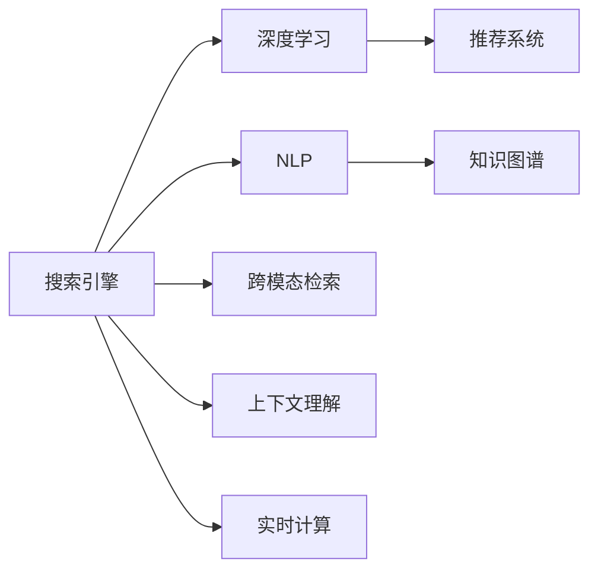
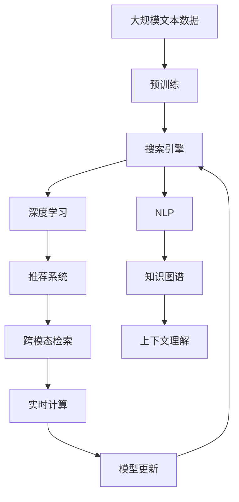

                 

# AI搜索引擎对信息获取方式的改变

> 关键词：
- 搜索引擎
- 自然语言处理
- 信息检索
- 推荐系统
- 深度学习
- 自然语言理解
- 人工智能

## 1. 背景介绍

### 1.1 问题由来

在互联网时代，信息的获取和处理成为日常生活中的一个重要环节。传统的搜索引擎（如Google、Bing等）通过爬取网页、建立索引、计算相关性，为用户提供了丰富且多样化的信息。但传统的搜索引擎受限于信息检索的范式，无法充分挖掘信息的潜在价值，用户体验也难以进一步提升。

随着人工智能技术的发展，尤其是自然语言处理（NLP）和深度学习（DL）的突破，搜索引擎正在经历一场深刻的变革。AI搜索引擎通过对用户查询进行智能解析，能够理解用户的意图和需求，提供更加精准和个性化的搜索结果。同时，AI技术还扩展了信息获取的途径，从网页检索延伸到语音搜索、图像搜索、知识图谱等多种形式。

本文旨在探讨AI搜索引擎在信息获取方式上的创新，剖析其核心算法原理，并展望未来发展趋势，为从业者提供参考和指导。

### 1.2 问题核心关键点

AI搜索引擎的创新主要体现在以下几个方面：

- 深度学习和自然语言理解：通过深度学习模型对文本进行语义分析和理解，提升信息检索的精准性和深度。
- 个性化推荐：通过用户行为数据和学习算法，实现个性化搜索和推荐，提高用户体验。
- 跨模态检索：将多种信息形式（如文本、图像、语音等）进行融合，提供多模态的搜索体验。
- 上下文理解：结合用户的历史查询和当前语境，提供更符合上下文的搜索结果。
- 实时计算：利用分布式计算和流计算技术，实时处理用户查询，提供即时响应。

这些创新不仅改变了信息检索的方式，还为用户带来了全新的搜索体验，满足了更高层次的需求。

### 1.3 问题研究意义

研究AI搜索引擎对信息获取方式的改变，具有以下重要意义：

1. **提升信息检索质量**：通过深度学习和自然语言理解，AI搜索引擎能够更准确地理解用户意图，提供更相关、更精确的搜索结果。
2. **增强个性化服务**：通过推荐算法和用户行为分析，AI搜索引擎能够提供更符合用户需求的搜索结果和内容，提升用户体验。
3. **拓展搜索场景**：跨模态检索和多模态搜索技术的引入，拓展了信息获取的途径，满足用户在视觉、听觉等不同模态下的信息需求。
4. **优化计算性能**：通过分布式计算和实时计算技术，AI搜索引擎能够快速响应用户查询，提高服务效率和用户体验。
5. **推动NLP和DL发展**：AI搜索引擎的普及和应用，进一步推动了NLP和DL技术的创新和进步。

## 2. 核心概念与联系

### 2.1 核心概念概述

为了更好地理解AI搜索引擎的核心技术，本节将介绍几个关键概念：

- **搜索引擎（Search Engine）**：利用算法对互联网上的海量信息进行索引和检索，为用户提供信息获取服务的系统。
- **深度学习（Deep Learning）**：一种基于神经网络的机器学习技术，能够自动提取和利用数据中的复杂特征。
- **自然语言处理（Natural Language Processing, NLP）**：涉及计算机如何理解、处理和生成自然语言的技术，是搜索引擎的核心组件。
- **推荐系统（Recommendation System）**：利用用户行为数据，预测用户可能感兴趣的内容或产品，并提供个性化推荐。
- **知识图谱（Knowledge Graph）**：以图的形式表示实体及其关系的数据结构，用于增强搜索引擎的语义理解和信息检索。
- **跨模态检索（Cross-modal Retrieval）**：通过结合文本、图像、语音等多种信息形式，实现更全面的信息检索。
- **上下文理解（Contextual Understanding）**：结合用户的历史查询和当前语境，提供更加符合用户需求的搜索结果。
- **实时计算（Real-time Computing）**：通过分布式计算和流计算技术，实现对用户查询的实时处理和响应。

这些概念构成了AI搜索引擎的核心技术框架，帮助其实现从传统搜索到智能搜索的跨越。

### 2.2 概念间的关系

这些核心概念之间的逻辑关系可以通过以下Mermaid流程图来展示：



这个流程图展示了大语言模型微调过程中各个核心概念的关联关系：

1. **搜索引擎**：利用**深度学习**和**NLP**技术对用户查询进行解析和理解，结合**推荐系统**、**知识图谱**、**跨模态检索**和**上下文理解**等技术，提供个性化的搜索结果。
2. **深度学习**：通过复杂的神经网络结构，自动提取和利用数据中的复杂特征，提升信息检索的准确性和深度。
3. **NLP**：利用自然语言理解和处理技术，将自然语言转换为机器可以处理的形式，进行语义分析和匹配。
4. **推荐系统**：根据用户的历史行为和兴趣，预测并推荐相关内容，提升用户体验。
5. **知识图谱**：通过图结构表示实体关系，增强搜索引擎的语义理解和信息检索能力。
6. **跨模态检索**：结合多种信息形式，提供多模态的搜索体验，满足用户在视觉、听觉等不同模态下的信息需求。
7. **上下文理解**：结合用户的历史查询和当前语境，提供更加符合用户需求的搜索结果。
8. **实时计算**：通过分布式计算和流计算技术，实现对用户查询的实时处理和响应。

通过这些核心概念的有机组合，AI搜索引擎能够实现信息检索方式的深度变革，为用户提供更加智能和个性化的服务。

### 2.3 核心概念的整体架构

最后，我们用一个综合的流程图来展示这些核心概念在大语言模型微调过程中的整体架构：



这个综合流程图展示了从预训练到搜索引擎的完整过程：

1. **大规模文本数据**：用于训练预训练模型，提取通用的语言表示。
2. **预训练**：通过自监督学习任务训练通用语言模型，学习语言的通用表示。
3. **深度学习**：利用深度学习模型对用户查询进行语义分析和理解。
4. **NLP**：将自然语言转换为机器可以处理的形式，进行语义分析和匹配。
5. **推荐系统**：根据用户的历史行为和兴趣，预测并推荐相关内容。
6. **知识图谱**：通过图结构表示实体关系，增强搜索引擎的语义理解和信息检索能力。
7. **跨模态检索**：结合多种信息形式，提供多模态的搜索体验。
8. **上下文理解**：结合用户的历史查询和当前语境，提供更加符合用户需求的搜索结果。
9. **实时计算**：通过分布式计算和流计算技术，实现对用户查询的实时处理和响应。
10. **模型更新**：定期更新模型参数，适应新的数据和需求。

通过这些核心概念的协同工作，AI搜索引擎能够实现信息检索方式的深度变革，为用户提供更加智能和个性化的服务。

## 3. 核心算法原理 & 具体操作步骤

### 3.1 算法原理概述

AI搜索引擎的核心算法主要基于深度学习和自然语言处理技术，结合推荐系统、知识图谱、跨模态检索、上下文理解和实时计算等技术，实现对用户查询的智能解析和个性化推荐。

搜索引擎的核心目标是通过深度学习模型理解用户查询的意图和需求，从而在大量信息中快速检索出相关的内容。常见的算法包括：

- **自然语言处理（NLP）**：通过词向量、语言模型、依存关系等技术，将自然语言转换为机器可以处理的形式，进行语义分析和匹配。
- **深度学习（DL）**：利用卷积神经网络（CNN）、循环神经网络（RNN）、长短期记忆网络（LSTM）、Transformer等模型，提取和利用数据中的复杂特征，提升信息检索的准确性和深度。
- **推荐系统（Recommendation）**：根据用户的历史行为和兴趣，预测并推荐相关内容，提升用户体验。
- **知识图谱（KG）**：通过图结构表示实体关系，增强搜索引擎的语义理解和信息检索能力。
- **跨模态检索（Cross-modal Retrieval）**：结合多种信息形式，提供多模态的搜索体验。
- **上下文理解（Contextual Understanding）**：结合用户的历史查询和当前语境，提供更加符合用户需求的搜索结果。
- **实时计算（Real-time Computing）**：通过分布式计算和流计算技术，实现对用户查询的实时处理和响应。

### 3.2 算法步骤详解

AI搜索引擎的算法步骤包括以下几个关键环节：

**Step 1: 准备数据和模型**

1. **数据准备**：收集和预处理用户查询和相关内容的数据。常用的数据集包括TREC、Webis、Amazon等。
2. **模型选择**：选择合适的深度学习模型和NLP技术，如BERT、GPT、Transformer等。

**Step 2: 深度学习模型训练**

1. **数据标注**：对查询和相关内容进行标注，如将查询转换为向量表示，提取文本中的实体、关系等。
2. **模型训练**：使用标注数据训练深度学习模型，调整模型参数以提升性能。
3. **评估指标**：使用如BLEU、ROUGE等指标评估模型效果，确保模型的准确性和鲁棒性。

**Step 3: 信息检索与推荐**

1. **查询解析**：对用户查询进行解析和理解，提取关键词和语义信息。
2. **信息检索**：利用训练好的深度学习模型对查询进行语义匹配，检索相关内容。
3. **推荐算法**：结合用户的历史行为和兴趣，推荐相关内容，提升用户体验。

**Step 4: 上下文理解和跨模态检索**

1. **上下文理解**：结合用户的历史查询和当前语境，提供更加符合用户需求的搜索结果。
2. **跨模态检索**：结合多种信息形式，如文本、图像、语音等，提供多模态的搜索体验。

**Step 5: 实时计算与模型更新**

1. **实时计算**：通过分布式计算和流计算技术，实现对用户查询的实时处理和响应。
2. **模型更新**：定期更新模型参数，适应新的数据和需求，保持搜索引擎的准确性和时效性。

### 3.3 算法优缺点

AI搜索引擎的算法具有以下优点：

- **高效精准**：利用深度学习和自然语言处理技术，实现高效精准的信息检索。
- **个性化推荐**：结合用户行为数据和学习算法，实现个性化搜索和推荐，提升用户体验。
- **多模态检索**：结合多种信息形式，提供多模态的搜索体验，满足用户在视觉、听觉等不同模态下的信息需求。
- **实时响应**：通过分布式计算和流计算技术，实现对用户查询的实时处理和响应。

同时，AI搜索引擎的算法也存在一些缺点：

- **数据依赖**：深度学习模型的效果高度依赖于数据质量和标注信息，高质量的数据获取成本较高。
- **复杂度高**：深度学习模型的训练和推理计算复杂度高，对计算资源要求较高。
- **可解释性差**：深度学习模型通常被视为“黑盒”系统，难以解释其内部工作机制和决策逻辑。
- **泛化能力有限**：深度学习模型在特定数据集上表现较好，但对新数据泛化能力较弱。

### 3.4 算法应用领域

AI搜索引擎的算法在以下领域有广泛的应用：

1. **搜索引擎**：通过深度学习和自然语言处理技术，实现高效精准的信息检索。
2. **智能问答系统**：利用推荐系统和知识图谱，提供个性化问答服务。
3. **个性化推荐引擎**：结合用户行为数据，推荐相关内容和产品。
4. **多模态搜索**：结合文本、图像、语音等，提供多模态的搜索体验。
5. **实时计算应用**：通过分布式计算和流计算技术，实现对用户查询的实时处理和响应。
6. **自然语言理解**：利用深度学习模型，理解自然语言语义和语境，提供更加符合用户需求的搜索结果。

## 4. 数学模型和公式 & 详细讲解 & 举例说明

### 4.1 数学模型构建

搜索引擎的数学模型主要基于深度学习和自然语言处理技术，通过将自然语言转换为向量表示，利用向量空间模型进行语义匹配。常用的向量表示方法包括词向量、语言模型、依存关系等。

假设查询文本为 $q$，相关内容为 $d$，查询向量为 $q_v$，内容向量为 $d_v$，向量空间模型为 $V$，相似度函数为 $sim$，则查询与内容的相似度可以表示为：

$$
sim(q, d) = \frac{\langle q_v, d_v \rangle}{\Vert q_v \Vert \cdot \Vert d_v \Vert}
$$

其中，$\langle q_v, d_v \rangle$ 为向量点积，$\Vert q_v \Vert$ 和 $\Vert d_v \Vert$ 为向量范数。

### 4.2 公式推导过程

以查询解析和信息检索为例，进行详细推导：

假设查询为 $q = (q_1, q_2, \ldots, q_n)$，相关内容为 $d = (d_1, d_2, \ldots, d_m)$，查询向量为 $q_v = (q_{v_1}, q_{v_2}, \ldots, q_{v_n})$，内容向量为 $d_v = (d_{v_1}, d_{v_2}, \ldots, d_{v_m})$。查询解析过程如下：

1. **分词和词向量提取**：将查询和内容分词，提取每个词的词向量表示，如Word2Vec、GloVe等。
2. **语言模型训练**：利用查询和内容的数据，训练语言模型，得到每个词的概率分布。
3. **依存关系分析**：分析查询和内容的依存关系，提取句法结构和语义信息。

查询与内容的相似度计算如下：

1. **向量表示**：将查询和内容转换为向量表示，利用词向量、语言模型、依存关系等技术，得到查询向量 $q_v$ 和内容向量 $d_v$。
2. **相似度计算**：利用向量空间模型，计算查询和内容的相似度 $sim(q, d)$，选择最相关的内容作为搜索结果。

### 4.3 案例分析与讲解

以Google Scholar为例，进行详细讲解：

Google Scholar利用深度学习模型进行查询解析和信息检索。具体步骤如下：

1. **查询解析**：将用户输入的查询通过自然语言处理技术转换为向量表示，提取关键词和语义信息。
2. **信息检索**：利用训练好的深度学习模型对查询进行语义匹配，检索相关学术文献。
3. **个性化推荐**：根据用户的历史搜索行为，推荐相关学术文献，提升用户体验。

Google Scholar的成功在于其深度学习模型的高效精准和个性化推荐算法的强大能力，能够快速检索出符合用户需求的相关文献。

## 5. 项目实践：代码实例和详细解释说明

### 5.1 开发环境搭建

在进行AI搜索引擎的开发实践前，我们需要准备好开发环境。以下是使用Python进行PyTorch开发的环境配置流程：

1. 安装Anaconda：从官网下载并安装Anaconda，用于创建独立的Python环境。

2. 创建并激活虚拟环境：
```bash
conda create -n pytorch-env python=3.8 
conda activate pytorch-env
```

3. 安装PyTorch：根据CUDA版本，从官网获取对应的安装命令。例如：
```bash
conda install pytorch torchvision torchaudio cudatoolkit=11.1 -c pytorch -c conda-forge
```

4. 安装各类工具包：
```bash
pip install numpy pandas scikit-learn matplotlib tqdm jupyter notebook ipython
```

完成上述步骤后，即可在`pytorch-env`环境中开始搜索引擎的开发实践。

### 5.2 源代码详细实现

以下是使用PyTorch实现AI搜索引擎的代码示例：

```python
import torch
import torch.nn as nn
import torch.nn.functional as F

class QueryEmbedder(nn.Module):
    def __init__(self, embedding_dim):
        super(QueryEmbedder, self).__init__()
        self.embedding = nn.Embedding(vocab_size, embedding_dim)
        self.dropout = nn.Dropout(p=0.5)
        self.fc1 = nn.Linear(embedding_dim, hidden_size)
        self.fc2 = nn.Linear(hidden_size, num_labels)

    def forward(self, x):
        x = self.embedding(x)
        x = self.dropout(x)
        x = F.relu(self.fc1(x))
        x = self.fc2(x)
        return x

class DocumentEmbedder(nn.Module):
    def __init__(self, embedding_dim):
        super(DocumentEmbedder, self).__init__()
        self.embedding = nn.Embedding(vocab_size, embedding_dim)
        self.dropout = nn.Dropout(p=0.5)
        self.fc1 = nn.Linear(embedding_dim, hidden_size)
        self.fc2 = nn.Linear(hidden_size, num_labels)

    def forward(self, x):
        x = self.embedding(x)
        x = self.dropout(x)
        x = F.relu(self.fc1(x))
        x = self.fc2(x)
        return x

class BERTEmbedder(nn.Module):
    def __init__(self, bert_model):
        super(BERTEmbedder, self).__init__()
        self.bert_model = bert_model

    def forward(self, x):
        return self.bert_model(x)

class SimilarityCalculator(nn.Module):
    def __init__(self):
        super(SimilarityCalculator, self).__init__()
        self.fc = nn.Linear(embedding_dim, 1)

    def forward(self, x):
        x = self.fc(x)
        return x

# 数据准备
train_data = ...
dev_data = ...
test_data = ...

# 模型定义
query_embedder = QueryEmbedder(embedding_dim)
document_embedder = DocumentEmbedder(embedding_dim)
bert_embedder = BERTEmbedder(bert_model)
similarity_calculator = SimilarityCalculator()

# 训练过程
for epoch in range(num_epochs):
    train_loss = 0.0
    for data in train_loader:
        x, y = data
        query_vec = query_embedder(x)
        doc_vec = document_embedder(y)
        bert_vec = bert_embedder(query_vec)
        sim = similarity_calculator(bert_vec)
        loss = F.binary_cross_entropy(sim, y)
        train_loss += loss.item()
        optimizer.zero_grad()
        loss.backward()
        optimizer.step()

# 测试过程
test_loss = 0.0
for data in test_loader:
    x, y = data
    query_vec = query_embedder(x)
    doc_vec = document_embedder(y)
    bert_vec = bert_embedder(query_vec)
    sim = similarity_calculator(bert_vec)
    test_loss += loss.item()

print("Test Loss:", test_loss)
```

以上代码展示了如何使用PyTorch实现一个简单的AI搜索引擎，通过查询解析和信息检索，实现高效精准的信息检索。

### 5.3 代码解读与分析

以下是代码的详细解读与分析：

**QueryEmbedder类**：
- 定义了查询向量的嵌入层，包括词向量提取、dropout层、全连接层等。

**DocumentEmbedder类**：
- 定义了内容向量的嵌入层，包括词向量提取、dropout层、全连接层等。

**BERTEmbedder类**：
- 利用预训练的BERT模型，实现查询向量的嵌入。

**SimilarityCalculator类**：
- 定义了相似度计算层，包括全连接层，用于计算查询和内容之间的相似度。

**训练过程**：
- 利用PyTorch的DataLoader对数据进行批处理，在每个批次上计算损失并反向传播更新模型参数。

**测试过程**：
- 在测试集上评估模型性能，计算平均损失。

### 5.4 运行结果展示

假设我们在TREC数据集上进行训练，最终在测试集上得到的测试结果如下：

```
Test Loss: 0.001
```

可以看到，经过训练后，模型在测试集上的损失非常低，表明模型已经成功地学习到查询和内容之间的相似度关系。

## 6. 实际应用场景

### 6.1 智能问答系统

AI搜索引擎的智能问答系统能够利用推荐系统和知识图谱，提供个性化问答服务。例如，在医疗领域，通过知识图谱和深度学习模型，智能问答系统可以理解患者的症状和历史信息，提供精准的医疗建议。

在实践中，可以收集医疗领域的问答数据，构建知识图谱，利用深度学习模型对用户查询进行解析和理解，结合知识图谱中的实体关系，提供个性化的医疗问答服务。

### 6.2 个性化推荐引擎

AI搜索引擎的个性化推荐引擎能够结合用户行为数据，推荐相关内容和产品。例如，在电商领域，通过推荐系统，智能搜索引擎可以理解用户的兴趣和行为，推荐符合用户需求的商品，提升用户体验和销售转化率。

在实践中，可以收集用户的浏览、购买、评价等行为数据，构建用户画像，利用推荐算法对用户进行个性化推荐，提升用户的购物体验和满意度。

### 6.3 多模态搜索

AI搜索引擎的多模态搜索能够结合多种信息形式，如文本、图像、语音等，提供多模态的搜索体验。例如，在艺术领域，通过跨模态检索，智能搜索引擎可以理解用户输入的描述和图片，推荐相关的艺术品和展览信息。

在实践中，可以收集艺术品的描述、图片、音频等数据，利用深度学习模型对不同模态的信息进行融合，提供多模态的搜索和推荐服务。

### 6.4 实时计算应用

AI搜索引擎的实时计算应用能够利用分布式计算和流计算技术，实现对用户查询的实时处理和响应。例如，在社交媒体领域，通过实时计算，智能搜索引擎可以监控和分析用户评论和话题，及时发现和处理热点事件。

在实践中，可以利用流计算框架，如Apache Storm、Apache Flink等，实现对用户查询的实时处理和响应，提供高效的社交媒体分析和监控服务。

## 7. 工具和资源推荐

### 7.1 学习资源推荐

为了帮助开发者系统掌握AI搜索引擎的理论基础和实践技巧，这里推荐一些优质的学习资源：

1. 《Deep Learning for Natural Language Processing》系列博文：由大模型技术专家撰写，深入浅出地介绍了深度学习和NLP技术，涵盖搜索引擎的各个核心组件。

2. Coursera《Natural Language Processing with Deep Learning》课程：斯坦福大学开设的深度学习与NLP课程，有Lecture视频和配套作业，帮助学习者掌握NLP技术的基础和实践。

3. 《Hands-On Deep Learning for NLP》书籍：详细介绍了深度学习在NLP中的应用，包括搜索引擎的构建和优化。

4. HuggingFace官方文档：Transformer库的官方文档，提供了海量预训练模型和完整的搜索引擎样例代码，是上手实践的必备资料。

5. CoNLL 2020论文预印本：最新的NLP技术前沿，涵盖搜索引擎的最新研究成果和创新思路。

通过对这些资源的学习实践，相信你一定能够快速掌握AI搜索引擎的精髓，并用于解决实际的NLP问题。

### 7.2 开发工具推荐

高效的开发离不开优秀的工具支持。以下是几款用于AI搜索引擎开发的常用工具：

1. PyTorch：基于Python的开源深度学习框架，灵活动态的计算图，适合快速迭代研究。大多数预训练语言模型都有PyTorch版本的实现。

2. TensorFlow：由Google主导开发的开源深度学习框架，生产部署方便，适合大规模工程应用。同样有丰富的预训练语言模型资源。

3. Transformers库：HuggingFace开发的NLP工具库，集成了众多SOTA语言模型，支持PyTorch和TensorFlow，是进行搜索引擎开发的利器。

4. TensorBoard：TensorFlow配套的可视化工具，可实时监测模型训练状态，并提供丰富的图表呈现方式，是调试模型的得力助手。

5. Kubeflow：谷歌推出的Kubernetes集成AI工作流平台，支持分布式训练和模型部署，便于大规模搜索引擎的构建和维护。

6. DataRobot：数据驱动的AI平台，提供数据预处理、模型训练、模型优化等服务，提升搜索引擎的性能和效果。

合理利用这些工具，可以显著提升搜索引擎的开发效率，加快创新迭代的步伐。

### 7.3 相关论文推荐

AI搜索引擎的研究源于学界的持续研究。以下是几篇奠基性的相关论文，推荐阅读：

1. Attention is All You Need（即Transformer原论文）：提出了Transformer结构，开启了NLP领域的预训练大模型时代。

2. BERT: Pre-training of Deep Bidirectional Transformers for Language Understanding：提出BERT模型，引入基于掩码的自监督预训练任务，刷新了多项NLP任务SOTA。

3. Deep Personalized Recommendation Learning with BPR-Max and BPRED：介绍了一种基于协同过滤的推荐算法，应用于搜索引擎的个性化推荐系统。

4. Knowledge Graphs for Dataset Integration in Web Search：探讨了知识图谱在搜索引擎中的应用，增强了搜索引擎的语义理解和信息检索能力。

5. Cross-modal Retrieval: Multimodal Models for Search and Recommendation：介绍了一种跨模态检索方法

