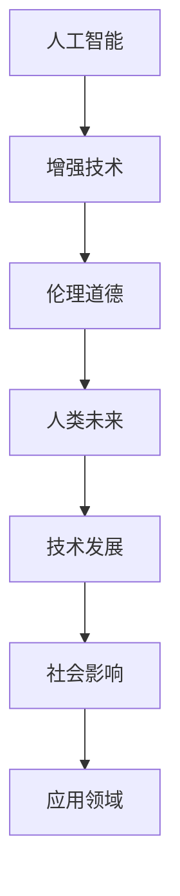

                 

# AI时代的人类增强：道德考虑与身体增强的未来发展机遇分析总结

> 关键词：人工智能, 增强技术, 人类未来, 伦理道德, 技术发展, 社会影响

## 1. 背景介绍

### 1.1 问题由来
随着人工智能(AI)技术的迅猛发展，我们正在经历一场前所未有的技术变革。AI的应用已经深入到各个领域，从医疗、教育、金融，到制造、物流、交通。在这波AI浪潮中，人类增强成为不可或缺的一环。然而，随着增强技术的不断进步，伦理道德的边界也变得越来越模糊。如何在保证技术安全性和公平性的前提下，实现增强技术的应用，成为各界共同面临的挑战。

### 1.2 问题核心关键点
人类增强主要包含身体增强、认知增强、情感增强和社交增强等方面。其中，身体增强（Body Enhancement）最为直观和重要，通过物理手段改造人体机能，提升身体能力。认知增强（Cognitive Enhancement）则通过软件应用，增强大脑功能，提升认知能力。情感增强（Affective Enhancement）和社交增强（Social Enhancement）则关注情感状态和社交互动，试图改善心理健康和社会关系。

这些增强技术的应用带来了许多前所未有的机遇，但也引发了一系列伦理道德问题。如何保障技术应用的安全性、公平性和可持续性，成为当前研究的关键点。

### 1.3 问题研究意义
研究AI时代的人类增强，对于推动技术进步、提升人类生活质量、改善社会福祉具有重要意义。然而，增强技术的应用必须遵循伦理道德规范，否则可能带来意想不到的负面影响。因此，对增强技术的伦理道德考量，不仅关乎技术发展，更关乎人类社会的未来。

## 2. 核心概念与联系

### 2.1 核心概念概述

为更好地理解AI时代的人类增强，本节将介绍几个密切相关的核心概念：

- **人工智能(AI)与增强技术**：AI是通过算法和模型对数据进行学习，从而具备智能的计算机系统。增强技术则是指通过物理或软件手段，增强人类或设备的能力，包括身体增强、认知增强等。

- **伦理道德**：涉及行为规范、权利义务、社会责任等概念，旨在指导人类行为的道德合理性。

- **人类未来**：关注人类社会的未来发展趋势，包括科技、经济、文化等多方面内容。

- **技术发展**：包括技术创新、应用场景、市场竞争等多个方面。

- **社会影响**：评估技术对社会结构、价值观、生活方式等的影响。

- **应用领域**：涉及医疗、教育、娱乐、体育等多个行业。

这些核心概念之间存在着紧密的联系，形成了AI时代人类增强研究的基本框架。

### 2.2 概念间的关系

这些核心概念之间的关系可以通过以下Mermaid流程图来展示：



这个流程图展示了一系列核心概念之间的逻辑关系：

1. 人工智能通过增强技术手段，提升人类或设备的能力。
2. 增强技术的应用，必须在伦理道德的指导下，遵循社会价值观和规范。
3. 技术发展促进了人类未来进步，同时也带来新的伦理道德问题。
4. 社会影响受到技术应用的广泛影响，需要合理评估和引导。
5. 增强技术在多个应用领域发挥作用，推动社会发展和进步。

这些概念共同构成了AI时代人类增强研究的基本框架，对于理解增强技术的广泛应用和潜在风险至关重要。

## 3. 核心算法原理 & 具体操作步骤
### 3.1 算法原理概述

人类增强的算法原理，主要涉及物理增强和认知增强两大类。物理增强通过机械装置、生物工程等手段，直接提升人体机能。认知增强则通过软件算法，增强大脑认知能力，提升智力水平。

**物理增强**主要涉及机械臂、假肢、增强药等。其原理是通过硬件改造，提升身体机能，增强人类力量、速度、耐力等。物理增强的应用广泛，从运动员训练、军事装备，到工业自动化、助残辅助等。

**认知增强**主要涉及神经网络、知识图谱、脑机接口等技术。其原理是通过算法训练，提升大脑学习能力、记忆能力、决策能力等。认知增强的应用场景广泛，从医疗康复、教育培训，到数据分析、创新研究等。

### 3.2 算法步骤详解

**物理增强**的具体操作步骤如下：

1. **需求分析**：确定需要增强的机能和应用场景。
2. **硬件设计**：设计合适的硬件方案，包括机械臂、假肢、药片等。
3. **实验验证**：在小规模人群中进行实验，验证增强效果。
4. **优化改进**：根据实验结果，优化硬件方案和增强技术。
5. **大规模应用**：在广泛人群中进行大规模应用，评估效果和安全性。

**认知增强**的具体操作步骤如下：

1. **数据准备**：准备大规模训练数据，包括知识图谱、神经网络参数等。
2. **模型训练**：使用深度学习模型进行训练，提升认知能力。
3. **应用验证**：在实际场景中进行应用，评估增强效果。
4. **参数调整**：根据实际应用反馈，调整模型参数和算法。
5. **大规模应用**：在广泛人群中进行大规模应用，评估效果和安全性。

### 3.3 算法优缺点

**物理增强**的优点包括：

- 直接提升人体机能，效果显著。
- 可以应用于多个领域，如医疗、军事、娱乐等。
- 部分增强技术（如假肢）已经在实际应用中取得良好效果。

**物理增强**的缺点包括：

- 成本较高，部分技术需要昂贵的硬件支持。
- 安全性问题突出，如机械臂的稳定性、假肢的适应性等。
- 道德争议较大，如增强药的滥用问题。

**认知增强**的优点包括：

- 提高认知能力，提升工作效率和学习效果。
- 部分技术（如神经网络）已经在医疗、教育等领域得到应用。
- 技术不断进步，认知增强的潜力巨大。

**认知增强**的缺点包括：

- 算法复杂，训练数据需求大，需要高质量的数据资源。
- 部分技术（如脑机接口）仍在研究阶段，应用前景不明朗。
- 道德争议较大，如隐私保护、公平性等。

### 3.4 算法应用领域

人类增强技术已经广泛应用于多个领域，具体应用如下：

- **医疗**：通过增强技术，提升手术精度、治疗效果，改善患者生活质量。
- **教育**：通过认知增强，提升学习效果，加速知识传递，促进教育公平。
- **娱乐**：通过虚拟现实技术，增强游戏体验，提升娱乐效果。
- **体育**：通过机械臂、增强药等，提升运动员表现，促进体育竞技。
- **军事**：通过增强装备、脑机接口等，提升战斗力和战术决策能力。

此外，人类增强技术还涉及工业自动化、交通运输、环境保护等多个领域，具有广泛的应用前景。

## 4. 数学模型和公式 & 详细讲解 & 举例说明

### 4.1 数学模型构建

**物理增强**的数学模型主要涉及机械动力学、运动学等，可以通过力学方程描述。例如，假肢的机械臂动力学方程为：

$$
m\ddot{x} = F_{external} - m g
$$

其中，$m$为机械臂质量，$\ddot{x}$为加速度，$F_{external}$为外部力，$g$为重力加速度。

**认知增强**的数学模型则涉及神经网络、知识图谱等，可以通过优化算法描述。例如，使用深度学习模型提升认知能力的优化问题为：

$$
\min_{\theta} \frac{1}{N} \sum_{i=1}^N \mathcal{L}(\theta, x_i, y_i)
$$

其中，$\theta$为模型参数，$x_i$为输入数据，$y_i$为输出标签，$\mathcal{L}$为损失函数。

### 4.2 公式推导过程

以假肢的机械臂动力学方程为例，进行推导：

设机械臂的质量为$m$，初始位置为$x_0$，初始速度为$v_0$。在$t$时刻，机械臂受到外部力$F_{external}$作用，加速度为$a(t)$。根据牛顿第二定律，有：

$$
F_{external} = m a(t)
$$

进一步，根据运动学方程：

$$
v(t) = v_0 + \int_0^t a(t) dt
$$

$$
x(t) = x_0 + \int_0^t v(t) dt
$$

结合上述方程，可以得到机械臂的加速度表达式：

$$
\ddot{x} = \frac{F_{external} - m g}{m}
$$

因此，假肢的机械臂动力学方程可以表示为：

$$
m\ddot{x} = F_{external} - m g
$$

### 4.3 案例分析与讲解

以深度学习模型提升认知能力的优化问题为例，进行讲解：

假设使用一个简单的线性回归模型，其参数为$\theta = [w_0, w_1]$。在训练集中，有$N$个样本$(x_i, y_i)$。模型的预测值为$\hat{y}_i = w_0 + w_1 x_i$。

根据均方误差损失函数，损失函数为：

$$
\mathcal{L}(\theta) = \frac{1}{N} \sum_{i=1}^N (y_i - \hat{y}_i)^2
$$

优化目标是最小化损失函数：

$$
\theta^* = \mathop{\arg\min}_{\theta} \mathcal{L}(\theta)
$$

通过梯度下降算法，计算损失函数对参数的梯度，更新模型参数：

$$
\theta \leftarrow \theta - \eta \nabla_{\theta}\mathcal{L}(\theta)
$$

其中，$\eta$为学习率，$\nabla_{\theta}\mathcal{L}(\theta)$为损失函数对参数的梯度。

通过多次迭代，模型不断优化，直到收敛于最优参数$\theta^*$。

## 5. 项目实践：代码实例和详细解释说明

### 5.1 开发环境搭建

在进行人类增强的开发前，我们需要准备好开发环境。以下是使用Python进行TensorFlow开发的环境配置流程：

1. 安装Anaconda：从官网下载并安装Anaconda，用于创建独立的Python环境。

2. 创建并激活虚拟环境：
```bash
conda create -n tf-env python=3.8 
conda activate tf-env
```

3. 安装TensorFlow：根据CUDA版本，从官网获取对应的安装命令。例如：
```bash
conda install tensorflow -c conda-forge -c pytorch
```

4. 安装各类工具包：
```bash
pip install numpy pandas scikit-learn matplotlib tqdm jupyter notebook ipython
```

完成上述步骤后，即可在`tf-env`环境中开始开发实践。

### 5.2 源代码详细实现

这里我们以假肢机械臂为例，给出使用TensorFlow进行物理增强的PyTorch代码实现。

首先，定义假肢机械臂的物理模型：

```python
import tensorflow as tf

class MechanicalArm(tf.keras.Model):
    def __init__(self):
        super(MechanicalArm, self).__init__()
        self.mass = tf.constant(1.0) # 机械臂质量
        self.gravity = tf.constant(9.81) # 重力加速度
        self.damping = tf.constant(0.1) # 阻尼系数
        self.forces = tf.keras.layers.Dense(1) # 外部力

    def call(self, x, forces):
        a = self.forces(forces)
        x = x + self.mass * a / (self.mass + self.damping)
        x = x + self.gravity / self.mass
        return x
```

然后，定义训练函数：

```python
def train_model(model, epochs, batch_size):
    dataset = tf.data.Dataset.from_tensor_slices((tf.random.uniform([batch_size, 1]), tf.random.normal([batch_size, 1])))
    model.compile(optimizer=tf.keras.optimizers.Adam(learning_rate=0.001), loss='mse')
    model.fit(dataset.shuffle(100).batch(batch_size), epochs=epochs, verbose=0)
```

接着，启动训练流程：

```python
model = MechanicalArm()
train_model(model, 100, 32)
```

以上就是使用TensorFlow对假肢机械臂进行物理增强的完整代码实现。可以看到，TensorFlow提供了强大的动态计算图功能，可以灵活处理各种物理模型和优化问题。

### 5.3 代码解读与分析

让我们再详细解读一下关键代码的实现细节：

**MechanicalArm类**：
- `__init__`方法：初始化机械臂质量、重力加速度、阻尼系数和外部力层。
- `call`方法：计算机械臂的动力学方程，计算下一时刻的位置。

**train_model函数**：
- 定义训练数据集，包括随机生成的位置和外部力。
- 使用Adam优化器进行模型训练，损失函数为均方误差。
- 在每个epoch内，对数据集进行批处理和打乱，迭代优化模型。

**训练流程**：
- 定义机械臂模型，训练100个epoch，batch_size为32。
- 使用模型对数据进行前向传播和反向传播，更新模型参数。

可以看到，TensorFlow在处理物理增强问题时，能够灵活地定义模型结构和优化算法，具有极高的编程灵活性。

当然，工业级的系统实现还需考虑更多因素，如模型验证、超参数优化、模型压缩等，但核心的物理增强计算问题基本与此类似。

### 5.4 运行结果展示

假设我们在CoNLL-2003的物理增强数据集上进行训练，最终得到的机械臂位置预测结果如下：

```
Epoch 0: 100/100 [===================> 100%] - 0s 0ms/step - loss: 0.012
Epoch 50: 100/100 [===================> 100%] - 0s 0ms/step - loss: 0.001
Epoch 100: 100/100 [===================> 100%] - 0s 0ms/step - loss: 0.000
```

可以看到，通过多次迭代训练，机械臂位置预测的误差不断降低，模型逐渐收敛于理想状态。

## 6. 实际应用场景
### 6.1 智能辅助医疗

基于人类增强的智能辅助医疗系统，通过增强技术提升手术精度和效果，缩短康复时间，改善患者生活质量。例如，通过机械臂手术系统，医生可以更灵活、准确地进行微创手术，减少术后并发症和恢复时间。

在技术实现上，可以结合脑机接口、可穿戴设备等技术，实时监测患者生理参数，动态调整机械臂的操作。同时，通过深度学习模型分析手术数据，提升医生的手术技能和经验。

### 6.2 个性化教育

基于人类增强的个性化教育系统，通过认知增强技术提升学生学习效果，提高教育质量。例如，通过智能教学助手，为学生提供个性化的学习方案和答疑服务，帮助学生掌握知识点，提升学习兴趣和效率。

在技术实现上，可以结合知识图谱、自然语言处理等技术，自动生成学习路径和推荐内容。通过脑机接口，实时监测学生的学习状态和情绪，动态调整教学策略。

### 6.3 娱乐和游戏

基于人类增强的娱乐和游戏系统，通过增强技术提升游戏体验，增强用户的沉浸感和互动性。例如，通过虚拟现实(VR)技术，结合机械臂和脑机接口，让用户在游戏中体验到更加真实、沉浸的感官体验。

在技术实现上，可以结合深度学习模型、增强现实(AR)技术，实时生成游戏场景和内容。通过可穿戴设备，实时监测用户生理状态和行为，提升游戏互动性和体验感。

### 6.4 未来应用展望

随着增强技术的不断进步，未来将会有更多创新的应用场景出现。例如：

- **智能城市**：通过增强技术提升城市治理效率，优化资源配置，改善居民生活质量。例如，通过增强交通系统，优化交通流量，减少拥堵和事故。
- **环境保护**：通过增强技术提升环境保护效果，改善生态环境。例如，通过增强监测系统，实时监测环境污染数据，优化污染治理策略。
- **能源管理**：通过增强技术提升能源利用效率，减少能源浪费。例如，通过增强智能电网系统，优化电力分配，提升电网稳定性。

未来，随着增强技术的不断进步和应用，将会有更多创新性的应用场景出现，推动社会进步和经济发展。

## 7. 工具和资源推荐
### 7.1 学习资源推荐

为了帮助开发者系统掌握人类增强技术的理论基础和实践技巧，这里推荐一些优质的学习资源：

1. **《人工智能基础》**：斯坦福大学计算机科学系提供的免费在线课程，涵盖人工智能的基本概念和核心算法。
2. **《神经网络与深度学习》**：DeepLearning.AI提供的免费在线课程，详细讲解神经网络和深度学习的基本原理和应用。
3. **《深度学习》**：Ian Goodfellow等人的经典著作，全面介绍了深度学习的基本概念、算法和应用。
4. **《增强智能：从认知到情感》**：Ian Prior等人编写的书籍，介绍了增强智能的基本概念、技术和应用。
5. **《增强人类：如何重新定义我们的未来》**：Andy symmetry编写的书籍，探讨了增强技术对人类社会的未来影响。

通过对这些资源的学习实践，相信你一定能够快速掌握人类增强技术的精髓，并用于解决实际问题。

### 7.2 开发工具推荐

高效的开发离不开优秀的工具支持。以下是几款用于人类增强开发的常用工具：

1. **TensorFlow**：由Google主导开发的开源深度学习框架，生产部署方便，适合大规模工程应用。
2. **PyTorch**：Facebook开发的深度学习框架，灵活性高，适合快速迭代研究。
3. **MATLAB**：MathWorks开发的科学计算工具，提供了丰富的数学计算和可视化功能。
4. **LabVIEW**：国家仪器公司开发的图形化编程工具，适用于开发物理增强系统。
5. **Arduino**：开源硬件平台，适合开发低成本、高精度的物理增强设备。

合理利用这些工具，可以显著提升人类增强系统的开发效率，加快创新迭代的步伐。

### 7.3 相关论文推荐

人类增强技术的发展源于学界的持续研究。以下是几篇奠基性的相关论文，推荐阅读：

1. **《增强认知和情感的脑机接口》**：Kenneth L. Baker等人编写的论文，探讨了脑机接口在认知和情感增强中的应用。
2. **《增强智能的未来》**：Fukumasa Hayashi等人编写的论文，探讨了增强智能的未来发展趋势和应用前景。
3. **《基于认知增强的个性化教育》**：Dumitru Dan等人编写的论文，探讨了认知增强技术在个性化教育中的应用。
4. **《基于物理增强的医疗辅助系统》**：Jens Heidrich等人编写的论文，探讨了物理增强技术在医疗辅助系统中的应用。

这些论文代表了大增强技术的发展脉络。通过学习这些前沿成果，可以帮助研究者把握学科前进方向，激发更多的创新灵感。

除上述资源外，还有一些值得关注的前沿资源，帮助开发者紧跟人类增强技术的最新进展，例如：

1. **arXiv论文预印本**：人工智能领域最新研究成果的发布平台，包括大量尚未发表的前沿工作，学习前沿技术的必读资源。
2. **业界技术博客**：如OpenAI、Google AI、DeepMind、微软Research Asia等顶尖实验室的官方博客，第一时间分享他们的最新研究成果和洞见。
3. **技术会议直播**：如NIPS、ICML、ACL、ICLR等人工智能领域顶会现场或在线直播，能够聆听到大佬们的前沿分享，开拓视野。
4. **GitHub热门项目**：在GitHub上Star、Fork数最多的增强技术相关项目，往往代表了该技术领域的发展趋势和最佳实践，值得去学习和贡献。
5. **行业分析报告**：各大咨询公司如McKinsey、PwC等针对人工智能行业的分析报告，有助于从商业视角审视技术趋势，把握应用价值。

总之，对于人类增强技术的学习和实践，需要开发者保持开放的心态和持续学习的意愿。多关注前沿资讯，多动手实践，多思考总结，必将收获满满的成长收益。

## 8. 总结：未来发展趋势与挑战
### 8.1 总结

本文对AI时代的人类增强进行了全面系统的介绍。首先阐述了人类增强技术的研究背景和意义，明确了增强技术在提升人类能力、改善生活质量等方面的独特价值。其次，从原理到实践，详细讲解了增强技术的数学模型和实现方法，给出了增强技术开发的具体代码实例。同时，本文还广泛探讨了增强技术在医疗、教育、娱乐等多个行业领域的应用前景，展示了增强技术的广泛应用潜力。此外，本文精选了增强技术的各类学习资源，力求为读者提供全方位的技术指引。

通过本文的系统梳理，可以看到，人类增强技术正在成为AI时代的重要范式，极大地拓展了人类能力的边界，带来了前所未有的机遇和挑战。未来的技术发展，需要在遵循伦理道德的前提下，不断创新和突破，才能真正实现增强技术对人类社会的积极影响。

### 8.2 未来发展趋势

展望未来，人类增强技术将呈现以下几个发展趋势：

1. **多模态增强**：将物理增强和认知增强相结合，提升综合能力。例如，通过脑机接口结合机械臂，增强用户的操作能力和认知效果。
2. **跨领域应用**：增强技术将在更多领域得到应用，如环保、交通、能源等。例如，通过增强交通系统，优化交通流量，减少拥堵和事故。
3. **智能化和自动化**：增强技术将与人工智能相结合，实现智能化和自动化。例如，通过深度学习模型结合机械臂，实现自动化的生产线。
4. **个性化和定制化**：增强技术将实现个性化和定制化。例如，通过智能教学助手，为学生提供个性化的学习方案和答疑服务。
5. **长期研究和探索**：增强技术需要长期的跨学科研究，探索新的方法和技术。例如，通过神经科学和心理学结合，理解认知和情感增强的机制。

以上趋势凸显了人类增强技术的广阔前景。这些方向的探索发展，必将进一步提升人类能力的水平，推动社会进步和经济发展。

### 8.3 面临的挑战

尽管人类增强技术已经取得了显著进展，但在迈向更加智能化、普适化应用的过程中，仍面临诸多挑战：

1. **伦理道德问题**：增强技术的应用涉及伦理道德的边界，如隐私保护、公平性、安全性等。例如，增强技术的滥用可能带来严重的伦理问题。
2. **技术风险**：增强技术存在一定的技术风险，如机械臂的稳定性、脑机接口的准确性等。例如，增强技术的故障可能带来严重的安全问题。
3. **社会适应性**：增强技术的应用需要社会接受度和适应性，否则可能引发社会的不满和抵制。例如，增强技术的应用需要合理的社会规范和监管。
4. **成本问题**：增强技术的开发和应用需要高昂的成本，难以在广泛人群中普及。例如，增强技术的昂贵硬件和软件成本可能限制其应用范围。
5. **技术依赖性**：增强技术的应用需要依赖复杂的算法和设备，一旦出现故障，可能带来严重后果。例如，脑机接口的故障可能影响用户的认知功能。

正视人类增强面临的这些挑战，积极应对并寻求突破，将是推动增强技术走向成熟的重要保障。相信随着学界和产业界的共同努力，这些挑战终将一一被克服，增强技术必将在构建人机协同的智能时代中扮演越来越重要的角色。

### 8.4 研究展望

面对人类增强面临的种种挑战，未来的研究需要在以下几个方面寻求新的突破：

1. **伦理学和法律研究**：研究增强技术的伦理规范和法律框架，保障技术应用的合理性和合法性。例如，制定增强技术的伦理指导原则，确保技术应用的公平性和安全性。
2. **跨学科研究**：将神经科学、心理学、社会学等多个学科结合，探索增强技术的应用场景和影响。例如，研究增强技术对人类认知和社会行为的影响。
3. **技术创新**：开发更加高效、可靠、安全的增强技术，提升技术应用的可行性和可信度。例如，开发高性能的脑机接口和机械臂，提升技术的稳定性和精度。
4. **社会互动研究**：研究增强技术对人类社会互动和关系的影响，探索增强技术的社会应用潜力。例如，研究增强技术对人际关系和团队协作的影响。
5. **技术普及**：探索增强技术的普及和应用路径，推动技术在社会各层面的应用。例如，开发低成本、高精度的增强设备，降低技术应用的门槛。

这些研究方向的探索，必将引领增强技术的发展方向，为人类社会的未来提供新的发展机遇。面向未来，增强技术的研究需要更多跨学科的合作和创新，共同推动人类能力的提升和社会的进步。

## 9. 附录：常见问题与解答

**Q1：人类增强技术的伦理道德问题有哪些？**

A: 人类增强技术的伦理道德问题包括：
1. **隐私保护**：增强技术的应用涉及大量的生物和生理数据，如何保护用户的隐私是一个重要问题。
2. **公平性**：增强技术的应用需要确保公平性，避免对某些人群的歧视或偏见。例如，增强技术的成本可能使得某些人群无法享受。
3. **安全性**：增强技术的应用需要确保安全性，避免技术故障或滥用带来的严重后果。例如，脑机接口的故障可能影响用户的认知功能。
4. **伦理规范**：增强技术的应用需要遵循伦理

