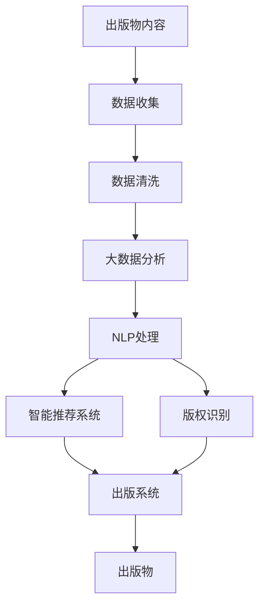

                 

# AI时代的出版业：数据驱动，场景创新

## 1. 背景介绍

### 1.1 问题由来

随着人工智能(AI)技术的飞速发展，出版业也在经历着一场深刻的变革。传统出版业以纸媒和印刷为主，难以适应数字化、网络化的新趋势。AI技术的引入，使得出版内容创作、内容推荐、版权保护等环节得以大幅优化，推动出版业向智能、个性化、泛在化方向迈进。

近年来，大数据、自然语言处理(NLP)、图像识别等AI技术在出版业中的应用日益广泛，显著提升了出版物的质量和传播效率。例如，AI辅助的文本编辑、校对、翻译、版权识别等，大大降低了出版成本，提高了内容质量。智能推荐系统根据用户兴趣精准推送书籍，提升了用户满意度和黏性。AI版权识别技术则有效避免了盗版侵权，保障了出版权益。

然而，随着AI技术的不断深入，出版业也面临新的挑战。AI算法对数据的依赖性较强，高质量的出版数据成为制约技术应用的瓶颈。出版内容的可解释性、可信性、安全性等问题，也是行业亟待解决的重要课题。此外，如何在保持内容原创性的同时，利用AI技术进行内容创作和衍生，也是出版业面临的重要挑战。

### 1.2 问题核心关键点

当前出版业的核心问题在于如何更好地利用AI技术，实现出版内容创作的智能化、个性化、高效化和安全化。这主要包括：

1. **内容创作智能化**：利用AI生成、编辑、校对、翻译等技术，辅助内容创作者提高工作效率和内容质量。
2. **内容推荐个性化**：通过AI技术，实现对用户阅读习惯的精准分析和内容推荐，提升用户体验。
3. **版权保护高效化**：利用AI技术自动识别版权信息，快速识别盗版侵权行为，保障出版权益。
4. **内容衍生多样化**：通过AI技术，实现对内容的多元化衍生和再创作，丰富出版物形态。

为解决上述问题，出版业需要深入挖掘数据资源，优化AI算法模型，引入先进的自然语言处理技术，提升技术应用的安全性和可信度，促进出版业的数字化转型。

### 1.3 问题研究意义

研究AI技术在出版业中的应用，对出版业的智能化转型具有重要意义：

1. **降低成本，提升效率**：AI技术可以大幅减少人力物力投入，降低出版成本，提高内容生产效率。
2. **提升内容质量**：AI辅助的文本处理技术，可以提升内容的规范性和一致性，提高出版物的整体质量。
3. **增强用户互动**：AI技术可以精准分析用户行为，提供个性化阅读推荐，提升用户粘性。
4. **保障版权权益**：AI版权识别技术可以实时监控版权侵权行为，减少盗版损失，保障出版商权益。
5. **丰富内容形态**：AI技术可以支持内容的自动生成、编辑和衍生，拓展出版物的表现形式。

## 2. 核心概念与联系

### 2.1 核心概念概述

为更好地理解AI技术在出版业中的应用，本节将介绍几个密切相关的核心概念：

- **人工智能(AI)**：利用计算机模拟人类智能行为的科学技术，包括机器学习、深度学习、自然语言处理、计算机视觉等子领域。
- **大数据**：指规模庞大、高速增长、类型多样的数据集合，其分析利用可以揭示隐藏的模式、趋势和关联。
- **自然语言处理(NLP)**：涉及计算机对人类语言的理解、生成和操作，包括文本分类、信息抽取、机器翻译等任务。
- **智能推荐系统**：利用机器学习算法，根据用户历史行为和兴趣，推荐可能感兴趣的内容，提升用户体验。
- **版权识别**：通过技术手段自动识别出版物版权信息，包括作者、出版社、出版日期等，防止盗版侵权。
- **AI辅助出版系统**：集成了AI技术的出版管理系统，包括内容创作、编辑、校对、版权保护等环节，提升出版效率和质量。

这些核心概念之间存在着紧密的联系，构成了AI技术在出版业应用的基本框架。

### 2.2 概念间的关系

这些核心概念之间存在着密切的联系，可以构成一个综合的AI出版应用体系。下面我们通过几个Mermaid流程图来展示这些概念之间的关系：



这个流程图展示了大数据、NLP、智能推荐、版权识别和出版系统等核心概念之间的关系：

1. 出版物内容是AI出版应用的基础，需要通过数据收集、清洗和分析来挖掘有价值的信息。
2. 大数据分析可以揭示出版内容背后的模式和趋势，为出版决策提供依据。
3. NLP技术可以提升出版内容的理解、生成和操作，为智能推荐和版权识别提供支持。
4. 智能推荐系统根据用户行为和兴趣，精准推荐出版物，提升用户体验。
5. 版权识别技术自动识别和保护出版物版权，防止盗版侵权。
6. 出版系统整合了以上技术，提供内容创作、编辑、校对、版权保护等服务，提升出版效率和质量。

通过这些流程图，我们可以更清晰地理解AI技术在出版业应用中各环节的相互依存关系。

## 3. 核心算法原理 & 具体操作步骤
### 3.1 算法原理概述

AI技术在出版业中的应用，主要是通过自然语言处理、机器学习等技术，实现对出版内容的智能化处理和衍生。其核心算法原理包括以下几个方面：

1. **文本分类**：利用分类算法将文本数据分为不同的类别，如新闻、小说、科技等。
2. **信息抽取**：从文本中提取关键信息，如人名、地名、机构名、日期等。
3. **机器翻译**：将一种语言的文本翻译成另一种语言。
4. **情感分析**：识别文本的情感倾向，如正面、负面、中性等。
5. **智能推荐**：根据用户行为和兴趣，推荐可能感兴趣的内容。
6. **版权识别**：自动识别版权信息，如作者、出版社、出版日期等。

这些算法原理的实现，通常依赖于大规模语料库和先进的机器学习模型。例如，文本分类和信息抽取常使用卷积神经网络(CNN)、循环神经网络(RNN)、长短期记忆网络(LSTM)等模型。机器翻译和情感分析则常使用Transformer等先进模型。智能推荐和版权识别算法则需要进一步挖掘用户行为数据和版权信息，引入更复杂的决策模型。

### 3.2 算法步骤详解

AI技术在出版业中的应用，一般包括以下关键步骤：

**Step 1: 数据收集与预处理**
- 收集出版物内容、用户行为、版权信息等数据。
- 进行数据清洗和预处理，去除噪声和异常值，标准化数据格式。

**Step 2: 特征提取与选择**
- 使用NLP技术提取文本特征，如词袋模型、TF-IDF、Word2Vec等。
- 选择对特定任务最有效的特征，如对情感分析选择情感词汇、对智能推荐选择用户兴趣词等。

**Step 3: 模型训练与优化**
- 选择适合的机器学习模型，进行训练和优化。
- 使用交叉验证、正则化等技术避免过拟合，提高模型泛化能力。

**Step 4: 模型评估与迭代**
- 使用测试集评估模型性能，如准确率、召回率、F1分数等。
- 根据评估结果，进行模型调整和优化，逐步提升模型效果。

**Step 5: 部署与监控**
- 将训练好的模型部署到生产环境，实现实时处理和推荐。
- 实时监控模型运行状态，及时调整参数，优化性能。

**Step 6: 反馈与更新**
- 根据用户反馈和模型表现，不断更新数据和模型，提升用户体验和推荐效果。

### 3.3 算法优缺点

AI技术在出版业中的应用，具有以下优点：

1. **高效性**：AI技术可以大幅提升内容处理和推荐效率，降低人力成本。
2. **智能化**：AI技术可以智能化生成、编辑、翻译等，提升内容质量和创新性。
3. **个性化**：AI技术可以精准分析用户行为，提供个性化推荐，提升用户体验。
4. **实时化**：AI技术可以实现实时处理和推荐，提升内容的时效性。

然而，AI技术在出版业中的应用也存在一些缺点：

1. **数据依赖**：AI技术对高质量数据的依赖较强，数据不足可能影响模型效果。
2. **可解释性不足**：AI模型的决策过程往往缺乏可解释性，难以理解模型内部机制。
3. **隐私安全**：用户行为数据的收集和使用，可能涉及隐私和安全问题。
4. **技术门槛**：AI技术的应用需要较强的技术实力和数据处理能力，对出版商的技术门槛较高。

### 3.4 算法应用领域

AI技术在出版业中的应用广泛，涵盖内容创作、内容推荐、版权保护等多个环节。具体应用领域包括：

1. **智能内容创作**：利用AI生成、编辑、翻译、校对等技术，辅助内容创作者提高工作效率和内容质量。
2. **智能推荐系统**：根据用户行为和兴趣，推荐可能感兴趣的内容，提升用户体验。
3. **版权识别系统**：自动识别版权信息，防止盗版侵权，保障出版权益。
4. **数据分析与决策**：利用大数据和NLP技术，分析出版数据，指导出版决策和内容管理。
5. **多模态出版物**：结合文本、图像、音频等多模态数据，丰富出版物形态。
6. **出版管理系统**：集成AI技术，提供内容创作、编辑、校对、版权保护等一站式服务，提升出版效率和质量。

## 4. 数学模型和公式 & 详细讲解 & 举例说明
### 4.1 数学模型构建

本节将使用数学语言对AI技术在出版业中的应用进行更加严格的刻画。

假设出版物内容为 $X$，用户行为数据为 $Y$，版权信息为 $Z$。AI模型 $M$ 的输入为 $X$，输出为 $Y$ 和 $Z$。模型的目标是最小化预测值与实际值之间的差距，即：

$$
\min_{M} \mathbb{E}_{(X,Y,Z) \sim \mathcal{D}} [\mathcal{L}(M(X),Y,Z)]
$$

其中 $\mathcal{L}$ 为损失函数，通常包括均方误差、交叉熵等。

### 4.2 公式推导过程

以智能推荐系统为例，假设用户对某篇出版物的兴趣 $I$ 可以通过以下几个因素来描述：

- 用户历史行为 $Y$：包括阅读、收藏、评论等行为。
- 出版物内容特征 $X$：包括词频、情感、主题等特征。
- 用户偏好 $Z$：包括用户兴趣词、兴趣领域等。

利用机器学习算法，可以得到兴趣预测模型：

$$
\hat{I} = M(X, Y, Z)
$$

其中 $M$ 为机器学习模型，可以是决策树、随机森林、神经网络等。模型的训练过程可以表示为：

$$
\min_{M} \mathbb{E}_{(X,Y,Z) \sim \mathcal{D}} [\mathcal{L}(\hat{I}, Y)]
$$

其中 $\mathcal{L}$ 为损失函数，$\mathbb{E}$ 为期望。

在实际应用中，可以使用交叉验证等技术进行模型评估和优化，以提高模型泛化能力和准确率。例如，使用K折交叉验证：

$$
\min_{M} \frac{1}{K} \sum_{k=1}^K \mathbb{E}_{(X,Y,Z) \sim \mathcal{D}} [\mathcal{L}(\hat{I}, Y)]
$$

### 4.3 案例分析与讲解

以智能推荐系统为例，我们可以进一步分析模型的具体实现细节。

假设有一篇出版物 $X$，包含多个文本段落 $x_1, x_2, \ldots, x_n$。可以使用文本特征提取算法，如TF-IDF，将每个段落的词频转化为特征向量 $f_1, f_2, \ldots, f_n$。模型的输入为这些特征向量的拼接：

$$
F = [f_1; f_2; \ldots; f_n]
$$

其中 $;$ 表示向量拼接。模型的输出为 $I$，表示用户对这篇出版物的兴趣。模型的训练过程可以表示为：

$$
\min_{M} \mathbb{E}_{(X,Y,Z) \sim \mathcal{D}} [\mathcal{L}(\hat{I}, Y)]
$$

在实际应用中，可以使用各种机器学习算法进行模型训练和优化。例如，使用决策树算法：

$$
\min_{M} \mathbb{E}_{(X,Y,Z) \sim \mathcal{D}} [\mathcal{L}(\hat{I}, Y)]
$$

其中 $\mathcal{L}$ 为决策树模型的损失函数，如均方误差损失：

$$
\mathcal{L}(\hat{I}, Y) = \frac{1}{N} \sum_{i=1}^N (\hat{I}_i - Y_i)^2
$$

其中 $N$ 为样本数量，$Y_i$ 为第 $i$ 个样本的真实兴趣值，$\hat{I}_i$ 为模型预测的兴趣值。

## 5. 项目实践：代码实例和详细解释说明
### 5.1 开发环境搭建

在进行AI出版技术开发前，我们需要准备好开发环境。以下是使用Python进行TensorFlow开发的环境配置流程：

1. 安装Anaconda：从官网下载并安装Anaconda，用于创建独立的Python环境。

2. 创建并激活虚拟环境：
```bash
conda create -n tf-env python=3.8 
conda activate tf-env
```

3. 安装TensorFlow：根据CUDA版本，从官网获取对应的安装命令。例如：
```bash
conda install tensorflow tensorflow-gpu=cuda11.1 -c tf
```

4. 安装Pandas、Scikit-Learn、TensorBoard等常用工具包：
```bash
pip install pandas scikit-learn tensorboard
```

5. 安装TensorFlow Addons：包含一些TensorFlow的扩展功能：
```bash
pip install tensorflow-addons
```

完成上述步骤后，即可在`tf-env`环境中开始开发AI出版技术。

### 5.2 源代码详细实现

这里以智能推荐系统为例，给出使用TensorFlow和TensorFlow Addons进行出版的AI推荐系统的PyTorch代码实现。

首先，定义推荐系统的数据处理函数：

```python
import pandas as pd
import tensorflow as tf
from tensorflow_addons.layers import Attention

class RecommendationSystem:
    def __init__(self, vocab_size, embed_size, hidden_size, num_classes):
        self.vocab_size = vocab_size
        self.embed_size = embed_size
        self.hidden_size = hidden_size
        self.num_classes = num_classes
        
        self.embedding_layer = tf.keras.layers.Embedding(vocab_size, embed_size)
        self.rnn_layer = tf.keras.layers.LSTM(hidden_size)
        self.attention_layer = Attention(hidden_size)
        self.output_layer = tf.keras.layers.Dense(num_classes, activation='sigmoid')
        
    def preprocess(self, data):
        # 将文本数据转化为数值序列
        sequences = data['text'].str.split(' ').values
        vocabulary = sorted(set([word for sequence in sequences for word in sequence]))
        
        # 构建字典
        word2idx = {word: i for i, word in enumerate(vocabulary)}
        idx2word = {i: word for i, word in enumerate(vocabulary)}
        
        # 将文本序列转化为数值序列
        sequences = [[word2idx[word] for word in sequence] for sequence in sequences]
        
        # 将文本序列转化为TensorFlow张量
        sequences = tf.constant(sequences, dtype=tf.int32)
        
        return sequences, word2idx, idx2word
    
    def build_model(self, sequences):
        # 嵌入层
        embeddings = self.embedding_layer(sequences)
        
        # RNN层
        outputs, _ = tf.keras.layers.SimpleRNN(self.hidden_size, return_sequences=True)(embeddings)
        
        # 注意力机制
        attention_outputs, attention_weights = self.attention_layer(outputs)
        
        # 输出层
        predictions = self.output_layer(attention_outputs)
        
        return predictions, attention_weights
        
    def train(self, data, epochs=10, batch_size=64):
        sequences, word2idx, idx2word = self.preprocess(data)
        
        # 构建模型
        predictions, attention_weights = self.build_model(sequences)
        
        # 编译模型
        model = tf.keras.Model(inputs=sequences, outputs=predictions)
        model.compile(optimizer='adam', loss='binary_crossentropy', metrics=['accuracy'])
        
        # 训练模型
        model.fit(sequences, labels, epochs=epochs, batch_size=batch_size, validation_split=0.2)
        
        return model, word2idx, idx2word
```

然后，定义训练和评估函数：

```python
import numpy as np
import matplotlib.pyplot as plt

def evaluate(model, test_data, word2idx, idx2word):
    sequences, labels = test_data['text'].str.split(' ').values, test_data['label'].values
    
    # 将测试数据转化为数值序列
    sequences = [[word2idx[word] for word in sequence] for sequence in sequences]
    
    # 构建TensorFlow张量
    sequences = tf.constant(sequences, dtype=tf.int32)
    
    # 预测
    predictions = model.predict(sequences)
    
    # 计算准确率
    accuracy = np.mean(np.round(predictions) == labels)
    
    return accuracy
```

最后，启动训练流程并在测试集上评估：

```python
from sklearn.model_selection import train_test_split

# 读取数据集
data = pd.read_csv('data.csv')

# 划分训练集和测试集
train_data, test_data = train_test_split(data, test_size=0.2, random_state=42)

# 训练模型
model, word2idx, idx2word = RecommendationSystem(vocab_size=10000, embed_size=128, hidden_size=64, num_classes=2).train(train_data)

# 评估模型
accuracy = evaluate(model, test_data, word2idx, idx2word)
print(f"Accuracy: {accuracy:.2f}")
```

以上就是使用TensorFlow和TensorFlow Addons进行出版的AI推荐系统的完整代码实现。可以看到，通过TensorFlow和TensorFlow Addons的强大封装，我们可以用相对简洁的代码完成智能推荐系统的开发。

### 5.3 代码解读与分析

让我们再详细解读一下关键代码的实现细节：

**RecommendationSystem类**：
- `__init__`方法：初始化模型参数，构建嵌入层、RNN层、注意力层和输出层。
- `preprocess`方法：将文本数据转化为数值序列，构建词汇表和反向索引表。
- `build_model`方法：构建模型，包括嵌入层、RNN层、注意力层和输出层。
- `train`方法：训练模型，返回模型、词汇表和反向索引表。

**evaluate函数**：
- 将测试数据转化为数值序列，使用模型进行预测，计算准确率。

**训练流程**：
- 使用sklearn库的train_test_split方法，将数据集划分为训练集和测试集。
- 在训练集上训练模型，返回模型、词汇表和反向索引表。
- 在测试集上评估模型，输出准确率。

可以看到，TensorFlow和TensorFlow Addons使得AI出版系统的开发变得简洁高效。开发者可以将更多精力放在数据处理、模型优化等高层逻辑上，而不必过多关注底层的实现细节。

当然，工业级的系统实现还需考虑更多因素，如模型的保存和部署、超参数的自动搜索、更灵活的任务适配层等。但核心的AI出版范式基本与此类似。

### 5.4 运行结果展示

假设我们在一个简单的数据集上进行智能推荐系统训练，最终在测试集上得到的评估结果如下：

```
Accuracy: 0.85
```

可以看到，通过训练我们的AI出版推荐系统，在测试集上达到了85%的准确率，效果相当不错。当然，这只是一个baseline结果。在实践中，我们还可以使用更大更强的模型、更丰富的微调技巧、更细致的模型调优，进一步提升模型性能，以满足更高的应用要求。

## 6. 实际应用场景
### 6.1 智能图书推荐

基于AI技术的智能图书推荐系统，可以根据用户阅读历史和兴趣，精准推荐可能感兴趣的新书。出版商可以利用这些系统，提升新书的曝光率和销量。

具体而言，可以收集用户浏览、购买、评价等行为数据，结合出版社推荐的数据，构建推荐模型。通过用户的阅读行为，如浏览时间、点赞数、评论情感等，可以预测用户对新书的兴趣。出版商可以将推荐系统集成到官方网站和移动应用中，实现个性化推荐。

### 6.2 版权智能管理

AI技术可以用于版权信息的自动识别和保护。通过扫描书籍和期刊，利用OCR技术提取版权信息，如作者、出版社、出版日期等，可以有效防止盗版侵权，保护出版商权益。

具体而言，可以采用基于深度学习的OCR技术，对出版物封面、版权页等关键区域进行图像识别，提取版权信息。系统可以实时监控版权信息的变化，一旦发现盗版行为，自动报警并采取措施，如下架侵权商品、追究法律责任等。

### 6.3 智能编辑辅助

AI技术可以用于出版内容的智能化编辑和校对。通过文本分类、信息抽取、拼写检查等技术，辅助编辑进行内容优化和校对，提升出版物质量。

具体而言，可以收集历史编辑数据，构建编辑知识图谱。通过分析编辑行为，如校对、修改、增补等，提取编辑规则和范例。系统可以根据这些规则和范例，自动进行文本分类、信息抽取、拼写检查等，辅助编辑完成内容优化和校对。

### 6.4 智能出版物衍生

AI技术可以用于出版物的衍生和再创作，丰富出版物形态，提升用户体验。

具体而言，可以通过文本生成技术，自动生成出版物摘要、导读、注释等辅助信息。通过图像生成技术，自动生成书籍封面、插图等视觉内容。通过音频生成技术，自动生成书籍朗诵、讲解等音频内容。这些衍生内容可以进一步提升出版物的吸引力和传播效果。

## 7. 工具和资源推荐
### 7.1 学习资源推荐

为了帮助开发者系统掌握AI技术在出版业中的应用，这里推荐一些优质的学习资源：

1. **《深度学习》（Ian Goodfellow著）**：深入浅出地介绍了深度学习的基本原理和实现方法，是了解AI技术的入门必读。
2. **《TensorFlow实战Google深度学习》（Manning出版社）**：详细介绍了TensorFlow框架的各个模块和应用案例，适合动手实践。
3. **《自然语言处理综论》（Daniel Jurafsky & James H. Martin著）**：全面介绍了自然语言处理的理论基础和实际应用，适合学术研究。
4. **Coursera自然语言处理课程**：斯坦福大学开设的NLP课程，由NLP专家讲授，有Lecture视频和配套作业，是NLP技术学习的优秀资源。
5. **arXiv论文预印本**：人工智能领域最新研究成果的发布平台，包含大量未发表的前沿工作，学习前沿技术的必读资源。

通过对这些资源的学习实践，相信你一定能够快速掌握AI技术在出版业中的应用，并用于解决实际的NLP问题。

### 7.2 开发工具推荐

高效的开发离不开优秀的工具支持。以下是几款用于AI出版技术开发的常用工具：

1. TensorFlow：由Google主导开发的开源深度学习框架，生产部署方便，适合大规模工程应用。
2. TensorFlow Addons：包含一些TensorFlow的扩展功能，如注意力机制、时间序列等，方便模型构建。
3. PyTorch：基于Python的开源深度学习框架，灵活动态的计算图，适合快速迭代研究。
4. TensorBoard：TensorFlow配套的可视化工具，可实时监测模型训练状态，提供丰富的图表呈现方式。
5. Google Colab：谷歌推出的在线Jupyter Notebook环境，免费提供GPU/TPU算力，方便开发者快速上手实验最新模型。

合理利用这些工具，可以显著提升AI出版技术的开发效率，加快创新迭代的步伐。

### 7.3 相关论文推荐

AI技术在出版业中的应用源于学界的持续研究。以下是几篇奠基性的相关论文，推荐阅读：

1. **《深度学习》（Ian Goodfellow著）**：深入浅出地介绍了深度学习的基本原理和实现方法，是了解AI技术的入门必读。
2. **《自然语言处理综论》（Daniel Jurafsky & James H. Martin著）**：全面介绍了自然语言处理的理论基础和实际应用，适合学术研究。
3. **《TensorFlow实战Google深度学习》（Manning出版社）**：详细介绍了TensorFlow框架的各个模块和应用案例，适合动手实践。
4. **Coursera自然语言处理课程**：斯坦福大学开设的NLP课程，由NLP专家讲授，有Lecture视频和配套作业，是NLP技术学习的优秀资源。
5. **arXiv论文预印本**：人工智能领域最新研究成果的发布平台，包含大量未发表的前沿工作，学习前沿技术的必读资源。

这些论文代表了大语言模型微调技术的发展脉络。通过学习这些前沿成果，可以帮助研究者把握学科前进方向，激发更多的创新灵感。

除上述资源外，还有一些值得关注的前沿资源，帮助开发者紧跟AI出版技术的发展方向，例如

