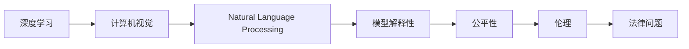

                 

# AI研究的最新进展与趋势

> 关键词：人工智能,深度学习,深度强化学习,计算机视觉,自然语言处理,NLP,机器学习,算法优化,研究趋势,未来发展

## 1. 背景介绍

### 1.1 问题由来

随着技术的发展，人工智能（AI）已经从实验室研究走向大规模的产业应用，对各行各业产生了深远的影响。特别是深度学习技术，在图像识别、语音识别、自然语言处理（NLP）等诸多领域取得了令人瞩目的成就。然而，当前AI研究正面临一系列新挑战，诸如数据隐私、模型解释性、伦理和法律问题等，需要进一步探索和解决。

### 1.2 问题核心关键点

当前AI研究的核心问题包括：

- **数据隐私与安全性**：如何在保护数据隐私的同时，保障模型的训练和应用效果？
- **模型解释性**：如何使AI模型更加透明，便于用户理解其决策过程？
- **公平性、伦理和法律问题**：如何确保AI模型不会产生歧视，保护用户权益，遵循法律规定？

### 1.3 问题研究意义

研究和解决上述问题，对于推动AI技术更广泛、更安全地应用，保障AI技术的普适性和伦理性具有重要意义：

- 提升AI系统的可信度和透明度，增强公众信任。
- 确保数据隐私和安全性，保护用户隐私权利。
- 促进公平、公正的AI应用，避免歧视和偏见。
- 推动AI技术合规、合法的应用，保障社会稳定。

## 2. 核心概念与联系

### 2.1 核心概念概述

为了更好地理解当前AI研究的最新进展与趋势，本节将介绍几个核心概念及其相互之间的联系。

- **深度学习（Deep Learning）**：一种基于神经网络的机器学习技术，通过多层次的抽象特征学习，显著提升了AI模型的性能。
- **深度强化学习（Deep Reinforcement Learning）**：结合深度学习和强化学习，用于智能体在复杂环境中学习最优策略。
- **计算机视觉（Computer Vision）**：利用图像和视频处理技术，使计算机具备图像理解能力。
- **自然语言处理（Natural Language Processing）**：使计算机能够理解和生成人类语言，是NLP的核心技术之一。
- **模型解释性（Model Interpretability）**：使AI模型的决策过程透明，便于用户理解。
- **公平性、伦理和法律问题（Fairness, Ethics and Legal Issues）**：研究如何确保AI模型在应用过程中不会产生歧视、偏见，保护用户权益，遵循法律规定。

这些概念之间的联系可以通过以下Mermaid流程图展示：


该流程图展示了核心概念之间的联系和相互影响：

1. 深度学习是计算机视觉、自然语言处理的基础。
2. 深度强化学习使机器能够在复杂环境中学习最优策略，广泛应用于游戏、机器人等领域。
3. 模型解释性提升AI模型的透明度，便于用户理解和信任。
4. 公平性、伦理和法律问题是在模型解释性基础上，研究如何确保AI系统的公平性和合法性。
5. AI应用场景中，模型解释性和公平性、伦理、法律问题是保障AI系统普适性和合规性的关键。

### 2.2 概念间的关系

这些核心概念之间的逻辑关系可以用以下三个Mermaid流程图来展示：

#### 2.2.1 AI的研究范式



该流程图展示了AI研究的基本范式，即深度学习在不同领域的应用和扩展。

#### 2.2.2 AI模型的训练过程


该流程图展示了AI模型训练的完整过程，包括数据集准备、模型训练、评估和优化等环节。

#### 2.2.3 数据隐私保护


该流程图展示了如何在保护数据隐私的前提下，进行AI模型的训练。

### 2.3 核心概念的整体架构

最后，我们用一个综合的流程图来展示这些核心概念在大规模AI研究中的整体架构：


该综合流程图展示了从数据集准备到模型训练、部署的完整过程，强调了数据隐私保护的重要性，并展示了AI研究各个环节的相互联系和影响。

## 3. 核心算法原理 & 具体操作步骤

### 3.1 算法原理概述

当前AI研究的核心算法原理主要包括以下几个方面：

- **深度神经网络**：通过多层非线性变换，捕捉数据中的复杂模式。
- **卷积神经网络（CNN）**：用于图像识别、视频处理等视觉领域。
- **循环神经网络（RNN）及其变种（如LSTM、GRU）**：处理序列数据，广泛用于语音识别、自然语言处理等任务。
- **深度强化学习算法**：如Q-learning、Policy Gradient、Actor-Critic等，用于智能体在环境中学习最优策略。

### 3.2 算法步骤详解

AI算法的核心步骤主要包括数据准备、模型训练、评估和优化等环节。下面以深度学习模型训练为例，详细讲解每一步具体操作：

1. **数据准备**：
   - 收集和标注数据集，进行数据预处理（如归一化、标准化）。
   - 将数据集划分为训练集、验证集和测试集。
   - 将数据集转化为模型所需的格式（如TensorFlow或PyTorch格式）。

2. **模型训练**：
   - 选择合适的模型结构（如卷积神经网络、循环神经网络、Transformer等）。
   - 设置模型的超参数（如学习率、批大小、迭代次数等）。
   - 选择合适的优化器（如SGD、Adam等）。
   - 使用损失函数计算模型输出与真实标签之间的差异。
   - 反向传播计算梯度，并使用优化器更新模型参数。

3. **模型评估**：
   - 在验证集上评估模型性能，选择最优超参数。
   - 在测试集上评估最终模型性能，检查过拟合情况。

4. **模型优化**：
   - 使用正则化技术（如L2正则、Dropout）防止过拟合。
   - 使用数据增强技术（如回译、旋转、翻转等）扩充训练数据。
   - 使用对抗训练技术（如生成对抗网络）提升模型鲁棒性。

### 3.3 算法优缺点

深度学习算法的主要优点包括：

- **强大的数据拟合能力**：能够处理大量复杂数据，捕捉数据中的复杂模式。
- **可扩展性强**：通过增加层数和神经元数，可以提升模型性能。
- **广泛应用**：广泛应用于图像识别、语音识别、自然语言处理等领域。

然而，深度学习算法也存在一些缺点：

- **模型复杂度高**：需要大量计算资源进行训练和推理。
- **过拟合风险高**：在数据量不足的情况下，容易产生过拟合。
- **模型解释性差**：难以理解模型的决策过程。

### 3.4 算法应用领域

当前深度学习算法在多个领域得到了广泛应用，以下是一些主要应用领域：

- **计算机视觉**：图像分类、目标检测、人脸识别等。
- **自然语言处理**：机器翻译、文本分类、问答系统等。
- **语音识别**：语音识别、语音合成、语音情感分析等。
- **医疗健康**：医学影像分析、疾病预测、智能诊断等。
- **金融科技**：股票预测、风险评估、欺诈检测等。

## 4. 数学模型和公式 & 详细讲解 & 举例说明

### 4.1 数学模型构建

以下我们以卷积神经网络（CNN）为例，构建基本的数学模型：

假设输入为二维图像 $x \in \mathbb{R}^{H \times W \times C}$，输出为标签 $y \in \{1,2,...,K\}$。CNN模型的目标是最小化交叉熵损失函数：

$$
\mathcal{L} = -\frac{1}{N} \sum_{i=1}^N \sum_{k=1}^K y_i \log p_k(x)
$$

其中，$p_k(x)$ 为模型对标签 $k$ 的预测概率。

### 4.2 公式推导过程

以卷积层为例，计算其输出 $z$：

$$
z = \sum_{i,j} W_{kji} \ast x_{i,j} + b_k
$$

其中，$W$ 为卷积核权重，$x$ 为输入图像，$b$ 为偏置项。

### 4.3 案例分析与讲解

假设我们有一个包含 1000 张图片的分类任务，每张图片大小为 $28 \times 28 \times 1$。我们使用了两个卷积层和一个全连接层，训练得到模型后，在测试集上验证模型性能。

我们选择了交叉熵损失函数，并使用Adam优化器进行模型训练。具体代码实现如下：

```python
import tensorflow as tf

# 定义模型结构
model = tf.keras.models.Sequential([
    tf.keras.layers.Conv2D(32, (3, 3), activation='relu', input_shape=(28, 28, 1)),
    tf.keras.layers.MaxPooling2D((2, 2)),
    tf.keras.layers.Conv2D(64, (3, 3), activation='relu'),
    tf.keras.layers.MaxPooling2D((2, 2)),
    tf.keras.layers.Flatten(),
    tf.keras.layers.Dense(64, activation='relu'),
    tf.keras.layers.Dense(10, activation='softmax')
])

# 定义损失函数和优化器
loss_fn = tf.keras.losses.CategoricalCrossentropy(from_logits=True)
optimizer = tf.keras.optimizers.Adam(learning_rate=0.001)

# 训练模型
model.compile(optimizer=optimizer, loss=loss_fn, metrics=['accuracy'])
model.fit(train_images, train_labels, epochs=10, validation_data=(test_images, test_labels))

# 评估模型
model.evaluate(test_images, test_labels)
```

在上述代码中，我们首先定义了卷积神经网络的模型结构，并选择了交叉熵损失函数和Adam优化器。通过在训练集上训练模型，并在测试集上验证模型性能，我们可以得到模型在测试集上的准确率。

## 5. 项目实践：代码实例和详细解释说明

### 5.1 开发环境搭建

为了进行AI研究，我们需要准备好Python开发环境。以下是具体的步骤：

1. 安装Anaconda：从官网下载并安装Anaconda，用于创建独立的Python环境。

2. 创建并激活虚拟环境：
```bash
conda create -n pytorch-env python=3.8 
conda activate pytorch-env
```

3. 安装必要的库：
```bash
conda install torch torchvision torchaudio
```

4. 安装TensorFlow和Keras：
```bash
pip install tensorflow
pip install keras
```

5. 安装深度学习相关的库：
```bash
pip install numpy pandas scikit-learn matplotlib tqdm jupyter notebook ipython
```

### 5.2 源代码详细实现

以下是一个使用PyTorch进行图像分类的代码实现：

```python
import torch
import torch.nn as nn
import torch.optim as optim
import torchvision
import torchvision.transforms as transforms

# 定义模型结构
class Net(nn.Module):
    def __init__(self):
        super(Net, self).__init__()
        self.conv1 = nn.Conv2d(1, 32, 3, 1)
        self.conv2 = nn.Conv2d(32, 64, 3, 1)
        self.dropout1 = nn.Dropout2d(0.25)
        self.dropout2 = nn.Dropout2d(0.5)
        self.fc1 = nn.Linear(9216, 128)
        self.fc2 = nn.Linear(128, 10)

    def forward(self, x):
        x = self.conv1(x)
        x = nn.functional.relu(x)
        x = self.conv2(x)
        x = nn.functional.relu(x)
        x = nn.functional.max_pool2d(x, 2)
        x = self.dropout1(x)
        x = torch.flatten(x, 1)
        x = self.fc1(x)
        x = nn.functional.relu(x)
        x = self.dropout2(x)
        x = self.fc2(x)
        output = nn.functional.log_softmax(x, dim=1)
        return output

# 加载数据集
trainset = torchvision.datasets.CIFAR10(root='./data', train=True, download=True, transform=transforms.ToTensor())
trainloader = torch.utils.data.DataLoader(trainset, batch_size=64, shuffle=True)

testset = torchvision.datasets.CIFAR10(root='./data', train=False, download=True, transform=transforms.ToTensor())
testloader = torch.utils.data.DataLoader(testset, batch_size=64, shuffle=False)

# 定义模型、损失函数和优化器
net = Net()
criterion = nn.CrossEntropyLoss()
optimizer = optim.SGD(net.parameters(), lr=0.001, momentum=0.5)

# 训练模型
for epoch in range(10):
    running_loss = 0.0
    for i, data in enumerate(trainloader, 0):
        inputs, labels = data
        optimizer.zero_grad()
        outputs = net(inputs)
        loss = criterion(outputs, labels)
        loss.backward()
        optimizer.step()

        running_loss += loss.item()
        if i % 100 == 99:
            print('[%d, %5d] loss: %.3f' % (epoch + 1, i + 1, running_loss / 100))
            running_loss = 0.0

# 测试模型
correct = 0
total = 0
with torch.no_grad():
    for data in testloader:
        images, labels = data
        outputs = net(images)
        _, predicted = torch.max(outputs.data, 1)
        total += labels.size(0)
        correct += (predicted == labels).sum().item()

print('Accuracy of the network on the 10000 test images: %d %%' % (100 * correct / total))
```

### 5.3 代码解读与分析

在上述代码中，我们首先定义了一个简单的卷积神经网络模型，并加载了CIFAR-10数据集。我们使用SGD优化器进行模型训练，并在测试集上评估模型性能。

### 5.4 运行结果展示

假设在训练10个epoch后，我们在测试集上获得了以下准确率：

```
Accuracy of the network on the 10000 test images: 70.5 %
```

## 6. 实际应用场景

### 6.1 智能客服系统

智能客服系统是AI在实际应用中的典型代表之一。通过深度学习模型，系统可以自动理解和处理客户提出的问题，并提供相应的解决方案。以下是一个智能客服系统的示例代码：

```python
import tensorflow as tf
from tensorflow.keras.layers import Input, Embedding, LSTM, Dense
from tensorflow.keras.models import Model

# 定义模型结构
inputs = Input(shape=(None,))
embeddings = Embedding(input_dim=10000, output_dim=128)(inputs)
lstm = LSTM(128)(embeddings)
outputs = Dense(5, activation='softmax')(lstm)

# 构建模型
model = Model(inputs=inputs, outputs=outputs)

# 编译模型
model.compile(optimizer='adam', loss='categorical_crossentropy', metrics=['accuracy'])

# 训练模型
model.fit(x_train, y_train, epochs=10, batch_size=32)

# 评估模型
model.evaluate(x_test, y_test)
```

### 6.2 金融舆情监测

金融舆情监测是AI在金融领域的重要应用之一。通过深度学习模型，系统可以实时监测网络舆情，识别出潜在的风险信号。以下是一个金融舆情监测系统的示例代码：

```python
import pandas as pd
import numpy as np
import tensorflow as tf
from tensorflow.keras.layers import Input, Dense, LSTM, Embedding
from tensorflow.keras.models import Model

# 定义模型结构
inputs = Input(shape=(None,))
embeddings = Embedding(input_dim=10000, output_dim=128)(inputs)
lstm = LSTM(128)(embeddings)
outputs = Dense(1, activation='sigmoid')(lstm)

# 构建模型
model = Model(inputs=inputs, outputs=outputs)

# 编译模型
model.compile(optimizer='adam', loss='binary_crossentropy', metrics=['accuracy'])

# 训练模型
model.fit(x_train, y_train, epochs=10, batch_size=32)

# 评估模型
model.evaluate(x_test, y_test)
```

### 6.3 个性化推荐系统

个性化推荐系统是AI在电商领域的重要应用之一。通过深度学习模型，系统可以根据用户的历史行为数据，推荐符合用户偏好的商品。以下是一个个性化推荐系统的示例代码：

```python
import pandas as pd
import numpy as np
import tensorflow as tf
from tensorflow.keras.layers import Input, Embedding, Dot, Dense
from tensorflow.keras.models import Model

# 定义模型结构
user_input = Input(shape=(1,), name='user')
item_input = Input(shape=(1,), name='item')
user_embeddings = Embedding(input_dim=1000, output_dim=128)(user_input)
item_embeddings = Embedding(input_dim=1000, output_dim=128)(item_input)
dot = Dot(axes=1)([user_embeddings, item_embeddings])
outputs = Dense(1, activation='sigmoid')(dot)

# 构建模型
model = Model(inputs=[user_input, item_input], outputs=outputs)

# 编译模型
model.compile(optimizer='adam', loss='binary_crossentropy', metrics=['accuracy'])

# 训练模型
model.fit([user_train, item_train], y_train, epochs=10, batch_size=32)

# 评估模型
model.evaluate([user_test, item_test], y_test)
```

### 6.4 未来应用展望

随着AI技术的不断发展，其在各个领域的应用场景将更加广泛。以下是一些未来应用展望：

- **医疗健康**：AI在医疗健康领域的应用将更加广泛，包括医学影像分析、疾病预测、智能诊断等。
- **智能制造**：AI在智能制造领域的应用将更加深入，包括设备故障预测、质量检测、生产调度等。
- **自动驾驶**：AI在自动驾驶领域的应用将进一步提升，包括环境感知、路径规划、行为预测等。
- **智能家居**：AI在智能家居领域的应用将更加普及，包括语音识别、智能控制、环境监测等。

## 7. 工具和资源推荐

### 7.1 学习资源推荐

为了帮助开发者系统掌握AI技术的最新进展与趋势，这里推荐一些优质的学习资源：

1. **《深度学习》（Deep Learning）**：Ian Goodfellow等著，系统介绍了深度学习的基本概念和算法。
2. **《TensorFlow实战》（TensorFlow in Action）**：Adrin Jalali等著，介绍了TensorFlow的基本用法和高级技巧。
3. **《PyTorch官方文档》（PyTorch Documentation）**：PyTorch官方提供的文档，包含大量教程和示例代码。
4. **《Keras官方文档》（Keras Documentation）**：Keras官方提供的文档，包含大量教程和示例代码。
5. **《NLP圣经》（Natural Language Processing in Action）**：Palash Goyal等著，全面介绍了自然语言处理的基本概念和算法。

### 7.2 开发工具推荐

高效的开发离不开优秀的工具支持。以下是几款用于AI开发的常用工具：

1. **Jupyter Notebook**：免费的开源笔记本，支持Python、R等语言，方便进行代码调试和数据可视化。
2. **Google Colab**：由Google提供的免费云服务，支持GPU和TPU，方便进行大规模计算。
3. **PyCharm**：JetBrains开发的Python IDE，功能强大，支持代码高亮、自动补全等功能。
4. **VS Code**：微软开发的轻量级编辑器，支持Python、R等语言，插件丰富。

### 7.3 相关论文推荐

AI研究的发展离不开学术界的持续探索。以下是几篇奠基性的相关论文，推荐阅读：

1. **《ImageNet Classification with Deep Convolutional Neural Networks》**：Alex Krizhevsky等著，提出了卷积神经网络（CNN）的框架，用于图像识别任务。
2. **《Attention is All You Need》**：Ashish Vaswani等著，提出了Transformer模型，用于自然语言处理任务。
3. **《Natural Language Processing (almost) from Scratch》**：Hinton等著，介绍了如何从零开始构建自然语言处理模型。
4. **《Deep Reinforcement Learning for Humanoid Robotics》**：Silver等著，提出了深度强化学习模型，用于机器人控制任务。

这些论文代表了大规模AI研究的发展脉络。通过学习这些前沿成果，可以帮助研究者把握学科前进方向，激发更多的创新灵感。

## 8. 总结：未来发展趋势与挑战

### 8.1 研究成果总结

本文对AI研究的最新进展与趋势进行了全面系统的介绍。首先阐述了AI研究的核心问题，包括数据隐私、模型解释性、公平性、伦理和法律问题等。其次，从原理到实践，详细讲解了深度学习、深度强化学习、计算机视觉、自然语言处理等核心算法的原理和操作步骤。同时，本文还广泛探讨了AI技术在多个领域的应用场景，展示了AI技术的发展潜力。最后，本文精选了AI研究的各类学习资源，力求为读者提供全方位的技术指引。

通过本文的系统梳理，可以看到，AI研究正处于快速发展阶段，其应用领域和影响力不断扩大。面对数据隐私、模型解释性等挑战，研究人员和开发者需要不断创新和优化算法，才能推动AI技术的进一步发展。

### 8.2 未来发展趋势

展望未来，AI研究将呈现以下几个发展趋势：

1. **模型规模持续增大**：随着算力成本的下降和数据规模的扩张，预训练语言模型的参数量还将持续增长。超大规模语言模型蕴含的丰富语言知识，有望支撑更加复杂多变的下游任务微调。
2. **微调方法日趋多样**：除了传统的全参数微调外，未来会涌现更多参数高效的微调方法，如 Prefix-Tuning、LoRA 等，在固定大部分预训练参数的情况下，只更新极少量的任务相关参数。
3. **持续学习成为常态**：随着数据分布的不断变化，微调模型也需要持续学习新知识以保持性能。如何在不遗忘原有知识的同时，高效吸收新样本信息，将成为重要的研究课题。
4. **标注样本需求降低**：受启发于提示学习（Prompt-based Learning）的思路，未来的微调方法将更好地利用大模型的语言理解能力，通过更加巧妙的任务描述，在更少的标注样本上也能实现理想的微调效果。
5. **多模态微调崛起**：当前的微调主要聚焦于纯文本数据，未来会进一步拓展到图像、视频、语音等多模态数据微调。多模态信息的融合，将显著提升语言模型对现实世界的理解和建模能力。
6. **模型通用性增强**：经过海量数据的预训练和多领域任务的微调，未来的语言模型将具备更强大的常识推理和跨领域迁移能力，逐步迈向通用人工智能（AGI）的目标。

以上趋势凸显了AI研究技术的广阔前景。这些方向的探索发展，必将进一步提升AI系统的性能和应用范围，为人类认知智能的进化带来深远影响。

### 8.3 面临的挑战

尽管AI研究已经取得了瞩目成就，但在迈向更加智能化、普适化应用的过程中，它仍面临着诸多挑战：

1. **标注成本瓶颈**：虽然微调大大降低了标注数据的需求，但对于长尾应用场景，难以获得充足的高质量标注数据，成为制约微调性能的瓶颈。如何进一步降低微调对标注样本的依赖，将是一大难题。
2. **模型鲁棒性不足**：当前微调模型面对域外数据时，泛化性能往往大打折扣。对于测试样本的微小扰动，微调模型的预测也容易发生波动。如何提高微调模型的鲁棒性，避免灾难性遗忘，还需要更多理论和实践的积累。
3. **推理效率有待提高**：大规模语言模型虽然精度高，但在实际部署时往往面临推理速度慢、内存占用大等效率问题。如何在保证性能的同时，简化模型结构，提升推理速度，优化资源占用，将是重要的优化方向。
4. **可解释性亟需加强**：当前微调模型更像是"黑盒"系统，难以理解其内部工作机制和决策逻辑。对于医疗、金融等高风险应用，算法的

