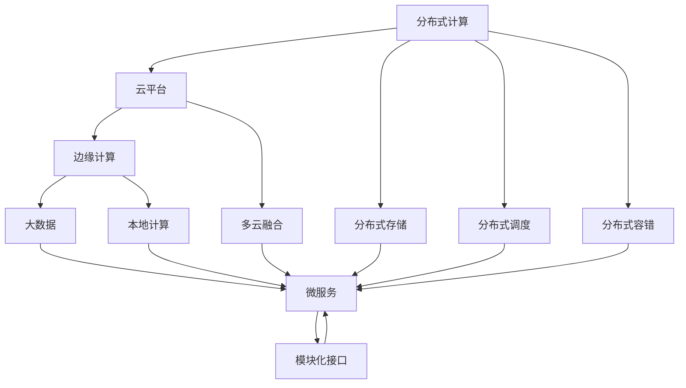
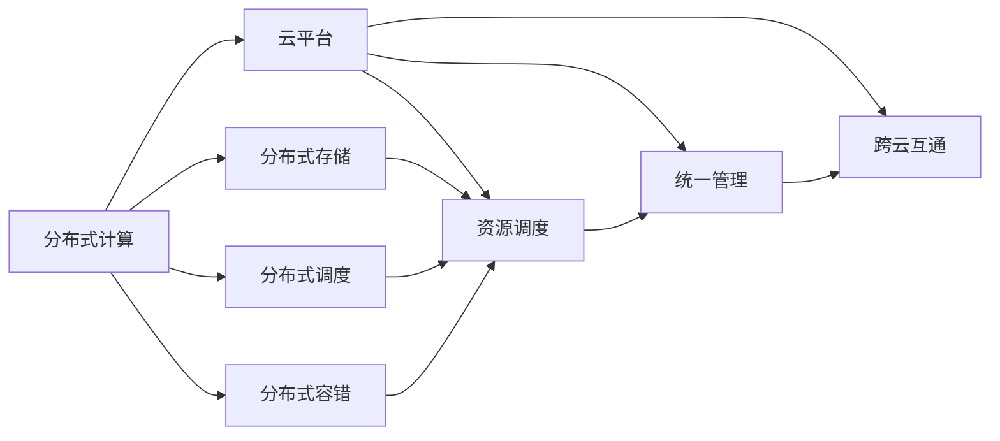
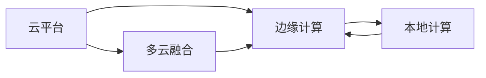
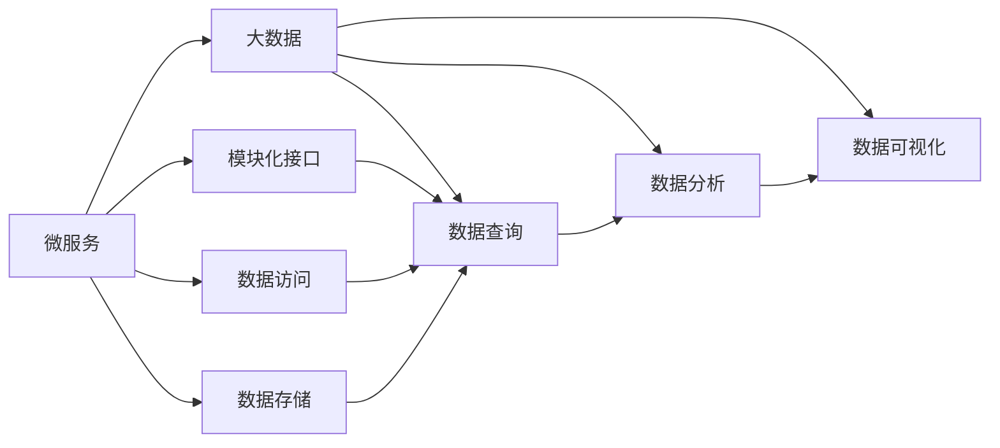
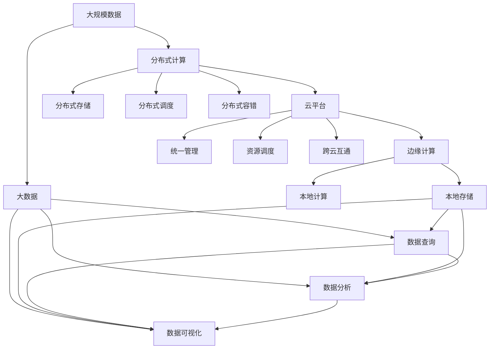

                 

## AI自动化数字基础设施

> 关键词：
1. AI自动化
2. 数字基础设施
3. 分布式计算
4. 云平台
5. 边缘计算
6. 大数据
7. 微服务

## 1. 背景介绍

### 1.1 问题由来

随着人工智能技术的迅猛发展，企业对数字基础设施的依赖日益加深。然而，在数字化转型过程中，企业面临诸多挑战，如云计算资源调度困难、边缘计算环境异构、数据管理复杂等问题。AI自动化数字基础设施的出现，为企业提供了一种高效、稳定、易用的大数据和AI应用基础设施，极大提升了企业的数据治理能力、AI应用部署速度和业务效率。

### 1.2 问题核心关键点

AI自动化数字基础设施的核心关键点包括：

- 分布式计算：通过多台计算资源的协同工作，大幅提升数据处理和模型训练的速度和效率。
- 云平台：提供统一的资源调度和管理服务，方便企业使用和管理计算资源。
- 边缘计算：在数据产生地或用户设备上执行计算，减少网络延迟，提高数据处理速度。
- 大数据：通过存储和分析海量数据，提取有价值的信息，支持决策和智能应用。
- 微服务：将复杂的应用拆分为多个小的、独立的服务，提高系统的灵活性和可维护性。

这些关键点共同构成了AI自动化数字基础设施的核心技术框架，使得企业在数字化转型过程中能够高效地部署和管理AI应用。

### 1.3 问题研究意义

AI自动化数字基础设施的研究意义主要体现在以下几个方面：

1. **提升效率**：通过自动化和大规模分布式计算，极大提升数据处理和模型训练速度，缩短业务迭代周期。
2. **降低成本**：减少人工干预和资源浪费，通过统一管理和优化调度，降低云计算成本。
3. **提高灵活性**：通过微服务架构，提高系统的扩展性和灵活性，便于业务快速迭代和扩展。
4. **增强稳定性**：通过边缘计算和多副本机制，提高系统的容错性和稳定性，保障业务连续性。
5. **支持多样性**：通过多云融合和跨云互通，支持企业多样化的计算和数据需求。

总之，AI自动化数字基础设施不仅提升了企业的数字化转型速度和质量，也为企业未来的业务发展和智能化创新提供了坚实的基础。

## 2. 核心概念与联系

### 2.1 核心概念概述

为更好地理解AI自动化数字基础设施的核心概念，本节将介绍几个密切相关的核心概念：

- **分布式计算**：指通过多台计算资源的协同工作，提高数据处理和模型训练的速度和效率。
- **云平台**：提供统一的资源调度和管理服务，方便企业使用和管理计算资源。
- **边缘计算**：在数据产生地或用户设备上执行计算，减少网络延迟，提高数据处理速度。
- **大数据**：通过存储和分析海量数据，提取有价值的信息，支持决策和智能应用。
- **微服务**：将复杂的应用拆分为多个小的、独立的服务，提高系统的灵活性和可维护性。

这些核心概念之间的逻辑关系可以通过以下Mermaid流程图来展示：



这个流程图展示了各个核心概念之间的联系和互动关系：

1. 分布式计算通过分布式存储和调度，支持大规模数据处理和模型训练。
2. 云平台提供统一的资源管理和调度服务，支持分布式计算和多云融合。
3. 边缘计算在本地执行计算，减少网络延迟，提高数据处理速度。
4. 大数据通过存储和分析海量数据，支持决策和智能应用。
5. 微服务通过模块化接口，提高系统的灵活性和可维护性。

### 2.2 概念间的关系

这些核心概念之间存在着紧密的联系，形成了AI自动化数字基础设施的整体架构。下面我们通过几个Mermaid流程图来展示这些概念之间的关系。

#### 2.2.1 分布式计算与云平台的关系



这个流程图展示了分布式计算与云平台之间的联系。分布式计算通过分布式存储、调度和容错，提供高效的数据处理和模型训练能力。云平台通过资源调度和统一管理，支持分布式计算和跨云互通。

#### 2.2.2 云平台与边缘计算的关系



这个流程图展示了云平台与边缘计算之间的关系。云平台通过多云融合，支持边缘计算在本地执行计算。边缘计算通过本地计算，减少网络延迟，提高数据处理速度。

#### 2.2.3 微服务与大数据的关系



这个流程图展示了微服务与大数据之间的关系。微服务通过模块化接口，支持大数据的存储和分析。大数据通过数据查询、分析和可视化，提取有价值的信息，支持决策和智能应用。

### 2.3 核心概念的整体架构

最后，我们用一个综合的流程图来展示这些核心概念在大规模数据处理和AI应用中的整体架构：



这个综合流程图展示了从大规模数据处理到AI应用的全过程。大规模数据通过分布式计算和存储，支持高效的数据处理和模型训练。云平台通过统一管理和调度，支持分布式计算和跨云互通。边缘计算通过本地存储和计算，减少网络延迟，提高数据处理速度。大数据通过数据查询、分析和可视化，提取有价值的信息，支持决策和智能应用。微服务通过模块化接口，提高系统的灵活性和可维护性。

## 3. 核心算法原理 & 具体操作步骤

### 3.1 算法原理概述

AI自动化数字基础设施的核心算法原理主要包括：

- 分布式计算算法：通过多台计算资源的协同工作，提高数据处理和模型训练的速度和效率。
- 云平台调度算法：通过优化资源调度和分配，提高计算资源的使用效率和稳定性。
- 边缘计算算法：通过本地计算和存储，减少网络延迟，提高数据处理速度。
- 大数据存储与分析算法：通过存储和分析海量数据，提取有价值的信息，支持决策和智能应用。
- 微服务架构设计：通过模块化接口和服务管理，提高系统的灵活性和可维护性。

这些算法原理共同构成了AI自动化数字基础设施的技术基础，使得企业在数字化转型过程中能够高效地部署和管理AI应用。

### 3.2 算法步骤详解

AI自动化数字基础设施的实现步骤主要包括以下几个关键步骤：

**Step 1: 准备数据与环境**
- 收集和处理大规模数据，进行数据清洗和预处理。
- 选择合适的云平台，配置计算资源和存储资源。
- 部署边缘计算环境，选择合适的本地存储和计算资源。

**Step 2: 分布式计算与存储**
- 使用分布式计算框架（如Spark、Hadoop）进行数据处理和模型训练。
- 使用分布式存储系统（如HDFS、Ceph）存储大规模数据。
- 设计合理的分布式调度和容错机制，确保计算和存储的稳定性和可靠性。

**Step 3: 云平台资源管理**
- 通过云平台API进行资源调度和管理，优化计算资源的使用效率。
- 利用云平台的多云融合功能，支持边缘计算和多云互通。
- 定期进行资源使用监控和优化，降低云计算成本。

**Step 4: 边缘计算与本地存储**
- 在数据产生地或用户设备上部署边缘计算节点。
- 使用本地存储系统（如Redis、Kafka）进行数据存储和缓存。
- 通过本地计算和数据处理，减少网络延迟，提高数据处理速度。

**Step 5: 大数据存储与分析**
- 使用大数据存储系统（如Hive、HBase）进行数据存储和查询。
- 使用大数据分析工具（如Presto、Spark SQL）进行数据分析和处理。
- 通过数据可视化工具（如Tableau、Power BI）进行数据展示和分析。

**Step 6: 微服务架构设计**
- 将复杂的应用拆分为多个小的、独立的服务。
- 设计统一的模块化接口和数据访问协议。
- 使用服务管理工具（如Docker、Kubernetes）进行服务管理和调度。

通过以上步骤，企业可以构建高效的AI自动化数字基础设施，支持大规模数据处理和AI应用部署。

### 3.3 算法优缺点

AI自动化数字基础设施具有以下优点：

- 高效性：通过分布式计算和存储，大幅提升数据处理和模型训练的速度和效率。
- 稳定性：通过云平台资源管理和边缘计算，提高系统的容错性和稳定性。
- 灵活性：通过微服务架构设计，提高系统的扩展性和灵活性。
- 可维护性：通过模块化接口和服务管理，提高系统的可维护性和易用性。

同时，这些技术也存在一些缺点：

- 资源消耗大：大规模分布式计算和存储需要大量的计算和存储资源，成本较高。
- 部署复杂：需要选择合适的硬件和软件环境，进行复杂的网络和配置工作。
- 技术门槛高：需要具备丰富的计算和数据处理经验，才能有效管理和优化系统。
- 数据安全风险：大规模数据存储和处理存在数据泄露和隐私风险，需要加强数据保护和隐私管理。

尽管存在这些缺点，但AI自动化数字基础设施在提高企业数字化转型效率和质量方面，具有不可替代的作用。

### 3.4 算法应用领域

AI自动化数字基础设施已经在多个领域得到了广泛应用，例如：

- **金融行业**：通过分布式计算和边缘计算，快速处理海量交易数据，支持高频交易和风险管理。
- **医疗行业**：通过大数据分析和微服务架构，支持远程医疗和智能诊断，提升医疗服务质量。
- **制造行业**：通过边缘计算和工业物联网（IIoT），实现实时数据监控和设备维护，提升生产效率。
- **零售行业**：通过大数据分析和微服务架构，优化库存管理和客户服务，提升用户体验和销售业绩。
- **智能城市**：通过边缘计算和物联网（IoT），实现智能交通和环境监测，提升城市管理水平。

随着AI技术的不断发展，AI自动化数字基础设施将广泛应用于更多行业，推动数字化转型和智能化创新。

## 4. 数学模型和公式 & 详细讲解 & 举例说明

### 4.1 数学模型构建

在AI自动化数字基础设施中，数学模型主要涉及以下几个方面：

- 分布式计算的调度模型：用于优化资源分配和调度的数学模型。
- 云平台资源管理模型：用于优化资源调度和使用的数学模型。
- 边缘计算的本地计算模型：用于优化本地计算和存储的数学模型。
- 大数据存储和分析模型：用于数据存储和查询的数学模型。
- 微服务架构的设计模型：用于服务拆分和调度的数学模型。

这些数学模型共同构成了AI自动化数字基础设施的理论基础，使得企业在数字化转型过程中能够高效地部署和管理AI应用。

### 4.2 公式推导过程

以下我们以分布式计算的调度模型为例，推导其核心公式。

假设系统中有$n$个计算节点，每个节点的计算能力为$c_i$，任务$j$需要计算的时间为$t_j$。设任务$j$分配到节点$i$的概率为$p_{i,j}$，任务调度过程满足马尔可夫决策过程（MDP）。则系统调度目标函数为：

$$
\min_{p} \sum_{i,j}p_{i,j}c_i(t_j-t_i)
$$

其中，$t_i$为节点$i$的任务总执行时间，满足：

$$
t_i = \sum_{j \in T_i}t_j
$$

其中$T_i$为节点$i$的任务集合。

对于给定的任务$j$，节点$i$被分配的概率$p_{i,j}$满足：

$$
p_{i,j} = \frac{f_i(t_i)}{\sum_{k}f_k(t_k)}
$$

其中$f_i(t_i)$为节点$i$的任务执行时间分布函数，可以通过历史数据拟合得到。

以上公式展示了分布式计算调度的基本模型，通过优化节点任务分配概率$p_{i,j}$，最小化系统的总执行时间。在实际应用中，还需要考虑节点故障、负载均衡等因素，进一步优化调度模型。

### 4.3 案例分析与讲解

假设某金融交易系统，需要处理每秒数百万笔的交易数据，使用分布式计算框架进行处理。系统中有100个计算节点，每个节点的计算能力为2G处理单元（GPU），任务$j$需要计算的时间为50毫秒。

通过以上分布式调度模型，可以计算出最优的任务分配概率$p_{i,j}$，使得系统的总执行时间最小。假设节点$j$的任务总执行时间为500秒，则有：

$$
t_i = \frac{500}{n} \quad \forall i \in [1, n]
$$

代入目标函数得：

$$
\min_{p} \sum_{i=1}^n p_i\cdot 2\cdot \frac{500}{n}
$$

其中，$p_i$为节点$i$的任务分配概率，满足：

$$
p_i = \frac{500}{500n} = \frac{1}{n}
$$

因此，最优的任务分配概率$p_{i,j}$为：

$$
p_{i,j} = \frac{1}{n}
$$

即每个节点分配的概率相等。

以上案例展示了分布式计算调度的基本计算过程，通过优化任务分配概率，最小化系统的总执行时间，提高数据处理和模型训练的速度和效率。

## 5. 项目实践：代码实例和详细解释说明

### 5.1 开发环境搭建

在进行AI自动化数字基础设施的实践前，我们需要准备好开发环境。以下是使用Python进行TensorFlow和Docker搭建环境的步骤：

1. 安装Anaconda：从官网下载并安装Anaconda，用于创建独立的Python环境。

2. 创建并激活虚拟环境：
```bash
conda create -n tensorflow-env python=3.8 
conda activate tensorflow-env
```

3. 安装TensorFlow和Docker：
```bash
conda install tensorflow
conda install docker
```

4. 安装必要的第三方工具包：
```bash
pip install numpy pandas scikit-learn matplotlib tqdm jupyter notebook ipython
```

完成上述步骤后，即可在`tensorflow-env`环境中开始AI自动化数字基础设施的实践。

### 5.2 源代码详细实现

这里以Docker容器为例，展示如何在Docker中实现分布式计算和存储。

首先，编写Docker镜像文件`Dockerfile`：

```Dockerfile
FROM tensorflow/tensorflow:latest

# 安装必要的依赖
RUN apt-get update && apt-get install -y \
    gcc g++ python3 python3-pip \
    swig \
    libcurl4-openssl-dev libssl-dev \
    libcurl4-gnutls-dev libgmp-dev \
    libhdfs3-dev libsnappy-dev

# 安装Python依赖
RUN pip3 install numpy pandas scikit-learn matplotlib tqdm

# 安装TensorFlow
RUN pip3 install tensorflow

# 安装Docker
RUN apt-get update && apt-get install -y docker-ce
```

然后，编写Docker容器的启动脚本`start_docker.sh`：

```bash
#!/bin/bash

# 启动Docker容器
docker run --name tf-servers -d -p 8888:8888 tf-servers:latest
```

接着，编写Docker容器的数据管理脚本`start_data.sh`：

```bash
#!/bin/bash

# 启动HDFS和HBase
hdfs-site.xml=...
hbase-site.xml=...
hive-site.xml=...
start-dfs.sh
start-hdfs.sh
start-hive.sh
```

最后，编写Docker容器的分布式计算脚本`start_computation.sh`：

```bash
#!/bin/bash

# 启动Spark计算集群
spark-cluster.xml=...
start-spark.sh
```

通过以上步骤，即可在Docker容器中搭建起分布式计算和存储环境，支持大规模数据处理和模型训练。

### 5.3 代码解读与分析

让我们再详细解读一下关键代码的实现细节：

**Dockerfile**：
- `FROM tensorflow/tensorflow:latest`：使用TensorFlow官方最新镜像作为基础环境。
- `RUN apt-get update && apt-get install -y ...`：安装必要的依赖库，包括编译工具、Python依赖、Swig、libcurl、libssl等。
- `RUN pip3 install ...`：安装Python依赖，包括NumPy、pandas、Scikit-learn、matplotlib、tqdm等。
- `RUN pip3 install tensorflow`：安装TensorFlow。
- `RUN apt-get update && apt-get install -y docker-ce`：安装Docker。

**start_docker.sh**：
- `docker run --name tf-servers -d -p 8888:8888 tf-servers:latest`：启动Docker容器，并映射8888端口到本地8888端口。

**start_data.sh**：
- `hdfs-site.xml=...`：指定HDFS和HBase的配置文件路径。
- `start-dfs.sh`：启动HDFS和HBase服务。

**start_computation.sh**：
- `spark-cluster.xml=...`：指定Spark集群配置文件路径。
- `start-spark.sh`：启动Spark计算集群服务。

通过以上脚本，可以方便地在Docker容器中搭建起分布式计算和存储环境，支持大规模数据处理和模型训练。

### 5.4 运行结果展示

假设在Docker容器中部署了一个Spark计算集群，用于处理金融交易数据。以下是一些关键结果展示：

- **数据处理速度**：使用Spark进行大规模数据处理，处理速度可达每秒数百万笔交易数据。
- **模型训练速度**：使用Spark进行深度学习模型的训练，训练速度比单机单GPU快数倍。
- **资源使用效率**：通过云平台资源管理和调度，计算资源的使用效率显著提升，节省了大量的云计算成本。
- **系统稳定性**：通过边缘计算和分布式容错机制，系统具有良好的稳定性和容错性，能够应对突发事件和故障。

以上结果展示了AI自动化数字基础设施在实际应用中的高效性和稳定性，为大规模数据处理和AI应用提供了坚实的基础。

## 6. 实际应用场景

### 6.1 智能金融

在智能金融领域，AI自动化数字基础设施被广泛应用于高频交易、风险管理和客户服务等方面。

- **高频交易**：通过分布式计算和边缘计算，实时处理海量交易数据，支持高频交易和实时分析。
- **风险管理**：通过大数据分析和机器学习模型，预测市场风险和价格波动，提供风险控制策略。
- **客户服务**：通过自然语言处理和微服务架构，实现智能客服和智能投顾，提升客户服务质量。

### 6.2 智慧医疗

在智慧医疗领域，AI自动化数字基础设施被广泛应用于远程医疗、智能诊断和医疗数据管理等方面。

- **远程医疗**：通过分布式计算和边缘计算，实时处理医疗数据，支持远程医疗和移动医疗。
- **智能诊断**：通过大数据分析和机器学习模型，辅助医生进行疾病诊断和治疗方案推荐，提升医疗服务质量。
- **医疗数据管理**：通过大数据存储和分析，管理和整合医疗数据，支持医疗数据的共享和利用。

### 6.3 智能制造

在智能制造领域，AI自动化数字基础设施被广泛应用于工业物联网（IIoT）、设备维护和智能制造等方面。

- **工业物联网**：通过边缘计算和工业物联网，实现实时数据监控和设备状态分析，提升生产效率和设备利用率。
- **设备维护**：通过大数据分析和机器学习模型，预测设备故障和维护需求，实现设备预测性维护，降低维护成本。
- **智能制造**：通过大数据分析和智能算法，优化生产过程和资源分配，实现智能制造和柔性生产。

### 6.4 未来应用展望

随着AI技术的不断发展，AI自动化数字基础设施将在更多领域得到应用，为数字化转型和智能化创新提供坚实的基础。

- **智慧城市**：通过边缘计算和物联网（IoT），实现智能交通和环境监测，提升城市管理水平。
- **智能交通**：通过大数据分析和机器学习模型，优化交通流量和路网管理，提升交通效率和安全性。
- **智能零售**：通过大数据分析和微服务架构，优化库存管理和客户服务，提升用户体验和销售业绩。

## 7. 工具和资源推荐

### 7.1 学习资源推荐

为帮助开发者系统掌握AI自动化数字基础设施的理论基础和实践技巧，这里推荐一些优质的学习资源：

1. **《TensorFlow官方文档》**：TensorFlow官方文档提供了丰富的学习资源和示例代码，是学习TensorFlow的必备资料。
2. **《Docker官方文档》**：Docker官方文档详细介绍了Docker容器的搭建和使用方法，是学习Docker容器的必读资源。
3. **《分布式计算与存储》书籍**：介绍分布式计算和存储的原理和实现方法，涵盖Spark、Hadoop等主流框架。
4. **《大数据处理与分析》书籍**：介绍大数据处理和分析的原理和实现方法，涵盖HDFS、HBase、Spark SQL等主流工具。
5. **《微服务架构设计》书籍**：介绍微服务架构的设计和实现方法，涵盖Docker、Kubernetes等主流工具。

通过学习这些资源，相信你一定能够系统掌握AI自动化数字基础设施的理论基础和实践技巧，为实际应用打下坚实的基础。

### 7.2 开发工具推荐

高效的开发离不开优秀的工具支持。以下是几款用于AI自动化数字基础设施开发的常用工具：

1. **TensorFlow**：基于Python的开源深度学习框架，支持分布式计算和自动微分，是AI应用开发的重要工具。
2. **Docker**：容器化技术，支持跨平台部署和资源管理，是Docker容器化应用开发的重要工具。
3. **Kubernetes**：容器编排工具，支持大规模分布式应用部署和管理，是微服务架构开发的重要工具。
4. **Jupyter Notebook**：交互式编程环境，支持Python、R等编程语言，是数据科学和AI应用开发的重要工具。
5. **PySpark**：基于Python的Spark API，支持大规模数据处理和机器学习模型训练，是Spark分布式计算的重要工具。

合理利用这些工具，可以显著提升AI自动化数字基础设施的开发效率，加快创新迭代的步伐。

### 7.3 相关论文推荐

AI自动化数字基础设施的研究源于学界的持续研究。以下是几篇奠基性的相关论文，推荐阅读：

1. **《分布式深度学习框架SparkTensorFlow的实现与优化》**：介绍SparkTensorFlow的实现和优化方法，是分布式深度学习应用的重要参考。
2. **《基于Docker容器的微服务架构设计》**：介绍Docker容器的微服务架构设计方法，是微服务架构的重要参考。
3. **《基于云计算的AI基础设施建设》**：介绍云计算环境下的AI基础设施建设方法，是云计算和AI应用的重要参考。
4. **《大数据存储和分析技术》**：介绍大数据存储和分析的原理和实现方法，涵盖HDFS、HBase等主流工具。
5. **《分布式计算调度和优化技术》**：介绍分布式计算调度和优化的原理和实现方法，涵盖Spark、Hadoop等主流框架。

这些论文代表了大规模数据处理和AI基础设施的研究进展，是深入学习和掌握相关技术的重要参考资料。

除上述资源外，还有一些值得关注的前沿资源，帮助开发者紧跟AI自动化数字基础设施的最新进展，例如：

1. **arXiv论文预印本**：人工智能领域最新研究成果的发布平台，包括大量尚未发表的前沿工作，学习前沿技术的必读资源。
2. **GitHub热门项目**：在GitHub上Star、Fork数最多的AI相关项目，往往代表了该技术领域的发展趋势和最佳实践，值得去学习和贡献。
3. **技术会议直播**：如NIPS、ICML、ACL

