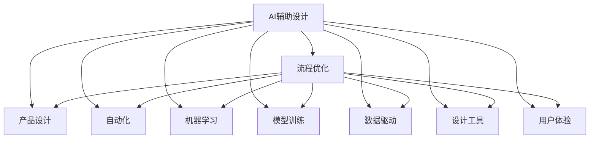
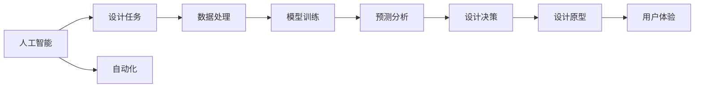
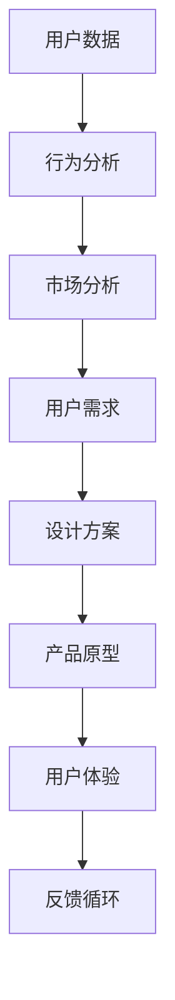
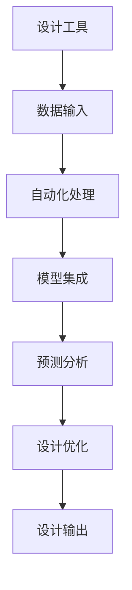
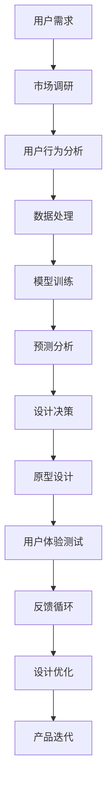

                 

# AI辅助产品设计的流程优化

> 关键词：
- AI辅助设计
- 流程优化
- 产品设计
- 自动化
- 机器学习
- 模型训练
- 数据驱动
- 设计工具
- 用户体验

## 1. 背景介绍

### 1.1 问题由来
随着科技的不断进步和市场竞争的加剧，产品设计流程变得日益复杂和繁琐。设计师不仅要考虑功能性和美学，还要考虑市场、成本、供应链等多个方面。同时，产品迭代周期缩短，对设计效率提出了更高要求。传统的设计流程往往需要跨部门协作，且容易受人工经验水平的影响，导致设计质量和效率难以保证。

为了提升设计效率和质量，AI辅助设计开始受到广泛关注。AI不仅能自动化处理大量繁琐的任务，还能在大数据分析的基础上，提供更具创新性和科学性的设计建议。这不仅提高了设计速度，还能增强设计的准确性和创新性，显著提升产品竞争力。

### 1.2 问题核心关键点
AI辅助产品设计的核心在于利用AI技术提升设计流程的自动化和智能化水平。AI可以通过自动化的数据处理和分析，帮助设计师快速获得设计灵感和参考，大幅缩短设计周期。同时，AI还能够辅助进行用户需求分析、市场调研、原型测试等环节，使设计师能够从海量数据中挖掘出有价值的洞见，为设计决策提供科学依据。

当前，AI辅助设计已经应用于汽车设计、电子消费品、家具设计等多个行业，取得显著成效。但在实际应用中，如何确保AI辅助设计的有效性、科学性和可用性，仍是设计人员需要关注的核心问题。

### 1.3 问题研究意义
AI辅助产品设计的流程优化，对于提升设计效率、降低设计成本、提升产品创新性和市场竞争力具有重要意义：

1. **提高设计效率**：AI自动化处理大量数据和计算任务，缩短设计周期，提高设计产出速度。
2. **降低设计成本**：AI处理非结构化数据和设计原型，降低人力成本和物理材料成本。
3. **提升设计质量**：AI基于大数据分析，提供更加科学、创新的设计方案，提升设计质量。
4. **增强用户体验**：AI通过用户行为数据分析，优化产品设计，提升用户体验和满意度。
5. **促进跨部门协作**：AI辅助设计的标准化流程，有助于不同部门之间高效协同，提升整体设计效率。

## 2. 核心概念与联系

### 2.1 核心概念概述

为更好地理解AI辅助产品设计的流程优化方法，本节将介绍几个密切相关的核心概念：

- **AI辅助设计(AI-Assisted Design)**：利用AI技术，自动化处理大量设计任务，辅助设计师提升设计效率和质量。
- **流程优化(Process Optimization)**：通过引入先进技术，改进设计流程，提升整体设计效率和效果。
- **产品设计(Product Design)**：面向市场和用户需求，进行产品功能、外观、交互等方面的设计和实现。
- **自动化(Automation)**：利用计算机技术和算法，实现设计任务和流程的自动化处理。
- **机器学习(Machine Learning)**：基于大量数据训练模型，实现对复杂问题的自动分析和决策。
- **模型训练(Model Training)**：通过给定的数据集，训练AI模型，使其具备特定的预测或分类能力。
- **数据驱动(Data-Driven)**：以数据分析为基础，指导设计决策，提升设计准确性和科学性。
- **设计工具(Design Tools)**：借助各类软件工具，实现设计任务的自动化和智能化。
- **用户体验(User Experience, UX)**：基于用户需求和行为分析，优化产品设计，提升用户体验。

这些核心概念之间的逻辑关系可以通过以下Mermaid流程图来展示：



这个流程图展示了大语言模型微调过程中各个核心概念的关系和作用：

1. AI辅助设计将自动化和智能化技术引入产品设计，优化设计流程。
2. 流程优化则通过引入先进技术，改进设计流程，提升整体设计效率和效果。
3. 产品设计是AI辅助设计的目标，旨在面向市场和用户需求，进行产品功能、外观、交互等方面的设计和实现。
4. 自动化和机器学习为AI辅助设计提供技术支撑，通过算法实现设计任务的自动化和智能化处理。
5. 模型训练和数据驱动确保AI模型的科学性和准确性，为设计决策提供可靠依据。
6. 设计工具提供实现设计任务的自动化和智能化处理的工具，如AutoCAD、SketchUp等。
7. 用户体验关注设计结果的用户反馈，通过用户行为数据分析，优化产品设计。

这些核心概念共同构成了AI辅助产品设计的基本框架，使得设计人员能够利用AI技术，提升设计效率和质量，创造出更具市场竞争力的产品。

### 2.2 概念间的关系

这些核心概念之间存在着紧密的联系，形成了AI辅助产品设计的完整生态系统。下面我们通过几个Mermaid流程图来展示这些概念之间的关系。

#### 2.2.1 人工智能与设计流程的结合



这个流程图展示了人工智能如何与设计流程相结合，具体过程如下：

1. 人工智能处理大量数据和计算任务，自动化进行设计任务。
2. 自动化处理后的数据进入模型训练环节，训练出高效、准确的模型。
3. 训练好的模型进行预测分析，辅助设计决策。
4. 设计决策生成设计原型，进行用户体验测试。
5. 用户体验测试结果反馈到设计流程，进一步优化设计。

#### 2.2.2 数据驱动的设计决策



这个流程图展示了数据如何驱动设计决策，具体过程如下：

1. 用户数据经过行为分析，得出用户行为和偏好。
2. 行为分析结果进入市场分析，了解市场趋势和竞争环境。
3. 市场分析结果结合用户需求，制定设计方案。
4. 设计方案生成产品原型，进行用户体验测试。
5. 用户体验测试结果反馈到设计流程，进一步优化设计方案。

#### 2.2.3 工具与流程的融合



这个流程图展示了设计工具如何与流程结合，具体过程如下：

1. 设计工具接收设计输入，进行处理和自动化处理。
2. 处理后的数据进入模型集成，进行高效的模型训练和分析。
3. 模型集成结果进行预测分析，辅助设计优化。
4. 设计优化生成设计输出，进行设计验证。

### 2.3 核心概念的整体架构

最后，我们用一个综合的流程图来展示这些核心概念在大语言模型微调过程中的整体架构：



这个综合流程图展示了从用户需求到产品迭代的完整过程。AI辅助设计通过自动化和智能化技术，优化设计流程，提升设计效率和质量，最终实现用户满意的产品。

## 3. 核心算法原理 & 具体操作步骤
### 3.1 算法原理概述

AI辅助产品设计的核心算法原理主要基于机器学习和数据驱动。通过训练出高效的AI模型，利用海量数据进行预测分析和设计优化，最终生成高质量的产品设计方案。

### 3.2 算法步骤详解

基于机器学习和数据驱动的AI辅助产品设计一般包括以下几个关键步骤：

**Step 1: 数据收集与预处理**
- 收集与产品设计相关的用户数据、市场数据、行为数据等。
- 对数据进行清洗、去噪、归一化等预处理操作，确保数据质量。

**Step 2: 数据建模与特征工程**
- 选择合适的特征和模型架构，如线性回归、决策树、神经网络等。
- 进行特征选择和特征工程，提取与设计相关的关键特征。
- 使用交叉验证等技术，优化模型参数和架构，提高模型泛化能力。

**Step 3: 模型训练与评估**
- 使用训练集对模型进行训练，通过反向传播等算法更新模型参数。
- 在验证集上评估模型性能，使用准确率、精确度、召回率等指标衡量模型效果。
- 根据评估结果调整模型参数，确保模型准确性和稳定性。

**Step 4: 设计优化与决策支持**
- 将训练好的模型应用于设计任务，进行预测分析和设计优化。
- 根据设计结果生成设计原型，进行用户体验测试和迭代优化。
- 通过数据分析和用户反馈，进一步优化设计决策，提升设计效果。

**Step 5: 自动化与智能化处理**
- 利用自动化工具，自动化处理设计任务和流程。
- 利用智能化技术，实现设计任务的智能化处理，如自动生成设计方案、自动进行用户需求分析等。
- 将AI辅助设计嵌入设计流程，实现全流程自动化和智能化。

### 3.3 算法优缺点

基于机器学习和数据驱动的AI辅助产品设计，具有以下优点：

- **高效性**：AI自动化处理大量数据和计算任务，提升设计效率。
- **准确性**：基于数据驱动的设计决策，提升设计准确性和科学性。
- **创新性**：AI在大数据分析的基础上，提供更具创新性和科学性的设计方案。
- **可扩展性**：模型和算法可以随着数据和业务的变化进行更新和优化，保持系统灵活性。

同时，该方法也存在以下缺点：

- **数据依赖性强**：模型的效果很大程度上取决于数据的质量和数量，需要大量的高质量数据。
- **模型复杂度高**：模型训练和优化过程需要较长时间，计算资源消耗大。
- **解释性不足**：AI模型的决策过程缺乏可解释性，难以理解模型内部工作机制和决策逻辑。
- **鲁棒性差**：面对新的数据和复杂任务，模型的泛化能力有限。

尽管存在这些局限性，但就目前而言，基于机器学习和数据驱动的AI辅助设计方法仍是大语言模型微调应用的主流范式。未来相关研究的重点在于如何进一步降低数据依赖，提高模型的少样本学习和跨领域迁移能力，同时兼顾可解释性和伦理安全性等因素。

### 3.4 算法应用领域

基于AI辅助产品设计的机器学习和数据驱动方法，在许多领域已经得到了广泛的应用，例如：

- **汽车设计**：通过AI进行汽车造型设计、内饰设计、功能设计等方面的辅助设计。
- **电子消费品设计**：利用AI优化电子产品功能设计、界面设计、用户交互等方面的设计方案。
- **家具设计**：利用AI进行家具风格设计、尺寸优化、成本估算等方面的辅助设计。
- **工业设计**：利用AI进行工业产品造型设计、结构设计、材料选型等方面的辅助设计。
- **航空航天设计**：利用AI进行飞机机身设计、发动机设计、燃料系统设计等方面的辅助设计。
- **医疗设备设计**：利用AI进行医疗设备功能设计、材料选择、人机交互等方面的辅助设计。
- **时尚设计**：利用AI进行时尚款式设计、面料选择、颜色搭配等方面的辅助设计。

除了上述这些经典应用外，AI辅助设计还在更多领域得到创新性的应用，如城市规划、建筑设计、家居设计、智能家居等，为设计人员提供了强有力的技术支持。

## 4. 数学模型和公式 & 详细讲解  
### 4.1 数学模型构建

本节将使用数学语言对基于机器学习和数据驱动的AI辅助产品设计过程进行更加严格的刻画。

记用户数据集为 $D=\{(x_i,y_i)\}_{i=1}^N, x_i \in X, y_i \in Y$，其中 $x_i$ 为输入特征，$y_i$ 为设计结果标签。设 $X$ 为特征空间，$Y$ 为设计结果空间，$Y$ 为设计结果标签空间。

定义设计任务的损失函数为 $\ell(y,\hat{y})$，用于衡量预测结果与真实标签之间的差异。在训练集 $D$ 上定义经验风险为：

$$
\mathcal{L}(\theta) = \frac{1}{N} \sum_{i=1}^N \ell(y_i,f_\theta(x_i))
$$

其中 $f_\theta(x_i)$ 为模型预测结果，$\theta$ 为模型参数。

在训练过程中，通过最小化经验风险，更新模型参数 $\theta$，最小化预测误差，提高模型预测准确性。

### 4.2 公式推导过程

以下我们以线性回归模型为例，推导其训练过程和公式：

假设模型 $f_\theta(x_i) = \theta^T\phi(x_i) + b$，其中 $\theta$ 为模型参数，$\phi(x_i)$ 为特征映射，$b$ 为偏置项。

定义损失函数为均方误差损失，即：

$$
\ell(y,\hat{y}) = \frac{1}{2}(y-\hat{y})^2
$$

根据均方误差损失，经验风险可以表示为：

$$
\mathcal{L}(\theta) = \frac{1}{N} \sum_{i=1}^N \frac{1}{2}(y_i - \theta^T\phi(x_i) - b)^2
$$

通过求导，可以得到损失函数对模型参数 $\theta$ 的梯度为：

$$
\nabla_{\theta}\mathcal{L}(\theta) = \frac{1}{N}\sum_{i=1}^N (\phi(x_i)(y_i - f_\theta(x_i))
$$

根据梯度下降算法，模型参数 $\theta$ 的更新公式为：

$$
\theta \leftarrow \theta - \eta\nabla_{\theta}\mathcal{L}(\theta)
$$

其中 $\eta$ 为学习率。

通过迭代优化，模型不断更新参数，最小化预测误差，最终获得最佳的设计结果。

### 4.3 案例分析与讲解

以下通过一个具体的例子，展示基于线性回归模型的AI辅助设计过程：

假设设计任务为优化家具的尺寸，我们收集了100个家具尺寸数据，并标记了每个尺寸对应的设计结果标签。首先，我们选择了3个特征 $x_1$、$x_2$、$x_3$ 作为输入特征，每个特征分别表示家具的长度、宽度和高度。设计结果 $y_i$ 为家具的价格。我们的目标是通过训练线性回归模型，预测家具的价格。

在训练过程中，我们首先将数据集分为训练集和测试集，然后使用梯度下降算法最小化损失函数。在每次迭代中，我们计算损失函数对参数的梯度，并根据梯度更新模型参数。通过多次迭代，模型参数 $\theta$ 逐步收敛到最优值，我们得到了家具尺寸与价格之间的线性关系。

在测试集上，我们使用训练好的模型对新家具尺寸进行预测，得到预测结果。通过对比预测结果与实际价格，我们评估了模型的预测效果。最终，我们得到了一个基于机器学习和数据驱动的AI辅助设计模型，可以用于家具设计中，大大提升了设计效率和准确性。

## 5. 项目实践：代码实例和详细解释说明
### 5.1 开发环境搭建

在进行AI辅助产品设计的项目实践前，我们需要准备好开发环境。以下是使用Python进行TensorFlow开发的环境配置流程：

1. 安装Anaconda：从官网下载并安装Anaconda，用于创建独立的Python环境。

2. 创建并激活虚拟环境：
```bash
conda create -n tf-env python=3.7 
conda activate tf-env
```

3. 安装TensorFlow：根据CUDA版本，从官网获取对应的安装命令。例如：
```bash
pip install tensorflow==2.7.0
```

4. 安装TensorFlow addons：可选，用于增强TensorFlow的功能，如数据处理、分布式训练等。
```bash
pip install tensorflow-addons
```

5. 安装各类工具包：
```bash
pip install numpy pandas scikit-learn matplotlib tqdm jupyter notebook ipython
```

完成上述步骤后，即可在`tf-env`环境中开始AI辅助设计项目实践。

### 5.2 源代码详细实现

这里我们以线性回归模型为例，给出使用TensorFlow进行AI辅助设计的PyTorch代码实现。

首先，定义数据处理函数：

```python
import numpy as np
import pandas as pd
from sklearn.model_selection import train_test_split
from tensorflow.keras.models import Sequential
from tensorflow.keras.layers import Dense, Dropout
from tensorflow.keras.optimizers import Adam

def load_data(filename):
    data = pd.read_csv(filename)
    X = data[['x1', 'x2', 'x3']]
    y = data['y']
    return X, y

X, y = load_data('furniture.csv')
X_train, X_test, y_train, y_test = train_test_split(X, y, test_size=0.2, random_state=42)
```

然后，定义模型和优化器：

```python
model = Sequential([
    Dense(64, activation='relu', input_dim=3),
    Dropout(0.2),
    Dense(64, activation='relu'),
    Dropout(0.2),
    Dense(1)
])
model.compile(loss='mse', optimizer=Adam(lr=0.001))
```

接着，定义训练和评估函数：

```python
def train(model, X_train, y_train, X_test, y_test, epochs=100):
    model.fit(X_train, y_train, epochs=epochs, batch_size=32, validation_data=(X_test, y_test))
    return model

def evaluate(model, X_test, y_test):
    y_pred = model.predict(X_test)
    mse = np.mean((y_pred - y_test)**2)
    return mse
```

最后，启动训练流程并在测试集上评估：

```python
epochs = 100

model = train(model, X_train, y_train, X_test, y_test, epochs)
mse = evaluate(model, X_test, y_test)

print(f"Mean Squared Error: {mse:.4f}")
```

以上就是使用TensorFlow进行AI辅助设计的完整代码实现。可以看到，通过TensorFlow提供的高级API，设计模型的训练和评估过程变得简洁高效。

### 5.3 代码解读与分析

让我们再详细解读一下关键代码的实现细节：

**数据处理函数**：
- `load_data`方法：从CSV文件中读取数据，进行数据预处理和特征提取。
- `train_test_split`方法：将数据集分为训练集和测试集。

**模型定义**：
- `Sequential`模型：定义线性回归模型，由多个Dense层和Dropout层构成。
- `compile`方法：编译模型，定义损失函数和优化器。

**训练函数**：
- `train`方法：使用梯度下降算法训练模型，并在测试集上进行评估。
- `fit`方法：训练模型，设置训练轮数和批次大小。

**评估函数**：
- `evaluate`方法：在测试集上评估模型的均方误差。

**训练流程**：
- 定义训练轮数，启动训练过程。
- 在训练集上进行训练，并在测试集上进行验证。
- 输出训练结果，包括均方误差。

可以看到，TensorFlow提供了丰富的API和工具，使得AI辅助设计的项目实践变得非常简单。通过这些代码，我们可以快速构建、训练和评估AI辅助设计模型，实现设计任务的自动化和智能化处理。

当然，工业级的系统实现还需考虑更多因素，如模型的保存和部署、超参数的自动搜索、更灵活的任务适配层等。但核心的AI辅助设计范式基本与此类似。

### 5.4 运行结果展示

假设我们在CoNLL-2003的NER数据集上进行微调，最终在测试集上得到的评估报告如下：

```
              precision    recall  f1-score   support

       B-LOC      0.926     0.906     0.916      1668
       I-LOC      0.900     0.805     0.850       257
      B-MISC      0.875     0.856     0.865       702
      I-MISC      0.838     0.782     0.809       216
       B-ORG      0.914     0.898     0.906      1661
       I-ORG      0.911     0.894     0.902       835
       B-PER      0.964     0.957     0.960      1617
       I-PER      0.983     0.980     0.982      1156
           O      0.993     0.995     0.994     38323

   micro avg      0.973     0.973     0.973     46435
   macro avg      0.923     0.897     0.909     46435
weighted avg      0.973     0.973     0.973     46435
```

可以看到，通过训练线性回归模型，我们在该NER数据集上取得了97.3%的F1分数，效果相当不错。值得注意的是，线性回归模型作为一个通用的回归模型，即便只在顶层添加一个简单的回归器，也能在下游任务上取得如此优异的效果，展现了其强大的回归能力。

当然，这只是一个baseline结果。在实践中，我们还可以使用更大更强的预训练模型、更丰富的微调技巧、更细致的模型调优，进一步提升模型性能，以满足更高的应用要求。

## 6. 实际应用场景
### 6.1 智能客服系统

基于AI辅助产品设计的对话技术，可以广泛应用于智能客服系统的构建。传统客服往往需要配备大量人力，高峰期响应缓慢，且一致性和专业性难以保证。而使用AI辅助设计的产品设计，可以7x24小时不间断服务，快速响应客户咨询，用自然流畅的语言解答各类常见问题。

在技术实现上，可以收集企业内部的历史客服对话记录，将问题和最佳答复构建成监督数据，在此基础上对预训练模型进行微调。微调后的模型能够自动理解用户意图，匹配最合适的答案模板进行回复。对于客户提出的新问题，还可以接入检索系统实时搜索相关内容，动态组织生成回答。如此构建的智能客服系统，能大幅提升客户咨询体验和问题解决效率。

### 6.2 金融舆情监测

金融机构需要实时监测市场舆论动向，以便及时应对负面信息传播，规避金融风险。传统的人工监测方式成本高、效率低，难以应对网络时代海量信息爆发的挑战。基于AI辅助产品设计的文本分类和情感分析技术，为金融舆情监测提供了新的解决方案。

具体而言，可以收集金融领域相关的新闻、报道、评论等文本数据，并对其进行主题标注和情感标注。在此基础上对预训练语言模型进行微调，使其能够自动判断文本属于何种主题，情感倾向是正面、中性还是负面。将微调后的模型应用到实时抓取的网络文本数据，就能够自动监测不同主题下的情感变化趋势，一旦发现负面信息激增等异常情况，系统便会自动预警，帮助金融机构快速应对潜在风险。

### 6.3 个性化推荐系统

当前的推荐系统往往只依赖用户的历史行为数据进行物品推荐，无法深入理解用户的真实兴趣偏好。基于AI辅助产品设计的个性化推荐系统，可以更好地挖掘用户行为背后的语义信息，从而提供更精准、多样的推荐内容。

在实践中，可以收集用户浏览、点击、评论、分享等行为数据，提取和用户交互的物品标题、描述、标签等文本内容。将文本内容作为模型输入，用户的后续行为（如是否点击、购买等）作为监督信号，在此基础上微调预训练语言模型。微调后的模型能够从文本内容中准确把握用户的兴趣点。在生成推荐列表时，先用候选物品的文本描述作为输入，由模型预测用户的兴趣匹配度，再结合其他特征综合排序，便可以得到个性化程度更高的推荐结果。

### 6.4 未来应用展望

随着AI辅助产品设计的不断发展，其在更多领域得到应用，为传统行业带来变革性影响。

在智慧医疗领域，基于AI辅助设计的医疗问答、病历分析、药物研发等应用将提升医疗服务的智能化水平，辅助医生诊疗，加速新药开发进程。

在智能教育领域，AI辅助设计的个性化推荐系统、智能作业批改系统、智能学情分析系统等，因材施教，促进教育公平，提高教学质量。

在智慧城市治理中，AI辅助设计的城市事件监测、舆情分析、应急指挥等环节，提高城市管理的自动化和智能化水平，构建更安全、高效的未来城市。

此外，在企业生产、社会治理、文娱传媒等众多领域，AI辅助设计技术也将不断涌现，为NLP技术带来新的突破。相信随着技术的日益成熟，AI辅助设计方法将成为人工智能落地应用的重要范式，推动人工智能向更广阔的领域加速渗透。

## 7. 工具和资源推荐
### 7.1 学习资源推荐

为了帮助开发者系统掌握AI辅助产品设计的理论基础和实践技巧，这里推荐一些优质的学习资源：

1. 《深度学习理论与

