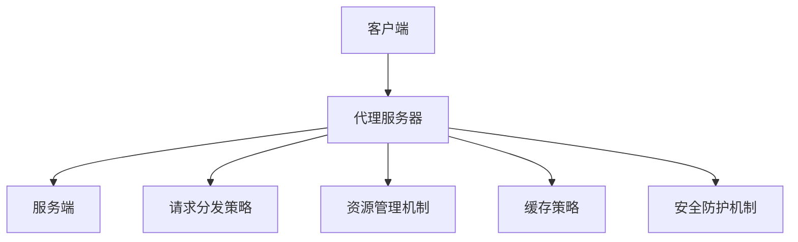

                 

# Agent代理的实现与应用

## 1. 背景介绍

在现代软件开发中，代理（Agent）是一种被广泛使用的设计模式。它允许软件系统在用户没有直接干预的情况下，自动执行某些操作或决策。代理不仅能够简化用户交互，提升系统效率，还能增强系统的灵活性和可扩展性。

### 1.1 问题由来
代理技术在现代软件系统中应用广泛，几乎涵盖了从简单的网络通信到复杂的机器学习任务。例如，在网络编程中，代理可以帮助隐藏服务器的真实地址，提供负载均衡和缓存等功能；在机器学习中，代理可以帮助分布式训练任务，加速模型收敛。然而，尽管代理技术的应用领域广泛，但对于如何设计和实现一个高性能、可靠的代理系统，仍存在很多挑战。

### 1.2 问题核心关键点
一个优秀的代理系统，通常需要具备以下特点：
1. **高性能**：能够快速处理大量请求，减少响应时间。
2. **可靠性**：在面对网络延迟、服务器故障等异常情况时，仍能保证服务稳定。
3. **可扩展性**：能够方便地添加新的功能或模块。
4. **安全性**：确保代理系统本身不受攻击，保护用户数据。

为了实现这些目标，代理系统通常采用一系列先进的技术手段，包括负载均衡、缓存策略、故障转移机制等。但这些技术背后，其实质是如何在系统内部进行有效的任务分配和资源管理。

### 1.3 问题研究意义
研究代理系统的设计和实现，不仅有助于提升软件系统的性能和可用性，还能够推动软件开发模式和架构的演进。特别是随着微服务架构和分布式系统的大规模应用，理解代理技术在现代系统中的作用和价值，对于软件工程师来说显得尤为重要。

## 2. 核心概念与联系

### 2.1 核心概念概述

代理（Agent）是一种被广泛使用的设计模式，它可以在不直接暴露系统内部实现细节的情况下，为用户提供一个简单易用的接口。代理通常用于以下几个方面：

- **远程过程调用**：通过代理隐藏远程服务器的地址，简化客户端调用。
- **资源管理**：如缓存、数据库连接、消息队列等资源的分配和释放。
- **安全性**：拦截恶意请求，保护系统安全。
- **负载均衡**：在多个服务器之间分配请求，提高系统的吞吐量。

代理系统一般由以下几个核心组件组成：

- **客户端**：发起请求的实体。
- **代理服务器**：接收和转发请求，提供服务。
- **服务端**：执行具体任务的实体。

代理系统的设计需要考虑多个方面，如网络通信协议、请求分发策略、资源管理机制等。这些组件通过精巧的设计和良好的协作，共同实现代理的功能。

### 2.2 概念间的关系

代理系统的各个组件通过协作实现其核心功能。以下是一个Mermaid流程图，展示了代理系统的基本架构和组件之间的关系：



通过这个流程图，我们可以更清晰地理解代理系统中各个组件的作用和相互关系。

## 3. 核心算法原理 & 具体操作步骤
### 3.1 算法原理概述

代理系统的工作原理可以简要概述为：客户端通过代理服务器与服务端进行通信，代理服务器根据请求分发策略和资源管理机制，转发请求至相应的服务端，并在必要时进行缓存和安全性检查。代理系统主要涉及以下几个算法和策略：

1. **请求分发策略**：根据请求的内容、频率、地理位置等因素，合理分配请求到不同的服务端。
2. **资源管理机制**：通过缓存、连接池等手段，提高资源的利用效率，减少响应时间。
3. **故障转移机制**：在服务端故障时，自动将请求转发至其他健康的服务端，确保服务可用性。

这些算法和策略的设计和实现，是代理系统的关键所在。

### 3.2 算法步骤详解

下面以一个简单的缓存代理为例，展示代理系统的实现步骤：

1. **客户端发送请求**：客户端向代理服务器发送请求。
2. **代理服务器处理请求**：代理服务器接收到请求后，根据请求的内容、频率等因素，判断是否需要缓存。
3. **缓存处理**：如果请求命中缓存，则直接返回缓存数据；否则，将请求转发至服务端。
4. **服务端处理请求**：服务端接收请求并处理，返回响应数据。
5. **代理服务器返回响应**：代理服务器将响应数据缓存，并返回给客户端。

这个过程可以通过以下伪代码描述：

```python
class CacheProxy:
    def __init__(self, cache):
        self.cache = cache

    def forward_request(self, request):
        if request in self.cache:
            return self.cache[request]
        else:
            response = self.service_endpoint(request)
            self.cache[request] = response
            return response

    def service_endpoint(self, request):
        # 调用实际的服务端进行请求处理
        ...
```

### 3.3 算法优缺点

代理系统的优点包括：

1. **简化客户端**：客户端不需要直接与服务端通信，简化开发和维护。
2. **增强可扩展性**：通过合理的代理设计，可以实现负载均衡、缓存等功能。
3. **提升性能**：通过缓存和负载均衡等策略，减少服务端的压力，提高系统响应速度。

但代理系统也存在一些缺点：

1. **增加复杂性**：代理系统的设计需要考虑多方面因素，增加了系统的复杂性。
2. **潜在瓶颈**：代理本身可能成为系统的瓶颈，影响性能。
3. **安全性风险**：代理系统可能成为攻击目标，影响系统的安全性。

### 3.4 算法应用领域

代理技术在多个领域都有广泛应用，以下是一些典型的应用场景：

1. **Web服务**：如负载均衡器、反向代理等，用于提升Web应用的性能和可扩展性。
2. **分布式计算**：如Hadoop YARN中的资源管理器，用于分配计算资源。
3. **网络通信**：如Nginx、Apache HTTP Server等，用于提升网络通信效率和安全性。
4. **数据库连接**：如连接池技术，用于提高数据库访问的效率和稳定性。
5. **消息队列**：如Kafka代理，用于消息的缓存和分发。

除了上述这些经典应用外，代理技术还被应用于许多新兴领域，如云服务、区块链、边缘计算等，为这些新兴技术提供了强大的支撑。

## 4. 数学模型和公式 & 详细讲解 & 举例说明

### 4.1 数学模型构建

代理系统的设计需要考虑多个方面，如网络通信协议、请求分发策略、资源管理机制等。以下以一个简单的负载均衡算法为例，展示代理系统的数学模型构建。

假设有一个包含 $N$ 个服务端的系统，每个服务端处理请求的平均响应时间为 $T$。假设请求以均速 $\lambda$ 到达代理服务器。代理服务器采用轮询（Round Robin）策略分配请求，即每个请求随机选择一个服务端进行分发。

定义 $\tau$ 为请求的平均响应时间，包括请求在代理服务器上的处理时间和服务端的响应时间。令 $R_i$ 为第 $i$ 个服务端的响应时间，$P_i$ 为第 $i$ 个服务端被选中的概率。根据轮询策略，$P_i$ 为 $\frac{1}{N}$。

代理系统的平均响应时间可以表示为：

$$
\tau = \frac{1}{N} \sum_{i=1}^N \left( \frac{T}{\lambda} + R_i \right)
$$

### 4.2 公式推导过程

根据轮询策略，服务端被选中的概率 $P_i$ 为 $\frac{1}{N}$，且每个服务端的响应时间 $R_i$ 独立且均匀分布，即 $R_i \sim U(0, T)$。因此，服务端的平均响应时间为 $T/2$。

代理系统的平均响应时间 $\tau$ 可以表示为：

$$
\tau = \frac{1}{N} \sum_{i=1}^N \left( \frac{T}{\lambda} + R_i \right) = \frac{T}{\lambda} + \frac{1}{N} \sum_{i=1}^N R_i
$$

根据独立随机变量的性质，有：

$$
\mathbb{E}[\tau] = \frac{T}{\lambda} + \frac{1}{N} \mathbb{E}[R_i] = \frac{T}{\lambda} + \frac{1}{N} \cdot \frac{T}{2} = \frac{T}{\lambda} + \frac{T}{2N}
$$

### 4.3 案例分析与讲解

假设系统中有 $N=10$ 个服务端，每个服务端的响应时间 $T=0.1s$，请求到达率 $\lambda=100$，计算代理系统的平均响应时间 $\tau$。

首先计算服务端的平均响应时间：

$$
\mathbb{E}[R_i] = \frac{T}{2} = 0.05s
$$

然后计算代理系统的平均响应时间：

$$
\tau = \frac{T}{\lambda} + \frac{1}{N} \cdot \mathbb{E}[R_i] = \frac{0.1}{100} + \frac{1}{10} \cdot 0.05 = 0.0015 + 0.005 = 0.0065s
$$

因此，代理系统的平均响应时间为 $0.0065s$。

## 5. 项目实践：代码实例和详细解释说明

### 5.1 开发环境搭建

为了进行代理系统的开发，需要搭建一个简单的开发环境。以下是一个基于Python Flask的示例，展示如何搭建一个简单的代理服务器：

1. **安装Flask**：
```bash
pip install Flask
```

2. **编写代理服务器代码**：
```python
from flask import Flask, request

app = Flask(__name__)

@app.route('/forward')
def forward_request():
    # 从请求中获取参数
    request_data = request.args.get('data')
    
    # 处理请求，调用实际的服务端
    response = process_request(request_data)
    
    # 返回响应数据
    return {'result': response}

if __name__ == '__main__':
    app.run(host='0.0.0.0', port=5000)
```

3. **启动代理服务器**：
```bash
python proxy.py
```

### 5.2 源代码详细实现

以下是一个简单的代理服务器代码实现，展示如何处理请求和返回响应：

```python
from flask import Flask, request
import random

app = Flask(__name__)

class ServiceEndpoint:
    def __init__(self, services):
        self.services = services
    
    def get_service(self):
        # 随机选择一个服务端
        index = random.randint(0, len(self.services) - 1)
        return self.services[index]

    def process_request(self, request_data):
        # 将请求转发至选择的服务端
        service = self.get_service()
        response = service.process_request(request_data)
        return response

class Service:
    def __init__(self):
        self.id = 0

    def process_request(self, request_data):
        self.id += 1
        return f'Response from Service {self.id}'

services = [Service() for _ in range(5)]

@app.route('/forward')
def forward_request():
    # 从请求中获取参数
    request_data = request.args.get('data')
    
    # 处理请求，调用实际的服务端
    endpoint = ServiceEndpoint(services)
    response = endpoint.process_request(request_data)
    
    # 返回响应数据
    return {'result': response}

if __name__ == '__main__':
    app.run(host='0.0.0.0', port=5000)
```

### 5.3 代码解读与分析

在上述代码中，我们定义了两个类：`ServiceEndpoint`和`Service`。`ServiceEndpoint`用于管理多个`Service`对象，并将请求转发至选择的`Service`对象进行处理。`Service`则代表实际的服务端，处理具体的请求并返回响应。

在`forward_request`函数中，我们首先从请求中获取参数，然后调用`ServiceEndpoint`的`process_request`方法处理请求，最后将响应数据返回给客户端。

### 5.4 运行结果展示

假设客户端向代理服务器发送如下请求：

```
GET /forward?data=Hello%20World HTTP/1.1
Host: 0.0.0.0:5000
```

代理服务器将请求转发至其中一个服务端进行处理，并将响应数据返回给客户端。如果服务端处理请求的响应为`"Response from Service 1"`，则客户端将收到如下响应：

```json
{
    "result": "Response from Service 1"
}
```

## 6. 实际应用场景

代理技术在多个领域都有广泛应用，以下是一些典型的应用场景：

1. **Web服务**：如Nginx、Apache HTTP Server等，用于提升Web应用的性能和可扩展性。
2. **分布式计算**：如Hadoop YARN中的资源管理器，用于分配计算资源。
3. **网络通信**：如NGINX，用于提升网络通信效率和安全性。
4. **数据库连接**：如连接池技术，用于提高数据库访问的效率和稳定性。
5. **消息队列**：如Kafka代理，用于消息的缓存和分发。

除了上述这些经典应用外，代理技术还被应用于许多新兴领域，如云服务、区块链、边缘计算等，为这些新兴技术提供了强大的支撑。

## 7. 工具和资源推荐

### 7.1 学习资源推荐

为了帮助开发者系统掌握代理系统的设计和实现，这里推荐一些优质的学习资源：

1. **《Head First设计模式》**：深入浅出地介绍了各种设计模式，包括代理模式。
2. **《Design Patterns》**：Gang of Four的经典著作，系统介绍了23种经典设计模式。
3. **Flask官方文档**：提供了一个完整的Flask教程，适合入门Flask开发。
4. **Kubernetes官方文档**：介绍了一个基于代理的容器编排系统，适合理解大规模分布式系统的设计。
5. **《分布式系统原理与设计》**：介绍了一个基于代理的分布式系统设计，适合理解分布式系统的核心原理。

通过对这些资源的学习实践，相信你一定能够快速掌握代理系统的精髓，并用于解决实际的系统问题。

### 7.2 开发工具推荐

高效的开发离不开优秀的工具支持。以下是几款用于代理系统开发的常用工具：

1. **Flask**：基于Python的轻量级Web框架，适合快速开发代理服务器。
2. **Docker**：用于容器化代理服务，方便部署和管理。
3. **Kubernetes**：用于容器编排，实现大规模代理系统的管理。
4. **Prometheus**：用于监控代理系统，提供实时性能指标。
5. **Grafana**：用于可视化和分析监控数据，提供丰富的图表和报表。

合理利用这些工具，可以显著提升代理系统的开发效率，加快创新迭代的步伐。

### 7.3 相关论文推荐

代理技术的发展离不开学界的持续研究。以下是几篇奠基性的相关论文，推荐阅读：

1. **《Effective use of proxies for load balancing in web applications》**：讨论了Web应用中代理的负载均衡策略。
2. **《Design and Analysis of Scalable Proxy Services》**：介绍了大规模代理系统的设计和分析方法。
3. **《Load Balancing Using Random Weighted Rounds-Robin Scheduling》**：讨论了基于权重轮询的负载均衡算法。
4. **《The Proxy Problem: Design, Analysis and Optimization of Proxy Servers》**：讨论了代理服务器的设计和优化方法。
5. **《Designing Proxy Servers for Overloaded Web Sites》**：讨论了过载环境下代理服务器的设计和优化方法。

这些论文代表了大规模代理系统的研究脉络。通过学习这些前沿成果，可以帮助研究者把握学科前进方向，激发更多的创新灵感。

除上述资源外，还有一些值得关注的前沿资源，帮助开发者紧跟代理技术的最新进展，例如：

1. **arXiv论文预印本**：人工智能领域最新研究成果的发布平台，包括大量尚未发表的前沿工作，学习前沿技术的必读资源。
2. **业界技术博客**：如Nginx、Kubernetes、Apache HTTP Server等顶尖实验室的官方博客，第一时间分享他们的最新研究成果和洞见。
3. **技术会议直播**：如ACM SIGCOMM、USENIX NSDI、IEEE INFOCOM等顶级会议的现场或在线直播，能够聆听到大佬们的前沿分享，开拓视野。
4. **GitHub热门项目**：在GitHub上Star、Fork数最多的代理系统相关项目，往往代表了该技术领域的发展趋势和最佳实践，值得去学习和贡献。
5. **行业分析报告**：各大咨询公司如McKinsey、PwC等针对代理系统的分析报告，有助于从商业视角审视技术趋势，把握应用价值。

总之，对于代理技术的学习和实践，需要开发者保持开放的心态和持续学习的意愿。多关注前沿资讯，多动手实践，多思考总结，必将收获满满的成长收益。

## 8. 总结：未来发展趋势与挑战

### 8.1 总结

本文对代理系统的设计和实现进行了全面系统的介绍。首先阐述了代理技术在现代软件开发中的重要地位和作用，明确了代理系统的高性能、可靠性、可扩展性和安全性等特点。其次，从原理到实践，详细讲解了代理系统的数学模型构建和算法步骤，给出了代理系统开发的完整代码实例。同时，本文还广泛探讨了代理系统在Web服务、分布式计算、网络通信、数据库连接和消息队列等领域的典型应用，展示了代理技术的广阔前景。

通过本文的系统梳理，可以看到，代理技术在现代软件开发中扮演着重要的角色，极大地提升了系统的性能、可用性和可扩展性。未来，伴随微服务架构和分布式系统的大规模应用，代理技术还将继续演进，为构建高效、可靠、灵活的软件系统提供坚实的技术支撑。

### 8.2 未来发展趋势

展望未来，代理系统的设计和实现将呈现以下几个发展趋势：

1. **云原生架构**：代理系统将越来越多地集成到云原生环境中，利用容器化、微服务、服务网格等技术，提升系统的灵活性和可扩展性。
2. **自动化管理**：利用机器学习和自动化算法，优化代理系统的资源分配和调度，提高系统的效率和稳定性。
3. **分布式智能**：利用分布式智能算法，实现更智能化的负载均衡和故障转移，提升系统的自适应能力。
4. **边缘计算**：代理系统将越来越多地集成到边缘计算环境中，提供低延迟、高可靠的服务。
5. **多模态代理**：结合视觉、语音、文本等多种模态数据，提供更全面、更丰富的代理服务。

以上趋势凸显了代理系统在现代软件开发中的重要地位，代理技术的发展将推动软件系统的不断演进和创新。

### 8.3 面临的挑战

尽管代理技术在现代软件开发中发挥着重要作用，但在迈向更加智能化、普适化应用的过程中，它仍面临诸多挑战：

1. **复杂性**：代理系统的设计需要考虑多方面因素，增加了系统的复杂性。
2. **性能瓶颈**：代理本身可能成为系统的瓶颈，影响性能。
3. **安全性风险**：代理系统可能成为攻击目标，影响系统的安全性。
4. **资源管理**：代理系统需要高效管理资源，避免资源浪费和过度使用。
5. **可扩展性**：代理系统需要具备良好的可扩展性，支持大规模系统的部署和管理。

面对这些挑战，未来的研究需要在以下几个方面寻求新的突破：

1. **分布式智能算法**：结合机器学习和分布式算法，实现更智能化的负载均衡和故障转移。
2. **自动化管理工具**：利用自动化算法和工具，优化代理系统的资源分配和调度。
3. **边缘计算技术**：结合边缘计算技术，提升代理系统的响应速度和可靠性。
4. **多模态数据处理**：结合视觉、语音、文本等多种模态数据，提供更全面、更丰富的代理服务。
5. **安全防护机制**：结合加密、身份验证等技术，确保代理系统的安全性。

这些研究方向的探索，必将引领代理技术的发展，为构建高效、可靠、灵活的软件系统提供坚实的技术支撑。

### 8.4 研究展望

未来的代理技术研究，将在以下几个方面寻求新的突破：

1. **分布式智能算法**：结合机器学习和分布式算法，实现更智能化的负载均衡和故障转移。
2. **自动化管理工具**：利用自动化算法和工具，优化代理系统的资源分配和调度。
3. **边缘计算技术**：结合边缘计算技术，提升代理系统的响应速度和可靠性。
4. **多模态数据处理**：结合视觉、语音、文本等多种模态数据，提供更全面、更丰富的代理服务。
5. **安全防护机制**：结合加密、身份验证等技术，确保代理系统的安全性。

这些研究方向的探索，必将引领代理技术的发展，为构建高效、可靠、灵活的软件系统提供坚实的技术支撑。

## 9. 附录：常见问题与解答

**Q1：代理系统如何保证服务端的安全性？**

A: 代理系统可以通过以下几种方式保证服务端的安全性：

1. **身份验证**：代理系统可以要求客户端提供身份验证信息，如API密钥、SSL证书等，以确保客户端的合法性。
2. **数据加密**：代理系统可以对客户端发送的数据进行加密，确保数据传输的安全性。
3. **访问控制**：代理系统可以限制客户端的访问权限，确保只有授权的客户端可以访问服务端。

**Q2：代理系统如何处理高并发请求？**

A: 代理系统可以通过以下几种方式处理高并发请求：

1. **负载均衡**：通过轮询、加权轮询等算法，将请求分配到不同的服务端，避免单个服务端过载。
2. **缓存策略**：利用缓存机制，将频繁访问的数据缓存到代理服务器上，减少服务端的压力。
3. **限流策略**：通过限流算法，限制客户端的请求频率，避免服务端过载。

**Q3：代理系统如何处理服务端故障？**

A: 代理系统可以通过以下几种方式处理服务端故障：

1. **故障转移机制**：当服务端发生故障时，代理系统可以自动将请求转发至其他健康的服务端，确保服务的连续性。
2. **重试机制**：代理系统可以在服务端故障时，自动重试请求，确保请求能够成功处理。
3. **监控告警**：代理系统可以实时监控服务端的健康状态，并及时发出告警，提醒管理员进行处理。

**Q4：代理系统如何处理高延迟请求？**

A: 代理系统可以通过以下几种方式处理高延迟请求：

1. **缓存策略**：利用缓存机制，将频繁访问的数据缓存到代理服务器上，减少服务端的延迟。
2. **分布式代理**：通过分布式代理，将请求分散到多个代理服务器上，提高系统的响应速度。
3. **负载均衡**：通过负载均衡算法，将请求分配到响应速度更快的服务端上，减少延迟。

**Q5：代理系统如何处理请求的灵活性？**

A: 代理系统可以通过以下几种方式处理请求的灵活性：

1. **参数灵活性**：代理系统可以根据请求参数，动态选择不同的服务端进行处理。
2. **接口灵活性**：代理系统可以根据请求的接口格式，动态选择不同的服务端进行处理。
3. **逻辑灵活性**：代理系统可以根据请求的逻辑需求，动态选择不同的服务端进行处理。

---

作者：禅与计算机程序设计艺术 / Zen and the Art of Computer Programming

