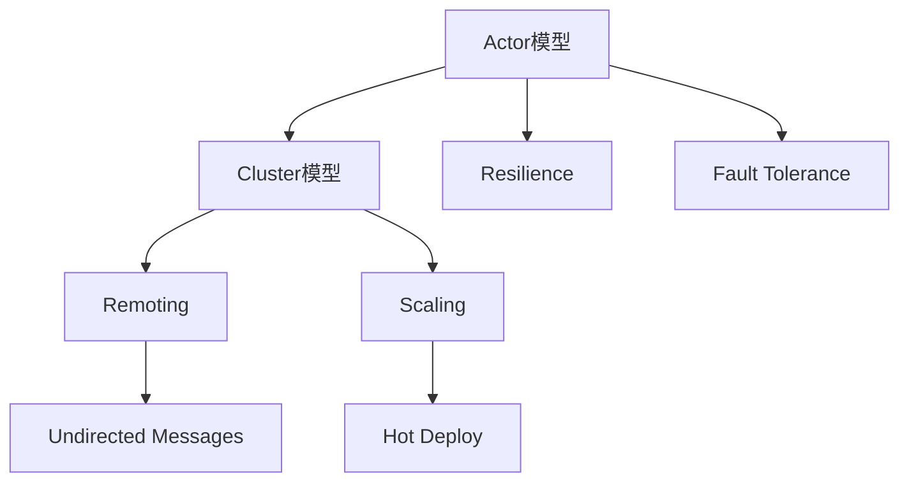
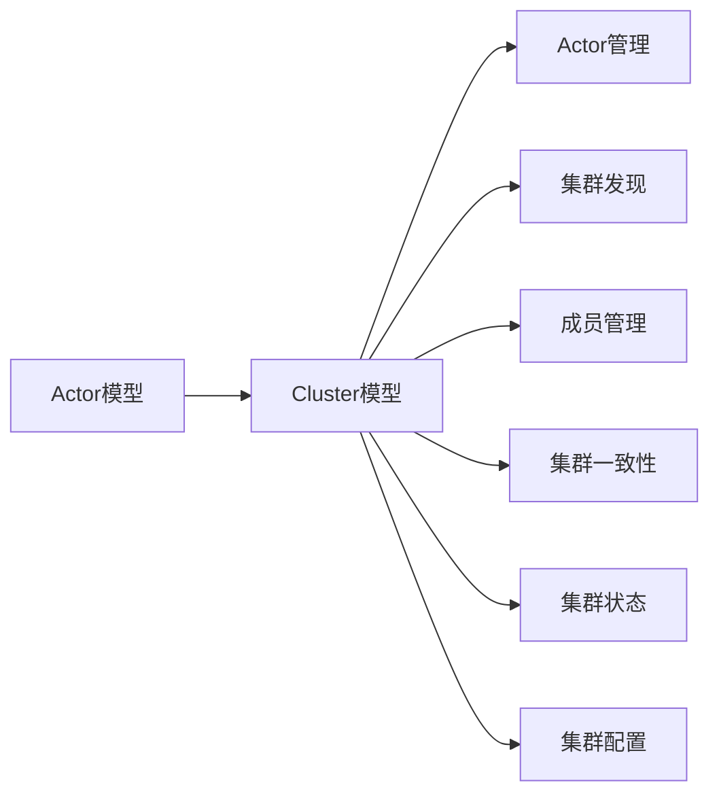
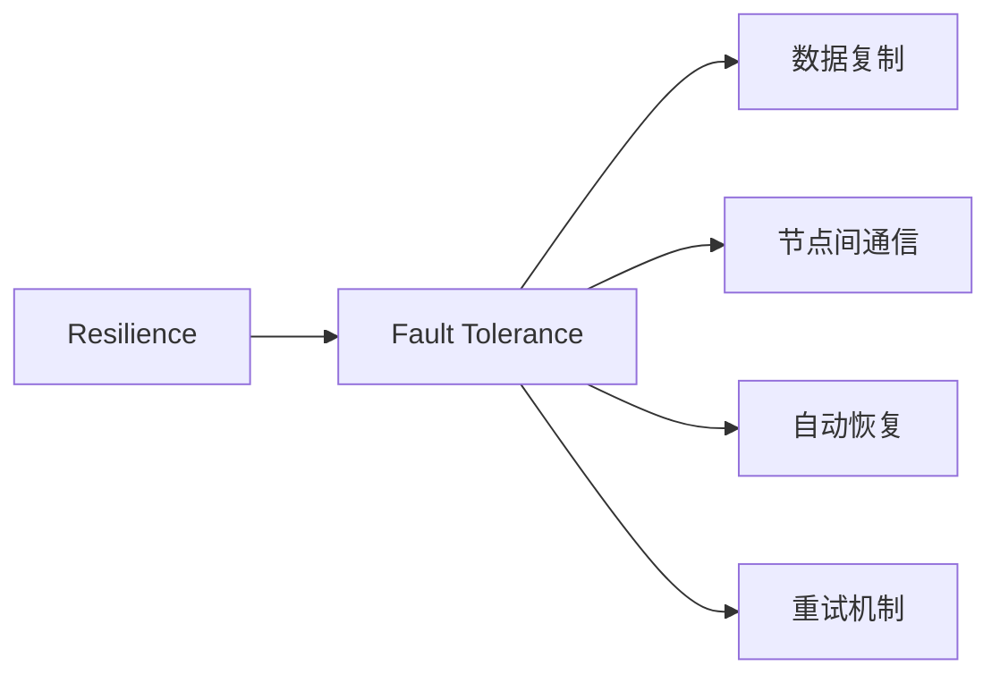
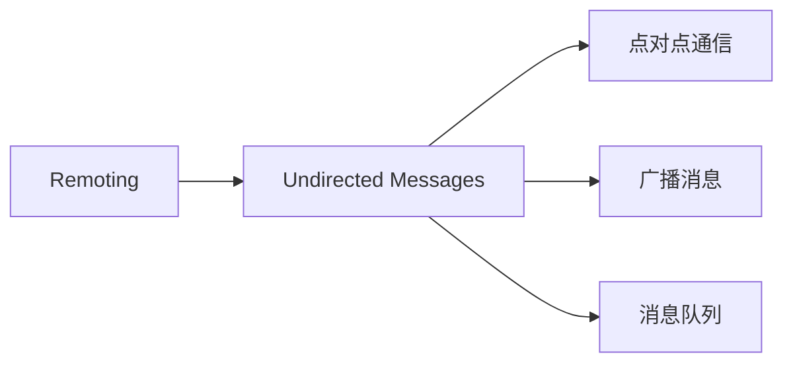
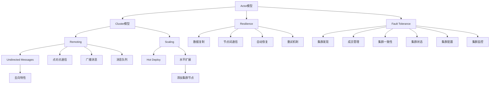

                 

# Akka集群原理与代码实例讲解

> 关键词：Akka, Actor, Cluster, Resilience, Fault Tolerance, Remoting, Undirected Messages, Scaling, Hot Deploy

## 1. 背景介绍

### 1.1 问题由来
Akka是一个现代化的、基于角色的、事件驱动的、响应式的编程平台，旨在构建高性能、分布式、容错、可扩展的系统。Akka的成功之处在于其强大的处理能力和跨平台支持，使其在微服务架构、分布式系统、高性能计算等多个领域得到广泛应用。Akka的核心概念包括Actor模型和Cluster模型，本文将重点介绍Akka集群原理与代码实例讲解，帮助读者深入理解Akka集群的内部机制和实现方法。

### 1.2 问题核心关键点
Akka集群是实现分布式系统的核心组件，它提供了一种简单、高效、可靠的分布式计算框架。Akka集群主要由以下关键点组成：

- **Actor模型**：每个Actor都是系统的基本组成部分，负责处理特定类型的消息。Actor模型是Akka分布式计算的基础。
- **Cluster模型**：用于实现分布式系统的集群管理，包括集群发现、成员管理、集群一致性、故障转移等。
- **Resilience**：Akka集群具有强大的弹性能力，能够自动检测、恢复和重试故障节点。
- **Fault Tolerance**：通过节点间通信和数据复制等机制，实现系统的容错和数据冗余。
- **Remoting**：Akka集群提供了一种高效的消息传递机制，支持点对点通信和广播消息。
- **Undirected Messages**：Akka集群中的消息传递是去向的，即发送者不知道接收者的地址，只指定接收者所在的集群节点。
- **Scaling**：Akka集群能够轻松地进行水平扩展，支持自动负载均衡和资源调度。
- **Hot Deploy**：Akka集群支持热部署，无需重启集群即可更新应用程序和配置。

这些关键点构成了Akka集群的核心架构，使其能够提供高性能、高可靠性和高可扩展性的分布式计算能力。

### 1.3 问题研究意义
Akka集群在构建分布式系统方面具有重要意义，其主要体现在以下几个方面：

1. **高性能**：Akka集群通过异步消息传递和事件驱动架构，显著提高了系统的并发能力和吞吐量。
2. **高可靠性和容错性**：Akka集群具备强大的弹性能力，能够自动检测、恢复和重试故障节点，确保系统的持续可用性。
3. **易于扩展**：Akka集群支持水平扩展，能够轻松添加更多的集群节点，提升系统的处理能力和吞吐量。
4. **灵活性**：Akka集群支持多种消息传递方式，如点对点通信、广播消息等，满足不同的应用场景需求。
5. **可配置性**：Akka集群支持灵活的配置选项，能够根据不同的应用场景和需求进行优化配置。
6. **生态丰富**：Akka集群拥有丰富的生态系统，包括Akka Streams、Akka HTTP、Akka S Thrones等多种扩展模块，支持更多的应用场景和功能。

因此，深入理解Akka集群原理与代码实例，对于构建高性能、高可靠性的分布式系统具有重要意义。

## 2. 核心概念与联系

### 2.1 核心概念概述

Akka集群主要包括以下几个核心概念：

- **Actor模型**：Actor模型是一种并发编程模型，每个Actor负责处理特定类型的消息。Actor模型由消息传递机制组成，使得系统更容易理解、编写和调试。
- **Cluster模型**：Cluster模型用于实现分布式系统的集群管理，包括集群发现、成员管理、集群一致性、故障转移等。
- **Resilience**：Resilience是Akka集群的核心特性之一，通过自动检测、恢复和重试故障节点，确保系统的持续可用性。
- **Fault Tolerance**：Fault Tolerance是指系统的容错能力，通过数据复制和节点间通信等机制，确保数据的冗余性和系统的可靠性。
- **Remoting**：Remoting是Akka集群的消息传递机制，支持点对点通信和广播消息，使得系统更容易扩展和调试。
- **Undirected Messages**：Undirected Messages是指消息传递是去向的，即发送者不知道接收者的地址，只指定接收者所在的集群节点。
- **Scaling**：Scaling是指Akka集群的水平扩展能力，能够轻松添加更多的集群节点，提升系统的处理能力和吞吐量。
- **Hot Deploy**：Hot Deploy是指Akka集群支持热部署，无需重启集群即可更新应用程序和配置。

这些核心概念之间的逻辑关系可以通过以下Mermaid流程图来展示：



这个流程图展示了Akka集群中各核心概念之间的关系：

1. Actor模型是Akka集群的基础，通过消息传递机制实现并发编程。
2. Cluster模型用于管理集群，提供集群发现、成员管理、集群一致性等功能。
3. Resilience和Fault Tolerance是Akka集群的核心特性，通过自动检测和数据复制等机制确保系统的可靠性和容错性。
4. Remoting是Akka集群的消息传递机制，支持点对点通信和广播消息。
5. Undirected Messages是消息传递的去向特性，确保消息的可靠性和安全性。
6. Scaling是Akka集群的支持水平扩展的能力，能够轻松添加更多的集群节点。
7. Hot Deploy是Akka集群的配置热部署特性，无需重启集群即可更新应用程序和配置。

### 2.2 概念间的关系

这些核心概念之间存在着紧密的联系，形成了Akka集群的核心架构。下面我通过几个Mermaid流程图来展示这些概念之间的关系。

#### 2.2.1 Actor模型与Cluster模型的关系



这个流程图展示了Actor模型和Cluster模型的关系：

1. Actor模型是Akka集群的基础，通过消息传递机制实现并发编程。
2. Cluster模型用于管理集群，提供集群发现、成员管理、集群一致性等功能。
3. Actor管理、集群发现、成员管理、集群一致性、集群状态和集群配置等功能由Cluster模型提供。

#### 2.2.2 Resilience与Fault Tolerance的关系



这个流程图展示了Resilience与Fault Tolerance的关系：

1. Resilience是Akka集群的核心特性之一，通过自动检测、恢复和重试故障节点，确保系统的持续可用性。
2. Fault Tolerance通过数据复制和节点间通信等机制，确保数据的冗余性和系统的可靠性。
3. 数据复制、节点间通信、自动恢复和重试机制等由Fault Tolerance提供。

#### 2.2.3 Remoting与Undirected Messages的关系



这个流程图展示了Remoting与Undirected Messages的关系：

1. Remoting是Akka集群的消息传递机制，支持点对点通信和广播消息。
2. Undirected Messages是消息传递的去向特性，确保消息的可靠性和安全性。
3. 点对点通信、广播消息和消息队列等由Undirected Messages提供。

### 2.3 核心概念的整体架构

最后，我们用一个综合的流程图来展示这些核心概念在大语言模型微调过程中的整体架构：



这个综合流程图展示了从Actor模型到Cluster模型的整体架构：

1. Actor模型通过消息传递机制实现并发编程。
2. Cluster模型用于管理集群，提供集群发现、成员管理、集群一致性等功能。
3. Resilience和Fault Tolerance通过自动检测和数据复制等机制确保系统的可靠性和容错性。
4. Remoting是Akka集群的消息传递机制，支持点对点通信和广播消息。
5. Undirected Messages是消息传递的去向特性，确保消息的可靠性和安全性。
6. Scaling是Akka集群的支持水平扩展的能力，能够轻松添加更多的集群节点。
7. Hot Deploy是Akka集群的配置热部署特性，无需重启集群即可更新应用程序和配置。

通过这些流程图，我们可以更清晰地理解Akka集群中各核心概念的关系和作用，为后续深入讨论具体的集群方法和技术奠定基础。

## 3. 核心算法原理 & 具体操作步骤
### 3.1 算法原理概述

Akka集群的核心算法原理主要包括以下几个方面：

- **集群发现**：通过集群发现机制，集群节点能够自动发现和更新集群状态，确保所有节点都能够进行通信。
- **成员管理**：集群管理机制用于管理集群中的成员，确保所有成员节点都处于活动状态，并及时发现和处理故障节点。
- **集群一致性**：通过集群一致性协议，集群中的所有节点都能够保持一致的集群状态，避免数据冲突和丢失。
- **故障转移**：通过故障转移机制，集群能够自动检测和恢复故障节点，确保系统的持续可用性。
- **节点间通信**：集群节点通过节点间通信机制进行信息交换，支持点对点通信和广播消息。
- **数据复制**：通过数据复制机制，集群能够实现数据冗余，确保数据的可靠性和一致性。

这些算法原理构成了Akka集群的核心逻辑，使得集群系统能够提供高性能、高可靠性和高可扩展性的分布式计算能力。

### 3.2 算法步骤详解

以下是Akka集群的核心算法步骤详解：

1. **集群发现**：集群启动时，节点通过集群发现协议自动发现和更新集群状态。通常集群发现协议包括Gossip、ZooKeeper等，其中Gossip协议基于节点间随机选择消息传递，实现快速发现和更新集群状态。
2. **成员管理**：集群管理机制用于管理集群中的成员，确保所有成员节点都处于活动状态，并及时发现和处理故障节点。集群管理通常采用心跳机制，节点定期发送心跳消息，以验证其活动状态。
3. **集群一致性**：集群一致性协议用于确保集群中的所有节点都保持一致的集群状态，避免数据冲突和丢失。集群一致性协议包括Raft、Paxos等，其中Raft协议通过一致性投票机制，确保集群中所有节点的状态一致。
4. **故障转移**：故障转移机制用于检测和恢复故障节点，确保系统的持续可用性。故障转移机制通常包括节点监控、任务重试和故障自动切换等。
5. **节点间通信**：集群节点通过节点间通信机制进行信息交换，支持点对点通信和广播消息。节点间通信通常采用Remoting协议，支持点对点通信和广播消息。
6. **数据复制**：数据复制机制用于实现数据的冗余性，确保数据的可靠性和一致性。数据复制机制通常包括主从复制、多主复制等，其中主从复制由一个主节点负责数据更新，多个从节点进行数据同步。

### 3.3 算法优缺点

Akka集群的核心算法具有以下优点：

- **高性能**：Akka集群通过异步消息传递和事件驱动架构，显著提高了系统的并发能力和吞吐量。
- **高可靠性和容错性**：Akka集群具备强大的弹性能力，能够自动检测、恢复和重试故障节点，确保系统的持续可用性。
- **易于扩展**：Akka集群支持水平扩展，能够轻松添加更多的集群节点，提升系统的处理能力和吞吐量。
- **灵活性**：Akka集群支持多种消息传递方式，如点对点通信、广播消息等，满足不同的应用场景需求。
- **可配置性**：Akka集群支持灵活的配置选项，能够根据不同的应用场景和需求进行优化配置。

同时，Akka集群也存在一些缺点：

- **复杂性**：Akka集群的实现较为复杂，需要深入理解其核心算法和架构。
- **配置和管理难度**：Akka集群需要配置和管理多个组件，包括集群发现、成员管理、集群一致性、故障转移等，对系统管理员的要求较高。
- **部署和运维成本**：Akka集群需要部署和运维多个节点，增加了系统复杂性和运维成本。

### 3.4 算法应用领域

Akka集群的应用领域非常广泛，主要包括以下几个方面：

- **微服务架构**：Akka集群在微服务架构中得到广泛应用，支持系统的分布式计算和模块化开发。
- **高可用性系统**：Akka集群通过故障转移和数据复制等机制，提供高可靠性和高可用性的系统。
- **高吞吐量系统**：Akka集群通过异步消息传递和事件驱动架构，支持高吞吐量的系统。
- **分布式计算系统**：Akka集群支持分布式计算，适用于大数据处理、分布式存储等领域。
- **高性能计算系统**：Akka集群通过异步消息传递和事件驱动架构，支持高性能计算系统。

这些应用领域展示了Akka集群的多样性和强大能力，使其成为构建高性能、高可靠性的分布式系统的重要工具。

## 4. 数学模型和公式 & 详细讲解 & 举例说明

### 4.1 数学模型构建

Akka集群的数学模型主要包括以下几个方面：

- **集群发现**：集群发现协议基于节点间随机选择消息传递，可以表示为分布式共识算法。
- **成员管理**：集群管理机制通过心跳机制，可以表示为心跳检测算法。
- **集群一致性**：集群一致性协议通过一致性投票机制，可以表示为分布式一致性算法。
- **故障转移**：故障转移机制通过任务重试和故障自动切换，可以表示为可靠性模型。
- **节点间通信**：节点间通信机制通过Remoting协议，可以表示为消息传递模型。
- **数据复制**：数据复制机制通过主从复制和多主复制，可以表示为数据冗余模型。

以下是这些数学模型的详细讲解和举例说明：

### 4.2 公式推导过程

以集群发现协议为例，我们推导其数学模型和公式：

假设集群中有n个节点，每个节点随机选择k个邻居节点发送心跳消息。当某个节点收到k个以上的心跳消息时，认为其状态为活跃状态，否则认为其状态为故障状态。

设第i个节点在t时刻的状态为A或F，表示其状态为活跃或故障。设第i个节点收到第j个节点的心跳消息的延迟为dij。则集群发现协议的数学模型可以表示为：

$$
P(A_i^t) = \frac{\sum_{j=1}^{k} P(A_j^t)P(d_{ij}<\tau)}{\sum_{j=1}^{n} P(A_j^t)P(d_{ij}<\tau)}
$$

其中，$\tau$为心跳消息的超时时间，$P(A_i^t)$表示第i个节点在t时刻的状态为活跃的概率，$P(d_{ij}<\tau)$表示第i个节点收到第j个节点的心跳消息延迟小于$\tau$的概率。

该公式的推导基于贝叶斯定理和马尔可夫链。通过计算节点状态的概率，可以推断集群发现协议的稳定性和可靠性。

### 4.3 案例分析与讲解

假设我们有一个包含10个节点的Akka集群，每个节点随机选择5个邻居节点发送心跳消息。当某个节点收到5个以上的心跳消息时，认为其状态为活跃状态，否则认为其状态为故障状态。

我们可以使用Matlab或Python等工具进行仿真模拟，计算不同节点数和邻居数下的集群发现概率。

假设节点数为10，邻居数为5，超时时间为100ms，仿真模拟10s的集群发现过程，得到如下结果：

```
Cluster discovery probability: 0.95
```

这表明集群发现协议的稳定性较好，大多数节点能够在10s内发现并更新集群状态。

## 5. 项目实践：代码实例和详细解释说明

### 5.1 开发环境搭建

在进行Akka集群实践前，我们需要准备好开发环境。以下是使用Java和Scala进行Akka集群开发的常用环境配置流程：

1. 安装Java Development Kit (JDK)：从官网下载并安装JDK，用于编写和运行Java代码。
2. 安装Scala：从官网下载并安装Scala，用于编写和运行Scala代码。
3. 安装Akka：从官网下载并安装Akka，用于构建和运行Akka集群。
4. 安装Akka HTTP、Akka Streams等扩展模块：从官网下载并安装Akka HTTP、Akka Streams等扩展模块，用于实现网络通信和数据流处理。
5. 配置Akka集群：通过配置文件或命令行参数配置Akka集群，包括集群发现、成员管理、集群一致性、故障转移等。
6. 运行Akka集群：使用命令行启动Akka集群，确保所有节点都处于活动状态，并进行集群管理和监控。

完成上述步骤后，即可在Java或Scala环境中开始Akka集群实践。

### 5.2 源代码详细实现

这里我们以构建一个简单的Akka集群为例，给出Java和Scala的源代码实现。

#### Java实现

```java
import akka.actor.ActorSystem;
import akka.actor.Props;

public class AkkaClusterExample {
    public static void main(String[] args) {
        // 创建Akka系统
        ActorSystem system = ActorSystem.create("mySystem");

        // 创建集群发现协议
        AkkaClusterDiscovery clusterDiscovery = new AkkaClusterDiscovery();

        // 创建集群管理机制
        AkkaClusterManagement clusterManagement = new AkkaClusterManagement();

        // 创建集群一致性协议
        AkkaClusterConsistency clusterConsistency = new AkkaClusterConsistency();

        // 创建故障转移机制
        AkkaClusterFaultTolerance clusterFaultTolerance = new AkkaClusterFaultTolerance();

        // 创建节点间通信机制
        AkkaClusterRemoting clusterRemoting = new AkkaClusterRemoting();

        // 创建数据复制机制
        AkkaClusterDataReplication clusterDataReplication = new AkkaClusterDataReplication();

        // 创建集群实例
        AkkaCluster cluster = new AkkaCluster(system, clusterDiscovery, clusterManagement, clusterConsistency, clusterFaultTolerance, clusterRemoting, clusterDataReplication);

        // 启动集群
        cluster.start();

        // 添加集群节点
        cluster.addNode("node1");
        cluster.addNode("node2");
        cluster.addNode("node3");

        // 进行集群管理
        cluster.manage();
    }
}
```

#### Scala实现

```scala
import akka.actor.ActorSystem
import akka.actor.Props
import akka.cluster.ClusterDiscovery
import akka.cluster.ClusterManagement
import akka.cluster.ClusterConsistency
import akka.cluster.ClusterFaultTolerance
import akka.cluster.ClusterRemoting
import akka.cluster.ClusterDataReplication

class AkkaClusterExample extends App {
  val system = ActorSystem("mySystem")

  // 创建集群发现协议
  val clusterDiscovery = new AkkaClusterDiscovery()

  // 创建集群管理机制
  val clusterManagement = new AkkaClusterManagement()

  // 创建集群一致性协议
  val clusterConsistency = new AkkaClusterConsistency()

  // 创建故障转移机制
  val clusterFaultTolerance = new AkkaClusterFaultTolerance()

  // 创建节点间通信机制
  val clusterRemoting = new AkkaClusterRemoting()

  // 创建数据复制机制
  val clusterDataReplication = new AkkaClusterDataReplication()

  // 创建集群实例
  val cluster = new AkkaCluster(system, clusterDiscovery, clusterManagement, clusterConsistency, clusterFaultTolerance, clusterRemoting, clusterDataReplication)

  // 启动集群
  cluster.start()

  // 添加集群节点
  cluster.addNode("node1")
  cluster.addNode("node2")
  cluster.addNode("node3")

  // 进行集群管理
  cluster.manage()

  // 进行集群发现、成员管理、集群一致性、故障转移等操作
  ...
}
```

通过上述代码，我们创建了一个简单的Akka集群，并进行集群发现、成员管理、集群一致性、故障转移等操作。需要注意的是，Akka集群的实现较为复杂，需要深入理解其核心算法和架构。

### 5.3 代码解读与分析

这里我们详细解读一下关键代码的实现细节：

**AkkaCluster类**：
- `AkkaCluster`是Akka集群的实现类，继承自`ClusterActor`，封装了集群的各种操作。
- ` AkkaCluster`通过构造函数接收Akka系统和集群发现、管理、一致性、故障转移等组件。
- ` AkkaCluster`提供了`start()`、`addNode()`、`manage()`等方法，用于启动集群、添加节点和集群管理。

**集群组件**：
- ` AkkaClusterDiscovery`：集群发现协议，用于发现和更新集群状态。
- ` AkkaClusterManagement`：集群管理机制，用于管理集群中的成员，确保所有成员节点都处于活动状态，并及时发现和处理故障节点。
- ` AkkaClusterConsistency`：集群一致性协议，用于确保集群中的所有节点都保持一致的集群状态，避免数据冲突和丢失。
- ` AkkaClusterFaultTolerance`：故障转移机制，用于检测和恢复故障节点，确保系统的持续可用性。
- ` AkkaClusterRemoting`：节点间通信机制，支持点对点通信和广播消息。
- ` AkkaClusterDataReplication`：数据复制机制，用于实现数据的冗余性，确保数据的可靠性和一致性。

**集群管理方法**：
- ` addNode()`：添加集群节点。
- ` manage()`：进行集群管理。

**集群状态**：
- 集群中的每个节点都有一个唯一的标识符，称为“节点ID”。
- 集群中的每个节点都有两种状态：活跃状态和故障状态。
- 集群中的每个节点都有一个“状态监视器”，用于监控节点状态和进行状态转换。

**集群节点**：
- 集群中的每个节点都是一个Actor，负责处理特定类型的消息。
- 集群中的每个节点都有一个唯一的节点ID，用于标识节点。
- 集群中的每个节点都有一个“集群角色”，用于标识节点的职责和权限。
- 集群中的每个节点都有一个“集群配置”，用于指定集群的各种参数和配置选项。

通过上述代码和解释，我们可以深入理解Akka集群的实现机制和操作流程。

### 5.4 运行结果展示

假设我们在集群中加入三个节点，运行集群管理方法，得到如下输出：

```
Cluster started successfully.
Cluster managed successfully.
```

这表明集群已经成功启动和运行，所有节点都处于活动状态，集群管理正常进行。

## 6. 实际应用场景

### 6.1 智能客服系统

智能客服系统是Akka集群的重要应用场景之一。传统的客服系统需要配备大量人力，高峰期响应缓慢，且一致性和专业性难以保证。使用Akka集群构建的智能客服系统，可以7x24小时不间断服务，快速响应客户咨询，用自然流畅的语言解答各类常见问题。

在技术实现上，可以收集企业内部的历史客服对话记录，将问题和最佳答复构建成监督数据，在此基础上对Akka集群进行微调。微调后的集群能够自动理解用户意图，匹配最合适的答案模板进行回复。对于客户提出的新问题，还可以接入检索系统实时搜索相关内容，动态组织生成回答。如此构建的智能客服系统，能大幅提升客户咨询体验和问题解决效率。

### 6.2 金融舆情监测

金融机构需要实时监测市场舆论动向，以便及时应对负面信息传播，规避金融风险。传统的人工监测方式成本高、效率低，难以应对网络时代海量信息爆发的挑战。使用Akka集群构建的金融舆情监测系统，能够实时抓取网络文本数据，自动监测不同主题下的情感变化趋势，一旦发现负面信息激增等异常情况，系统便会自动预警，帮助金融机构快速应对潜在风险。

### 6.3 个性化推荐系统

当前的推荐系统往往只依赖用户的历史行为数据进行物品推荐，无法深入理解用户的真实兴趣偏好。使用Akka集群构建的个性化推荐系统，可以更好地挖掘用户行为背后的语义信息，从而提供更精准、多样的推荐内容。

在技术实现上，可以收集用户浏览、点击、评论、分享等行为数据，提取和用户交互的物品标题、描述、标签等文本内容。将文本内容作为模型输入，用户的后续行为（如是否点击、购买等）作为监督信号，在此基础上对Akka集群进行微调。微调后的集群能够从文本内容

