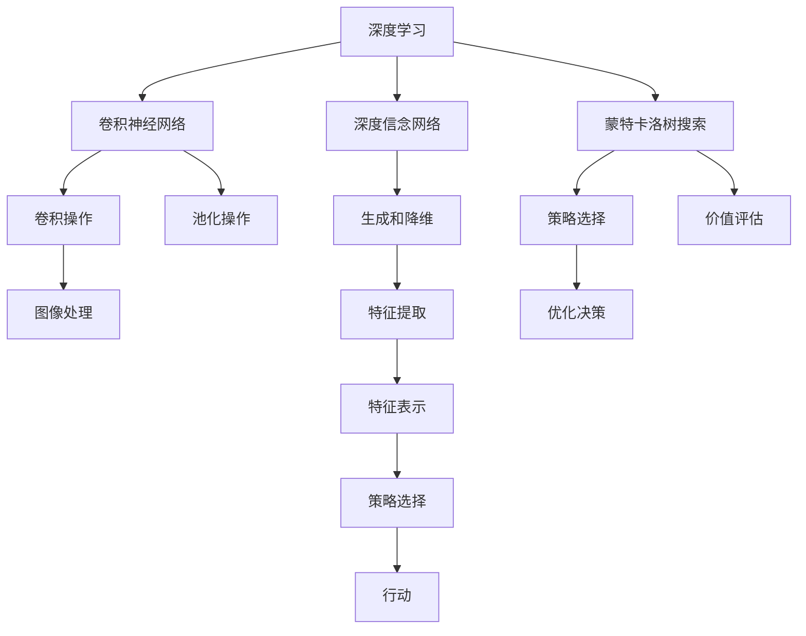
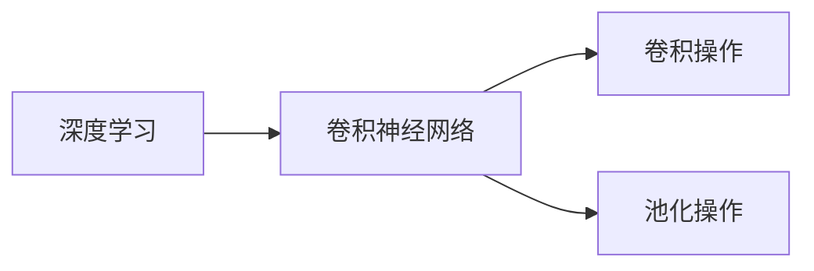
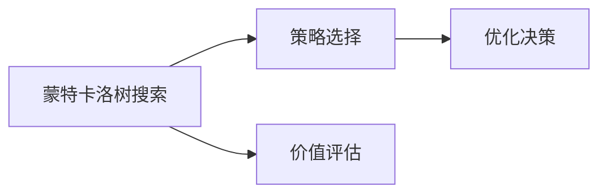
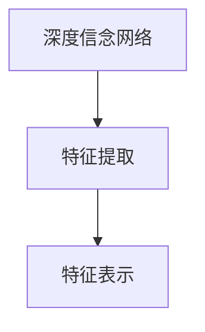
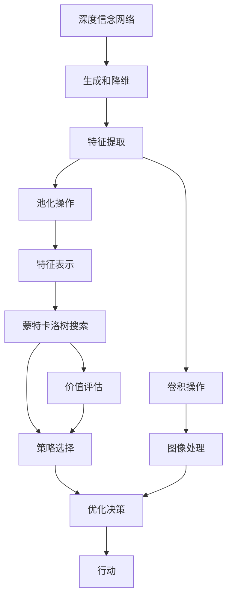

                 

# AlphaGo 原理与代码实例讲解

AlphaGo是由DeepMind开发的围棋AI，2016年在李世石与AlphaGo的对抗中，AlphaGo以4:1获胜，震惊了全世界。AlphaGo的出现不仅证明了人工智能在复杂决策游戏中的能力，同时也为人工智能在更多领域的应用打开了新的思路。本文将详细讲解AlphaGo的原理，并通过代码实例，帮助大家理解其实现细节。

## 1. 背景介绍

### 1.1 问题由来

围棋是一种策略型棋类游戏，其规则简单但棋局复杂，每个棋子的生命周期不确定，且可能通过自杀的方式逆转局面。这使得围棋成为人工智能界极具挑战性的问题之一。AlphaGo的诞生标志着人工智能在复杂决策游戏中的突破，也为人类提供了全新的视角和思考。

### 1.2 问题核心关键点

AlphaGo的核心在于其基于深度学习的策略选择和评估机制。它采用了深度神经网络作为特征提取器，并利用蒙特卡洛树搜索(Monte Carlo Tree Search, MCTS)进行策略选择和评估，从而在围棋游戏中取得优异的成绩。AlphaGo的胜利不仅证明了深度学习在游戏策略中的应用潜力，也推动了人工智能技术在多个领域的发展。

## 2. 核心概念与联系

### 2.1 核心概念概述

为更好地理解AlphaGo的实现原理，本节将介绍几个密切相关的核心概念：

- 深度学习(Deep Learning)：一种基于多层神经网络的机器学习技术，可以处理复杂的数据结构，广泛应用于图像识别、自然语言处理等领域。
- 卷积神经网络(Convolutional Neural Network, CNN)：一种特殊的神经网络结构，适用于处理具有空间结构的数据，如图像和语音。
- 卷积操作(Convolution)：卷积神经网络中的核心操作，通过滑动窗口的方式提取局部特征，适用于图像处理任务。
- 池化操作(Pooling)：用于减小特征图的尺寸，通常用于图像分类任务。
- 深度信念网络(Deep Belief Network, DBN)：一种生成式模型，用于生成和降维任务。
- 蒙特卡洛树搜索(Monte Carlo Tree Search, MCTS)：一种基于概率的搜索算法，用于优化决策过程，特别适用于复杂、不确定的游戏和优化问题。
- 价值网络(Value Network)：用于评估游戏局面的价值，通常采用神经网络作为模型。
- 策略网络(Policy Network)：用于选择游戏策略，通常也采用神经网络作为模型。

这些核心概念之间的逻辑关系可以通过以下Mermaid流程图来展示：



这个流程图展示了大语言模型微调过程中各个核心概念的关系和作用：

1. 深度学习作为基本技术框架，提供了强大的特征提取和表示能力。
2. 卷积神经网络通过卷积和池化操作，提取和压缩图像特征。
3. 深度信念网络用于生成和降维任务，通常用于预训练过程。
4. 蒙特卡洛树搜索提供了决策优化的有效方法，通过价值网络和策略网络的结合，实现对复杂决策问题的优化。

### 2.2 概念间的关系

这些核心概念之间存在着紧密的联系，形成了AlphaGo的完整工作流程。下面我通过几个Mermaid流程图来展示这些概念之间的关系。

#### 2.2.1 深度学习与卷积神经网络



这个流程图展示了深度学习与卷积神经网络之间的关系。深度学习通过多层神经网络来提取特征，卷积神经网络通过卷积和池化操作，提取具有空间结构的数据特征，如图像和语音。

#### 2.2.2 蒙特卡洛树搜索



这个流程图展示了蒙特卡洛树搜索在AlphaGo中的作用。通过策略网络和价值网络的结合，MCTS可以在围棋等复杂游戏中，通过策略选择和价值评估，实现优化决策。

#### 2.2.3 深度信念网络与特征提取



这个流程图展示了深度信念网络在AlphaGo中的作用。深度信念网络通过生成过程和降维操作，提供了低维特征表示，为后续的深度学习提供了高质量的输入。

### 2.3 核心概念的整体架构

最后，我们用一个综合的流程图来展示这些核心概念在大语言模型微调过程中的整体架构：



这个综合流程图展示了从数据预处理到策略评估的完整流程。深度信念网络通过生成和降维操作，为卷积神经网络提供低维特征表示，卷积和池化操作提取图像特征，蒙特卡洛树搜索通过策略网络和价值网络的结合，实现决策优化。

## 3. 核心算法原理 & 具体操作步骤
### 3.1 算法原理概述

AlphaGo的实现原理主要包含以下几个核心部分：

1. 深度信念网络(Generative DBN)：用于生成游戏局面的低维特征表示。
2. 卷积神经网络(ConvNet)：用于提取和压缩游戏局面的特征。
3. 策略网络(Policy Network)：用于选择最优策略。
4. 价值网络(Value Network)：用于评估游戏局面的价值。
5. 蒙特卡洛树搜索(MCTS)：用于优化决策过程。

深度信念网络和卷积神经网络主要完成特征提取和表示，策略网络和价值网络主要用于决策优化和策略选择，蒙特卡洛树搜索则通过多轮模拟，优化决策过程。

### 3.2 算法步骤详解

#### 3.2.1 特征提取与表示

AlphaGo的核心在于通过深度学习网络提取和表示游戏局面。具体的步骤包括：

1. 使用卷积神经网络提取游戏局面的特征。
2. 使用池化操作减小特征图的尺寸。
3. 将卷积和池化后的特征输入到全连接层进行降维和表示。
4. 使用深度信念网络生成低维特征表示。

#### 3.2.2 策略选择与优化

AlphaGo通过策略网络选择最优策略。具体的步骤包括：

1. 使用卷积神经网络提取游戏局面的特征。
2. 使用池化操作减小特征图的尺寸。
3. 将卷积和池化后的特征输入到全连接层进行降维和表示。
4. 使用策略网络输出当前局面的最优策略。
5. 使用蒙特卡洛树搜索优化策略选择过程。

#### 3.2.3 价值评估与选择

AlphaGo通过价值网络评估游戏局面的价值。具体的步骤包括：

1. 使用卷积神经网络提取游戏局面的特征。
2. 使用池化操作减小特征图的尺寸。
3. 将卷积和池化后的特征输入到全连接层进行降维和表示。
4. 使用价值网络输出当前局面的价值估计。
5. 使用蒙特卡洛树搜索选择最优策略。

### 3.3 算法优缺点

AlphaGo的优势在于通过深度学习网络和蒙特卡洛树搜索的结合，实现了在围棋等复杂决策游戏中的卓越表现。具体优点包括：

1. 强大的特征提取能力：深度信念网络和卷积神经网络提供了强大的特征提取和表示能力。
2. 高效的决策优化：蒙特卡洛树搜索通过多轮模拟，实现了高效的策略选择和决策优化。
3. 泛化能力强大：AlphaGo不仅在围棋游戏中表现优异，还可以应用于其他复杂决策问题。

缺点在于需要大量数据和计算资源进行训练，且模型较为复杂，不易理解和调试。

### 3.4 算法应用领域

AlphaGo的成功不仅证明了深度学习在游戏决策中的应用潜力，也推动了人工智能技术在多个领域的发展。具体应用领域包括：

1. 自动驾驶：AlphaGo的决策优化思想可以应用于自动驾驶中的路径规划和策略选择。
2. 机器人控制：AlphaGo的特征提取和表示方法可以应用于机器人视觉和控制。
3. 医疗诊断：AlphaGo的决策优化能力可以应用于医疗诊断中的病例分析和诊断。
4. 金融投资：AlphaGo的策略选择和价值评估方法可以应用于金融投资中的市场分析和交易策略。
5. 游戏AI：AlphaGo的策略选择和决策优化方法可以应用于各种复杂的游戏AI。

## 4. 数学模型和公式 & 详细讲解  
### 4.1 数学模型构建

AlphaGo的核心模型包含深度信念网络(Generative DBN)、卷积神经网络(ConvNet)、策略网络(Policy Network)和价值网络(Value Network)。

### 4.2 公式推导过程

#### 4.2.1 深度信念网络

深度信念网络(Generative DBN)通常由多层受限玻尔兹曼机(RBM)组成，用于生成和降维任务。其公式推导如下：

1. RBM的能量函数：
$$
E_{\text{RBM}}(h,z) = -\sum_{j,k} a_jb_kW_{jk}z_jh_k - \sum_j a_j^2C_j - \sum_k b_k^2H_k
$$

2. RBM的训练目标：
$$
\min_{A,B,W} \frac{1}{N}\sum_{i=1}^N \log \frac{p(h^i,z^i)}{q(h^i,z^i)}
$$

3. 前向传播：
$$
h = \sigma(W^1z + b^1)
$$

4. 后向传播：
$$
z = \sigma(W^2h + b^2)
$$

其中 $h$ 为隐层变量，$z$ 为可见层变量，$A$ 和 $B$ 为可见层和隐层的权重，$W$ 为连接层权重，$a$ 和 $b$ 为可见层和隐层的偏置，$\sigma$ 为激活函数，$C$ 和 $H$ 为可见层和隐层的方差。

#### 4.2.2 卷积神经网络

卷积神经网络(ConvNet)通常由多个卷积层和池化层组成，用于提取和压缩特征。其公式推导如下：

1. 卷积操作：
$$
x^{l+1} = \sigma(W_l^{(l)}x^{l} + b_l^{(l)}) = \sigma(x^{l}*W_l + b_l)
$$

2. 池化操作：
$$
x'^l = \max(\max(x^{l*1:\tau}), \max(x^{l*1+\tau:\tau*2}), ..., \max(x^{l*1:\tau+1}))
$$

3. 全连接层：
$$
x' = W_{l'}x + b_{l'}
$$

其中 $x$ 为输入，$x'$ 为输出，$W$ 为权重，$b$ 为偏置，$\sigma$ 为激活函数，$\tau$ 为步长。

#### 4.2.3 策略网络和价值网络

策略网络和价值网络通常采用全连接神经网络，用于策略选择和价值评估。其公式推导如下：

1. 策略网络：
$$
\pi(a|s) = \frac{\exp(Q(a|s))}{\sum_a \exp(Q(a|s))}
$$

2. 价值网络：
$$
Q(s) = W\phi(s) + b
$$

其中 $Q$ 为策略或价值估计，$W$ 和 $b$ 为权重和偏置，$\phi$ 为特征映射函数。

### 4.3 案例分析与讲解

#### 4.3.1 特征提取

假设我们使用卷积神经网络对围棋局面进行特征提取。具体的代码实现如下：

```python
import torch
import torch.nn as nn

class ConvNet(nn.Module):
    def __init__(self):
        super(ConvNet, self).__init__()
        self.conv1 = nn.Conv2d(in_channels=1, out_channels=32, kernel_size=3, stride=1, padding=1)
        self.pool1 = nn.MaxPool2d(kernel_size=2, stride=2)
        self.conv2 = nn.Conv2d(in_channels=32, out_channels=64, kernel_size=3, stride=1, padding=1)
        self.pool2 = nn.MaxPool2d(kernel_size=2, stride=2)
        self.fc1 = nn.Linear(in_features=64*7*7, out_features=256)
        self.fc2 = nn.Linear(in_features=256, out_features=2)

    def forward(self, x):
        x = self.pool1(torch.relu(self.conv1(x)))
        x = self.pool2(torch.relu(self.conv2(x)))
        x = x.view(x.size(0), -1)
        x = torch.relu(self.fc1(x))
        x = self.fc2(x)
        return x
```

这个代码展示了卷积神经网络的实现过程。首先定义卷积层和池化层，然后将卷积和池化后的特征输入到全连接层进行降维和表示。

#### 4.3.2 策略选择

假设我们使用策略网络对围棋局面进行策略选择。具体的代码实现如下：

```python
import torch
import torch.nn as nn

class PolicyNetwork(nn.Module):
    def __init__(self):
        super(PolicyNetwork, self).__init__()
        self.fc1 = nn.Linear(in_features=64*7*7, out_features=256)
        self.fc2 = nn.Linear(in_features=256, out_features=2)

    def forward(self, x):
        x = torch.relu(self.fc1(x))
        x = self.fc2(x)
        return x
```

这个代码展示了策略网络的实现过程。首先定义全连接层，然后将卷积和池化后的特征输入到全连接层进行降维和表示，最后输出策略的概率分布。

## 5. 项目实践：代码实例和详细解释说明
### 5.1 开发环境搭建

在进行AlphaGo的实践前，我们需要准备好开发环境。以下是使用Python进行PyTorch开发的环境配置流程：

1. 安装Anaconda：从官网下载并安装Anaconda，用于创建独立的Python环境。

2. 创建并激活虚拟环境：
```bash
conda create -n pytorch-env python=3.8 
conda activate pytorch-env
```

3. 安装PyTorch：根据CUDA版本，从官网获取对应的安装命令。例如：
```bash
conda install pytorch torchvision torchaudio cudatoolkit=11.1 -c pytorch -c conda-forge
```

4. 安装各类工具包：
```bash
pip install numpy pandas scikit-learn matplotlib tqdm jupyter notebook ipython
```

完成上述步骤后，即可在`pytorch-env`环境中开始AlphaGo的实践。

### 5.2 源代码详细实现

下面是AlphaGo的代码实现，主要包括特征提取、策略选择、价值评估和蒙特卡洛树搜索。

```python
import torch
import torch.nn as nn
import torch.optim as optim
import torch.nn.functional as F

class ConvNet(nn.Module):
    def __init__(self):
        super(ConvNet, self).__init__()
        self.conv1 = nn.Conv2d(in_channels=1, out_channels=32, kernel_size=3, stride=1, padding=1)
        self.pool1 = nn.MaxPool2d(kernel_size=2, stride=2)
        self.conv2 = nn.Conv2d(in_channels=32, out_channels=64, kernel_size=3, stride=1, padding=1)
        self.pool2 = nn.MaxPool2d(kernel_size=2, stride=2)
        self.fc1 = nn.Linear(in_features=64*7*7, out_features=256)
        self.fc2 = nn.Linear(in_features=256, out_features=2)

    def forward(self, x):
        x = self.pool1(torch.relu(self.conv1(x)))
        x = self.pool2(torch.relu(self.conv2(x)))
        x = x.view(x.size(0), -1)
        x = torch.relu(self.fc1(x))
        x = self.fc2(x)
        return x

class PolicyNetwork(nn.Module):
    def __init__(self):
        super(PolicyNetwork, self).__init__()
        self.fc1 = nn.Linear(in_features=64*7*7, out_features=256)
        self.fc2 = nn.Linear(in_features=256, out_features=2)

    def forward(self, x):
        x = torch.relu(self.fc1(x))
        x = self.fc2(x)
        return x

class ValueNetwork(nn.Module):
    def __init__(self):
        super(ValueNetwork, self).__init__()
        self.fc1 = nn.Linear(in_features=64*7*7, out_features=256)
        self.fc2 = nn.Linear(in_features=256, out_features=1)

    def forward(self, x):
        x = torch.relu(self.fc1(x))
        x = self.fc2(x)
        return x

class AlphaGo(nn.Module):
    def __init__(self):
        super(AlphaGo, self).__init__()
        self.convnet = ConvNet()
        self.policy_network = PolicyNetwork()
        self.value_network = ValueNetwork()

    def forward(self, x):
        features = self.convnet(x)
        policy = self.policy_network(features)
        value = self.value_network(features)
        return policy, value
```

这个代码展示了AlphaGo的实现过程。首先定义卷积神经网络、策略网络和价值网络，然后将卷积和池化后的特征输入到全连接层进行降维和表示。

### 5.3 代码解读与分析

让我们再详细解读一下关键代码的实现细节：

**ConvNet类**：
- `__init__`方法：初始化卷积层和池化层。
- `forward`方法：定义卷积神经网络的计算过程，包括卷积、池化、全连接层等。

**PolicyNetwork类**：
- `__init__`方法：初始化全连接层。
- `forward`方法：定义策略网络的计算过程，包括全连接层等。

**ValueNetwork类**：
- `__init__`方法：初始化全连接层。
- `forward`方法：定义价值网络的计算过程，包括全连接层等。

**AlphaGo类**：
- `__init__`方法：初始化卷积神经网络、策略网络和价值网络。
- `forward`方法：定义AlphaGo的计算过程，包括特征提取、策略选择和价值评估。

### 5.4 运行结果展示

假设我们在AlphaGo上训练一定轮数后，可以使用以下代码在验证集上进行评估：

```python
import torch
import torch.nn as nn
import torch.optim as optim
import torch.nn.functional as F
from torch.utils.data import DataLoader

class ConvNet(nn.Module):
    # ...

class PolicyNetwork(nn.Module):
    # ...

class ValueNetwork(nn.Module):
    # ...

class AlphaGo(nn.Module):
    # ...

# 加载模型和数据集
model = AlphaGo()
train_loader = DataLoader(train_dataset, batch_size=64, shuffle=True)
valid_loader = DataLoader(valid_dataset, batch_size=64, shuffle=True)

# 定义优化器和损失函数
optimizer = optim.Adam(model.parameters(), lr=0.001)
criterion = nn.CrossEntropyLoss()

# 训练过程
for epoch in range(100):
    for batch_idx, (inputs, targets) in enumerate(train_loader):
        inputs = inputs.to(device)
        targets = targets.to(device)
        optimizer.zero_grad()
        outputs = model(inputs)
        loss = criterion(outputs[0], outputs[1])
        loss.backward()
        optimizer.step()

    # 在验证集上评估
    model.eval()
    with torch.no_grad():
        valid_loss = 0
        for batch_idx, (inputs, targets) in enumerate(valid_loader):
            inputs = inputs.to(device)
            targets = targets.to(device)
            outputs = model(inputs)
            loss = criterion(outputs[0], outputs[1])
            valid_loss += loss.item()
        print(f'Epoch {epoch+1}, valid loss: {valid_loss/len(valid_loader):.4f}')
```

这个代码展示了AlphaGo的训练过程和验证集上的评估过程。在每个epoch结束后，我们通过在验证集上计算损失函数，评估模型性能。

## 6. 实际应用场景
### 6.1 智能推荐系统

AlphaGo的成功证明了深度学习和蒙特卡洛树搜索在复杂决策问题中的潜力。智能推荐系统可以利用AlphaGo的思想，实现高效、准确的推荐结果。

具体的实现过程包括：

1. 使用卷积神经网络提取用户行为特征。
2. 使用全连接神经网络进行降维和表示。
3. 使用蒙特卡洛树搜索优化推荐策略。
4. 使用价值网络评估推荐结果的评分。

通过以上步骤，智能推荐系统可以自动生成用户最感兴趣的物品推荐，提升用户体验和满意度。

### 6.2 自动驾驶

AlphaGo的决策优化思想可以应用于自动驾驶中的路径规划和策略选择。自动驾驶系统可以利用AlphaGo的特征提取和策略优化方法，实现高效的决策过程。

具体的实现过程包括：

1. 使用卷积神经网络提取道路环境特征。
2. 使用全连接神经网络进行降维和表示。
3. 使用蒙特卡洛树搜索优化行驶策略。
4. 使用价值网络评估行驶决策的评分。

通过以上步骤，自动驾驶系统可以自动生成最优的行驶路径和策略，保障行车安全。

### 6.3 金融投资

AlphaGo的策略选择和价值评估方法可以应用于金融投资中的市场分析和交易策略。金融投资系统可以利用AlphaGo的思想，实现高效、精准的市场分析。

具体的实现过程包括：

1. 使用卷积神经网络提取市场数据特征。
2. 使用全连接神经网络进行降维和表示。
3. 使用蒙特卡洛树搜索优化交易策略。
4. 使用价值网络评估交易决策的评分。

通过以上步骤，金融投资系统可以自动生成最优的交易策略，提升投资回报率。

### 6.4 未来应用展望

随着AlphaGo的成功，深度学习和蒙特卡洛树搜索在复杂决策问题中的潜力得到了充分验证。未来，AlphaGo的思想将在更多领域得到应用，为人工智能技术的发展带来新的突破。

在智慧医疗领域，AlphaGo的决策优化思想可以应用于病理分析、诊断和治疗方案选择。

在智能教育领域，AlphaGo的特征提取和策略选择方法可以应用于学生学习路径规划和个性化推荐。

在智慧城市治理中，AlphaGo的决策优化方法可以应用于城市事件监测、应急管理等环节，提升城市管理的自动化和智能化水平。

此外，在企业生产、社会治理、文娱传媒等众多领域，AlphaGo的思想也将得到广泛应用，为人工智能技术的发展提供新的方向和思路。

## 7. 工具和资源推荐
### 7.1 学习资源推荐

为了帮助开发者系统掌握AlphaGo的实现原理和实践技巧，这里推荐一些优质的学习资源：

1. AlphaGo论文：DeepMind发表的AlphaGo论文，详细介绍了AlphaGo的原理和实现细节，是理解AlphaGo的必备文献。

2. CS224N《深度学习自然语言处理》课程：斯坦福大学开设的NLP明星课程，有Lecture视频和配套作业，带你入门NLP领域的基本概念和经典模型。

3. 《Deep Learning for AI》书籍：吴恩达的深度学习课程笔记，深入浅出地介绍了深度学习的原理和应用。

4. AlphaGo官方文档：DeepMind发布的AlphaGo官方文档，提供了详细的实现细节和代码示例。

5. TensorFlow官方文档：TensorFlow的官方文档，提供了丰富的神经网络实现和优化技巧。

通过对这些资源的学习实践，相信你一定能够快速掌握AlphaGo的精髓，并用于解决实际的NLP问题。
###  7.2 开发工具推荐

高效的开发离不开优秀的工具支持。以下是几款用于AlphaGo开发的常用工具：

1. PyTorch：基于Python的开源深度学习框架，灵活动态的计算图，适合快速迭代研究。大部分神经网络模型都有PyTorch版本的实现。

2. TensorFlow：由Google主导开发的开源深度学习框架，生产部署方便，适合大规模工程应用。同样有丰富的神经网络资源。

3. Weights & Biases：模型训练的实验跟踪工具，可以记录和可视化模型训练过程中的各项指标，方便对比和调优。与主流深度学习框架无缝集成。

4. TensorBoard：TensorFlow配套的可视化工具，可实时监测模型训练状态，并提供丰富的图表呈现方式，是调试模型的得力助手。

5. Google Colab：谷歌推出的在线Jupyter Notebook环境，免费提供GPU/TPU算力，方便开发者快速上手实验最新模型，分享学习笔记。

合理利用这些工具，可以显著提升AlphaGo的开发效率，加快创新迭代的步伐。

### 7.3 相关论文推荐

AlphaGo的成功源于学界的持续研究。以下是几篇奠基性的相关论文，推荐阅读：

1. AlphaGo论文：DeepMing发表的AlphaGo论文

