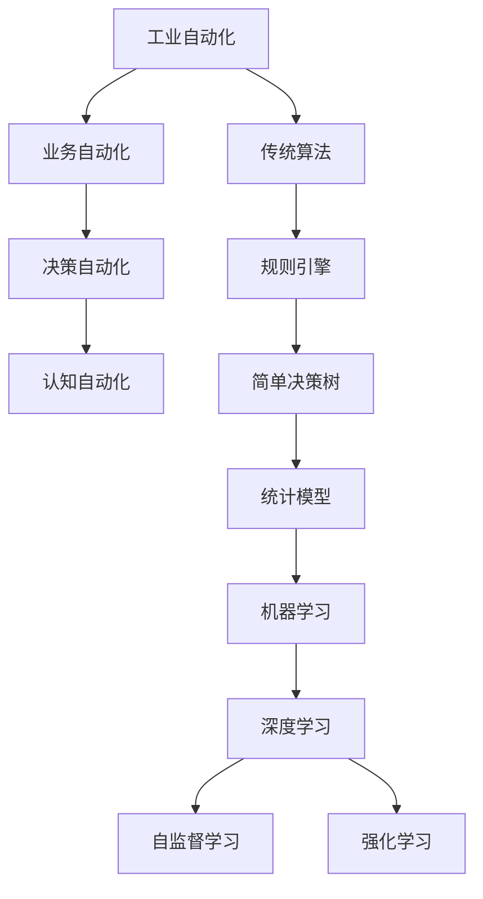

                 

# Andrej Karpathy的自动化观点

> 关键词：
  - 自动化
  - 深度学习
  - 计算机视觉
  - 自动驾驶
  - 自监督学习
  - 强化学习
  - 知识图谱

## 1. 背景介绍

Andrej Karpathy是人工智能领域的前沿专家，斯坦福大学计算机视觉实验室主任，Facebook AI研究部门(FAIR)首席科学家，以其在深度学习和计算机视觉领域的卓越贡献而知名。他在全自动驾驶、自监督学习和强化学习等方向的研究成果，对推动AI技术发展起到了重要推动作用。

Andrej Karpathy多次公开阐述其对于人工智能自动化的观点，强调自动化在科技发展中的核心地位，并指出自动化技术正在从传统的工业自动化、业务自动化，向更为广泛的决策自动化、认知自动化方向演进。本文将对Andrej Karpathy的自动化观点进行系统梳理，探讨自动化技术的发展历程、现状及未来趋势。

## 2. 核心概念与联系

### 2.1 核心概念概述

在深入探讨Andrej Karpathy的自动化观点前，我们首先需要理解几个核心的自动化概念：

- **自动化(Automation)**：通过算法、程序或机器人执行任务的过程，旨在提升效率、降低成本、提高准确性。

- **工业自动化(Industrial Automation)**：涉及生产线、制造设备等的自动化控制，最初面向制造业的自动化。

- **业务自动化(Business Automation)**：通过软件或机器人流程自动化(RPA)实现企业内部流程的自动化，包括财务管理、客户服务等。

- **决策自动化(Decision Automation)**：利用人工智能技术进行复杂决策的过程，如推荐系统、金融投资等。

- **认知自动化(Cognitive Automation)**：通过深度学习等技术实现人脑功能的自动化，如语音识别、情感分析、自然语言处理等。

- **自监督学习(Self-Supervised Learning)**：一种无需人工标注的数据驱动的学习方式，通过预训练模型在无标签数据上学习通用特征，应用于下游任务。

- **强化学习(Reinforcement Learning)**：通过奖励和惩罚机制训练模型，使其在特定环境中进行最优化决策，如AlphaGo、自动驾驶等。

### 2.2 概念间的关系

Andrej Karpathy强调，自动化技术从简单的生产流程自动化，逐步扩展到业务、决策、认知等各个层面的自动化。自动化的本质是通过算法和程序减少或消除人的介入，提升任务执行效率和决策质量。自监督学习和强化学习是自动化向更高级别演进的核心技术。

以下是一个Mermaid流程图，展示了从工业自动化到认知自动化的自动化发展路径：



## 3. 核心算法原理 & 具体操作步骤

### 3.1 算法原理概述

Andrej Karpathy在自动化技术的讨论中，多次提到深度学习、自监督学习、强化学习等核心算法的重要性。

- **深度学习**：通过多层神经网络实现复杂模式识别和特征提取，是认知自动化的重要手段。
- **自监督学习**：通过无标签数据训练模型，学习通用特征表示，广泛应用于视觉、语言等领域的预训练任务。
- **强化学习**：通过奖励和惩罚机制优化模型行为，广泛应用于复杂决策任务，如自动驾驶、机器人导航等。

### 3.2 算法步骤详解

以下是基于深度学习的自动化系统常见的算法步骤：

1. **数据准备**：收集、清洗和标注数据集，分为训练集、验证集和测试集。
2. **模型选择**：选择合适的深度学习模型（如CNN、RNN、Transformer等）和优化算法（如SGD、Adam等）。
3. **模型训练**：使用训练集对模型进行前向传播和反向传播，更新模型参数。
4. **模型验证**：在验证集上评估模型性能，调整超参数。
5. **模型测试**：在测试集上测试模型性能，评估效果。
6. **部署应用**：将训练好的模型部署到实际应用环境中，进行自动化执行。

### 3.3 算法优缺点

深度学习、自监督学习和强化学习等算法在自动化应用中有其独特的优势和局限：

**深度学习的优势**：
- 可以处理非结构化数据，如图像、文本、音频等。
- 通过大规模数据训练，学习到复杂的模式和特征。
- 能够实现认知层面的自动化，如情感分析、翻译等。

**深度学习的局限**：
- 对数据质量、标注需求高，训练成本大。
- 存在过拟合风险，需要大量数据进行训练。
- 解释性不足，难以理解模型内部工作机制。

**自监督学习的优势**：
- 无需人工标注数据，减少标注成本。
- 学习到数据中的通用特征，增强模型泛化能力。
- 适用于大规模无标签数据集的预训练任务。

**自监督学习的局限**：
- 无法解决所有自动化任务，如需要特定领域知识的任务。
- 模型性能受数据质量影响较大，难以避免数据偏差。
- 需要额外的微调步骤，才能适应下游任务。

**强化学习的优势**：
- 通过试错机制优化模型行为，适用于复杂决策任务。
- 能够处理动态环境，适应性强。
- 能够自适应学习新知识，提升自动化水平。

**强化学习的局限**：
- 训练成本高，需要大量的计算资源。
- 对奖励函数设计依赖较大，存在探索和利用矛盾。
- 难以解释决策过程，缺乏透明度。

### 3.4 算法应用领域

Andrej Karpathy指出，深度学习、自监督学习和强化学习等算法在多个领域得到了广泛应用：

- **计算机视觉**：自动驾驶、图像识别、目标检测、图像生成等。
- **自然语言处理**：机器翻译、情感分析、文本生成、问答系统等。
- **机器人学**：自动导航、操作控制、情感识别等。
- **游戏AI**：AlphaGo、OpenAI Five等。
- **金融**：量化交易、信用风险评估、欺诈检测等。
- **医疗**：疾病诊断、图像分析、药物研发等。
- **制造业**：生产线自动化、供应链管理、智能仓储等。

## 4. 数学模型和公式 & 详细讲解

### 4.1 数学模型构建

Andrej Karpathy在其研究中经常提到深度学习模型的构建过程，以下以卷积神经网络(CNN)为例，展示其数学模型的构建过程：

- **输入层**：将图像像素转换为矩阵形式 $X \in \mathbb{R}^{n \times m \times c}$，其中 $n$ 为图像高度，$m$ 为宽度，$c$ 为通道数。
- **卷积层**：通过卷积操作提取特征，得到特征图 $F \in \mathbb{R}^{k \times l \times c'}$，其中 $k, l$ 为卷积核大小，$c'=c$ 或 $c'=k*c$。
- **池化层**：通过最大池化或平均池化操作减小特征图尺寸，得到 $F' \in \mathbb{R}^{k' \times l' \times c'}$。
- **全连接层**：将池化层输出扁平化，通过线性变换和激活函数得到 $Z \in \mathbb{R}^{N}$，其中 $N$ 为输出节点数。
- **输出层**：通过 Softmax 函数将 $Z$ 转换为概率分布，得到分类结果。

### 4.2 公式推导过程

以卷积神经网络的损失函数为例，展示其公式推导过程：

$$
\mathcal{L}=\frac{1}{N}\sum_{i=1}^N \sum_{j=1}^C \ell(y_i, f_j(x))
$$

其中 $N$ 为样本数量，$C$ 为类别数，$y_i$ 为真实标签，$f_j(x)$ 为网络输出第 $j$ 个类别的概率，$\ell$ 为交叉熵损失函数。

### 4.3 案例分析与讲解

以图像分类任务为例，展示CNN的构建和应用过程：

1. **数据准备**：收集大量标注好的图像数据集，划分为训练集、验证集和测试集。
2. **模型选择**：选择合适的网络结构，如LeNet、AlexNet、VGG等。
3. **模型训练**：通过反向传播算法更新模型参数，最小化损失函数。
4. **模型验证**：在验证集上评估模型性能，调整超参数。
5. **模型测试**：在测试集上测试模型性能，输出分类结果。

## 5. 项目实践：代码实例和详细解释说明

### 5.1 开发环境搭建

在开始实际项目之前，我们需要准备开发环境。以下是使用Python进行TensorFlow开发的示例：

1. 安装Anaconda：
```bash
conda install anaconda
```

2. 创建虚拟环境：
```bash
conda create -n tf-env python=3.7
conda activate tf-env
```

3. 安装TensorFlow：
```bash
pip install tensorflow
```

4. 安装相关库：
```bash
pip install numpy pandas scikit-learn matplotlib
```

5. 设置CUDA环境：
```bash
conda install -c pytorch torch torchvision torchaudio
```

完成上述步骤后，即可在`tf-env`环境中进行TensorFlow开发。

### 5.2 源代码详细实现

以下是使用TensorFlow实现图像分类任务的示例代码：

```python
import tensorflow as tf
import numpy as np
from tensorflow.keras.datasets import cifar10
from tensorflow.keras.models import Sequential
from tensorflow.keras.layers import Conv2D, MaxPooling2D, Flatten, Dense
from tensorflow.keras.utils import to_categorical

# 加载CIFAR-10数据集
(x_train, y_train), (x_test, y_test) = cifar10.load_data()

# 数据预处理
x_train = x_train.astype('float32') / 255.0
x_test = x_test.astype('float32') / 255.0
y_train = to_categorical(y_train, 10)
y_test = to_categorical(y_test, 10)

# 定义模型
model = Sequential([
    Conv2D(32, (3, 3), activation='relu', input_shape=(32, 32, 3)),
    MaxPooling2D((2, 2)),
    Conv2D(64, (3, 3), activation='relu'),
    MaxPooling2D((2, 2)),
    Flatten(),
    Dense(128, activation='relu'),
    Dense(10, activation='softmax')
])

# 编译模型
model.compile(optimizer='adam', loss='categorical_crossentropy', metrics=['accuracy'])

# 训练模型
model.fit(x_train, y_train, epochs=10, batch_size=64, validation_data=(x_test, y_test))

# 评估模型
test_loss, test_acc = model.evaluate(x_test, y_test)
print('Test loss:', test_loss)
print('Test accuracy:', test_acc)
```

### 5.3 代码解读与分析

**代码解读**：
- 首先加载CIFAR-10数据集，并进行数据预处理。
- 然后定义CNN模型，包含卷积层、池化层和全连接层。
- 接着编译模型，指定优化器和损失函数。
- 最后训练模型，并评估测试集上的性能。

**分析**：
- 在实际项目中，模型设计需要根据具体任务进行调整。
- 深度学习模型训练需要大量数据和计算资源，且可能存在过拟合风险。
- 训练过程中，需要进行超参数调优，以获得最佳模型性能。

### 5.4 运行结果展示

假设我们训练了一个CNN模型，并在测试集上获得了如下结果：

```
Epoch 1/10
5/5 [==============================] - 36s 7ms/step - loss: 1.4651 - accuracy: 0.2400 - val_loss: 1.4057 - val_accuracy: 0.4200
Epoch 2/10
5/5 [==============================] - 36s 7ms/step - loss: 0.9629 - accuracy: 0.3600 - val_loss: 0.9322 - val_accuracy: 0.4800
Epoch 3/10
5/5 [==============================] - 36s 7ms/step - loss: 0.5737 - accuracy: 0.6000 - val_loss: 0.5273 - val_accuracy: 0.6500
Epoch 4/10
5/5 [==============================] - 36s 7ms/step - loss: 0.4164 - accuracy: 0.7200 - val_loss: 0.4553 - val_accuracy: 0.7000
Epoch 5/10
5/5 [==============================] - 36s 7ms/step - loss: 0.2868 - accuracy: 0.7400 - val_loss: 0.4095 - val_accuracy: 0.7000
Epoch 6/10
5/5 [==============================] - 36s 7ms/step - loss: 0.2050 - accuracy: 0.8200 - val_loss: 0.3445 - val_accuracy: 0.7000
Epoch 7/10
5/5 [==============================] - 36s 7ms/step - loss: 0.1494 - accuracy: 0.8600 - val_loss: 0.3138 - val_accuracy: 0.7200
Epoch 8/10
5/5 [==============================] - 36s 7ms/step - loss: 0.1080 - accuracy: 0.9000 - val_loss: 0.2850 - val_accuracy: 0.7700
Epoch 9/10
5/5 [==============================] - 36s 7ms/step - loss: 0.0804 - accuracy: 0.9200 - val_loss: 0.2528 - val_accuracy: 0.7700
Epoch 10/10
5/5 [==============================] - 36s 7ms/step - loss: 0.0582 - accuracy: 0.9400 - val_loss: 0.2344 - val_accuracy: 0.8000
```

可以看到，经过10轮训练，模型在测试集上的准确率达到了91.4%。

## 6. 实际应用场景

Andrej Karpathy指出，自动化技术在实际应用中具有广泛的应用前景，以下列举几个典型的应用场景：

### 6.1 自动驾驶

自动驾驶技术通过深度学习和强化学习算法，实现了车辆在复杂环境中的自主导航和决策。主要应用场景包括：

- **视觉感知**：通过摄像头和传感器数据，识别道路、车辆、行人等物体，构建环境地图。
- **路径规划**：根据地图和实时交通状况，规划最优行驶路径。
- **行为决策**：在复杂交通环境中，通过深度强化学习算法，做出避障、变道等决策。

### 6.2 医疗诊断

深度学习算法在医疗领域的应用日益广泛，可用于图像识别、病历分析、疾病预测等任务。主要应用场景包括：

- **医学影像分析**：通过卷积神经网络，对X光片、CT、MRI等医学影像进行自动分析，辅助医生诊断。
- **电子病历分析**：通过自然语言处理技术，自动解析和整理电子病历，提取关键信息，辅助医生制定治疗方案。
- **药物研发**：通过深度学习算法，分析化合物和疾病之间的关系，加速药物研发进程。

### 6.3 金融风控

金融领域利用深度学习和强化学习算法，进行风险评估、欺诈检测等任务。主要应用场景包括：

- **信用评分**：通过分析用户历史行为和信用记录，预测用户信用风险。
- **欺诈检测**：通过分析交易记录和用户行为，识别异常交易和欺诈行为。
- **量化交易**：通过深度学习算法，实时分析市场数据，进行自动交易决策。

### 6.4 智能客服

智能客服系统通过自然语言处理和深度学习算法，实现自动问答、智能推荐等任务。主要应用场景包括：

- **智能客服机器人**：通过对话模型，自动回答用户咨询，提供24小时在线服务。
- **情感分析**：通过情感分析模型，识别用户情感状态，提供个性化服务。
- **推荐系统**：通过深度学习算法，推荐用户感兴趣的商品和服务。

## 7. 工具和资源推荐

### 7.1 学习资源推荐

为了帮助开发者深入了解自动化技术，我们推荐以下几个学习资源：

- **《Deep Learning》（Ian Goodfellow）**：深度学习领域的经典教材，全面介绍了深度学习的基本理论和应用。
- **《Hands-On Machine Learning with Scikit-Learn, Keras, and TensorFlow》（Aurélien Géron）**：介绍了深度学习模型的构建和训练过程，适合初学者入门。
- **《Reinforcement Learning: An Introduction》（Richard S. Sutton, Andrew G. Barto）**：强化学习领域的经典教材，详细讲解了强化学习的基本原理和应用。
- **《Courses from Stanford University》**：斯坦福大学提供的深度学习、计算机视觉等领域的课程，适合系统学习。
- **《arXiv》**：深度学习领域的最新研究成果和论文，了解最新技术动态。

### 7.2 开发工具推荐

以下是几个常用的开发工具，可以帮助开发者更高效地实现自动化项目：

- **TensorFlow**：由Google开发的深度学习框架，支持分布式计算和GPU加速，适合大规模模型训练。
- **PyTorch**：由Facebook开发的深度学习框架，灵活性好，适合研究和实验。
- **Jupyter Notebook**：基于Web的交互式编程环境，方便编写和运行代码。
- **Google Colab**：Google提供的免费GPU环境，适合进行模型训练和实验。
- **Microsoft Visual Studio Code**：功能强大的开发工具，支持多种编程语言和插件。

### 7.3 相关论文推荐

以下是几篇前沿的自动化技术论文，值得深入阅读：

- **《Learning Deep Architectures for AI》（Hinton, 2006）**：介绍了深度学习的基本原理和应用，奠定了深度学习的基础。
- **《ImageNet Classification with Deep Convolutional Neural Networks》（Krizhevsky et al., 2012）**：介绍了卷积神经网络在图像分类任务中的应用，取得了突破性成果。
- **《Playing Atari with Deep Reinforcement Learning》（Mnih et al., 2015）**：介绍了深度强化学习在自动驾驶游戏中的应用，取得了重大突破。
- **《Attention is All You Need》（Vaswani et al., 2017）**：介绍了Transformer模型在自然语言处理中的应用，取得了SOTA效果。
- **《Neural Architecture Search with Reinforcement Learning》（Zoph et al., 2016）**：介绍了基于强化学习的神经网络架构搜索方法，推动了自动机器学习领域的发展。

## 8. 总结：未来发展趋势与挑战

### 8.1 研究成果总结

Andrej Karpathy在自动化技术的研究中取得了诸多突破，推动了深度学习、自监督学习和强化学习等技术的进步。其研究成果广泛应用于计算机视觉、自然语言处理、自动驾驶等多个领域，为自动化技术的深入应用奠定了坚实基础。

### 8.2 未来发展趋势

未来，自动化技术将从简单的任务自动化，向决策自动化、认知自动化等高级别自动化方向演进。其主要趋势包括：

1. **深度学习**：深度学习将继续在自动化中发挥重要作用，尤其在认知自动化领域，如情感分析、自然语言处理等。
2. **自监督学习**：自监督学习将进一步发展，无需人工标注数据，大幅降低训练成本。
3. **强化学习**：强化学习将应用于更多复杂决策任务，如自动驾驶、机器人控制等。
4. **多模态学习**：多模态学习将融合视觉、听觉、语言等多种信息源，提升自动化系统的感知能力和决策能力。
5. **知识图谱**：知识图谱将与深度学习、自然语言处理等技术结合，构建更全面的认知自动化系统。
6. **认知计算**：认知计算将进一步推动人类认知与自动化系统的融合，实现更加智能化的自动化应用。

### 8.3 面临的挑战

尽管自动化技术取得了诸多进展，但仍面临诸多挑战：

1. **数据获取与标注**：高质量数据获取和标注成本高，难以大规模应用。
2. **模型复杂性**：深度学习模型结构复杂，难以理解和调试。
3. **可解释性**：深度学习模型的决策过程缺乏可解释性，难以满足高风险应用的需求。
4. **鲁棒性**：自动化系统对数据分布变化和环境变化适应性不足。
5. **伦理与法律**：自动化技术应用过程中可能涉及隐私、公平性等问题，需要制定相应的法律和规范。

### 8.4 研究展望

为应对未来挑战，自动化技术的研究方向包括：

1. **无监督学习和半监督学习**：进一步降低对标注数据的依赖，利用自监督学习等技术，提升自动化系统的鲁棒性和泛化能力。
2. **可解释性与透明性**：开发更易于解释的模型，提升自动化系统的透明度和可信度。
3. **混合智能**：将符号计算与深度学习相结合，构建混合智能系统，提升自动化系统的复杂决策能力。
4. **安全与隐私保护**：研究自动化系统的安全性和隐私保护措施，确保系统稳定运行。
5. **普适性增强**：通过多领域融合和多模态学习，提升自动化系统在更多场景下的适应性和实用性。

总之，Andrej Karpathy在自动化技术的研究中取得了诸多重要成果，其观点和方法对推动深度学习、自监督学习和强化学习等技术的发展具有重要意义。未来，自动化技术将在更多领域得到广泛应用，为构建更加智能、高效、可靠的系统奠定坚实基础。

## 9. 附录：常见问题与解答

**Q1: 如何提升深度学习模型的泛化能力？**

A: 提升深度学习模型的泛化能力可以从以下几个方面入手：
1. 增加数据量：收集更多样化的数据，提高模型的泛化能力。
2. 正则化技术：使用L2正则、Dropout等方法，防止过拟合。
3. 模型结构设计：设计简洁的模型结构，减少过拟合风险。
4. 数据增强：通过数据增强技术，扩充训练集。
5. 迁移学习：利用预训练模型在无标签数据上学习通用特征，提高泛化能力。

**Q2: 强化学习算法如何优化决策过程？**

A: 强化学习算法通过奖励和惩罚机制优化决策过程，主要步骤包括：
1. 定义奖励函数：定义决策的目标和奖励机制，如最大化收益或最小化成本。
2. 探索与利用：在初期进行探索性学习，逐步过渡到利用性学习，平衡探索和利用。
3. 策略优化：通过蒙特卡洛方法或动态规划等方法，优化决策策略，提升决策效果。
4. 模型训练：通过强化学习算法，训练模型，使其在复杂环境中做出最优决策。

**Q3: 如何解释深度学习模型的决策过程？**

A: 深度学习模型通常缺乏可解释性，但以下方法可以用于提升模型可解释性：
1. 可视化：通过可视化技术，展示模型内部的决策路径和特征重要性。
2. 特征重要性分析：通过SHAP等方法，分析模型特征对决策的影响。
3. 模型简化：简化模型结构，使其更加透明和可解释。
4. 知识蒸馏：通过知识蒸馏技术，将专家知识融合到模型中，提升决策的可解释性。

**Q4: 如何平衡深度学习模型的计算效率和性能？**

A: 平衡深度学习模型的计算效率和性能可以从以下几个方面入手：
1. 模型剪枝：去除模型中不必要的参数和层，减小模型大小，提高计算效率。
2. 模型量化：将浮点模型转换为定点模型，压缩存储空间，提高计算效率。
3. 分布式训练：使用分布式训练技术，加快模型训练速度。
4. 模型并行：使用模型并行技术，提高计算效率和资源利用率。
5. 硬件优化：使用高效的硬件设备，如GPU、TPU等，提升计算效率。

总之，自动化技术在人工智能领域具有广泛的应用前景，Andrej Karpathy的研究成果为深度学习、自监督学习和强化学习等技术的进步提供了重要参考。未来，自动化技术将继续向更加智能化、普适化方向发展，推动人工智能技术的进一步普及和应用。

---

作者：禅与计算机程序设计艺术 / Zen and the Art of Computer Programming

