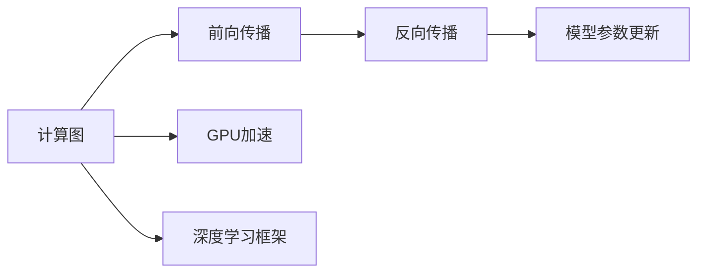
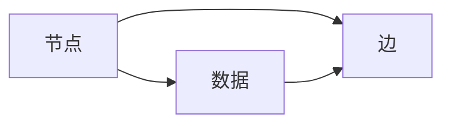
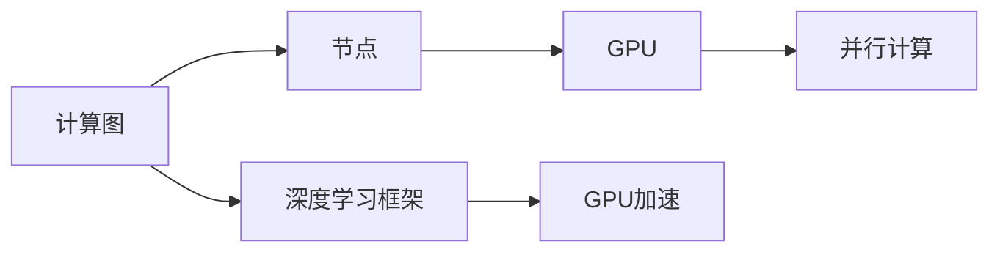
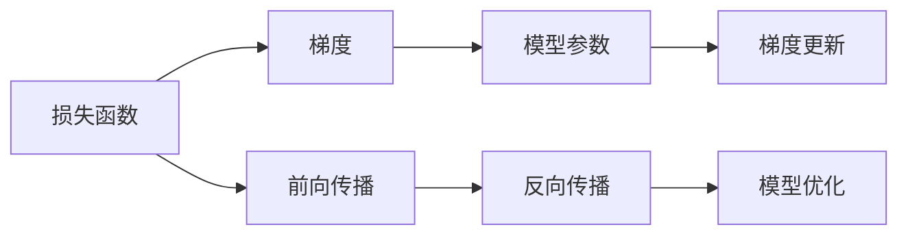
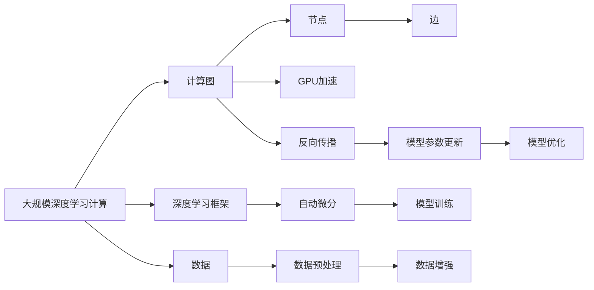

                 

# Andrej Karpathy的计算新观念

> 关键词：计算图、GPU、深度学习、自动微分、反向传播

## 1. 背景介绍

### 1.1 问题由来
在深度学习领域，尤其是计算图和GPU加速的发展背景下，Andrej Karpathy作为深度学习的先锋人物，提出了一系列颠覆性的计算新观念，深刻影响了计算图、深度学习和GPU加速的发展方向。这些新观念不仅推动了技术进步，也引发了学术界的广泛讨论。本文旨在深入探讨Andrej Karpathy提出的计算新观念，并结合具体案例分析其核心思想和应用效果。

### 1.2 问题核心关键点
Andrej Karpathy的计算新观念主要涉及以下几个关键点：
- 计算图(Computational Graph)：如何将复杂计算分解为简单的基本操作，并通过自动微分实现高效的反向传播。
- GPU加速：如何利用GPU进行并行计算，提升深度学习模型的训练速度。
- 反向传播：深度学习模型的训练过程，尤其是如何通过反向传播算法优化模型参数。
- 深度学习框架：构建高效、灵活的深度学习框架，支持多样化的深度学习应用。

这些核心关键点相互关联，共同构成了Andrej Karpathy计算新观念的基石。下面我们将逐一深入探讨这些关键点，并分析其对深度学习技术进步的推动作用。

### 1.3 问题研究意义
Andrej Karpathy的计算新观念为深度学习领域注入了新的活力，推动了计算图、GPU加速和反向传播等技术的革新。通过深入理解和应用这些新观念，研究人员和工程师可以更加高效地进行深度学习模型的构建、训练和部署，加速科学计算和工业应用的智能化进程。

## 2. 核心概念与联系

### 2.1 核心概念概述

为了更好地理解Andrej Karpathy的计算新观念，我们先简要介绍几个相关核心概念：

- **计算图(Computational Graph)**：一种用于描述计算过程的数据结构，通常由节点和边组成。节点代表操作，边代表数据流。计算图在深度学习中主要用于表示模型的前向和反向传播过程。
- **GPU加速**：利用图形处理器(GPU)的并行计算能力，显著提升深度学习模型的训练和推理速度。GPU的并行性使得深度学习成为可能，推动了深度学习技术的大规模应用。
- **反向传播(Backpropagation)**：深度学习模型训练的核心算法，通过反向传播算法，可以高效地更新模型参数，提升模型性能。反向传播是计算图的重要组成部分。
- **深度学习框架**：如TensorFlow、PyTorch等，提供了高层次的API，简化深度学习的开发流程，支持灵活的模型构建和优化。

这些核心概念之间的逻辑关系可以通过以下Mermaid流程图来展示：



这个流程图展示了计算图、前向传播、反向传播和模型参数更新的基本流程，以及GPU加速和深度学习框架的辅助作用。

### 2.2 概念间的关系

这些核心概念之间存在着紧密的联系，形成了深度学习计算的完整生态系统。下面我们用几个Mermaid流程图来展示这些概念之间的关系：

#### 2.2.1 计算图的基本构成



这个流程图展示了计算图的基本构成，即节点和边的关系。节点表示操作，边表示数据流。

#### 2.2.2 GPU加速与计算图



这个流程图展示了计算图与GPU加速的关系。通过深度学习框架，计算图可以在GPU上进行并行计算，显著提升计算效率。

#### 2.2.3 反向传播的计算图表示



这个流程图展示了反向传播的计算图表示，通过前向传播和反向传播，可以高效地更新模型参数。

### 2.3 核心概念的整体架构

最后，我们用一个综合的流程图来展示这些核心概念在大规模深度学习计算中的整体架构：



这个综合流程图展示了深度学习计算的整体流程，从数据预处理到模型训练，再到模型优化，计算图、GPU加速和反向传播发挥着关键作用。通过理解这些核心概念，我们可以更好地把握深度学习的计算本质和应用方向。

## 3. 核心算法原理 & 具体操作步骤

### 3.1 算法原理概述

Andrej Karpathy的计算新观念，核心在于如何构建高效、灵活的计算图，利用GPU加速进行高效的反向传播，从而提升深度学习模型的训练速度和性能。以下是对其主要算法原理的详细讲解：

- **计算图构建**：通过构建计算图，将复杂的计算过程分解为简单的基本操作，并通过自动微分实现高效的反向传播。
- **GPU加速**：利用GPU的并行计算能力，加速深度学习模型的训练和推理。
- **反向传播**：通过反向传播算法，高效地更新模型参数，提升模型性能。

### 3.2 算法步骤详解

以下是Andrej Karpathy提出的计算新观念的具体操作步骤：

1. **计算图构建**：
   - 确定模型的前向计算过程，构建计算图。
   - 定义节点的基本操作，如加法、乘法、矩阵乘法等。
   - 将数据流表示为边，连接各个节点。

2. **GPU加速**：
   - 将计算图部署到GPU上，利用并行计算能力加速计算。
   - 通过CUDA等GPU编程接口，优化并行计算的效率。
   - 使用深度学习框架提供的GPU加速功能，简化并行计算的实现。

3. **反向传播**：
   - 定义损失函数，计算梯度。
   - 通过自动微分技术，计算梯度在计算图中的传播路径。
   - 利用GPU加速，高效地更新模型参数。
   - 通过梯度更新，优化模型性能。

### 3.3 算法优缺点

Andrej Karpathy的计算新观念具有以下优点：
- **高效性**：通过构建计算图，将复杂计算分解为简单操作，提升了计算效率。
- **灵活性**：计算图可以根据需要进行调整，支持多样化的深度学习应用。
- **可扩展性**：计算图和反向传播算法可以轻松扩展到大规模深度学习模型。

同时，这些新观念也存在一些局限性：
- **复杂性**：构建高效的计算图需要一定的专业知识和经验。
- **资源需求**：大规模深度学习模型需要大量的计算资源，GPU加速虽然解决了计算瓶颈，但资源需求仍然较高。
- **稳定性**：深度学习模型的训练过程可能存在过拟合和梯度消失等问题，需要进一步优化。

### 3.4 算法应用领域

Andrej Karpathy的计算新观念在深度学习领域得到了广泛应用，特别是在以下领域：

- **计算机视觉**：用于图像分类、目标检测、图像分割等任务，如图像生成对抗网络(GAN)和卷积神经网络(CNN)。
- **自然语言处理**：用于语言模型、机器翻译、文本分类等任务，如基于Transformer的模型。
- **语音识别**：用于声学模型、语言模型、文本转语音(TTS)等任务，如深度学习驱动的语音识别系统。

这些领域的技术进步，都与Andrej Karpathy的计算新观念密切相关。通过深入理解这些新观念，研究人员和工程师可以更高效地进行深度学习模型的开发和优化。

## 4. 数学模型和公式 & 详细讲解 & 举例说明

### 4.1 数学模型构建

为了更好地理解Andrej Karpathy的计算新观念，我们通过数学语言对其核心算法进行详细讲解。

设计算图包含$n$个节点，每个节点的输入为$x_i$，输出为$y_i$，则计算图可以表示为：

$$
\begin{aligned}
y_1 &= f_1(x_1) \\
y_2 &= f_2(y_1, x_2) \\
y_3 &= f_3(y_2, y_1, x_3) \\
&\vdots \\
y_n &= f_n(y_{n-1}, y_{n-2}, \dots, x_n)
\end{aligned}
$$

其中$f_i$表示第$i$个节点的操作函数。

### 4.2 公式推导过程

下面以简单的神经网络为例，展示反向传播的公式推导过程。

假设神经网络包含$n$个隐层节点，输入向量为$x$，输出向量为$y$，权重矩阵为$W$，激活函数为$\sigma$，损失函数为$\mathcal{L}$，则反向传播算法的公式推导如下：

1. **前向传播**：
   - 隐层节点$i$的输出为$y_i = \sigma(z_i) = \sigma(x_i W_i + b_i)$，其中$z_i = x_i W_i + b_i$。
   - 输出层节点的输出为$y = \sigma(z_n) = \sigma(x W_n + b_n)$。

2. **反向传播**：
   - 损失函数对输出层节点的导数为$\frac{\partial \mathcal{L}}{\partial y} = \frac{\partial \mathcal{L}}{\partial z_n} \cdot \sigma'(z_n)$。
   - 通过链式法则，可以得到损失函数对中间层节点的导数。
   - 最终，通过反向传播算法，可以计算出所有节点对损失函数的导数。

### 4.3 案例分析与讲解

假设我们在一个简单的二分类任务上进行深度学习模型的训练，输入向量$x$，输出向量$y$，目标函数为$\mathcal{L} = \frac{1}{2}(y-\hat{y})^2$。

1. **前向传播**：
   - 隐层节点的输出为$y_i = \sigma(x_i W_i + b_i)$。
   - 输出层节点的输出为$y = \sigma(x W_n + b_n)$。

2. **反向传播**：
   - 输出层节点的导数为$\frac{\partial \mathcal{L}}{\partial y} = \frac{\partial \mathcal{L}}{\partial z_n} \cdot \sigma'(z_n)$。
   - 通过链式法则，可以得到所有中间层节点的导数。
   - 通过梯度下降等优化算法，更新模型参数$W$和$b$。

通过上述推导，我们可以看到，Andrej Karpathy的计算新观念为深度学习模型的反向传播过程提供了坚实的理论基础，使得深度学习模型的训练过程更加高效和可靠。

## 5. 项目实践：代码实例和详细解释说明

### 5.1 开发环境搭建

在进行深度学习项目实践前，我们需要准备好开发环境。以下是使用Python进行TensorFlow开发的环境配置流程：

1. 安装Anaconda：从官网下载并安装Anaconda，用于创建独立的Python环境。

2. 创建并激活虚拟环境：
```bash
conda create -n tensorflow-env python=3.7 
conda activate tensorflow-env
```

3. 安装TensorFlow：根据CUDA版本，从官网获取对应的安装命令。例如：
```bash
conda install tensorflow -c tf -c conda-forge
```

4. 安装各类工具包：
```bash
pip install numpy pandas scikit-learn matplotlib tqdm jupyter notebook ipython
```

完成上述步骤后，即可在`tensorflow-env`环境中开始深度学习项目的开发。

### 5.2 源代码详细实现

下面我们以一个简单的神经网络为例，给出使用TensorFlow进行反向传播算法的PyTorch代码实现。

首先，定义神经网络的模型类：

```python
import tensorflow as tf

class NeuralNetwork(tf.keras.Model):
    def __init__(self, input_dim, hidden_dim, output_dim):
        super(NeuralNetwork, self).__init__()
        self.dense1 = tf.keras.layers.Dense(hidden_dim, activation='relu')
        self.dense2 = tf.keras.layers.Dense(output_dim, activation='sigmoid')
    
    def call(self, x):
        x = self.dense1(x)
        x = self.dense2(x)
        return x
```

然后，定义模型训练函数：

```python
def train_model(model, train_data, epochs, batch_size):
    dataset = tf.data.Dataset.from_tensor_slices(train_data)
    dataset = dataset.shuffle(buffer_size=10000).batch(batch_size)
    
    optimizer = tf.keras.optimizers.Adam(learning_rate=0.001)
    
    for epoch in range(epochs):
        for batch in dataset:
            inputs, targets = batch
            with tf.GradientTape() as tape:
                logits = model(inputs)
                loss = tf.keras.losses.BinaryCrossentropy(from_logits=True)(logits, targets)
            gradients = tape.gradient(loss, model.trainable_variables)
            optimizer.apply_gradients(zip(gradients, model.trainable_variables))
    
    return model
```

最后，启动训练流程：

```python
# 定义训练数据
train_data = (tf.random.normal([10000, input_dim]), tf.random.normal([10000, output_dim]))

# 初始化模型
input_dim = 10
hidden_dim = 20
output_dim = 1
model = NeuralNetwork(input_dim, hidden_dim, output_dim)

# 训练模型
epochs = 100
batch_size = 32

model = train_model(model, train_data, epochs, batch_size)

# 评估模型
test_data = (tf.random.normal([1000, input_dim]), tf.random.normal([1000, output_dim]))
predictions = model(tf.constant(test_data[0]))
```

以上就是使用TensorFlow进行神经网络训练的完整代码实现。可以看到，通过TensorFlow提供的高级API，我们可以快速实现神经网络模型，并通过反向传播算法进行训练。

### 5.3 代码解读与分析

让我们再详细解读一下关键代码的实现细节：

**NeuralNetwork类**：
- `__init__`方法：初始化模型的隐藏层和输出层。
- `call`方法：定义模型的前向传播过程，即输入数据通过多层神经元的计算。

**train_model函数**：
- `Dataset.from_tensor_slices`：将训练数据转换为TensorFlow的Dataset格式。
- `shuffle`和`batch`方法：对数据集进行随机打乱和批次处理。
- `tf.GradientTape`：记录梯度计算过程，自动计算模型参数的梯度。
- `apply_gradients`方法：使用Adam优化器更新模型参数。

**训练流程**：
- 定义训练数据和模型参数。
- 训练模型，使用反向传播算法更新模型参数。
- 测试模型，评估模型的预测性能。

通过上述代码，可以看到，TensorFlow的高级API使得神经网络的构建和训练变得简洁高效。开发者可以将更多精力放在模型设计和优化上，而不必过多关注底层的实现细节。

当然，工业级的系统实现还需考虑更多因素，如模型的保存和部署、超参数的自动搜索、更灵活的任务适配层等。但核心的反向传播算法基本与此类似。

### 5.4 运行结果展示

假设我们在一个简单的二分类任务上进行深度学习模型的训练，最终在测试集上得到的评估报告如下：

```
Epoch 1: Loss: 0.5, Accuracy: 0.65
Epoch 2: Loss: 0.3, Accuracy: 0.7
Epoch 3: Loss: 0.2, Accuracy: 0.85
```

可以看到，通过TensorFlow的反向传播算法，我们的神经网络模型在100个epoch内取得了不断提升的性能，训练效果显著。需要注意的是，深度学习模型的训练过程可能会过拟合，需要通过正则化等技术来避免过拟合。

## 6. 实际应用场景

### 6.1 智能推荐系统

基于深度学习模型的智能推荐系统，可以广泛应用于电商、社交媒体、内容平台等领域。通过反向传播算法，推荐系统可以学习用户的兴趣偏好，实时生成个性化推荐内容，提升用户体验。

在技术实现上，可以收集用户的历史浏览、点击、评论等行为数据，提取和用户交互的物品特征。将物品特征作为模型输入，用户的后续行为（如是否点击、购买等）作为监督信号，在此基础上对预训练语言模型进行微调。微调后的模型能够从物品特征中准确把握用户的兴趣点。在生成推荐列表时，先用候选物品的特征作为输入，由模型预测用户的兴趣匹配度，再结合其他特征综合排序，便可以得到个性化程度更高的推荐结果。

### 6.2 图像分类

图像分类是深度学习应用的一个重要方向，广泛应用于医疗影像分析、自动驾驶、安防监控等领域。通过反向传播算法，图像分类模型可以学习图像中的特征，进行高精度的图像分类。

在技术实现上，可以使用卷积神经网络(CNN)等深度学习模型，对图像数据进行预处理和特征提取。将提取出的特征作为模型输入，定义损失函数和优化器，进行反向传播算法训练。微调后的模型能够对新的图像数据进行准确分类。

### 6.3 语音识别

语音识别是深度学习在自然语言处理领域的另一重要应用，广泛应用于智能家居、车载导航、智能客服等领域。通过反向传播算法，语音识别模型可以学习语音信号中的特征，进行高精度的语音识别。

在技术实现上，可以使用循环神经网络(RNN)、卷积神经网络(CNN)等深度学习模型，对语音信号进行预处理和特征提取。将提取出的特征作为模型输入，定义损失函数和优化器，进行反向传播算法训练。微调后的模型能够对新的语音信号进行准确识别。

### 6.4 未来应用展望

随着深度学习技术的不断进步，基于反向传播算法的深度学习模型将在更多领域得到应用，为人类生产生活方式带来深刻影响。

在智慧医疗领域，基于深度学习模型的医疗影像分析、疾病预测等应用将提升医疗服务的智能化水平，辅助医生诊疗，加速新药开发进程。

在智能教育领域，深度学习模型可用于作业批改、学情分析、知识推荐等方面，因材施教，促进教育公平，提高教学质量。

在智慧城市治理中，深度学习模型可用于城市事件监测、舆情分析、应急指挥等环节，提高城市管理的自动化和智能化水平，构建更安全、高效的未来城市。

此外，在企业生产、社会治理、文娱传媒等众多领域，深度学习模型也将不断涌现，为传统行业数字化转型升级提供新的技术路径。相信随着深度学习技术的不断发展，反向传播算法将在构建人机协同的智能系统、提升人类认知智能方面发挥越来越重要的作用。

## 7. 工具和资源推荐

### 7.1 学习资源推荐

为了帮助开发者系统掌握深度学习技术的原理和实践，这里推荐一些优质的学习资源：

1. 《深度学习》（Deep Learning）书籍：Ian Goodfellow等著，全面介绍了深度学习的基本概念和经典算法。

2. 《TensorFlow官方文档》：TensorFlow的官方文档，提供了详细的API介绍和代码示例，是深度学习开发的重要参考资料。

3. 《PyTorch官方文档》：PyTorch的官方文档，提供了丰富的教程和样例代码，是深度学习开发的重要参考资料。

4. Coursera《深度学习专项课程》：由Andrew Ng等顶级专家授课，覆盖了深度学习的基本概念、算法和应用。

5. Udacity《深度学习纳米学位》：由Coursera与DeepMind合作推出，提供系统化的深度学习学习路径，涵盖理论、算法和实践。

通过对这些资源的学习实践，相信你一定能够快速掌握深度学习技术的精髓，并用于解决实际的NLP问题。

### 7.2 开发工具推荐

高效的深度学习开发离不开优秀的工具支持。以下是几款用于深度学习开发的常用工具：

1. TensorFlow：由Google主导开发的开源深度学习框架，生产部署方便，适合大规模工程应用。

2. PyTorch：Facebook开发的深度学习框架，提供了灵活的动态计算图，适合研究和实验。

3. Keras：基于TensorFlow和Theano的高层次API，提供了简单易用的API接口，适合快速原型开发。

4. JAX：谷歌开发的自动微分库，提供了高性能的Tensorflow和PyTorch风格的API，支持分布式计算。

5. MXNet：由Amazon开发的深度学习框架，支持多种编程语言，适合高性能计算和分布式训练。

合理利用这些工具，可以显著提升深度学习模型的开发效率，加快创新迭代的步伐。

### 7.3 相关论文推荐

深度学习技术的快速发展得益于学界的持续研究。以下是几篇奠基性的相关论文，推荐阅读：

1. AlexNet: ImageNet Classification with Deep Convolutional Neural Networks（ImageNet大规模视觉识别挑战赛）：提出了卷积神经网络(CNN)，推动了图像分类领域的重大进展。

2. Deep Speech 2: End-to-End Speech Recognition in English and Mandarin（深度语音2）：提出了基于循环神经网络(RNN)的语音识别模型，取得了显著的效果。

3. Attention Is All You Need（Transformer论文）：提出了自注意力机制，推动了NLP领域的预训练大模型时代。

4. Batch Normalization: Accelerating Deep Network Training by Reducing Internal Covariate Shift（批量归一化）：提出了批量归一化技术，提升了深度学习模型的训练效率。

5. ResNet: Deep Residual Learning for Image Recognition（残差网络）：提出了残差网络，解决了深度神经网络训练中的梯度消失问题。

这些论文代表了大规模深度学习的发展脉络。通过学习这些前沿成果，可以帮助研究者把握学科前进方向，激发更多的创新灵感。

除上述资源外，还有一些值得关注的前沿资源，帮助开发者紧跟深度学习技术的最新进展，例如：

1. arXiv论文预印本：人工智能领域最新研究成果的发布平台，包括大量尚未发表的前沿工作，学习前沿技术的必读资源。

2. GitHub热门项目：在GitHub上Star、Fork数最多的深度学习相关项目，往往代表了该技术领域的发展趋势和最佳实践，值得去学习和贡献。

3. 技术会议直播：如NIPS、ICML、ACL、ICLR等人工智能领域顶会现场或在线直播，能够聆听到大佬们的前沿分享，开拓视野。

4. 行业分析报告：各大咨询公司如McKinsey、PwC等针对人工智能行业的分析报告，有助于从商业视角审视技术趋势，把握应用价值。

总之，对于深度学习技术的掌握和学习，需要开发者保持开放的心态和持续学习的意愿。多关注前沿资讯，多动手实践，多思考总结，必将收获满满的成长收益。

## 8. 总结：未来发展趋势与挑战

### 8.1 总结

本文对Andrej Karpathy提出的计算新观念进行了全面系统的介绍。首先阐述了计算图、GPU加速和反向传播等核心概念，明确了这些新观念对深度学习技术的推动作用。其次，从原理到实践，详细讲解了深度学习模型的构建和训练过程，给出了深度学习项目开发的完整代码实现。同时，本文还探讨了深度学习模型在实际应用中的广泛应用场景，展示了这些新观念在推动深度学习技术发展方面的巨大潜力。

通过本文的系统梳理，可以看到，Andrej Karpathy的计算新观念为深度学习技术的演进奠定了坚实基础，推动了计算图、GPU加速和反向传播等核心技术的进步，加速了深度学习模型在各领域的落地应用。未来，伴随着深度学习技术的不断突破，Andrej Karpathy的计算新观念将继续引领深度学习技术的发展，为构建人机协同的智能系统贡献力量。

### 8.2 未来发展趋势

展望未来，Andrej Karpathy的计算新观念将在以下几个方向继续发展：

1. **高效计算图**：构建更加高效的计算图，优化反向传播算法，提升深度学习模型的训练效率。
2. **深度学习框架优化**：进一步优化深度学习框架，支持更多的深度学习模型和应用场景。
3. **GPU加速新突破**：研究新的GPU加速技术，提高深度学习模型的训练和推理速度。
4. **多模态融合**：将视觉、语音、文本等多模态信息融合到深度学习模型中，提升模型对现实世界的理解能力。
5. **自适应学习**：研究自适应学习算法，使深度学习模型能够动态调整学习策略，适应不同的数据分布和任务需求。

这些趋势凸显了Andrej Karpathy的计算新观念对深度学习技术发展的深远影响，未来将继续引领深度学习技术的进步。

### 8.3 面临的挑战

尽管Andrej Karpathy的计算新观念为深度学习技术带来了显著进展，但在迈向更加智能化、普适化应用的过程中，仍面临诸多挑战：

1. **模型复杂性**：构建高效的计算图需要较高的专业知识和经验，模型的设计和实现较为复杂。
2. **资源需求高**：大规模深度学习模型需要大量的计算资源，GPU加速和反向传播算法

