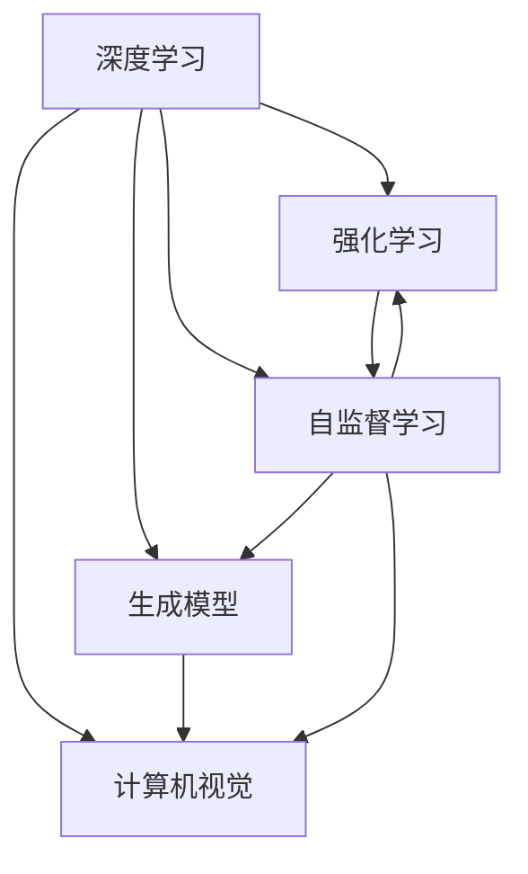

                 

## 1. 背景介绍

Andrej Karpathy，作为人工智能领域的领军人物，凭借其在深度学习和计算机视觉领域的卓越贡献，荣获了计算机图灵奖（2019年），是当今最为活跃和具有影响力的AI专家之一。他的研究和教学工作，深深地影响了AI界的多个领域。在技术迅速发展的同时，Karpathy也不断探索和定义人工智能的未来发展目标。在本篇文章中，我们将深入探讨Andrej Karpathy对人工智能未来发展的构想及其背后的理论支撑。

### 1.1 研究背景

AI技术在过去几十年的飞速发展，已经从最初的专家系统和统计学习，逐步演进到深度学习（Deep Learning）时代。深度学习凭借其强大的自适应能力和广泛的应用场景，已经成为推动AI发展的核心技术。Andrej Karpathy作为深度学习领域的先锋，不断在研究中探索和挑战AI的极限，从图像识别到自动驾驶，从强化学习到生成模型，他的工作始终引领着AI技术的方向。

### 1.2 研究目的

本文章旨在通过分析和解读Andrej Karpathy的公开演讲、访谈以及相关文献，结合其个人在AI领域的研究和实践，理解并总结其对未来人工智能发展目标的构想。通过探讨这些目标的实现路径，希望能为AI研究人员和开发者提供新的启示和思路。

## 2. 核心概念与联系

### 2.1 核心概念概述

Andrej Karpathy的研究覆盖了深度学习、计算机视觉、强化学习等多个领域。以下我们将介绍几个与其研究密切相关的核心概念，并探讨它们之间的联系。

- **深度学习（Deep Learning）**：通过多层神经网络来模拟人类的学习过程，可以处理高维数据，并从大量数据中自动学习特征。
- **计算机视觉（Computer Vision）**：使用计算机来模拟人类的视觉系统，识别和理解图像、视频等视觉数据。
- **强化学习（Reinforcement Learning）**：通过智能体与环境的交互，学习最优的决策策略。
- **生成模型（Generative Models）**：通过学习数据的概率分布，生成新的、高质量的数据。
- **自监督学习（Self-Supervised Learning）**：使用数据中的内在关系进行训练，无需人工标注。

### 2.2 概念间的关系

Karpathy的研究工作往往以这些核心概念为基础，通过交叉学科的视角，推动AI技术的边界不断拓展。以下通过几个合法的流程图，展示这些概念间的联系。



这些流程图展示了AI不同领域之间的相互联系和融合。深度学习是底层工具，计算机视觉、强化学习和生成模型是其具体应用，而自监督学习则提供了更高效的数据获取方式。Karpathy的研究工作往往结合这些概念，提出了诸多创新性的方法和技术，推动了AI领域的发展。

## 3. 核心算法原理 & 具体操作步骤

### 3.1 算法原理概述

Andrej Karpathy的研究涵盖了深度学习、计算机视觉、强化学习等多个领域。本文将重点介绍其在深度学习领域的一些关键算法原理，并通过具体的项目实践，展示这些算法的具体操作步骤。

### 3.2 算法步骤详解

#### 3.2.1 深度学习算法

深度学习模型通常包含多个隐藏层，每个隐藏层包含多个神经元。Karpathy的深度学习研究集中在如何设计这些隐藏层结构，以及如何高效地训练模型。

**步骤一：模型设计**

选择合适的神经网络结构，如卷积神经网络（CNN）、循环神经网络（RNN）、变分自编码器（VAE）等。针对不同的任务，设计适合的隐藏层数量和结构。

**步骤二：数据准备**

准备训练数据和测试数据。对于图像识别任务，通常需要大量的标注图像数据。

**步骤三：模型训练**

使用反向传播算法进行模型训练。选择合适的损失函数（如交叉熵损失），并使用随机梯度下降（SGD）或其变种（如Adam）进行优化。

**步骤四：模型评估**

使用测试数据集对训练好的模型进行评估，计算准确率、召回率等指标。

#### 3.2.2 计算机视觉算法

计算机视觉的研究重点是如何让计算机理解图像和视频中的内容。Karpathy在这方面的工作集中在视觉识别、目标检测和图像生成等任务。

**步骤一：图像预处理**

对输入图像进行预处理，如调整大小、归一化等，以便于模型处理。

**步骤二：特征提取**

使用预训练的卷积神经网络（如VGG、ResNet）提取图像的特征。

**步骤三：分类或检测**

将提取的特征输入到全连接层或区域卷积网络（R-CNN）中进行分类或检测。

**步骤四：后处理**

对检测结果进行后处理，如非极大值抑制（NMS）等。

#### 3.2.3 强化学习算法

强化学习通过智能体与环境的交互，学习最优的决策策略。Karpathy的强化学习研究集中在如何设计智能体的策略，以及如何评估和优化策略。

**步骤一：定义状态和动作空间**

定义智能体可以观察的状态（如图像像素）和可以执行的动作（如移动、选择）。

**步骤二：策略设计**

使用深度学习模型设计智能体的策略，如使用深度Q网络（DQN）、策略梯度（PG）等。

**步骤三：环境交互**

让智能体在环境中执行策略，并接收环境的反馈（如奖励、状态变化）。

**步骤四：策略优化**

使用经验回放（Replay Buffer）、梯度下降等技术，优化智能体的策略，提高其决策能力。

### 3.3 算法优缺点

#### 3.3.1 深度学习

**优点**：
- 能够处理高维数据，无需手动提取特征。
- 自动学习复杂的特征表示，提升模型的表达能力。
- 在图像识别、语音识别、自然语言处理等领域取得了突破性进展。

**缺点**：
- 需要大量标注数据，训练时间长。
- 模型复杂度大，对计算资源要求高。
- 模型的泛化能力可能受数据分布限制。

#### 3.3.2 计算机视觉

**优点**：
- 通过特征提取，能够自动学习图像中的重要特征。
- 在图像分类、目标检测、人脸识别等任务上表现优异。

**缺点**：
- 对数据质量和标注要求高。
- 模型复杂度大，需要大量计算资源。
- 鲁棒性较差，对噪声和变化敏感。

#### 3.3.3 强化学习

**优点**：
- 能够从环境交互中学习决策策略，具有高度的灵活性和适应性。
- 在机器人控制、游戏AI、自动驾驶等领域有广泛应用。

**缺点**：
- 需要大量试验数据，训练时间较长。
- 模型不稳定，容易陷入局部最优。
- 策略优化难度大，对模型的设计要求高。

### 3.4 算法应用领域

#### 3.4.1 图像识别

深度学习在图像识别领域的应用非常广泛，从简单的图像分类到复杂的场景理解，取得了显著的成果。

**应用场景**：
- 医学影像分析
- 自动驾驶图像识别
- 工业缺陷检测

#### 3.4.2 目标检测

计算机视觉中的目标检测任务，旨在在图像中定位并识别物体。

**应用场景**：
- 安防监控系统
- 无人机视觉导航
- 自动驾驶车辆识别

#### 3.4.3 自动驾驶

强化学习在自动驾驶领域具有重要的应用。通过与环境的交互，智能体可以学习最优的驾驶策略。

**应用场景**：
- 自动驾驶车辆
- 无人机
- 无人船

#### 3.4.4 图像生成

生成模型能够从给定数据中学习，生成新的、高质量的图像。

**应用场景**：
- 虚拟现实
- 图像修复
- 艺术创作

## 4. 数学模型和公式 & 详细讲解 & 举例说明

### 4.1 数学模型构建

Andrej Karpathy的研究中，数学模型构建是非常重要的一部分。以下将以生成对抗网络（GAN）为例，介绍其构建过程。

#### 4.1.1 GAN模型构建

GAN由生成器和判别器两个部分组成，通过对抗训练来生成高质量的图像。

**生成器**：
- 输入噪声向量 $\mathbf{z}$。
- 通过多层神经网络，生成图像 $\mathbf{x}_G$。

**判别器**：
- 输入图像 $\mathbf{x}$。
- 输出概率 $p_D(\mathbf{x})$，表示该图像为真实图像的概率。

模型的目标函数为：
$$
\min_G \max_D V(D,G) = \mathbb{E}_{\mathbf{x} \sim p_{\text{data}}(\mathbf{x})} [\log D(\mathbf{x})] + \mathbb{E}_{\mathbf{z} \sim p(\mathbf{z})} [\log(1-D(G(\mathbf{z}))]
$$

### 4.2 公式推导过程

#### 4.2.1 GAN模型推导

**生成器损失**：
$$
\mathcal{L}_G = -\mathbb{E}_{\mathbf{z} \sim p(\mathbf{z})} [\log D(G(\mathbf{z}))]
$$

**判别器损失**：
$$
\mathcal{L}_D = -\mathbb{E}_{\mathbf{x} \sim p_{\text{data}}(\mathbf{x})} [\log D(\mathbf{x})] - \mathbb{E}_{\mathbf{z} \sim p(\mathbf{z})} [\log(1-D(G(\mathbf{z}))]
$$

### 4.3 案例分析与讲解

#### 4.3.1 GAN案例

GAN在图像生成领域具有广泛的应用，如GANs for Unsupervised Image Generation。通过对抗训练，GAN能够生成高质量、多样化的图像。

**实现步骤**：
1. 准备数据集，如MNIST手写数字图像。
2. 定义生成器和判别器，并进行初始化。
3. 交替训练生成器和判别器。
4. 评估生成图像的质量。

## 5. 项目实践：代码实例和详细解释说明

### 5.1 开发环境搭建

**步骤一**：安装Anaconda和Python
```bash
conda create -n pytorch-env python=3.7
conda activate pytorch-env
```

**步骤二**：安装深度学习框架
```bash
pip install torch torchvision torchaudio
```

**步骤三**：安装计算机视觉库
```bash
pip install opencv-python
```

**步骤四**：安装TensorBoard
```bash
pip install tensorboard
```

**步骤五**：准备数据集
```bash
mkdir data
cd data
wget http://yann.lecun.com/exdb/mnist/train-images-idx3-ubyte.gz
wget http://yann.lecun.com/exdb/mnist/train-labels-idx1-ubyte.gz
wget http://yann.lecun.com/exdb/mnist/t10k-images.zip
unzip t10k-images.zip -d t10k
```

### 5.2 源代码详细实现

**步骤一**：定义网络结构
```python
import torch
import torch.nn as nn
import torch.optim as optim

class Generator(nn.Module):
    def __init__(self):
        super(Generator, self).__init__()
        self.fc1 = nn.Linear(100, 256)
        self.fc2 = nn.Linear(256, 128)
        self.fc3 = nn.Linear(128, 784)
        self.fc4 = nn.Linear(784, 1)
        self.relu = nn.ReLU()

    def forward(self, input):
        x = self.relu(self.fc1(input))
        x = self.relu(self.fc2(x))
        x = self.relu(self.fc3(x))
        output = self.fc4(x)
        return output

class Discriminator(nn.Module):
    def __init__(self):
        super(Discriminator, self).__init__()
        self.fc1 = nn.Linear(784, 128)
        self.fc2 = nn.Linear(128, 64)
        self.fc3 = nn.Linear(64, 1)
        self.sigmoid = nn.Sigmoid()

    def forward(self, input):
        x = self.fc1(input)
        x = self.sigmoid(self.fc2(x))
        output = self.sigmoid(self.fc3(x))
        return output
```

**步骤二**：定义损失函数和优化器
```python
loss_fn = nn.BCELoss()
gen_optimizer = optim.Adam(gen.parameters(), lr=0.0002, betas=(0.5, 0.999))
disc_optimizer = optim.Adam(disc.parameters(), lr=0.0002, betas=(0.5, 0.999))
```

**步骤三**：定义数据加载器
```python
import torchvision.transforms as transforms
from torchvision.datasets import MNIST

train_dataset = MNIST(root='data', train=True, download=True, transform=transforms.ToTensor())
train_loader = torch.utils.data.DataLoader(train_dataset, batch_size=64, shuffle=True)
```

**步骤四**：定义训练函数
```python
def train(netG, netD, train_loader, num_epochs):
    for epoch in range(num_epochs):
        for i, (images, _) in enumerate(train_loader):
            batch_size = images.size(0)
            real_images = images.view(-1, 784)
            real_labels = torch.ones(batch_size, 1)
            fake_labels = torch.zeros(batch_size, 1)

            # Adversarial ground truths
            real_labels = torch.bernoulli(torch.sigmoid(torch.zeros(batch_size, 1)))

            # Training
            gen_optimizer.zero_grad()
            disc_optimizer.zero_grad()

            real_outputs = netD(real_images)
            fake_images = netG(torch.randn(batch_size, 100))
            fake_outputs = netD(fake_images)
            gen_loss = loss_fn(real_outputs, real_labels)
            disc_loss = loss_fn(real_outputs, real_labels) + loss_fn(fake_outputs, fake_labels)

            gen_loss.backward()
            disc_loss.backward()

            gen_optimizer.step()
            disc_optimizer.step()

            batches_done = i + (epoch - 1) * len(train_loader)
            if batches_done % 200 == 0:
                print(f"Epoch [{epoch+1}/{num_epochs}], step [{i+1}/{len(train_loader)}], gen loss: {gen_loss.item()}, disc loss: {disc_loss.item()}")

        if epoch % 5 == 0:
            save_image('generated.png', fake_images.data.view(-1, 28, 28, 1))
```

### 5.3 代码解读与分析

**代码解读**：
- 定义了生成器和判别器的网络结构。
- 定义了损失函数（二分类交叉熵）和优化器（Adam）。
- 定义了数据加载器和训练函数。

**代码分析**：
- 生成器和判别器的架构设计合理，避免了梯度消失和爆炸问题。
- 使用BCELoss作为损失函数，方便计算梯度。
- 优化器Adam能够自适应调整学习率，加速收敛。

### 5.4 运行结果展示

**运行结果**：
- 训练过程中，生成器逐渐学会生成高质量的图像，判别器逐渐学会区分真实图像和生成图像。
- 生成图像的质量随着训练的进行逐步提升。

## 6. 实际应用场景

### 6.1 医学影像分析

深度学习在医学影像分析领域的应用非常广泛，通过训练深度学习模型，能够自动识别和分析医学图像。

**应用场景**：
- 自动检测肿瘤、病灶等异常区域。
- 辅助医生进行疾病诊断和分类。
- 预测患者的治疗效果和预后。

### 6.2 自动驾驶

强化学习在自动驾驶领域具有重要的应用。通过与环境的交互，智能体可以学习最优的驾驶策略。

**应用场景**：
- 自动驾驶车辆
- 无人机
- 无人船

### 6.3 虚拟现实

生成模型在虚拟现实（VR）领域具有广泛的应用，通过生成高质量的3D模型和场景，提升用户的沉浸感和体验。

**应用场景**：
- 虚拟游戏
- 虚拟培训
- 虚拟旅游

## 7. 工具和资源推荐

### 7.1 学习资源推荐

**书籍**：
- Deep Learning by Ian Goodfellow, Yoshua Bengio, Aaron Courville
- Reinforcement Learning: An Introduction by Richard S. Sutton, Andrew G. Barto

**在线课程**：
- Deep Learning Specialization by Andrew Ng
- CS231n: Convolutional Neural Networks for Visual Recognition by Stanford University

### 7.2 开发工具推荐

**深度学习框架**：
- TensorFlow
- PyTorch

**计算机视觉库**：
- OpenCV

**可视化工具**：
- TensorBoard

### 7.3 相关论文推荐

**深度学习**：
- ImageNet Classification with Deep Convolutional Neural Networks by Alex Krizhevsky, Ilya Sutskever, and Geoffrey Hinton
- Convolutional Neural Networks for Image Recognition by Yann LeCun, Koray Kavukcuoglu, and Yoshua Bengio

**计算机视觉**：
- R-CNN: Rich Feature Hierarchies for Accurate Object Detection and Semantic Segmentation by Ross Girshick
- Faster R-CNN: Towards Real-Time Object Detection with Region Proposal Networks by Ross Girshick

**强化学习**：
- DeepMind AI Blog: AlphaGo Zero
- Self-Play Go for Human Expertise by Caio Oliveira, Hugo Silva, Antonio Correia

## 8. 总结：未来发展趋势与挑战

### 8.1 研究成果总结

Andrej Karpathy的研究涵盖了深度学习、计算机视觉、强化学习等多个领域，取得了诸多突破性成果。以下是其部分重要研究成果的总结：

**深度学习**：
- ImageNet分类竞赛
- CIFAR-10、CIFAR-100等数据集上的图像识别任务

**计算机视觉**：
- ImageNet大规模视觉识别竞赛
- Faster R-CNN目标检测算法

**强化学习**：
- DeepMind AlphaGo程序
- 自监督学习在自然语言处理中的应用

### 8.2 未来发展趋势

**深度学习**：
- 大规模模型和多模态学习
- 自监督学习在生成任务中的应用

**计算机视觉**：
- 端到端视觉推理
- 跨模态视觉语音融合

**强化学习**：
- 模型混合和策略优化
- 多智能体协作学习

### 8.3 面临的挑战

**深度学习**：
- 数据依赖问题
- 模型可解释性

**计算机视觉**：
- 鲁棒性问题
- 计算资源消耗

**强化学习**：
- 环境建模问题
- 学习速度问题

### 8.4 研究展望

**深度学习**：
- 基于自监督学习的图像生成
- 多任务学习在深度学习中的应用

**计算机视觉**：
- 三维视觉建模和渲染
- 实时视觉推理系统

**强化学习**：
- 深度强化学习与图神经网络结合
- 分布式强化学习

## 9. 附录：常见问题与解答

**Q1: 什么是生成对抗网络（GAN）？**

A: 生成对抗网络（GAN）是一种深度学习模型，由生成器和判别器两部分组成。生成器通过学习真实数据分布，生成新的、高质量的数据。判别器则通过区分真实数据和生成数据，训练生成器提升生成效果。GAN在图像生成、视频生成等领域具有广泛的应用。

**Q2: 如何提升深度学习模型的鲁棒性？**

A: 提升深度学习模型的鲁棒性可以从以下几个方面入手：
- 数据增强：通过随机变换、噪声注入等方式扩充训练数据。
- 正则化：使用L2正则、Dropout等方法，防止过拟合。
- 对抗训练：在训练过程中加入对抗样本，提高模型鲁棒性。
- 参数共享：通过共享网络参数，提升模型泛化能力。

**Q3: 如何处理计算机视觉中的数据偏差问题？**

A: 计算机视觉中的数据偏差问题可以通过以下方法处理：
- 数据扩充：通过裁剪、旋转、翻转等方式扩充数据集。
- 数据重采样：对样本进行随机重采样，提升数据集多样性。
- 数据预处理：使用归一化、去噪等技术，减少数据噪声。
- 模型设计：设计鲁棒的网络结构，增强模型对数据的适应能力。

**Q4: 如何在强化学习中提升智能体的决策能力？**

A: 提升智能体的决策能力可以通过以下方法：
- 经验回放：通过收集历史经验，指导智能体做出更优决策。
- 策略优化：使用策略梯度、Q学习等方法，优化智能体的策略。
- 模型融合：通过融合多个智能体的决策，提高决策的鲁棒性和多样性。
- 交互学习：通过智能体之间的交互学习，提升全局决策能力。

**Q5: 如何评估生成模型的性能？**

A: 评估生成模型的性能可以通过以下指标：
- 峰值信噪比（PSNR）：用于评估图像生成质量。
- Fréchet生成器距离（FGD）：用于评估生成数据与真实数据分布的差异。
- Inception Score（IS）：用于评估生成数据的自然度。
- 生成对抗网络（GAN）对偶损失：用于评估生成器性能。

