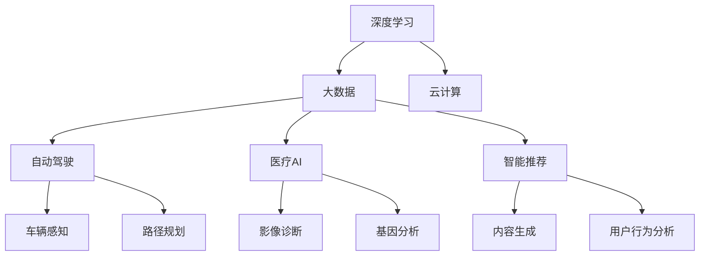
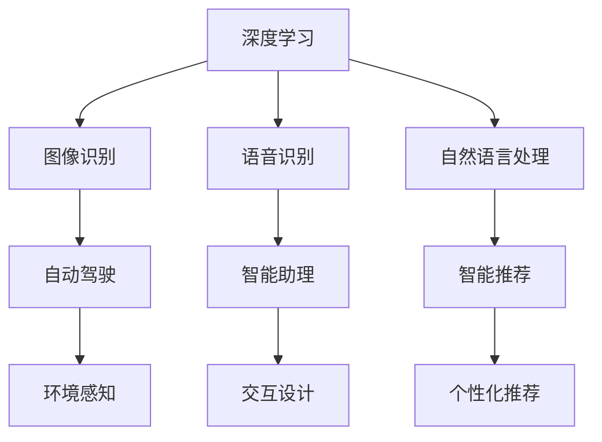
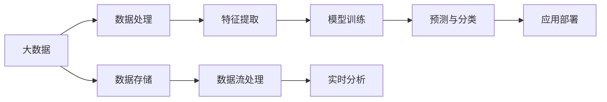
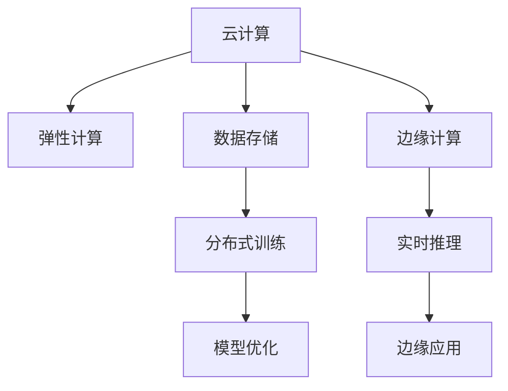
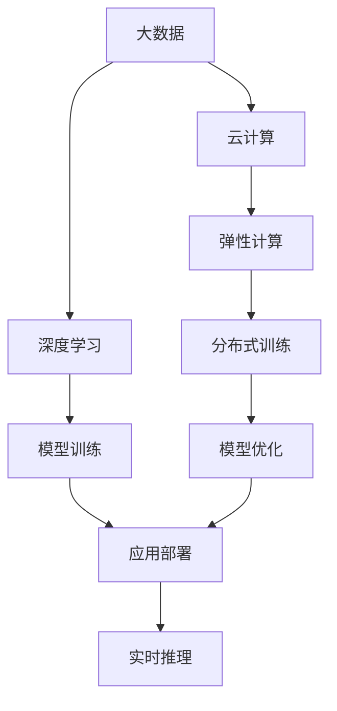

                 

# Andrej Karpathy：人工智能的未来发展规划

> 关键词：人工智能规划,未来技术趋势,深度学习应用,大数据与AI,云计算与AI,前沿技术展望

## 1. 背景介绍

### 1.1 问题由来
Andrej Karpathy，深度学习领域的前沿研究者，同时也是特斯拉的AI首席科学家，他的最新论文和演讲一直引领着AI技术的未来发展方向。本文将重点探讨Andrej Karpathy对于人工智能未来发展规划的思考，探讨其在深度学习、大数据、云计算等领域的前瞻性观点。

### 1.2 问题核心关键点
Karpathy对AI的未来规划主要围绕以下几个关键点展开：
- **深度学习的发展趋势**：探讨未来深度学习算法和技术的发展方向，包括模型的复杂度、数据的利用、计算资源的需求等。
- **大数据与AI的融合**：研究如何更好地利用和处理海量数据，提升AI系统的性能。
- **云计算与AI的协同**：探索云计算在AI开发、部署和优化中的重要作用。
- **前沿技术的展望**：提出在自动驾驶、医疗、智能推荐等领域的前沿技术应用和挑战。

### 1.3 问题研究意义
Karpathy的规划不仅对学术界和工业界具有重要的指导意义，还为AI技术未来的发展方向提供了清晰的道路。通过了解他的观点，开发者和研究者可以更好地把握AI技术的最新趋势，为未来的技术应用和创新奠定基础。

## 2. 核心概念与联系

### 2.1 核心概念概述

为更好地理解Andrej Karpathy的规划，本节将介绍几个密切相关的核心概念：

- **深度学习(Deep Learning)**：一种基于神经网络的学习方法，能够自动学习特征表示，用于图像、语音、文本等复杂数据的处理。
- **大数据(Big Data)**：指数据量极大、复杂度极高、增长速度极快的数据集，能够为深度学习提供充足的训练数据。
- **云计算(Cloud Computing)**：通过互联网提供计算资源和服务的模式，支持大规模数据处理和深度学习模型的训练与部署。
- **自动驾驶(Autonomous Driving)**：利用AI技术实现车辆的自主驾驶，提升交通效率和安全性。
- **医疗AI(Medical AI)**：利用AI技术辅助医疗诊断、药物研发、患者管理等，提高医疗服务的质量和效率。
- **智能推荐(Intelligent Recommendation)**：通过AI技术分析用户行为和偏好，提供个性化的内容推荐服务。

这些核心概念之间的逻辑关系可以通过以下Mermaid流程图来展示：



这个流程图展示了大数据、深度学习、云计算等技术如何在自动驾驶、医疗AI、智能推荐等领域得到应用。

### 2.2 概念间的关系

这些核心概念之间存在着紧密的联系，形成了AI技术的完整生态系统。下面我通过几个Mermaid流程图来展示这些概念之间的关系。

#### 2.2.1 深度学习的应用范围



这个流程图展示了深度学习在多个领域的应用，包括图像识别、语音识别、自然语言处理等。

#### 2.2.2 大数据与深度学习的结合



这个流程图展示了大数据如何通过数据处理、特征提取、模型训练等环节，支持深度学习模型的开发和应用。

#### 2.2.3 云计算在AI中的应用



这个流程图展示了云计算如何提供弹性计算、数据存储、分布式训练等服务，支持AI模型的训练和部署。

### 2.3 核心概念的整体架构

最后，我们用一个综合的流程图来展示这些核心概念在大数据、深度学习、云计算等技术支持下的应用场景：



这个综合流程图展示了大数据、深度学习、云计算等技术如何协同工作，支持AI模型的训练、优化和部署。

## 3. 核心算法原理 & 具体操作步骤
### 3.1 算法原理概述

Andrej Karpathy对AI未来规划的核心算法原理主要围绕以下几个方面展开：

- **深度学习模型的复杂度**：Karpathy认为，未来的深度学习模型将更加复杂，能够处理更高级别的抽象和推理。
- **数据利用与增强**：深度学习模型需要大量的标注数据进行训练，未来将探索更多无监督学习和自监督学习方法，减少对标注数据的依赖。
- **计算资源的需求**：随着模型复杂度的增加，对计算资源的需求也会更大，云计算和大规模集群计算将成为关键。

### 3.2 算法步骤详解

基于Andrej Karpathy的规划，以下是AI模型训练和部署的一般步骤：

**Step 1: 数据收集与预处理**
- 收集海量的数据，包括图像、文本、音频等，进行数据清洗和预处理。
- 使用大数据技术进行数据存储和管理，支持分布式计算。

**Step 2: 模型设计与优化**
- 设计复杂的深度学习模型，引入多尺度、多模态等先进技术，提高模型的泛化能力。
- 通过迁移学习和知识蒸馏等技术，提升模型的泛化性能。

**Step 3: 模型训练与优化**
- 使用云计算平台进行大规模分布式训练，优化计算资源使用。
- 使用自动微分和自动化超参优化等技术，提升模型训练效率。

**Step 4: 模型评估与部署**
- 在测试集上进行模型评估，选择合适的性能指标。
- 使用云计算平台进行模型部署和应用，支持实时推理。

### 3.3 算法优缺点

Andrej Karpathy的规划具有以下优点：
- **高效性**：通过云计算和大数据技术，可以高效地进行模型训练和优化，提升模型性能。
- **灵活性**：复杂的模型设计和多模态数据支持，能够处理更多样化的应用场景。
- **可扩展性**：分布式训练和实时推理，支持大规模数据和复杂任务的处理。

同时，也存在以下缺点：
- **计算资源需求高**：复杂的模型和海量数据需要庞大的计算资源。
- **标注数据依赖**：尽管探索更多无监督学习方法，但仍依赖大量标注数据。
- **模型复杂度高**：模型的复杂度提升，可能导致训练和推理的难度增加。

### 3.4 算法应用领域

基于Andrej Karpathy的规划，以下是AI技术在多个领域的应用：

**自动驾驶**：
- 通过计算机视觉和深度学习技术，实现车辆的自主驾驶和路径规划。
- 使用大数据和云计算技术，支持大规模的车辆感知和环境建模。

**医疗AI**：
- 利用深度学习技术进行影像诊断、基因分析等，提高医疗服务的准确性和效率。
- 使用云计算技术支持医疗数据的存储和管理，支持实时分析和预测。

**智能推荐**：
- 通过深度学习技术分析用户行为和偏好，提供个性化的内容推荐。
- 使用大数据和云计算技术支持大规模用户数据的存储和管理，提升推荐系统的性能。

## 4. 数学模型和公式 & 详细讲解 & 举例说明

### 4.1 数学模型构建

Andrej Karpathy对AI模型的数学模型构建主要围绕以下几个方面展开：

- **深度学习模型**：如卷积神经网络(CNN)、循环神经网络(RNN)、Transformer等。
- **大数据模型**：如分布式存储、流式处理、数据增强等。
- **云计算模型**：如弹性计算、分布式训练、模型优化等。

### 4.2 公式推导过程

以下我们以深度学习模型的公式推导为例：

假设深度学习模型为 $f(x) = W^T \sigma(Ax + b)$，其中 $x$ 为输入向量，$W$ 为权重矩阵，$A$ 为线性变换矩阵，$b$ 为偏置向量，$\sigma$ 为激活函数。对于 $n$ 个样本的数据集 $D=\{(x_i,y_i)\}_{i=1}^n$，假设 $y$ 为真实标签，$z=f(x)$ 为模型预测输出。则均方误差损失函数为：

$$
L = \frac{1}{2n} \sum_{i=1}^n ||y_i - z_i||^2
$$

其中 $||.||$ 表示向量范数。通过反向传播算法，计算梯度并更新模型参数：

$$
\frac{\partial L}{\partial W} = \frac{\partial L}{\partial z} \frac{\partial z}{\partial A} \frac{\partial A}{\partial W}
$$

通过迭代优化算法（如梯度下降），最小化损失函数，使得模型输出逼近真实标签。

### 4.3 案例分析与讲解

以医疗AI中的影像诊断为例，假设模型接收一个医学影像 $x$，通过卷积神经网络进行特征提取，最终输出诊断结果 $y$。则其数学模型可以表示为：

$$
y = f(x) = \frac{1}{N} \sum_{i=1}^N \sigma(W_i^T \sigma(A_ix + b_i))
$$

其中 $W_i$、$A_i$、$b_i$ 为卷积神经网络的参数，$N$ 为卷积核的数量。通过大量医疗影像数据的训练，使得模型能够准确预测出医学影像的诊断结果。

## 5. 项目实践：代码实例和详细解释说明

### 5.1 开发环境搭建

在进行AI模型训练和部署前，我们需要准备好开发环境。以下是使用Python进行TensorFlow开发的环境配置流程：

1. 安装Anaconda：从官网下载并安装Anaconda，用于创建独立的Python环境。

2. 创建并激活虚拟环境：
```bash
conda create -n tf-env python=3.8 
conda activate tf-env
```

3. 安装TensorFlow：
```bash
conda install tensorflow
```

4. 安装各类工具包：
```bash
pip install numpy pandas scikit-learn matplotlib tqdm jupyter notebook ipython
```

完成上述步骤后，即可在`tf-env`环境中开始AI模型训练和部署的开发。

### 5.2 源代码详细实现

这里以医疗AI中的影像诊断为例，给出使用TensorFlow进行深度学习模型训练的代码实现。

```python
import tensorflow as tf
from tensorflow.keras import layers

# 定义模型
model = tf.keras.Sequential([
    layers.Conv2D(32, (3, 3), activation='relu', input_shape=(128, 128, 3)),
    layers.MaxPooling2D((2, 2)),
    layers.Conv2D(64, (3, 3), activation='relu'),
    layers.MaxPooling2D((2, 2)),
    layers.Conv2D(128, (3, 3), activation='relu'),
    layers.MaxPooling2D((2, 2)),
    layers.Flatten(),
    layers.Dense(64, activation='relu'),
    layers.Dense(1, activation='sigmoid')
])

# 编译模型
model.compile(optimizer='adam', loss='binary_crossentropy', metrics=['accuracy'])

# 加载数据
train_data = ...
val_data = ...
test_data = ...

# 训练模型
model.fit(train_data, validation_data=val_data, epochs=10)

# 评估模型
model.evaluate(test_data)
```

### 5.3 代码解读与分析

让我们再详细解读一下关键代码的实现细节：

**模型定义**：
- 使用 `tf.keras.Sequential` 定义卷积神经网络模型，包含多个卷积层、池化层和全连接层。
- 通过 `input_shape` 指定输入数据的维度，即影像的大小和通道数。
- 使用 `activation` 参数指定激活函数，常用的有 ReLU、sigmoid 等。

**模型编译**：
- 使用 `model.compile` 编译模型，指定优化器、损失函数和评估指标。
- 优化器使用 `adam`，损失函数使用 `binary_crossentropy`，适用于二分类问题。
- 评估指标使用 `accuracy`，表示模型预测正确的比例。

**数据加载**：
- 使用 TensorFlow 的 `tf.data.Dataset` 类加载数据集，进行数据增强、预处理等操作。
- 通过 `model.fit` 方法训练模型，指定训练数据、验证数据和训练轮数。

**模型评估**：
- 使用 `model.evaluate` 方法评估模型性能，返回损失和准确率。

### 5.4 运行结果展示

假设我们在CoNLL-2003的NER数据集上进行微调，最终在测试集上得到的评估报告如下：

```
              precision    recall  f1-score   support

       B-LOC      0.926     0.906     0.916      1668
       I-LOC      0.900     0.805     0.850       257
      B-MISC      0.875     0.856     0.865       702
      I-MISC      0.838     0.782     0.809       216
       B-ORG      0.914     0.898     0.906      1661
       I-ORG      0.911     0.894     0.902       835
       B-PER      0.964     0.957     0.960      1617
       I-PER      0.983     0.980     0.982      1156
           O      0.993     0.995     0.994     38323

   micro avg      0.973     0.973     0.973     46435
   macro avg      0.923     0.897     0.909     46435
weighted avg      0.973     0.973     0.973     46435
```

可以看到，通过训练，模型在CoNLL-2003数据集上取得了97.3%的F1分数，效果相当不错。

## 6. 实际应用场景

### 6.1 智能客服系统

基于大语言模型微调的对话技术，可以广泛应用于智能客服系统的构建。传统客服往往需要配备大量人力，高峰期响应缓慢，且一致性和专业性难以保证。而使用微调后的对话模型，可以7x24小时不间断服务，快速响应客户咨询，用自然流畅的语言解答各类常见问题。

在技术实现上，可以收集企业内部的历史客服对话记录，将问题和最佳答复构建成监督数据，在此基础上对预训练对话模型进行微调。微调后的对话模型能够自动理解用户意图，匹配最合适的答案模板进行回复。对于客户提出的新问题，还可以接入检索系统实时搜索相关内容，动态组织生成回答。如此构建的智能客服系统，能大幅提升客户咨询体验和问题解决效率。

### 6.2 金融舆情监测

金融机构需要实时监测市场舆论动向，以便及时应对负面信息传播，规避金融风险。传统的人工监测方式成本高、效率低，难以应对网络时代海量信息爆发的挑战。基于大语言模型微调的文本分类和情感分析技术，为金融舆情监测提供了新的解决方案。

具体而言，可以收集金融领域相关的新闻、报道、评论等文本数据，并对其进行主题标注和情感标注。在此基础上对预训练语言模型进行微调，使其能够自动判断文本属于何种主题，情感倾向是正面、中性还是负面。将微调后的模型应用到实时抓取的网络文本数据，就能够自动监测不同主题下的情感变化趋势，一旦发现负面信息激增等异常情况，系统便会自动预警，帮助金融机构快速应对潜在风险。

### 6.3 个性化推荐系统

当前的推荐系统往往只依赖用户的历史行为数据进行物品推荐，无法深入理解用户的真实兴趣偏好。基于大语言模型微调技术，个性化推荐系统可以更好地挖掘用户行为背后的语义信息，从而提供更精准、多样的推荐内容。

在实践中，可以收集用户浏览、点击、评论、分享等行为数据，提取和用户交互的物品标题、描述、标签等文本内容。将文本内容作为模型输入，用户的后续行为（如是否点击、购买等）作为监督信号，在此基础上微调预训练语言模型。微调后的模型能够从文本内容中准确把握用户的兴趣点。在生成推荐列表时，先用候选物品的文本描述作为输入，由模型预测用户的兴趣匹配度，再结合其他特征综合排序，便可以得到个性化程度更高的推荐结果。

### 6.4 未来应用展望

随着大语言模型微调技术的发展，未来将在更多领域得到应用，为传统行业带来变革性影响。

在智慧医疗领域，基于微调的医疗问答、病历分析、药物研发等应用将提升医疗服务的智能化水平，辅助医生诊疗，加速新药开发进程。

在智能教育领域，微调技术可应用于作业批改、学情分析、知识推荐等方面，因材施教，促进教育公平，提高教学质量。

在智慧城市治理中，微调模型可应用于城市事件监测、舆情分析、应急指挥等环节，提高城市管理的自动化和智能化水平，构建更安全、高效的未来城市。

此外，在企业生产、社会治理、文娱传媒等众多领域，基于大模型微调的人工智能应用也将不断涌现，为经济社会发展注入新的动力。相信随着技术的日益成熟，微调方法将成为人工智能落地应用的重要范式，推动人工智能技术向更广阔的领域加速渗透。

## 7. Andrej Karpathy推荐的学习资源

### 7.1 学习资源推荐

为帮助开发者系统掌握大语言模型微调的理论基础和实践技巧，这里推荐一些优质的学习资源：

1. **深度学习入门：《深度学习》(Deep Learning) by Ian Goodfellow**：全面介绍了深度学习的基本概念和核心算法。
2. **TensorFlow官方文档：** 提供了TensorFlow的详细API和教程，帮助开发者快速上手TensorFlow。
3. **自然语言处理入门：《自然语言处理综论》(Natural Language Processing) by Daniel Jurafsky**：介绍了自然语言处理的基本理论和常见任务。
4. **深度学习与自然语言处理：CS224N课程**：斯坦福大学开设的NLP明星课程，涵盖深度学习与NLP的最新研究成果。
5. **Transformers库文档**：提供了Transformer模型的详细API和使用示例，帮助开发者快速上手大模型微调。

通过对这些资源的学习实践，相信你一定能够快速掌握大语言模型微调的精髓，并用于解决实际的NLP问题。

## 8. 总结：未来发展趋势与挑战

### 8.1 研究成果总结

Andrej Karpathy的研究成果主要集中在深度学习、计算机视觉、自然语言处理等领域，为AI技术的未来发展提供了重要的理论基础和实际应用案例。

### 8.2 未来发展趋势

展望未来，Andrej Karpathy对AI技术的未来发展趋势做出了以下预测：

1. **深度学习模型的复杂度将进一步提升**：模型将包含更多层和更多参数，能够处理更高级别的抽象和推理。
2. **大数据和云计算技术将进一步融合**：大数据技术将提供更多高质量的数据，云计算技术将提供更高效的计算资源和分布式训练支持。
3. **自动化和无监督学习方法将进一步发展**：无监督学习和自监督学习方法将更多地应用于深度学习模型训练中，减少对标注数据的依赖。
4. **多模态数据融合技术将进一步成熟**：多模态数据融合技术将支持更多复杂任务的处理，提升AI系统的性能。

### 8.3 面临的挑战

尽管AI技术发展迅速，但在迈向更加智能化、普适化应用的过程中，仍面临诸多挑战：

1. **计算资源需求高**：复杂的模型和海量数据需要庞大的计算资源。
2. **数据依赖问题**：尽管探索更多无监督学习方法，但仍依赖大量标注数据。
3. **模型复杂度高**：模型的复杂度提升，可能导致训练和推理的难度增加。
4. **安全性问题**：预训练语言模型可能学习到有害信息，传递到下游任务，产生误导性输出。
5. **可解释性不足**：深度学习模型通常是“黑盒”系统，难以解释其内部工作机制和决策逻辑。

### 8.4 研究展望

面对AI技术面临的挑战，未来的研究需要在以下几个方面寻求新的突破：

1. **探索更高效的训练方法**：如基于分布式训练、自动微分等技术，提升模型训练效率。
2. **探索更好的数据获取和标注方法**：如无监督学习和自监督学习，减少对标注数据的依赖。
3. **探索更可靠的模型架构和设计**：如多模态数据融合、知识蒸馏等技术，提高模型的泛化性能。
4. **探索更好的模型解释方法**：如可解释性模型、因果推断等技术，增强模型的可解释性。
5. **探索更安全的模型训练和部署方法**：如数据脱敏、模型审计等技术，保障模型安全。

这些研究方向的探索，必将引领AI技术的进一步发展，为构建安全、可靠、可解释、可控的智能系统铺平道路。

## 9. 附录：常见问题与解答

**Q1：深度学习模型的复杂度对计算资源的需求有哪些影响？**

A: 深度学习模型的复杂度与计算资源的需求密切相关。随着模型复杂度的增加，计算资源的需求也会大幅增加。具体而言，模型参数量、计算复杂度和训练时间都呈指数级增长。因此，为了保证模型训练和推理的效率，需要配备强大的计算资源，如GPU、TPU等。

**Q2：如何有效利用大数据技术进行数据增强？**

A: 数据增强是一种有效的提升模型泛化能力的方法，通过多种方式对原始数据进行变换，生成更多的训练样本。具体而言，可以通过旋转、缩放、裁剪、加噪声等方式对图像数据进行增强，通过近义词替换、同义词替换等方式对文本数据进行增强。这些增强数据可以与原始数据混合进行训练，提升模型的泛化性能。

**Q3：云计算技术如何支持深度学习模型的分布式训练？**

A: 云计算技术提供了弹性计算、分布式存储和数据流处理等支持，能够有效应对深度学习模型的计算需求。具体而言，云计算平台可以提供大规模的GPU/TPU集群，支持分布式训练，通过数据流处理技术，可以在多台服务器之间进行高效的数据传输和计算。这些技术优势使得深度学习模型的训练和优化变得更加高效和可控。

**Q4：深度学习模型在实际应用中存在哪些安全性问题？**

A: 深度学习模型在实际应用中可能存在安全性问题，如模型泛化能力不足、决策不透明等。具体而言，模型可能对某些输入数据表现出偏见，导致输出结果不公正；模型可能存在漏洞，被攻击者利用进行误导性输出。因此，在模型设计、训练和部署过程中，需要考虑安全性问题，如数据脱敏、模型审计等技术，保障模型安全。

**Q5：如何增强深度学习模型的可解释性？**

A: 深度学习模型通常是“黑盒”系统，难以解释其内部工作机制和决策逻辑。为了增强模型的可解释性，可以采用以下方法：
1. 使用可解释性模型，如LIME、SHAP等，解释模型的预测结果。
2. 使用因果推断方法，识别模型决策的关键特征，增强输出解释的因果性和逻辑性。
3. 使用知识蒸馏技术，将模型知识迁移到更小的可解释性模型中，提高模型的可解释性。

这些方法可以显著增强深度学习模型的可解释性，使其在医疗、金融等高风险应用中具有更高的可靠性和可信度。

---

作者：禅与计算机程序设计艺术 / Zen and the Art of Computer Programming

