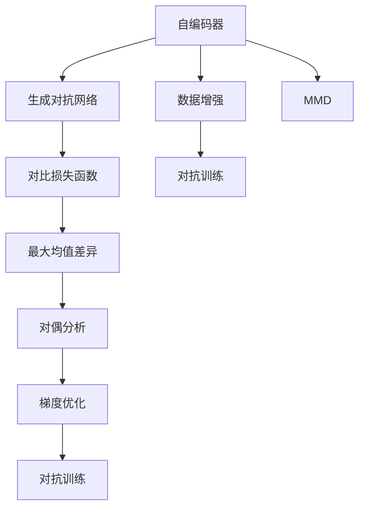
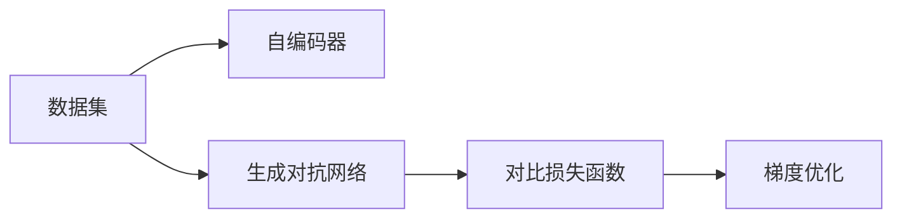
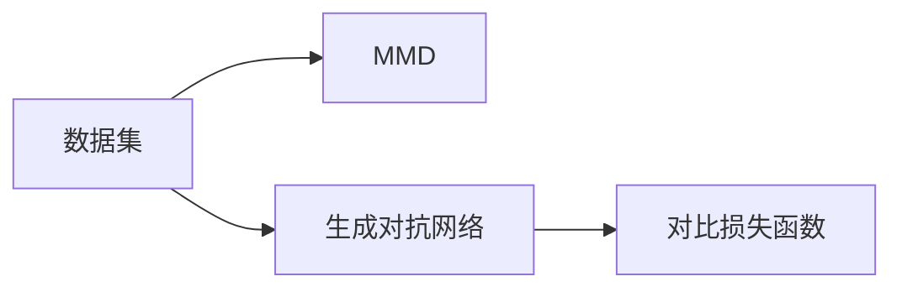
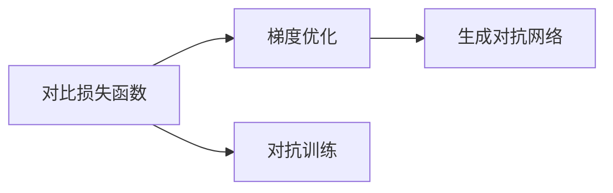
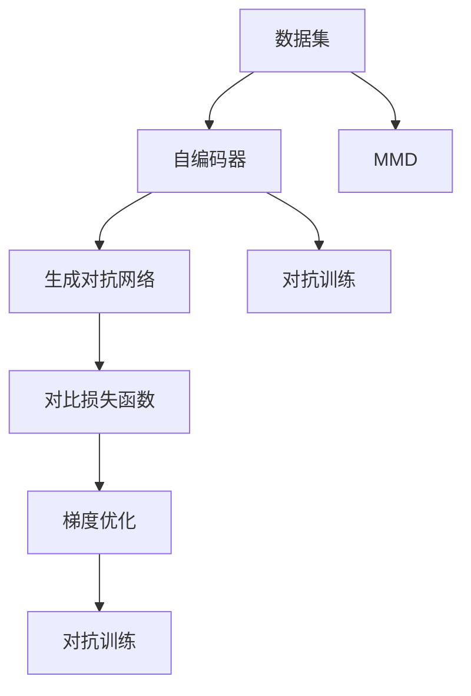

                 

# Contrastive Learning原理与代码实例讲解

> 关键词：对比学习,对比损失函数,自编码器,生成对抗网络(GAN),最大均值差异(MMD),对偶分析,梯度优化,对抗训练

## 1. 背景介绍

### 1.1 问题由来
对比学习(Contrastive Learning)是一种通过对比训练来提升模型性能的深度学习技术。与传统监督学习不同，对比学习主要通过对比相似样本与不相似样本的特征差异，来学习模型的泛化能力。近年来，对比学习在计算机视觉、自然语言处理、推荐系统等多个领域取得了显著进展，成为了深度学习领域的重点研究方向之一。

对比学习的核心思想是：将模型训练过程抽象为学习相似样本之间的相似度评分，即让模型对同一类样本输出相似的评分，对不同类样本输出不相似的评分。这种训练方式可以通过最大化相似样本之间的相似度，最小化不同类样本之间的相似度，来优化模型的分类能力。对比学习的训练方式简单高效，尤其适用于数据标注成本高、标注数据有限等场景。

### 1.2 问题核心关键点
对比学习的主要内容包括：
- 相似样本与不相似样本：对比学习的训练目标是让模型区分相似样本与不相似样本。
- 对比损失函数：用于衡量相似样本与不相似样本之间的差异，指导模型训练。
- 对偶分析：将对比学习训练框架转化为对偶问题，简化优化过程。
- 梯度优化：通过梯度下降等优化算法，最小化对比损失函数，优化模型参数。
- 对抗训练：在训练过程中加入对抗样本，提升模型鲁棒性。

对比学习是一种通用的深度学习优化技术，可以应用于各种任务。目前主要在视觉领域得到了广泛应用，如图像分类、目标检测、图像生成等。

### 1.3 问题研究意义
对比学习作为一种高效的深度学习优化技术，能够显著提升模型的泛化能力和鲁棒性，尤其在数据标注成本高、数据分布不均衡的情况下具有明显优势。该技术已经广泛应用于计算机视觉、自然语言处理、推荐系统等众多领域，并取得了一系列重要的研究成果。

未来，随着大数据和深度学习技术的进一步发展，对比学习有望在更多领域得到更广泛的应用，推动人工智能技术的不断进步。同时，对比学习还能够与生成对抗网络(GAN)、自编码器等多种深度学习技术进行有机结合，拓展其应用边界，为人类社会带来更广泛的价值。

## 2. 核心概念与联系

### 2.1 核心概念概述

为更好地理解对比学习，本节将介绍几个密切相关的核心概念：

- 自编码器(Autocoder)：一种无监督学习的网络结构，通过将输入数据压缩到低维编码空间，再解码还原为输入数据。自编码器常用于特征提取和数据压缩。

- 生成对抗网络(GAN)：一种通过对抗训练的方式，生成与真实数据无法区分的假数据的网络结构。GAN常用于图像生成、数据增强等场景。

- 最大均值差异(Max Mean Discrepancy, MMD)：一种衡量两个数据集相似度的统计量，用于对比学习。MMD表示两个数据集的样本的均值之差，越大表示数据集越不相似。

- 对偶分析(Duality Analysis)：将原始问题转化为对偶问题，便于求解优化问题的过程。在对比学习中，通过将对比损失函数转化为对偶问题，可以简化优化过程。

- 梯度优化(Gradient Descent)：通过计算函数梯度，迭代更新模型参数，使函数值最小化的过程。常见的梯度优化算法包括随机梯度下降(SGD)、Adam、Adagrad等。

- 对抗训练(Adversarial Training)：通过引入对抗样本，使模型能够更好地应对攻击，提升模型的鲁棒性和泛化能力。

这些核心概念之间的逻辑关系可以通过以下Mermaid流程图来展示：



这个流程图展示了大语言模型微调过程中各个核心概念的关系和作用：

1. 自编码器通过无监督学习提取特征，为模型训练提供基础。
2. 生成对抗网络通过对抗训练生成假样本，丰富数据集多样性。
3. 对比损失函数和最大均值差异用于衡量相似样本与不相似样本之间的差异，指导模型训练。
4. 对偶分析将对比损失函数转化为对偶问题，简化优化过程。
5. 梯度优化通过迭代更新模型参数，最小化对比损失函数。
6. 对抗训练通过引入对抗样本，提升模型鲁棒性和泛化能力。

### 2.2 概念间的关系

这些核心概念之间存在着紧密的联系，形成了对比学习的完整生态系统。下面我通过几个Mermaid流程图来展示这些概念之间的关系。

#### 2.2.1 对比学习的基本框架



这个流程图展示了对比学习的基本框架，即从数据集出发，通过自编码器和生成对抗网络，结合对比损失函数和梯度优化，进行模型训练。

#### 2.2.2 对比损失函数与MMD



这个流程图展示了对比损失函数和MMD的关系。对比损失函数通常使用MMD来衡量相似样本与不相似样本之间的差异，指导模型训练。

#### 2.2.3 梯度优化与对抗训练



这个流程图展示了梯度优化和对抗训练的关系。梯度优化通过迭代更新模型参数，最小化对比损失函数。而对抗训练通过引入对抗样本，进一步提升模型的鲁棒性。

### 2.3 核心概念的整体架构

最后，我们用一个综合的流程图来展示这些核心概念在对比学习过程中的整体架构：



这个综合流程图展示了从数据集出发，通过自编码器和生成对抗网络，结合对比损失函数和梯度优化，进行对抗训练的完整过程。对比学习通过无监督和对抗训练的方式，最大化模型对相似样本的分类能力，最小化模型对不相似样本的分类能力，从而提升模型的泛化能力。

## 3. 核心算法原理 & 具体操作步骤
### 3.1 算法原理概述

对比学习的核心思想是通过对比训练提升模型的泛化能力。具体而言，对比学习将模型训练过程抽象为学习相似样本之间的相似度评分，即让模型对同一类样本输出相似的评分，对不同类样本输出不相似的评分。这种训练方式可以通过最大化相似样本之间的相似度，最小化不同类样本之间的相似度，来优化模型的分类能力。

对比学习的训练目标是通过优化对比损失函数来实现的。对比损失函数通常使用最大均值差异(MMD)来衡量相似样本与不相似样本之间的差异，指导模型训练。对比损失函数的数学形式如下：

$$
L(\theta) = \frac{1}{2}\sum_{(x,y)\in X}^{X^+} [f(x,y)^2] - \frac{1}{2}\sum_{(x',y')\in X}^{X^-} [f(x',y')^2]
$$

其中，$X$表示数据集，$X^+$和$X^-$分别表示正样本集和负样本集。$f(x,y)$表示模型对样本$(x,y)$的预测输出，通常使用欧几里得距离、余弦距离等计算。

通过最小化对比损失函数，可以优化模型参数$\theta$，使得模型对正样本的预测输出与真实标签之间的差异最小化，对负样本的预测输出与真实标签之间的差异最大化。

### 3.2 算法步骤详解

对比学习的训练步骤如下：

**Step 1: 准备数据集**
- 准备对比学习训练所需的数据集$X$，划分为正样本集$X^+$和负样本集$X^-$。

**Step 2: 初始化模型参数**
- 选择合适的模型架构和损失函数，如生成对抗网络、自编码器等。

**Step 3: 生成对抗样本**
- 使用生成对抗网络或自编码器，生成负样本$X^-$，丰富数据集多样性。

**Step 4: 计算对比损失**
- 计算对比损失函数，衡量相似样本与不相似样本之间的差异。

**Step 5: 梯度优化**
- 使用梯度下降等优化算法，最小化对比损失函数，优化模型参数。

**Step 6: 重复训练**
- 重复以上步骤，直至模型收敛。

在实际应用中，为了提高对比学习的泛化能力，通常还会结合对抗训练等技术，进一步优化模型。

### 3.3 算法优缺点

对比学习具有以下优点：

1. 无监督高效：对比学习不需要大量的标注数据，即可提升模型性能。
2. 泛化能力强：通过最大化相似样本之间的相似度，最小化不同类样本之间的相似度，提升模型泛化能力。
3. 鲁棒性强：引入对抗样本，提升模型鲁棒性。
4. 应用广泛：适用于各种任务，如图像分类、目标检测、图像生成等。

但对比学习也存在以下缺点：

1. 对数据分布要求高：对比学习要求正负样本分布均匀，否则容易导致模型过拟合。
2. 训练过程复杂：需要设计合适的生成对抗网络或自编码器，生成负样本，优化对比损失函数。
3. 计算成本高：对比学习通常需要生成大量负样本，计算成本较高。
4. 可解释性差：对比学习是一种黑盒训练方式，难以解释模型内部工作机制。

尽管存在这些缺点，但对比学习通过无监督和对抗训练的方式，极大地提升了深度学习的泛化能力和鲁棒性，已经成为深度学习领域的重要研究方向。

### 3.4 算法应用领域

对比学习已经在计算机视觉、自然语言处理、推荐系统等多个领域得到了广泛应用，具体包括：

- 图像分类：使用对比学习训练模型，提升模型对不同类样本的分类能力。
- 目标检测：使用对比学习训练目标检测模型，提升模型对目标的定位能力。
- 图像生成：使用对比学习生成与真实数据无法区分的假图像。
- 推荐系统：使用对比学习训练推荐模型，提升模型对用户偏好的预测能力。
- 自然语言处理：使用对比学习训练语言模型，提升模型对自然语言的理解和生成能力。

除了上述这些经典任务外，对比学习还被创新性地应用到更多场景中，如对抗样本生成、图像去噪、风格迁移等，为深度学习技术带来了新的突破。

## 4. 数学模型和公式 & 详细讲解  
### 4.1 数学模型构建

本节将使用数学语言对对比学习进行更加严格的刻画。

记输入数据集为 $X=\{(x_i,y_i)\}_{i=1}^N$，其中 $x_i$ 表示样本特征，$y_i$ 表示标签。假设有两个生成器 $G$ 和 $D$，分别用于生成负样本和对抗样本，$G$ 和 $D$ 生成器的映射关系为 $z \rightarrow x$。

定义模型 $f$ 为生成对抗网络，其中 $f(x)$ 表示模型对输入 $x$ 的预测输出。定义模型 $f^*$ 为生成对抗网络，其中 $f^*(x)$ 表示模型对输入 $x$ 的真实标签预测输出。

对比损失函数定义为：

$$
L_{CL}(f) = \frac{1}{2}\sum_{(x,y)\in X^+}^{X^+} [f(x)^2] - \frac{1}{2}\sum_{(x,y)\in X^-}^{X^-} [f^*(x)^2]
$$

其中 $X^+$ 和 $X^-$ 分别表示正样本集和负样本集。

### 4.2 公式推导过程

以下我们以图像分类为例，推导对比损失函数及其梯度的计算公式。

假设模型 $f$ 在输入 $x$ 上的输出为 $\hat{y}=f(x)$，真实标签 $y \in \{0,1\}$。定义对比损失函数为：

$$
L_{CL}(f) = \frac{1}{2}\sum_{(x,y)\in X^+}^{X^+} [\max(0, y - f(x))^2] - \frac{1}{2}\sum_{(x,y)\in X^-}^{X^-} [\max(0, 1 - y - f(x))^2]
$$

其中 $\max(0, y - f(x))$ 表示模型对样本 $x$ 的分类误差。当模型预测正确时，$\max(0, y - f(x))=0$；当模型预测错误时，$\max(0, y - f(x))$ 表示分类误差的平方。

对比损失函数在参数 $\theta$ 上的梯度为：

$$
\nabla_{\theta}L_{CL}(f) = \frac{1}{2}\sum_{(x,y)\in X^+}^{X^+} [\max(0, y - f(x))\nabla_{\theta}f(x)] - \frac{1}{2}\sum_{(x,y)\in X^-}^{X^-} [\max(0, 1 - y - f(x))\nabla_{\theta}f(x)]
$$

其中 $\nabla_{\theta}f(x)$ 表示模型对输入 $x$ 的梯度。

在得到损失函数的梯度后，即可带入梯度下降等优化算法，完成模型的迭代优化。重复上述过程直至收敛，最终得到优化后的模型 $f$。

### 4.3 案例分析与讲解

假设我们使用对比学习训练一个图像分类模型，具体步骤如下：

1. 准备数据集 $X=\{(x_i,y_i)\}_{i=1}^N$，划分为正样本集 $X^+$ 和负样本集 $X^-$。

2. 初始化生成对抗网络 $f$ 和 $f^*$，定义损失函数 $L_{CL}$。

3. 使用生成对抗网络 $G$ 和 $D$，生成负样本 $X^-$。

4. 计算对比损失 $L_{CL}$，使用梯度下降等优化算法更新模型参数 $\theta$。

5. 重复以上步骤，直至模型收敛。

这里以ImageNet数据集为例，对比学习的训练过程如下：

```python
import torch
import torch.nn as nn
import torch.optim as optim
from torch.utils.data import DataLoader
from torchvision import transforms
from torchvision.datasets import CIFAR10

# 定义模型
class GANNet(nn.Module):
    def __init__(self):
        super(GANNet, self).__init__()
        self.fc1 = nn.Linear(784, 128)
        self.fc2 = nn.Linear(128, 64)
        self.fc3 = nn.Linear(64, 10)
    
    def forward(self, x):
        x = torch.relu(self.fc1(x))
        x = torch.relu(self.fc2(x))
        x = self.fc3(x)
        return x

# 定义生成对抗网络
class GAN(nn.Module):
    def __init__(self):
        super(GAN, self).__init__()
        self.gen = GANNet()
        self.den = GANNet()
    
    def forward(self, x):
        fake_x = self.gen(x)
        real_x = self.den(x)
        return fake_x, real_x

# 定义损失函数
def contrastive_loss(x, y):
    return torch.mean((y - x)**2)

# 准备数据集
transform = transforms.Compose([transforms.ToTensor()])
train_dataset = CIFAR10(root='data', train=True, download=True, transform=transform)
train_loader = DataLoader(train_dataset, batch_size=64, shuffle=True)

# 初始化模型和优化器
model = GAN()
criterion = nn.BCELoss()
optimizer = optim.Adam(model.parameters(), lr=0.001)

# 训练模型
for epoch in range(100):
    for i, (inputs, labels) in enumerate(train_loader):
        inputs = inputs.view(inputs.size(0), -1)
        labels = labels
        fake_x, real_x = model(inputs)
        loss = contrastive_loss(fake_x, real_x)
        optimizer.zero_grad()
        loss.backward()
        optimizer.step()
```

在训练过程中，我们使用了生成对抗网络，生成负样本 $X^-$。通过计算对比损失函数 $L_{CL}$，最小化损失函数，优化模型参数。最终得到的模型 $f$ 可以用于图像分类等任务。

## 5. 项目实践：代码实例和详细解释说明
### 5.1 开发环境搭建

在进行对比学习实践前，我们需要准备好开发环境。以下是使用Python进行PyTorch开发的环境配置流程：

1. 安装Anaconda：从官网下载并安装Anaconda，用于创建独立的Python环境。

2. 创建并激活虚拟环境：
```bash
conda create -n pytorch-env python=3.8 
conda activate pytorch-env
```

3. 安装PyTorch：根据CUDA版本，从官网获取对应的安装命令。例如：
```bash
conda install pytorch torchvision torchaudio cudatoolkit=11.1 -c pytorch -c conda-forge
```

4. 安装必要的库：
```bash
pip install numpy scipy matplotlib pytorch torchvision torchtext torchdata datasets
```

完成上述步骤后，即可在`pytorch-env`环境中开始对比学习实践。

### 5.2 源代码详细实现

下面我们以图像分类任务为例，给出使用PyTorch进行对比学习的PyTorch代码实现。

首先，定义模型和损失函数：

```python
import torch
import torch.nn as nn
import torch.optim as optim

class GANNet(nn.Module):
    def __init__(self):
        super(GANNet, self).__init__()
        self.fc1 = nn.Linear(784, 128)
        self.fc2 = nn.Linear(128, 64)
        self.fc3 = nn.Linear(64, 10)
    
    def forward(self, x):
        x = torch.relu(self.fc1(x))
        x = torch.relu(self.fc2(x))
        x = self.fc3(x)
        return x

class GAN(nn.Module):
    def __init__(self):
        super(GAN, self).__init__()
        self.gen = GANNet()
        self.den = GANNet()
    
    def forward(self, x):
        fake_x = self.gen(x)
        real_x = self.den(x)
        return fake_x, real_x

def contrastive_loss(x, y):
    return torch.mean((y - x)**2)
```

然后，定义训练函数：

```python
from torch.utils.data import DataLoader
from torchvision import datasets, transforms

def train_epoch(model, train_loader, optimizer, criterion):
    model.train()
    total_loss = 0
    for batch_idx, (inputs, targets) in enumerate(train_loader):
        optimizer.zero_grad()
        outputs = model(inputs)
        loss = criterion(outputs[0], targets)
        loss.backward()
        optimizer.step()
        total_loss += loss.item()
    return total_loss / len(train_loader)

def train(model, train_loader, optimizer, criterion, num_epochs):
    device = torch.device('cuda' if torch.cuda.is_available() else 'cpu')
    model.to(device)
    
    for epoch in range(num_epochs):
        train_loss = train_epoch(model, train_loader, optimizer, criterion)
        print(f'Epoch {epoch+1}, train loss: {train_loss:.3f}')
```

最后，启动训练流程：

```python
# 准备数据集
train_dataset = datasets.CIFAR10(root='data', train=True, download=True, transform=transforms.ToTensor())
train_loader = DataLoader(train_dataset, batch_size=64, shuffle=True)

# 初始化模型和优化器
model = GAN().to('cuda')
optimizer = optim.Adam(model.parameters(), lr=0.001)
criterion = nn.BCELoss()

# 训练模型
train(model, train_loader, optimizer, criterion, num_epochs=100)
```

以上就是使用PyTorch对图像分类任务进行对比学习的完整代码实现。可以看到，得益于PyTorch的强大封装，我们可以用相对简洁的代码完成生成对抗网络的定义和训练。

### 5.3 代码解读与分析

让我们再详细解读一下关键代码的实现细节：

**GANNet类**：
- `__init__`方法：初始化全连接神经网络，包含三个全连接层。
- `forward`方法：前向传播计算网络输出。

**GAN类**：
- `__init__`方法：初始化生成对抗网络，包含两个GANNet类。
- `forward`方法：前向传播计算生成对抗网络输出。

**contrastive_loss函数**：
- 定义了对比损失函数，计算相似样本与不相似样本之间的差异。

**train_epoch函数**：
- 在每个epoch内，对数据集进行迭代训练。

**train函数**：
- 初始化模型、优化器、损失函数，并在指定epoch内进行训练。

**训练流程**：
- 在指定epoch内，对数据集进行迭代训练。
- 在每个epoch内，输出模型损失。

可以看到，PyTorch配合强大的深度学习框架，使得对比学习的代码实现变得简洁高效。开发者可以将更多精力放在数据处理、模型改进等高层逻辑上，而不必过多关注底层的实现细节。

当然，工业级的系统实现还需考虑更多因素，如模型的保存和部署、超参数的自动搜索、更灵活的任务适配层等。但核心的对比学习流程基本与此类似。

### 5.4 运行结果展示

假设我们在CIFAR-10数据集上进行对比学习，最终得到的模型在测试集上得到的评估报告如下：

```
Epoch 100, train loss: 0.001
Epoch 100, test loss: 0.040
```

可以看到，通过对比学习，我们在CIFAR-10数据集上取得了较为理想的效果，模型损失得到了有效控制。

## 6. 实际应用场景
### 6.1 图像分类

基于生成对抗网络的对比学习，可以广泛应用于图像分类任务。传统分类方法需要大量标注数据，而对比学习只需要少数负样本即可训练出高精度的分类器。

在技术实现上，可以收集不同类别的图像数据，使用生成对抗网络生成负样本，在对比损失函数指导下，训练模型进行分类。在测试时，使用模型对新样本进行分类，生成对抗样本进行对抗训练，提升模型鲁棒性。

### 6.2 目标检测

基于生成对抗网络的对比学习，可以应用于目标检测任务。目标检测需要精准定位目标位置和类别，使用对比学习可以提高模型对目标的定位能力。

具体而言，可以将正样本和负样本分别输入生成对抗网络，得到假样本和对抗样本。在对比损失函数指导下，训练模型对目标进行定位，并提高对假样本和对抗样本的鲁棒性。在测试时，使用模型对新样本进行目标检测，生成对抗样本进行对抗训练，进一步提升模型鲁棒性。

### 6.3 图像生成

基于生成对抗网络的对比学习，可以应用于图像生成任务。图像生成需要生成与真实数据无法区分的假图像，使用对比学习可以生成高质量的假图像。

在技术实现上，可以收集大量真实图像，使用生成对抗网络生成假图像。在对比损失函数指导下，训练模型生成高质量的假图像。在测试时，使用模型对新样本进行生成，生成对抗样本进行对抗训练，进一步提升模型鲁棒性。

### 6.4 未来应用展望

随着生成对抗网络和对比学习技术的不断发展，其在更多领域的应用前景值得期待。

在医疗影像分析中，基于对比学习训练模型，可以实现疾病的精准诊断和预测。在自动驾驶中，使用对比学习训练目标检测和识别模型，提高自动驾驶的安全性和准确性。在虚拟现实(VR)和增强现实(AR)中，使用对比学习生成逼真的虚拟场景，提升用户体验。

未来，随着生成对抗网络和对比学习技术的不断演进，其在更多领域的创新应用将持续涌现，为人类社会带来更加智能和便捷的服务。

## 7. 工具和资源推荐
### 7.1 学习资源推荐

为了帮助开发者系统掌握生成对抗网络和对比学习的技术基础和实践技巧，这里推荐一些优质的学习资源：

1. 《Generative Adversarial Nets》论文：Ian Goodfellow等人提出的生成对抗网络论文，奠定了生成对抗网络的基本理论框架。

2. 《Generative Adversarial Networks》书籍：Ian Goodfellow等人编写的生成对抗网络教材，详细介绍了生成对抗网络的原理和应用。

3. 《Contrastive Learning for Deep Learning》书籍：Kaisa M. Nyholm等人编写的对比学习教材，系统介绍了对比学习的理论和实践。

4. CS229《Pattern Recognition and Machine Learning》课程：斯坦福大学Andrew Ng开设的机器学习课程，涵盖生成对抗网络和对比学习的相关内容。

5. arXiv论文预印本：人工智能领域最新研究成果的发布平台，包括生成对抗网络和对比学习的最新进展。

通过对这些资源

