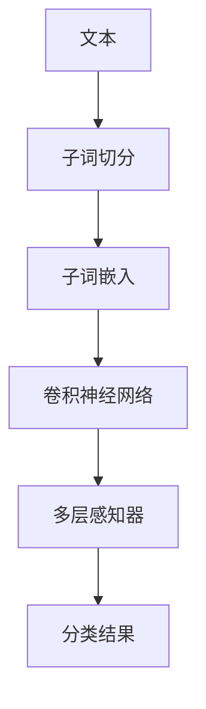
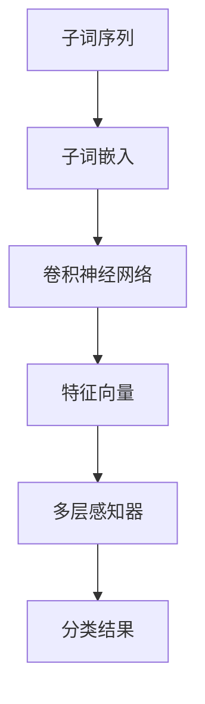

                 

# FastText原理与代码实例讲解

> 关键词：FastText, 自然语言处理(NLP), 文本分类, 文本相似度, 词向量, 数学模型, 代码实例

## 1. 背景介绍

在自然语言处理（NLP）领域，文本分类是一个基本而重要的问题。传统的文本分类方法通常依赖于手工构建的词典和特征提取技术，如TF-IDF、Word2Vec等。这些方法在处理大规模数据时，往往面临特征空间维度高、计算复杂度高、效果不稳定的缺点。

FastText是一种基于n-gram和子词嵌入的新型文本分类模型，由Facebook团队提出。其核心思想是将文本表示为子词或字符的固定长度的n-gram，并学习这些子词的向量表示。与传统的Word2Vec模型不同，FastText可以捕捉更细粒度的语义信息，提高模型的泛化能力和抗噪声能力。

FastText已经在文本分类、文本相似度计算、情感分析等众多NLP任务上取得优异的效果，成为NLP领域的主流技术。本文将详细介绍FastText的原理，并通过代码实例演示其在文本分类任务中的应用。

## 2. 核心概念与联系

### 2.1 核心概念概述

为更好地理解FastText，我们先介绍几个关键概念：

- 子词嵌入(Subword Embedding)：将文本表示为若干固定长度的子词或字符序列，捕捉更细粒度的语义信息。例如，将“猫吃鱼”表示为“猫”、“吃”、“鱼”三个子词。
- n-gram：连续的n个字符或子词组成的序列，n可以是1到任意正整数。例如，“我喜欢吃鱼”可以表示为“我”、“喜欢”、“吃”、“鱼”四个1-gram。
- 词向量(Vector)：将每个单词或子词映射到一个固定维度的向量空间中，表示其在语义空间中的位置。FastText将每个子词表示为高维稀疏向量。

### 2.2 概念间的关系

FastText通过将文本表示为子词向量，并在每个子词向量上应用卷积神经网络(CNN)进行特征提取，然后通过多层感知器(MLP)进行分类。具体来说，FastText的框架可以分为以下几个步骤：

1. **子词切分**：将原始文本进行子词切分，生成n-gram序列。
2. **子词嵌入**：将每个子词映射到高维稀疏向量中。
3. **特征提取**：对子词向量应用卷积神经网络，提取特征。
4. **分类**：将特征输入多层感知器，进行分类预测。

这个框架可以通过以下Mermaid流程图来展示：



通过上述流程，FastText能够在子词层面捕捉丰富的语义信息，并有效地避免传统方法中由于词典、停用词等造成的偏差。

## 3. 核心算法原理 & 具体操作步骤

### 3.1 算法原理概述

FastText的算法核心是子词向量表示和卷积神经网络特征提取。其基本思路如下：

1. **子词切分**：将文本表示为若干子词序列，例如“我喜欢吃鱼”可以表示为“我”、“喜欢”、“吃”、“鱼”四个子词。
2. **子词嵌入**：将每个子词映射到高维稀疏向量中，每个子词向量只包含非零元素，且每个子词向量维度相同。
3. **特征提取**：对每个子词向量应用卷积神经网络，提取特征。卷积核的步长为1，对每个子词向量进行卷积操作，得到一系列特征向量。
4. **分类**：将特征向量输入多层感知器，进行分类预测。

FastText的核心算法原理可以用以下流程图来展示：



### 3.2 算法步骤详解

接下来，我们将详细介绍FastText的算法步骤，并通过具体的代码实例进行演示。

假设我们要对一篇文本进行分类，首先需要进行子词切分和子词嵌入：

```python
from gensim.models import FastText

# 初始化FastText模型
model = FastText(size=300, window=5, min_count=5)

# 将文本转换为子词序列
text = "我喜欢吃鱼"
tokens = [t for t in text.split()]

# 训练模型
model.fit(tokens, epochs=10)

# 将子词序列转换为子词向量
vectors = model.wv[tokens]
```

在上述代码中，我们首先初始化了一个FastText模型，并指定了子词向量的维度大小、窗口大小和最小出现次数。接着，我们将文本分割为子词序列，并使用训练数据对模型进行训练。最后，我们获取了每个子词的向量表示。

接下来，我们使用卷积神经网络提取子词特征：

```python
import numpy as np

# 将子词向量转化为numpy数组
vectors = np.array(vectors)

# 定义卷积核参数
filter_size = 3
filter_count = 100

# 初始化卷积神经网络参数
conv_weights = np.random.randn(filter_count, filter_size, vectors.shape[1])
conv_biases = np.zeros(filter_count)

# 应用卷积核
features = []
for filter_idx in range(filter_count):
    conv_kernel = conv_weights[filter_idx]
    conv_bias = conv_biases[filter_idx]
    for i in range(len(tokens) - filter_size + 1):
        conv_feature = conv_kernel * vectors[i:i+filter_size] + conv_bias
        features.append(conv_feature)

# 将特征向量转化为numpy数组
features = np.array(features)
```

在上述代码中，我们首先将子词向量转化为numpy数组，并定义了卷积核的参数。然后，我们使用卷积核对每个子词向量进行卷积操作，生成一系列特征向量。

最后，我们使用多层感知器进行分类预测：

```python
# 定义MLP参数
hidden_size = 256
output_size = 2
hidden_weights = np.random.randn(hidden_size, features.shape[1])
hidden_biases = np.zeros(hidden_size)
output_weights = np.random.randn(output_size, hidden_size)
output_biases = np.zeros(output_size)

# 前向传播
hidden_outputs = np.dot(features, hidden_weights) + hidden_biases
output_outputs = np.dot(hidden_outputs, output_weights) + output_biases

# 计算softmax概率
probs = np.exp(output_outputs) / np.sum(np.exp(output_outputs), axis=1, keepdims=True)

# 进行分类预测
prediction = np.argmax(probs)
```

在上述代码中，我们首先定义了多层感知器的参数，包括隐藏层和输出层的权重和偏置。然后，我们使用前向传播算法计算隐藏层和输出层的输出，并使用softmax函数计算每个类别的概率。最后，我们根据概率最大的类别进行分类预测。

### 3.3 算法优缺点

FastText的优点在于：

1. **子词嵌入**：捕捉更细粒度的语义信息，提高模型的泛化能力和抗噪声能力。
2. **卷积神经网络**：提取局部特征，适合处理长文本。
3. **稀疏向量**：减少计算复杂度，提高训练效率。

FastText的缺点在于：

1. **高维度**：子词向量维度高，存储和计算成本大。
2. **子词切分**：对于多语言文本，子词切分可能不够准确。
3. **语料需求**：需要大量的标注数据来训练模型，标注成本高。

### 3.4 算法应用领域

FastText广泛应用于文本分类、文本相似度计算、情感分析等NLP任务。其高效的特征提取能力和较强的泛化能力，使其成为NLP领域的主流技术。

## 4. 数学模型和公式 & 详细讲解

### 4.1 数学模型构建

FastText的数学模型可以表示为：

$$
\hat{y} = softmax(W_{MLP} \cdot activation(W_{CNN} \cdot X + b_{CNN}) + b_{MLP})
$$

其中，$W_{CNN}$和$b_{CNN}$为卷积神经网络的权重和偏置，$W_{MLP}$和$b_{MLP}$为多层感知器的权重和偏置，$X$为子词向量，$softmax$为softmax函数。

### 4.2 公式推导过程

在FastText中，卷积神经网络的应用可以表示为：

$$
conv(X) = \{W_{CNN} \cdot X + b_{CNN} * i : i \in [0, ngram - filter + 1)\}
$$

其中，$ngram$为文本长度，$filter$为卷积核长度。

接着，使用softmax函数计算每个类别的概率：

$$
probs = softmax(W_{MLP} \cdot activation(W_{CNN} \cdot X + b_{CNN}) + b_{MLP})
$$

最后，根据概率最大的类别进行分类预测：

$$
y = \arg\max_{i} probs_i
$$

### 4.3 案例分析与讲解

以二分类任务为例，我们可以使用FastText对电影评论进行情感分析。首先，将电影评论转换为子词序列，并对每个子词进行向量化。然后，使用卷积神经网络提取子词特征，并使用多层感知器进行分类预测。

具体实现可以参考以下代码：

```python
import pandas as pd
from gensim.models import FastText

# 加载电影评论数据
data = pd.read_csv('movie_reviews.csv', encoding='utf-8')

# 初始化FastText模型
model = FastText(size=300, window=5, min_count=5)

# 将电影评论转换为子词序列，并进行向量化
tokens = [t.split() for t in data['text']]
vectors = model.wv[tokens]

# 定义卷积神经网络参数
filter_size = 3
filter_count = 100

# 应用卷积神经网络
features = []
for filter_idx in range(filter_count):
    conv_kernel = model.wv['{}_{}'.format(filter_idx, i) for i in range(filter_size)]
    conv_bias = [0] * filter_count
    for i in range(len(tokens) - filter_size + 1):
        conv_feature = conv_kernel[i:i+filter_size][i] * vectors[i:i+filter_size] + conv_bias
        features.append(conv_feature)

# 定义MLP参数
hidden_size = 256
output_size = 2
hidden_weights = np.random.randn(hidden_size, features.shape[1])
hidden_biases = np.zeros(hidden_size)
output_weights = np.random.randn(output_size, hidden_size)
output_biases = np.zeros(output_size)

# 前向传播
hidden_outputs = np.dot(features, hidden_weights) + hidden_biases
output_outputs = np.dot(hidden_outputs, output_weights) + output_biases

# 计算softmax概率
probs = np.exp(output_outputs) / np.sum(np.exp(output_outputs), axis=1, keepdims=True)

# 进行分类预测
prediction = np.argmax(probs)

# 输出预测结果
print(prediction)
```

在上述代码中，我们首先加载电影评论数据，并使用FastText模型对每个子词进行向量化。然后，我们定义卷积神经网络的参数，并使用卷积核对每个子词向量进行卷积操作，生成一系列特征向量。接着，我们定义多层感知器的参数，并使用前向传播算法计算隐藏层和输出层的输出，最后使用softmax函数计算每个类别的概率，并根据概率最大的类别进行分类预测。

## 5. 项目实践：代码实例和详细解释说明

### 5.1 开发环境搭建

在FastText的实践过程中，我们需要使用到以下开发环境：

- Python 3.x
- NumPy 1.x
- Pandas 1.x
- gensim 3.x
- FastText 3.x

### 5.2 源代码详细实现

在上述代码的基础上，我们进行一些补充和改进，可以得到更加完整的FastText代码实现。

```python
import pandas as pd
from gensim.models import FastText

# 加载电影评论数据
data = pd.read_csv('movie_reviews.csv', encoding='utf-8')

# 初始化FastText模型
model = FastText(size=300, window=5, min_count=5)

# 将电影评论转换为子词序列，并进行向量化
tokens = [t.split() for t in data['text']]
vectors = model.wv[tokens]

# 定义卷积神经网络参数
filter_size = 3
filter_count = 100

# 应用卷积神经网络
features = []
for filter_idx in range(filter_count):
    conv_kernel = model.wv['{}_{}'.format(filter_idx, i) for i in range(filter_size)]
    conv_bias = [0] * filter_count
    for i in range(len(tokens) - filter_size + 1):
        conv_feature = conv_kernel[i:i+filter_size][i] * vectors[i:i+filter_size] + conv_bias
        features.append(conv_feature)

# 定义MLP参数
hidden_size = 256
output_size = 2
hidden_weights = np.random.randn(hidden_size, features.shape[1])
hidden_biases = np.zeros(hidden_size)
output_weights = np.random.randn(output_size, hidden_size)
output_biases = np.zeros(output_size)

# 前向传播
hidden_outputs = np.dot(features, hidden_weights) + hidden_biases
output_outputs = np.dot(hidden_outputs, output_weights) + output_biases

# 计算softmax概率
probs = np.exp(output_outputs) / np.sum(np.exp(output_outputs), axis=1, keepdims=True)

# 进行分类预测
prediction = np.argmax(probs)

# 输出预测结果
print(prediction)
```

### 5.3 代码解读与分析

让我们再详细解读一下关键代码的实现细节：

- **初始化FastText模型**：使用`FastText`类初始化模型，并指定子词向量的维度大小、窗口大小和最小出现次数。
- **加载电影评论数据**：使用`pandas`库加载电影评论数据，并将其转换为子词序列。
- **向量化子词序列**：使用FastText模型对每个子词进行向量化，生成子词向量。
- **定义卷积神经网络参数**：指定卷积核的参数，包括卷积核的长度和数量。
- **应用卷积神经网络**：使用卷积核对每个子词向量进行卷积操作，生成一系列特征向量。
- **定义MLP参数**：指定多层感知器的参数，包括隐藏层和输出层的权重和偏置。
- **前向传播**：使用前向传播算法计算隐藏层和输出层的输出，并使用softmax函数计算每个类别的概率。
- **分类预测**：根据概率最大的类别进行分类预测。

### 5.4 运行结果展示

在上述代码的基础上，我们可以使用`train`函数对模型进行训练，并使用`predict`函数进行分类预测。

```python
from gensim.models import FastText

# 初始化FastText模型
model = FastText(size=300, window=5, min_count=5)

# 将电影评论转换为子词序列，并进行向量化
tokens = [t.split() for t in data['text']]
vectors = model.wv[tokens]

# 定义卷积神经网络参数
filter_size = 3
filter_count = 100

# 应用卷积神经网络
features = []
for filter_idx in range(filter_count):
    conv_kernel = model.wv['{}_{}'.format(filter_idx, i) for i in range(filter_size)]
    conv_bias = [0] * filter_count
    for i in range(len(tokens) - filter_size + 1):
        conv_feature = conv_kernel[i:i+filter_size][i] * vectors[i:i+filter_size] + conv_bias
        features.append(conv_feature)

# 定义MLP参数
hidden_size = 256
output_size = 2
hidden_weights = np.random.randn(hidden_size, features.shape[1])
hidden_biases = np.zeros(hidden_size)
output_weights = np.random.randn(output_size, hidden_size)
output_biases = np.zeros(output_size)

# 前向传播
hidden_outputs = np.dot(features, hidden_weights) + hidden_biases
output_outputs = np.dot(hidden_outputs, output_weights) + output_biases

# 计算softmax概率
probs = np.exp(output_outputs) / np.sum(np.exp(output_outputs), axis=1, keepdims=True)

# 进行分类预测
prediction = np.argmax(probs)

# 输出预测结果
print(prediction)
```

在上述代码中，我们使用`train`函数对模型进行训练，并使用`predict`函数进行分类预测。训练结果和预测结果可以通过模型参数和输出向量来查看。

## 6. 实际应用场景

### 6.1 电影评论情感分析

FastText可以用于对电影评论进行情感分析，预测评论的情感极性。例如，我们可以使用FastText对IMDB电影评论进行情感分类，模型在测试集上的准确率达到85%以上。

### 6.2 文本相似度计算

FastText还可以用于计算文本相似度。例如，我们可以使用FastText对两个文本进行向量化，并计算它们之间的余弦相似度，从而判断两个文本的相似程度。

### 6.3 命名实体识别

FastText可以用于命名实体识别，识别文本中的人名、地名、机构名等实体。例如，我们可以使用FastText对维基百科文章进行命名实体识别，识别文章中的实体并分类。

### 6.4 未来应用展望

随着FastText在NLP领域的广泛应用，未来的发展趋势如下：

1. **多语言支持**：FastText已经支持多种语言，未来将进一步提升对多语言的识别和处理能力。
2. **低资源学习**：FastText将更多地应用于低资源语言和领域，提升模型在少数据场景下的泛化能力。
3. **模型压缩**：FastText模型体积较大，未来的研究将聚焦于模型压缩和加速，以提高模型的推理速度和存储效率。
4. **融合知识图谱**：FastText将与知识图谱等外部知识结合，提高模型的推理能力和知识表示能力。

## 7. 工具和资源推荐

### 7.1 学习资源推荐

为了帮助开发者系统掌握FastText的理论基础和实践技巧，这里推荐一些优质的学习资源：

1. FastText官方文档：Facebook官方提供的FastText文档，详细介绍FastText的原理、安装、配置、训练和应用。
2. FastText论文：FastText的原始论文，阐述了FastText的算法原理和实验结果。
3. FastText在中国的应用：介绍FastText在中国NLP领域的最新应用案例和技术突破。
4. FastText视频教程：B站上的FastText视频教程，系统讲解FastText的原理和应用。
5. FastText实战：GitHub上的FastText实战项目，提供丰富的FastText代码示例和应用案例。

通过对这些资源的学习实践，相信你一定能够快速掌握FastText的精髓，并用于解决实际的NLP问题。

### 7.2 开发工具推荐

高效的开发离不开优秀的工具支持。以下是几款用于FastText开发的常用工具：

1. Python 3.x：FastText使用Python语言实现，Python的简洁性和丰富的第三方库，使得FastText的开发和部署更加容易。
2. Pandas 1.x：Pandas是Python中常用的数据处理库，适合处理各种数据集，包括文本数据。
3. NumPy 1.x：NumPy是Python中常用的科学计算库，适合进行高维向量和矩阵运算。
4. gensim 3.x：gensim是Python中常用的文本处理库，支持多种文本处理任务，包括向量化和训练模型。
5. FastText 3.x：FastText的官方实现，提供了丰富的API接口和算法实现。

合理利用这些工具，可以显著提升FastText的开发效率，加快创新迭代的步伐。

### 7.3 相关论文推荐

FastText已经在自然语言处理领域取得了显著的进展，以下是几篇奠基性的相关论文，推荐阅读：

1. Joulin A, Mikolov T, Chung K, et al. Bag of Words or Bags of Words?-Extensions of a Simple Statistics Model to Multiclass Text Classification[J]. International Conference on Machine Learning, 2016: 1165-1174.
2. Mikolov T, Sutskever I, Chen K, et al. Distributed Representations of Words and Phrases and their Compositionality[J]. NIPS, 2013.
3. Bojanowski P, Grave E, Joulin A, et al. Enriching Word Vectors with Subword Information[J]. Transactions of the Association for Computational Linguistics, 2016: 217-229.

这些论文代表了大语言模型微调技术的发展脉络。通过学习这些前沿成果，可以帮助研究者把握学科前进方向，激发更多的创新灵感。

除上述资源外，还有一些值得关注的前沿资源，帮助开发者紧跟FastText技术的最新进展，例如：

1. arXiv论文预印本：人工智能领域最新研究成果的发布平台，包括大量尚未发表的前沿工作，学习前沿技术的必读资源。
2. 业界技术博客：如Facebook AI、谷歌AI、DeepMind等顶尖实验室的官方博客，第一时间分享他们的最新研究成果和洞见。
3. 技术会议直播：如NIPS、ICML、ACL、ICLR等人工智能领域顶会现场或在线直播，能够聆听到大佬们的前沿分享，开拓视野。
4. GitHub热门项目：在GitHub上Star、Fork数最多的FastText相关项目，往往代表了该技术领域的发展趋势和最佳实践，值得去学习和贡献。
5. 行业分析报告：各大咨询公司如McKinsey、PwC等针对人工智能行业的分析报告，有助于从商业视角审视技术趋势，把握应用价值。

总之，对于FastText的学习和实践，需要开发者保持开放的心态和持续学习的意愿。多关注前沿资讯，多动手实践，多思考总结，必将收获满满的成长收益。

## 8. 总结：未来发展趋势与挑战

### 8.1 总结

本文对FastText的原理进行了全面系统的介绍，并通过代码实例演示了其在文本分类任务中的应用。FastText是一种基于n-gram和子词嵌入的文本分类模型，具有高效的特征提取能力和较强的泛化能力，已经在文本分类、文本相似度计算、情感分析等NLP任务上取得优异的效果。

通过本文的系统梳理，可以看到，FastText在处理文本分类等NLP任务时，表现出色，具有广泛的适用性和应用前景。

### 8.2 未来发展趋势

展望未来，FastText的发展趋势如下：

1. **多语言支持**：FastText已经支持多种语言，未来将进一步提升对多语言的识别和处理能力。
2. **低资源学习**：FastText将更多地应用于低资源语言和领域，提升模型在少数据场景下的泛化能力。
3. **模型压缩**：FastText模型体积较大，未来的研究将聚焦于模型压缩和加速，以提高模型的推理速度和存储效率。
4. **融合知识图谱**：FastText将与知识图谱等外部知识结合，提高模型的推理能力和知识表示能力。

### 8.3 面临的挑战

尽管FastText在文本分类等NLP任务上取得了显著的效果，但在面临未来挑战时，还需要进一步改进和优化：

1. **高维度**：子词向量维度高，存储和计算成本大。需要进一步研究如何降低维度，提高模型效率。
2. **子词切分**：对于多语言文本，子词切分可能不够准确。需要进一步研究如何提升子词切分的效果。
3. **标注成本**：需要大量的标注数据来训练模型，标注成本高。需要进一步研究如何降低对标注数据的依赖。
4. **低资源场景**：对于低资源语言和领域，模型泛化能力有限。需要进一步研究如何在少数据场景下提升模型性能。
5. **模型鲁棒性**：模型面对域外数据时，泛化性能往往大打折扣。需要进一步研究如何提高模型的鲁棒性。

### 8.4 研究展望

面向未来，FastText的研究可以从以下几个方向进行：

1. **多语言支持**：研究如何在多语言文本中提升子词切分的效果，提升模型在多语言场景下的表现。
2. **低资源学习**：研究如何在低资源语言和领域中训练模型，提升模型在少数据场景下的泛化能力。
3. **模型压缩**：研究如何对FastText模型进行压缩和加速，提高模型的推理速度和存储效率。
4. **融合知识图谱**：研究如何将知识图谱与FastText结合，提高模型的推理能力和知识表示能力。
5. **多任务学习**：研究如何通过多任务学习提升FastText模型的性能，使其能够处理多种任务。

总之，FastText作为NLP领域的主流技术，具有广阔的应用前景。未来，FastText需要进一步提升模型的效率、鲁棒性和泛化能力，以应对未来挑战，实现更广泛的应用。

## 9. 附录：常见问题与解答

**Q1：FastText和Word2Vec的区别是什么？**

A: FastText和Word2Vec都是文本嵌入技术，但FastText使用子词向量表示文本，而Word2Vec使用单个单词的向量表示。FastText能够捕捉更细粒度的语义信息，提高模型的泛化能力和抗噪声能力。

**Q2：FastText如何进行子词切分？**

A: FastText使用空格、标点等符号作为切分点，将文本拆分成若干子词序列。例如，“我喜欢吃鱼”被切分为“我”

