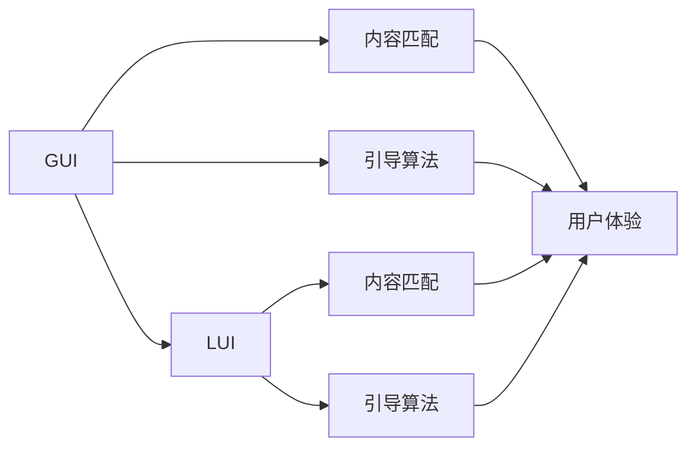

                 

# GUI与LUI在内容匹配与引导中的比较

> 关键词：GUI, LUI, 内容匹配, 引导算法, 用户体验, 技术选型

## 1. 背景介绍

随着信息技术的飞速发展，用户界面（User Interface，UI）设计在现代软件开发中占据了越来越重要的位置。早期的GUI（Graphical User Interface，图形用户界面）以Windows、MacOS、Linux等为代表，注重图形化操作和用户交互体验。而近些年随着人工智能和大数据技术的进步，LUI（Language-Based User Interface，语言用户界面）逐渐成为新的研究热点，特别是自然语言生成（NLG）和交互（NLI）技术的发展，进一步推动了LUI的普及。本文将对GUI和LUI在内容匹配与引导中的异同点进行比较，并探讨未来在内容匹配与引导中的应用趋势。

## 2. 核心概念与联系

### 2.1 核心概念概述

#### GUI
GUI是一种以图形化界面形式向用户展示和交互的系统，它通过按钮、文本框、菜单等可视化组件实现人机交互。GUI的优势在于直观易用，适合处理复杂的数据操作和用户界面设计。

#### LUI
LUI是一种通过自然语言处理（NLP）技术，如语音识别、自然语言理解（NLU）、自然语言生成（NLG）等，实现人机交互的方式。LUI利用自然语言作为媒介，减少了对硬件输入输出的依赖，提供了更为自然、流畅的交互体验。

#### 内容匹配
内容匹配是指将系统输出的信息与用户输入的请求进行比对，判断信息是否满足用户需求，并根据匹配结果进行相应的处理。

#### 引导算法
引导算法是在用户与系统的交互过程中，根据用户的输入和系统的输出，动态调整交互方式，使系统更好地理解和满足用户需求。

#### 用户体验
用户体验是指用户在使用系统时的主观感受和满意度，涉及可用性、可访问性、可靠性和效率等方面。

#### 技术选型
技术选型是决定使用哪种技术和工具进行系统开发和实现的过程，影响着系统的性能、可维护性和用户体验。

这些核心概念之间具有紧密的联系。GUI和LUI都是实现人机交互的界面技术，而内容匹配与引导算法则是在交互过程中进行信息处理和动态调整的技术。用户体验和技术选型则是基于这些技术实现的结果和评价标准。

### 2.2 核心概念之间的关系

通过以下Mermaid流程图展示GUI和LUI在内容匹配与引导中的关系：



图中展示了GUI和LUI在内容匹配与引导中的关系。从用户交互角度来看，两者都是通过内容匹配和引导算法来提升用户体验。不同的是，GUI依赖图形化界面，而LUI通过自然语言处理技术进行内容匹配和引导。

## 3. 核心算法原理 & 具体操作步骤

### 3.1 算法原理概述

#### GUI算法原理
GUI通过图形化界面展示系统信息，用户通过点击、拖拽等操作进行交互。内容匹配算法通常基于用户的操作路径和系统响应，判断用户请求是否满足，并进行相应的处理。引导算法则根据用户的操作和系统的反馈，动态调整界面元素和交互方式，提升用户体验。

#### LUI算法原理
LUI利用自然语言处理技术，如意图识别、实体抽取、语义理解等，将用户输入的自然语言转化为系统可理解的信息。内容匹配算法通过NLP技术，将用户输入与系统响应进行比对，判断信息是否满足用户需求。引导算法则根据用户输入的语言信息，动态调整交互方式，实现更自然的用户交互。

### 3.2 算法步骤详解

#### GUI操作步骤
1. 用户通过图形化界面输入请求。
2. 系统根据用户请求，展示相应的界面元素。
3. 用户进行操作，系统响应用户操作。
4. 系统根据用户操作路径和系统响应，进行内容匹配。
5. 系统根据内容匹配结果，进行动态引导，调整交互方式。
6. 用户继续操作，系统继续响应用户请求。

#### LUI操作步骤
1. 用户通过语音、文本等方式输入请求。
2. 系统进行语音识别或文本分析，转化为系统可理解的信息。
3. 系统根据用户请求，生成自然语言回复。
4. 系统将自然语言回复进行语义理解，判断信息是否满足用户需求。
5. 系统根据语义理解结果，进行动态引导，调整交互方式。
6. 用户继续操作，系统继续响应用户请求。

### 3.3 算法优缺点

#### GUI优点
1. 直观易用：图形化界面直观、易于理解，适合处理复杂数据操作。
2. 操作方便：通过点击、拖拽等操作，用户可以更高效地完成任务。
3. 可维护性强：图形界面代码更易于维护和修改。

#### GUI缺点
1. 学习曲线陡峭：对于不熟悉图形界面的用户，需要花费较多时间学习和适应。
2. 可访问性差：对视力障碍等残障用户不友好。
3. 硬件依赖强：需要一定的硬件设备和图形界面支持。

#### LUI优点
1. 自然流畅：自然语言更加贴近用户的日常表达方式，交互更加自然流畅。
2. 可访问性好：对残障用户更为友好。
3. 平台独立：不受设备平台限制，可以在不同平台上进行交互。

#### LUI缺点
1. 处理复杂：自然语言处理技术复杂，需要大量数据和计算资源。
2. 用户体验差异：不同用户对自然语言的理解程度不同，可能导致用户体验差异。
3. 实现难度高：需要开发自然语言处理相关功能，技术门槛较高。

### 3.4 算法应用领域

GUI广泛应用于桌面软件、移动应用、游戏等领域，特别适合复杂数据操作和用户界面设计。LUI则在智能家居、智能助手、聊天机器人等领域得到广泛应用。

## 4. 数学模型和公式 & 详细讲解 & 举例说明

### 4.1 数学模型构建

#### GUI模型
GUI模型可以表示为：

$$
M_{GUI}(x,y) = \{y|y = f(x), f \in \mathcal{F}\}
$$

其中，$x$ 表示用户的操作，$y$ 表示系统的响应。$\mathcal{F}$ 表示GUI操作的集合。

#### LUI模型
LUI模型可以表示为：

$$
M_{LUI}(x,y) = \{y|y = g(x), g \in \mathcal{G}\}
$$

其中，$x$ 表示用户输入的自然语言，$y$ 表示系统的自然语言回复。$\mathcal{G}$ 表示LUI生成回复的集合。

### 4.2 公式推导过程

#### GUI公式推导
设用户的操作路径为 $P$，系统的响应为 $R$，则内容匹配算法可以表示为：

$$
C(P,R) = \begin{cases}
1 & P \in R \\
0 & P \notin R
\end{cases}
$$

根据内容匹配结果，系统进行动态引导，调整交互方式。

#### LUI公式推导
设用户输入的自然语言为 $x$，系统的自然语言回复为 $y$，则内容匹配算法可以表示为：

$$
C(x,y) = \begin{cases}
1 & x \in y \\
0 & x \notin y
\end{cases}
$$

根据语义理解结果，系统进行动态引导，调整交互方式。

### 4.3 案例分析与讲解

#### GUI案例
假设用户需要从系统中获取天气信息，GUI操作步骤如下：
1. 用户点击“天气”按钮。
2. 系统显示天气信息。
3. 用户查看天气信息。
4. 系统判断是否满足用户需求，进行内容匹配。
5. 系统根据内容匹配结果，进行动态引导，调整界面元素和交互方式。

#### LUI案例
假设用户需要从系统中获取天气信息，LUI操作步骤如下：
1. 用户输入“告诉我明天天气”。
2. 系统进行语音识别，将语音转化为文本。
3. 系统进行意图识别，判断用户请求。
4. 系统生成自然语言回复，告诉用户明天天气。
5. 系统进行语义理解，判断回复是否满足用户需求。
6. 系统根据语义理解结果，进行动态引导，调整交互方式。

## 5. 项目实践：代码实例和详细解释说明

### 5.1 开发环境搭建

#### GUI开发环境
1. 安装Visual Studio、Eclipse等IDE。
2. 安装相应的图形化界面组件，如Qt、wxWidgets等。
3. 安装相应的数据库和服务器，用于数据存储和访问。

#### LUI开发环境
1. 安装Python、Java等开发环境。
2. 安装NLG、NLI等NLP相关库，如NLTK、SpaCy、Stanford CoreNLP等。
3. 安装相应的语音识别和语音合成库，如Google Speech-to-Text、Amazon Polly等。

### 5.2 源代码详细实现

#### GUI实现
假设使用Qt进行GUI开发，代码如下：

```cpp
#include <QApplication>
#include <QWidget>
#include <QPushButton>
#include <QTextEdit>

class GUIWidget : public QWidget {
public:
    GUIWidget(QWidget *parent = nullptr) : QWidget(parent) {
        QPushButton *button = new QPushButton("查询天气", this);
        QTextEdit *textEdit = new QTextEdit(this);
        connect(button, &QPushButton::clicked, this, &GUIWidget::onButtonClicked);
        connect(this, &GUIWidget::textChanged, textEdit, &QTextEdit::setPlainText);
    }

private:
    void onButtonClicked() {
        QString weather = "查询天气";
        this->setText(weather);
    }
};

int main(int argc, char *argv[])
{
    QApplication app(argc, argv);
    GUIWidget widget;
    widget.show();
    return app.exec();
}
```

#### LUI实现
假设使用Python和NLTK进行LUI开发，代码如下：

```python
import nltk
from nltk.chat import Chat, Reflections

def my机器人聊天bot():
    pairs = [
        (r"hi|hello|hey", "hello, how are you?"),
        (r"what is your name", "I'm a chatbot, nice to meet you!"),
        (r"how are you", "I'm fine, thanks for asking!"),
        (r"quit", "Goodbye!")
    ]
    chat = Chat(pairs, reflections=Reflections)
    chat.converse()
```

### 5.3 代码解读与分析

#### GUI代码解释
- 创建GUI窗口，添加按钮和文本编辑框。
- 连接按钮点击事件和文本编辑框更新事件，实现用户操作和系统响应的交互。

#### LUI代码解释
- 使用NLTK库进行意图识别和回复生成。
- 通过循环遍历意图-回复对，进行自然语言交互。
- 使用反射表将用户输入映射到相应的意图。

### 5.4 运行结果展示

#### GUI运行结果
假设运行上述GUI代码，用户点击“查询天气”按钮，GUI窗口显示“查询天气”。

#### LUI运行结果
假设运行上述LUI代码，用户输入“你好”，系统回复“你好，我是聊天机器人”。

## 6. 实际应用场景

### 6.1 内容匹配

#### GUI应用
GUI在内容匹配中广泛应用于桌面软件、移动应用、游戏等领域。例如，电子邮件客户端通过GUI界面展示邮件内容，用户可以通过点击、拖拽等方式进行内容匹配。

#### LUI应用
LUI在内容匹配中广泛应用于智能家居、智能助手、聊天机器人等领域。例如，智能音箱通过语音识别自然语言，判断用户请求是否满足，进行相应的操作。

### 6.2 引导算法

#### GUI应用
GUI的引导算法通过用户的操作路径和系统响应，动态调整界面元素和交互方式，提升用户体验。例如，数据可视化工具可以通过点击、拖拽等方式进行交互，根据用户操作路径动态调整界面元素和视图。

#### LUI应用
LUI的引导算法通过自然语言处理技术，动态调整交互方式，实现更自然的用户交互。例如，智能助理可以通过自然语言理解，判断用户意图，进行相应的操作。

### 6.3 未来应用展望

#### GUI发展趋势
未来，GUI将继续向更加智能化的方向发展，结合人工智能技术，提升用户体验。例如，智能家居系统可以通过语音识别、面部识别等方式，自动进行内容匹配和引导。

#### LUI发展趋势
未来，LUI将更加普及和智能化，结合自然语言处理技术，提升内容匹配和引导的效果。例如，智能助理可以通过对话系统，自动进行内容匹配和引导。

## 7. 工具和资源推荐

### 7.1 学习资源推荐

#### GUI学习资源
1. Qt官方文档：[https://www.qt.io/doc](https://www.qt.io/doc)
2. wxWidgets官方文档：[https://docs.wxwidgets.org/](https://docs.wxwidgets.org/)

#### LUI学习资源
1. NLTK官方文档：[https://www.nltk.org/](https://www.nltk.org/)
2. SpaCy官方文档：[https://spacy.io/](https://spacy.io/)

### 7.2 开发工具推荐

#### GUI开发工具
1. Visual Studio：[https://visualstudio.microsoft.com/](https://visualstudio.microsoft.com/)
2. Eclipse：[https://www.eclipse.org/](https://www.eclipse.org/)

#### LUI开发工具
1. Python：[https://www.python.org/](https://www.python.org/)
2. Java：[https://www.java.com/](https://www.java.com/)

### 7.3 相关论文推荐

#### GUI相关论文
1. "Graphical User Interface Design: A Survey" by E. Balme：[https://www.researchgate.net/publication/310369962_Graphical_User_Interface_Design_A_Survey](https://www.researchgate.net/publication/310369962_Graphical_User_Interface_Design_A_Survey)
2. "User Interface Design Principles: A Survey" by J. Shneiderman：[https://www.cs.umd.edu/hcil/papers/HcIl0066-shneiderman.pdf](https://www.cs.umd.edu/hcil/papers/HcIl0066-shneiderman.pdf)

#### LUI相关论文
1. "Natural Language User Interfaces" by D. Land：[https://www.microsoft.com/en-us/research/publication/natural-language-user-interfaces](https://www.microsoft.com/en-us/research/publication/natural-language-user-interfaces)
2. "Dialogue Systems" by M. Braude：[https://link.springer.com/chapter/10.1007/978-3-030-85293-3_16](https://link.springer.com/chapter/10.1007/978-3-030-85293-3_16)

## 8. 总结：未来发展趋势与挑战

### 8.1 研究成果总结

本文对GUI和LUI在内容匹配与引导中的异同点进行了比较，并探讨了未来在内容匹配与引导中的应用趋势。通过分析GUI和LUI的优势和劣势，帮助开发者选择合适的技术进行系统开发。

### 8.2 未来发展趋势

未来，GUI和LUI将不断发展，结合人工智能技术，提升用户体验。GUI将更加智能化，结合语音、面部识别等技术，提升内容匹配和引导的效果。LUI将更加普及和智能化，结合自然语言处理技术，提升内容匹配和引导的效果。

### 8.3 面临的挑战

尽管GUI和LUI在内容匹配与引导中都有广泛应用，但也面临一些挑战。GUI的硬件依赖强，对视力障碍等残障用户不友好；LUI的自然语言处理技术复杂，需要大量数据和计算资源。

### 8.4 研究展望

未来，GUI和LUI将不断发展，结合人工智能技术，提升用户体验。GUI将更加智能化，结合语音、面部识别等技术，提升内容匹配和引导的效果。LUI将更加普及和智能化，结合自然语言处理技术，提升内容匹配和引导的效果。同时，需要进一步研究如何解决GUI和LUI面临的挑战，提升用户体验和系统性能。

## 9. 附录：常见问题与解答

### 常见问题

**Q1: GUI和LUI在内容匹配与引导中的区别是什么？**

A: GUI通过图形化界面展示系统信息，用户通过点击、拖拽等操作进行交互。内容匹配算法通常基于用户的操作路径和系统响应，判断用户请求是否满足，并进行相应的处理。引导算法则根据用户的操作和系统的反馈，动态调整界面元素和交互方式，提升用户体验。

LUI利用自然语言处理技术，如语音识别、自然语言理解（NLU）、自然语言生成（NLG）等，将用户输入的自然语言转化为系统可理解的信息。内容匹配算法通过NLP技术，将用户输入与系统响应进行比对，判断信息是否满足用户需求。引导算法则根据语义理解结果，进行动态引导，调整交互方式，实现更自然的用户交互。

**Q2: GUI和LUI在实现上有哪些技术差异？**

A: GUI依赖图形化界面，通过点击、拖拽等操作实现用户交互，需要相应的图形化界面组件和GUI框架。LUI利用自然语言处理技术，如语音识别、自然语言理解（NLU）、自然语言生成（NLG）等，实现人机交互，需要相应的NLP库和工具。

**Q3: GUI和LUI在用户体验上有哪些差异？**

A: GUI通过直观的图形界面展示系统信息，适合复杂数据操作，用户可以通过点击、拖拽等操作高效完成任务。LUI通过自然语言处理技术，实现更自然的用户交互，对残障用户更为友好。

**Q4: GUI和LUI在内容匹配与引导中有哪些优势和劣势？**

A: GUI的优势在于直观易用，适合复杂数据操作，操作方便。缺点是硬件依赖强，对视力障碍等残障用户不友好。

LUI的优势在于自然流畅，对残障用户友好，平台独立。缺点是处理复杂，需要大量数据和计算资源，用户体验差异较大，实现难度高。

---

作者：禅与计算机程序设计艺术 / Zen and the Art of Computer Programming

