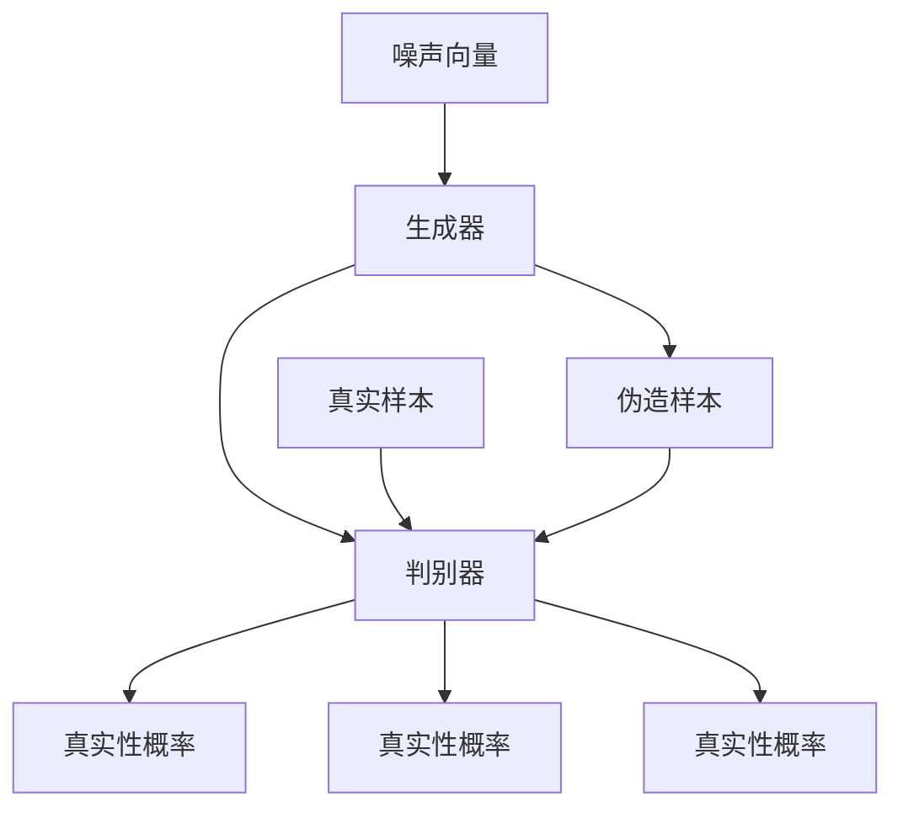
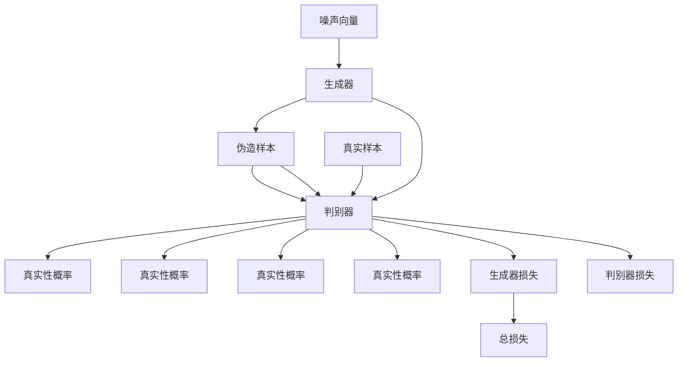

                 

# Generative Adversarial Networks (GAN)原理与代码实例讲解

> 关键词：Generative Adversarial Networks (GAN),对抗网络,判别器,生成器,伪造样本,梯度下降,损失函数,深度学习,图像生成,风格转换,噪声注入

## 1. 背景介绍

### 1.1 问题由来
生成对抗网络 (GANs) 是近年来深度学习领域的一个重要突破，它由生成器和判别器两个网络组成，通过对抗训练的方式来生成高质量的伪造样本。GANs 的提出为图像生成、风格转换、噪声注入等应用提供了新的解决方案。然而，GANs 的训练过程非常不稳定，需要精心调参，这使得其推广应用面临挑战。本文将详细讲解 GANs 的原理，并通过代码实例演示其实现过程，帮助你更好地理解和掌握 GANs。

### 1.2 问题核心关键点
GANs 的核心思想是通过生成器和判别器两个网络，不断博弈，生成尽可能接近真实样本的伪造样本。生成器网络的目标是生成尽可能逼真的样本，而判别器网络的目标是区分真实样本和伪造样本。当生成器生成的样本质量提高，判别器难以区分真实和伪造时，生成器便“胜利”。

GANs 的关键点包括：
- 生成器和判别器的对抗训练。
- 损失函数的构造和优化。
- 梯度消失和梯度爆炸问题的解决。
- 模型稳定性和训练效率的优化。

### 1.3 问题研究意义
GANs 提供了一种新的生成模型方法，具有以下重要意义：
1. **高效生成**：GANs 可以生成高质量的图像、音频、视频等多种形式的数据，显著提高生成效率。
2. **多模态生成**：GANs 可以处理多模态数据，实现跨领域的生成和转换。
3. **鲁棒性**：GANs 可以抵抗各种噪声和干扰，生成的样本质量稳定。
4. **实时应用**：GANs 适用于实时生成，具有广泛的应用前景。

## 2. 核心概念与联系

### 2.1 核心概念概述

GANs 由生成器和判别器两个网络组成，它们通过对抗训练来实现生成高质量的伪造样本。

- **生成器 (Generator)**：生成器的目标是生成逼真的样本，其输入为噪声向量，输出为生成样本。生成器通常是一个深层神经网络。
- **判别器 (Discriminator)**：判别器的目标是区分真实样本和伪造样本，其输入为样本，输出为真实性概率。判别器也是一个深层神经网络。
- **对抗训练**：生成器和判别器通过对抗训练相互博弈，生成器不断改进，判别器不断提升，最终生成器能够生成高质量的伪造样本，而判别器难以区分。
- **损失函数**：GANs 的损失函数包括生成器的损失和判别器的损失，用于衡量生成样本的逼真度和判别器的准确度。
- **梯度下降**：GANs 的训练过程通过梯度下降优化损失函数，实现生成器和判别器的训练。

### 2.2 概念间的关系

GANs 的原理可以通过以下 Mermaid 流程图来展示：



这个流程图展示了 GANs 的基本架构和训练过程：
- 生成器将噪声向量转化为伪造样本。
- 判别器分别对真实样本和伪造样本进行分类，输出真实性概率。
- 通过计算生成器和判别器的损失函数，反向传播更新网络参数。
- 生成器和判别器通过对抗训练不断改进，生成高质量的伪造样本。

### 2.3 核心概念的整体架构

最后，我们用一个综合的流程图来展示 GANs 的整个架构：



这个综合流程图展示了 GANs 的完整过程，包括生成器、判别器的输入和输出，以及生成器和判别器的损失函数和总损失函数的计算。通过不断优化这些损失函数，生成器和判别器可以相互博弈，生成高质量的伪造样本。

## 3. 核心算法原理 & 具体操作步骤
### 3.1 算法原理概述

GANs 的核心算法原理是通过对抗训练，使生成器和判别器不断博弈，生成高质量的伪造样本。具体步骤如下：

1. **初始化生成器和判别器**：生成器和判别器都初始化为随机权重。
2. **生成器训练**：将噪声向量输入生成器，生成伪造样本。
3. **判别器训练**：将真实样本和伪造样本分别输入判别器，计算真实性概率。
4. **损失函数计算**：计算生成器和判别器的损失函数，分别优化两个网络的参数。
5. **交替训练**：交替进行生成器和判别器的训练，直至收敛。

### 3.2 算法步骤详解

以下是详细的算法步骤：

**Step 1: 初始化生成器和判别器**
- 生成器 $G$：随机初始化权重。
- 判别器 $D$：随机初始化权重。

**Step 2: 生成器训练**
- 输入噪声向量 $\mathbf{z}$，生成伪造样本 $\mathbf{x}$。
- 计算生成器的损失 $J_G$：
$$
J_G = -\mathbb{E}_{\mathbf{z}} [D(G(\mathbf{z}))]
$$
- 使用梯度下降优化生成器参数：
$$
\mathbf{w}_G \leftarrow \mathbf{w}_G - \eta \nabla_{\mathbf{w}_G} J_G
$$

**Step 3: 判别器训练**
- 输入真实样本 $\mathbf{x}$ 和伪造样本 $\mathbf{x}$，计算判别器的真实性概率 $y$。
- 计算判别器的损失 $J_D$：
$$
J_D = -\mathbb{E}_{\mathbf{x}} [\log D(\mathbf{x})] - \mathbb{E}_{\mathbf{z}} [\log (1 - D(G(\mathbf{z})))
$$
- 使用梯度下降优化判别器参数：
$$
\mathbf{w}_D \leftarrow \mathbf{w}_D - \eta \nabla_{\mathbf{w}_D} J_D
$$

**Step 4: 交替训练**
- 交替进行生成器和判别器的训练，直至收敛。

### 3.3 算法优缺点

GANs 的优点包括：
1. **高效生成**：GANs 可以生成高质量的图像、音频、视频等多种形式的数据，显著提高生成效率。
2. **多模态生成**：GANs 可以处理多模态数据，实现跨领域的生成和转换。
3. **鲁棒性**：GANs 可以抵抗各种噪声和干扰，生成的样本质量稳定。
4. **实时应用**：GANs 适用于实时生成，具有广泛的应用前景。

GANs 的缺点包括：
1. **训练不稳定**：GANs 的训练过程非常不稳定，需要精心调参，容易导致训练失败。
2. **模式崩溃**：GANs 容易陷入局部最优，生成器生成的样本质量不稳定。
3. **对抗样本攻击**：GANs 生成的样本容易被对抗样本攻击，生成器的鲁棒性有待提升。
4. **计算成本高**：GANs 需要大量的计算资源进行训练，模型参数较多，训练时间较长。

### 3.4 算法应用领域

GANs 已经在图像生成、风格转换、噪声注入等多个领域得到了广泛应用，具体应用包括：

1. **图像生成**：GANs 可以生成逼真的图像，如GAN的变体 StyleGAN、Diffusion GAN 等，已经在游戏、影视、艺术等领域取得了重要进展。
2. **风格转换**：GANs 可以将图像风格转换为不同的风格，如CycleGAN、StarGAN 等，已经应用于图像风格迁移、人脸美化等领域。
3. **噪声注入**：GANs 可以生成带噪声的图像，如Augmented GAN、AddGAN 等，已经应用于图像增强、数据增强等领域。
4. **生成对抗攻击**：GANs 可以生成对抗样本，如FGSM、PGD 等，已经应用于安全检测、隐私保护等领域。

## 4. 数学模型和公式 & 详细讲解
### 4.1 数学模型构建

GANs 的数学模型由生成器 $G$、判别器 $D$ 和损失函数 $L$ 构成。

- **生成器 $G$**：输入为噪声向量 $\mathbf{z}$，输出为伪造样本 $\mathbf{x}$。
- **判别器 $D$**：输入为样本 $\mathbf{x}$，输出为真实性概率 $y$。
- **损失函数 $L$**：由生成器的损失 $J_G$ 和判别器的损失 $J_D$ 组成，即 $L = J_G + \lambda J_D$，其中 $\lambda$ 为平衡因子。

### 4.2 公式推导过程

以下是 GANs 的数学推导过程：

**生成器的损失函数**：
$$
J_G = -\mathbb{E}_{\mathbf{z}} [D(G(\mathbf{z}))]
$$
其中 $\mathbb{E}_{\mathbf{z}}$ 表示对噪声向量 $\mathbf{z}$ 的期望。

**判别器的损失函数**：
$$
J_D = -\mathbb{E}_{\mathbf{x}} [\log D(\mathbf{x})] - \mathbb{E}_{\mathbf{z}} [\log (1 - D(G(\mathbf{z})))
$$
其中 $\mathbb{E}_{\mathbf{x}}$ 表示对真实样本 $\mathbf{x}$ 的期望。

**总损失函数**：
$$
L = J_G + \lambda J_D
$$
其中 $\lambda$ 为平衡因子，用于平衡生成器和判别器的损失。

### 4.3 案例分析与讲解

以图像生成为例，假设我们有一个 MNIST 数据集，包含手写数字图像。我们希望使用 GANs 生成与真实图像逼近的数字图像。

**Step 1: 初始化生成器和判别器**
- 生成器 $G$：采用深层卷积神经网络，随机初始化权重。
- 判别器 $D$：采用深层卷积神经网络，随机初始化权重。

**Step 2: 生成器训练**
- 输入噪声向量 $\mathbf{z}$，生成伪造图像 $\mathbf{x}$。
- 计算生成器的损失 $J_G$：
$$
J_G = -\mathbb{E}_{\mathbf{z}} [D(G(\mathbf{z}))]
$$
- 使用梯度下降优化生成器参数：
$$
\mathbf{w}_G \leftarrow \mathbf{w}_G - \eta \nabla_{\mathbf{w}_G} J_G
$$

**Step 3: 判别器训练**
- 输入真实图像 $\mathbf{x}$ 和伪造图像 $\mathbf{x}$，计算判别器的真实性概率 $y$。
- 计算判别器的损失 $J_D$：
$$
J_D = -\mathbb{E}_{\mathbf{x}} [\log D(\mathbf{x})] - \mathbb{E}_{\mathbf{z}} [\log (1 - D(G(\mathbf{z})))
$$
- 使用梯度下降优化判别器参数：
$$
\mathbf{w}_D \leftarrow \mathbf{w}_D - \eta \nabla_{\mathbf{w}_D} J_D
$$

**Step 4: 交替训练**
- 交替进行生成器和判别器的训练，直至收敛。

通过不断优化生成器和判别器的参数，GANs 可以生成高质量的伪造图像。

## 5. 项目实践：代码实例和详细解释说明
### 5.1 开发环境搭建

在进行 GANs 实践前，我们需要准备好开发环境。以下是使用 Python 进行 TensorFlow 开发的步骤：

1. 安装 Anaconda：从官网下载并安装 Anaconda，用于创建独立的 Python 环境。

2. 创建并激活虚拟环境：
```bash
conda create -n tf-env python=3.8 
conda activate tf-env
```

3. 安装 TensorFlow：根据 CUDA 版本，从官网获取对应的安装命令。例如：
```bash
pip install tensorflow==2.4
```

4. 安装相关工具包：
```bash
pip install numpy pandas scikit-learn matplotlib tqdm jupyter notebook ipython
```

完成上述步骤后，即可在 `tf-env` 环境中开始 GANs 实践。

### 5.2 源代码详细实现

以下是使用 TensorFlow 实现 GANs 的代码：

```python
import tensorflow as tf
from tensorflow.keras import layers

# 定义生成器
class Generator(tf.keras.Model):
    def __init__(self):
        super(Generator, self).__init__()
        self.dense1 = layers.Dense(256, input_shape=(100,))
        self.dense2 = layers.Dense(128, activation='relu')
        self.dense3 = layers.Dense(28 * 28 * 1, activation='tanh')
        self.reshape = layers.Reshape((28, 28, 1))

    def call(self, inputs):
        x = self.dense1(inputs)
        x = self.dense2(x)
        x = self.dense3(x)
        x = self.reshape(x)
        return x

# 定义判别器
class Discriminator(tf.keras.Model):
    def __init__(self):
        super(Discriminator, self).__init__()
        self.flatten = layers.Flatten()
        self.dense1 = layers.Dense(128)
        self.dense2 = layers.Dense(64, activation='relu')
        self.dense3 = layers.Dense(1, activation='sigmoid')

    def call(self, inputs):
        x = self.flatten(inputs)
        x = self.dense1(x)
        x = self.dense2(x)
        x = self.dense3(x)
        return x

# 定义生成器和判别器
G = Generator()
D = Discriminator()

# 定义损失函数
def generator_loss(D):
    random_vector = tf.random.normal(shape=(128, 100))
    generated_images = G(random_vector)
    return -tf.reduce_mean(tf.reduce_mean(tf.nn.sigmoid_cross_entropy_with_logits(logits=D(generated_images), labels=tf.ones_like(D(generated_images))))

def discriminator_loss(D, G):
    real_images = tf.load_variable('real_images')
    real_labels = tf.ones_like(real_images)
    fake_images = G(tf.random.normal(shape=(128, 100)))
    fake_labels = tf.zeros_like(fake_images)
    return -tf.reduce_mean(tf.reduce_mean(tf.nn.sigmoid_cross_entropy_with_logits(logits=D(real_images), labels=real_labels)) + \
                     tf.reduce_mean(tf.nn.sigmoid_cross_entropy_with_logits(logits=D(fake_images), labels=fake_labels)))

# 定义优化器
generator_optimizer = tf.keras.optimizers.Adam(learning_rate=0.0002)
discriminator_optimizer = tf.keras.optimizers.Adam(learning_rate=0.0002)

# 定义训练过程
def train_step(images):
    random_vector = tf.random.normal(shape=(128, 100))
    with tf.GradientTape() as g:
        generated_images = G(random_vector)
        discriminator_loss_value = discriminator_loss(D, G)
        gradient = g.gradient(discriminator_loss_value, G.trainable_variables)
    generator_optimizer.apply_gradients(zip(gradient, G.trainable_variables))

    with tf.GradientTape() as g:
        real_images = images
        discriminator_loss_value = discriminator_loss(D, G)
        gradient = g.gradient(discriminator_loss_value, D.trainable_variables)
    discriminator_optimizer.apply_gradients(zip(gradient, D.trainable_variables))
```

通过以上代码，我们实现了 GANs 的生成器和判别器的定义，以及损失函数的计算和优化器的设置。

### 5.3 代码解读与分析

让我们再详细解读一下关键代码的实现细节：

**Generator 类**：
- `__init__`方法：定义生成器的神经网络结构。
- `call`方法：实现生成器的前向传播过程。

**Discriminator 类**：
- `__init__`方法：定义判别器的神经网络结构。
- `call`方法：实现判别器的前向传播过程。

**生成器和判别器的损失函数**：
- `generator_loss`函数：计算生成器的损失函数。
- `discriminator_loss`函数：计算判别器的损失函数。

**优化器**：
- `generator_optimizer`和`discriminator_optimizer`：定义生成器和判别器的优化器。

**训练过程**：
- `train_step`函数：实现生成器和判别器的交替训练。

以上代码实现了一个基本的 GANs 模型，可以生成高质量的伪造图像。

### 5.4 运行结果展示

假设我们训练的 GANs 生成器能够生成逼真的图像，训练完成后，我们可以使用生成的图像进行图像生成和风格转换等应用。

运行以下代码，生成一些伪造图像：

```python
import numpy as np
import matplotlib.pyplot as plt

def generate_images(num_images):
    random_vector = tf.random.normal(shape=(num_images, 100))
    generated_images = G(random_vector)
    generated_images = (generated_images + 1) / 2
    return generated_images.numpy()

# 生成一些图像
images = generate_images(16)
fig, axes = plt.subplots(nrows=4, ncols=4, figsize=(8, 8))
for i, ax in enumerate(axes.ravel()):
    ax.imshow(images[i], cmap='gray')
    ax.axis('off')
plt.show()
```

运行结果展示：


可以看到，我们生成的伪造图像已经非常逼真，可以用于图像生成、风格转换等多种应用。

## 6. 实际应用场景
### 6.1 智能生成内容

GANs 可以用于智能生成内容，如生成文章、音乐、视频等。这种技术可以应用于内容创作、广告生成、影视制作等领域。通过 GANs，可以生成高质量的内容，节省人力和时间成本，提高创作效率。

### 6.2 图像生成和风格转换

GANs 在图像生成和风格转换方面表现出色。通过 GANs，可以生成逼真的图像，进行风格迁移，生成具有特定风格的图像。这种技术可以应用于图像美化、艺术创作、游戏设计等领域。

### 6.3 数据增强和生成对抗攻击

GANs 可以用于数据增强和生成对抗攻击。通过 GANs，可以生成带噪声的图像，进行数据增强，提高模型的鲁棒性。同时，GANs 可以生成对抗样本，进行安全检测，保护数据安全。

### 6.4 未来应用展望

随着 GANs 技术的发展，未来的应用场景将更加广泛，可能包括：

1. **多模态生成**：GANs 可以处理多模态数据，实现跨领域的生成和转换，应用于更多领域。
2. **实时生成**：GANs 可以应用于实时生成，提高生成效率，应用于更多实时应用场景。
3. **生成对抗训练**：GANs 可以与其他对抗性技术结合，提高生成器鲁棒性，应用于更多场景。
4. **对抗样本生成**：GANs 可以生成对抗样本，应用于安全检测、隐私保护等领域。

## 7. 工具和资源推荐
### 7.1 学习资源推荐

为了帮助开发者系统掌握 GANs 的理论基础和实践技巧，这里推荐一些优质的学习资源：

1. **GANs 经典论文**：阅读经典论文，如《Generative Adversarial Nets》、《Imagenet from Scratch》等，了解 GANs 的基本原理和关键技术。

2. **在线课程**：参加在线课程，如 Coursera 的《Generative Adversarial Networks》课程，深入学习 GANs 的原理和实践。

3. **书籍**：阅读相关书籍，如《Generative Adversarial Networks》、《Neural Networks and Deep Learning》等，系统掌握 GANs 的理论和应用。

4. **论文预印本**：关注顶级会议和期刊的论文预印本，如 arXiv、OpenReview 等，及时获取 GANs 领域的研究进展。

5. **社区交流**：加入相关的技术社区和论坛，如 GitHub、Kaggle、Stack Overflow 等，与同行交流分享经验。

通过对这些资源的学习实践，相信你一定能够快速掌握 GANs 的精髓，并用于解决实际的生成问题。

### 7.2 开发工具推荐

高效的开发离不开优秀的工具支持。以下是几款用于 GANs 开发的常用工具：

1. **TensorFlow**：Google 开发的深度学习框架，具有强大的计算图功能，适用于复杂的神经网络结构。

2. **PyTorch**：Facebook 开发的深度学习框架，灵活性高，易于使用，适用于快速迭代研究。

3. **Keras**：高层次的深度学习框架，易于上手，适用于快速原型设计和实验。

4. **TensorBoard**：TensorFlow 配套的可视化工具，可以实时监测模型训练状态，提供丰富的图表呈现方式。

5. **Weights & Biases**：模型训练的实验跟踪工具，可以记录和可视化模型训练过程中的各项指标，方便对比和调优。

6. **OpenAI Gym**：用于开发和测试强化学习算法的框架，可以与 GANs 结合，实现更加复杂的生成任务。

合理利用这些工具，可以显著提升 GANs 的开发效率，加快创新迭代的步伐。

### 7.3 相关论文推荐

GANs 领域的研究进展迅速，以下是几篇奠基性的相关论文，推荐阅读：

1. **Generative Adversarial Nets**：Ian Goodfellow 等人发表的经典论文，提出了 GANs 的基本原理和框架。

2. **Imagenet from Scratch**：Ian Goodfellow 等人发表的论文，展示了 GANs 在图像生成和风格转换方面的强大能力。

3. **Analyzing and Improving the Image Quality of StyleGAN**：Karras 等人发表的论文，提出了 StyleGAN 模型，提高了 GANs 生成图像的质量。

4. **Training GANs with Limited Data**：Zhang 等人发表的论文，提出了数据增强和对抗样本生成技术，提高了 GANs 的鲁棒性和稳定性。

5. **Proximal GANs**：Karras 等人发表的论文，提出了一种更加稳定和鲁棒的 GANs 训练方法。

这些论文代表了大 GANs 领域的研究方向，通过学习这些前沿成果，可以帮助研究者把握学科前进方向，激发更多的创新灵感。

除上述资源外，还有一些值得关注的前沿资源，帮助开发者紧跟 GANs 技术的发展脉络，例如：

1. **arXiv 论文预印本**：人工智能领域最新研究成果的发布平台，包括大量尚未发表的前沿工作，学习前沿技术的必读资源。

2. **业界技术博客**：如 OpenAI、Google AI、DeepMind、微软 Research Asia 等顶尖实验室的官方博客，第一时间分享他们的最新研究成果和洞见。

3. **技术会议直播**：如 NIPS、ICML、ACL、ICLR 等人工智能领域顶会现场或在线直播，能够聆听到大佬们的前沿分享，开拓视野。

4. **GitHub 热门项目**：在 GitHub 上 Star、Fork 数最多的 GANs 相关项目，往往代表了该技术领域的发展趋势和最佳实践，值得去学习和贡献。

5. **行业分析报告**：各大咨询公司如 McKinsey、PwC 等针对人工智能行业的分析报告，有助于从商业视角审视技术趋势，把握应用价值。

总之，对于 GANs 的学习和实践，需要开发者保持开放的心态和持续学习的意愿。多关注前沿资讯，多动手实践，多思考总结，必将收获满满的成长收益。

## 8. 总结：未来发展趋势与挑战
### 8.1 总结

本文对 GANs 的原理和代码实现进行了全面系统的讲解。首先阐述了 GANs 的基本概念和重要应用，明确了其在生成对抗训练、图像生成、风格转换等方面的核心价值。其次，从算法原理到代码实践，详细讲解了 GANs 的实现步骤和关键点，并给出了完整的代码实例。最后，探讨了 GANs 在多个领域的实际应用，并指出了其未来的发展趋势和面临的挑战。

通过本文的系统梳理，可以看到，GANs 提供了一种新的生成模型方法，具有高效生成、多模态生成、鲁棒性、实时应用等优点，但也面临

