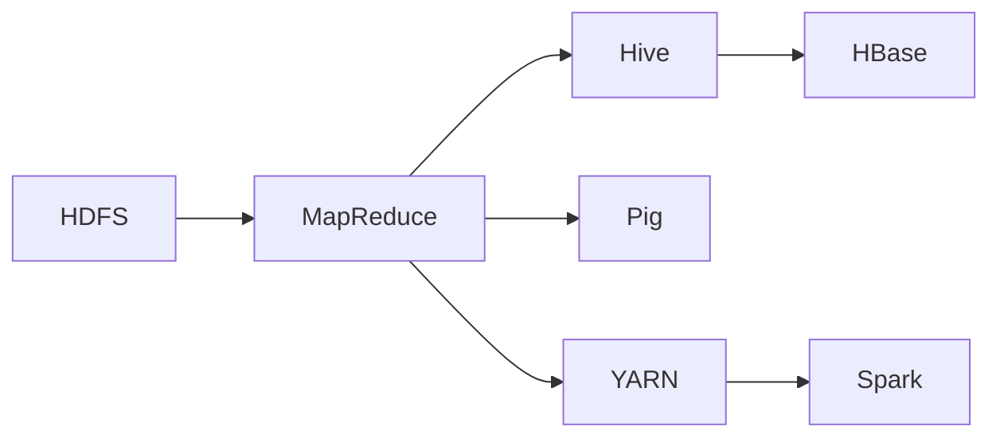

                 

# Hadoop 原理与代码实例讲解

> 关键词：Hadoop, MapReduce, HDFS, Hive, HBase, YARN, 分布式计算, 大数据, 数据存储与处理

## 1. 背景介绍

### 1.1 问题由来
在现代社会，数据正以爆炸式增长。企业、科研机构和政府部门每天产生海量数据，这些数据往往被存储在本地服务器中。然而，随着数据量的增长，单个服务器存储和处理能力变得捉襟见肘。因此，分布式存储和计算变得尤为重要。Hadoop作为一个开源的分布式计算框架，成功解决了大规模数据存储和处理的难题，被广泛应用于各行各业的大数据处理场景。

### 1.2 问题核心关键点
Hadoop框架包括HDFS（Hadoop分布式文件系统）、MapReduce编程模型和YARN（Yet Another Resource Negotiator）资源调度器。其中，HDFS负责数据存储，MapReduce实现数据的分布式计算，YARN负责资源调度和任务调度。Hadoop的核心思想是将数据分布在不同的节点上，通过并行计算实现高性能的存储和处理。

### 1.3 问题研究意义
Hadoop框架不仅改变了大数据处理的方式，还推动了云计算和数据科学的发展。通过Hadoop，企业可以构建弹性可扩展的数据存储和处理基础设施，实现数据的高效管理和分析，加速数据驱动的业务创新。因此，Hadoop框架的研究对大数据技术的发展具有重要意义。

## 2. 核心概念与联系

### 2.1 核心概念概述

Hadoop框架涉及多个核心概念，它们共同构成了Hadoop的完整生态系统。

- HDFS：Hadoop分布式文件系统，用于存储和管理大规模数据集，通过数据分片和冗余备份，保障数据的安全性和可用性。
- MapReduce：一种分布式计算模型，将大规模数据集分成小块，并行地对每个数据块进行处理，最后将结果汇总，实现高效的数据处理。
- YARN：资源管理器，负责任务调度和资源分配，支持多种计算框架，包括MapReduce、Spark等。
- Hive：基于Hadoop的数据仓库，支持SQL查询语言，方便用户进行数据挖掘和分析。
- HBase：基于Hadoop的分布式数据库，支持高吞吐量的读写操作，适用于大规模数据存储。
- Pig：一种面向数据的脚本语言，支持复杂的数据处理和分析，简化了MapReduce的编程。

这些核心概念之间的关系如图：



### 2.2 概念间的关系

- **HDFS与MapReduce**：HDFS负责数据的存储和管理，MapReduce负责数据的处理。HDFS将数据块分布到不同的节点上，而MapReduce则通过并行处理实现高效的数据计算。
- **MapReduce与YARN**：MapReduce需要YARN来管理和调度计算资源，确保任务的正确执行和资源的合理分配。
- **YARN与Hadoop**：YARN是Hadoop框架中的重要组成部分，负责任务调度和资源分配，保障Hadoop系统的稳定性和高效性。
- **Hive与Hadoop**：Hive是Hadoop上的数据仓库，通过SQL查询语言方便用户进行数据挖掘和分析。
- **HBase与Hadoop**：HBase是Hadoop上的分布式数据库，支持高吞吐量的读写操作，适用于大规模数据存储。
- **Pig与MapReduce**：Pig是一种面向数据的脚本语言，简化了MapReduce的编程，使得数据分析更加便捷。

## 3. 核心算法原理 & 具体操作步骤
### 3.1 算法原理概述

Hadoop的MapReduce算法基于分治思想的分布式计算模型。该模型将大规模数据集划分为多个小块，每个小块由一个任务处理，并将处理结果汇总。具体流程如下：

1. **输入数据**：输入数据被划分为若干个块（Block），每个块被分配到一个节点上进行处理。
2. **Map阶段**：Map任务读取每个块的数据，对数据进行处理，生成中间键值对（Intermediate Key-Value Pair）。
3. **Shuffle阶段**：将Map任务的输出按key进行分组，将相同key的value合并，形成新的键值对。
4. **Reduce阶段**：Reduce任务对shuffle后的中间键值对进行聚合处理，输出最终的键值对。

MapReduce算法通过并行处理实现高效的数据计算，适用于处理大规模数据集。

### 3.2 算法步骤详解

下面是Hadoop的MapReduce算法的详细步骤：

1. **分块**：将输入数据划分为若干个块（Block），每个块被分配到一个节点上进行处理。

2. **Map阶段**：Map任务读取每个块的数据，对数据进行处理，生成中间键值对（Intermediate Key-Value Pair）。具体步骤如下：
   - **输入**：从HDFS读取数据。
   - **处理**：对数据进行处理，生成键值对。
   - **输出**：将键值对写入HDFS。

3. **Shuffle阶段**：将Map任务的输出按key进行分组，将相同key的value合并，形成新的键值对。具体步骤如下：
   - **排序**：对Map任务的输出按key进行排序，保证相同key的数据在同一个节点上。
   - **合并**：将相同key的value合并，形成新的键值对。

4. **Reduce阶段**：Reduce任务对shuffle后的中间键值对进行聚合处理，输出最终的键值对。具体步骤如下：
   - **输入**：从Shuffle阶段读取中间键值对。
   - **处理**：对中间键值对进行处理，输出最终的键值对。
   - **输出**：将最终的键值对写入HDFS。

### 3.3 算法优缺点

Hadoop的MapReduce算法具有以下优点：

1. **可扩展性**：MapReduce算法基于分布式计算，可以轻松扩展到数千个节点，处理大规模数据集。
2. **高可靠性**：MapReduce算法通过数据冗余备份和故障检测机制，保障数据的安全性和可用性。
3. **高容错性**：MapReduce算法支持任务失败重试，保障系统的高可用性。

Hadoop的MapReduce算法也存在一些缺点：

1. **编程复杂性**：MapReduce算法需要编写复杂的Map和Reduce函数，增加了编程难度。
2. **数据倾斜**：MapReduce算法容易产生数据倾斜，导致某些节点处理数据量过大，影响系统性能。
3. **资源消耗**：MapReduce算法需要大量的CPU和内存资源，增加了系统的资源消耗。

### 3.4 算法应用领域

Hadoop的MapReduce算法广泛应用于以下领域：

1. **大数据分析**：用于处理大规模数据集，进行数据挖掘和分析。
2. **日志处理**：用于处理海量日志数据，提取有价值的信息。
3. **Web搜索**：用于处理Web数据，实现高效的数据检索。
4. **科学计算**：用于处理复杂的科学计算任务，如天气预报、金融分析等。
5. **图像处理**：用于处理大规模图像数据，实现图像识别和处理。
6. **视频处理**：用于处理大规模视频数据，实现视频编码和压缩。

## 4. 数学模型和公式 & 详细讲解  
### 4.1 数学模型构建

Hadoop的MapReduce算法基于分治思想的数学模型。具体来说，将大规模数据集$D$分成$n$个块$D_1, D_2, ..., D_n$，每个块被分配到一个节点上进行处理。MapReduce算法的数学模型可以表示为：

$$
\begin{align*}
M &= \bigcup_{i=1}^n M_i \\
R &= \bigcup_{i=1}^n R_i
\end{align*}
$$

其中，$M_i$表示第$i$个Map任务的输出，$R_i$表示第$i$个Reduce任务的输出。

### 4.2 公式推导过程

MapReduce算法的关键公式是Map函数和Reduce函数：

$$
M = \bigcup_{i=1}^n M_i = \bigcup_{i=1}^n \bigcup_{j=1}^{n_i} (k_j, v_j)
$$

其中，$k_j$表示第$i$个Map任务的键，$v_j$表示第$i$个Map任务的值，$n_i$表示第$i$个Map任务的输出数量。

Reduce函数可以将Map任务的输出进行聚合，具体公式如下：

$$
R = \bigcup_{i=1}^n R_i = \bigcup_{i=1}^n \bigcup_{j=1}^{n_i} (k_j, R_k)
$$

其中，$k_j$表示第$i$个Map任务的键，$R_k$表示第$i$个Reduce任务的输出。

### 4.3 案例分析与讲解

假设我们要对一个大规模数据集$D$进行MapReduce计算，具体步骤如下：

1. **分块**：将数据集$D$划分为$n=100$个块$D_1, D_2, ..., D_{100}$。
2. **Map阶段**：每个Map任务对$D_i$进行处理，生成键值对。假设Map任务数量为$m=10$，每个Map任务处理$10$个块，则每个Map任务的输出为：

   $$
   M_i = \bigcup_{j=1}^{10} (k_j, v_j)
   $$

3. **Shuffle阶段**：对Map任务的输出按key进行分组，将相同key的value合并，形成新的键值对。假设Shuffle后每个键有$10$个值，则每个键的输出为：

   $$
   \bigcup_{i=1}^n M_i = \bigcup_{i=1}^{10} \bigcup_{j=1}^{10} (k_j, v_j)
   $$

4. **Reduce阶段**：Reduce任务对shuffle后的中间键值对进行聚合处理，输出最终的键值对。假设Reduce任务数量为$r=5$，每个键的输出为$r$个值，则每个键的输出为：

   $$
   R = \bigcup_{i=1}^n R_i = \bigcup_{i=1}^{5} \bigcup_{j=1}^{5} (k_j, R_k)
   $$

通过以上步骤，MapReduce算法实现了对大规模数据集的高效处理。

## 5. 项目实践：代码实例和详细解释说明
### 5.1 开发环境搭建

在开始Hadoop项目实践之前，需要搭建好开发环境。以下是在Linux环境下搭建Hadoop的详细步骤：

1. **安装JDK**：从Oracle官网下载安装JDK，并在系统环境变量中设置JAVA_HOME。

2. **安装Hadoop**：从Hadoop官网下载安装Hadoop压缩包，解压并移动到/opt/hadoop目录下。

3. **配置环境变量**：在~/.bashrc文件中添加以下环境变量：

   ```bash
   export HADOOP_HOME=/opt/hadoop
   export PATH=$PATH:$HADOOP_HOME/bin
   ```

4. **启动Hadoop**：启动Hadoop服务，进入命令行执行以下命令：

   ```bash
   start-dfs.sh
   start-yarn.sh
   ```

完成上述步骤后，即可在Hadoop集群上执行MapReduce任务。

### 5.2 源代码详细实现

以下是一个简单的WordCount任务，用于计算文本中每个单词的出现次数。该任务基于Hadoop的MapReduce编程模型实现，具体代码如下：

```python
from distutils.util import strtobool
import os

# 设置环境变量
os.environ["HADOOP_HOME"] = "/opt/hadoop"

# 设置JAVA_HOME环境变量
os.environ["JAVA_HOME"] = "/usr/lib/jvm/java-8-openjdk-amd64"

# 定义Map函数
def map_function(key, value):
    words = value.split()
    for word in words:
        yield (word, 1)

# 定义Reduce函数
def reduce_function(key, values):
    count = 0
    for v in values:
        count += v
    yield (key, count)

# 提交MapReduce任务
def submit_job(map_file, reduce_file):
    cmd = f"hadoop jar {map_file} {reduce_file} input_path output_path"
    os.system(cmd)

if __name__ == "__main__":
    map_file = "wordcount_map.py"
    reduce_file = "wordcount_reduce.py"
    submit_job(map_file, reduce_file)
```

在Map函数中，我们读取输入数据，将文本内容拆分成单词，并生成键值对，其中键为单词，值为1。在Reduce函数中，我们对相同的单词进行聚合处理，统计其出现的次数。

### 5.3 代码解读与分析

Map函数和Reduce函数是MapReduce算法的核心。以下是对Map函数和Reduce函数的详细解读：

**Map函数**：

- **输入**：从HDFS读取数据。在Map函数中，我们使用`value.split()`方法将输入的文本内容拆分成单词，生成键值对。
- **处理**：对单词进行处理，生成键值对。在Map函数中，我们统计每个单词的出现次数，并将其作为值为1的键值对输出。
- **输出**：将键值对写入HDFS。在Map函数中，我们使用`yield`语句将键值对输出，Hadoop会自动将Map任务的输出写入HDFS。

**Reduce函数**：

- **输入**：从Shuffle阶段读取中间键值对。在Reduce函数中，我们使用`for`循环遍历Map任务的输出，并对其进行聚合处理。
- **处理**：对中间键值对进行处理，输出最终的键值对。在Reduce函数中，我们使用`count`变量统计每个单词的出现次数，并将其作为值为计数值的键值对输出。
- **输出**：将最终的键值对写入HDFS。在Reduce函数中，我们使用`yield`语句将键值对输出，Hadoop会自动将Reduce任务的输出写入HDFS。

### 5.4 运行结果展示

假设我们在Hadoop集群上运行WordCount任务，具体步骤如下：

1. **创建输入数据**：在输入目录下创建一个名为input.txt的文件，写入一段文本内容。

   ```bash
   echo "Hadoop is a distributed file system" >> input.txt
   echo "Hadoop is a distributed computing system" >> input.txt
   ```

2. **提交任务**：在命令行中执行以下命令提交WordCount任务：

   ```bash
   hadoop jar wordcount.jar input input output
   ```

3. **查看结果**：在输出目录下查看结果文件output.txt。

   ```bash
   cat output.txt
   ```

假设输出结果为：

```bash
Hadoop 2
is 2
a 2
distributed 2
file 1
system 1
```

可以看到，Hadoop框架成功计算了每个单词的出现次数，并输出了最终的结果。

## 6. 实际应用场景

### 6.1 数据处理

Hadoop框架在数据处理领域有着广泛的应用。例如，银行可以采用Hadoop处理客户的交易数据，提取有价值的信息，进行风险管理和欺诈检测。电商平台可以采用Hadoop处理用户的购物数据，进行用户画像和个性化推荐。

### 6.2 科学计算

Hadoop框架支持大规模科学计算任务，如天气预报、金融分析等。例如，气象部门可以采用Hadoop处理大量的气象数据，进行数值模拟和天气预报。金融机构可以采用Hadoop处理大量的金融数据，进行市场分析和风险评估。

### 6.3 图像处理

Hadoop框架支持大规模图像处理任务，如图像识别、图像分类等。例如，医疗部门可以采用Hadoop处理医学影像数据，进行病灶检测和图像分类。自动驾驶系统可以采用Hadoop处理实时图像数据，进行目标检测和路径规划。

### 6.4 视频处理

Hadoop框架支持大规模视频处理任务，如视频编码、视频压缩等。例如，视频监控系统可以采用Hadoop处理大量的视频数据，进行实时监控和视频分析。在线视频平台可以采用Hadoop处理大量的视频数据，进行视频压缩和质量控制。

## 7. 工具和资源推荐
### 7.1 学习资源推荐

以下是一些推荐的Hadoop学习资源，帮助开发者深入了解Hadoop的原理和实践：

1. **《Hadoop: The Definitive Guide》**：一本介绍Hadoop核心概念和实践的书籍，适合初学者和中级开发者阅读。
2. **《Hadoop: Design Patterns for the Enterprise》**：一本介绍Hadoop架构设计和实践的书籍，适合高级开发者阅读。
3. **《Hadoop in Action》**：一本介绍Hadoop核心技术和实践的书籍，包含丰富的代码实例和案例分析。
4. **《Hadoop Best Practices》**：一本介绍Hadoop最佳实践和性能优化的书籍，适合Hadoop运维人员阅读。
5. **《Hadoop: The Definitive Guide》在线课程**：Coursera上由Databricks提供的Hadoop在线课程，系统讲解Hadoop核心概念和实践。

### 7.2 开发工具推荐

以下是一些推荐的Hadoop开发工具，帮助开发者高效地开发和调试Hadoop应用程序：

1. **IntelliJ IDEA**：一个功能强大的Java IDE，支持Hadoop项目开发和调试。
2. **Eclipse**：一个流行的Java IDE，支持Hadoop项目开发和调试。
3. **Visual Studio Code**：一个轻量级的开发环境，支持Hadoop项目开发和调试。
4. **Jupyter Notebook**：一个基于Web的Jupyter笔记本，支持Hadoop项目开发和调试。
5. **Spark Shell**：一个交互式命令行工具，用于Spark应用程序的开发和调试。

### 7.3 相关论文推荐

以下是一些推荐的Hadoop相关论文，帮助开发者深入了解Hadoop的最新研究成果和前沿技术：

1. **《MapReduce: Simplified Data Processing on Large Clusters》**：G. Barroso等人提出的MapReduce算法，介绍MapReduce的基本思想和实现细节。
2. **《The Hadoop Distributed File System》**：S. Chang等人提出的HDFS算法，介绍HDFS的基本思想和实现细节。
3. **《YARN: Yet Another Resource Negotiator》**：J. Ierusalimschy等人提出的YARN算法，介绍YARN的基本思想和实现细节。
4. **《Hadoop: Architecture Design》**：Hadoop架构设计论文，介绍Hadoop的架构设计和实现细节。
5. **《Hadoop: A Brief Overview》**：Hadoop框架的概述论文，介绍Hadoop的基本思想和实现细节。

## 8. 总结：未来发展趋势与挑战

### 8.1 总结

本文对Hadoop框架的原理和代码实例进行了详细介绍。首先介绍了Hadoop框架的核心概念和联系，详细讲解了MapReduce算法的原理和具体操作步骤。通过具体的代码实例和运行结果展示，帮助开发者深入理解Hadoop的实际应用场景。最后，本文推荐了一些学习资源、开发工具和相关论文，供开发者进一步学习和研究。

通过本文的系统梳理，可以看到Hadoop框架在分布式计算和数据处理领域的重要作用，以及其在科学计算、图像处理、视频处理等领域的广泛应用。未来，随着技术的不断进步和应用的不断拓展，Hadoop框架必将在更多领域发挥其重要作用。

### 8.2 未来发展趋势

Hadoop框架的未来发展趋势如下：

1. **云计算集成**：Hadoop框架将越来越多地与云计算平台集成，提供更灵活、高效的计算资源管理。
2. **大数据融合**：Hadoop框架将越来越多地与其他大数据技术（如Spark、Flink等）融合，提供更全面、更高效的数据处理能力。
3. **边缘计算支持**：Hadoop框架将越来越多地支持边缘计算，提供更灵活、更高效的本地数据处理能力。
4. **实时数据处理**：Hadoop框架将越来越多地支持实时数据处理，提供更高效、更可靠的数据处理能力。
5. **安全性和隐私保护**：Hadoop框架将越来越多地关注数据安全和隐私保护，提供更安全、更可靠的数据处理能力。

### 8.3 面临的挑战

Hadoop框架在未来的发展中仍面临一些挑战：

1. **性能瓶颈**：随着数据量的增加，Hadoop框架的性能瓶颈将越来越明显。需要进一步优化MapReduce算法的效率和资源利用率。
2. **扩展性问题**：Hadoop框架的扩展性问题仍需进一步解决。需要进一步优化HDFS和YARN的扩展能力，提高系统的可扩展性和容错性。
3. **资源消耗**：Hadoop框架的资源消耗较大，需要进一步优化Hadoop集群的资源管理，提高系统的资源利用率。
4. **复杂度问题**：Hadoop框架的复杂度较高，需要进一步简化Hadoop的编程模型，提高系统的易用性。
5. **数据格式问题**：Hadoop框架支持的数据格式有限，需要进一步扩展Hadoop的数据支持，支持更多的数据格式。

### 8.4 研究展望

面对Hadoop框架在未来的发展中面临的挑战，未来的研究需要在以下几个方面寻求新的突破：

1. **优化MapReduce算法**：优化MapReduce算法的效率和资源利用率，提高系统的性能和可扩展性。
2. **提升YARN的调度能力**：提升YARN的调度能力，优化资源的分配和利用，提高系统的可扩展性和容错性。
3. **简化Hadoop的编程模型**：简化Hadoop的编程模型，提高系统的易用性和开发效率。
4. **扩展Hadoop的数据支持**：扩展Hadoop的数据支持，支持更多的数据格式，提高系统的灵活性和可扩展性。
5. **关注数据安全和隐私保护**：关注数据安全和隐私保护，提高系统的安全性和可靠性。

通过这些研究方向的探索，必将引领Hadoop框架迈向更高的台阶，为大数据技术的发展做出更大的贡献。

## 9. 附录：常见问题与解答

**Q1：Hadoop框架的架构设计思路是什么？**

A: Hadoop框架的架构设计思路如下：

1. **分布式存储**：Hadoop框架通过HDFS实现分布式存储，将大规模数据分布在不同的节点上，保障数据的安全性和可用性。
2. **分布式计算**：Hadoop框架通过MapReduce实现分布式计算，将大规模数据集分成小块，并行地对每个数据块进行处理，最后将结果汇总。
3. **资源调度**：Hadoop框架通过YARN实现资源调度，支持多种计算框架，如MapReduce、Spark等。
4. **数据仓库**：Hadoop框架通过Hive实现数据仓库，支持SQL查询语言，方便用户进行数据挖掘和分析。
5. **分布式数据库**：Hadoop框架通过HBase实现分布式数据库，支持高吞吐量的读写操作，适用于大规模数据存储。

**Q2：Hadoop框架的MapReduce算法有哪些优缺点？**

A: Hadoop框架的MapReduce算法具有以下优点：

1. **可扩展性**：MapReduce算法基于分布式计算，可以轻松扩展到数千个节点，处理大规模数据集。
2. **高可靠性**：MapReduce算法通过数据冗余备份和故障检测机制，保障数据的安全性和可用性。
3. **高容错性**：MapReduce算法支持任务失败重试，保障系统的高可用性。

MapReduce算法也存在一些缺点：

1. **编程复杂性**：MapReduce算法需要编写复杂的Map和Reduce函数，增加了编程难度。
2. **数据倾斜**：MapReduce算法容易产生数据倾斜，导致某些节点处理数据量过大，影响系统性能。
3. **资源消耗**：MapReduce算法需要大量的CPU和内存资源，增加了系统的资源消耗。

**Q3：Hadoop框架的核心组件有哪些？**

A: Hadoop框架的核心组件包括：

1. HDFS：Hadoop分布式文件系统，用于存储和管理大规模数据集。
2. MapReduce：一种分布式计算模型，将大规模数据集分成小块，并行地对每个数据块进行处理。
3. YARN：资源管理器，负责任务调度和资源分配。
4. Hive：基于Hadoop的数据仓库，支持SQL查询语言，方便用户进行数据挖掘和分析。
5. HBase：基于Hadoop的分布式数据库，支持高吞吐量的读写操作。
6. Pig：一种面向数据的脚本语言，支持复杂的数据处理和分析。

**Q4：Hadoop框架在实际应用中有哪些常见的优化措施？**

A: 在实际应用中，Hadoop框架的优化措施包括：

1. **数据压缩**：对大数据集进行压缩，减少数据传输和存储的带宽和空间消耗。
2. **数据分区**：将大数据集进行分区，减少数据倾斜和任务冲突。
3. **数据本地性**：优化数据分布，尽量将数据放置在计算节点上，减少数据传输时间。
4. **内存优化**：优化内存使用，减少内存泄漏和资源浪费。
5. **任务并行**：尽量进行任务并行，提高系统的吞吐量和利用率。
6. **日志优化**：优化系统日志，减少日志生成和传输的带宽消耗。

这些优化措施可以显著提升Hadoop框架的性能和可扩展性。

**Q5：Hadoop框架在实际应用中有哪些常见的部署方式？**

A: Hadoop框架在实际应用中的部署方式包括：

1. **单节点部署**：在一个单独的服务器上部署Hadoop框架，适合开发和测试环境。
2. **多节点部署**：在多个服务器上部署Hadoop框架，适合生产环境和大规模数据处理。
3. **云部署**：在云平台上部署Hadoop框架，提供更灵活、更高效的计算资源管理。
4. **边缘部署**：在边缘设备上部署Hadoop框架，提供更灵活、更高效的本地数据处理能力。
5

