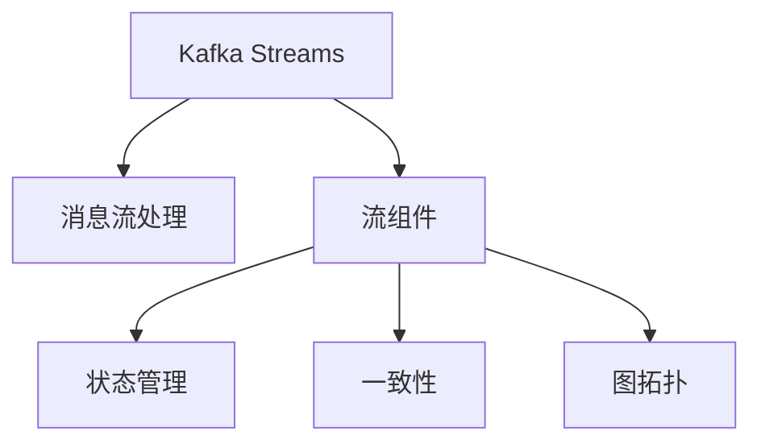

                 

# Kafka Streams原理与代码实例讲解

## 1. 背景介绍

随着数据量的爆炸式增长，传统的ETL（Extract, Transform, Load）模式已经难以满足实时数据处理的需求。在众多实时数据处理工具中，Kafka Streams脱颖而出，成为企业级数据处理的主流解决方案。Kafka Streams是一个基于Kafka的消息流处理框架，允许用户在Kafka集群上高效地处理实时数据流，支持高吞吐量、低延迟、可伸缩性等特性。

本文将详细讲解Kafka Streams的原理与核心算法，通过代码实例展示其实际应用，并探讨其在实际场景中的应用场景与挑战。

## 2. 核心概念与联系

### 2.1 核心概念概述

为更好地理解Kafka Streams，我们需要介绍以下几个关键概念：

- **Kafka**：Apache Kafka是一个分布式消息流平台，用于可靠地发布和订阅消息，可用于实时数据处理和流处理系统。

- **Kafka Streams**：基于Kafka的消息流处理框架，提供了一种在Kafka集群上高效地处理实时数据流的方法。

- **流式处理**：一种处理数据的模式，数据以流的形式从输入源流入，经由一系列转换操作，最终输出到存储或下游系统。

- **状态管理**：流处理过程中需要使用外部存储来保存中间结果，称为状态。Kafka Streams通过外部存储管理状态，支持无限回滚和状态迁移。

- **一致性**：流处理过程中需要保证数据一致性，防止数据丢失和重复。Kafka Streams通过Kafka事务支持一致性。

- **图拓扑(Topology)**：流处理过程的图形表示，由多个流组件和它们之间的依赖关系组成。

这些概念之间有着紧密的联系，共同构成了Kafka Streams的核心体系架构。

### 2.2 核心概念的关系

Kafka Streams的架构可以用以下Mermaid流程图来展示：



这个流程图展示了一个典型的Kafka Streams架构。Kafka Streams通过一系列流组件（如过滤、聚合、窗口等）对消息流进行处理，状态管理保存中间结果，一致性保证数据一致性，图拓扑描述组件之间的关系。

## 3. 核心算法原理 & 具体操作步骤

### 3.1 算法原理概述

Kafka Streams的核心算法原理包括以下几个关键点：

- **流组件**：Kafka Streams提供了一系列流组件，用于对消息流进行处理。每个组件接收输入流，执行特定的转换操作，并输出结果流。

- **状态管理**：Kafka Streams使用外部存储（如Kafka、Hadoop、Cassandra等）来保存中间结果，称为状态。状态管理是流处理的核心，通过状态管理可以保存流处理过程中的中间结果，支持无限回滚和状态迁移。

- **一致性**：Kafka Streams通过Kafka事务支持一致性，确保数据一致性，防止数据丢失和重复。

- **图拓扑**：图拓扑是流处理过程的图形表示，由多个流组件和它们之间的依赖关系组成。图拓扑定义了流处理过程的逻辑结构，是Kafka Streams流处理的核心。

### 3.2 算法步骤详解

Kafka Streams的流处理过程包括以下几个关键步骤：

**Step 1: 初始化流处理程序**

- 导入Kafka Streams API库，创建KStreams实例。

- 配置Kafka Streams实例，设置Kafka集群、流组、拓扑等信息。

**Step 2: 定义图拓扑**

- 使用流组件定义图拓扑，包括源、转换、汇等组件。

- 配置拓扑的输入和输出，连接组件之间的关系。

**Step 3: 配置状态管理**

- 配置状态存储，选择外部存储（如Kafka、Hadoop、Cassandra等）。

- 配置状态迁移策略，支持无限回滚和状态迁移。

**Step 4: 启动流处理程序**

- 调用`start()`方法启动流处理程序，开始处理实时数据流。

**Step 5: 监控和调试**

- 使用Kafka Streams提供的监控工具（如KSQL、Confluent Control Center等）监控流处理程序的性能和状态。

- 使用日志和异常处理机制，排查流处理过程中的问题和异常。

### 3.3 算法优缺点

Kafka Streams的优点包括：

- 高吞吐量、低延迟、可伸缩性：基于Kafka的消息流处理框架，可以处理大规模的实时数据流，支持高吞吐量、低延迟和可伸缩性。

- 状态管理：通过外部存储管理状态，支持无限回滚和状态迁移，确保数据的准确性和一致性。

- 灵活的流组件：提供多种流组件，支持丰富的数据处理操作。

- 一致性保证：通过Kafka事务支持一致性，确保数据一致性，防止数据丢失和重复。

- 开箱即用：Kafka Streams是Apache开源项目，文档齐全，易于上手。

Kafka Streams的缺点包括：

- 状态管理复杂：状态管理是流处理的核心，但需要考虑存储选择、一致性、迁移策略等多个方面，配置复杂。

- 性能瓶颈：在处理大规模数据流时，可能会遇到内存和I/O瓶颈，需要优化配置和资源管理。

- 学习曲线陡峭：Kafka Streams的API较为复杂，需要一定的学习成本。

### 3.4 算法应用领域

Kafka Streams主要应用于以下领域：

- **实时数据处理**：处理大规模的实时数据流，支持高吞吐量、低延迟、可伸缩性。

- **流计算**：基于流的数据计算，支持窗口聚合、滑动窗口、时间窗口等操作。

- **实时分析**：对实时数据进行分析和统计，支持实时报告、实时警报等功能。

- **数据融合**：将来自不同数据源的实时数据流进行融合，生成新的数据流。

- **机器学习**：使用流处理框架实现机器学习模型的在线训练和预测。

- **日志处理**：对日志数据进行实时处理和分析，生成有价值的报告和洞察。

这些应用领域涵盖了数据处理、分析、计算等多个方面，Kafka Streams通过其高性能、高可靠性、灵活性和易用性，成为了企业级实时数据处理的首选方案。

## 4. 数学模型和公式 & 详细讲解 & 举例说明

### 4.1 数学模型构建

Kafka Streams的流处理过程可以通过数学模型进行描述。设流处理过程的输入流为 $S$，输出流为 $O$，状态为 $S$，则流处理过程可以表示为：

$$
S \rightarrow T \rightarrow O
$$

其中 $T$ 表示流组件，$S$ 表示状态管理，$O$ 表示输出。

### 4.2 公式推导过程

以下通过一个简单的流处理过程，演示Kafka Streams的流处理模型：

1. 定义输入流 $S$，表示实时数据的输入。

2. 定义流组件 $T$，表示对输入流进行处理。例如，使用 `mapValues` 组件对输入流中的每个元素进行转换。

3. 定义输出流 $O$，表示处理后的数据输出。

4. 定义状态管理 $S$，表示中间结果的保存。

5. 定义一致性，确保数据一致性。

### 4.3 案例分析与讲解

假设我们有一个实时数据流，包含每天的销售额数据。我们需要计算每天的销售额总和。可以使用Kafka Streams实现如下：

```python
from kafka import KafkaStreams
from kafka.errors import KafkaError

config = {
    'bootstrap.servers': 'localhost:9092',
    'group.id': 'sales-stream',
    'auto.offset.reset': 'earliest',
    'key.deserializer': lambda x: x[0],
    'value.deserializer': lambda x: x[1]
}

input_topics = ['sales']
output_topics = ['sales-sum']

def sum_sales(value):
    return sum(value)

streams = KafkaStreams(config)
streams.start(input_topics, output_topics)

streams.process(topics=input_topics, partitions_per_topic=1)
```

在上述代码中，我们首先定义了输入流和输出流，然后定义了一个 `sum_sales` 函数来计算每天的销售额总和。最后，我们使用 `start()` 方法启动流处理程序，开始处理实时数据流。

## 5. 项目实践：代码实例和详细解释说明

### 5.1 开发环境搭建

在进行Kafka Streams开发前，我们需要准备好开发环境。以下是使用Python进行Kafka Streams开发的环境配置流程：

1. 安装Apache Kafka：从官网下载并安装Apache Kafka，用于实时数据流的生产与消费。

2. 安装Kafka Streams API：使用pip安装Kafka Streams API库。

```bash
pip install kafka-python
```

3. 创建Kafka Streams实例：在Python中创建一个Kafka Streams实例，配置Kafka集群、流组、拓扑等信息。

```python
from kafka import KafkaStreams

config = {
    'bootstrap.servers': 'localhost:9092',
    'group.id': 'my-stream',
    'auto.offset.reset': 'earliest',
    'key.deserializer': lambda x: x[0],
    'value.deserializer': lambda x: x[1]
}

streams = KafkaStreams(config)
```

4. 启动流处理程序：调用 `start()` 方法启动流处理程序，开始处理实时数据流。

```python
streams.start()
```

5. 处理数据流：使用 `process()` 方法处理实时数据流，对数据进行处理、过滤、聚合等操作。

```python
def process_data(value):
    # 对数据进行处理
    pass

streams.process(topics=input_topics, partitions_per_topic=1)
```

6. 关闭流处理程序：使用 `close()` 方法关闭流处理程序，释放资源。

```python
streams.close()
```

完成上述步骤后，即可在Kafka Streams中处理实时数据流。

### 5.2 源代码详细实现

下面我们以实时数据分析为例，给出使用Kafka Streams处理实时数据流的Python代码实现。

首先，我们定义输入流和输出流：

```python
from kafka import KafkaStreams
from kafka.errors import KafkaError

config = {
    'bootstrap.servers': 'localhost:9092',
    'group.id': 'sales-stream',
    'auto.offset.reset': 'earliest',
    'key.deserializer': lambda x: x[0],
    'value.deserializer': lambda x: x[1]
}

input_topics = ['sales']
output_topics = ['sales-sum']
```

然后，我们定义一个处理函数，对输入流中的数据进行处理：

```python
def sum_sales(value):
    return sum(value)
```

接着，我们创建Kafka Streams实例，并启动流处理程序：

```python
streams = KafkaStreams(config)
streams.start(input_topics, output_topics)
```

最后，我们使用 `process()` 方法处理实时数据流：

```python
streams.process(topics=input_topics, partitions_per_topic=1)
```

以上代码实现了对实时销售额数据流进行求和的操作。在实际应用中，我们还可以通过组合多个流组件，实现更加复杂的数据处理逻辑。

### 5.3 代码解读与分析

让我们再详细解读一下关键代码的实现细节：

**配置Kafka Streams实例**：
- 配置Kafka集群地址、流组ID、自动重置offset策略、键反序列化器和值反序列化器等参数。

**启动流处理程序**：
- 调用 `start()` 方法启动流处理程序，传入输入流和输出流列表。

**处理数据流**：
- 使用 `process()` 方法处理实时数据流，对数据进行处理、过滤、聚合等操作。

**关闭流处理程序**：
- 调用 `close()` 方法关闭流处理程序，释放资源。

**Kafka Streams API**：
- Kafka Streams提供了丰富的API，支持流组件的定义、状态管理、一致性控制等。

**流组件**：
- Kafka Streams提供了一系列流组件，如 `mapValues`、`reduce`、`window` 等，用于实现不同的数据处理逻辑。

**状态管理**：
- Kafka Streams通过外部存储管理状态，支持无限回滚和状态迁移。

**一致性**：
- Kafka Streams通过Kafka事务支持一致性，确保数据一致性，防止数据丢失和重复。

在实际应用中，我们还需要根据具体业务需求，灵活配置Kafka Streams实例，选择合适的流组件和状态管理策略，以实现高效、可靠的数据处理逻辑。

### 5.4 运行结果展示

假设我们在Kafka中发布了实时销售额数据流，使用上述代码进行处理，并使用Kafka Streams的监控工具进行可视化：

```python
from kafka import KafkaStreams
from kafka.errors import KafkaError

config = {
    'bootstrap.servers': 'localhost:9092',
    'group.id': 'sales-stream',
    'auto.offset.reset': 'earliest',
    'key.deserializer': lambda x: x[0],
    'value.deserializer': lambda x: x[1]
}

input_topics = ['sales']
output_topics = ['sales-sum']

def sum_sales(value):
    return sum(value)

streams = KafkaStreams(config)
streams.start(input_topics, output_topics)

streams.process(topics=input_topics, partitions_per_topic=1)
```

在Kafka Streams监控工具中，我们可以实时查看处理结果和性能指标，确保数据处理逻辑的正确性和可靠性。

## 6. 实际应用场景

Kafka Streams在实际应用中，主要应用于以下领域：

### 6.1 实时数据分析

实时数据分析是Kafka Streams的主要应用场景之一。通过实时数据流处理，可以实现对海量数据的实时分析和统计，支持实时报告、实时警报等功能。

### 6.2 实时计算

实时计算是Kafka Streams的另一个重要应用场景。通过实时数据流处理，可以实现对数据的在线计算和分析，支持实时计算、实时预测等功能。

### 6.3 实时消息处理

实时消息处理是Kafka Streams的第三个重要应用场景。通过实时数据流处理，可以实现对消息流的过滤、聚合、分类等操作，支持实时消息处理、实时推送等功能。

### 6.4 未来应用展望

随着大数据、人工智能等技术的发展，Kafka Streams将在更多领域得到应用，为各行各业带来变革性影响。

在智慧城市领域，Kafka Streams可以应用于城市事件监测、舆情分析、应急指挥等环节，提高城市管理的自动化和智能化水平，构建更安全、高效的未来城市。

在智慧医疗领域，Kafka Streams可以应用于患者监测、医疗记录、医疗咨询等环节，提升医疗服务的智能化水平，辅助医生诊疗，加速新药开发进程。

在智能制造领域，Kafka Streams可以应用于生产监控、设备维护、质量控制等环节，提升生产效率，降低成本，提高产品质量。

除了上述这些领域外，Kafka Streams还可以应用于智慧金融、智能物流、智能零售等多个领域，为传统行业带来新的技术变革。

## 7. 工具和资源推荐

### 7.1 学习资源推荐

为了帮助开发者系统掌握Kafka Streams的理论基础和实践技巧，这里推荐一些优质的学习资源：

1. **Kafka Streams官方文档**：Kafka Streams官方提供的详细文档，涵盖Kafka Streams的基本概念、API接口、配置选项等。

2. **Kafka Streams实战教程**：一些实战教程，包括Kafka Streams的应用案例、代码实现、配置调试等。

3. **Kafka Streams在线课程**：一些在线课程，如Coursera、Udacity等平台提供的Kafka Streams课程，系统学习Kafka Streams的理论和实践。

4. **Kafka Streams书籍**：一些经典书籍，如《Kafka Streams实战》、《Kafka与Kafka Streams》等，深入讲解Kafka Streams的原理和应用。

5. **Kafka Streams社区**：一些Kafka Streams社区，如Kafka Streams官网、Confluent社区等，提供丰富的资源和支持。

通过这些学习资源，相信你一定能够快速掌握Kafka Streams的精髓，并用于解决实际的实时数据处理问题。

### 7.2 开发工具推荐

高效的开发离不开优秀的工具支持。以下是几款用于Kafka Streams开发的常用工具：

1. **Kafka Streams API**：Kafka Streams官方提供的API库，支持Kafka Streams的开发和部署。

2. **Kafka**：Apache Kafka是一个分布式消息流平台，用于可靠地发布和订阅消息，支持高吞吐量、低延迟、可伸缩性。

3. **KSQL**：Confluent提供的Kafka Streams的可视化管理工具，支持实时数据流的监控、调试、部署等。

4. **Confluent Control Center**：Confluent提供的Kafka Streams的可视化管理工具，支持实时数据流的监控、调试、部署等。

5. **Kafka Streams社区工具**：一些开源社区提供的Kafka Streams工具，如EasyKafkaStreams、Kafka-Streams-Python等，简化Kafka Streams的开发和部署。

合理利用这些工具，可以显著提升Kafka Streams的开发效率，加快创新迭代的步伐。

### 7.3 相关论文推荐

Kafka Streams的发展源于学界的持续研究。以下是几篇奠基性的相关论文，推荐阅读：

1. "Apache Kafka: The Upscalable Message Streaming Platform"：Kafka官方文档，介绍了Kafka的基本概念、架构设计、应用场景等。

2. "Kafka Streams: A Real-Time Data Processing Framework"：Kafka Streams官方文档，详细讲解了Kafka Streams的基本概念、API接口、配置选项等。

3. "Building Large-Scale, Low-Latency Streaming Data Pipelines with Kafka"：一篇关于Kafka和Kafka Streams的论文，介绍了Kafka Streams在大规模、低延迟数据流处理中的应用。

4. "Stream Processing for Real-Time Analytics"：一篇关于流处理技术的论文，介绍了流处理的原理、实现、应用等。

5. "Stream Processing with Apache Kafka"：一本关于Kafka和Kafka Streams的书籍，详细讲解了Kafka Streams的理论和实践。

这些论文和书籍代表了大数据、流处理技术的最新发展，能够帮助研究者深入理解Kafka Streams的原理和应用，激发更多的创新灵感。

除上述资源外，还有一些值得关注的前沿资源，帮助开发者紧跟Kafka Streams技术的最新进展，例如：

1. **Kafka Streams预印本**：Kafka Streams社区提供的预印本，包括最新的研究论文、技术文章等。

2. **Kafka Streams官方博客**：Kafka Streams官方博客，分享最新的技术动态、应用案例等。

3. **Kafka Streams技术会议**：一些Kafka Streams相关的技术会议，如Apache Kafka Conference、Confluent Summit等，分享最新的研究成果和技术趋势。

4. **Kafka Streams开源项目**：一些开源社区提供的Kafka Streams项目，如EasyKafkaStreams、Kafka-Streams-Python等，提供丰富的代码实现和文档支持。

5. **Kafka Streams业界报告**：一些行业报告，如McKinsey、PwC等针对Kafka Streams技术的分析报告，有助于从商业视角审视技术趋势，把握应用价值。

总之，对于Kafka Streams的学习和实践，需要开发者保持开放的心态和持续学习的意愿。多关注前沿资讯，多动手实践，多思考总结，必将收获满满的成长收益。

## 8. 总结：未来发展趋势与挑战

### 8.1 总结

本文对Kafka Streams的原理与核心算法进行了全面系统的介绍。首先阐述了Kafka Streams的发展背景和应用意义，明确了Kafka Streams在实时数据处理中的重要地位。其次，从原理到实践，详细讲解了Kafka Streams的核心算法和操作步骤，给出了Kafka Streams任务开发的完整代码实例。同时，本文还探讨了Kafka Streams在实际场景中的应用场景与挑战，展示了Kafka Streams的巨大潜力。

通过本文的系统梳理，可以看到，Kafka Streams作为基于Kafka的消息流处理框架，已经在实时数据处理中发挥了重要作用，成为企业级实时数据处理的主流解决方案。未来，伴随大数据、人工智能等技术的发展，Kafka Streams必将在更多领域得到应用，为各行各业带来新的技术变革。

### 8.2 未来发展趋势

展望未来，Kafka Streams将呈现以下几个发展趋势：

1. **高吞吐量、低延迟**：Kafka Streams基于Kafka的消息流处理框架，可以处理大规模的实时数据流，支持高吞吐量、低延迟、可伸缩性。

2. **状态管理优化**：状态管理是流处理的核心，通过优化外部存储选择和状态迁移策略，提升状态管理的效率和可靠性。

3. **一致性增强**：Kafka Streams通过Kafka事务支持一致性，确保数据一致性，防止数据丢失和重复。

4. **多模态数据处理**：Kafka Streams支持多模态数据的处理，将文本、图像、音频等多种数据源融合处理，提升数据的综合价值。

5. **实时机器学习**：Kafka Streams支持实时机器学习的在线训练和预测，支持流计算和机器学习的融合。

6. **开箱即用**：Kafka Streams是Apache开源项目，文档齐全，易于上手。

以上趋势凸显了Kafka Streams的发展前景，这些方向的探索发展，必将进一步提升Kafka Streams的性能和应用范围，为实时数据处理带来新的突破。

### 8.3 面临的挑战

尽管Kafka Streams已经取得了瞩目成就，但在迈向更加智能化、普适化应用的过程中，它仍面临着诸多挑战：

1. **状态管理复杂**：状态管理是流处理的核心，但需要考虑存储选择、一致性、迁移策略等多个方面，配置复杂。

2. **性能瓶颈**：在处理大规模数据流时，可能会遇到内存和I/O瓶颈，需要优化配置和资源管理。

3. **学习曲线陡峭**：Kafka Streams的API较为复杂，需要一定的学习成本。

4. **安全性和隐私保护**：需要确保数据传输和存储的安全性，防止数据泄露和篡改。

5. **可扩展性和灵活性**：需要在高并发、高吞吐量环境下保持稳定性和性能。

6. **开源社区支持**：需要不断优化和更新开源社区的支持，提升社区活跃度和贡献度。

正视Kafka Streams面临的这些挑战，积极应对并寻求突破，将使Kafka Streams走向更加成熟和稳定。相信随着学界和产业界的共同努力，这些挑战终将一一被克服，Kafka Streams必将在实时数据处理中发挥更加重要的作用。

### 8.4 研究展望

面对Kafka Streams面临的挑战，未来的研究需要在以下几个方面寻求新的突破：

1. **优化状态管理**：优化外部存储选择和状态迁移策略，提升状态管理的效率和可靠性。

2. **提升性能**：优化内存和I/O管理，提升处理大规模数据流的性能。

3. **简化API**：简化Kafka Streams的API，降低学习成本，提升易用性。

4. **加强安全性和隐私保护**：加强数据传输和存储的安全性，防止数据泄露和篡改。

5. **扩展支持**：扩展Kafka Streams的功能和应用场景，支持更多数据源和数据处理操作。

6. **社区支持**：提升开源社区的支持，提升社区活跃度和贡献度。

这些研究方向的探索，必将引领Kafka Streams技术的进一步发展，为实时数据处理带来新的突破。面向未来，Kafka Streams需要与其他大数据、人工智能等技术进行更深入的融合，多路径协同发力，共同推动实时数据处理的进步。只有勇于创新、敢于突破，才能不断拓展Kafka Streams的边界，让实时数据处理技术更好地服务于各行各业。

## 9. 附录：常见问题与解答

**Q1：Kafka Streams和Apache Kafka是什么关系？**

A: Kafka Streams是基于Apache Kafka的消息流处理框架，用于高效地处理实时数据流。Apache Kafka是Kafka Streams的基础平台，提供了可靠的消息发布和订阅服务。

**Q2：Kafka Streams在实时数据处理中的优势是什么？**

A: Kafka Streams在实时数据处理中的优势包括：

1. **高吞吐量、低延迟**：Kafka Streams基于Kafka的消息流处理框架，可以处理大规模的实时数据流，支持高吞吐量、低延迟和可伸缩性。

2. **状态管理**：通过外部存储管理状态，支持无限回滚和状态迁移，确保数据的准确性和一致性。

3. **一致性保证**：通过Kafka事务支持一致性，确保数据一致性，防止数据丢失和重复。

4. **灵活的流组件**：提供多种流组件，支持丰富的数据处理操作。

5. **开箱即用**：Kafka Streams是Apache开源项目，文档齐全，易于上手。

**Q3：Kafka Streams适合哪些类型的应用场景？**

A: Kafka Streams适合以下类型的应用场景：

1. **实时数据分析**：处理大规模的实时数据流，支持实时分析和统计，支持实时报告、实时警报等功能。

2. **实时计算**：对实时数据进行在线计算和分析，支持实时计算、实时预测等功能。

3. **实时消息处理**：对消息流进行过滤、聚合、分类等操作，支持实时消息处理、实时推送等功能。

4. **实时机器学习**：支持实时机器学习的在线训练和预测，支持流计算和机器学习的融合。

5. **实时消息

