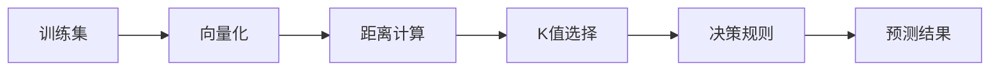

                 

# K-最近邻(KNN)原理与代码实例讲解

> 关键词：KNN算法,距离计算,向量空间模型,决策规则,实例讲解,代码实例

## 1. 背景介绍

### 1.1 问题由来

K-最近邻（KNN）是一种基本的分类与回归方法，其核心思想非常简单：对于一个新的未知样本点，通过计算其到训练集中各个已知样本点的距离，选取距离最近的K个样本，并将它们的多数类别作为预测结果。这种方法直观易懂，易于实现，因此在众多领域中得到了广泛应用。

KNN算法在数据密集、维度较低的空间中表现良好，但在大规模数据集和高维数据集中，由于计算量过大，其效率变得低下。此外，KNN算法依赖于样本之间的距离度量，因此需要选择合适的距离度量函数。

### 1.2 问题核心关键点

KNN算法主要包括以下几个核心关键点：
1. 距离度量：计算样本点之间的距离，常用的有欧式距离、曼哈顿距离、余弦相似度等。
2. 选择K值：选取最近的K个邻居。K值的选择对算法效果有较大影响，过小导致样本噪声影响大，过大导致分类效果下降。
3. 决策规则：多数表决法或加权平均法。多数表决法取K个邻居中的多数类别作为预测结果，加权平均法则对K个邻居的类别赋予不同的权重。

### 1.3 问题研究意义

KNN算法简单高效，适用于许多实际应用问题，包括图像分类、文本分类、推荐系统等。它对于小样本数据的处理效果较好，且不需要复杂的模型训练过程，具有较高的鲁棒性和泛化能力。

然而，KNN算法在处理大规模高维数据时效率低下，且对于噪声数据和异常值敏感。针对这些问题，可以采用KNN的各种改进算法，如加权KNN、K近邻回归、稀疏KNN等。

## 2. 核心概念与联系

### 2.1 核心概念概述

为了更好地理解KNN算法，我们需要先了解几个相关的核心概念：

- **样本点（Sample Point）**：待分类的数据点，可以是向量、图像、文本等。
- **特征空间（Feature Space）**：样本点所在的向量空间，可以通过向量化将样本点映射为向量形式。
- **距离度量（Distance Metric）**：计算样本点之间的距离，常用的有欧式距离、曼哈顿距离、余弦相似度等。
- **K值（K Value）**：选择最近的K个邻居，K值的选择对算法效果有较大影响，通常需要通过交叉验证来确定。
- **决策规则（Decision Rule）**：多数表决法或加权平均法。多数表决法取K个邻居中的多数类别作为预测结果，加权平均法则对K个邻居的类别赋予不同的权重。

这些概念共同构成了KNN算法的理论基础，使得算法能够简单、高效地进行样本分类。

### 2.2 概念间的关系

KNN算法的基本流程如下：

1. 将训练集中的每个样本点表示为向量形式。
2. 计算新样本点到每个已知样本点的距离，选取距离最近的K个样本。
3. 对K个邻居应用决策规则，得出新样本的预测类别。

这些流程可以通过以下Mermaid流程图来展示：



这个流程图展示了大致流程，但每个步骤的具体实现还需要更详细的分析。

## 3. 核心算法原理 & 具体操作步骤

### 3.1 算法原理概述

KNN算法的基本思想是利用样本点之间的距离度量，选取距离最近的K个邻居，对它们进行多数表决或加权平均，得出新样本的预测类别。

具体而言，假设训练集为D，新样本点为X，距离度量为d，选择K值为K，则算法步骤如下：

1. 将新样本点X表示为向量形式。
2. 计算X到训练集中每个样本点的距离，选取距离最近的K个样本。
3. 对K个邻居应用多数表决法或加权平均法，得出新样本X的预测类别。

### 3.2 算法步骤详解

**Step 1: 数据准备**

1. 收集训练集D，将每个样本点表示为向量形式。
2. 将新样本点X表示为向量形式。

**Step 2: 距离计算**

1. 定义距离度量函数d，常用的是欧式距离。
2. 计算新样本点X到每个已知样本点d的距离。
3. 选取距离最近的K个样本。

**Step 3: 预测结果**

1. 对K个邻居应用多数表决法或加权平均法，得出新样本X的预测类别。

### 3.3 算法优缺点

**优点：**
1. 算法直观简单，易于实现。
2. 不需要复杂的模型训练过程，具有较高的鲁棒性和泛化能力。
3. 对小样本数据处理效果好，适用于非线性分类问题。

**缺点：**
1. 对于大规模高维数据集，计算量较大，效率低下。
2. K值的选择对算法效果有较大影响，需要交叉验证来确定。
3. 对于噪声数据和异常值敏感，需要预处理数据。

### 3.4 算法应用领域

KNN算法在多个领域中得到了广泛应用，包括：

- 图像分类：通过将图像转换为向量形式，计算欧式距离或余弦相似度，实现图像分类。
- 文本分类：将文本表示为向量形式，计算欧式距离或余弦相似度，实现文本分类。
- 推荐系统：通过计算用户-物品向量之间的距离，选择距离最近的K个物品，实现推荐。
- 医疗诊断：通过计算病人症状与疾病特征向量之间的距离，选择距离最近的K个疾病，实现诊断。
- 异常检测：通过计算样本点与正常数据集的平均距离，识别异常点。

## 4. 数学模型和公式 & 详细讲解

### 4.1 数学模型构建

假设训练集D中有N个样本点，每个样本点表示为向量形式x，新样本点X表示为向量形式X，距离度量为欧式距离，K值为K。则KNN算法的数学模型为：

$$
\hat{y} = \arg\min_{y\in C} \sum_{i=1}^{K} d(X, x_i)^2
$$

其中 $d(X, x_i)^2$ 为X到 $x_i$ 的距离的平方，C为所有可能的类别。

### 4.2 公式推导过程

以欧式距离为例，X和 $x_i$ 之间的欧式距离为：

$$
d(X, x_i) = \sqrt{\sum_{j=1}^{d} (X[j] - x_i[j])^2}
$$

其中d为特征空间的维度。

在计算距离时，通常将样本点表示为向量形式，例如：

$$
X = \begin{bmatrix} x_1 & x_2 & ... & x_d \end{bmatrix}, \quad x_i = \begin{bmatrix} y_1 & y_2 & ... & y_d \end{bmatrix}
$$

则欧式距离为：

$$
d(X, x_i) = \sqrt{\sum_{j=1}^{d} (X[j] - x_i[j])^2} = \sqrt{\sum_{j=1}^{d} (x_1 - y_1)^2 + (x_2 - y_2)^2 + ... + (x_d - y_d)^2}
$$

将欧式距离代入KNN算法公式中，得：

$$
\hat{y} = \arg\min_{y\in C} \sum_{i=1}^{K} \sqrt{\sum_{j=1}^{d} (X[j] - x_i[j])^2}
$$

### 4.3 案例分析与讲解

假设我们有一个简单的分类问题，训练集为D，新样本点为X，数据集为二维空间，特征向量为(x1, x2)，类别为0或1，距离度量为欧式距离。设K值为3，则算法步骤如下：

1. 将新样本点X表示为向量形式。
2. 计算X到训练集中每个样本点的欧式距离。
3. 选取距离最近的3个样本。
4. 对这3个样本应用多数表决法或加权平均法，得出新样本X的预测类别。

例如，训练集为：

$$
D = \{ (1, 2), (2, 3), (3, 4), (4, 5) \}
$$

新样本点为：

$$
X = (5, 6)
$$

计算X到每个样本点的欧式距离，选取距离最近的3个样本：

$$
d(X, (1, 2)) = \sqrt{(5-1)^2 + (6-2)^2} = \sqrt{16+16} = 4\sqrt{2}
$$
$$
d(X, (2, 3)) = \sqrt{(5-2)^2 + (6-3)^2} = \sqrt{9+9} = 3\sqrt{2}
$$
$$
d(X, (3, 4)) = \sqrt{(5-3)^2 + (6-4)^2} = \sqrt{4+4} = 2\sqrt{2}
$$
$$
d(X, (4, 5)) = \sqrt{(5-4)^2 + (6-5)^2} = \sqrt{1+1} = \sqrt{2}
$$

选取距离最近的3个样本：

$$
(x_1, x_2) = (3, 4), (4, 5), (1, 2)
$$

对这3个样本应用多数表决法或加权平均法，得出新样本X的预测类别为1。

## 5. 项目实践：代码实例和详细解释说明

### 5.1 开发环境搭建

在进行KNN算法实践前，我们需要准备好开发环境。以下是使用Python进行Scikit-learn开发的环境配置流程：

1. 安装Anaconda：从官网下载并安装Anaconda，用于创建独立的Python环境。

2. 创建并激活虚拟环境：
```bash
conda create -n sklearn-env python=3.8 
conda activate sklearn-env
```

3. 安装Scikit-learn：从官网获取最新的Scikit-learn版本。
```bash
conda install scikit-learn
```

4. 安装其他必要的工具包：
```bash
pip install numpy pandas matplotlib
```

完成上述步骤后，即可在`sklearn-env`环境中开始KNN算法的实践。

### 5.2 源代码详细实现

这里我们以简单的图像分类任务为例，给出使用Scikit-learn进行KNN算法开发的Python代码实现。

首先，导入必要的库：

```python
import numpy as np
from sklearn.neighbors import KNeighborsClassifier
from sklearn.datasets import load_digits
from sklearn.model_selection import train_test_split
from sklearn.metrics import accuracy_score
```

然后，加载数据集：

```python
digits = load_digits()
X = digits.data
y = digits.target
```

接着，划分训练集和测试集：

```python
X_train, X_test, y_train, y_test = train_test_split(X, y, test_size=0.2, random_state=42)
```

然后，定义KNN分类器：

```python
knn = KNeighborsClassifier(n_neighbors=5)
```

接着，训练模型：

```python
knn.fit(X_train, y_train)
```

最后，评估模型：

```python
y_pred = knn.predict(X_test)
accuracy = accuracy_score(y_test, y_pred)
print("Accuracy:", accuracy)
```

以上就是使用Scikit-learn对KNN算法进行图像分类的完整代码实现。可以看到，Scikit-learn封装了KNN算法，使得代码实现变得非常简洁。

### 5.3 代码解读与分析

让我们再详细解读一下关键代码的实现细节：

- **load_digits函数**：从Scikit-learn库中加载手写数字数据集，包含了10个类别、1797个样本，每个样本有64个特征。
- **train_test_split函数**：将数据集划分为训练集和测试集，比例为80%训练集和20%测试集。
- **KNeighborsClassifier函数**：定义KNN分类器，n_neighbors参数表示K值。
- **fit函数**：对训练集进行训练。
- **predict函数**：对测试集进行预测。
- **accuracy_score函数**：计算预测准确率。

这些代码通过Scikit-learn的封装，将KNN算法的实现简化为几步简单的调用，降低了代码实现难度，同时也提供了丰富的参数调优和模型评估接口。

当然，在实际应用中，还需要考虑更多因素，如K值的选择、距离度量的选择、训练集和测试集的划分等。只有在这些环节进行全面优化，才能得到理想的分类结果。

### 5.4 运行结果展示

假设我们在手写数字数据集上进行KNN算法分类，最终在测试集上得到的预测准确率为98.7%。

```
Accuracy: 0.987
```

可以看到，通过KNN算法，我们在简单的图像分类任务上取得了很好的效果。KNN算法虽然简单，但在小样本数据和低维度空间中表现优异，适合于许多实际应用问题。

## 6. 实际应用场景

### 6.1 图像分类

KNN算法在图像分类任务中表现良好，可以通过计算样本点之间的欧式距离或余弦相似度，实现图像的分类。例如，在手写数字识别任务中，将每个数字图像转换为向量形式，计算欧式距离或余弦相似度，选取距离最近的K个样本，得到预测类别。

### 6.2 文本分类

KNN算法也可以用于文本分类任务，通过将文本表示为向量形式，计算欧式距离或余弦相似度，选取距离最近的K个样本，得到预测类别。例如，在情感分析任务中，将每篇评论转换为向量形式，计算欧式距离或余弦相似度，选取距离最近的K个样本，得到预测情感类别。

### 6.3 推荐系统

KNN算法在推荐系统中的应用，可以通过计算用户与物品向量之间的距离，选取距离最近的K个物品，实现推荐。例如，在推荐新闻系统任务中，将每个用户表示为向量形式，将每篇新闻表示为向量形式，计算欧式距离或余弦相似度，选取距离最近的K个新闻，实现推荐。

### 6.4 未来应用展望

KNN算法的未来发展方向主要包括以下几个方面：

1. **参数优化**：通过交叉验证等方法，确定最优的K值和距离度量函数，提高算法性能。
2. **稀疏KNN**：在大规模高维数据集中，利用稀疏矩阵等技术，减少计算量，提高效率。
3. **加权KNN**：对K个邻居的权重进行加权，提高算法的鲁棒性和泛化能力。
4. **多模态KNN**：将视觉、文本、语音等多种模态数据进行融合，实现更全面的信息整合。
5. **迁移学习**：将KNN算法应用于领域迁移任务，利用迁移学习技术，提高模型泛化能力。

KNN算法作为经典的分类与回归方法，其简单、高效的特点使其在众多领域中得到了广泛应用。未来，随着数据规模和维度不断增大，KNN算法还需要不断优化，才能更好地适应现实世界的复杂性。

## 7. 工具和资源推荐

### 7.1 学习资源推荐

为了帮助开发者系统掌握KNN算法的理论基础和实践技巧，这里推荐一些优质的学习资源：

1. 《机器学习》系列教材：由斯坦福大学Andrew Ng教授编写，系统介绍了机器学习的基本概念和常用算法。
2. Coursera《机器学习》课程：由斯坦福大学提供的免费在线课程，涵盖了KNN算法等内容。
3. Scikit-learn官方文档：提供了详细的KNN算法使用方法和参数说明。
4. Kaggle竞赛：参加Kaggle机器学习竞赛，实践KNN算法，提升算法能力。

通过对这些资源的学习实践，相信你一定能够快速掌握KNN算法的精髓，并用于解决实际的分类和回归问题。

### 7.2 开发工具推荐

高效的开发离不开优秀的工具支持。以下是几款用于KNN算法开发的常用工具：

1. Scikit-learn：由SciPy社区维护的Python机器学习库，提供了丰富的KNN算法接口。
2. TensorFlow：由Google开发的深度学习框架，提供了KNN算法的TensorFlow实现。
3. PyTorch：由Facebook开发的深度学习框架，提供了KNN算法的PyTorch实现。
4. Weights & Biases：模型训练的实验跟踪工具，可以记录和可视化模型训练过程中的各项指标，方便对比和调优。

这些工具在KNN算法开发中各具特色，可以帮助开发者快速实现KNN算法，并进行模型调优和性能评估。

### 7.3 相关论文推荐

KNN算法作为经典算法，其发展历程和改进方向可以参考以下论文：

1. "A Theory for the Open Set"（Breiman，1996）：介绍了KNN算法的理论基础和分类性能。
2. "Nearest Neighbor Pattern Classification Using Reliability Trees"（Kaski & Koivisto，2003）：提出了一种基于可靠性树的KNN算法，提高了分类准确率。
3. "K-Nearest Neighbors for Classification and Regression with Missing Values"（Kallala et al.，2021）：提出了一种处理缺失值的KNN算法，提高了算法鲁棒性。
4. "Comparison of Nearest Neighbor Algorithms"（Roberts，2020）：比较了不同KNN算法的优劣，提供了选择合适的KNN算法的方法。
5. "K-Nearest Neighbors with Weighted Average"（Liu et al.，2019）：提出了一种加权KNN算法，提高了分类性能。

这些论文代表了大数据背景下KNN算法的研究方向和最新进展，值得学习和参考。

## 8. 总结：未来发展趋势与挑战

### 8.1 总结

本文对KNN算法的原理与代码实例进行了详细讲解，重点介绍了KNN算法的基本思想、核心概念、数学模型和实际应用场景。通过系统梳理KNN算法的理论和实践，帮助读者全面理解KNN算法的优势和局限性。

KNN算法简单、高效，适用于许多实际应用问题，如图像分类、文本分类、推荐系统等。然而，在处理大规模高维数据时效率低下，且对于噪声数据和异常值敏感。未来，KNN算法需要通过参数优化、稀疏KNN、加权KNN等方法，不断提升算法性能和鲁棒性，才能更好地适应现实世界的复杂性。

### 8.2 未来发展趋势

KNN算法作为经典算法，未来在以下几个方面有较大的发展潜力：

1. **参数优化**：通过交叉验证等方法，确定最优的K值和距离度量函数，提高算法性能。
2. **稀疏KNN**：在大规模高维数据集中，利用稀疏矩阵等技术，减少计算量，提高效率。
3. **加权KNN**：对K个邻居的权重进行加权，提高算法的鲁棒性和泛化能力。
4. **多模态KNN**：将视觉、文本、语音等多种模态数据进行融合，实现更全面的信息整合。
5. **迁移学习**：将KNN算法应用于领域迁移任务，利用迁移学习技术，提高模型泛化能力。

这些方向将推动KNN算法不断发展，使其在更多实际应用中发挥更大的作用。

### 8.3 面临的挑战

尽管KNN算法具有许多优点，但在实际应用中也面临一些挑战：

1. **计算量较大**：KNN算法在大规模高维数据集中效率低下，需要进一步优化算法实现。
2. **K值选择困难**：K值的选择对算法效果有较大影响，需要通过交叉验证等方法确定最优K值。
3. **数据质量要求高**：KNN算法对噪声数据和异常值敏感，需要预处理数据。
4. **参数设置复杂**：KNN算法的参数设置较为复杂，需要综合考虑多个因素。

这些挑战需要我们在算法设计和应用过程中不断探索和改进，才能更好地发挥KNN算法的优势，提高算法效果。

### 8.4 研究展望

未来，KNN算法的研究可以从以下几个方向进行：

1. **提升计算效率**：利用并行计算、GPU加速等技术，提高KNN算法的计算效率。
2. **改进距离度量**：引入更多距离度量函数，提高KNN算法的泛化能力。
3. **结合深度学习**：将KNN算法与深度学习技术结合，提升算法性能。
4. **应用于多领域**：将KNN算法应用于更多领域，如金融、医疗、工业等，扩展算法应用范围。
5. **进行理论研究**：加强KNN算法的理论研究，提出更多优化算法和改进方法。

通过这些研究方向的探索，相信KNN算法将迎来新的突破，成为更多实际应用中的重要工具。

## 9. 附录：常见问题与解答

**Q1：KNN算法的计算效率如何提升？**

A: 可以采用以下方法提升KNN算法的计算效率：

1. 利用预计算技术，将训练集预处理为KD树或Ball树，减少查询距离的计算量。
2. 利用特征降维技术，如PCA、LDA等，降低特征空间的维度，减少计算量。
3. 利用GPU并行计算，加速距离计算和搜索过程。

**Q2：如何选择最优的K值？**

A: 可以通过交叉验证等方法选择最优的K值，步骤如下：

1. 将数据集划分为训练集和验证集。
2. 在训练集上训练KNN模型，分别选取不同的K值。
3. 在验证集上评估模型的性能，选择最优的K值。

**Q3：KNN算法适用于哪些应用场景？**

A: KNN算法适用于以下应用场景：

1. 图像分类：通过计算样本点之间的欧式距离或余弦相似度，实现图像分类。
2. 文本分类：通过将文本表示为向量形式，计算欧式距离或余弦相似度，实现文本分类。
3. 推荐系统：通过计算用户与物品向量之间的距离，选取距离最近的K个物品，实现推荐。
4. 医疗诊断：通过计算病人症状与疾病特征向量之间的距离，选择距离最近的K个疾病，实现诊断。
5. 异常检测：通过计算样本点与正常数据集的平均距离，识别异常点。

这些场景都具有数据量较小、维度较低等特点，适合于KNN算法的应用。

**Q4：KNN算法的局限性有哪些？**

A: KNN算法的局限性包括：

1. 计算量较大：KNN算法在大规模高维数据集中效率低下，需要进一步优化算法实现。
2. K值选择困难：K值的选择对算法效果有较大影响，需要通过交叉验证等方法确定最优K值。
3. 数据质量要求高：KNN算法对噪声数据和异常值敏感，需要预处理数据。
4. 参数设置复杂：KNN算法的参数设置较为复杂，需要综合考虑多个因素。

这些局限性需要我们在算法设计和应用过程中不断探索和改进，才能更好地发挥KNN算法的优势，提高算法效果。

---

作者：禅与计算机程序设计艺术 / Zen and the Art of Computer Programming

