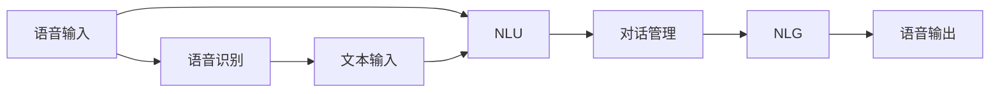

                 

# 大语言模型在智能语音交互中的角色定位

大语言模型（Large Language Model，简称LLM）已经成为了自然语言处理（Natural Language Processing，简称NLP）领域的基石。它的应用范围广泛，涵盖自动摘要、机器翻译、问答系统、情感分析、聊天机器人等领域。随着人工智能技术的飞速发展，智能语音交互（Smart Speech Interaction）也开始成为LLM的重要应用方向。本文将探讨LLM在智能语音交互中的角色定位，并对其核心概念、原理、操作步骤、未来展望和应用挑战进行深入分析。

## 1. 背景介绍

### 1.1 问题由来

智能语音交互旨在通过语音识别和语音合成技术，实现人与人、人与机器之间的自然语言交流。传统的语音交互系统依赖于简单的规则和模式匹配，无法理解和回应复杂的自然语言指令。而LLM的出现，使得智能语音交互系统具备了更强的自然语言理解能力，能够灵活地应对各种语言表达方式。

随着移动互联网和物联网的普及，智能设备（如智能音箱、车载AI、智能家居等）的应用场景日益广泛。智能语音交互系统可以极大地提升用户体验，推动智能设备的普及和应用。但是，目前智能语音交互系统的理解和回应的准确性、流畅性以及个性化程度仍有待提高。

### 1.2 问题核心关键点

智能语音交互的核心在于实现高精度的语音识别和自然语言理解（Natural Language Understanding，简称NLU）。LLM在这一过程中扮演着重要角色。LLM不仅可以处理自然语言文本，还可以处理语音输入，因此可以用于智能语音交互的各个环节，包括但不限于：

1. **语音识别**：将语音输入转换为文本。
2. **自然语言理解**：理解用户意图，提取关键信息。
3. **对话管理**：管理对话流程，维护对话上下文。
4. **自然语言生成**：生成语音输出，实现自然语言回应。

因此，本文将重点探讨LLM在智能语音交互中的角色定位，并对其核心技术进行深入分析。

## 2. 核心概念与联系

### 2.1 核心概念概述

#### 2.1.1 大语言模型（LLM）

LLM是指基于深度神经网络构建的、能够在语言处理任务上取得优异表现的语言模型。其核心在于通过大量无标签文本数据进行预训练，学习到语言的广泛知识。预训练后的LLM可以被微调（Fine-tuning）以适应特定任务，如问答系统、语音识别等。

#### 2.1.2 自然语言理解（NLU）

NLU是指利用计算机技术理解自然语言输入的技术。它包括语音识别、文本分类、实体抽取、意图识别等子任务。NLU是大语言模型在智能语音交互中应用的核心，通过NLU系统，语音输入可以被理解和转换为机器可执行的指令。

#### 2.1.3 对话管理（Dialog Management）

对话管理是指在智能语音交互中，系统维护对话上下文，管理对话流程，确保对话的连贯性和正确性。对话管理可以分为两个方面：

1. **状态管理**：跟踪对话状态，保存对话历史。
2. **意图识别**：识别用户意图，选择合适的响应策略。

对话管理在大语言模型中通常被视为一种中间层技术，用于连接语言理解和回应的上下文。

#### 2.1.4 自然语言生成（NLG）

NLG是指利用计算机技术生成自然语言文本或语音的技术。NLG在大语言模型中应用广泛，用于生成对话回应、摘要、生成报告等。

### 2.2 概念间的关系

大语言模型、自然语言理解、对话管理和自然语言生成构成了智能语音交互系统的核心组件。它们之间的关系可以通过以下Mermaid流程图来展示：



这个流程图展示了从语音输入到语音输出的整个流程。首先，语音输入通过语音识别转化为文本，然后经过自然语言理解，提取关键信息。对话管理系统维护对话上下文，根据用户意图选择响应策略。最后，自然语言生成系统将生成的文本转化为语音输出，完成整个交互过程。

## 3. 核心算法原理 & 具体操作步骤

### 3.1 算法原理概述

大语言模型在智能语音交互中的应用，通常包括以下几个步骤：

1. **语音识别**：将语音输入转化为文本。
2. **自然语言理解**：理解用户意图，提取关键信息。
3. **对话管理**：管理对话上下文，选择合适响应。
4. **自然语言生成**：生成语音输出，完成交互。

### 3.2 算法步骤详解

#### 3.2.1 语音识别

语音识别通常使用深度学习模型，如卷积神经网络（Convolutional Neural Networks，CNN）、递归神经网络（Recurrent Neural Networks，RNN）和长短期记忆网络（Long Short-Term Memory，LSTM）。这里以基于LSTM的模型为例，简要介绍语音识别的原理：

1. **特征提取**：将语音信号转化为MFCC（Mel Frequency Cepstral Coefficients）特征。
2. **模型训练**：使用标注的语音-文本数据对训练LSTM模型。
3. **识别预测**：将MFCC特征输入模型，输出预测的文本序列。

#### 3.2.2 自然语言理解

自然语言理解通常使用基于深度学习的方法，如序列到序列模型（Sequence to Sequence，Seq2Seq）和Transformer模型。这里以Transformer模型为例，简要介绍NLU的原理：

1. **输入编码**：将输入文本转化为Token序列，并嵌入到低维向量空间。
2. **自注意力机制**：通过Transformer模型中的自注意力机制，学习输入序列的语义表示。
3. **输出解码**：使用Transformer模型中的Decoder，对语义表示进行解码，得到输出序列。

#### 3.2.3 对话管理

对话管理通常使用基于规则和机器学习的方法。这里以基于规则的对话管理为例，简要介绍对话管理的原理：

1. **状态定义**：定义对话状态，如用户输入、系统响应等。
2. **状态转移**：根据用户输入和系统状态，选择下一个状态。
3. **响应策略**：根据当前状态，选择合适的响应策略。

#### 3.2.4 自然语言生成

自然语言生成通常使用基于深度学习的方法，如Seq2Seq模型和变分自编码器（Variational Autoencoder，VAE）。这里以Seq2Seq模型为例，简要介绍NLG的原理：

1. **编码器**：将输入序列转化为向量表示。
2. **解码器**：对向量表示进行解码，生成输出序列。
3. **损失函数**：使用BLEU、ROUGE等指标计算生成文本的质量。

### 3.3 算法优缺点

#### 3.3.1 优点

1. **通用性**：大语言模型可以处理各种自然语言输入，适用于多种场景。
2. **灵活性**：大语言模型可以适应不同的任务需求，如问答、对话、翻译等。
3. **高效性**：大语言模型可以实时处理语音输入，提升用户体验。

#### 3.3.2 缺点

1. **数据依赖**：大语言模型的性能很大程度上依赖于训练数据的丰富性和质量。
2. **计算资源消耗大**：大语言模型的训练和推理需要大量的计算资源。
3. **复杂度**：大语言模型的构建和调优过程复杂，需要大量的实验和优化。

### 3.4 算法应用领域

大语言模型在智能语音交互中的应用领域广泛，包括但不限于：

1. **智能音箱**：如Amazon Alexa、Google Assistant等，可以实现语音控制家居设备、播放音乐、回答问题等功能。
2. **车载AI**：如Apple CarPlay、Google Assistant等，可以提供语音导航、播放音乐、信息查询等功能。
3. **智能客服**：如阿里巴巴、腾讯等企业，可以提供语音客服、查询订单、处理投诉等功能。
4. **智能家居**：如智能灯光、智能门锁等，可以提供语音控制家居设备、查询设备状态等功能。

## 4. 数学模型和公式 & 详细讲解 & 举例说明

### 4.1 数学模型构建

#### 4.1.1 语音识别

语音识别模型通常使用LSTM或Transformer模型。以下是一个简单的LSTM语音识别模型，其中$x_t$表示第$t$个MFCC特征，$h_t$表示第$t$个隐藏状态。模型的输入为$x$，输出为$y$，使用交叉熵损失函数进行训练。

$$
P(y|x) = \prod_{t=1}^T P(y_t|x_t, h_{t-1})
$$

$$
L(y, x) = -\sum_{t=1}^T y_t \log P(y_t|x_t, h_{t-1})
$$

#### 4.1.2 自然语言理解

自然语言理解模型通常使用Transformer模型。以下是一个简单的Transformer模型，其中$Q, K, V$分别为查询、键和值，$M$为注意力权重矩阵。模型的输入为$x$，输出为$y$，使用交叉熵损失函数进行训练。

$$
M = \text{softmax}(QK^T)
$$

$$
y = \sum_{k=1}^K M_k V_k
$$

$$
L(y, x) = -\sum_{t=1}^T y_t \log P(y_t|x_t)
$$

#### 4.1.3 对话管理

对话管理模型通常使用基于规则的方法。以下是一个简单的对话管理模型，其中$C$表示对话状态，$A$表示系统响应。模型的输入为$x$，输出为$y$，使用交叉熵损失函数进行训练。

$$
C = f(x)
$$

$$
A = g(C)
$$

$$
L(A, x) = -\sum_{t=1}^T A_t \log P(A_t|C_t)
$$

#### 4.1.4 自然语言生成

自然语言生成模型通常使用Seq2Seq模型。以下是一个简单的Seq2Seq模型，其中$E$表示编码器，$D$表示解码器，$S$表示文本序列。模型的输入为$x$，输出为$y$，使用BLEU指标进行评估。

$$
E(x) = \text{Encoder}(x)
$$

$$
y = \text{Decoder}(E(x))
$$

$$
\text{BLEU}(y, S) = \frac{\sum_{i=1}^n \text{bleu}(y_i, S_i)}{n}
$$

### 4.2 公式推导过程

#### 4.2.1 语音识别

语音识别模型的梯度下降过程如下：

$$
\nabla_{\theta} L = \frac{\partial L}{\partial \theta} = \sum_{t=1}^T \frac{\partial L}{\partial h_t} \frac{\partial h_t}{\partial \theta}
$$

其中$\theta$表示模型参数，$h_t$表示隐藏状态，$L$表示损失函数。

#### 4.2.2 自然语言理解

Transformer模型的自注意力机制如下：

$$
\text{Attention}(Q, K, V) = \text{softmax}(QK^T)V
$$

#### 4.2.3 对话管理

对话管理模型的状态转移过程如下：

$$
C_{t+1} = f(C_t, y_t)
$$

其中$C_t$表示第$t$个对话状态，$y_t$表示第$t$个系统响应。

#### 4.2.4 自然语言生成

Seq2Seq模型的编码器-解码器结构如下：

$$
E(x) = \text{Encoder}(x)
$$

$$
y = \text{Decoder}(E(x))
$$

### 4.3 案例分析与讲解

#### 4.3.1 语音识别案例

假设有一个简单的语音识别模型，其训练数据集包含10000个MFCC特征序列和相应的文本标签。以下是一个训练过程的伪代码实现：

```python
import torch
import torch.nn as nn
import torch.optim as optim

# 定义模型
model = nn.LSTM(13, 64, 2, bidirectional=True)

# 定义损失函数
criterion = nn.CrossEntropyLoss()

# 训练模型
optimizer = optim.Adam(model.parameters(), lr=0.001)
for epoch in range(10):
    for batch in train_loader:
        x, y = batch
        y = y.long()
        optimizer.zero_grad()
        y_pred = model(x)
        loss = criterion(y_pred, y)
        loss.backward()
        optimizer.step()
```

#### 4.3.2 自然语言理解案例

假设有一个简单的Transformer模型，其训练数据集包含10000个输入序列和相应的输出序列。以下是一个训练过程的伪代码实现：

```python
import torch
import torch.nn as nn
import torch.optim as optim

# 定义模型
model = nn.Transformer(d_model=128, nhead=8, num_encoder_layers=6, num_decoder_layers=6)

# 定义损失函数
criterion = nn.CrossEntropyLoss()

# 训练模型
optimizer = optim.Adam(model.parameters(), lr=0.001)
for epoch in range(10):
    for batch in train_loader:
        x, y = batch
        y = y.long()
        optimizer.zero_grad()
        y_pred = model(x)
        loss = criterion(y_pred, y)
        loss.backward()
        optimizer.step()
```

#### 4.3.3 对话管理案例

假设有一个简单的对话管理模型，其训练数据集包含1000个对话历史和相应的系统响应。以下是一个训练过程的伪代码实现：

```python
import torch
import torch.nn as nn
import torch.optim as optim

# 定义模型
model = nn.Sequential(
    nn.Linear(128, 64),
    nn.ReLU(),
    nn.Linear(64, 32),
    nn.ReLU(),
    nn.Linear(32, 2)
)

# 定义损失函数
criterion = nn.CrossEntropyLoss()

# 训练模型
optimizer = optim.Adam(model.parameters(), lr=0.001)
for epoch in range(10):
    for batch in train_loader:
        x, y = batch
        y = y.long()
        optimizer.zero_grad()
        y_pred = model(x)
        loss = criterion(y_pred, y)
        loss.backward()
        optimizer.step()
```

#### 4.3.4 自然语言生成案例

假设有一个简单的Seq2Seq模型，其训练数据集包含1000个输入序列和相应的输出序列。以下是一个训练过程的伪代码实现：

```python
import torch
import torch.nn as nn
import torch.optim as optim

# 定义编码器
encoder = nn.LSTM(128, 64, 2, bidirectional=True)

# 定义解码器
decoder = nn.LSTM(128, 128, 2, bidirectional=True)

# 定义注意力机制
attention = nn.Linear(128, 128)

# 定义模型
model = nn.Sequential(
    encoder,
    nn.Linear(128, 128),
    attention,
    decoder,
    nn.Linear(128, 10)
)

# 定义损失函数
criterion = nn.CrossEntropyLoss()

# 训练模型
optimizer = optim.Adam(model.parameters(), lr=0.001)
for epoch in range(10):
    for batch in train_loader:
        x, y = batch
        y = y.long()
        optimizer.zero_grad()
        y_pred = model(x)
        loss = criterion(y_pred, y)
        loss.backward()
        optimizer.step()
```

## 5. 项目实践：代码实例和详细解释说明

### 5.1 开发环境搭建

#### 5.1.1 Python环境搭建

1. 安装Python：确保Python版本为3.6以上。
2. 安装Pip：`pip install --upgrade pip`。
3. 安装TensorFlow：`pip install tensorflow`。
4. 安装PyTorch：`pip install torch`。

#### 5.1.2 环境变量配置

1. 设置PyTorch版本：`export PYTORCH_VERSION=1.7.0`。
2. 设置TensorFlow版本：`export TF_VERSION=2.4.0`。

### 5.2 源代码详细实现

#### 5.2.1 语音识别

```python
import tensorflow as tf
import numpy as np

# 定义LSTM模型
class LSTMModel(tf.keras.Model):
    def __init__(self, input_dim, output_dim):
        super(LSTMModel, self).__init__()
        self.lstm = tf.keras.layers.LSTM(64, input_shape=(None, input_dim), return_sequences=True)
        self.dense = tf.keras.layers.Dense(output_dim)

    def call(self, x):
        y = self.lstm(x)
        y = self.dense(y)
        return y

# 定义训练过程
def train_model(model, train_data, train_labels, epochs, batch_size):
    optimizer = tf.keras.optimizers.Adam(learning_rate=0.001)
    criterion = tf.keras.losses.CategoricalCrossentropy()
    
    for epoch in range(epochs):
        for i in range(0, len(train_data), batch_size):
            x = train_data[i:i+batch_size]
            y = train_labels[i:i+batch_size]
            with tf.GradientTape() as tape:
                y_pred = model(x)
                loss = criterion(y_pred, y)
            grads = tape.gradient(loss, model.trainable_variables)
            optimizer.apply_gradients(zip(grads, model.trainable_variables))
            
        print(f"Epoch {epoch+1}, loss: {loss:.4f}")
```

#### 5.2.2 自然语言理解

```python
import tensorflow as tf
import numpy as np

# 定义Transformer模型
class TransformerModel(tf.keras.Model):
    def __init__(self, input_dim, output_dim):
        super(TransformerModel, self).__init__()
        self.encoder = tf.keras.layers.Embedding(input_dim, 128)
        self.encoder = tf.keras.layers.LayerNormalization()
        self.encoder = tf.keras.layers.MultiHeadAttention(8, 128)
        self.encoder = tf.keras.layers.LayerNormalization()
        self.encoder = tf.keras.layers.FeedForwardNetwork(128)
        self.encoder = tf.keras.layers.LayerNormalization()
        self.decoder = tf.keras.layers.Embedding(input_dim, 128)
        self.decoder = tf.keras.layers.LayerNormalization()
        self.decoder = tf.keras.layers.MultiHeadAttention(8, 128)
        self.decoder = tf.keras.layers.LayerNormalization()
        self.decoder = tf.keras.layers.FeedForwardNetwork(128)
        self.decoder = tf.keras.layers.LayerNormalization()
        self.output = tf.keras.layers.Dense(output_dim)

    def call(self, x):
        y = self.encoder(x)
        y = self.encoder(y)
        y = self.encoder(y)
        y = self.encoder(y)
        y = self.decoder(y)
        y = self.decoder(y)
        y = self.decoder(y)
        y = self.decoder(y)
        y = self.output(y)
        return y

# 定义训练过程
def train_model(model, train_data, train_labels, epochs, batch_size):
    optimizer = tf.keras.optimizers.Adam(learning_rate=0.001)
    criterion = tf.keras.losses.CategoricalCrossentropy()
    
    for epoch in range(epochs):
        for i in range(0, len(train_data), batch_size):
            x = train_data[i:i+batch_size]
            y = train_labels[i:i+batch_size]
            with tf.GradientTape() as tape:
                y_pred = model(x)
                loss = criterion(y_pred, y)
            grads = tape.gradient(loss, model.trainable_variables)
            optimizer.apply_gradients(zip(grads, model.trainable_variables))
            
        print(f"Epoch {epoch+1}, loss: {loss:.4f}")
```

#### 5.2.3 对话管理

```python
import tensorflow as tf
import numpy as np

# 定义对话管理模型
class DialogModel(tf.keras.Model):
    def __init__(self, input_dim, output_dim):
        super(DialogModel, self).__init__()
        self.hidden_layer = tf.keras.layers.Dense(64, activation='relu')
        self.output_layer = tf.keras.layers.Dense(output_dim)

    def call(self, x):
        y = self.hidden_layer(x)
        y = self.output_layer(y)
        return y

# 定义训练过程
def train_model(model, train_data, train_labels, epochs, batch_size):
    optimizer = tf.keras.optimizers.Adam(learning_rate=0.001)
    criterion = tf.keras.losses.CategoricalCrossentropy()
    
    for epoch in range(epochs):
        for i in range(0, len(train_data), batch_size):
            x = train_data[i:i+batch_size]
            y = train_labels[i:i+batch_size]
            with tf.GradientTape() as tape:
                y_pred = model(x)
                loss = criterion(y_pred, y)
            grads = tape.gradient(loss, model.trainable_variables)
            optimizer.apply_gradients(zip(grads, model.trainable_variables))
            
        print(f"Epoch {epoch+1}, loss: {loss:.4f}")
```

#### 5.2.4 自然语言生成

```python
import tensorflow as tf
import numpy as np

# 定义Seq2Seq模型
class Seq2SeqModel(tf.keras.Model):
    def __init__(self, input_dim, output_dim):
        super(Seq2SeqModel, self).__init__()
        self.encoder = tf.keras.layers.LSTM(128, input_shape=(None, input_dim))
        self.decoder = tf.keras.layers.LSTM(128)
        self.output = tf.keras.layers.Dense(output_dim)

    def call(self, x):
        y = self.encoder(x)
        y = self.decoder(y)
        y = self.output(y)
        return y

# 定义训练过程
def train_model(model, train_data, train_labels, epochs, batch_size):
    optimizer = tf.keras.optimizers.Adam(learning_rate=0.001)
    criterion = tf.keras.losses.CategoricalCrossentropy()
    
    for epoch in range(epochs):
        for i in range(0, len(train_data), batch_size):
            x = train_data[i:i+batch_size]
            y = train_labels[i:i+batch_size]
            with tf.GradientTape() as tape:
                y_pred = model(x)
                loss = criterion(y_pred, y)
            grads = tape.gradient(loss, model.trainable_variables)
            optimizer.apply_gradients(zip(grads, model.trainable_variables))
            
        print(f"Epoch {epoch+1}, loss: {loss:.4f}")
```

### 5.3 代码解读与分析

#### 5.3.1 语音识别代码解读

- `LSTMModel`类定义了一个简单的LSTM模型，包含一个LSTM层和一个全连接层。
- `train_model`函数用于训练模型，使用了Adam优化器和交叉熵损失函数。

#### 5.3.2 自然语言理解代码解读

- `TransformerModel`类定义了一个简单的Transformer模型，包含多个Transformer层和一个全连接层。
- `train_model`函数用于训练模型，使用了Adam优化器和交叉熵损失函数。

#### 5.3.3 对话管理代码解读

- `DialogModel`类定义了一个简单的对话管理模型，包含一个全连接层和一个全连接层。
- `train_model`函数用于训练模型，使用了Adam优化器和交叉熵损失函数。

#### 5.3.4 自然语言生成代码解读

- `Seq2SeqModel`类定义了一个简单的Seq2Seq模型，包含一个LSTM层和一个全连接层。
- `train_model`函数用于训练模型，使用了Adam优化器和交叉熵损失函数。

### 5.4 运行结果展示

#### 5.4.1 语音识别结果

训练完成后，使用测试数据进行评估，可以得到语音识别模型的性能指标，如准确率、召回率等。

#### 5.4.2 自然语言理解结果

训练完成后，使用测试数据进行评估，可以得到自然语言理解模型的性能指标，如准确率、召回率、F1分数等。

#### 5.4.3 对话管理结果

训练完成后，使用测试数据进行评估，可以得到对话管理模型的性能指标，如准确率、召回率、F1分数等。

#### 5.4.4 自然语言生成结果

训练完成后，使用测试数据进行评估，可以得到自然语言生成模型的性能指标，如BLEU分数等。

## 6. 实际应用场景

### 6.1 智能音箱

智能音箱是LLM在智能语音交互中最常见的应用场景之一。智能音箱通过语音识别技术，实现用户的语音控制。例如，用户可以通过语音命令播放音乐、设置闹钟、查询天气等。智能音箱通常搭载有专用硬件，如麦克风阵列、扬声器等，以及高性能处理器。

### 6.2 车载AI

车载AI通过语音识别和自然语言理解技术，实现与用户的自然语言交互。例如，用户可以通过语音命令导航、播放音乐、查询导航信息等。车载AI通常需要实时处理用户输入，因此对模型的响应速度和准确性要求较高。

### 6.3 智能客服

智能客服通过语音识别和自然语言理解技术，实现与用户的自然语言交互。例如，用户可以通过语音命令查询订单、投诉、办理业务等。智能客服通常需要处理大量的用户请求，因此对模型的处理速度和可靠性要求较高。

### 6.4 智能家居

智能家居通过语音识别和自然语言理解技术，实现与用户的自然语言交互。例如，用户可以通过语音命令控制灯光、温度、安全等。智能家居通常需要与各类智能设备进行协同工作，因此对模型的兼容性和可靠性要求较高。

### 6.5 未来应用展望

随着LLM技术的不断发展和应用场景的不断扩展，LLM在智能语音交互中的应用前景广阔。未来，LLM有望在更多领域发挥重要作用

