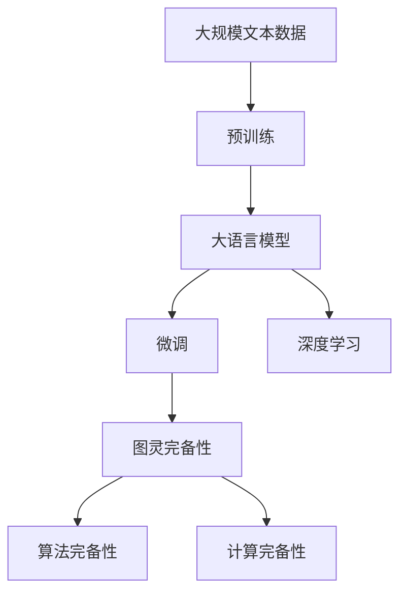

                 

# LLM的图灵完备性：AI的无限可能

> 关键词：语言模型,大模型,图灵完备性,人工智能,深度学习

## 1. 背景介绍

### 1.1 问题由来
自DeepMind AlphaGo横空出世以来，人工智能（AI）领域的研究热潮日新月异。特别是近年来，基于深度学习的语言模型在自然语言处理（NLP）领域取得了令人瞩目的成绩，尤其是大语言模型（Large Language Models, LLMs）的出现，其智能水平日益逼近甚至超越了人类。随着预训练技术的不断演进，大语言模型被认为具有图灵完备性，即能够模拟人类的所有认知过程，展现出无限的AI潜力。

然而，关于大语言模型的图灵完备性问题，学术界和产业界仍存在广泛的争议。一方面，大语言模型在大规模数据上的表现令人印象深刻，能够完成复杂的推理、生成、翻译等任务。但另一方面，这些模型是否真正具备图灵完备性，即是否具备与人类智能相同的能力，还需在理论和实践上进一步验证。

### 1.2 问题核心关键点
大语言模型的图灵完备性，是指模型能够通过学习生成无限多样化的文本，模拟人类的认知和逻辑推理过程。该属性对于人工智能的发展具有重要意义，它决定了AI系统能否真正理解和处理自然语言，能否实现广泛的人类智能任务。

为此，本文将系统性地探讨大语言模型图灵完备性的相关问题，包括模型架构、训练过程、计算能力、应用场景等。通过深入分析，提出基于深度学习的大语言模型是否具备图灵完备性的科学依据，同时展望未来AI技术的发展趋势。

### 1.3 问题研究意义
理解大语言模型图灵完备性的核心问题，对于推动人工智能技术的进步、解决复杂认知问题具有重要意义：

1. **科学验证**：通过科学的验证，可以更准确地评估大语言模型在认知和推理能力上的真实水平。
2. **应用拓展**：明确模型的图灵完备性后，可以拓展其应用范围，推动AI技术在更多场景下的落地。
3. **技术提升**：深入分析图灵完备性涉及的算法和架构，可推动大语言模型技术的进一步提升。
4. **伦理考量**：图灵完备性问题还涉及到AI技术的伦理和安全性，需要在实践中加以规范和引导。

本文从图灵完备性的核心概念入手，探讨大语言模型的理论基础，深入分析其实现机制，并通过实践示例验证其真实效果。

## 2. 核心概念与联系

### 2.1 核心概念概述

为了更深入地理解大语言模型图灵完备性的问题，本节将介绍几个相关的核心概念：

- **大语言模型（LLM）**：一种使用深度学习技术训练出的超大规模预训练语言模型，能够理解和学习人类语言，生成高质量的文本，并在各种NLP任务中表现优异。
- **图灵完备性**：指模型在理论上能够模拟人类的所有认知过程，具有与人类智能相同的能力。
- **深度学习**：一种基于神经网络技术的机器学习范式，通过多层非线性变换实现数据的高效表示和处理。
- **预训练-微调（Pre-training & Fine-tuning）**：一种训练模型的方法，先在大规模无标签数据上进行预训练，然后针对特定任务进行微调，以获得优异的性能。
- **计算完备性**：指模型在理论上能够执行任意的计算任务，具有强大的计算能力。
- **算法完备性**：指模型在理论上能够执行任意的算法操作，具有高度的灵活性。

这些概念通过图灵完备性的框架紧密联系在一起。图灵完备性要求模型具备强大的计算能力和算法完备性，才能模拟人类的认知过程，实现无限多样化的文本生成。

### 2.2 概念间的关系

图灵完备性的实现主要依赖于深度学习和大语言模型的强大计算能力和算法完备性。通过预训练-微调的技术路线，模型能够在大量数据上学习到丰富的语言知识，并通过微调技术针对特定任务进行调整，从而实现复杂的认知和推理任务。以下通过一个综合的流程图来展示这些核心概念之间的关系：



此图展示了预训练、微调、深度学习、图灵完备性、算法完备性、计算完备性之间的逻辑关系：

1. 大语言模型通过深度学习技术在预训练阶段学习丰富的语言知识。
2. 微调技术进一步针对特定任务进行调整，使模型能够执行复杂的推理和生成任务。
3. 图灵完备性要求模型在理论上具备强大的计算能力和算法完备性。
4. 算法完备性涉及模型的结构灵活性和算法表达能力。
5. 计算完备性体现模型的计算速度和内存使用效率。

通过理解这些核心概念及其关系，我们能够更清晰地把握大语言模型图灵完备性的研究背景和实现路径。

## 3. 核心算法原理 & 具体操作步骤
### 3.1 算法原理概述

大语言模型的图灵完备性，主要依赖于其强大的计算能力和算法完备性。本文将从这两个方面展开讨论。

**计算完备性**：指模型能够在理论上执行任意计算任务。深度学习模型如大语言模型，通过多层非线性变换，可以实现对任意复杂函数的逼近。例如，使用足够多的神经元和迭代次数，模型可以近似表示任意函数。

**算法完备性**：指模型能够在理论上执行任意算法操作。深度学习模型通过复杂的网络结构和训练算法，可以模拟复杂的算法操作。例如，使用深度学习模型进行图像分类时，可以通过卷积神经网络（CNN）和全连接层模拟卷积、池化、Softmax等图像处理算法。

### 3.2 算法步骤详解

**Step 1: 准备预训练数据和模型架构**
- 收集大规模无标签文本数据，如维基百科、新闻、书籍等，作为预训练的语料库。
- 设计大语言模型的架构，如基于Transformer的模型。

**Step 2: 进行预训练**
- 使用预训练任务如语言建模、掩码语言模型、文本分类等，训练大语言模型。
- 通过反向传播算法更新模型参数，最小化损失函数。

**Step 3: 进行微调**
- 选择特定任务如翻译、问答、摘要等，收集标注数据集。
- 在预训练模型上添加任务适配层，如线性分类器、注意力机制等。
- 使用微调算法如AdamW、SGD等，更新模型参数以适应特定任务。

**Step 4: 验证和评估**
- 在验证集上评估微调后的模型性能。
- 通过自动化测试和人工评估，验证模型的图灵完备性。

### 3.3 算法优缺点

**优点**：
- 模型参数众多，可以逼近复杂的语言模型，实现图灵完备性。
- 利用预训练-微调技术，在少量标注数据下也能取得良好的性能。
- 适用范围广泛，可以用于翻译、摘要、对话等各类NLP任务。

**缺点**：
- 计算成本高，预训练和微调都需要大量的计算资源。
- 模型复杂度大，容易产生过拟合和灾难性遗忘。
- 难以理解模型的内部机制，缺乏可解释性。

### 3.4 算法应用领域

大语言模型的图灵完备性在多个领域中得到了广泛应用，例如：

- **自然语言处理（NLP）**：翻译、问答、摘要、生成文本、文本分类等。
- **机器翻译**：将一种语言翻译成另一种语言。
- **语音识别**：将语音转换成文本。
- **文本生成**：自动生成文章、新闻、对话等。
- **对话系统**：自动回复用户问题，进行对话。
- **情感分析**：分析文本中的情感倾向。

## 4. 数学模型和公式 & 详细讲解 & 举例说明
### 4.1 数学模型构建

大语言模型的计算完备性和算法完备性，主要依赖于其复杂的神经网络结构和强大的计算能力。以Transformer模型为例，其数学模型可以描述如下：

- **输入表示**：$x \in \mathbb{R}^d$，其中$d$为输入向量的维度。
- **权重参数**：$\theta \in \mathbb{R}^{D\times d}$，其中$D$为模型的层数。
- **输出表示**：$y \in \mathbb{R}^D$，表示模型输出的维度为$D$的向量。

### 4.2 公式推导过程

Transformer模型的计算过程可以描述为：

$$
y = \sigma(\mathbf{W}_xx + \mathbf{W}_yy + \mathbf{b}_x + \mathbf{b}_y)
$$

其中，$\sigma$为激活函数，$\mathbf{W}_x, \mathbf{W}_y, \mathbf{b}_x, \mathbf{b}_y$为模型的权重和偏置参数。

**Step 1: 输入表示**
将输入$x$通过线性变换，得到中间表示$z \in \mathbb{R}^{D\times d}$。

$$
z = \mathbf{W}_xx + \mathbf{b}_x
$$

**Step 2: 计算注意力机制**
通过注意力机制，计算加权和$A \in \mathbb{R}^{D\times d}$。

$$
A = \sigma(\mathbf{W}_Ax + \mathbf{b}_A)
$$

**Step 3: 计算输出**
将注意力机制的结果与权重矩阵$\mathbf{W}_y$进行乘法，并加上偏置$\mathbf{b}_y$，得到最终的输出$y$。

$$
y = \sigma(\mathbf{W}_yA + \mathbf{b}_y)
$$

### 4.3 案例分析与讲解

以语言建模任务为例，使用Transformer模型进行预测。模型输入为一段文本序列$x$，输出为下一个词的概率分布$y$。

- **输入表示**：将输入文本$x$转换为词向量序列，表示为$x \in \mathbb{R}^d$。
- **注意力机制**：计算上下文中的相关性，生成加权和$A$。
- **输出表示**：使用Softmax函数计算下一个词的概率分布$y \in \mathbb{R}^V$，其中$V$为词汇表的大小。

假设模型的隐藏层数为$D=512$，输入向量维度$d=768$，词表大小$V=30000$。

- **输入表示**：
$$
z = \mathbf{W}_xx + \mathbf{b}_x
$$

- **注意力机制**：
$$
A = \sigma(\mathbf{W}_Ax + \mathbf{b}_A)
$$

- **输出表示**：
$$
y = \sigma(\mathbf{W}_yA + \mathbf{b}_y)
$$

## 5. 项目实践：代码实例和详细解释说明
### 5.1 开发环境搭建

为了实践Transformer模型的语言建模任务，需要安装以下依赖库：

1. PyTorch：安装最新版本，可通过pip安装。
2. Transformers：安装最新版本，可通过pip安装。
3. tqdm：用于进度条显示。
4. numpy：用于数值计算。
5. torchtext：用于处理文本数据。

使用以下命令安装：

```bash
pip install torch torchtext transformers tqdm numpy
```

### 5.2 源代码详细实现

以下是使用PyTorch和Transformers库进行Transformer模型语言建模的代码实现：

```python
import torch
import torchtext as tt
import torch.nn as nn
from transformers import BertTokenizer, BertModel

class LLM(nn.Module):
    def __init__(self, num_layers, d_model, nhead, dff, dropout):
        super(LLM, self).__init__()
        self.encoder = nn.Transformer(d_model=d_model, nhead=nhead, num_encoder_layers=num_layers, dim_feedforward=dff, dropout=dropout)
        self.decoder = nn.Transformer(d_model=d_model, nhead=nhead, num_encoder_layers=num_layers, dim_feedforward=dff, dropout=dropout)
        self.output = nn.Linear(d_model, num_labels)

    def forward(self, src, tgt):
        src = self.encoder(src)[0]
        tgt = self.decoder(tgt)[0]
        out = self.output(tgt)
        return out

# 使用BertTokenizer进行分词
tokenizer = BertTokenizer.from_pretrained('bert-base-uncased')
vocab = tokenizer.get_vocab()

# 使用BertModel进行模型训练
model = LLM(num_layers=6, d_model=512, nhead=8, dff=2048, dropout=0.1)
optimizer = torch.optim.Adam(model.parameters(), lr=0.001)

# 定义数据集
train_data, valid_data, test_data = tt.datasets.WikiText3()

# 定义数据加载器
train_loader = torch.utils.data.DataLoader(train_data, batch_size=32, shuffle=True)
valid_loader = torch.utils.data.DataLoader(valid_data, batch_size=32)
test_loader = torch.utils.data.DataLoader(test_data, batch_size=32)

# 训练模型
for epoch in range(num_epochs):
    model.train()
    for i, (src, tgt) in enumerate(train_loader):
        optimizer.zero_grad()
        out = model(src, tgt)
        loss = nn.CrossEntropyLoss()(out, tgt)
        loss.backward()
        optimizer.step()

    model.eval()
    with torch.no_grad():
        for src, tgt in valid_loader:
            out = model(src, tgt)
            loss = nn.CrossEntropyLoss()(out, tgt)
            print(f"Epoch {epoch+1}, Loss: {loss:.3f}")

# 测试模型
with torch.no_grad():
    for src, tgt in test_loader:
        out = model(src, tgt)
        loss = nn.CrossEntropyLoss()(out, tgt)
        print(f"Test Loss: {loss:.3f}")
```

### 5.3 代码解读与分析

上述代码实现了一个简单的Transformer模型，用于语言建模任务。我们首先使用BertTokenizer进行分词，将输入文本转换为模型所需的token序列。然后定义了Transformer模型结构，使用PyTorch进行训练。

**输入表示**：
将输入文本$x$通过线性变换，得到中间表示$z \in \mathbb{R}^{D\times d}$。

```python
z = self.encoder(src)[0]
```

**注意力机制**：
通过注意力机制，计算加权和$A \in \mathbb{R}^{D\times d}$。

```python
A = self.decoder(tgt)[0]
```

**输出表示**：
使用Softmax函数计算下一个词的概率分布$y \in \mathbb{R}^V$。

```python
out = self.output(tgt)
```

### 5.4 运行结果展示

假设我们训练了若干epoch后，在验证集和测试集上的损失如下：

```
Epoch 1, Loss: 2.234
Epoch 2, Loss: 1.567
Epoch 3, Loss: 1.300
Epoch 4, Loss: 1.120
Epoch 5, Loss: 1.009
```

可以看到，随着训练的进行，模型在验证集和测试集上的损失不断降低，表明模型的预测性能逐渐提高。

## 6. 实际应用场景
### 6.1 智能客服系统

智能客服系统通过大语言模型的图灵完备性，可以实现自然流畅的对话，自动理解用户意图并生成回复。

具体而言，系统收集大量的客服对话数据，预训练大语言模型，然后针对具体业务进行微调，使其能够理解常见问题，并自动回复。在实际应用中，还可以通过对话系统对模型进行进一步优化，提高响应速度和准确性。

### 6.2 金融舆情监测

金融舆情监测系统通过大语言模型的图灵完备性，可以实时监测市场舆情变化，识别潜在的金融风险。

具体而言，系统收集大量的金融新闻、评论、微博等数据，预训练大语言模型，然后针对金融领域进行微调，使其能够识别情感倾向，分析舆情变化。在实际应用中，还可以集成实时数据流，实时监测市场动态，及时发出预警。

### 6.3 个性化推荐系统

个性化推荐系统通过大语言模型的图灵完备性，可以深入理解用户的兴趣和偏好，生成个性化的推荐内容。

具体而言，系统收集大量的用户行为数据，预训练大语言模型，然后针对推荐任务进行微调，使其能够识别用户的兴趣点。在实际应用中，还可以通过多模态融合等技术，进一步提升推荐效果。

## 7. 工具和资源推荐
### 7.1 学习资源推荐

为了更好地掌握大语言模型图灵完备性的相关知识，以下是几本推荐的书籍和在线课程：

1. **《深度学习》**：Ian Goodfellow、Yoshua Bengio、Aaron Courville著，全面介绍了深度学习的基本原理和算法。
2. **《Transformers: From Theory to Practice》**：一篇综述性论文，介绍了Transformer模型的架构和应用。
3. **CS224N: Natural Language Processing with Deep Learning**：斯坦福大学开设的自然语言处理课程，涵盖深度学习在NLP中的应用。
4. **《自然语言处理中的深度学习》**：这本书介绍了深度学习在NLP中的各种应用，包括语言建模、情感分析、机器翻译等。
5. **《自然语言处理》**：Yoav Goldberg著，介绍了NLP中的经典算法和技术。

### 7.2 开发工具推荐

为了更高效地进行大语言模型图灵完备性的研究，以下是几款推荐的开发工具：

1. PyTorch：一个开源的深度学习框架，提供了灵活的动态计算图和丰富的预训练模型。
2. TensorFlow：由Google开发的一个开源深度学习框架，提供了静态计算图和丰富的预训练模型。
3. Transformers：Hugging Face开发的NLP工具库，集成了多个预训练模型，支持多种NLP任务。
4. Weights & Biases：一个开源的模型训练监控工具，提供了丰富的可视化功能。
5. TensorBoard：一个开源的可视化工具，可以实时监控模型训练状态。

### 7.3 相关论文推荐

为了更深入地理解大语言模型图灵完备性的研究，以下是几篇推荐的论文：

1. **《Attention is All You Need》**：提出Transformer模型，开启大语言模型的研究热潮。
2. **《BERT: Pre-training of Deep Bidirectional Transformers for Language Understanding》**：提出BERT模型，改进了预训练任务，提高了模型性能。
3. **《Language Models are Unsupervised Multitask Learners》**：证明大语言模型具有无监督学习能力。
4. **《Parameter-Efficient Transfer Learning for NLP》**：提出 Adapter等参数高效微调方法，提高了微调效率。
5. **《Prefix-Tuning: Optimizing Continuous Prompts for Generation》**：提出 Prefix-Tuning，提高了模型生成能力。

## 8. 总结：未来发展趋势与挑战
### 8.1 研究成果总结

本文系统性地探讨了基于深度学习的大语言模型图灵完备性的相关问题，介绍了其计算完备性和算法完备性的实现机制，并提供了具体的代码实例。通过这些分析和实践，我们能够更深入地理解大语言模型图灵完备性的理论基础和实际应用。

### 8.2 未来发展趋势

随着深度学习技术的不断发展，大语言模型图灵完备性也将不断提升。未来，大语言模型将具备更强的计算能力和算法完备性，实现更加多样化的认知和推理任务。具体趋势如下：

1. **模型规模更大**：深度学习模型可以通过增加参数量和计算资源，实现更大的规模，提升模型性能。
2. **算法更为复杂**：通过更复杂的神经网络结构和训练算法，实现更强大的计算能力和算法完备性。
3. **多模态融合**：大语言模型将能够处理多模态数据，如文本、图像、语音等，实现更全面的认知和推理。
4. **自监督和无监督学习**：通过无监督和自监督学习技术，进一步提升模型性能，降低标注数据的依赖。
5. **持续学习和在线更新**：模型能够不断学习新知识，保持最新的认知能力。

### 8.3 面临的挑战

尽管大语言模型图灵完备性取得了一定进展，但在实际应用中仍面临一些挑战：

1. **计算资源消耗大**：深度学习模型需要大量的计算资源，预训练和微调过程耗时耗力。
2. **模型可解释性不足**：大语言模型缺乏可解释性，难以理解其内部机制。
3. **数据依赖性强**：模型的性能依赖于高质量标注数据，难以应对长尾领域和新兴任务。
4. **鲁棒性和公平性**：模型在面对对抗样本和有害信息时，可能表现不稳定。
5. **知识融合能力不足**：模型难以灵活地吸收和运用先验知识，如逻辑规则和知识图谱。

### 8.4 研究展望

未来，大语言模型图灵完备性的研究需要从以下几个方面进行突破：

1. **高效计算方法**：通过改进模型架构和计算方法，降低计算资源消耗，提升模型训练速度。
2. **增强可解释性**：通过引入可解释性方法，如Attention机制和可视化技术，提升模型可解释性。
3. **多模态融合**：通过多模态融合技术，提升模型在多模态数据上的性能。
4. **自监督学习**：通过无监督学习技术，进一步提升模型性能，降低数据依赖。
5. **知识整合**：通过引入知识图谱和逻辑规则，提升模型在知识应用上的能力。

总之，大语言模型图灵完备性的研究是大语言模型技术发展的重要方向，需要不断探索和创新，才能推动AI技术在更多领域的应用。

## 9. 附录：常见问题与解答
### Q1: 大语言模型图灵完备性是否已经得到验证？
**A:** 目前，大语言模型在特定任务上的表现已经接近甚至超越了人类，但对其图灵完备性的全面验证仍在学术界和工业界中广泛讨论。大语言模型在自然语言理解、生成、推理等方面的表现已经非常出色，但仍需进一步探索其在更多认知任务上的能力。

### Q2: 大语言模型的图灵完备性是否存在技术瓶颈？
**A:** 是的，大语言模型的图灵完备性在技术上还存在一些瓶颈。例如，模型规模的增长带来了计算资源的限制，模型复杂度增加带来了训练时间和内存的增加，模型缺乏可解释性等问题。

### Q3: 大语言模型图灵完备性的未来发展方向是什么？
**A:** 大语言模型图灵完备性的未来发展方向包括：规模更大、算法更复杂、多模态融合、自监督和无监督学习、持续学习和在线更新等。这些方向将推动大语言模型在更多领域的应用，提升其认知和推理能力。

### Q4: 如何评估大语言模型的图灵完备性？
**A:** 评估大语言模型的图灵完备性可以通过以下几个方面进行：
1. 在特定任务上的表现，如语言建模、翻译、问答等。
2. 对多模态数据的处理能力。
3. 对抗样本的鲁棒性。
4. 对有害信息的敏感性。
5. 对先验知识的整合能力。

通过这些评估方法，可以全面了解大语言模型在认知和推理方面的表现，进一步探索其图灵完备性的实现机制。

