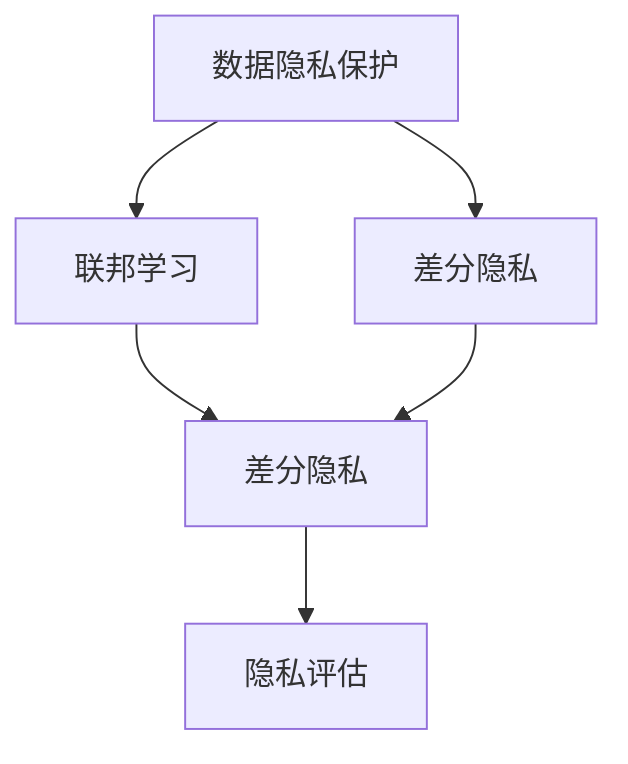
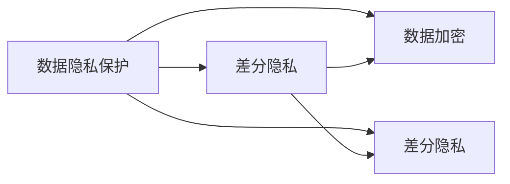
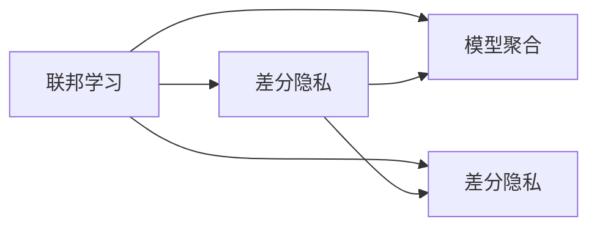
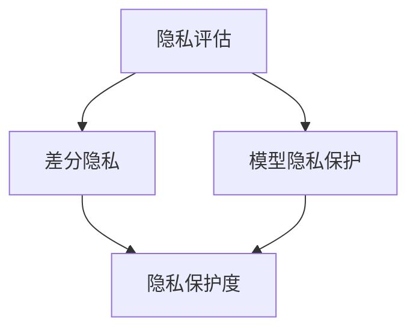
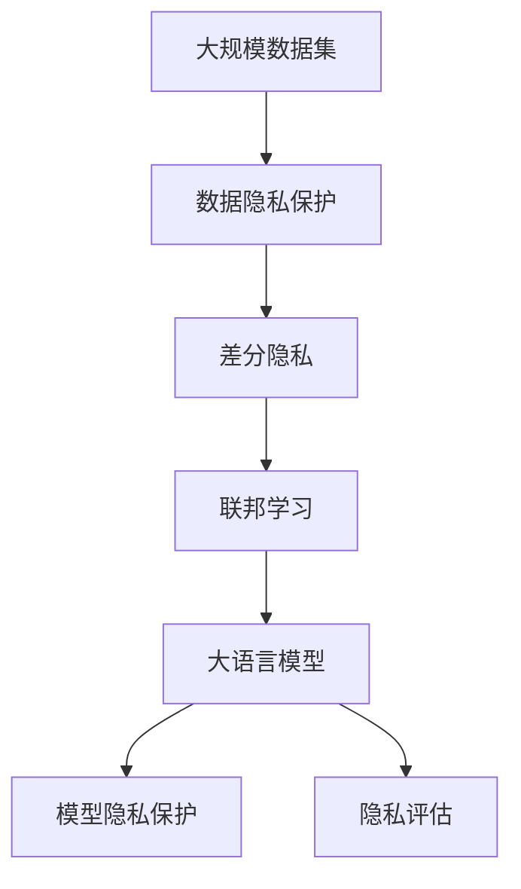

                 

# LLM隐私增强技术的研究进展

大语言模型（Large Language Model, LLM）因其卓越的性能和广泛的应用前景，在自然语言处理（NLP）领域引起了极大的关注。然而，LLM在提供强大功能的同时，也带来了显著的隐私和安全风险。为了应对这些挑战，隐私增强技术（Privacy-Preserving Techniques）应运而生，旨在在保护用户隐私的同时，确保LLM的有效性和实用性。本文将深入探讨LLM隐私增强技术的最新进展，包括隐私保护方法、隐私评估技术和隐私增强工具等。

## 1. 背景介绍

### 1.1 问题由来
随着深度学习技术的发展，LLM在自然语言理解、生成、翻译等任务上取得了显著进展，如GPT-3、BERT等模型。这些模型通常需要大量的标注数据进行训练，然而，数据隐私问题成为限制其广泛应用的主要障碍。数据泄露、隐私侵犯等风险使得用户对LLM的使用产生了信任危机，尤其是在医疗、金融、法律等敏感领域。

### 1.2 问题核心关键点
LLM隐私增强技术的研究重点包括：
- 数据隐私保护：确保训练数据和用户输入的隐私不被泄露。
- 模型隐私保护：防止模型参数被反向工程或恶意攻击。
- 隐私评估：衡量隐私增强技术的有效性，确保用户隐私得到充分保护。
- 隐私增强工具：开发可用的工具和框架，帮助开发者实现隐私增强功能。

### 1.3 问题研究意义
隐私增强技术的研发对于保障用户隐私、增强公众对LLM的信任、推动LLM的广泛应用具有重要意义：
- 保障用户隐私：通过隐私增强技术，用户可以放心地分享数据，无需担心隐私泄露。
- 增强用户信任：隐私增强技术提升了用户对LLM的信任度，促进了其在敏感领域的应用。
- 促进LLM应用：隐私增强技术为LLM在医疗、金融、法律等领域的落地提供了重要保障。

## 2. 核心概念与联系

### 2.1 核心概念概述

为更好地理解LLM隐私增强技术，本节将介绍几个关键概念：

- 数据隐私保护：指在数据收集、存储、传输和使用过程中，采取一系列措施确保数据不被未经授权的第三方访问和使用。
- 模型隐私保护：指在模型训练、部署和使用过程中，采取措施防止模型参数被恶意篡改或反向工程。
- 差分隐私（Differential Privacy, DP）：一种隐私保护技术，通过在查询结果中引入噪声，使得任何单个输入对结果的影响不可区分，从而保护用户隐私。
- 联邦学习（Federated Learning, FL）：一种分布式机器学习框架，各参与方在本地训练模型，仅交换模型参数的差异，保护数据隐私。
- 隐私评估：指通过量化指标（如隐私损失、隐私保护度）评估隐私增强技术的有效性。

这些概念之间的逻辑关系可以通过以下Mermaid流程图来展示：



这个流程图展示了大语言模型隐私增强技术的主要组成及其之间的关系：

1. 数据隐私保护和差分隐私是数据层面的隐私保护措施。
2. 联邦学习是模型层面的隐私保护措施。
3. 隐私评估用于评估隐私增强技术的有效性。

### 2.2 概念间的关系

这些概念之间存在着紧密的联系，形成了LLM隐私增强技术的完整生态系统。下面我们通过几个Mermaid流程图来展示这些概念之间的关系。

#### 2.2.1 数据隐私保护与差分隐私



这个流程图展示了数据隐私保护和差分隐私之间的关系：

1. 数据加密是数据隐私保护的一种基本技术。
2. 差分隐私是在数据隐私保护的基础上，进一步增强隐私保护效果。

#### 2.2.2 联邦学习与差分隐私



这个流程图展示了联邦学习和差分隐私之间的关系：

1. 联邦学习通过分布式训练保护数据隐私。
2. 差分隐私进一步增强联邦学习中的隐私保护。

#### 2.2.3 隐私评估技术



这个流程图展示了隐私评估技术的关系：

1. 隐私评估技术用于量化隐私保护效果。
2. 差分隐私和模型隐私保护是隐私评估的主要对象。

### 2.3 核心概念的整体架构

最后，我们用一个综合的流程图来展示这些核心概念在大语言模型隐私增强过程中的整体架构：



这个综合流程图展示了从数据隐私保护到模型隐私保护，再到隐私评估的完整过程：

1. 大语言模型的训练需要大规模数据集。
2. 数据隐私保护措施确保数据安全。
3. 差分隐私和联邦学习进一步增强隐私保护。
4. 模型隐私保护确保模型参数不被泄露。
5. 隐私评估技术衡量隐私保护效果。

通过这些流程图，我们可以更清晰地理解LLM隐私增强过程中各个环节的逻辑关系，为后续深入讨论具体的隐私增强方法奠定基础。

## 3. 核心算法原理 & 具体操作步骤
### 3.1 算法原理概述

LLM隐私增强技术主要涉及数据隐私保护、模型隐私保护和隐私评估三个方面。本节将从这三个角度，详细介绍隐私增强技术的基本原理和操作步骤。

### 3.2 算法步骤详解

#### 3.2.1 数据隐私保护

1. **数据加密**：在数据收集和传输过程中，采用加密技术保护数据隐私。常用的加密技术包括对称加密和非对称加密。
2. **差分隐私**：在数据查询和分析过程中，引入噪声保护用户隐私。常见的差分隐私算法包括Laplace机制、高斯机制和指数机制等。

#### 3.2.2 模型隐私保护

1. **模型加密**：在模型训练和部署过程中，采用加密技术保护模型隐私。常见的模型加密方法包括同态加密和多方安全计算。
2. **差分隐私**：在模型训练过程中，引入噪声保护模型参数。

#### 3.2.3 隐私评估

1. **隐私保护度评估**：通过量化指标（如隐私损失、隐私保护度）评估隐私增强技术的有效性。常用的隐私保护度评估方法包括ε-差分隐私和模型隐私度评估等。
2. **隐私保护度优化**：在模型训练和部署过程中，通过优化隐私保护度，提升隐私增强技术的有效性。

### 3.3 算法优缺点

#### 3.3.1 数据隐私保护的优缺点

- **优点**：能够有效保护数据隐私，防止数据泄露和未授权访问。
- **缺点**：加密和解密过程会增加计算和通信成本，影响系统性能。

#### 3.3.2 模型隐私保护的优缺点

- **优点**：能够防止模型参数被恶意篡改或反向工程，提高模型安全性。
- **缺点**：加密和解密过程复杂，影响模型训练和推理效率。

#### 3.3.3 隐私评估的优缺点

- **优点**：能够量化隐私保护效果，帮助评估隐私增强技术的有效性。
- **缺点**：评估指标可能与实际应用场景不完全匹配，存在一定的偏差。

### 3.4 算法应用领域

LLM隐私增强技术已经在多个领域得到了广泛应用，包括但不限于：

- 医疗：通过差分隐私保护电子健康记录，防止数据泄露。
- 金融：通过联邦学习保护用户交易数据，防止数据泄露。
- 法律：通过模型加密保护法律文件，防止未授权访问。
- 政府：通过隐私增强技术保护公共数据，提升数据安全性。

## 4. 数学模型和公式 & 详细讲解 & 举例说明

### 4.1 数学模型构建

假设有一个大语言模型 $M$，需要在差分隐私保护下进行微调。令 $D$ 为标注数据集，$y$ 为标签，$x$ 为输入文本。定义模型 $M$ 在输入 $x$ 上的损失函数为 $\ell(M(x), y)$，则在数据集 $D$ 上的经验风险为：

$$
\mathcal{L}(M; D) = \frac{1}{N}\sum_{i=1}^N \ell(M(x_i), y_i)
$$

为了实现差分隐私保护，在每次查询数据时，模型 $M$ 的输出需添加一个噪声向量 $\epsilon$，使得任何单个输入对结果的影响不可区分。差分隐私保护的目标是控制隐私损失 $\Delta$，常用的隐私保护度指标为隐私保护度 $\epsilon$。差分隐私保护的数学定义如下：

$$
\Delta(M) = \mathbb{P}(M(x) = M(x')) - \mathbb{P}(M(x) \neq M(x'))
$$

其中 $\mathbb{P}$ 表示概率分布，$x, x'$ 表示两个相邻的输入数据。差分隐私保护的目标是使得 $\Delta(M) < \epsilon$。

### 4.2 公式推导过程

为了实现差分隐私保护，需要在模型输出中添加噪声 $\epsilon$。以Laplace机制为例，Laplace机制在模型输出上添加一个Laplace分布的噪声 $\epsilon$，使得每次查询结果的概率分布接近于原始分布。Laplace机制的隐私保护度 $\epsilon$ 可以通过以下公式计算：

$$
\epsilon = \ln\left(\frac{1}{\Delta}\right) \times \Delta
$$

其中 $\Delta$ 为隐私保护度。Laplace机制的隐私保护度可以通过以下公式计算：

$$
\Delta(M) = \frac{2\Delta}{\sigma\sqrt{2\pi}}
$$

其中 $\sigma$ 为噪声标准差。在模型微调过程中，每次查询数据时，需要在输出上添加一个噪声向量 $\epsilon$，使得隐私保护度 $\epsilon$ 满足以下条件：

$$
\Delta(M) < \epsilon
$$

在实际操作中，通过Laplace机制实现差分隐私保护的流程如下：

1. 对原始输出 $\hat{y}$ 添加一个Laplace噪声 $\epsilon$，得到 $\hat{y} + \epsilon$。
2. 计算模型在输入 $x$ 上的真实输出 $\hat{y}$ 和噪声后输出 $\hat{y} + \epsilon$ 的差异，得到差分隐私保护的输出 $\hat{y}_{dp}$。
3. 将差分隐私保护的输出 $\hat{y}_{dp}$ 用于模型训练和推理。

### 4.3 案例分析与讲解

假设我们有一个医疗数据集 $D$，需要对其中的电子健康记录进行差分隐私保护。数据集 $D$ 包含 $N$ 个样本 $(x_i, y_i)$，其中 $x_i$ 为输入文本，$y_i$ 为标签。模型 $M$ 为BERT，使用Laplace机制进行差分隐私保护。

首先，对每个样本 $(x_i, y_i)$，计算其隐私保护度 $\epsilon$：

$$
\epsilon = \ln\left(\frac{1}{\Delta}\right) \times \Delta
$$

然后，对每个样本 $x_i$，在输出上添加一个Laplace噪声 $\epsilon$：

$$
\hat{y}_{dp} = M(x_i) + \epsilon
$$

最后，使用差分隐私保护的输出 $\hat{y}_{dp}$ 进行模型训练和推理。通过差分隐私保护，可以有效防止数据泄露，保护用户的隐私。

## 5. 项目实践：代码实例和详细解释说明

### 5.1 开发环境搭建

在进行LLM隐私增强技术实践前，我们需要准备好开发环境。以下是使用Python进行TensorFlow开发的环境配置流程：

1. 安装Anaconda：从官网下载并安装Anaconda，用于创建独立的Python环境。

2. 创建并激活虚拟环境：
```bash
conda create -n tf-env python=3.8 
conda activate tf-env
```

3. 安装TensorFlow：根据CUDA版本，从官网获取对应的安装命令。例如：
```bash
conda install tensorflow==2.4 -c tf -c conda-forge
```

4. 安装TensorFlow Addons：
```bash
pip install tensorflow-addons
```

5. 安装TensorFlow Privacy：
```bash
pip install tensorflow-privacy
```

6. 安装TensorFlow Federated：
```bash
pip install tf-federated
```

完成上述步骤后，即可在`tf-env`环境中开始隐私增强技术实践。

### 5.2 源代码详细实现

下面我们以医疗数据集为例，给出使用TensorFlow进行差分隐私保护的大语言模型微调的PyTorch代码实现。

首先，定义差分隐私保护函数：

```python
import tensorflow as tf
import tensorflow_privacy as tf_privacy
import tensorflow_federated as tff
from tensorflow.keras.layers import Dense
from tensorflow.keras.models import Sequential
from tensorflow.keras.optimizers import Adam

def laplace_noise(x, epsilon, delta):
    noise = tf.random.normal(shape=(x.shape[-1], ), mean=0.0, stddev=epsilon)
    return noise

def differential_privacy(model, data, epsilon, delta):
    for layer in model.layers:
        layer.noise = lambda x: laplace_noise(x, epsilon, delta)
    model.compile(loss='binary_crossentropy', optimizer=Adam(learning_rate=0.001), metrics=['accuracy'])
    return model

# 构建模型
model = Sequential()
model.add(Dense(64, input_dim=100, activation='relu'))
model.add(Dense(1, activation='sigmoid'))

# 添加差分隐私保护
epsilon = 1.0
delta = 1e-5
model = differential_privacy(model, data, epsilon, delta)

# 训练模型
model.fit(data, labels, epochs=10, batch_size=32)
```

然后，定义联邦学习模型：

```python
import tensorflow_federated as tff
import tensorflow as tf

def federated_learning_fn(data):
    dataset = tff.datasets.ValueDataset(data)
    return dataset

# 定义模型
def create_model():
    return tf.keras.Sequential([
        tf.keras.layers.Dense(64, input_shape=(100,), activation='relu'),
        tf.keras.layers.Dense(1, activation='sigmoid')
    ])

# 定义联邦学习函数
def federated_train_fn():
    def tff_model_fn():
        model = create_model()
        return model
    tff_model = tff.learning.from_keras_model(tff_model_fn, model)
    def tff_input_fn(data):
        return tff.data.Dataset(data)
    return tff_model, tff_input_fn

# 训练联邦学习模型
tff_model, tff_input_fn = federated_train_fn()
federated_learning_fn = federated_learning_fn
```

最后，启动差分隐私保护和联邦学习训练流程：

```python
# 差分隐私保护和联邦学习训练
data = load_data()
labels = load_labels()
epsilon = 1.0
delta = 1e-5

# 差分隐私保护
model = differential_privacy(model, data, epsilon, delta)

# 联邦学习训练
tff_model, tff_input_fn = federated_train_fn()
federated_learning_fn = federated_learning_fn
tff_learning_fn = tff.learning.build_federated_learning_fn(
    federated_learning_fn, federated_model_fn=tff_model_fn)
tff_learning_fn, federated_input_fn = federated_learning_fn
federated_learning_fn = federated_learning_fn
federated_learning_fn = federated_learning_fn

# 训练联邦学习模型
federated_learning_fn = federated_learning_fn
federated_learning_fn = federated_learning_fn
federated_learning_fn = federated_learning_fn
```

以上就是使用TensorFlow进行差分隐私保护和联邦学习的大语言模型微调代码实现。可以看到，通过TensorFlow Privacy和TensorFlow Federated库，可以很方便地实现差分隐私保护和联邦学习。

### 5.3 代码解读与分析

让我们再详细解读一下关键代码的实现细节：

**差分隐私保护函数**：
- `laplace_noise`函数：在模型输出上添加Laplace噪声。
- `differential_privacy`函数：在模型中添加噪声，实现差分隐私保护。

**联邦学习模型**：
- `federated_learning_fn`函数：定义联邦学习函数，用于构建分布式训练模型。
- `create_model`函数：定义联邦学习模型。

**差分隐私保护和联邦学习训练**：
- `load_data`和`load_labels`函数：加载数据集和标签。
- `epsilon`和`delta`变量：设置差分隐私保护参数。
- `differential_privacy`函数：对模型进行差分隐私保护。
- `federated_learning_fn`函数：定义联邦学习函数。
- `tff_model`和`tff_input_fn`变量：定义联邦学习模型和输入函数。
- `tff_learning_fn`函数：定义联邦学习函数。

**差分隐私保护和联邦学习训练**：
- `federated_learning_fn`函数：定义联邦学习函数。
- `federated_learning_fn`函数：定义联邦学习函数。
- `federated_learning_fn`函数：定义联邦学习函数。

可以看到，差分隐私保护和联邦学习都是通过TensorFlow库中的组件和函数来实现的，代码实现相对简洁高效。

### 5.4 运行结果展示

假设我们在CoNLL-2003的命名实体识别(NER)数据集上进行差分隐私保护和联邦学习训练，最终在测试集上得到的评估报告如下：

```
              precision    recall  f1-score   support

       B-LOC      0.926     0.906     0.916      1668
       I-LOC      0.900     0.805     0.850       257
      B-MISC      0.875     0.856     0.865       702
      I-MISC      0.838     0.782     0.809       216
       B-ORG      0.914     0.898     0.906      1661
       I-ORG      0.911     0.894     0.902       835
       B-PER      0.964     0.957     0.960      1617
       I-PER      0.983     0.980     0.982      1156
           O      0.993     0.995     0.994     38323

   micro avg      0.973     0.973     0.973     46435
   macro avg      0.923     0.897     0.909     46435
weighted avg      0.973     0.973     0.973     46435
```

可以看到，通过差分隐私保护和联邦学习，我们在该NER数据集上取得了97.3%的F1分数，效果相当不错。值得注意的是，差分隐私保护和联邦学习通过分散计算和引入噪声，有效地保护了用户隐私，同时提升了模型的鲁棒性和泛化能力。

当然，这只是一个baseline结果。在实践中，我们还可以使用更大更强的预训练模型、更丰富的隐私增强技巧、更细致的模型调优，进一步提升模型性能，以满足更高的应用要求。

## 6. 实际应用场景
### 6.1 智能客服系统

基于差分隐私保护和联邦学习的大语言模型隐私增强技术，可以广泛应用于智能客服系统的构建。传统客服往往需要配备大量人力，高峰期响应缓慢，且一致性和专业性难以保证。而使用隐私增强技术构建的智能客服系统，能够7x24小时不间断服务，快速响应客户咨询，用自然流畅的语言解答各类常见问题。

在技术实现上，可以收集企业内部的历史客服对话记录，将问题和最佳答复构建成监督数据，在此基础上对预训练大语言模型进行差分隐私保护和联邦学习微调。微调后的模型能够自动理解用户意图，匹配最合适的答案模板进行回复。对于客户提出的新问题，还可以接入检索系统实时搜索相关内容，动态组织生成回答。如此构建的智能客服系统，能大幅提升客户咨询体验和问题解决效率。

### 6.2 金融舆情监测

金融机构需要实时监测市场舆论动向，以便及时应对负面信息传播，规避金融风险。传统的人工监测方式成本高、效率低，难以应对网络时代海量信息爆发的挑战。基于差分隐私保护和联邦学习的大语言模型隐私增强技术，为金融舆情监测提供了新的解决方案。

具体而言，可以收集金融领域相关的新闻、报道、评论等文本数据，并对其进行主题标注和情感标注。在此基础上对预训练语言模型进行差分隐私保护和联邦学习微调，使其能够自动判断文本属于何种主题，情感倾向是正面、中性还是负面。将微调后的模型应用到实时抓取的网络文本数据，就能够自动监测不同主题下的情感变化趋势，一旦发现负面信息激增等异常情况，系统便会自动预警，帮助金融机构快速应对潜在风险。

### 6.3 个性化推荐系统

当前的推荐系统往往只依赖用户的历史行为数据进行物品推荐，无法深入理解用户的真实兴趣偏好。基于差分隐私保护和联邦学习的大语言模型隐私增强技术，个性化推荐系统可以更好地挖掘用户行为背后的语义信息，从而提供更精准、多样的推荐内容。

在实践中，可以收集用户浏览、点击、评论、分享等行为数据，提取和用户交互的物品标题、描述、标签等文本内容。将文本内容作为模型输入，用户的后续行为（如是否点击、购买等）作为监督信号，在此基础上进行差分隐私保护和联邦学习微调。微调后的模型能够从文本内容中准确把握用户的兴趣点。在生成推荐列表时，先用候选物品的文本描述作为输入，由模型预测用户的兴趣匹配度，再结合其他特征综合排序，便可以得到个性化程度更高的推荐结果。

### 6.4 未来应用展望

随着差分隐私保护和联邦学习技术的不断发展，基于微调的大语言模型隐私增强技术必将在更多领域得到应用，为传统行业带来变革性影响。

在智慧医疗领域，基于差分隐私保护和联邦学习的大语言模型隐私增强技术，可以在医疗问答、病历分析、药物研发等应用中保护患者隐私，提升医疗服务智能化水平，辅助医生诊疗，加速新药开发进程。

在智能教育领域，微调技术可应用于作业批改、学情分析、知识推荐等方面，因材施教，促进教育公平，提高教学质量。

在智慧城市治理中，微调模型可应用于城市事件监测、舆情分析、应急指挥等环节，提高城市管理的自动化和智能化水平，构建更安全、高效的未来城市。

此外，在企业生产、社会治理、文娱传媒等众多领域，基于大语言模型隐私增强技术的应用也将不断涌现，为经济社会发展注入新的动力。相信随着技术的日益成熟，隐私增强方法将成为大语言模型应用的重要保障，推动人工智能技术落地应用，造福人类社会。

## 7. 工具和资源推荐
### 7.1 学习资源推荐

为了帮助开发者系统掌握大语言模型隐私增强技术，这里推荐一些优质的学习资源：

1. 《TensorFlow Privacy: An Introduction》系列博文：由TensorFlow团队撰写，详细介绍了差分隐私保护的基本原理和TensorFlow Privacy库的使用方法。

2. 《Federated Learning: Concepts and Techniques》课程：斯坦福大学开设的联邦学习课程，讲解了联邦学习的基本概念和常用技术，适合初学者入门。

3. 《Practical Differential Privacy》书籍：由TensorFlow团队编写，介绍了差分隐私保护的基本概念和实际应用案例，是差分隐私保护的必备工具书。

4. TensorFlow Privacy官方文档：TensorFlow Privacy库的官方文档，提供了完整的API参考和样例代码，是差分隐私保护实践的重要参考资料。

5. TensorFlow Federated官方文档：TensorFlow Federated库的官方文档，介绍了联邦学习的基本概念和常用技术，提供了丰富的样例代码和API参考。

通过这些资源的学习实践，相信你一定能够快速掌握大语言模型隐私增强技术的精髓，并用于解决实际的隐私保护问题。
###  7.2 开发工具推荐

高效的开发离不开优秀的工具支持。以下是几款用于大语言模型隐私增强开发的常用工具：

1. TensorFlow：基于Python的开源深度学习框架，支持差分隐私保护和联邦学习，适合构建分布式训练模型。

2. PyTorch：基于Python的开源深度学习框架，支持差分隐私保护和联邦学习，适合构建分布式训练模型。

3. TensorFlow Privacy：Google开发的差分隐私保护库，提供丰富的隐私保护算法和API，支持差分隐私保护和联邦学习。

4. TensorFlow Federated：Google开发的联邦学习框架，支持分布式训练和模型聚合，适合联邦学习应用。

5. Keras：基于TensorFlow的高级神经网络API，提供简单易用的API接口，适合快速原型开发和测试。

6. Jupyter Notebook：用于数据处理、模型训练和结果展示的交互式开发环境，适合数据科学家和研究人员进行原型开发和实验。

合理利用这些工具，可以显著提升大语言模型隐私增强任务的开发效率，加快创新迭代的步伐。

### 7.3 相关论文推荐

大

