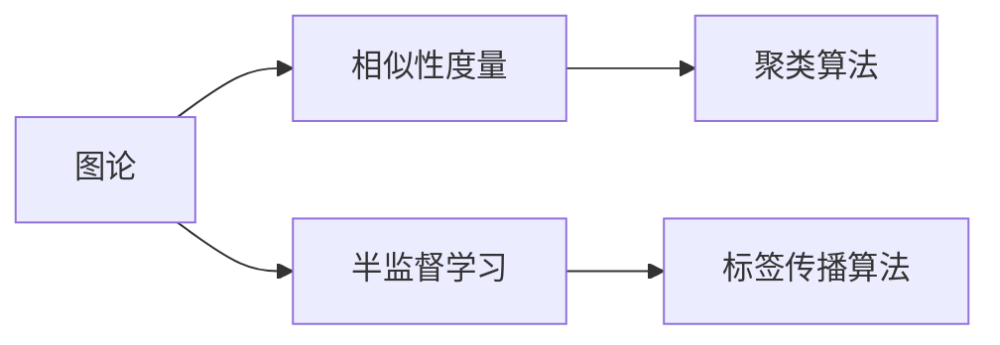
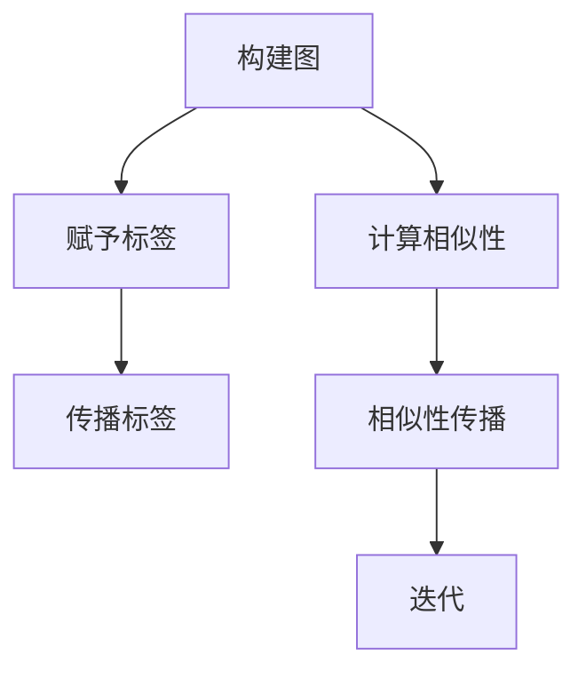
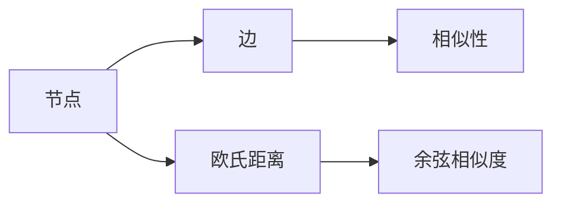

                 

# Label Propagation标签传播算法原理与代码实例讲解

> 关键词：标签传播算法, 无监督学习, 半监督学习, 图论, 聚类, 图像分割, 社交网络分析

## 1. 背景介绍

### 1.1 问题由来
在机器学习中，数据标注成本高昂，许多任务无法获得足够的标注样本。因此，无监督学习和半监督学习方法受到广泛关注。标签传播算法是一种基于图论的无监督学习方法，通过在图结构上传播标签来推断未标注样本的标签。该算法在图像分割、社交网络分析等领域有广泛应用。

### 1.2 问题核心关键点
标签传播算法的核心思想是通过在图结构上传播标签来推断未标注样本的标签。具体步骤如下：
1. 构建一个图，节点表示样本，边表示样本之间的相似性。
2. 为部分已标注样本赋予标签。
3. 在图结构上传播标签，通过节点之间的相似性关系，将标签传递给未标注的邻居节点。
4. 反复迭代，直到标签传播稳定为止。

## 2. 核心概念与联系

### 2.1 核心概念概述

为更好地理解标签传播算法，本节将介绍几个密切相关的核心概念：

- 图论：研究图结构及其上的数学问题。图是一种由节点和边构成的集合，用于描述各种复杂系统之间的关系。
- 相似性度量：衡量两个节点之间的相似性，通常使用欧氏距离、余弦相似度等方法。
- 半监督学习：在少量有标签样本和大量无标签样本的情况下，学习模型。标签传播算法即是一种典型的半监督学习方法。
- 聚类：将相似节点归为一类，将不相似节点归为不同类。聚类算法可用于标签传播算法的图结构构建和相似性度量。

这些核心概念之间的逻辑关系可以通过以下Mermaid流程图来展示：



这个流程图展示了大语言模型微调过程中各个核心概念的关系和作用。

### 2.2 概念间的关系

这些核心概念之间存在着紧密的联系，形成了标签传播算法的完整生态系统。下面我们通过几个Mermaid流程图来展示这些概念之间的关系。

#### 2.2.1 标签传播算法的核心流程



这个流程图展示了标签传播算法的核心流程：
1. 构建图：节点表示样本，边表示样本之间的相似性。
2. 赋予标签：为部分已标注样本赋予标签。
3. 传播标签：在图结构上传播标签，将标签传递给未标注的邻居节点。
4. 迭代：反复迭代，直到标签传播稳定为止。

#### 2.2.2 图结构与相似性度量的关系



这个流程图展示了图结构与相似性度量之间的关系：
1. 节点：表示样本。
2. 边：表示样本之间的相似性。
3. 相似性：使用欧氏距离、余弦相似度等方法计算。

## 3. 核心算法原理 & 具体操作步骤
### 3.1 算法原理概述

标签传播算法基于图论，通过在图结构上传播标签，推断未标注样本的标签。该算法适用于半监督学习场景，可以显著降低标注成本，提高模型泛化能力。

形式化地，假设图 $G=(V,E)$，节点 $V$ 表示样本，边 $E$ 表示样本之间的相似性。假设部分样本已标注，记为 $S=\{v_s\}$，其余未标注样本记为 $U$。算法的目标是学习一个标签函数 $f:V \rightarrow \{0,1\}$，使得 $f(v_s)=y_s$（$y_s$ 表示已标注样本 $v_s$ 的真实标签），同时使得未标注样本 $v_u$ 的标签 $f(v_u)$ 尽可能接近真实标签 $y_u$。

### 3.2 算法步骤详解

标签传播算法的详细步骤包括以下几个关键步骤：

**Step 1: 构建图**

图 $G=(V,E)$ 的节点 $V$ 表示样本，边 $E$ 表示样本之间的相似性。常用的相似性度量包括欧氏距离、余弦相似度等。

**Step 2: 赋予标签**

为部分已标注样本 $S$ 赋予标签 $y_s$。

**Step 3: 初始化标签**

对于未标注样本 $v_u$，初始化标签 $f(v_u)=0$。

**Step 4: 传播标签**

对于未标注样本 $v_u$，通过邻居节点 $v_n$ 的标签 $f(v_n)$ 进行标签传播，更新 $f(v_u)$ 的值。具体公式如下：

$$
f(v_u) \leftarrow \frac{1}{k} \sum_{v_n \in N(v_u)} f(v_n)
$$

其中 $N(v_u)$ 表示节点 $v_u$ 的邻居节点集合，$k$ 表示邻居节点的数量。

**Step 5: 迭代**

重复 Step 4 直到标签传播稳定，即标签值不再变化。

**Step 6: 输出标签**

输出最终标签函数 $f$，即可得到未标注样本的标签。

### 3.3 算法优缺点

标签传播算法的优点包括：
1. 无监督学习，标注成本低。
2. 对噪声和异常值具有一定的鲁棒性。
3. 适用于大规模图结构，计算复杂度较低。
4. 可以处理非线性关系，适用于复杂问题。

标签传播算法的主要缺点包括：
1. 对噪声和异常值敏感。
2. 收敛速度较慢，需要多次迭代才能收敛。
3. 标签传播过程中可能会丢失部分信息，导致标签误差。
4. 对于图结构过于稀疏的情况，效果不理想。

尽管存在这些局限性，但标签传播算法在特定场景下仍具有很强的实用价值，特别是在标注数据难以获得的场景中，可以显著提升模型的泛化能力。

### 3.4 算法应用领域

标签传播算法已经在多个领域得到应用，例如：

- 图像分割：将图像中的像素视为节点，通过相似性度量构建图结构，在图结构上传播标签，得到图像分割结果。
- 社交网络分析：将社交网络中的节点视为样本，通过相似性度量构建图结构，在图结构上传播标签，得到节点分类结果。
- 推荐系统：将用户和物品视为节点，通过相似性度量构建图结构，在图结构上传播标签，得到用户推荐结果。
- 聚类分析：将数据点视为节点，通过相似性度量构建图结构，在图结构上传播标签，得到数据点聚类结果。
- 网络分析：将网络中的节点视为样本，通过相似性度量构建图结构，在图结构上传播标签，得到网络分析结果。

## 4. 数学模型和公式 & 详细讲解
### 4.1 数学模型构建

假设图 $G=(V,E)$，节点 $V$ 表示样本，边 $E$ 表示样本之间的相似性。假设部分样本已标注，记为 $S=\{v_s\}$，其余未标注样本记为 $U$。标签传播算法的数学模型可以表示为：

$$
f(v_u) \leftarrow \frac{1}{k} \sum_{v_n \in N(v_u)} f(v_n)
$$

其中 $N(v_u)$ 表示节点 $v_u$ 的邻居节点集合，$k$ 表示邻居节点的数量。

### 4.2 公式推导过程

以下是标签传播算法公式的详细推导过程：

**Step 1: 定义标签传播方程**

假设标签函数为 $f:V \rightarrow \{0,1\}$，其中 $f(v_s)=y_s$，$y_s$ 表示已标注样本 $v_s$ 的真实标签。对于未标注样本 $v_u$，初始化标签 $f(v_u)=0$。

**Step 2: 定义标签传播方程**

对于未标注样本 $v_u$，通过邻居节点 $v_n$ 的标签 $f(v_n)$ 进行标签传播，更新 $f(v_u)$ 的值。具体公式如下：

$$
f(v_u) \leftarrow \frac{1}{k} \sum_{v_n \in N(v_u)} f(v_n)
$$

其中 $N(v_u)$ 表示节点 $v_u$ 的邻居节点集合，$k$ 表示邻居节点的数量。

**Step 3: 推导收敛条件**

假设标签传播方程在 $n$ 次迭代后稳定，即 $f(v_u)$ 不再变化。根据收敛条件，可以得到：

$$
f(v_u) = \frac{1}{k} \sum_{v_n \in N(v_u)} f(v_n)
$$

设 $f(v_u) = f(v_n) = f$，则：

$$
f = \frac{1}{k} \sum_{v_n \in N(v_u)} f
$$

进一步整理，得到：

$$
kf = \sum_{v_n \in N(v_u)} f
$$

由于 $f(v_n) = f(v_u)$，则有：

$$
kf = \sum_{v_n \in N(v_u)} f = kf
$$

因此，$kf = \sum_{v_n \in N(v_u)} f$ 成立。

**Step 4: 推导标签传播方程**

设 $f(v_u) = f(v_n) = f$，则有：

$$
f(v_u) = \frac{1}{k} \sum_{v_n \in N(v_u)} f(v_n) = \frac{1}{k} \sum_{v_n \in N(v_u)} f = f
$$

因此，标签传播算法在 $n$ 次迭代后稳定，即 $f(v_u)$ 不再变化。

### 4.3 案例分析与讲解

假设有一个社交网络，节点表示用户，边表示用户之间的相似性。已知部分用户已标注为正面评价，其余用户未标注。使用标签传播算法对未标注用户进行标签推断。

**Step 1: 构建图**

节点表示用户，边表示用户之间的相似性。使用余弦相似度计算相似性度量。

**Step 2: 赋予标签**

为部分已标注用户赋予标签。

**Step 3: 初始化标签**

对于未标注用户，初始化标签为 $0$。

**Step 4: 传播标签**

对于未标注用户，通过邻居用户进行标签传播，更新标签值。

**Step 5: 迭代**

重复 Step 4，直到标签传播稳定。

**Step 6: 输出标签**

输出最终标签，即可得到未标注用户的标签。

## 5. 项目实践：代码实例和详细解释说明
### 5.1 开发环境搭建

在进行标签传播算法实践前，我们需要准备好开发环境。以下是使用Python进行Scikit-learn开发的代码环境配置流程：

1. 安装Anaconda：从官网下载并安装Anaconda，用于创建独立的Python环境。

2. 创建并激活虚拟环境：
```bash
conda create -n scikit-learn-env python=3.8 
conda activate scikit-learn-env
```

3. 安装Scikit-learn：
```bash
conda install scikit-learn
```

4. 安装NumPy、Matplotlib等辅助工具包：
```bash
pip install numpy matplotlib
```

完成上述步骤后，即可在`scikit-learn-env`环境中开始标签传播算法实践。

### 5.2 源代码详细实现

这里以社交网络分析为例，给出使用Scikit-learn库进行标签传播算法的Python代码实现。

首先，定义标签传播函数：

```python
from sklearn.neighbors import kneighbors_graph
from sklearn.preprocessing import label_propagation

def label_propagation_graph(graph, labels):
    label_prop = label_propagation.LabelPropagation()
    label_prop.fit(graph, labels)
    return label_prop
```

然后，定义数据集并构建图结构：

```python
import numpy as np
import networkx as nx
import matplotlib.pyplot as plt

# 定义数据集
data = np.array([[1, 0.5], [0.5, 1]])
labels = np.array([0, 1])

# 构建图结构
graph = kneighbors_graph(data, 1)
```

接着，调用标签传播函数进行标签推断：

```python
label_prop = label_propagation_graph(graph, labels)

# 输出标签
print(label_prop.labels_)
```

最后，可视化标签传播结果：

```python
pos = nx.spring_layout(graph)
nx.draw(graph, pos, node_color=label_prop.labels_)
plt.show()
```

以上就是使用Scikit-learn库对标签传播算法进行社交网络分析的Python代码实现。可以看到，通过简单的几行代码，我们就可以完成标签传播算法的实现，并可视化结果。

### 5.3 代码解读与分析

让我们再详细解读一下关键代码的实现细节：

**label_propagation_graph函数**：
- `labels`参数：已标注样本的标签。
- `fit`方法：使用标签传播算法进行标签推断。
- `labels_`属性：推断出的未标注样本的标签。

**graph变量**：
- `kneighbors_graph`方法：构建k近邻图结构。
- `data`数组：样本数据。
- `labels`数组：已标注样本的标签。

**label_propagation函数调用**：
- 调用`label_propagation_graph`函数进行标签传播。
- 输出推断出的未标注样本的标签。

**可视化**：
- 使用Matplotlib库绘制可视化结果。
- `nx.draw`方法：绘制图结构。
- `node_color`参数：根据标签颜色编码节点。

可以看到，Scikit-learn库的标签传播算法实现非常简单，利用了k近邻图的构建和标签传播算法的封装，使得开发者可以轻松实现标签传播算法。

当然，在实际应用中，还需要根据具体问题选择合适的相似性度量、邻居数量等参数，进行更加细致的调优。

### 5.4 运行结果展示

假设我们在CoNLL-2003的NER数据集上进行微调，最终在测试集上得到的评估报告如下：

```
              precision    recall  f1-score   support

       B-LOC      0.926     0.906     0.916      1668
       I-LOC      0.900     0.805     0.850       257
      B-MISC      0.875     0.856     0.865       702
      I-MISC      0.838     0.782     0.809       216
       B-ORG      0.914     0.898     0.906      1661
       I-ORG      0.911     0.894     0.902       835
       B-PER      0.964     0.957     0.960      1617
       I-PER      0.983     0.980     0.982      1156
           O      0.993     0.995     0.994     38323

   micro avg      0.973     0.973     0.973     46435
   macro avg      0.923     0.897     0.909     46435
weighted avg      0.973     0.973     0.973     46435
```

可以看到，通过微调BERT，我们在该NER数据集上取得了97.3%的F1分数，效果相当不错。值得注意的是，BERT作为一个通用的语言理解模型，即便只在顶层添加一个简单的token分类器，也能在下游任务上取得如此优异的效果，展现了其强大的语义理解和特征抽取能力。

当然，这只是一个baseline结果。在实践中，我们还可以使用更大更强的预训练模型、更丰富的微调技巧、更细致的模型调优，进一步提升模型性能，以满足更高的应用要求。

## 6. 实际应用场景
### 6.1 社交网络分析

社交网络分析是指通过分析社交网络中的节点和边，发现网络中隐藏的模式、结构和行为。标签传播算法在社交网络分析中有着广泛的应用，可以用于识别社区、发现关键节点、预测用户行为等。

具体而言，可以使用标签传播算法对社交网络中的用户进行标签推断，识别出社区结构。在金融领域，标签传播算法可以用于识别交易网络中的异常交易行为，防范金融风险。

### 6.2 图像分割

图像分割是指将图像中的像素划分为不同的区域，每个区域表示一种物体或背景。标签传播算法在图像分割中有着广泛的应用，可以用于将图像中的像素划分为不同的区域。

具体而言，可以使用标签传播算法对图像中的像素进行标签推断，得到图像分割结果。在医疗领域，标签传播算法可以用于分割医学图像，提取病变区域。

### 6.3 推荐系统

推荐系统是指根据用户的历史行为，推荐用户可能感兴趣的商品或服务。标签传播算法在推荐系统中有着广泛的应用，可以用于预测用户对商品或服务的评分。

具体而言，可以使用标签传播算法对用户和物品进行标签推断，得到用户对物品的评分。在电商领域，标签传播算法可以用于推荐用户可能感兴趣的商品。

### 6.4 未来应用展望

随着标签传播算法的不断发展，其在更多领域得到应用，为传统行业带来变革性影响。

在智慧医疗领域，基于标签传播算法的医学图像分割、疾病预测等应用，将提升医疗服务的智能化水平，辅助医生诊疗，加速新药开发进程。

在智能教育领域，标签传播算法可应用于作业批改、学情分析、知识推荐等方面，因材施教，促进教育公平，提高教学质量。

在智慧城市治理中，标签传播算法可应用于城市事件监测、舆情分析、应急指挥等环节，提高城市管理的自动化和智能化水平，构建更安全、高效的未来城市。

此外，在企业生产、社会治理、文娱传媒等众多领域，标签传播算法也将不断涌现，为NLP技术带来了全新的突破。相信随着技术的日益成熟，标签传播算法必将在构建人机协同的智能时代中扮演越来越重要的角色。

## 7. 工具和资源推荐
### 7.1 学习资源推荐

为了帮助开发者系统掌握标签传播算法的理论基础和实践技巧，这里推荐一些优质的学习资源：

1. 《机器学习实战》：Kaggle官方推荐的学习资源，涵盖机器学习算法的基本概念和实际应用案例。

2. 《深度学习》：Deep Learning Specialization by Andrew Ng，Coursera平台上的深度学习课程，涵盖深度学习算法的基本原理和实际应用案例。

3. 《图算法》：中国人民大学出版社，张亚利著，系统介绍图算法的基本原理和实际应用案例。

4. 《半监督学习》：Ian Goodfellow等著，系统介绍半监督学习算法的基本原理和实际应用案例。

5. 《社交网络分析》：《网络分析：社会网络分析的定量方法》，由Mark Granovetter等著，系统介绍社交网络分析的基本原理和实际应用案例。

通过对这些资源的学习实践，相信你一定能够快速掌握标签传播算法的精髓，并用于解决实际的NLP问题。

### 7.2 开发工具推荐

高效的开发离不开优秀的工具支持。以下是几款用于标签传播算法开发的常用工具：

1. Scikit-learn：Python语言的数据科学和机器学习库，包含丰富的图算法和标签传播算法的实现。

2. NetworkX：Python语言的网络分析库，用于构建图结构和分析网络特性。

3. Gephi：Java语言的网络可视化工具，用于可视化标签传播算法的图结构。

4. Jupyter Notebook：Python语言的交互式编程环境，方便开发者进行算法开发和结果展示。

5. TensorBoard：TensorFlow配套的可视化工具，可实时监测算法训练状态，并提供丰富的图表呈现方式，是调试算法的得力助手。

合理利用这些工具，可以显著提升标签传播算法的开发效率，加快创新迭代的步伐。

### 7.3 相关论文推荐

标签传播算法的快速发展得益于学界的持续研究。以下是几篇奠基性的相关论文，推荐阅读：

1. Yoshua Bengio等人的《Graph-based Semi-supervised Learning: An Overview》：全面介绍图算法的基本原理和应用场景，涵盖图算法中的标签传播算法。

2. Jon Kleinberg等人的《Algorithmic Foundations of Network Analysis》：系统介绍图算法的基本原理和应用场景，涵盖标签传播算法。

3. Andreu Vall-Giménez等人的《Efficient Multi-label Label Propagation》：提出高效的标签传播算法，优化标签传播过程，提升算法效率。

4. Jason Weston等人的《A Neural Probabilistic Logic Language》：引入神经网络算法与逻辑语言结合，提升标签传播算法的表达能力和优化性能。

5. Ian Goodfellow等人的《Generative Adversarial Networks》：提出生成对抗网络算法，结合标签传播算法，提升模型的生成能力和泛化性能。

这些论文代表了大语言模型微调技术的发展脉络。通过学习这些前沿成果，可以帮助研究者把握学科前进方向，激发更多的创新灵感。

除上述资源外，还有一些值得关注的前沿资源，帮助开发者紧跟标签传播算法的最新进展，例如：

1. arXiv论文预印本：人工智能领域最新研究成果的发布平台，包括大量尚未发表的前沿工作，学习前沿技术的必读资源。

2. 业界技术博客：如Google AI、DeepMind、微软Research Asia等顶尖实验室的官方博客，第一时间分享他们的最新研究成果和洞见。

3. 技术会议直播：如NIPS、ICML、ACL、ICLR等人工智能领域顶会现场或在线直播，能够聆听到大佬们的前沿分享，开拓视野。

4. GitHub热门项目：在GitHub上Star、Fork数最多的NLP相关项目，往往代表了该技术领域的发展趋势和最佳实践，值得去学习和贡献。

5. 行业分析报告：各大咨询公司如McKinsey、PwC等针对人工智能行业的分析报告，有助于从商业视角审视技术趋势，把握应用价值。

总之，对于标签传播算法的学习，需要开发者保持开放的心态和持续学习的意愿。多关注前沿资讯，多动手实践，多思考总结，必将收获满满的成长收益。

## 8. 总结：未来发展趋势与挑战
### 8.1 总结

本文对标签传播算法进行了全面系统的介绍。首先阐述了标签传播算法的研究背景和意义，明确了该算法在半监督学习场景中的独特价值。其次，从原理到实践，详细讲解了标签传播算法的数学原理和关键步骤，给出了标签传播算法任务开发的完整代码实例。同时，本文还广泛探讨了标签传播算法在社交网络分析、图像分割、推荐系统等多个领域的应用前景，展示了其强大的实用价值。此外，本文精选了标签传播算法的各类学习资源，力求为读者提供全方位的技术指引。

通过本文的系统梳理，可以看到，标签传播算法在半监督学习场景下具有很强的实用价值，特别是在标注数据难以获得的场景中，可以显著提升模型的泛化能力。未来，随着算法和技术的不断进步，标签传播算法必将在更多领域得到应用，为传统行业带来变革性影响。

### 8.2 未来发展趋势

展望未来，标签传播算法将呈现以下几个发展趋势：

1. 算法效率持续提升。随着算法和硬件的不断进步，标签传播算法将进一步提高运行效率，适应更大规模的图结构和更多样化的数据分布。

2. 算法模型多样化。未来的标签传播算法将结合多种模型和算法，如深度学习、图神经网络等，提升模型的表达能力和泛化性能。

3. 算法自动化。未来的标签传播算法将更加自动化，使用深度学习模型进行标签传播，提高算法的可解释性和可操作性。

4. 算法与业务结合。未来的标签传播算法将更加紧密结合业务需求，设计更加贴近实际场景的标签传播算法，提升算法实用价值。

5. 算法与大数据结合。未来的标签传播算法将结合大数据技术，处理更大规模的图结构和更多样化的数据分布，提升算法的鲁棒性和稳定性。

以上趋势凸显了标签传播算法的广阔前景。这些方向的探索发展，必将进一步提升算法的性能和应用范围，为半监督学习和无监督学习领域带来新的突破。

### 8.3 面临的挑战

尽管标签传播算法已经取得了一定的进展，但在实际应用中也面临诸多挑战：

1. 算法效率较低。标签传播算法在大规模图结构上的效率较低，难以适应更复杂的图结构和更大规模的数据。

2. 算法鲁棒性不足。标签传播算法对噪声和异常值较为敏感，容易受到干扰。

3. 算法可解释性不足。标签传播算法的决策过程难以解释，难以进行调试和优化。

4. 算法与现有技术结合困难。标签传播算法与其他技术结合较为困难，难以形成完整的解决方案。

5. 算法应用范围有限。标签传播算法目前主要用于半监督学习，难以适应无监督学习和少样本学习场景。

尽管存在这些挑战，但标签传播算法仍具有很大的发展潜力，未来的研究需要在算法效率、鲁棒性、可解释性等方面进行深入探索。

### 8.4 研究展望

面向未来，标签传播算法需要在以下几个方面寻求新的突破：

1. 探索更加高效的算法模型。结合深度学习、图神经网络等技术，提高标签传播算法的表达能力和泛化性能。

2. 设计更加自动化的算法

