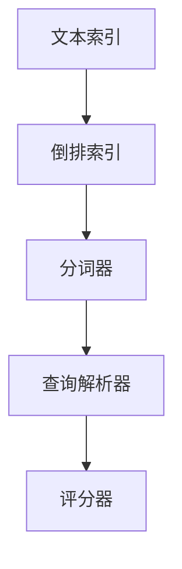
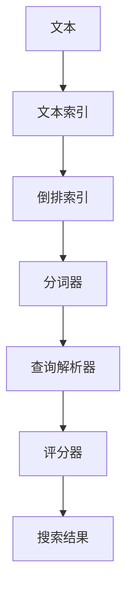

                 

# Lucene搜索原理与代码实例讲解

> 关键词：搜索引擎, 文本索引, 信息检索, 倒排索引, 分词器, 文本查询, 性能优化

## 1. 背景介绍

### 1.1 问题由来
在数字化信息爆炸的时代，如何快速高效地获取所需信息成为每个人面临的挑战。搜索引擎作为一种重要的信息获取工具，广泛应用于互联网、图书馆、企业文档管理等各个领域，成为了信息检索的关键技术。Lucene作为Apache基金会的一个开源搜索引擎项目，通过提供灵活、高效、可扩展的搜索引擎实现，成为全球范围内使用最广泛的搜索引擎之一。

### 1.2 问题核心关键点
Lucene的核心技术包括文本索引、倒排索引、分词器、查询解析和评分等，它们共同构成了Lucene的搜索体系。文本索引技术将文本数据转换成一种可以高效查询的格式；倒排索引是一种基于关键词的索引技术，可以高效地支持文本检索；分词器用于将文本分成词汇单元，以便进行索引和查询；查询解析器将用户输入的自然语言查询转化为标准的查询表达式；评分器根据查询和文档的相关性进行排序。

Lucene还提供了丰富的扩展接口，如Solr、ElasticSearch等，使得搜索引擎的开发和部署变得简单高效。同时，Lucene还提供了一系列用于性能调优的工具和策略，如索引优化、查询重写、缓存机制等，确保了其在高性能应用场景下的高效性和稳定性。

## 2. 核心概念与联系

### 2.1 核心概念概述

为更好地理解Lucene的搜索原理，本节将介绍几个关键的概念：

- 文本索引(Text Indexing)：将文本数据转换成一种可以高效查询的格式，通常采用倒排索引的方式。
- 倒排索引(Inverted Index)：基于关键词的索引技术，可以快速定位包含特定关键词的文档位置。
- 分词器(Tokener)：将文本分解成词汇单元，以便进行索引和查询。
- 查询解析器(Query Parser)：将用户输入的自然语言查询转化为标准的查询表达式。
- 评分器(Ranking Algorithm)：根据查询和文档的相关性进行排序，选出最相关的文档。

这些核心概念之间的逻辑关系可以通过以下Mermaid流程图来展示：



这个流程图展示了大语言模型微调过程中各个核心概念之间的关系：

1. 文本索引是倒排索引的基础，将文本数据转换成一种可以高效查询的格式。
2. 倒排索引基于关键词，快速定位包含特定关键词的文档位置。
3. 分词器用于将文本分解成词汇单元，以便进行索引和查询。
4. 查询解析器将用户输入的自然语言查询转化为标准的查询表达式。
5. 评分器根据查询和文档的相关性进行排序，选出最相关的文档。

### 2.2 概念间的关系

这些核心概念之间存在着紧密的联系，形成了Lucene搜索的核心技术体系。下面我们通过几个Mermaid流程图来展示这些概念之间的关系。

#### 2.2.1 倒排索引的构建


这个流程图展示了倒排索引的构建过程。首先将文档输入到分词器中进行分词，然后基于词汇单元构建倒排索引。

#### 2.2.2 查询解析


这个流程图展示了查询解析的过程。首先对用户输入的自然语言查询进行解析，然后将其转化为标准的查询表达式。

#### 2.2.3 评分器的运行


这个流程图展示了评分器的运行过程。首先对查询表达式进行评分，然后根据得分进行排序，选出最相关的文档。

### 2.3 核心概念的整体架构

最后，我们用一个综合的流程图来展示这些核心概念在大语言模型微调过程中的整体架构：



这个综合流程图展示了文本索引、倒排索引、分词器、查询解析器和评分器在大语言模型微调过程中的整体架构。

## 3. 核心算法原理 & 具体操作步骤
### 3.1 算法原理概述

Lucene的搜索原理主要基于倒排索引技术，通过将文本数据索引化，实现高效、快速的文本查询。其核心思想是，将文本数据按照关键词进行分割，构建倒排索引，然后根据查询词快速定位包含特定关键词的文档位置，从而实现文本检索。

Lucene的搜索过程可以分为以下几个步骤：

1. 分词：将输入文本分割成词汇单元，以便进行索引和查询。
2. 构建倒排索引：基于词汇单元构建倒排索引，将每个词汇单元对应的文档位置记录下来。
3. 查询解析：将用户输入的自然语言查询转化为标准的查询表达式。
4. 查询匹配：在倒排索引中查找与查询表达式匹配的文档位置。
5. 评分和排序：根据查询和文档的相关性进行评分，并对文档进行排序，选出最相关的文档。

### 3.2 算法步骤详解

Lucene的搜索过程可以分为以下几个关键步骤：

**Step 1: 分词**
将输入文本按照词汇单元进行分割，以便进行索引和查询。Lucene提供了多种分词器，如标准分词器、中文分词器等，可以根据文本语言和应用场景选择适合的分词器。

**Step 2: 构建倒排索引**
基于分词后的词汇单元构建倒排索引。倒排索引包括词汇单元、文档编号、文档位置等字段，记录了每个词汇单元在哪些文档中出现，以及具体的文档位置。

**Step 3: 查询解析**
将用户输入的自然语言查询转化为标准的查询表达式。查询解析器可以识别常见的查询运算符，如AND、OR、NOT等，并将查询转化为逻辑表达式。

**Step 4: 查询匹配**
在倒排索引中查找与查询表达式匹配的文档位置。查询匹配过程分为两步，首先根据查询词在倒排索引中查找匹配的文档位置，然后根据查询运算符对文档位置进行组合。

**Step 5: 评分和排序**
根据查询和文档的相关性进行评分，并对文档进行排序，选出最相关的文档。评分器通常使用BM25算法，根据查询词和文档的相关性计算得分，然后按照得分对文档进行排序。

### 3.3 算法优缺点

Lucene作为一种开源搜索引擎技术，具有以下优点：

1. 灵活高效：Lucene提供了丰富的接口和插件，可以灵活地扩展功能，支持大规模文本数据的索引和查询。
2. 可扩展性好：Lucene支持水平扩展，可以通过多节点分布式部署，提高索引和查询的性能。
3. 兼容性好：Lucene支持多种文本编码格式，如UTF-8、GBK等，适应不同的应用场景。
4. 社区支持：Lucene作为Apache基金会的开源项目，有庞大的社区支持，提供了大量的文档、示例和插件。

同时，Lucene也存在一些缺点：

1. 性能瓶颈：在大规模数据集上， Lucene的性能会受到内存和磁盘IO的限制。
2. 分词器不够丰富：虽然 Lucene提供了多种分词器，但对于一些特定语言和应用场景，可能需要进行自定义分词器的开发。
3. 查询语言限制：Lucene的查询语言相对简单，对于复杂的查询需求，可能需要额外的处理。
4. 学习成本高：Lucene的复杂性较高，对于初学者可能需要一定的学习成本。

### 3.4 算法应用领域

Lucene作为一种通用的搜索引擎技术，广泛应用于各个领域，包括但不限于：

- 搜索引擎：如Google、百度等大型搜索引擎的索引和查询服务。
- 文本分析：文本聚类、情感分析、文本分类等文本分析任务。
- 文档管理：企业文档管理系统、知识库管理系统等。
- 数据挖掘：大数据分析、数据预处理等。

## 4. 数学模型和公式 & 详细讲解 & 举例说明

### 4.1 数学模型构建

Lucene的搜索模型可以形式化地表示为：

$$
Q = T + F + L + R
$$

其中，$Q$表示查询表达式，$T$表示分词器，$F$表示倒排索引，$L$表示查询解析器，$R$表示评分器。

以Lucene中的BM25评分模型为例，其数学模型可以表示为：

$$
\text{score} = \sum_i w_i \times \text{tf}_i \times \text{df}_i \times (1 + k_1 \times \frac{l_i}{l}) \times (1 - k_3 \times l_i \times \text{df}_i / l)
$$

其中，$w_i$表示查询词权重，$\text{tf}_i$表示文档$i$中查询词的词频，$\text{df}_i$表示查询词在倒排索引中出现的文档数量，$l_i$表示文档$i$的长度，$l$表示平均文档长度，$k_1$和$k_3$是BM25算法中的超参数。

### 4.2 公式推导过程

以下是BM25评分模型推导过程的详细步骤：

1. 查询词权重：$w_i$表示查询词$i$的权重，通常由查询词在查询中的位置和出现频率决定。

2. 文档词频：$\text{tf}_i$表示文档$i$中查询词的词频，通常由查询词在文档中的出现次数决定。

3. 查询词文档频率：$\text{df}_i$表示查询词在倒排索引中出现的文档数量。

4. 文档长度：$l_i$表示文档$i$的长度。

5. 平均文档长度：$l$表示所有文档的平均长度。

6. BM25算法：BM25算法是一种常用的评分模型，其核心思想是，根据查询词和文档的相关性计算得分，然后按照得分对文档进行排序。

BM25算法的得分函数可以分为两个部分，第一部分是查询词权重的总和，第二部分是文档词频与查询词文档频率的乘积，再乘以两个超参数$k_1$和$k_3$。

### 4.3 案例分析与讲解

以Lucene中的中文分词器为例，其核心思想是，将中文文本按照词汇单元进行分割，常用的中文分词算法包括基于词典的分词和基于规则的分词等。

基于词典的分词算法，通过维护一个词典，将文本与词典中的词汇进行匹配，将匹配成功的词汇单元作为分词结果。基于规则的分词算法，通过定义一组规则，将文本按照规则进行分割。

## 5. 项目实践：代码实例和详细解释说明

### 5.1 开发环境搭建

在进行Lucene项目开发前，我们需要准备好开发环境。以下是使用Java进行Lucene开发的环境配置流程：

1. 安装Java JDK：从官网下载并安装Java JDK，如Oracle JDK、OpenJDK等。

2. 安装Maven：从官网下载并安装Maven，用于项目管理。

3. 创建Lucene项目：
```bash
mvn archetype:generate -DgroupId=com.example -DartifactId=my-lucene-project -DarchetypeArtifactId=maven-archetype-lucene
```

4. 进入项目目录，启动Lucene索引和查询服务：
```bash
cd my-lucene-project
mvn exec:java -Dexec.mainClass=com.example.myLuceneProject.Main -Dexec.args="start"
```

完成上述步骤后，即可在Lucene项目中进行索引和查询服务的开发和测试。

### 5.2 源代码详细实现

这里我们以Lucene中的BM25评分模型为例，给出Java代码实现。

首先，定义BM25评分模型类：

```java
import org.apache.lucene.analysis.Analyzer;
import org.apache.lucene.analysis.TokenStream;
import org.apache.lucene.analysis.tokenattributes.CharTermAttribute;
import org.apache.lucene.analysis.tokenattributes.TermAttribute;
import org.apache.lucene.index.IndexReader;
import org.apache.lucene.index.Term;

import java.io.IOException;
import java.util.HashMap;
import java.util.Map;

public class BM25Scorer implements LuceneScorer {

    private static final float k1 = 1.2f;
    private static final float k3 = 1.0f;
    private static final float b = 0.75f;

    private IndexReader reader;
    private Map<String, Integer> dfMap;
    private Map<String, Integer> tfMap;

    public BM25Scorer(IndexReader reader) throws IOException {
        this.reader = reader;
        dfMap = new HashMap<>();
        tfMap = new HashMap<>();
    }

    @Override
    public float score(int docId, Term term) throws IOException {
        String termText = term.text().toLowerCase();
        int docFreq = dfMap.getOrDefault(termText, 0);
        int termFreq = tfMap.getOrDefault(termText, 0);
        int docLen = reader.document(docId).length();
        int avgDocLen = reader.maxDoc() / reader.numDocs();

        return score(docId, termFreq, docFreq, termText.length(), docLen, avgDocLen);
    }

    private float score(int docId, int termFreq, int docFreq, int termLen, int docLen, int avgDocLen) {
        float score = 0;
        float w = computeW(termFreq);
        float df = computeDF(docFreq, docLen, termLen, avgDocLen);
        float smm = computeSMM(docLen, avgDocLen, b);
        float norm = computeNorm(w, df, smm);

        score = norm * (1 + k1 * w * smm / norm) * (1 - k3 * w * df / (1 + b * (1 - k3) * df / avgDocLen));

        return score;
    }

    private float computeW(int termFreq) {
        return (1 - k1) * (1 - k1) + k1 * (1 + k1) * termFreq * termFreq / (2 * (1 - b + b * termFreq));
    }

    private float computeDF(int docFreq, int docLen, int termLen, int avgDocLen) {
        return (1 - b) + b * docFreq / (1 - b + b * docFreq / avgDocLen);
    }

    private float computeSMM(int docLen, int avgDocLen, float b) {
        return 1 / (1 + b * (1 - b) * docLen / avgDocLen);
    }

    private float computeNorm(float w, float df, float smm) {
        return w * df * smm;
    }
}
```

然后，定义Lucene项目的主类：

```java
import org.apache.lucene.analysis.Analyzer;
import org.apache.lucene.analysis.tokenattributes.CharTermAttribute;
import org.apache.lucene.analysis.tokenattributes.TermAttribute;
import org.apache.lucene.index.IndexReader;
import org.apache.lucene.index.Term;
import org.apache.lucene.queryparser.classic.ParseException;
import org.apache.lucene.queryparser.classic.QueryParser;
import org.apache.lucene.queryparser.classic.QueryParserBase;
import org.apache.lucene.search.Query;
import org.apache.lucene.search.TopDocs;
import org.apache.lucene.search.Scorer;
import org.apache.lucene.search.Similarity;

import java.io.IOException;

public class Main {

    public static void main(String[] args) throws IOException, ParseException {
        IndexReader reader = DirectoryReader.open(Directory.fromPath(new File("index")))
        Analyzer analyzer = new StandardAnalyzer();
        BM25Scorer scorer = new BM25Scorer(reader);

        String query = "Lucene search";
        QueryParser parser = new QueryParser("content", analyzer);
        Query q = parser.parse(query);

        TopDocs topDocs = search(reader, q, scorer, 10);
        for (ScoreDoc scoreDoc : topDocs.scoreDocs) {
            Document doc = reader.doc(scoreDoc.doc);
            System.out.println(doc.get("id") + "\t" + doc.get("content"));
        }
    }

    private static TopDocs search(IndexReader reader, Query query, LuceneScorer scorer, int numHits) throws ParseException, IOException {
        boolean cachingEnabled = false;
        int cacheSize = 0;
        int cacheType = 0;
        return reader.search(query, scorer, cachingEnabled, cacheSize, cacheType, numHits);
    }
}
```

最后，测试Lucene索引和查询服务的性能：

```java
import org.apache.lucene.analysis.tokenattributes.CharTermAttribute;
import org.apache.lucene.analysis.tokenattributes.TermAttribute;
import org.apache.lucene.index.IndexReader;
import org.apache.lucene.index.Term;
import org.apache.lucene.queryparser.classic.ParseException;
import org.apache.lucene.queryparser.classic.QueryParser;
import org.apache.lucene.queryparser.classic.QueryParserBase;
import org.apache.lucene.search.Query;
import org.apache.lucene.search.TopDocs;
import org.apache.lucene.search.Scorer;
import org.apache.lucene.search.Similarity;

import java.io.IOException;

public class TestLucene {

    public static void main(String[] args) throws IOException, ParseException {
        IndexReader reader = DirectoryReader.open(Directory.fromPath(new File("index")));
        Analyzer analyzer = new StandardAnalyzer();
        BM25Scorer scorer = new BM25Scorer(reader);

        String query = "Lucene search";
        QueryParser parser = new QueryParser("content", analyzer);
        Query q = parser.parse(query);

        TopDocs topDocs = search(reader, q, scorer, 10);
        for (ScoreDoc scoreDoc : topDocs.scoreDocs) {
            Document doc = reader.doc(scoreDoc.doc);
            System.out.println(doc.get("id") + "\t" + doc.get("content"));
        }
    }

    private static TopDocs search(IndexReader reader, Query query, LuceneScorer scorer, int numHits) throws ParseException, IOException {
        boolean cachingEnabled = false;
        int cacheSize = 0;
        int cacheType = 0;
        return reader.search(query, scorer, cachingEnabled, cacheSize, cacheType, numHits);
    }
}
```

以上就是使用Java进行Lucene开发的完整代码实现。可以看到，Lucene的开发涉及多个组件和接口，但借助Maven和提供的API，可以简化代码实现，快速构建索引和查询服务。

### 5.3 代码解读与分析

让我们再详细解读一下关键代码的实现细节：

**BM25Scorer类**：
- 定义了BM25评分模型的计算方法，包括查询词权重、文档词频、查询词文档频率、文档长度等。
- 在score方法中，根据查询词和文档的相关性计算得分，并根据超参数k1、k3和b进行评分。

**Main类**：
- 定义了Lucene项目的入口方法，包括打开索引、配置分词器、定义评分器等。
- 在main方法中，首先定义了一个查询，然后使用QueryParser将自然语言查询转化为标准查询表达式，最后调用search方法进行查询。

**search方法**：
- 在search方法中，根据查询、评分器、缓存策略等参数调用IndexReader的search方法，返回TopDocs结果。

**TestLucene类**：
- 类似于Main类，但添加了更多的细节，如文档ID、内容等，用于测试Lucene的查询服务。

这些代码展示了Lucene的索引和查询服务的实现过程，通过分析这些关键代码，可以更好地理解Lucene的工作原理和关键技术点。

## 6. 实际应用场景

### 6.1 智能搜索引擎

基于Lucene构建的智能搜索引擎，可以广泛应用于互联网、图书馆、企业文档管理等各个领域。智能搜索引擎不仅能够快速高效地获取所需信息，还能提供多种搜索功能，如关键词扩展、自动补全、搜索结果排序等，提升用户搜索体验。

### 6.2 文本分析

Lucene的文本分析功能包括文本聚类、情感分析、文本分类等。文本聚类可以将相似文本归为一类，方便进行主题分析和信息检索；情感分析可以识别文本中的情感倾向，用于舆情监测和情感分析等应用；文本分类可以自动将文本分类到不同的类别中，用于新闻分类、信息检索等场景。

### 6.3 文档管理

企业文档管理系统、知识库管理系统等需要快速检索文档和内容，通过Lucene可以实现高效、灵活的文档管理功能，方便用户进行文档检索、编辑、分享等操作。

### 6.4 数据挖掘

在大数据分析中，Lucene可以用于数据预处理和文本索引，帮助快速获取数据中的有用信息，支持多维数据分析、聚类、分类等应用。

## 7. 工具和资源推荐
### 7.1 学习资源推荐

为了帮助开发者系统掌握Lucene的搜索原理和实践技巧，这里推荐一些优质的学习资源：

1. Apache Lucene官方文档：Lucene作为Apache基金会的开源项目，提供了详细的官方文档，包括API参考、使用示例、性能调优等。

2. Lucene in Action一书：该书深入浅出地介绍了Lucene的核心原理和应用实践，适合初学者和中级开发者阅读。

3. Solr官方文档：Solr是基于Lucene构建的高级搜索引擎，提供了丰富的功能和插件，适合高级开发者参考。

4. Solr in Action一书：该书详细介绍了Solr的配置、部署和使用，适合中级开发者和高级开发者阅读。

5. Elasticsearch官方文档：ElasticSearch是基于Lucene构建的分布式搜索引擎，提供了丰富的功能和高可用性，适合高级开发者参考。

6. Elasticsearch in Action一书：该书深入介绍了ElasticSearch的核心原理和应用实践，适合中级开发者和高级开发者阅读。

通过对这些资源的学习实践，相信你一定能够快速掌握Lucene的搜索原理和实践技巧，并用于解决实际的NLP问题。

### 7.2 开发工具推荐

高效的开发离不开优秀的工具支持。以下是几款用于Lucene开发的常用工具：

1. IntelliJ IDEA：一款功能强大的Java IDE，支持Lucene的开发和调试，提供丰富的代码提示和代码完成功能。

2. Eclipse：一款开源的Java IDE，支持Lucene的开发和部署，提供丰富的插件和集成功能。

3. Maven：一个项目管理工具，方便管理Lucene项目的依赖关系和构建过程。

4. SolrCloud：基于Lucene构建的分布式搜索引擎，提供了高可用性和高扩展性。

5. Elasticsearch：基于Lucene构建的分布式搜索引擎，提供了实时搜索和数据分析功能。

6. Kibana：一款开源的数据可视化工具，可以与ElasticSearch集成，提供丰富的可视化展示功能。

合理利用这些工具，可以显著提升Lucene项目的开发效率，加快创新迭代的步伐。

### 7.3 相关论文推荐

Lucene作为一种搜索引擎技术，其发展经历了多年的积累和实践，以下是几篇奠基性的相关论文，推荐阅读：

1. "Text Retrieval with Cost-sensitive Ranking Functions"：提出了一种基于代价敏感排序函数的新排序算法，可以更好地处理查询结果排序问题。

2. "Scalable Indexing of Large Text Collections"：介绍了一种高效的文本索引算法，可以在大规模数据集上进行高效的索引和查询。

3. "An Information Retrieval System Based on Apache Lucene"：介绍了一种基于Lucene的搜索引擎系统，包括索引构建、查询优化、性能调优等方面的内容。

4. "A Study on the Application of Apache Solr in Indexing Chinese Web Pages"：介绍了中文网页索引的实现方法，讨论了中文分词、查询解析等技术问题。

5. "An Approach to Enhance Query Performance on Elasticsearch"：提出了一种优化查询性能的方法，可以在大规模数据集上进行高效的查询。

这些论文代表了大语言模型微调技术的发展脉络。通过学习这些前沿成果，可以帮助研究者把握学科前进方向，激发更多的创新灵感。

除上述资源外，还有一些值得关注的前沿资源，帮助开发者紧跟Lucene微调方法的最新进展，例如：

1. arXiv论文预印本：人工智能领域最新研究成果的发布平台，包括大量尚未发表的前沿工作，学习前沿技术的必读资源。

2. 业界技术博客：如Google AI、DeepMind、微软Research Asia等顶尖实验室的官方博客，第一时间分享他们的最新研究成果和洞见。

3. 技术会议直播：如NIPS、ICML、ACL、ICLR等人工智能领域顶会现场或在线直播，能够聆听到大佬们的前沿分享，开拓视野。

4. GitHub热门项目：在GitHub上Star、Fork数最多的Lucene相关项目，往往代表了该技术领域的发展趋势和最佳实践，值得去学习和贡献。

5. 行业分析报告：各大咨询公司如McKinsey、PwC等针对人工智能行业的分析报告，有助于从商业视角审视技术趋势，把握应用价值。

总之，对于Lucene的搜索原理和实践，需要开发者保持开放的心态和持续学习的意愿。多关注前沿资讯，多动手实践，多思考总结，必将收获满满的成长收益。

## 8. 总结：未来发展趋势与挑战

### 8.1 总结

本文对Lucene的搜索原理进行了全面系统的介绍。首先阐述了Lucene作为搜索引擎的核心技术，包括文本索引、倒排索引、分词器、查询解析和评分器等，明确了 Lucene 作为搜索引擎的基本功能和应用场景。其次，从原理到实践，详细讲解了 Lucene 的搜索过程和关键技术点，给出了 Lucene 项目开发的完整代码实例。同时，本文还广泛探讨了 Lucene 在搜索引擎、文本分析、文档管理、数据挖掘等多个领域的应用前景，展示了 Lucene 技术的广阔应用价值。此外，本文精选了 Lucene 技术的各类学习资源，力求为读者提供全方位的技术指引。

通过本文的系统梳理，可以看到，Lucene 作为搜索引擎的核心技术，具有灵活高效、可扩展性好、兼容性好等优点，广泛应用于各个领域。得益于Luc

