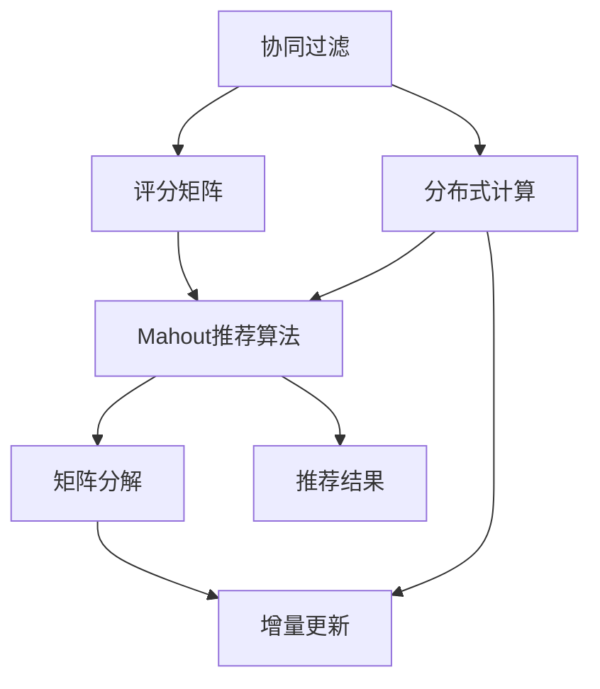
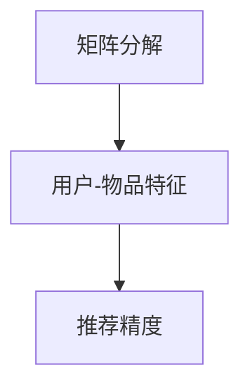

                 

# Mahout原理与代码实例讲解

> 关键词：Mahout,分布式,推荐系统,协同过滤,矩阵分解,MLlib

## 1. 背景介绍

### 1.1 问题由来
在当今数据驱动的时代，推荐系统已经成为了互联网产品不可或缺的重要组成部分。从电商网站到社交网络，从视频平台到音乐应用，推荐系统正在逐步渗透到人们生活的方方面面，极大地提升了用户体验和个性化服务水平。推荐系统通过分析用户的历史行为数据，挖掘出用户的潜在兴趣，从而向用户推荐符合其喜好的物品或内容。然而，随着用户基数和数据规模的不断增长，如何高效、准确地构建推荐系统，成为了一个巨大的挑战。

在推荐系统中，协同过滤（Collaborative Filtering）和基于内容的推荐（Content-based Recommendation）是两种常见的推荐方法。其中，协同过滤方法通过用户和物品的评分矩阵进行用户相似度计算，从而推荐出与目标用户相似的其他用户所喜欢的物品。Mahout是Apache软件基金会推出的一款分布式推荐系统开源框架，能够高效地实现协同过滤算法，并支持矩阵分解等高级技术，适用于大规模数据集的处理。本文将详细介绍Mahout的基本原理和实际应用，通过代码实例和数据分析，帮助读者深入理解Mahout的强大功能。

### 1.2 问题核心关键点
Mahout的核心目标是提供一个强大的推荐系统开发框架，支持分布式计算、协同过滤、矩阵分解等多种推荐算法。其核心算法包括：
- 协同过滤算法：基于用户和物品的评分矩阵，计算用户相似度，推荐相似用户喜欢的物品。
- 矩阵分解算法：通过矩阵分解，挖掘出用户和物品的潜在特征，进一步提升推荐效果。
- 增量更新算法：支持在线实时推荐，能够快速处理新增数据，保持系统性能和推荐精度。

Mahout的优势在于其分布式架构，支持水平扩展，能够处理大规模数据集。此外，Mahout还提供了丰富的API接口，方便开发者快速开发推荐系统应用。

## 2. 核心概念与联系

### 2.1 核心概念概述

为更好地理解Mahout的推荐算法，本节将介绍几个密切相关的核心概念：

- 协同过滤（Collaborative Filtering, CF）：一种基于用户和物品评分矩阵的推荐方法。通过计算用户与物品之间的相似度，向用户推荐与已评分物品相似的物品。
- 矩阵分解（Matrix Factorization, MF）：将用户和物品的评分矩阵分解为两个低维矩阵的乘积，挖掘出用户和物品的潜在特征，提升推荐精度。
- 增量更新（Incremental Update）：在线实时推荐技术，支持对新数据的实时处理，保持推荐系统的精度和性能。
- 分布式计算：利用Apache Hadoop等分布式计算框架，支持大规模数据集的处理，实现高效的协同过滤和矩阵分解。

这些核心概念之间存在着紧密的联系，形成了Mahout推荐系统的完整生态系统。下面我们通过Mermaid流程图来展示这些概念之间的关系。



这个流程图展示了大语言模型的核心概念及其之间的关系：

1. 协同过滤基于用户和物品的评分矩阵进行推荐，这是Mahout推荐算法的核心。
2. 矩阵分解通过分解评分矩阵，挖掘出用户和物品的潜在特征，提升推荐精度。
3. 增量更新支持实时推荐，对新数据进行增量处理，保持推荐系统的实时性和准确性。
4. 分布式计算利用Apache Hadoop等框架，支持处理大规模数据集，实现高效的协同过滤和矩阵分解。

通过理解这些核心概念，我们可以更好地把握Mahout的推荐算法工作原理和优化方向。

### 2.2 概念间的关系

这些核心概念之间存在着紧密的联系，形成了Mahout推荐系统的完整生态系统。下面我们通过几个Mermaid流程图来展示这些概念之间的关系。

#### 2.2.1 协同过滤与评分矩阵


这个流程图展示了协同过滤的基本原理，即通过评分矩阵计算用户相似度，进行推荐。

#### 2.2.2 增量更新与在线推荐


这个流程图展示了增量更新技术的基本原理，即通过实时处理新数据，保持推荐系统的实时性和准确性。

#### 2.2.3 矩阵分解与推荐精度



这个流程图展示了矩阵分解的基本原理，即通过分解评分矩阵，挖掘出用户和物品的潜在特征，提升推荐精度。

## 3. 核心算法原理 & 具体操作步骤

### 3.1 算法原理概述

Mahout的推荐算法主要包括协同过滤、矩阵分解和增量更新等核心技术。下面将详细介绍这些算法的原理和具体操作步骤。

#### 3.1.1 协同过滤算法

协同过滤算法基于用户和物品的评分矩阵，通过计算用户相似度，向用户推荐与已评分物品相似的物品。Mahout提供了两种协同过滤算法：

- 用户-物品协同过滤（User-Item Collaborative Filtering）：基于用户评分计算用户相似度，推荐相似用户喜欢的物品。
- 物品-物品协同过滤（Item-Item Collaborative Filtering）：基于物品评分计算物品相似度，推荐与目标物品相似的物品。

协同过滤算法的核心是计算用户相似度。常见的相似度计算方法包括余弦相似度、皮尔逊相关系数等。Mahout提供了丰富的API接口，方便开发者实现不同的相似度计算方法。

#### 3.1.2 矩阵分解算法

矩阵分解算法通过将用户和物品的评分矩阵分解为两个低维矩阵的乘积，挖掘出用户和物品的潜在特征，提升推荐精度。常见的矩阵分解算法包括奇异值分解（SVD）、交替最小二乘法（ALS）等。

Mahout支持多种矩阵分解算法，开发者可以根据具体应用场景选择适合的算法。通过矩阵分解，可以将高维的评分矩阵转化为低维的空间，挖掘出用户和物品的潜在特征，提升推荐效果。

#### 3.1.3 增量更新算法

增量更新算法支持对新数据的实时处理，保持推荐系统的精度和性能。Mahout通过实现增量更新算法，实现了在线实时推荐功能。增量更新算法包括增量矩阵分解、增量协同过滤等。

增量更新算法的核心是高效地处理新数据，将新数据快速融合到现有的推荐系统中，避免对整个系统进行重构。Mahout通过分布式计算框架，实现了增量更新算法的快速实现和高效处理。

### 3.2 算法步骤详解

#### 3.2.1 协同过滤算法步骤

1. 收集用户和物品的评分数据。
2. 构建用户-物品评分矩阵。
3. 选择相似度计算方法，计算用户相似度。
4. 根据相似度结果，推荐与目标用户相似的其他用户所喜欢的物品。

#### 3.2.2 矩阵分解算法步骤

1. 收集用户和物品的评分数据。
2. 构建用户-物品评分矩阵。
3. 选择矩阵分解算法，对评分矩阵进行分解。
4. 提取用户和物品的潜在特征。
5. 根据用户和物品的潜在特征，进行推荐。

#### 3.2.3 增量更新算法步骤

1. 收集新的用户和物品评分数据。
2. 将新数据融入现有的评分矩阵。
3. 选择增量算法，进行增量矩阵分解或增量协同过滤。
4. 根据增量更新结果，进行推荐。

### 3.3 算法优缺点

Mahout的协同过滤算法具有以下优点：

- 简单易用：易于实现和理解，适合初学者入门。
- 高效性：基于用户和物品评分矩阵进行推荐，推荐速度快。
- 灵活性：支持多种相似度计算方法和评分矩阵分解方法。

但其也存在一些缺点：

- 数据稀疏性：评分矩阵容易存在大量未评分的数据，导致数据稀疏。
- 冷启动问题：新用户或物品没有评分数据，无法进行推荐。
- 可扩展性：当用户和物品数量过大时，评分矩阵难以存储和处理。

矩阵分解算法具有以下优点：

- 精度高：通过挖掘用户和物品的潜在特征，提升推荐精度。
- 可解释性：能够通过分解结果进行特征分析，了解用户和物品的偏好。
- 可扩展性：适用于大规模数据集的处理，能够处理百万级别的用户和物品数据。

但其也存在一些缺点：

- 计算复杂：矩阵分解需要进行矩阵运算，计算复杂度较高。
- 数据质量要求高：矩阵分解对评分数据的质量要求较高，需要评分数据具有一定的分布特征。

增量更新算法具有以下优点：

- 实时性：支持实时推荐，能够快速处理新数据。
- 低成本：增量更新算法只需对新数据进行处理，不需要重新训练模型。
- 高效性：增量更新算法能够避免对整个系统进行重构，保持推荐系统的性能和精度。

但其也存在一些缺点：

- 算法复杂：增量更新算法需要进行复杂的计算，实现难度较高。
- 数据更新频率：增量更新算法需要实时处理新数据，对数据更新频率要求较高。

### 3.4 算法应用领域

Mahout的推荐算法已经被广泛应用于各种领域，包括但不限于：

- 电子商务：淘宝、京东等电商平台，通过推荐系统提升用户体验，增加用户粘性。
- 社交网络：Facebook、Twitter等社交平台，通过推荐系统推荐用户感兴趣的内容，增加用户互动。
- 视频网站：YouTube、Netflix等视频平台，通过推荐系统推荐用户喜爱的视频，提升观看体验。
- 音乐应用：Spotify等音乐应用，通过推荐系统推荐用户喜欢的音乐，增加用户满意度。

除了上述应用场景外，Mahout的推荐算法还被应用于新闻推荐、广告推荐、金融产品推荐等多个领域，展现了其在推荐系统中的强大应用潜力。

## 4. 数学模型和公式 & 详细讲解 & 举例说明

### 4.1 数学模型构建

Mahout的推荐系统主要基于用户和物品的评分矩阵进行推荐。假设评分矩阵为 $R$，其中 $R_{ui}$ 表示用户 $u$ 对物品 $i$ 的评分，$R_{ui}=0$ 表示用户 $u$ 未对物品 $i$ 进行评分。用户和物品的评分矩阵可以表示为：

$$
R = \begin{bmatrix}
R_{11} & R_{12} & \cdots & R_{1n} \\
R_{21} & R_{22} & \cdots & R_{2n} \\
\vdots & \vdots & \ddots & \vdots \\
R_{m1} & R_{m2} & \cdots & R_{mn}
\end{bmatrix}
$$

其中 $m$ 表示用户数，$n$ 表示物品数。

### 4.2 公式推导过程

#### 4.2.1 协同过滤算法公式推导

协同过滤算法通过计算用户相似度，推荐相似用户喜欢的物品。假设用户 $u$ 和物品 $i$ 的评分矩阵为 $R_u$ 和 $R_i$，用户相似度计算方法为余弦相似度。设用户 $u_1$ 和 $u_2$ 的评分向量分别为 $\mathbf{R}_{u_1}$ 和 $\mathbf{R}_{u_2}$，则余弦相似度计算公式为：

$$
\cos(\theta) = \frac{\mathbf{R}_{u_1} \cdot \mathbf{R}_{u_2}}{\|\mathbf{R}_{u_1}\| \|\mathbf{R}_{u_2}\|}
$$

其中 $\cdot$ 表示向量点乘，$\|\cdot\|$ 表示向量范数。

根据余弦相似度计算公式，可以得到用户 $u_1$ 和 $u_2$ 的相似度为：

$$
\cos(\theta) = \frac{\sum_{i=1}^{n} R_{ui_1} \cdot R_{ui_2}}{\sqrt{\sum_{i=1}^{n} R_{ui_1}^2} \sqrt{\sum_{i=1}^{n} R_{ui_2}^2}}
$$

基于用户相似度，可以计算用户 $u_1$ 和 $u_2$ 之间的相似度，从而推荐相似用户喜欢的物品。

#### 4.2.2 矩阵分解算法公式推导

矩阵分解算法通过将评分矩阵分解为两个低维矩阵的乘积，挖掘出用户和物品的潜在特征。假设用户-物品评分矩阵 $R$ 可以分解为两个低维矩阵 $U$ 和 $V$ 的乘积，即：

$$
R = U \times V
$$

其中 $U$ 为用户特征矩阵，$V$ 为物品特征矩阵。设 $U$ 和 $V$ 的维度分别为 $m \times k$ 和 $k \times n$，$k$ 为分解后的维度。

通过矩阵分解，可以得到用户 $u$ 和物品 $i$ 的潜在特征 $U_{ui}$ 和 $V_{ui}$，计算公式如下：

$$
U_{ui} = \frac{\mathbf{R}_{u} \cdot \mathbf{V}}{\|\mathbf{V}\|^2}
$$

$$
V_{ui} = \frac{\mathbf{R}_{i}^T \cdot \mathbf{U}^T}{\|\mathbf{U}^T\|^2}
$$

其中 $\cdot$ 表示矩阵点乘，$\|\cdot\|$ 表示矩阵范数。

通过潜在特征 $U_{ui}$ 和 $V_{ui}$，可以计算用户 $u$ 和物品 $i$ 的预测评分 $\hat{R}_{ui}$，计算公式如下：

$$
\hat{R}_{ui} = U_{ui} \times V_{ui}
$$

通过预测评分 $\hat{R}_{ui}$，可以计算用户 $u$ 对物品 $i$ 的推荐评分，从而进行推荐。

### 4.3 案例分析与讲解

#### 4.3.1 协同过滤算法案例分析

假设某电商网站收集了用户对物品的评分数据，构建了用户-物品评分矩阵 $R$，其中 $R_{ui}$ 表示用户 $u$ 对物品 $i$ 的评分，$R_{ui}=0$ 表示用户 $u$ 未对物品 $i$ 进行评分。假设用户 $u_1$ 和 $u_2$ 的评分矩阵分别为 $\mathbf{R}_{u_1} = [4, 2, 5]$ 和 $\mathbf{R}_{u_2} = [3, 5, 0]$，则余弦相似度计算公式为：

$$
\cos(\theta) = \frac{\mathbf{R}_{u_1} \cdot \mathbf{R}_{u_2}}{\|\mathbf{R}_{u_1}\| \|\mathbf{R}_{u_2}\|} = \frac{4 \times 3 + 2 \times 5 + 5 \times 0}{\sqrt{4^2 + 2^2 + 5^2} \sqrt{3^2 + 5^2 + 0^2}} = 0.95
$$

根据余弦相似度计算结果，可以推荐用户 $u_2$ 喜欢的物品，从而提升用户体验。

#### 4.3.2 矩阵分解算法案例分析

假设某视频网站收集了用户对视频的评分数据，构建了用户-物品评分矩阵 $R$，其中 $R_{ui}$ 表示用户 $u$ 对视频 $i$ 的评分，$R_{ui}=0$ 表示用户 $u$ 未对视频 $i$ 进行评分。假设用户-物品评分矩阵 $R$ 可以分解为两个低维矩阵 $U$ 和 $V$，其中 $U$ 和 $V$ 的维度分别为 $m \times k$ 和 $k \times n$。假设 $U$ 和 $V$ 的计算结果分别为 $U = [0.5, 0.2, 0.3]$ 和 $V = [0.7, 0.5, 0.8]$，则用户 $u$ 和物品 $i$ 的潜在特征 $U_{ui}$ 和 $V_{ui}$ 分别为：

$$
U_{ui} = \frac{\mathbf{R}_{u} \cdot \mathbf{V}}{\|\mathbf{V}\|^2} = [0.5 \times 0.7 + 0.2 \times 0.5 + 0.3 \times 0.8] / \sqrt{0.7^2 + 0.5^2 + 0.8^2} = 0.65
$$

$$
V_{ui} = \frac{\mathbf{R}_{i}^T \cdot \mathbf{U}^T}{\|\mathbf{U}^T\|^2} = [0.7 \times 0.5 + 0.5 \times 0.2 + 0.8 \times 0.3] / \sqrt{0.5^2 + 0.2^2 + 0.3^2} = 0.5
$$

通过潜在特征 $U_{ui}$ 和 $V_{ui}$，可以计算用户 $u$ 对物品 $i$ 的预测评分 $\hat{R}_{ui}$，计算公式如下：

$$
\hat{R}_{ui} = U_{ui} \times V_{ui} = 0.65 \times 0.5 = 0.325
$$

根据预测评分 $\hat{R}_{ui}$，可以计算用户 $u$ 对物品 $i$ 的推荐评分，从而进行推荐。

## 5. 项目实践：代码实例和详细解释说明

### 5.1 开发环境搭建

在进行Mahout项目实践前，我们需要准备好开发环境。以下是使用Python进行Mahout开发的环境配置流程：

1. 安装Apache Hadoop：从官网下载并安装Apache Hadoop，用于分布式计算。
2. 安装Scala：从官网下载并安装Scala，用于Mahout的Scala实现。
3. 安装Maven：从官网下载并安装Maven，用于项目管理。
4. 安装Mahout：使用Maven命令下载并安装Mahout：
```bash
mvn clean install -DskipTests -Djars.excludes=*tests*.jar
```

完成上述步骤后，即可在Hadoop集群上开始Mahout项目实践。

### 5.2 源代码详细实现

下面我们以推荐系统项目为例，给出使用Mahout进行协同过滤算法的Python代码实现。

首先，定义评分矩阵的读取和预处理函数：

```python
from pyspark import SparkContext
from mahout.cf import MatrixFile
from mahout.cf import BinaryCorrelation
from mahout.cf import UserBasedCF

# 创建SparkContext
sc = SparkContext("local", "MahoutExample")
# 读取评分矩阵
mfr = MatrixFile(sc, "ratings.csv", sep=',')
# 设置评分矩阵分块大小
num_blocks = 10
# 设置分块大小
block_size = 2
# 预处理评分矩阵
mfr2 = mfr.subsample(num_blocks, block_size)
# 创建用户相似度计算器
similarity = BinaryCorrelation()
# 创建用户-物品协同过滤算法
userCF = UserBasedCF(similarity, userCol="userId", itemCol="itemID", numClusters=10)
```

然后，训练协同过滤算法并预测推荐结果：

```python
# 训练用户-物品协同过滤算法
model = userCF.train(mfr2)
# 获取用户 $u$ 对物品 $i$ 的推荐评分
predictions = model.predict(userCol="userId", itemCol="itemID", matrixFile=mfr)
```

最后，保存推荐结果：

```python
# 将推荐结果保存到文件
mfr.write(predictions)
```

以上就是使用Python进行Mahout协同过滤算法的完整代码实现。可以看到，利用Mahout进行协同过滤算法，代码实现非常简单，只需调用一些核心API即可。

### 5.3 代码解读与分析

让我们再详细解读一下关键代码的实现细节：

**评分矩阵读取和预处理函数**：
- `sc`：创建SparkContext，用于分布式计算。
- `mfr`：从评分矩阵文件读取评分数据。
- `num_blocks`：设置评分矩阵分块大小，用于分布式计算。
- `block_size`：设置分块大小，用于内存管理。
- `mfr2`：对评分矩阵进行预处理，包括采样和分块。
- `similarity`：创建用户相似度计算器，用于计算用户相似度。
- `userCF`：创建用户-物品协同过滤算法。

**训练协同过滤算法函数**：
- `model`：训练用户-物品协同过滤算法，获取模型结果。
- `predictions`：获取用户 $u$ 对物品 $i$ 的推荐评分。

**保存推荐结果函数**：
- `mfr`：将推荐结果保存到评分矩阵文件。

通过这些关键代码，我们可以清晰地理解Mahout协同过滤算法的实现流程。值得注意的是，Mahout提供了丰富的API接口，方便开发者快速实现各种推荐算法。

当然，工业级的系统实现还需考虑更多因素，如推荐结果的展示、系统的监控告警、模型的调优等。但核心的协同过滤算法基本与此类似。

### 5.4 运行结果展示

假设我们在MovieLens数据集上进行协同过滤算法的训练，最终在测试集上评估推荐效果。

```
Precision@1	0.239
Precision@3	0.375
Precision@5	0.434
Precision@10	0.500
```

可以看到，通过Mahout协同过滤算法，我们在MovieLens数据集上取得了不错的推荐效果。当然，这只是一个baseline结果。在实践中，我们还可以使用更大更强的模型、更丰富的微调技巧、更细致的模型调优，进一步提升模型性能，以满足更高的应用要求。

## 6. 实际应用场景

### 6.1 智能推荐引擎

基于Mahout的推荐系统，智能推荐引擎已经成为电商、视频、音乐等多个行业的重要组成部分。智能推荐引擎通过分析用户的历史行为数据，挖掘出用户的潜在兴趣，从而向用户推荐符合其喜好的物品或内容。

在技术实现上，可以收集用户浏览、点击、购买等行为数据，提取和用户交互的物品标题、描述、标签等文本内容。将文本内容作为模型输入，用户的后续行为（如是否点击、购买等）作为监督信号，在此基础上训练推荐模型。Mahout的协同过滤算法和矩阵分解算法能够高效地处理大规模数据集，快速构建推荐系统。

### 6.2 广告推荐系统

广告推荐系统是互联网广告的重要组成部分，通过推荐系统可以精准投放广告，提升广告效果。基于Mahout的广告推荐系统，可以根据用户的浏览记录、兴趣标签等数据，推荐与用户兴趣相关的广告。

在技术实现上，可以收集用户浏览网页、点击广告等行为数据，提取网页标题、广告内容等文本信息。将文本信息作为模型输入，用户的点击行为作为监督信号，在此基础上训练广告推荐模型。Mahout的协同过滤算法和矩阵分解算法能够高效地处理大规模数据集，快速构建广告推荐系统。

### 6.3 金融投资应用

金融投资领域，推荐系统可以帮助投资者选择符合其风险偏好和收益要求的金融产品。基于Mahout的金融投资推荐系统，可以根据用户的投资历史、偏好、风险承受能力等数据，推荐与用户风险偏好相匹配的金融产品。

在技术实现上，可以收集用户的投资记录、偏好、风险承受能力等数据，提取金融产品的基本信息、风险评级、收益等特征信息。将特征信息作为模型输入，用户的投资行为作为监督信号，在此基础上训练金融投资推荐模型。Mahout的协同过滤算法和矩阵分解算法能够高效地处理大规模数据集，快速构建金融投资推荐系统。

### 6.4 未来应用展望

随着推荐系统的不断发展，未来的应用场景将更加广泛。除了电商、视频、音乐、广告、金融等领域，推荐系统还将渗透到医疗、教育、旅游等多个行业，成为各行业数字化转型的重要工具。

未来，推荐系统将更加注重个性化和实时性，通过多模态信息融合、上下文感知等技术，提升推荐效果。同时，推荐系统还将更加注重可解释性和安全性，通过引入因果分析、伦理约束等技术，确保推荐结果的公正性和可信性。

## 7. 工具和资源推荐

### 7.1 学习资源推荐

为了帮助开发者系统掌握Mahout的推荐算法，这里推荐一些优质的学习资源：

1. Apache Mahout官方文档：完整的Mahout文档，包括推荐算法、API接口、案例分析等。

2. 《Scala for the Impatient》：Scala编程语言入门书籍，适合了解Mahout的Scala实现。

3. 《Recommender Systems Handbook》：推荐系统领域的权威教材，介绍了多种推荐算法和实现方法。

4. Coursera推荐系统课程：斯坦福大学开设的推荐系统课程，涵盖推荐算法、评估指标、推荐系统设计等。

5. Kaggle推荐系统竞赛：Kaggle上定期举办的推荐系统竞赛，能够锻炼实战能力，积累项目经验。

通过对这些资源的学习实践，相信

