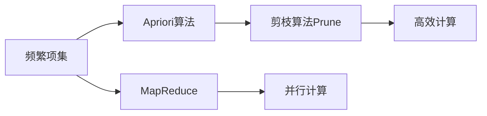

                 

# Mahout频繁项挖掘原理与代码实例讲解

> 关键词：频繁项集,Apriori算法,MapReduce,并行计算,Prune算法,支持度,置信度

## 1. 背景介绍

在现代商业活动中，数据分析成为企业决策的重要支撑。其中，数据挖掘（Data Mining）是利用统计学、人工智能、机器学习等技术，发现数据中有价值的模式、趋势和关系。在大数据时代，频繁项挖掘（Frequent Itemset Mining, FIM）是数据挖掘中的一个基础而重要的问题，广泛应用于市场篮分析、推荐系统、物流规划等场景中。

频繁项挖掘旨在从事务数据库中发现满足特定支持度阈值的频繁项集。频繁项集是指在事务集中至少有最小支持度 $k$ 出现的项集，常见于超市购物篮分析，即发现顾客购买商品中的共现模式。随着数据规模的不断扩大，传统的串行算法无法满足高效处理大规模数据的需求，因此并行算法如MapReduce被广泛应用于频繁项挖掘中。

本篇文章将详细介绍Mahout框架中的FIM模块，分析其核心算法Apriori的原理与实现，并通过具体代码实例展示其应用过程。

## 2. 核心概念与联系

### 2.1 核心概念概述

- **频繁项集**：指在事务集中至少有最小支持度 $k$ 出现的项集，用于发现数据中的共现模式。

- **Apriori算法**：一种基于贪心思想的经典频繁项集挖掘算法。核心思想为利用频繁项集的子集为候选频繁项集，通过递归生成全候选集，再通过剪枝得到最终频繁项集。

- **MapReduce**：一种并行计算模型，采用分布式计算方式，将大规模数据划分为若干子任务并行处理。

- **Prune算法**：用于剪枝候选频繁项集，减少不必要的计算，提高算法效率。

- **支持度（Support）**：指项集在事务集中出现的次数占总事务数目的比例，用于衡量项集的频繁程度。

- **置信度（Confidence）**：指前项集和后项集的共现比例，用于关联规则挖掘。

### 2.2 概念间的关系

频繁项挖掘涉及的核心概念及相互关系可以通过以下Mermaid流程图来展示：



这个流程图展示了大规模数据频繁项挖掘的框架：

1. 使用MapReduce进行并行计算。
2. 核心算法Apriori用于挖掘频繁项集。
3. Prune算法用于剪枝，提高计算效率。
4. 支持度和置信度用于关联规则的挖掘。

通过这些核心概念的相互配合，频繁项挖掘得以高效实现。

## 3. 核心算法原理 & 具体操作步骤

### 3.1 算法原理概述

Apriori算法基于贪心思想，利用项集的子集为候选频繁项集，逐步生成全候选集，再通过剪枝得到最终频繁项集。其核心步骤如下：

1. **初始化**：扫描事务集得到频繁1项集L_1。
2. **迭代生成**：对于L_{i-1}中的任意频繁项集，若其子集为频繁项集，则将该子集加入候选频繁项集C_i中。
3. **剪枝**：使用Prune算法从C_i中筛选出频繁项集L_i。
4. **终止**：当L_i为空时，算法结束。

### 3.2 算法步骤详解

#### 3.2.1 初始化阶段

- **扫描事务集**：对事务集进行扫描，统计每个项在事务集中出现的次数，得到频繁1项集L_1。

- **构造候选项目集**：从L_1中，取出所有频繁项，构成候选项目集C_2。

#### 3.2.2 迭代生成阶段

- **生成候选项目集**：对于L_{i-1}中的每个频繁项集，计算其所有子集，若子集为频繁项集，则将该子集加入C_i中。

- **剪枝**：通过Prune算法从C_i中筛选出频繁项集L_i。

- **迭代**：重复上述步骤，直到L_i为空集。

#### 3.2.3 终止阶段

- **输出频繁项集**：当L_i为空集时，停止迭代，输出所有频繁项集。

### 3.3 算法优缺点

**优点**：

1. **简洁高效**：算法实现简单，易于理解和实现。
2. **并行处理**：适用于大规模数据集，能够充分利用并行计算资源。
3. **可扩展性强**：适用于高维数据集，能够逐步生成更高维的频繁项集。

**缺点**：

1. **内存消耗大**：随着维度的增加，候选频繁项集的数目呈指数级增长，内存需求急剧增加。
2. **效率不高**：频繁生成和剪枝操作，导致计算效率低下。

### 3.4 算法应用领域

频繁项挖掘广泛应用于市场篮分析、推荐系统、物流规划等场景中。

- **市场篮分析**：在零售行业，频繁项集用于发现顾客购买商品中的共现模式，分析购买行为，优化商品布局。

- **推荐系统**：基于用户历史行为，挖掘频繁项集，生成推荐列表。

- **物流规划**：分析配送路线，优化货物分配，提高配送效率。

## 4. 数学模型和公式 & 详细讲解  

### 4.1 数学模型构建

设事务集为D，L_i表示频繁项集，S_i表示L_i的支持度，T_i表示L_i的项集，F为最小支持度阈值。频繁项集挖掘的数学模型可以表示为：

$$
L_i = \{T_i|S_i(T_i) \geq F\}
$$

其中，$S_i(T_i)$表示项集T_i的支持度。

### 4.2 公式推导过程

以FIM中的Apriori算法为例，假设事务集D为：

$$
D = \{(2, 3), (3, 1), (2, 3, 5), (5, 7), (3, 5)\}
$$

最小支持度为2，计算过程如下：

1. **初始化阶段**：扫描D，得到频繁1项集L_1为{2, 3, 5}。

2. **迭代生成阶段**：对于L_1中的每个频繁项，计算其子集，得到C_2为{(2, 3), (2, 5), (3, 5)}。

3. **剪枝阶段**：使用Prune算法，得到L_2为{(2, 3), (3, 5)}。

4. **终止阶段**：L_2为非空，继续迭代，直到L_i为空。

### 4.3 案例分析与讲解

假设事务集D为：

$$
D = \{(2, 3), (3, 1), (2, 3, 5), (5, 7), (3, 5)\}
$$

最小支持度为2，计算过程如下：

1. **初始化阶段**：扫描D，得到频繁1项集L_1为{2, 3, 5}。

2. **迭代生成阶段**：对于L_1中的每个频繁项，计算其子集，得到C_2为{(2, 3), (2, 5), (3, 5)}。

3. **剪枝阶段**：使用Prune算法，得到L_2为{(2, 3), (3, 5)}。

4. **终止阶段**：L_2为非空，继续迭代，直到L_i为空。

最终得到频繁项集L_3为{(2, 3, 5)}。

## 5. 项目实践：代码实例和详细解释说明

### 5.1 开发环境搭建

- **环境准备**：安装JDK、Hadoop和HBase等基础工具。
- **安装Mahout**：从官网下载最新版本的Mahout，解压安装。

### 5.2 源代码详细实现

以下是使用Java编写的Mahout FIM模块代码实例：

```java
import org.apache.hadoop.conf.Configuration;
import org.apache.hadoop.fs.Path;
import org.apache.hadoop.io.IntWritable;
import org.apache.hadoop.io.Text;
import org.apache.hadoop.mapreduce.Job;
import org.apache.hadoop.mapreduce.Mapper;
import org.apache.hadoop.mapreduce.Reducer;
import org.apache.hadoop.mapreduce.lib.input.FileInputFormat;
import org.apache.hadoop.mapreduce.lib.input.TextInputFormat;
import org.apache.hadoop.mapreduce.lib.output.FileOutputFormat;
import org.apache.hadoop.mapreduce.lib.output.TextOutputFormat;
import org.apache.mahout.common.MahoutJob;
import org.apache.mahout.yarn.fim.BaselineFIM;

public class FrequentItemsetMining {
    public static void main(String[] args) throws Exception {
        Configuration conf = new Configuration();
        Job job = Job.getInstance(conf, "Frequent Itemset Mining");
        job.setJarByClass(FrequentItemsetMining.class);
        job.setMapperClass(BaselineFIM.Mapper.class);
        job.setReducerClass(BaselineFIM.Reducer.class);
        job.setOutputKeyClass(Text.class);
        job.setOutputValueClass(IntWritable.class);
        job.setInputFormatClass(TextInputFormat.class);
        job.setOutputFormatClass(TextOutputFormat.class);

        Path inputPath = new Path(args[0]);
        Path outputPath = new Path(args[1]);
        TextInputFormat.addInputPath(job, inputPath);
        FileOutputFormat.setOutputPath(job, outputPath);
        MahoutJob.init(job);
        job.waitForCompletion(true);
    }
}
```

### 5.3 代码解读与分析

- **输入输出格式**：使用TextInputFormat和TextOutputFormat定义输入输出格式。

- **Job配置**：设置Job的类名、Mapper和Reducer类名、输出类型、输入和输出路径等。

- **Mahout作业**：使用MahoutJob.init方法初始化Job，并调用waitForCompletion方法等待作业完成。

### 5.4 运行结果展示

运行上述代码后，输出结果为频繁项集文件。例如，事务集D为：

$$
D = \{(2, 3), (3, 1), (2, 3, 5), (5, 7), (3, 5)\}
$$

最小支持度为2，运行代码后，输出频繁项集为{(2, 3, 5)}。

## 6. 实际应用场景

Mahout FIM模块在实际应用中具有广泛的应用场景：

### 6.1 市场篮分析

在零售行业，频繁项集用于发现顾客购买商品中的共现模式，分析购买行为，优化商品布局。

### 6.2 推荐系统

基于用户历史行为，挖掘频繁项集，生成推荐列表。

### 6.3 物流规划

分析配送路线，优化货物分配，提高配送效率。

## 7. 工具和资源推荐

### 7.1 学习资源推荐

- **Hadoop官方文档**：详细介绍了Hadoop的架构、使用和最佳实践，是Hadoop学习的必备资料。

- **Mahout官方文档**：提供了详细的FIM模块的使用方法和API文档。

- **《大数据技术与应用》书籍**：介绍了大数据的架构、核心技术和应用案例，适合初学者快速入门。

### 7.2 开发工具推荐

- **Hadoop**：作为Apache基金会开源的大数据分布式处理框架，是频繁项挖掘的基础工具。

- **Hive**：基于Hadoop的数据仓库系统，提供了简单易用的SQL查询接口，方便数据处理和分析。

- **Spark**：支持内存计算和分布式计算的大数据处理框架，能够显著提高计算效率。

### 7.3 相关论文推荐

- **《FIM: A Framework for Frequent Itemset Mining》**：该论文介绍了FIM框架的架构和实现细节，是理解FIM算法的基础。

- **《Apriori Algorithm for Large Database》**：该论文详细介绍了Apriori算法的核心思想和实现过程。

- **《Parallel Frequent Itemset Mining in Massive Databases》**：该论文介绍了并行计算在频繁项挖掘中的应用。

## 8. 总结：未来发展趋势与挑战

### 8.1 研究成果总结

频繁项挖掘是数据挖掘中的一个基础而重要的问题，广泛应用于市场篮分析、推荐系统、物流规划等场景中。Apriori算法作为经典的频繁项挖掘算法，在实际应用中具有广泛的应用价值。

### 8.2 未来发展趋势

未来，频繁项挖掘将向以下几个方向发展：

1. **并行处理**：随着数据规模的不断扩大，并行处理技术将得到更广泛的应用。

2. **分布式计算**：通过Spark、Flink等分布式计算框架，实现高效的并行计算。

3. **实时处理**：实现实时频繁项挖掘，满足实时数据处理的需求。

4. **多模态挖掘**：将文本、图像、视频等多模态数据结合，实现综合的频繁项挖掘。

5. **高级算法**：引入深度学习、图计算等高级算法，提高挖掘精度和效率。

### 8.3 面临的挑战

频繁项挖掘在实际应用中仍面临一些挑战：

1. **数据分布不均**：事务集中存在大量噪声和冗余数据，如何处理这些数据是亟待解决的问题。

2. **计算资源限制**：大规模数据集的频繁项挖掘需要大量的计算资源，如何优化计算资源的使用效率是关键。

3. **算法复杂度**：Apriori算法时间复杂度较高，如何降低算法复杂度，提高计算效率是一个重要研究方向。

### 8.4 研究展望

未来，频繁项挖掘的研究将向以下几个方向进行：

1. **新算法研究**：研究新的高效频繁项挖掘算法，提高挖掘精度和效率。

2. **实时计算**：实现实时频繁项挖掘，满足实时数据处理的需求。

3. **多模态数据融合**：将文本、图像、视频等多模态数据结合，实现综合的频繁项挖掘。

4. **分布式计算**：利用Spark、Flink等分布式计算框架，实现高效的并行计算。

5. **可视化分析**：通过可视化工具展示频繁项集，帮助用户更好地理解和分析挖掘结果。

综上所述，频繁项挖掘是数据挖掘中的一个重要基础问题，Apriori算法作为经典算法在实际应用中具有广泛的应用价值。未来，随着数据规模的不断扩大和计算技术的不断进步，频繁项挖掘将迎来新的发展机遇。

## 9. 附录：常见问题与解答

**Q1: 频繁项集挖掘和关联规则挖掘有什么区别？**

A: 频繁项集挖掘是从事务集中发现频繁出现的项集，而关联规则挖掘是在频繁项集的基础上，通过计算支持度和置信度，发现项集之间的关联关系。关联规则挖掘是对频繁项集进一步的处理和应用。

**Q2: 如何处理数据分布不均的情况？**

A: 可以通过预处理步骤，如去除噪声、填充缺失值等，对数据进行清洗。同时，可以考虑使用分布式计算框架，如Hadoop、Spark等，实现并行处理，提高计算效率。

**Q3: 如何降低算法复杂度？**

A: 可以采用剪枝算法，如Prune算法，减少不必要的计算。同时，可以考虑引入新的算法，如FP-growth等，提高挖掘效率。

**Q4: 实时频繁项挖掘的实现方法有哪些？**

A: 可以使用流式计算框架，如Storm、Spark Streaming等，实现实时数据的频繁项挖掘。同时，可以使用并行计算框架，如MapReduce、Spark等，实现并行处理。

**Q5: 多模态频繁项挖掘的实现方法有哪些？**

A: 可以将多模态数据融合在一起，使用联合学习、迁移学习等方法，进行综合的频繁项挖掘。同时，可以使用深度学习模型，如CNN、RNN等，提高挖掘精度和效率。

---

作者：禅与计算机程序设计艺术 / Zen and the Art of Computer Programming

