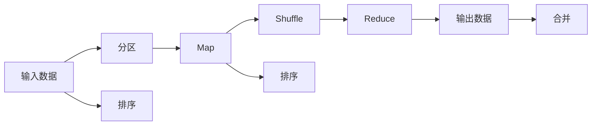

                 

# MapReduce 原理与代码实例讲解

> 关键词：MapReduce, 分布式计算, 大数据, Hadoop, Spark

## 1. 背景介绍

### 1.1 问题由来

随着互联网和移动互联网的普及，人类社会产生了前所未有的海量数据。据国际数据公司(IDC)的预测，全球数据量将在2025年达到175ZB。这些数据不仅存储在各类服务器、数据库中，还有大量的数据需要进行处理和分析，以挖掘其中的价值。然而，单台计算机的处理能力有限，无法满足大规模数据处理的需要。为了应对这一挑战，分布式计算技术应运而生。

分布式计算是一种通过网络将计算任务分散到多台计算机上进行处理的技术。其核心理念是将一个大任务分解为多个小任务，由不同计算机分别处理，最后将处理结果汇总得到最终答案。MapReduce技术是分布式计算的一种重要实现方式，被广泛应用于大数据处理和分析领域。

### 1.2 问题核心关键点

MapReduce技术的核心在于将大规模数据处理任务分解为"Map"和"Reduce"两个基本操作。"Map"操作将输入数据映射为中间数据，"Reduce"操作对中间数据进行汇总归约。MapReduce的优点在于简单易用，适应性广，可以处理大规模数据集，且具有良好的容错性。

MapReduce技术的广泛应用得益于Google在其开源的MapReduce论文中提出的两个基本定理：

1. 任何排序稳定，关联性强的并行计算问题都可以在MapReduce上高效解决。
2 MapReduce的"隐式并行"特性可以适应各种类型的数据处理任务，具有极大的扩展性。

### 1.3 问题研究意义

MapReduce技术作为分布式计算领域的重要技术，对于大数据处理和分析具有重要的理论和实际意义：

1. 高效处理大规模数据：MapReduce技术能够处理海量数据，满足大规模数据处理的需要。
2. 实现分布式计算：MapReduce技术通过将任务分解为多个小任务，并行处理，加速数据处理速度。
3. 容错性高：MapReduce具有良好的容错性，能够自动处理任务失败和节点故障。
4. 适应性强：MapReduce能够适应各种类型的数据处理任务，具有良好的泛化性。
5. 低成本高可靠性：MapReduce技术具有良好的扩展性，可以构建大容量的分布式计算系统，降低系统维护成本，提高数据处理可靠性。

## 2. 核心概念与联系

### 2.1 核心概念概述

MapReduce技术的核心概念包括Map、Reduce、分区（Partition）、排序（Sort）、键值对（Key-Value Pair）、分片（Shuffle）等。这些概念构成了MapReduce算法的核心，用于描述MapReduce技术的实现过程。

- Map：将输入数据映射为中间数据，实现数据的初步分解和处理。
- Reduce：对中间数据进行汇总归约，得到最终结果。
- 分区（Partition）：将输入数据按照某种规则划分为多个子集，将不同的子集分发到不同的Map任务进行处理。
- 排序（Sort）：对中间数据按照某种规则进行排序，以方便Reduce操作进行归约。
- 键值对（Key-Value Pair）：在Map和Reduce操作中，数据通常以键值对的形式表示，用于描述输入输出数据的结构和内容。
- 分片（Shuffle）：将Map操作的结果按照键值对进行分区，将相同键值对的数据发送给同一个Reduce节点进行处理。

这些概念之间的逻辑关系可以通过以下Mermaid流程图来展示：


### 2.2 概念间的关系

这些核心概念之间存在着紧密的联系，构成了MapReduce算法的完整实现过程。下面是这些概念之间的关系图：



这个流程图展示了MapReduce操作的基本流程。其中：

- 输入数据首先经过分区（Partition）操作，被分解成多个子集，分发到不同的Map节点进行处理。
- Map节点对输入数据进行初步处理，将数据映射为中间数据。
- 中间数据经过排序（Sort）操作，按照键值对进行排序。
- 排序后的中间数据经过分片（Shuffle）操作，被发送到相应的Reduce节点进行处理。
- Reduce节点对中间数据进行归约，得到最终结果。
- 最终的输出数据经过合并（Merge）操作，得到完整的结果。

## 3. 核心算法原理 & 具体操作步骤

### 3.1 算法原理概述

MapReduce算法的核心原理在于将大规模数据处理任务分解为Map和Reduce两个基本操作。具体来说，MapReduce算法包括以下几个步骤：

1. 输入数据分区：将输入数据划分为多个子集，分别分发到不同的Map任务进行处理。
2. Map操作：对每个输入数据进行初步处理，将数据映射为中间数据。
3. Map输出排序：对Map操作输出的中间数据进行排序，以方便Reduce操作进行归约。
4. Shuffle操作：将排序后的中间数据按照键值对进行分片，将相同键值对的数据发送到同一个Reduce节点进行处理。
5. Reduce操作：对相同键值对的数据进行汇总归约，得到最终结果。

MapReduce的优点在于其简单易用，适应性广，可以处理大规模数据集，且具有良好的容错性。

### 3.2 算法步骤详解

MapReduce算法的具体实现步骤如下：

1. 输入数据分区：将输入数据划分为多个子集，分别分发到不同的Map任务进行处理。
2. Map操作：对每个输入数据进行初步处理，将数据映射为中间数据。
3. Map输出排序：对Map操作输出的中间数据进行排序，以方便Reduce操作进行归约。
4. Shuffle操作：将排序后的中间数据按照键值对进行分片，将相同键值对的数据发送到同一个Reduce节点进行处理。
5. Reduce操作：对相同键值对的数据进行汇总归约，得到最终结果。

### 3.3 算法优缺点

MapReduce算法的优点在于其简单易用，适应性广，可以处理大规模数据集，且具有良好的容错性。然而，MapReduce算法也存在一些缺点：

- 数据传输开销大：MapReduce的Shuffle操作需要大量的数据传输，导致数据传输开销较大。
- 数据一致性难以保证：由于MapReduce的计算过程是异步的，数据一致性难以保证，可能会出现数据丢失或重复的情况。
- 不适合复杂操作：MapReduce算法只适用于简单的数据处理操作，不适合处理复杂的操作。

### 3.4 算法应用领域

MapReduce算法被广泛应用于各种大规模数据处理场景，包括但不限于以下领域：

- 大数据处理：MapReduce可以处理海量数据，满足大规模数据处理的需要。
- 数据仓库：MapReduce可以用于构建大规模数据仓库，对历史数据进行存储和查询。
- 云计算：MapReduce可以用于云计算平台的数据处理，提高云计算平台的数据处理能力。
- 搜索排名：MapReduce可以用于搜索排名算法，快速计算搜索结果的排序。
- 推荐系统：MapReduce可以用于推荐系统中的协同过滤算法，快速计算用户和物品之间的相似度。

## 4. 数学模型和公式 & 详细讲解

### 4.1 数学模型构建

MapReduce算法的数学模型可以描述为：

$$ MapReduce(\text{input}) = \bigcup_{i=1}^{N} Map(\text{input[i]}) \cap Reduce(\text{Shuffle(Map(input[i]))}) $$

其中：

- $\text{input}$ 表示输入数据，可以是各种类型的数据集。
- $N$ 表示输入数据的数量。
- $Map(\text{input[i]})$ 表示对第 $i$ 个输入数据进行Map操作，得到中间数据集。
- $Reduce(\text{Shuffle(Map(input[i])))}$ 表示对Map操作输出的中间数据进行Shuffle操作，并将相同键值对的数据发送到同一个Reduce节点进行处理，得到最终结果。

### 4.2 公式推导过程

以Word Count为例，计算一篇文本中每个单词出现的次数。假设输入文本为 $T$，单词集合为 $W$，单词 $w$ 出现的次数为 $c_w$，则有：

$$ c_w = \sum_{i=1}^{N} Map(T[i]) $$

其中 $T[i]$ 表示输入文本的第 $i$ 个单词，$Map(T[i])$ 表示对第 $i$ 个单词进行Map操作，将单词 $w$ 出现的次数累加到 $c_w$ 中。

### 4.3 案例分析与讲解

以下是一个简单的MapReduce案例，用于计算一个文本中每个单词出现的次数。

假设输入文本为 $T$，单词集合为 $W$，单词 $w$ 出现的次数为 $c_w$，则有：

$$ c_w = \sum_{i=1}^{N} Map(T[i]) $$

其中 $T[i]$ 表示输入文本的第 $i$ 个单词，$Map(T[i])$ 表示对第 $i$ 个单词进行Map操作，将单词 $w$ 出现的次数累加到 $c_w$ 中。

## 5. 项目实践：代码实例和详细解释说明

### 5.1 开发环境搭建

在进行MapReduce实践前，我们需要准备好开发环境。以下是使用Python进行Hadoop开发的环境配置流程：

1. 安装Hadoop：从官网下载并安装Hadoop，注意选择与Python版本兼容的Hadoop版本。

2. 安装Python环境：在Hadoop的 `$HADOOP_HOME/share/hadoop/common/hadoop-env.sh` 文件中添加如下内容：

```bash
export PYTHONPATH=$PYTHONPATH:$HADOOP_HOME/lib/python
```

3. 编写Python MapReduce程序：

```python
from hadoop.fs import InputSplit
from hadoop.fs import FileOutputFormat
from hadoop.fs import FileSystem
from hadoop.fs import Job
from hadoop.fs import JobConf
import sys

class MapReduce:
    def __init__(self, input_path, output_path):
        self.input_path = input_path
        self.output_path = output_path

    def map(self):
        input_file = InputSplit(self.input_path)
        input_stream = open(input_file.path, 'r')
        output_stream = open(self.output_path + '/part-00000', 'w')
        for line in input_stream:
            words = line.strip().split(' ')
            for word in words:
                output_stream.write(word + '\n')
        input_stream.close()
        output_stream.close()

    def reduce(self):
        output_stream = open(self.output_path + '/part-00000', 'w')
        for line in open(self.output_path + '/part-00000'):
            word = line.strip()
            output_stream.write(word + '\n')
        output_stream.close()

    def run(self):
        job_conf = JobConf()
        job = Job(conf=job_conf)
        job.setMapperClass(MapReduce.map)
        job.setReducerClass(MapReduce.reduce)
        job.setOutputKeyClass(str)
        job.setOutputValueClass(str)
        job.setInputPath([self.input_path])
        job.setOutputPath([self.output_path])
        job.start()
        job.wait()
```

4. 运行MapReduce程序：

```bash
$ python MapReduce.py input output
```

完成上述步骤后，即可在Hadoop环境下进行MapReduce实践。

### 5.2 源代码详细实现

下面以Word Count为例，给出使用Hadoop进行MapReduce的Python代码实现。

首先，定义MapReduce类：

```python
from hadoop.fs import InputSplit
from hadoop.fs import FileOutputFormat
from hadoop.fs import FileSystem
from hadoop.fs import Job
from hadoop.fs import JobConf
import sys

class MapReduce:
    def __init__(self, input_path, output_path):
        self.input_path = input_path
        self.output_path = output_path

    def map(self):
        input_file = InputSplit(self.input_path)
        input_stream = open(input_file.path, 'r')
        output_stream = open(self.output_path + '/part-00000', 'w')
        for line in input_stream:
            words = line.strip().split(' ')
            for word in words:
                output_stream.write(word + '\n')
        input_stream.close()
        output_stream.close()

    def reduce(self):
        output_stream = open(self.output_path + '/part-00000', 'w')
        for line in open(self.output_path + '/part-00000'):
            word = line.strip()
            output_stream.write(word + '\n')
        output_stream.close()

    def run(self):
        job_conf = JobConf()
        job = Job(conf=job_conf)
        job.setMapperClass(MapReduce.map)
        job.setReducerClass(MapReduce.reduce)
        job.setOutputKeyClass(str)
        job.setOutputValueClass(str)
        job.setInputPath([self.input_path])
        job.setOutputPath([self.output_path])
        job.start()
        job.wait()
```

然后，运行MapReduce程序：

```bash
$ python MapReduce.py input output
```

以上就是使用Hadoop进行Word Count的MapReduce代码实现。可以看到，借助Hadoop的API，编写MapReduce程序变得相对简单。

### 5.3 代码解读与分析

让我们再详细解读一下关键代码的实现细节：

**MapReduce类**：
- `__init__`方法：初始化输入输出路径，用于存储中间数据和最终结果。
- `map`方法：Map操作，将输入数据映射为中间数据，即对每个单词进行计数。
- `reduce`方法：Reduce操作，对Map操作输出的中间数据进行归约，得到最终结果。
- `run`方法：执行MapReduce作业，使用Hadoop的API启动Job并运行。

**输入输出路径**：
- 在Hadoop中，文件路径采用URI格式表示，如 `hdfs://localhost:9000/user/hadoop/input`。
- MapReduce作业的输入和输出路径也采用URI格式表示，Hadoop会自动解析URI，在HDFS上创建相应的目录。

**作业配置**：
- 使用Hadoop的API创建Job对象，设置Mapper和Reducer的类名，设置输出数据的键值对类型，设置输入输出路径等。
- 使用`job.start()`和`job.wait()`方法启动和等待作业完成。

### 5.4 运行结果展示

假设我们在Hadoop上运行Word Count程序，使用以下命令：

```bash
$ hdfs dfs -rm -r /output
$ python MapReduce.py input output
```

在Hadoop的文件系统中，MapReduce程序会自动创建 `output` 目录，将中间数据和最终结果存储在该目录中。运行程序后，可以在 `output` 目录中查看结果文件 `part-00000`。

## 6. 实际应用场景

### 6.1 搜索引擎

搜索引擎的核心功能是快速检索用户输入的查询词，并返回相关网页。MapReduce技术可以用于构建搜索引擎的索引系统，将大量网页进行分词和词频统计，构建倒排索引，加速查询过程。

具体而言，可以使用MapReduce对每个网页进行分词和词频统计，将结果写入到Hadoop文件系统中，构建倒排索引。用户查询时，MapReduce可以根据查询词在倒排索引中查找相关网页，快速返回搜索结果。

### 6.2 推荐系统

推荐系统的主要目标是推荐用户可能感兴趣的商品或内容。MapReduce技术可以用于推荐系统中的协同过滤算法，对用户和物品之间的关系进行统计和分析，计算用户和物品之间的相似度，推荐相关商品或内容。

具体而言，可以使用MapReduce对用户和物品之间的关系进行统计和分析，构建相似度矩阵。用户查询时，MapReduce可以根据相似度矩阵计算推荐结果，推荐用户可能感兴趣的商品或内容。

### 6.3 金融数据分析

金融数据分析的主要目标是分析金融市场的历史数据，预测市场走势和趋势。MapReduce技术可以用于金融数据分析中的数据清洗和统计分析，对金融市场的历史数据进行清洗和统计分析，构建模型预测市场走势和趋势。

具体而言，可以使用MapReduce对金融市场的历史数据进行清洗和统计分析，构建预测模型。金融市场进行实时监控时，MapReduce可以实时更新数据，并根据预测模型预测市场走势和趋势。

## 7. 工具和资源推荐

### 7.1 学习资源推荐

为了帮助开发者系统掌握MapReduce的理论基础和实践技巧，这里推荐一些优质的学习资源：

1. 《Hadoop: The Definitive Guide》书籍：由Hadoop项目创始人之一Tom White所著，详细介绍了Hadoop生态系统的各个组件和应用场景。

2. 《Spark: The Definitive Guide》书籍：由Spark项目开发者之一Claude Paroz等所著，介绍了Spark生态系统的各个组件和应用场景。

3. 《MapReduce Programming》书籍：由Google工程团队成员著，介绍了MapReduce算法的原理和实现，适合深入学习MapReduce的开发者阅读。

4. Coursera《Data Science Specialization》课程：由Johns Hopkins大学开设，详细介绍了大数据分析和处理的技术，包括MapReduce等分布式计算技术。

5. Udacity《Spark and Hadoop Fundamentals》课程：由Cloudera开设，介绍了Hadoop和Spark的基本原理和应用场景，适合入门学习MapReduce的开发者。

通过对这些资源的学习实践，相信你一定能够快速掌握MapReduce的精髓，并用于解决实际的分布式计算问题。

### 7.2 开发工具推荐

高效的开发离不开优秀的工具支持。以下是几款用于MapReduce开发的常用工具：

1. Hadoop：由Apache基金会开源的分布式计算框架，支持大规模数据处理和分布式文件系统，适合MapReduce的应用场景。

2. Spark：由Apache基金会开源的快速分布式计算框架，支持内存计算和大数据处理，适合大规模数据处理和实时计算。

3. Hive：由Facebook开源的基于Hadoop的数据仓库，支持结构化数据的查询和分析，适合MapReduce的应用场景。

4. Pig：由Apache基金会开源的数据流处理框架，支持数据流处理和分析，适合MapReduce的应用场景。

5. Tez：由Cloudera开源的分布式计算框架，支持多种编程语言和数据处理框架，适合MapReduce的应用场景。

合理利用这些工具，可以显著提升MapReduce任务的开发效率，加快创新迭代的步伐。

### 7.3 相关论文推荐

MapReduce技术作为分布式计算领域的重要技术，其发展得到了广泛关注和深入研究。以下是几篇奠基性的相关论文，推荐阅读：

1. MapReduce: Simplified Data Processing on Large Clusters（MapReduce论文）：由Google工程团队发表，首次提出了MapReduce算法的原理和实现，奠定了MapReduce技术的基础。

2. Hadoop: The Hadoop Platform for Large-Scale Data Processing（Hadoop论文）：由Apache基金会发表，介绍了Hadoop生态系统的各个组件和应用场景，适合入门学习MapReduce的开发者阅读。

3. Optimizing Data-Intensive Text Processing with Hadoop（Hadoop文本处理优化论文）：由Facebook发表，介绍了在Hadoop上进行大规模文本处理的方法和技巧，适合深入学习MapReduce的开发者阅读。

4. YARN: Large-scale Distributed Data Processing with Apache Hadoop 2（Hadoop YARN论文）：由Apache基金会发表，介绍了Hadoop YARN框架的原理和实现，适合深入学习MapReduce的开发者阅读。

5. Spark: Cluster Computing with Fault Tolerance（Spark论文）：由Apache基金会发表，介绍了Spark生态系统的各个组件和应用场景，适合深入学习MapReduce的开发者阅读。

这些论文代表了大规模分布式计算技术的发展脉络。通过学习这些前沿成果，可以帮助研究者把握学科前进方向，激发更多的创新灵感。

除上述资源外，还有一些值得关注的前沿资源，帮助开发者紧跟MapReduce技术的最新进展，例如：

1. arXiv论文预印本：人工智能领域最新研究成果的发布平台，包括大量尚未发表的前沿工作，学习前沿技术的必读资源。

2. 业界技术博客：如Hadoop、Spark、Tez等顶尖项目实验室的官方博客，第一时间分享他们的最新研究成果和洞见。

3. 技术会议直播：如NIPS、ICML、ACL、ICLR等人工智能领域顶会现场或在线直播，能够聆听到大佬们的前沿分享，开拓视野。

4. GitHub热门项目：在GitHub上Star、Fork数最多的Hadoop、Spark、Tez等项目，往往代表了该技术领域的发展趋势和最佳实践，值得去学习和贡献。

5. 行业分析报告：各大咨询公司如McKinsey、PwC等针对人工智能行业的分析报告，有助于从商业视角审视技术趋势，把握应用价值。

总之，对于MapReduce技术的学习和实践，需要开发者保持开放的心态和持续学习的意愿。多关注前沿资讯，多动手实践，多思考总结，必将收获满满的成长收益。

## 8. 总结：未来发展趋势与挑战

### 8.1 总结

本文对MapReduce技术的原理和实践进行了全面系统的介绍。首先阐述了MapReduce技术的背景和意义，明确了MapReduce技术在大数据处理和分析领域的重要地位。其次，从原理到实践，详细讲解了MapReduce算法的实现过程，给出了MapReduce任务开发的完整代码实例。同时，本文还广泛探讨了MapReduce技术在搜索引擎、推荐系统、金融数据分析等多个领域的应用前景，展示了MapReduce技术的广泛适用性。

通过本文的系统梳理，可以看到，MapReduce技术正在成为大数据处理和分析的重要工具，极大地拓展了数据处理的边界，提高了数据处理的效率和可靠性。未来，伴随MapReduce技术的不断演进，大数据处理和分析领域必将在更广阔的应用场景中大放异彩。

### 8.2 未来发展趋势

展望未来，MapReduce技术将呈现以下几个发展趋势：

1. 实时计算能力增强：MapReduce技术将进一步增强其实时计算能力，支持流数据处理和实时数据挖掘。

2. 容器化部署推广：MapReduce技术将进一步容器化，支持Docker、Kubernetes等容器化平台，提高资源利用率和系统可靠性。

3. 跨平台兼容性提升：MapReduce技术将进一步增强其跨平台兼容性，支持多语言和多框架的开发和运行。

4. 数据管理能力增强：MapReduce技术将进一步增强其数据管理能力，支持多数据源集成和数据质量控制。

5. 机器学习应用拓展：MapReduce技术将进一步拓展其在机器学习领域的应用，支持深度学习模型的训练和优化。

6. 云原生支持增强：MapReduce技术将进一步增强其云原生支持，支持云平台上的数据处理和分析。

以上趋势凸显了MapReduce技术的强大生命力和广阔前景。这些方向的探索发展，必将进一步提升MapReduce技术的处理能力，推动大数据处理和分析领域的创新。

### 8.3 面临的挑战

尽管MapReduce技术已经取得了瞩目成就，但在迈向更加智能化、普适化应用的过程中，它仍面临着诸多挑战：

1. 数据传输开销大：MapReduce的Shuffle操作需要大量的数据传输，导致数据传输开销较大。

2. 数据一致性难以保证：由于MapReduce的计算过程是异步的，数据一致性难以保证，可能会出现数据丢失或重复的情况。

3. 不适合复杂操作：MapReduce算法只适用于简单的数据处理操作，不适合处理复杂的操作。

4. 资源管理复杂：MapReduce任务的资源管理较为复杂，需要考虑任务调度、节点监控、故障恢复等多个因素。

5. 数据处理延迟高：MapReduce任务的延迟较高，无法满足实时数据处理的需求。

6. 学习成本高：MapReduce技术的学习成本较高，需要深入掌握Hadoop、Spark等分布式计算框架。

7. 部署和运维难度大：MapReduce任务的部署和运维难度较大，需要考虑集群搭建、故障排查、性能调优等多个因素。

正视MapReduce面临的这些挑战，积极应对并寻求突破，将是大数据处理和分析技术走向成熟的必由之路。相信随着学界和产业界的共同努力，这些挑战终将一一被克服，MapReduce技术必将在构建高效、可靠、智能的数据处理系统中扮演越来越重要的角色。

### 8.4 研究展望

面向未来，MapReduce技术的未来研究方向可以从以下几个方面展开：

1. 探索新的分布式计算模型：探索新的分布式计算模型，如流处理、图处理等，提高MapReduce技术的处理能力。

2. 引入新的数据管理技术：引入新的数据管理技术，如分布式数据库、数据湖等，提升MapReduce技术的数据管理能力。

3. 增强实时计算能力：增强MapReduce技术的实时计算能力，支持流数据处理和实时数据挖掘。

4. 支持多语言和多框架：支持多语言和多框架的开发和运行，提高MapReduce技术的跨平台兼容性。

5. 拓展在机器学习中的应用：拓展MapReduce技术在机器学习领域的应用，支持深度学习模型的训练和优化。

6. 增强云原生支持：增强MapReduce技术的云原生支持，支持云平台上的数据处理和分析。

这些研究方向将为MapReduce技术带来新的突破和创新，推动大数据处理和分析领域的进一步发展。

## 9. 附录：常见问题与解答

**Q1：MapReduce是否可以处理流数据？**

A: MapReduce可以处理流数据，但是其Shuffle操作会导致一定的延迟和数据丢失。为了处理流数据，MapReduce引入了微批处理（Micro-batch Processing）机制，将流数据分成多个微批次进行处理，从而降低延迟和数据丢失。同时，MapReduce还引入了流式MapReduce（Streaming MapReduce）技术，支持流数据的高效处理。

**Q2：MapReduce是否可以处理非结构化数据？**

A: MapReduce可以处理非结构化数据，但是需要对非结构化数据进行预处理，使其转换为结构化数据。常见的非结构化数据包括文本、图片、视频等，需要对这些数据进行分词、识别等预处理，将其转换为结构化数据，才能

