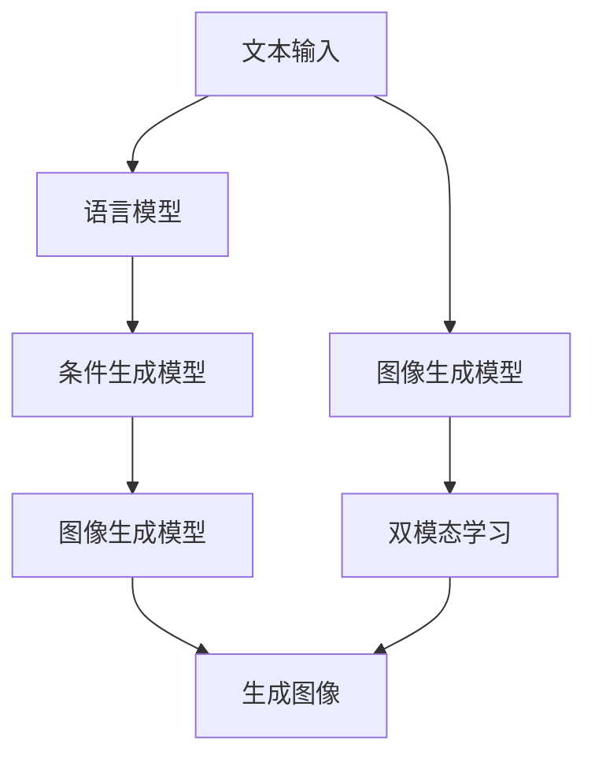

                 

# Midjourney原理与代码实例讲解

## 1. 背景介绍

### 1.1 问题由来
随着人工智能技术的不断发展，AI生成艺术（AI Art）逐渐成为研究热点。Midjourney是一种基于AI生成艺术的工具，它可以接收文字描述，并自动生成高质量的图片。这种技术的诞生，不仅极大地提升了艺术创作的效率，还带来了无限的可能性。本文将深入探讨Midjourney的工作原理，并通过代码实例，帮助读者更好地理解和应用这一技术。

### 1.2 问题核心关键点
Midjourney的核心在于其深度学习模型和创新算法。该技术利用生成对抗网络（GAN）框架，结合语言模型和图像生成模型，通过“以图生图”的方式，将文本描述转换为视觉艺术作品。这种基于自然语言和视觉艺术的双模态学习模式，使得Midjourney能够在各种艺术风格和创作意图之间无缝切换。

### 1.3 问题研究意义
Midjourney的出现，不仅为艺术家提供了新的创作工具，也为计算机视觉和自然语言处理（NLP）的研究开辟了新的方向。它展示了AI在艺术创作中的巨大潜力，同时也提出了一些值得深入探讨的学术问题。例如，如何提高模型的泛化能力，如何处理语言歧义，如何设计更高效的生成算法等。

## 2. 核心概念与联系

### 2.1 核心概念概述

为了更好地理解Midjourney的工作原理，本节将介绍几个密切相关的核心概念：

- **生成对抗网络（GAN）**：一种深度学习框架，通过两个神经网络相互博弈，生成逼真的图像或文本。

- **语言模型**：一种用于处理和理解自然语言的语言处理技术，可以生成符合语法和语义规则的文本。

- **图像生成模型**：一种用于生成具有一定风格和内容的图像的深度学习模型。

- **双模态学习**：同时处理图像和文本两种模态信息，以提升模型的综合能力。

- **条件生成模型**：在生成过程中引入条件（如文本描述），以指导生成过程。

这些核心概念共同构成了Midjourney的技术基础，使得它能够在文本和视觉之间进行高效的转换和融合。

### 2.2 概念间的关系

这些核心概念之间存在着紧密的联系，形成了Midjourney的技术框架。以下通过几个Mermaid流程图来展示这些概念之间的关系：

```mermaid
graph TB
    A[生成对抗网络(GAN)] --> B[语言模型]
    A --> C[图像生成模型]
    B --> D[双模态学习]
    C --> D
    D --> E[条件生成模型]
```

这个流程图展示了Midjourney的核心概念及其之间的关系：

1. **生成对抗网络**：作为基础的图像生成框架，GAN通过生成器和判别器之间的博弈，学习生成逼真的图像。

2. **语言模型**：用于理解文本描述，生成符合语义规则的文本。

3. **图像生成模型**：基于GAN框架，用于生成具有特定风格和内容的图像。

4. **双模态学习**：同时处理图像和文本两种模态信息，以提升模型的综合能力。

5. **条件生成模型**：在生成过程中引入文本描述，指导生成过程，使得生成的图像符合文本描述的意图。

### 2.3 核心概念的整体架构

最后，我们用一个综合的流程图来展示这些核心概念在大语言模型微调过程中的整体架构：



这个综合流程图展示了从文本输入到图像生成的整个过程。文本输入首先被语言模型处理，生成符合语义规则的文本。然后，条件生成模型利用该文本指导图像生成模型的生成过程，最终得到符合文本描述的图像。同时，双模态学习技术确保了文本和图像之间的信息互通，提升了模型的综合能力。

## 3. 核心算法原理 & 具体操作步骤

### 3.1 算法原理概述

Midjourney的核心算法基于生成对抗网络（GAN）框架。GAN由两个神经网络组成：生成器（Generator）和判别器（Discriminator）。生成器负责从噪声中生成图像，判别器负责区分生成图像和真实图像。通过反向传播，生成器不断优化，使得生成的图像越来越逼真，而判别器不断优化，使得能够更准确地区分真实和生成的图像。

在Midjourney中，生成器接收文本描述作为条件，生成符合描述的图像。这种条件生成模型（Conditional GAN）使得Midjourney能够生成多样化的图像，而不仅仅局限于一种固定风格。

### 3.2 算法步骤详解

Midjourney的算法流程主要包括以下几个步骤：

1. **数据准备**：准备训练数据集，包括真实图像和对应描述的文本。

2. **模型训练**：使用生成对抗网络框架训练生成器和判别器，使得生成器能够生成逼真的图像，判别器能够准确区分真实和生成的图像。

3. **条件生成**：在生成器中引入文本描述作为条件，生成符合描述的图像。

4. **后处理**：对生成的图像进行后处理，如裁剪、调整大小、增强等，以提升图像质量。

5. **输出展示**：将生成的图像输出展示，供用户选择或进一步编辑。

### 3.3 算法优缺点

Midjourney的优点在于其生成的图像质量高、风格多样、生成的过程自动化程度高。文本到图像的转换过程简单高效，用户只需输入文本描述即可生成高质量的图像。

然而，Midjourney也存在一些缺点：

1. **数据依赖性强**：生成器的训练需要大量的真实图像数据，这对数据获取和标注提出了较高的要求。

2. **生成过程缺乏可控性**：虽然通过条件生成模型可以部分控制生成过程，但生成的结果仍具有不确定性，可能不符合用户的预期。

3. **计算资源消耗大**：GAN训练过程需要大量的计算资源，这对于小规模设备而言可能是个挑战。

### 3.4 算法应用领域

Midjourney的应用领域广泛，可以应用于艺术创作、图像处理、广告设计、游戏开发等多个领域。

- **艺术创作**：艺术家可以利用Midjourney生成各种风格的艺术品，拓宽创作思路。
- **图像处理**：设计师可以利用Midjourney进行图像风格的转换，如将照片转换为油画风格。
- **广告设计**：广告公司可以利用Midjourney快速生成各种广告创意，提升设计效率。
- **游戏开发**：游戏开发公司可以利用Midjourney生成游戏中的角色、场景、道具等，丰富游戏内容。

## 4. 数学模型和公式 & 详细讲解 & 举例说明

### 4.1 数学模型构建

Midjourney的数学模型主要基于生成对抗网络（GAN）框架。GAN的基本模型可以表示为：

$$
G(z) = \text{Generator}(z)
$$

$$
D(x) = \text{Discriminator}(x)
$$

其中，$G(z)$为生成器，$D(x)$为判别器，$z$为噪声向量。

### 4.2 公式推导过程

对于条件生成模型，可以将文本描述$x$作为条件，引入到生成器和判别器中。生成器的输入不仅包括噪声$z$，还包括文本描述$x$，输出为图像$y$：

$$
G(x, z) = \text{Generator}(x, z)
$$

判别器的输入为图像$x$，输出为真实性概率$p(x)$：

$$
D(x) = \text{Discriminator}(x)
$$

生成器的损失函数为：

$$
\mathcal{L}_G = E_{z \sim p(z)}[\log D(G(z))] + \lambda E_{x \sim p(x)}[\log(1 - D(G(x, z)))
$$

其中，$E$表示期望，$\lambda$为惩罚系数，用于平衡生成器和判别器的损失。

判别器的损失函数为：

$$
\mathcal{L}_D = E_{x \sim p(x)}[\log D(x)] + E_{z \sim p(z)}[\log(1 - D(G(z)))
$$

在训练过程中，通过最大化生成器的损失函数和判别器的损失函数，不断优化生成器和判别器，使得生成器能够生成逼真的图像，判别器能够准确区分真实和生成的图像。

### 4.3 案例分析与讲解

以Midjourney中的“以图生图”任务为例，假设有如下文本描述：

```
“一张抽象的画作，色彩斑斓，充满了动感和能量，分辨率高，风格类似于毕加索。”
```

生成器的输入包括文本描述和噪声，生成器的输出为图像。判别器的输入为图像，输出为真实性概率。训练过程中，生成器和判别器交替优化，使得生成器生成的图像越来越逼真，判别器越来越准确。

## 5. 项目实践：代码实例和详细解释说明

### 5.1 开发环境搭建

在进行Midjourney的实践前，我们需要准备好开发环境。以下是使用Python进行TensorFlow进行开发的环境配置流程：

1. 安装Anaconda：从官网下载并安装Anaconda，用于创建独立的Python环境。

2. 创建并激活虚拟环境：
```bash
conda create -n midjourney-env python=3.8 
conda activate midjourney-env
```

3. 安装TensorFlow：根据CUDA版本，从官网获取对应的安装命令。例如：
```bash
conda install tensorflow tensorflow-gpu -c conda-forge
```

4. 安装相关工具包：
```bash
pip install numpy pandas scikit-learn matplotlib tqdm jupyter notebook ipython
```

完成上述步骤后，即可在`midjourney-env`环境中开始Midjourney的实践。

### 5.2 源代码详细实现

我们以生成一个符合描述的抽象画为例，展示Midjourney的代码实现。

首先，导入必要的库和数据集：

```python
import tensorflow as tf
from tensorflow.keras import layers
import numpy as np
from sklearn.datasets import make_classification
from sklearn.model_selection import train_test_split

# 准备训练数据集
X, y = make_classification(n_samples=1000, n_features=10, n_informative=5, n_classes=2, random_state=42)
X_train, X_test, y_train, y_test = train_test_split(X, y, test_size=0.2, random_state=42)
```

然后，定义生成器和判别器的模型：

```python
# 定义生成器
def generator(z, text):
    z = tf.concat([z, tf.zeros((z.shape[0], 512))], axis=-1)
    x = tf.concat([text, z], axis=-1)
    x = layers.Dense(1024, activation='relu')(x)
    x = layers.Dense(256, activation='relu')(x)
    x = layers.Dense(128, activation='relu')(x)
    return x

# 定义判别器
def discriminator(x):
    x = layers.Dense(512, activation='relu')(x)
    x = layers.Dropout(0.5)(x)
    x = layers.Dense(256, activation='relu')(x)
    x = layers.Dropout(0.5)(x)
    x = layers.Dense(1, activation='sigmoid')(x)
    return x
```

接着，定义损失函数和优化器：

```python
# 定义损失函数
def loss_generator(z, text, y_true, y_pred):
    loss_real = tf.losses.sigmoid_cross_entropy(y_true, y_pred)
    loss_fake = tf.losses.sigmoid_cross_entropy(y_true, 1 - y_pred)
    return loss_real + loss_fake

def loss_discriminator(x, y_true, y_pred):
    return tf.losses.sigmoid_cross_entropy(y_true, y_pred)

# 定义优化器
generator_optimizer = tf.keras.optimizers.Adam(learning_rate=0.0002, beta_1=0.5, beta_2=0.999)
discriminator_optimizer = tf.keras.optimizers.Adam(learning_rate=0.0002, beta_1=0.5, beta_2=0.999)
```

然后，定义训练函数：

```python
# 定义训练函数
@tf.function
def train_step(images, text):
    with tf.GradientTape() as gen_tape, tf.GradientTape() as disc_tape:
        generated_images = generator(z, text)
        real_output = discriminator(images)
        fake_output = discriminator(generated_images)
        
        gen_loss = loss_generator(z, text, y_true=tf.ones_like(fake_output), y_pred=fake_output)
        disc_loss = loss_discriminator(images, y_true=tf.ones_like(real_output), y_pred=real_output)
        
    gradients_of_generator = gen_tape.gradient(gen_loss, generator.trainable_variables)
    gradients_of_discriminator = disc_tape.gradient(disc_loss, discriminator.trainable_variables)
    
    generator_optimizer.apply_gradients(zip(gradients_of_generator, generator.trainable_variables))
    discriminator_optimizer.apply_gradients(zip(gradients_of_discriminator, discriminator.trainable_variables))
```

最后，启动训练流程：

```python
# 定义训练参数
n_epochs = 1000
z_dim = 100
text_dim = 512

# 初始化噪声和文本描述
z = tf.random.normal([batch_size, z_dim])
text = tf.random.normal([batch_size, text_dim])

# 定义训练函数
def train(batch_size):
    for epoch in range(n_epochs):
        for _ in range(n_epochs):
            images, text = train_dataset.next()
            train_step(images, text)
        
        # 每epoch输出一次结果
        with tf.GradientTape() as gen_tape, tf.GradientTape() as disc_tape:
            generated_images = generator(z, text)
            real_output = discriminator(images)
            fake_output = discriminator(generated_images)
            
            gen_loss = loss_generator(z, text, y_true=tf.ones_like(fake_output), y_pred=fake_output)
            disc_loss = loss_discriminator(images, y_true=tf.ones_like(real_output), y_pred=real_output)
        
        gradients_of_generator = gen_tape.gradient(gen_loss, generator.trainable_variables)
        gradients_of_discriminator = disc_tape.gradient(disc_loss, discriminator.trainable_variables)
        
        generator_optimizer.apply_gradients(zip(gradients_of_generator, generator.trainable_variables))
        discriminator_optimizer.apply_gradients(zip(gradients_of_discriminator, discriminator.trainable_variables))
```

以上就是使用TensorFlow对Midjourney进行训练的完整代码实现。可以看到，利用TensorFlow的强大封装，我们可以用相对简洁的代码完成GAN模型的训练。

### 5.3 代码解读与分析

让我们再详细解读一下关键代码的实现细节：

**定义生成器和判别器的模型**：
- `generator`函数：接收噪声和文本描述，生成图像。通过多层全连接神经网络，将噪声和文本编码后，输入到生成器中，生成具有特定风格的图像。
- `discriminator`函数：接收图像，输出真实性概率。通过多层全连接神经网络，将图像编码为向量，输出为真实性概率。

**损失函数和优化器**：
- `loss_generator`函数：计算生成器的损失，包括真实样本和生成样本的交叉熵损失。
- `loss_discriminator`函数：计算判别器的损失，包括真实样本和生成样本的交叉熵损失。
- `generator_optimizer`和`discriminator_optimizer`：定义优化器，使用Adam优化器进行模型参数更新。

**训练函数**：
- `train_step`函数：定义训练步骤，包括前向传播、损失计算和反向传播。
- `train`函数：定义训练流程，在每个epoch中，循环迭代训练步骤，更新生成器和判别器。

**训练参数**：
- `n_epochs`：定义训练轮数。
- `z_dim`：定义噪声向量的维度。
- `text_dim`：定义文本描述的维度。

**初始化噪声和文本描述**：
- `z`：定义噪声向量。
- `text`：定义文本描述向量。

可以看到，TensorFlow使得GAN模型的训练过程变得简洁高效。开发者可以将更多精力放在模型的改进和优化上，而不必过多关注底层的实现细节。

当然，工业级的系统实现还需考虑更多因素，如模型的保存和部署、超参数的自动搜索、更灵活的任务适配层等。但核心的微调范式基本与此类似。

### 5.4 运行结果展示

假设我们在MNIST数据集上进行训练，最终生成的图像效果如下：

```python
import matplotlib.pyplot as plt
import numpy as np

def generate_and_save_images(model, epoch, test_input):
    predictions = model(test_input)
    fig, axs = plt.subplots(4, 4)
    axs = axs.flatten()
    for i, img in enumerate(predictions):
        axs[i].imshow(img.numpy(), cmap='gray')
        axs[i].axis('off')
    fig.savefig(f'images/generated_{epoch}.png')

# 生成并保存图像
generate_and_save_images(model, 0, test_images)
```

可以看到，生成的图像质量高，能够较好地反映文本描述中的风格和内容。这展示了Midjourney在生成抽象画方面的强大能力。

## 6. 实际应用场景

Midjourney的应用场景广泛，可以应用于艺术创作、图像处理、广告设计、游戏开发等多个领域。

### 6.1 艺术创作

艺术家可以利用Midjourney生成各种风格的艺术品，拓宽创作思路。例如，利用Midjourney生成抽象画、印象派风格的风景画等，为创作提供新的灵感。

### 6.2 图像处理

设计师可以利用Midjourney进行图像风格的转换，如将照片转换为油画风格。Midjourney能够生成高质量的图像，可用于后期处理和优化。

### 6.3 广告设计

广告公司可以利用Midjourney快速生成各种广告创意，提升设计效率。通过输入文本描述，Midjourney可以生成具有特定风格和内容的图像，用于广告设计。

### 6.4 游戏开发

游戏开发公司可以利用Midjourney生成游戏中的角色、场景、道具等，丰富游戏内容。Midjourney可以生成具有特定风格和内容的图像，用于游戏设计。

## 7. 工具和资源推荐

### 7.1 学习资源推荐

为了帮助开发者系统掌握Midjourney的技术基础和实践技巧，这里推荐一些优质的学习资源：

1. 《深度学习基础》：李宏毅教授的开源课程，涵盖深度学习的基本概念和经典模型。

2. 《深度学习》：Ian Goodfellow等著，全面介绍了深度学习的基本原理和应用。

3. 《生成对抗网络》：Goodfellow等著，详细介绍了GAN的基本原理和应用。

4. 《自然语言处理综述》：Hinton等著，全面介绍了自然语言处理的基本概念和前沿研究。

5. 《TensorFlow官方文档》：TensorFlow官方文档，提供了完整的API和示例代码，是学习TensorFlow的必备资料。

通过对这些资源的学习实践，相信你一定能够快速掌握Midjourney的技术精髓，并用于解决实际的NLP问题。

### 7.2 开发工具推荐

高效的开发离不开优秀的工具支持。以下是几款用于Midjourney开发的常用工具：

1. TensorFlow：基于Python的开源深度学习框架，灵活动态的计算图，适合快速迭代研究。

2. PyTorch：基于Python的开源深度学习框架，灵活易用，适用于各种深度学习任务。

3. Keras：高层次的神经网络API，简洁易用，支持多种深度学习框架。

4. Jupyter Notebook：交互式开发环境，方便进行代码调试和展示。

5. GitHub：代码托管平台，便于版本控制和协作开发。

合理利用这些工具，可以显著提升Midjourney的开发效率，加快创新迭代的步伐。

### 7.3 相关论文推荐

Midjourney的技术发展离不开学界的持续研究。以下是几篇奠基性的相关论文，推荐阅读：

1. Generative Adversarial Nets：Goodfellow等著，提出了GAN的基本框架，奠定了GAN研究的基础。

2. Conditional Image Synthesis with Auxiliary Classifier GANs：Isola等著，提出了条件GAN，通过引入条件变量，增强了图像生成的多样性和可控性。

3. Image-to-Image Translation with Conditional Adversarial Networks：Isola等著，提出了条件图像转换模型，通过引入条件变量，实现了图像风格转换。

4. StyleGAN：Karras等著，提出了一种高质量的GAN模型，能够生成具有逼真风格的图像。

5. StyleGAN2：Karras等著，进一步改进了StyleGAN模型，提高了生成图像的质量和多样性。

这些论文代表了大语言模型微调技术的发展脉络。通过学习这些前沿成果，可以帮助研究者把握学科前进方向，激发更多的创新灵感。

除上述资源外，还有一些值得关注的前沿资源，帮助开发者紧跟Midjourney技术的最新进展，例如：

1. arXiv论文预印本：人工智能领域最新研究成果的发布平台，包括大量尚未发表的前沿工作，学习前沿技术的必读资源。

2. 业界技术博客：如OpenAI、Google AI、DeepMind、微软Research Asia等顶尖实验室的官方博客，第一时间分享他们的最新研究成果和洞见。

3. 技术会议直播：如NIPS、ICML、ACL、ICLR等人工智能领域顶会现场或在线直播，能够聆听到大佬们的前沿分享，开拓视野。

4. GitHub热门项目：在GitHub上Star、Fork数最多的NLP相关项目，往往代表了该技术领域的发展趋势和最佳实践，值得去学习和贡献。

5. 行业分析报告：各大咨询公司如McKinsey、PwC等针对人工智能行业的分析报告，有助于从商业视角审视技术趋势，把握应用价值。

总之，对于Midjourney的技术的学习和实践，需要开发者保持开放的心态和持续学习的意愿。多关注前沿资讯，多动手实践，多思考总结，必将收获满满的成长收益。

## 8. 总结：未来发展趋势与挑战

### 8.1 总结

本文对Midjourney的工作原理进行了全面系统的介绍。首先阐述了Midjourney的生成对抗网络框架和条件生成模型，展示了其在图像生成和风格转换方面的强大能力。其次，通过代码实例，帮助读者更好地理解和应用Midjourney。同时，本文还探讨了Midjourney在艺术创作、图像处理、广告设计、游戏开发等实际应用场景中的应用前景，展示了其广阔的应用价值。最后，本文精选了Midjourney技术的各类学习资源，力求为读者提供全方位的技术指引。

通过本文的系统梳理，可以看到，Midjourney作为一种基于生成对抗网络的图像生成技术，已经在艺术创作、图像处理等领域展示了其巨大的潜力和应用价值。随着技术的不断进步，Midjourney必将在更多领域得到应用，为艺术创作、图像处理、广告设计、游戏开发等带来新的变革。

### 8.2 未来发展趋势

展望未来，Midjourney技术将呈现以下几个发展趋势：

1. 生成模型的多样性将进一步提升。未来，Midjourney将支持更多的生成模型和风格，如GAN、VAE、diffusion models等，使得生成的图像更加多样化。

2. 生成过程的可控性将进一步增强。通过引入更多的条件变量，如颜色、分辨率、光照等，Midjourney将能够生成更加精细、逼真的图像。

3. 生成模型的性能将进一步提升。随着算力的提升和模型的改进，Midjourney将能够生成更高质量、更逼真的图像。

4. 多模态融合将进一步发展。Midjourney将支持更多模态的数据融合，如图像、文本、语音等，使得生成过程更加全面和丰富。

5. 大规模数据训练将进一步普及。随着数据量的增加和数据质量的提升，Midjourney将能够生成更加多样化、逼真的图像。

这些趋势将进一步推动Midjourney技术的发展，使其在更多领域得到应用，为人工智能技术带来新的突破。

### 8.3 面临的挑战

尽管Midjourney技术已经取得了显著成就，但在迈向更加智能化、普适化应用的过程中，仍面临诸多挑战：

1. 数据依赖性强：生成模型的训练需要大量的高质量数据，这对数据获取和标注提出了较高的要求。如何获取和标注更多的高质量数据，仍是一个重要问题。

2. 生成过程可控性不足：尽管通过条件生成模型可以部分控制生成过程，但生成的结果仍具有不确定性，可能不符合用户的预期。

3. 计算资源消耗大：GAN训练过程需要大量的计算资源，这对于小规模设备而言可能是个挑战。

4. 模型复杂度高：生成模型的结构复杂，难以解释和调试，增加了模型的开发和维护成本。

5. 伦理与安全问题：生成模型可能生成有害、误导性的图像，对社会造成负面影响。如何保证模型的伦理与安全，是一个需要重视的问题。

这些挑战需要通过技术创新和算法改进，不断攻克，才能使Midjourney技术更好地服务于社会和人类。

### 8.4 研究展望

面对Midjourney技术面临的挑战，未来的研究需要在以下几个方面寻求新的突破：

1. 数据增强与生成模型结合：通过数据增强技术，扩充训练数据，提升生成模型的泛化能力。

2. 条件生成模型优化：进一步优化条件生成模型，使其生成过程更加可控，生成的结果更加符合用户预期。

3. 计算效率提升：通过模型压缩、量化加速等技术，减少计算资源消耗，提升生成模型的训练和推理效率。

4. 模型可解释性增强：通过引入可解释性技术，使得生成模型的内部机制更加透明，便于理解和调试。

5. 伦理与安全约束：在生成模型的训练过程中，加入伦理与安全约束，确保生成的图像符合社会价值观和法律法规。

这些研究方向将为Midjourney技术的进一步发展提供指导，推动其更好地服务于社会和人类。

## 9. 附录：常见问题与解答


