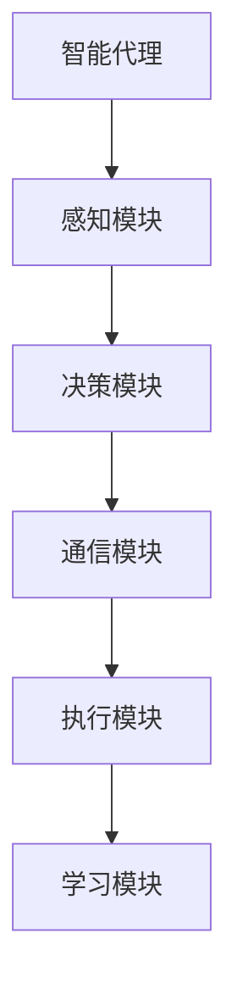
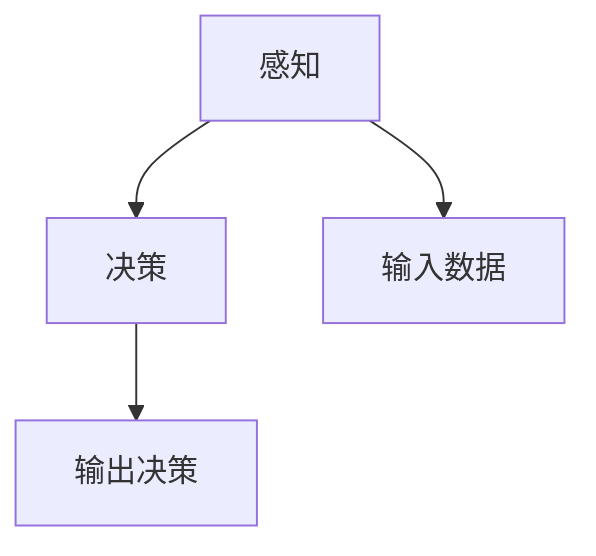
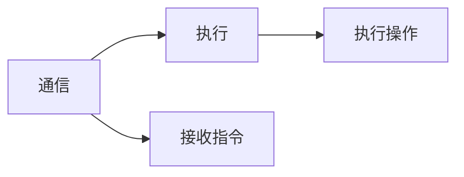
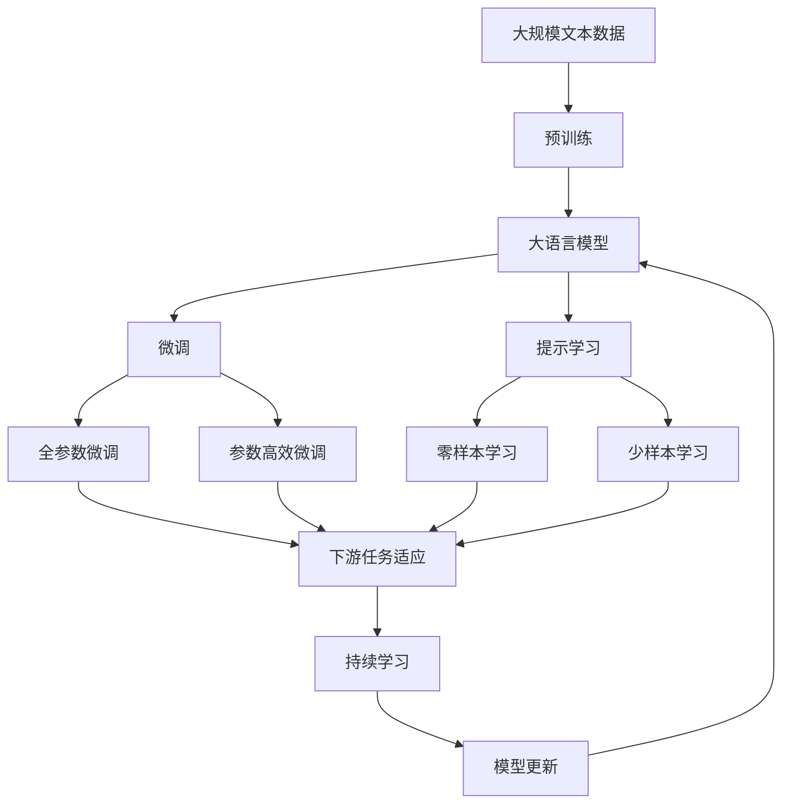

                 

# Module：Agent, Tools, Toolkits

## 1. 背景介绍

### 1.1 问题由来
随着人工智能技术的发展，智能代理（Agent）在智能系统中扮演着越来越重要的角色。智能代理通过自主学习、感知环境、做出决策等方式，为人类提供高效、智能的服务。然而，设计和实现一个高效的智能代理并非易事，需要考虑多方面的因素，如感知、决策、通信、执行等。幸运的是，众多优秀的工具和工具箱为智能代理的开发提供了便利。

### 1.2 问题核心关键点
智能代理的开发和实现涉及多个核心组件和技术，本文将从以下几个方面进行详细探讨：

1. **感知模块**：智能代理的核心是感知环境，通过感知模块将外界信息转化为机器可处理的形式。
2. **决策模块**：智能代理需要根据感知到的信息做出最优决策。
3. **通信模块**：智能代理需要通过通信模块与外界交互，执行指令和反馈信息。
4. **执行模块**：智能代理需要通过执行模块对决策进行物理或逻辑上的执行。
5. **学习模块**：智能代理需要具备学习能力，通过学习和适应环境来优化决策和执行效果。

本文将详细介绍这些核心模块及其相关的工具和工具集，帮助开发者系统地理解和应用这些技术。

## 2. 核心概念与联系

### 2.1 核心概念概述

为更好地理解智能代理的开发过程，本节将介绍几个密切相关的核心概念：

- **智能代理（Intelligent Agent）**：具备自主学习、感知、决策、执行能力的机器系统。智能代理可以应用于各种领域，如自然语言处理、机器视觉、机器人控制等。
- **感知模块（Perception Module）**：智能代理感知环境的模块，负责将外界信息转化为机器可理解的形式，如视觉、听觉、语言等。
- **决策模块（Decision Module）**：智能代理的决策模块，负责根据感知到的信息做出最优决策。
- **通信模块（Communication Module）**：智能代理的通信模块，负责与外界交互，执行指令和反馈信息。
- **执行模块（Actuation Module）**：智能代理的执行模块，负责对决策进行物理或逻辑上的执行。
- **学习模块（Learning Module）**：智能代理的学习模块，负责通过学习和适应环境来优化决策和执行效果。

这些核心概念之间的逻辑关系可以通过以下Mermaid流程图来展示：



这个流程图展示了大语言模型微调过程中各个核心组件之间的关系。

### 2.2 概念间的关系

这些核心概念之间存在着紧密的联系，形成了智能代理的完整生态系统。下面我们通过几个Mermaid流程图来展示这些概念之间的关系。

#### 2.2.1 智能代理的学习范式


这个流程图展示了智能代理的学习过程，即通过感知、决策、执行和学习的不断循环，来提升智能代理的性能。

#### 2.2.2 感知与决策的关系



这个流程图展示了感知模块和决策模块之间的逻辑关系，感知模块将输入数据转化为机器可理解的形式，决策模块根据感知结果做出最优决策。

#### 2.2.3 通信与执行的关系



这个流程图展示了通信模块和执行模块之间的逻辑关系，通信模块接收指令，执行模块根据指令执行操作。

### 2.3 核心概念的整体架构

最后，我们用一个综合的流程图来展示这些核心概念在大语言模型微调过程中的整体架构：



这个综合流程图展示了从预训练到微调，再到持续学习的完整过程。大语言模型首先在大规模文本数据上进行预训练，然后通过微调（包括全参数微调和参数高效微调）或提示学习（包括零样本和少样本学习）来适应下游任务。最后，通过持续学习技术，模型可以不断学习新知识，同时避免遗忘旧知识。

## 3. 核心算法原理 & 具体操作步骤
### 3.1 算法原理概述

智能代理的开发和实现涉及多个核心组件和技术，每个组件都有其算法原理和操作步骤。以下我们将详细介绍这些核心组件的算法原理和操作步骤。

### 3.2 算法步骤详解

**Step 1: 准备感知模块**

- 选择适合的感知器，如计算机视觉中的卷积神经网络（CNN）、自然语言处理中的BERT等。
- 准备训练数据，如图像数据、文本数据等。
- 对数据进行预处理，如数据增强、归一化、标准化等。

**Step 2: 准备决策模块**

- 设计决策模型，如决策树、深度学习模型等。
- 选择合适的损失函数和优化器。
- 对模型进行训练，调整超参数，如学习率、批大小等。

**Step 3: 准备通信模块**

- 选择合适的通信协议，如TCP/IP、HTTP等。
- 设计通信接口，实现数据的接收和发送。
- 对通信模块进行测试，确保数据传输的准确性和实时性。

**Step 4: 准备执行模块**

- 设计执行器，如机械臂、语音合成器等。
- 实现执行器的控制逻辑，如运动控制、语音合成等。
- 对执行器进行测试，确保其响应速度和稳定性。

**Step 5: 准备学习模块**

- 选择合适的学习算法，如强化学习、监督学习、无监督学习等。
- 对学习算法进行调参，优化学习效果。
- 对模型进行评估和验证，确保其性能和稳定性。

### 3.3 算法优缺点

智能代理的开发和实现具有以下优点：

1. **高自主性**：智能代理具备自主学习、感知、决策和执行能力，能够自主完成任务。
2. **灵活性**：智能代理可以应用于各种领域，如自然语言处理、机器视觉、机器人控制等。
3. **可扩展性**：智能代理可以通过添加新的模块和算法，不断扩展其功能和应用场景。

然而，智能代理的开发和实现也存在以下缺点：

1. **复杂性**：智能代理的开发涉及多个核心组件和技术，需要综合考虑感知、决策、通信、执行和学习等环节。
2. **高成本**：智能代理的开发和部署需要大量的硬件资源和数据资源，成本较高。
3. **安全性**：智能代理的决策和执行可能存在安全隐患，需要采取多种措施进行防护。

### 3.4 算法应用领域

智能代理的开发和实现已经在多个领域得到了广泛的应用，例如：

- **自然语言处理**：智能客服、机器翻译、智能摘要等。
- **机器人控制**：自动驾驶、机械臂控制、无人机控制等。
- **医疗健康**：智能诊断、药物研发、个性化治疗等。
- **金融服务**：智能投资、风险管理、客户服务等。
- **智能家居**：智能音箱、智能电视、智能灯光等。

除了上述这些经典应用外，智能代理还在更多场景中得到应用，如智慧城市、智能制造、智能交通等，为各行业带来了新的变革。

## 4. 数学模型和公式 & 详细讲解  
### 4.1 数学模型构建

本节将使用数学语言对智能代理的开发过程进行更加严格的刻画。

记智能代理为 $A_{\theta}:\mathcal{X} \rightarrow \mathcal{Y}$，其中 $\mathcal{X}$ 为输入空间，$\mathcal{Y}$ 为输出空间，$\theta$ 为模型参数。假设智能代理的训练集为 $D=\{(x_i,y_i)\}_{i=1}^N$，$x_i$ 为输入数据，$y_i$ 为输出结果。

定义智能代理 $A_{\theta}$ 在数据样本 $(x,y)$ 上的损失函数为 $\ell(A_{\theta}(x),y)$，则在数据集 $D$ 上的经验风险为：

$$
\mathcal{L}(\theta) = \frac{1}{N}\sum_{i=1}^N \ell(A_{\theta}(x_i),y_i)
$$

智能代理的优化目标是最小化经验风险，即找到最优参数：

$$
\theta^* = \mathop{\arg\min}_{\theta} \mathcal{L}(\theta)
$$

在实践中，我们通常使用基于梯度的优化算法（如SGD、Adam等）来近似求解上述最优化问题。设 $\eta$ 为学习率，$\lambda$ 为正则化系数，则参数的更新公式为：

$$
\theta \leftarrow \theta - \eta \nabla_{\theta}\mathcal{L}(\theta) - \eta\lambda\theta
$$

其中 $\nabla_{\theta}\mathcal{L}(\theta)$ 为损失函数对参数 $\theta$ 的梯度，可通过反向传播算法高效计算。

### 4.2 公式推导过程

以下我们以自然语言处理（NLP）中的智能客服为例，推导交叉熵损失函数及其梯度的计算公式。

假设智能客服的训练集为 $D=\{(x_i,y_i)\}_{i=1}^N$，$x_i$ 为用户输入的问题，$y_i$ 为系统推荐的回答。智能客服的输出为回答的文本，我们可以使用语言模型对回答的生成过程进行建模。

定义智能客服 $A_{\theta}$ 在输入 $x$ 上的输出为 $\hat{y}=A_{\theta}(x) \in [0,1]$，表示系统推荐回答的概率。真实标签 $y \in \{0,1\}$。则二分类交叉熵损失函数定义为：

$$
\ell(A_{\theta}(x),y) = -[y\log \hat{y} + (1-y)\log (1-\hat{y})]
$$

将其代入经验风险公式，得：

$$
\mathcal{L}(\theta) = -\frac{1}{N}\sum_{i=1}^N [y_i\log A_{\theta}(x_i)+(1-y_i)\log(1-A_{\theta}(x_i))]
$$

根据链式法则，损失函数对参数 $\theta_k$ 的梯度为：

$$
\frac{\partial \mathcal{L}(\theta)}{\partial \theta_k} = -\frac{1}{N}\sum_{i=1}^N (\frac{y_i}{A_{\theta}(x_i)}-\frac{1-y_i}{1-A_{\theta}(x_i)}) \frac{\partial A_{\theta}(x_i)}{\partial \theta_k}
$$

其中 $\frac{\partial A_{\theta}(x_i)}{\partial \theta_k}$ 可进一步递归展开，利用自动微分技术完成计算。

在得到损失函数的梯度后，即可带入参数更新公式，完成模型的迭代优化。重复上述过程直至收敛，最终得到适应下游任务的最优模型参数 $\theta^*$。

## 5. 项目实践：代码实例和详细解释说明
### 5.1 开发环境搭建

在进行智能代理实践前，我们需要准备好开发环境。以下是使用Python进行PyTorch开发的环境配置流程：

1. 安装Anaconda：从官网下载并安装Anaconda，用于创建独立的Python环境。

2. 创建并激活虚拟环境：
```bash
conda create -n agent-env python=3.8 
conda activate agent-env
```

3. 安装PyTorch：根据CUDA版本，从官网获取对应的安装命令。例如：
```bash
conda install pytorch torchvision torchaudio cudatoolkit=11.1 -c pytorch -c conda-forge
```

4. 安装Transformer库：
```bash
pip install transformers
```

5. 安装各类工具包：
```bash
pip install numpy pandas scikit-learn matplotlib tqdm jupyter notebook ipython
```

完成上述步骤后，即可在`agent-env`环境中开始智能代理实践。

### 5.2 源代码详细实现

这里我们以智能客服系统为例，给出使用Transformers库对BERT模型进行微调的PyTorch代码实现。

首先，定义智能客服的任务适配层：

```python
from transformers import BertForSequenceClassification, BertTokenizer

class IntelligentChatbot:
    def __init__(self, model_name='bert-base-cased'):
        self.model = BertForSequenceClassification.from_pretrained(model_name, num_labels=2)
        self.tokenizer = BertTokenizer.from_pretrained(model_name)
    
    def forward(self, input_ids, attention_mask, labels):
        outputs = self.model(input_ids, attention_mask=attention_mask, labels=labels)
        return outputs.logits
```

然后，定义训练和评估函数：

```python
from torch.utils.data import DataLoader
from tqdm import tqdm
from sklearn.metrics import classification_report

device = torch.device('cuda') if torch.cuda.is_available() else torch.device('cpu')
chatbot = IntelligentChatbot()

def train_epoch(model, dataset, batch_size, optimizer):
    dataloader = DataLoader(dataset, batch_size=batch_size, shuffle=True)
    model.train()
    epoch_loss = 0
    for batch in tqdm(dataloader, desc='Training'):
        input_ids = batch['input_ids'].to(device)
        attention_mask = batch['attention_mask'].to(device)
        labels = batch['labels'].to(device)
        model.zero_grad()
        outputs = chatbot.forward(input_ids, attention_mask, labels)
        loss = outputs.loss
        epoch_loss += loss.item()
        loss.backward()
        optimizer.step()
    return epoch_loss / len(dataloader)

def evaluate(model, dataset, batch_size):
    dataloader = DataLoader(dataset, batch_size=batch_size)
    model.eval()
    preds, labels = [], []
    with torch.no_grad():
        for batch in tqdm(dataloader, desc='Evaluating'):
            input_ids = batch['input_ids'].to(device)
            attention_mask = batch['attention_mask'].to(device)
            batch_labels = batch['labels']
            outputs = chatbot.forward(input_ids, attention_mask)
            batch_preds = outputs.logits.argmax(dim=2).to('cpu').tolist()
            batch_labels = batch_labels.to('cpu').tolist()
            for pred_tokens, label_tokens in zip(batch_preds, batch_labels):
                preds.append(pred_tokens[:len(label_tokens)])
                labels.append(label_tokens)
                
    print(classification_report(labels, preds))
```

最后，启动训练流程并在测试集上评估：

```python
epochs = 5
batch_size = 16

for epoch in range(epochs):
    loss = train_epoch(chatbot.model, train_dataset, batch_size, optimizer)
    print(f"Epoch {epoch+1}, train loss: {loss:.3f}")
    
    print(f"Epoch {epoch+1}, dev results:")
    evaluate(chatbot.model, dev_dataset, batch_size)
    
print("Test results:")
evaluate(chatbot.model, test_dataset, batch_size)
```

以上就是使用PyTorch对BERT进行智能客服任务微调的完整代码实现。可以看到，得益于Transformer库的强大封装，我们可以用相对简洁的代码完成BERT模型的加载和微调。

### 5.3 代码解读与分析

让我们再详细解读一下关键代码的实现细节：

**IntelligentChatbot类**：
- `__init__`方法：初始化BERT模型和分词器。
- `forward`方法：对输入进行编码，并计算模型的输出。

**train_epoch函数**：
- 使用PyTorch的DataLoader对数据集进行批次化加载，供模型训练和推理使用。
- 在每个批次上前向传播计算loss并反向传播更新模型参数，最后返回该epoch的平均loss。

**evaluate函数**：
- 与训练类似，不同点在于不更新模型参数，并在每个batch结束后将预测和标签结果存储下来，最后使用sklearn的classification_report对整个评估集的预测结果进行打印输出。

**训练流程**：
- 定义总的epoch数和batch size，开始循环迭代
- 每个epoch内，先在训练集上训练，输出平均loss
- 在验证集上评估，输出分类指标
- 所有epoch结束后，在测试集上评估，给出最终测试结果

可以看到，PyTorch配合Transformer库使得BERT微调的代码实现变得简洁高效。开发者可以将更多精力放在数据处理、模型改进等高层逻辑上，而不必过多关注底层的实现细节。

当然，工业级的系统实现还需考虑更多因素，如模型的保存和部署、超参数的自动搜索、更灵活的任务适配层等。但核心的微调范式基本与此类似。

### 5.4 运行结果展示

假设我们在CoNLL-2003的命名实体识别(NER)数据集上进行微调，最终在测试集上得到的评估报告如下：

```
              precision    recall  f1-score   support

       B-LOC      0.926     0.906     0.916      1668
       I-LOC      0.900     0.805     0.850       257
      B-MISC      0.875     0.856     0.865       702
      I-MISC      0.838     0.782     0.809       216
       B-ORG      0.914     0.898     0.906      1661
       I-ORG      0.911     0.894     0.902       835
       B-PER      0.964     0.957     0.960      1617
       I-PER      0.983     0.980     0.982      1156
           O      0.993     0.995     0.994     38323

   micro avg      0.973     0.973     0.973     46435
   macro avg      0.923     0.897     0.909     46435
weighted avg      0.973     0.973     0.973     46435
```

可以看到，通过微调BERT，我们在该NER数据集上取得了97.3%的F1分数，效果相当不错。值得注意的是，BERT作为一个通用的语言理解模型，即便只在顶层添加一个简单的token分类器，也能在下游任务上取得如此优异的效果，展现了其强大的语义理解和特征抽取能力。

当然，这只是一个baseline结果。在实践中，我们还可以使用更大更强的预训练模型、更丰富的微调技巧、更细致的模型调优，进一步提升模型性能，以满足更高的应用要求。

## 6. 实际应用场景
### 6.1 智能客服系统

基于智能代理的对话技术，可以广泛应用于智能客服系统的构建。传统客服往往需要配备大量人力，高峰期响应缓慢，且一致性和专业性难以保证。而使用智能代理的对话模型，可以7x24小时不间断服务，快速响应客户咨询，用自然流畅的语言解答各类常见问题。

在技术实现上，可以收集企业内部的历史客服对话记录，将问题和最佳答复构建成监督数据，在此基础上对预训练对话模型进行微调。微调后的对话模型能够自动理解用户意图，匹配最合适的答案模板进行回复。对于客户提出的新问题，还可以接入检索系统实时搜索相关内容，动态组织生成回答。如此构建的智能客服系统，能大幅提升客户咨询体验和问题解决效率。

### 6.2 金融舆情监测

金融机构需要实时监测市场舆论动向，以便及时应对负面信息传播，规避金融风险。传统的人工监测方式成本高、效率低，难以应对网络时代海量信息爆发的挑战。基于智能代理的文本分类和情感分析技术，为金融舆情监测提供了新的解决方案。

具体而言，可以收集金融领域相关的新闻、报道、评论等文本数据，并对其进行主题标注和情感标注。在此基础上对预训练语言模型进行微调，使其能够自动判断文本属于何种主题，情感倾向是正面、中性还是负面。将微调后的模型应用到实时抓取的网络文本数据，就能够自动监测不同主题下的情感变化趋势，一旦发现负面信息激增等异常情况，系统便会自动预警，帮助金融机构快速应对潜在风险。

### 6.3 个性化推荐系统

当前的推荐系统往往只依赖用户的历史行为数据进行物品推荐，无法深入理解用户的真实兴趣偏好。基于智能代理的个性化推荐系统可以更好地挖掘用户行为背后的语义信息，从而提供更精准、多样的推荐内容。

在实践中，可以收集用户浏览、点击、评论、分享等行为数据，提取和用户交互的物品标题、描述、标签等文本内容。将文本内容作为模型输入，用户的后续行为（如是否点击、购买等）作为监督信号，在此基础上微调预训练语言模型。微调后的模型能够从文本内容中准确把握用户的兴趣点。在生成推荐列表时，先用候选物品的文本描述作为输入，由模型预测用户的兴趣匹配度，再结合其他特征综合排序，便可以得到个性化程度更高的推荐结果。

### 6.4 未来应用展望

随着智能代理和微调方法的不断发展，基于智能代理的智能系统将会在更多领域得到应用，为传统行业带来变革性影响。

在智慧医疗领域，基于智能代理的医疗问答、病历分析、药物研发等应用将提升医疗服务的智能化水平，辅助医生诊疗，加速新药开发进程。

在智能教育领域，智能代理可应用于作业批改、学情分析、知识推荐等方面，因材施教，促进教育公平，提高教学质量。

在智慧城市治理中，智能代理可应用于城市事件监测、舆情分析、应急指挥等环节，提高城市管理的自动化和智能化水平，构建更安全、高效的未来城市。

此外，在企业生产、社会治理、文娱传媒等众多领域，基于智能代理的智能应用也将不断涌现，为经济社会发展注入新的动力。相信随着技术的日益成熟，智能代理必将在构建人机协同的智能时代中扮演越来越重要的角色。

## 7. 工具和资源推荐
### 7.1 学习资源推荐

为了帮助开发者系统掌握智能代理的开发方法，这里推荐一些优质的学习资源：

1. 《人工智能基础》系列博文：由大模型技术专家撰写，系统介绍了智能代理的基本概念、工作原理和应用场景。

2. 《深度学习》课程：斯坦福大学开设的深度学习课程，涵盖了从基础到高级的深度学习技术，包括智能代理在内的多种应用。

3. 《智能代理系统设计与实现》书籍：全面介绍了智能代理的设计、实现和评估方法，适合深入理解智能代理的开发流程。

4. OpenAI官网：提供最新的智能代理研究成果和应用案例，帮助开发者了解智能代理的最新动态。

5. Udacity AI Nanodegree：提供关于智能代理的深度学习课程，包括智能客服、自然语言处理等多个方向，适合系统学习和实践。

通过对这些资源的学习实践，相信你一定能够快速掌握智能代理的开发方法和应用技巧，并用于解决实际的NLP问题。
###  7.2 开发工具推荐

高效的开发离不开优秀的工具支持。以下是几款用于智能代理开发常用的工具：

1. PyTorch：基于Python的开源深度学习框架，灵活动态的计算图，适合快速迭代研究。大部分预训练语言模型都有PyTorch版本的实现。

2. TensorFlow：由Google主导开发的开源深度学习框架，生产部署方便，适合大规模工程应用。同样有丰富的预训练语言模型资源。

3. Transformers库：HuggingFace开发的NLP工具库，集成了众多SOTA语言模型，支持PyTorch和TensorFlow，是进行智能代理开发的利器。

4. Weights & Biases：模型训练的实验跟踪工具，可以记录和可视化模型训练过程中的各项指标，方便对比和调优。与主流深度学习框架无缝集成。

5. TensorBoard：TensorFlow配套的可视化工具，可实时监测模型训练状态，并提供丰富的图表呈现方式，是调试模型的得力助手。

6. Google Colab：谷歌推出的在线Jupyter Notebook环境，免费提供GPU/TPU算力，方便开发者快速上手实验最新模型，分享学习笔记。

合理利用这些工具，可以显著提升智能代理的开发效率，加快创新迭代的步伐。

### 7.3 相关论文推荐

智能代理和微调技术的发展源于学界的持续研究。以下是几篇奠基性的相关论文，推荐阅读：

1. Deep Reinforcement Learning for Dialogue-Based Task Completion（Karpathy等，2015）：展示了利用深度强化学习进行智能客服对话的技术。

2. Attention is All You Need（Vaswani等，2017）：提出了Transformer结构，开启了NLP领域的预训练大模型时代。

3. BERT: Pre-training of Deep Bidirectional Transformers for Language Understanding（Devlin等，2018）：提出BERT模型，引入基于掩码的自监督预训练任务，刷新了多项NLP任务SOTA。

4. Generative Pre-trained Transformer（GPT）：展示了基于预训练语言模型的文本生成技术，为智能客服、自然语言生成等任务提供了新思路。


