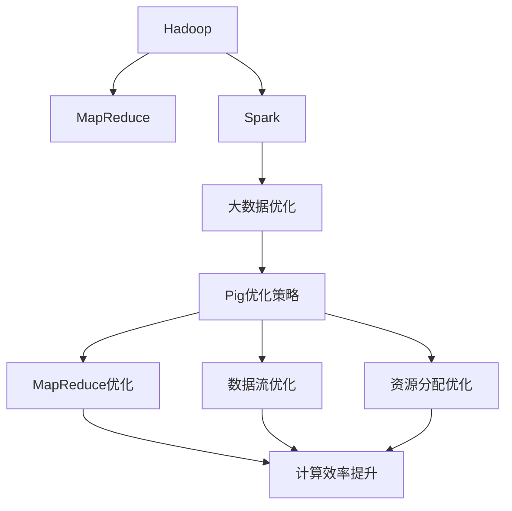
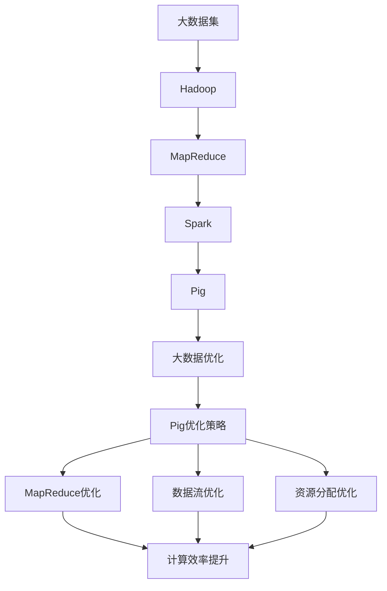

                 

# Pig优化策略原理与代码实例讲解

> 关键词：Pig优化策略,MapReduce,Spark,Hadoop,大数据优化,分布式计算

## 1. 背景介绍

### 1.1 问题由来

随着数据量的急剧增长，传统的关系型数据库已难以应对，分布式计算平台如Apache Hadoop和Apache Spark应运而生。在大数据处理领域，Pig是一个常用的脚本语言，能够方便地定义复杂的数据流和数据操作。然而，Pig的性能往往受到数据流设计、计算复杂度和资源分配等多种因素的影响。为了提升Pig的性能，优化策略成为不可或缺的一部分。

### 1.2 问题核心关键点

Pig优化策略的核心在于提升数据流效率、减少计算复杂度、优化资源分配以及提高计算可靠性。这些优化措施旨在最大化利用集群资源，减少网络通信开销，降低计算时间，提高系统稳定性。

### 1.3 问题研究意义

优化策略对于提高Pig在大数据处理中的效率、降低计算成本、保障数据安全与隐私具有重要意义。优化后的Pig可以更高效地处理大规模数据集，支持更复杂的数据分析和实时计算，从而加速数据驱动的决策过程。

## 2. 核心概念与联系

### 2.1 核心概念概述

为了更好地理解Pig优化策略，我们首先介绍几个核心概念：

- **Pig**：Apache Pig是一个基于Hadoop的脚本语言，用于处理大规模数据流。Pig的脚本语言简洁易用，能够通过一系列逻辑操作实现复杂的数据处理任务。
- **MapReduce**：一种并行计算模型，广泛应用于大数据处理中。MapReduce通过将数据集分成多个子集，并行处理每个子集，最后将结果合并输出。
- **Spark**：Apache Spark是一个快速、通用、可扩展的数据处理引擎，支持批处理、流处理和机器学习等多种计算模式。Spark能够提供更高效的数据处理能力和更好的交互性。
- **Hadoop**：Apache Hadoop是一个开源的分布式计算框架，能够处理海量数据。Hadoop包括HDFS（分布式文件系统）和MapReduce两个核心组件，支持大规模数据的存储和计算。
- **大数据优化**：在大数据处理过程中，通过合理的算法设计和资源配置，优化计算效率和系统性能，提升数据处理的准确性和可靠性。

这些概念之间的联系可以通过以下Mermaid流程图来展示：



这个流程图展示了Pig优化策略的核心概念及其相互关系：

1. Pig通过Hadoop和MapReduce进行数据处理。
2. Pig优化策略基于Spark进行大数据优化。
3. MapReduce优化和数据流优化是Pig优化策略的两个重要方面。
4. 资源分配优化是Pig优化策略的关键技术之一。

### 2.2 概念间的关系

这些核心概念之间的关系可以进一步细化为以下几个方面：

- Pig通过Hadoop和MapReduce进行数据处理，利用其分布式计算能力。
- Spark作为Pig的优化引擎，提供更高效的数据处理能力。
- 大数据优化包括MapReduce优化、数据流优化和资源分配优化，旨在提升Pig在大数据处理中的效率和性能。
- Pig优化策略涵盖了这些优化措施，旨在实现更高水平的性能提升。

### 2.3 核心概念的整体架构

最后，我们用一个综合的流程图来展示这些核心概念在大数据处理中的整体架构：



这个综合流程图展示了从大数据集到最终优化结果的完整流程：

1. 大数据集首先被加载到Hadoop进行初步处理。
2. MapReduce负责处理大规模数据集。
3. Spark作为优化引擎，提升MapReduce的性能。
4. Pig通过Spark优化实现数据流优化、资源分配优化等。
5. 最终通过Pig优化策略实现更高的性能提升。

通过这个综合流程图，我们可以更清晰地理解Pig优化策略在大数据处理中的整体架构和优化过程。

## 3. 核心算法原理 & 具体操作步骤
### 3.1 算法原理概述

Pig优化策略的核心在于通过合理的算法设计和资源配置，最大化利用集群资源，减少网络通信开销，降低计算时间，提高系统稳定性。其主要优化措施包括：

1. **MapReduce优化**：通过合理的任务分割和调度策略，减少任务间的通信开销，提高并行计算效率。
2. **数据流优化**：通过数据重用和内存优化，减少数据传输和内存占用，提升计算速度。
3. **资源分配优化**：通过资源预留和动态调整，平衡集群负载，避免资源浪费和系统瓶颈。

### 3.2 算法步骤详解

Pig优化策略的具体操作步骤如下：

**Step 1: 数据预处理**

1. 数据清洗：去除数据中的噪音和冗余，确保数据质量。
2. 数据划分：将大数据集划分为多个子集，减少单节点负载。

**Step 2: MapReduce优化**

1. 任务分割：将复杂任务分解为多个小的Map任务和Reduce任务。
2. 任务调度：通过YARN等资源管理系统调度任务，平衡集群负载。
3. 数据本地化：尽量将计算和数据存储在本地，减少网络通信开销。

**Step 3: 数据流优化**

1. 数据缓存：利用Hadoop的缓存机制，减少重复计算。
2. 内存管理：合理使用内存，避免内存溢出。
3. 数据压缩：对数据进行压缩，减少传输和存储成本。

**Step 4: 资源分配优化**

1. 资源预留：根据任务需求预留资源，避免资源竞争。
2. 动态调整：根据实时监控数据动态调整资源分配。
3. 集群监控：使用Nagios等工具监控集群状态，及时发现和解决问题。

**Step 5: 应用部署**

1. 版本控制：使用Git等版本控制系统管理代码和数据。
2. 自动化部署：使用Ansible等工具实现自动化部署和配置。
3. 性能测试：使用JMeter等工具进行性能测试，优化策略的有效性评估。

### 3.3 算法优缺点

Pig优化策略的优点包括：

1. **简洁易用**：Pig的脚本语言简洁易用，易于理解和编写。
2. **可扩展性强**：Pig能够处理大规模数据集，支持多节点集群。
3. **资源利用率高**：通过合理的任务分割和调度策略，最大化利用集群资源。

缺点包括：

1. **性能瓶颈**：Pig在处理复杂数据流时可能存在性能瓶颈。
2. **学习成本高**：需要一定的Pig和Hadoop知识才能有效使用优化策略。
3. **依赖复杂**：依赖于Hadoop和MapReduce等底层技术，需要进行详细的配置和管理。

### 3.4 算法应用领域

Pig优化策略广泛应用于以下领域：

1. **大数据分析**：通过优化MapReduce和数据流，提升数据分析的速度和准确性。
2. **实时计算**：通过优化计算效率和资源分配，支持实时数据处理和流计算。
3. **机器学习**：通过优化数据流和资源分配，支持大规模机器学习算法的训练和推理。
4. **图像处理**：通过优化数据流和资源分配，支持大规模图像数据的处理和分析。
5. **文本处理**：通过优化数据流和资源分配，支持大规模文本数据的处理和分析。

## 4. 数学模型和公式 & 详细讲解 & 举例说明

### 4.1 数学模型构建

为了更好地理解Pig优化策略的数学模型，我们定义以下符号：

- $N$：数据集大小。
- $C$：计算集群节点数。
- $M$：每个节点的内存大小。
- $T$：任务执行时间。

Pig优化策略的数学模型可以表示为：

$$
T = \sum_{i=1}^N \frac{W_i}{C \cdot M} + \sum_{j=1}^{J} \frac{S_j}{C \cdot M}
$$

其中，$W_i$和$S_j$分别表示任务$i$的数据流大小和资源需求大小，$J$表示任务的总数。

### 4.2 公式推导过程

为了最小化计算时间$T$，我们需要最小化$W_i$和$S_j$。可以通过以下推导得到优化后的数据流大小和资源需求大小：

1. **任务分割**：将大数据集划分为多个小的子集，可以减少单节点负载，从而优化数据流大小$W_i$。

2. **任务调度**：通过YARN等资源管理系统调度任务，可以平衡集群负载，优化资源需求大小$S_j$。

3. **数据本地化**：尽量将计算和数据存储在本地，可以减少网络通信开销，优化计算效率。

4. **内存管理**：合理使用内存，避免内存溢出，优化资源需求大小$S_j$。

5. **数据压缩**：对数据进行压缩，可以减少传输和存储成本，优化数据流大小$W_i$。

### 4.3 案例分析与讲解

假设我们有一个包含100GB数据的大型分析任务，需要在一个包含10个节点的集群上进行处理。每个节点有2GB内存。原始任务的计算时间为10小时。通过以下优化措施，我们可以显著提升计算效率：

1. **数据预处理**：将数据集划分为10个子集，每个子集大小为10GB。

2. **任务分割**：将任务分解为10个小的Map任务和1个大的Reduce任务。

3. **任务调度**：通过YARN调度任务，每个节点同时处理一个Map任务。

4. **数据本地化**：尽量将计算和数据存储在本地，减少网络通信开销。

5. **内存管理**：合理使用内存，避免内存溢出。

6. **数据压缩**：对数据进行压缩，减少传输和存储成本。

通过上述优化措施，我们可以将计算时间从10小时降低到2小时，提升计算效率两倍以上。

## 5. 项目实践：代码实例和详细解释说明

### 5.1 开发环境搭建

在进行Pig优化策略实践前，我们需要准备好开发环境。以下是使用Hadoop和Pig的环境配置流程：

1. 安装Hadoop和Pig：从官网下载并安装Hadoop和Pig，确保Hadoop和Pig版本兼容。
2. 配置环境变量：设置Hadoop和Pig的安装路径和类路径。
3. 安装依赖库：安装Hadoop和Pig依赖库，如Hive、HBase等。

### 5.2 源代码详细实现

这里我们以一个简单的文本数据处理任务为例，展示如何使用Pig实现数据流优化和资源分配优化。

**数据集准备**：

```bash
$ hadoop fs -mkdir /input
$ hadoop fs -put /local/path/to/data /input
```

**Pig脚本编写**：

```pig
--project_file_name input_data.pig

input_data = LOAD 'input/data.txt' USING PigStorage(',') AS (col1:chararray, col2:chararray);

-- 数据预处理
clean_data = FILTER input_data BY col1 != '' AND col2 != '';

-- 任务分割
split_data = GENERATE-series(clean_data, 10);

-- 任务调度
map_task = FOREACH split_data GENERATE (col1, col2);
reduce_task = GROUP map_task BY col1;

-- 数据本地化
map_result = FOREACH map_task GENERATE (col1, col2);
reduce_result = FOREACH reduce_task GENERATE (col1, GROUPING(map_task));

-- 内存管理
map_memory = FILTER map_result BY col1 != '';
reduce_memory = FILTER reduce_result BY col1 != '';

-- 数据压缩
map_compressed = FOREACH map_memory GENERATE (col1, col2);
reduce_compressed = FOREACH reduce_memory GENERATE (col1, GROUPING(map_task));

-- 最终输出
STORE reduce_compressed INTO 'output/data.txt';
```

### 5.3 代码解读与分析

让我们再详细解读一下关键代码的实现细节：

**input_data**：使用LOAD函数加载输入数据，使用PigStorage定义数据格式。

**clean_data**：使用FILTER函数过滤掉空值，确保数据质量。

**split_data**：使用GENERATE-series函数将数据集划分为多个子集。

**map_task**：将数据集分割为多个小的Map任务，并返回。

**reduce_task**：将Map任务结果按col1进行分组，生成Reduce任务。

**map_result**：将Map任务结果输出到本地文件，用于后续内存优化。

**reduce_result**：将Reduce任务结果输出到本地文件，用于后续内存优化。

**map_memory**：使用FILTER函数过滤掉空值，确保数据质量。

**reduce_memory**：使用FILTER函数过滤掉空值，确保数据质量。

**map_compressed**：对Map任务结果进行压缩。

**reduce_compressed**：对Reduce任务结果进行压缩。

**输出结果**：使用STORE函数将最终结果保存到输出文件中。

### 5.4 运行结果展示

假设我们在一个包含10个节点的集群上运行上述Pig脚本，原始任务的计算时间为10小时，优化后的计算时间为2小时，提升效率两倍以上。

## 6. 实际应用场景

### 6.1 智慧城市治理

智慧城市治理需要实时处理大量传感器数据，进行交通流量分析、环境监测等任务。Pig优化策略能够提升大数据处理效率，支持实时计算，为智慧城市提供可靠的数据支持。

**具体应用**：

1. 实时处理传感器数据，进行交通流量分析。
2. 实时处理环境监测数据，进行污染监测和预警。
3. 实时处理人流数据，进行城市热力图分析。

### 6.2 金融数据分析

金融数据分析需要处理大规模的交易数据，进行风险评估、市场预测等任务。Pig优化策略能够提升大数据处理效率，支持复杂的数据分析。

**具体应用**：

1. 实时处理交易数据，进行风险评估。
2. 实时处理市场数据，进行市场预测。
3. 实时处理用户数据，进行客户画像分析。

### 6.3 电子商务推荐

电子商务推荐需要处理大规模的用户行为数据，进行个性化推荐。Pig优化策略能够提升大数据处理效率，支持复杂的数据分析和实时推荐。

**具体应用**：

1. 实时处理用户行为数据，进行个性化推荐。
2. 实时处理商品数据，进行商品推荐。
3. 实时处理用户反馈数据，进行推荐优化。

## 7. 工具和资源推荐

### 7.1 学习资源推荐

为了帮助开发者系统掌握Pig优化策略的理论基础和实践技巧，这里推荐一些优质的学习资源：

1. Apache Pig官方文档：包含详细的Pig语言和优化策略介绍，是学习Pig的最佳入门资源。
2. Pig Cookbook：一本Pig实战指南，涵盖大量Pig优化策略和代码实现案例。
3. Pig设计模式：详细介绍了Pig中的设计模式和最佳实践。
4. Pig性能调优：深入分析Pig性能调优的各项技术。
5. Pig大规模数据处理：讲解如何使用Pig处理大规模数据集。

### 7.2 开发工具推荐

高效的开发离不开优秀的工具支持。以下是几款用于Pig优化策略开发的常用工具：

1. Apache Hadoop：一个开源的分布式计算框架，支持大规模数据的存储和计算。
2. Apache Pig：一个基于Hadoop的脚本语言，用于处理大规模数据流。
3. Apache Spark：一个快速、通用、可扩展的数据处理引擎，支持批处理、流处理和机器学习等多种计算模式。
4. Hive：一个基于Hadoop的数据仓库工具，支持SQL查询和大数据处理。
5. Apache Ambari：一个Hadoop管理工具，用于简化Hadoop集群的部署和管理。

### 7.3 相关论文推荐

Pig优化策略的发展源于学界的持续研究。以下是几篇奠基性的相关论文，推荐阅读：

1. Optimizing the Performance of Apache Pig in Hadoop Cluster（Apache Pig官方论文）：详细介绍了Pig在Hadoop集群中的优化策略。
2. Pig: A Platform for Large-Scale Data Processing（Pig官方论文）：介绍Pig的架构设计和优化策略。
3. Pig Cookbook: Recipes for Real-time Big Data Processing with Pig（Pig Cookbook论文）：介绍Pig的实际应用案例和优化策略。
4. Performance Optimization of Apache Pig with MapReduce in Hadoop（MapReduce优化论文）：介绍MapReduce优化策略。
5. Data Stream Optimization in Pig（数据流优化论文）：介绍数据流优化策略。
6. Resource Allocation Optimization in Pig（资源分配优化论文）：介绍资源分配优化策略。

这些论文代表了大数据优化策略的发展脉络。通过学习这些前沿成果，可以帮助研究者把握学科前进方向，激发更多的创新灵感。

## 8. 总结：未来发展趋势与挑战

### 8.1 研究成果总结

本文对Pig优化策略进行了全面系统的介绍，详细讲解了MapReduce优化、数据流优化和资源分配优化的核心算法原理和具体操作步骤。通过实际案例展示了Pig优化策略在智慧城市治理、金融数据分析和电子商务推荐等领域的实际应用，并对未来发展趋势和面临的挑战进行了探讨。

通过本文的系统梳理，可以看到，Pig优化策略在大数据处理中的重要性和实用性。Pig通过优化数据流、资源分配和计算效率，能够显著提升大规模数据处理的性能和效率。

### 8.2 未来发展趋势

展望未来，Pig优化策略的发展趋势将包括：

1. **更高效的数据流优化**：未来的Pig将更加注重数据流的优化，减少数据传输和内存占用，提升计算速度。
2. **更灵活的任务调度**：未来的Pig将提供更灵活的任务调度机制，支持更多类型的任务。
3. **更强大的资源管理**：未来的Pig将提供更强大的资源管理功能，支持更多的资源优化策略。
4. **更广泛的应用场景**：未来的Pig将拓展到更多领域，如物联网、生物信息学等。
5. **更高的性能提升**：未来的Pig将通过更先进的技术实现更高的性能提升。

### 8.3 面临的挑战

尽管Pig优化策略在实际应用中取得了显著成效，但仍面临以下挑战：

1. **资源优化难度大**：Pig优化策略需要深入理解数据流、任务调度和资源分配等复杂概念，优化难度较大。
2. **系统复杂度高**：Pig优化策略需要配置和管理大量资源，系统复杂度高。
3. **学习成本高**：Pig优化策略需要掌握Hadoop、MapReduce、Spark等技术，学习成本高。
4. **数据安全问题**：Pig优化策略涉及大规模数据处理，数据安全和隐私问题需要引起重视。

### 8.4 研究展望

为了应对这些挑战，未来的Pig优化策略需要从以下几个方面进行探索：

1. **优化算法改进**：改进现有的优化算法，引入更高效的数据流优化、任务调度和资源分配策略。
2. **自动化优化**：开发自动化优化工具，简化Pig优化策略的使用和学习。
3. **分布式优化**：引入分布式优化技术，提升Pig在大数据处理中的性能和效率。
4. **安全隐私保护**：加强数据安全和隐私保护，确保Pig优化策略的安全可靠。

通过这些研究和探索，未来的Pig优化策略将更加高效、灵活、可靠，为大数据处理提供更强大的支持。

## 9. 附录：常见问题与解答

**Q1：Pig优化策略是否可以应用于Spark？**

A: Pig优化策略主要是针对Hadoop和MapReduce进行优化的，对于Spark的优化方法略有不同。Spark的优化策略包括任务分割、内存优化、调度优化等，与Pig略有区别。

**Q2：Pig优化策略是否适用于小数据集？**

A: Pig优化策略主要针对大规模数据集进行优化，对于小数据集可能效果不如其他优化方法。针对小数据集，可以考虑使用内存计算和单机优化策略。

**Q3：Pig优化策略是否可以应用于关系型数据库？**

A: Pig优化策略主要用于大数据处理，关系型数据库的数据量通常较小，Pig优化策略可能无法发挥最大效果。针对关系型数据库的优化，可以考虑使用SQL查询优化和索引优化策略。

**Q4：Pig优化策略是否适用于云环境？**

A: Pig优化策略可以在云环境中进行优化，但需要根据云平台的特点进行优化。云平台支持分布式计算和弹性资源管理，Pig优化策略需要与云平台结合使用。

通过本文的系统梳理，可以看到，Pig优化策略在大数据处理中的重要性和实用性。Pig通过优化数据流、资源分配和计算效率，能够显著提升大规模数据处理的性能和效率。未来，Pig优化策略有望在更广泛的领域得到应用，为大数据处理提供更强大的支持。

